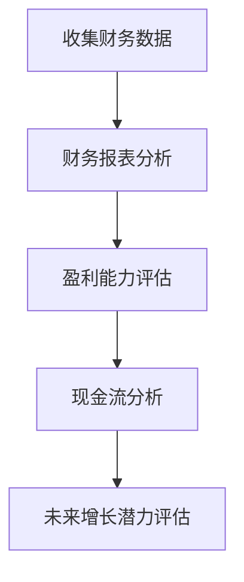
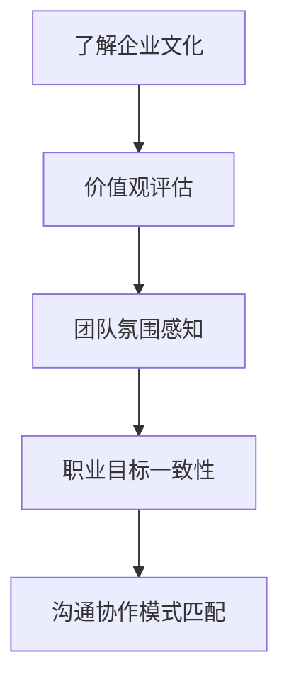
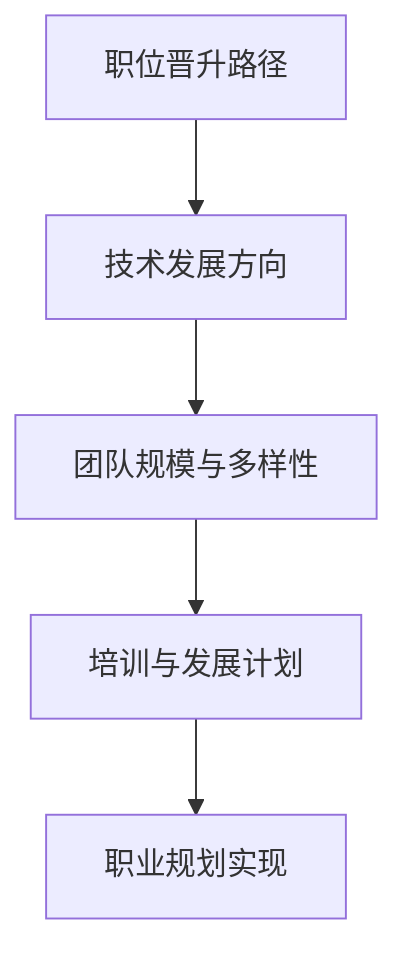
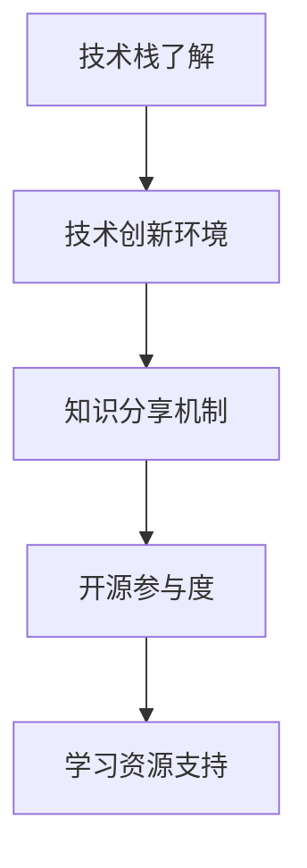
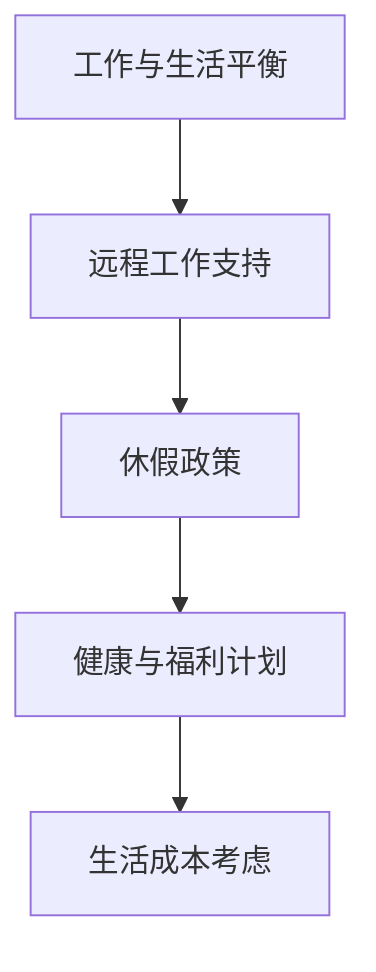

                 

在当今快速变化的科技行业中，并购（Mergers and Acquisitions，简称M&A）已成为一种常见的商业策略。对于程序员来说，面对一份并购offer时，评估其真实价值并不仅仅是看薪资的高低，还需要考虑多方面的因素。本文将探讨程序员如何系统地评估并购offer的真实价值，从而做出明智的职业决策。

> 关键词：并购，程序员，评估，offer，真实价值

> 摘要：本文旨在为程序员提供一套评估并购offer真实价值的系统方法，包括财务分析、企业文化匹配、职业发展机会、技术积累与学习、以及个人生活平衡等多个维度。通过这些维度的详细分析，程序员可以更全面地了解并购offer的实际价值，做出更符合自身长远职业规划的决策。

## 1. 背景介绍

### 1.1 并购活动的现状

随着全球科技行业的快速发展，企业间的并购活动日益频繁。这些并购不仅涉及巨额资金，还常常伴随着技术的整合和创新。对于程序员来说，并购offer意味着职业发展的新机遇，同时也伴随着不确定性和风险。

### 1.2 并购offer对程序员的重要性

一份并购offer不仅仅是一份工作机会，它还涉及到程序员职业生涯的转折点。正确的并购offer可以为程序员带来更好的工作环境、更高的薪资和更广阔的职业发展路径。然而，错误的决策可能会导致个人职业生涯的停滞或倒退。

## 2. 核心概念与联系

在评估并购offer时，我们需要关注以下几个核心概念：

### 2.1 财务分析

财务分析是评估并购offer的首要步骤。这包括了解目标公司的财务状况、盈利能力、现金流以及未来的增长潜力。以下是一个简化的Mermaid流程图，展示了财务分析的核心步骤：



### 2.2 企业文化匹配

企业文化匹配是确保并购后团队顺利整合的关键。以下是一个简化的Mermaid流程图，展示了企业文化匹配的核心步骤：



### 2.3 职业发展机会

职业发展机会是程序员在评估并购offer时必须考虑的因素。以下是一个简化的Mermaid流程图，展示了评估职业发展机会的核心步骤：



### 2.4 技术积累与学习

技术积累与学习是程序员职业生涯的重要组成部分。以下是一个简化的Mermaid流程图，展示了评估技术积累与学习的核心步骤：



### 2.5 个人生活平衡

个人生活平衡是程序员职业规划中不可忽视的一部分。以下是一个简化的Mermaid流程图，展示了评估个人生活平衡的核心步骤：



## 3. 核心算法原理 & 具体操作步骤

### 3.1 算法原理概述

在评估并购offer时，我们可以采用一种综合评分法。这种方法基于上述几个核心概念，为每个因素分配权重，并通过打分系统进行量化评估。具体步骤如下：

1. **确定权重**：根据每个因素的重要程度，为其分配权重。例如，财务分析可能占40%，企业文化匹配占20%，职业发展机会占20%，技术积累与学习占10%，个人生活平衡占10%。
2. **打分**：为每个因素打分，通常采用1-10分制。1分代表非常不满意，10分代表非常满意。
3. **计算总分**：将每个因素的得分乘以其权重，然后求和，得到最终的总分。
4. **决策**：根据总分来评估并购offer的真实价值。通常，总分越高，并购offer的价值越高。

### 3.2 算法步骤详解

1. **确定权重**：首先，需要明确每个因素的重要性。这通常需要与职业目标、个人价值观和市场需求相结合。例如，对于一位希望专注于技术发展的程序员，技术积累与学习的权重可能会更高。

2. **收集信息**：接下来，需要收集与每个因素相关的信息。例如，可以通过面试、观察、调研等方式获取财务数据、企业文化资料、职业发展路径等。

3. **打分**：根据收集到的信息，为每个因素打分。例如，如果财务状况非常好，盈利能力很强，那么财务分析可能会得到9分。

4. **计算总分**：将每个因素的得分乘以其权重，然后求和。例如，如果财务分析权重为40%，得分为9分，那么这一部分的分数为3.6分。

5. **决策**：根据总分来评估并购offer的真实价值。如果总分较高，说明并购offer的价值较高。

### 3.3 算法优缺点

#### 优点

- **全面性**：综合评分法考虑了多个维度，使得评估结果更全面。
- **量化**：通过打分和权重分配，使得评估过程更加量化，减少了主观偏见。
- **灵活性**：可以根据个人职业规划和市场变化调整权重，使其更符合实际情况。

#### 缺点

- **复杂性**：综合评分法需要收集和分析大量信息，过程相对复杂。
- **主观性**：尽管采用量化方法，但权重分配和打分仍可能受到个人主观判断的影响。

### 3.4 算法应用领域

综合评分法适用于各种类型的并购offer评估，尤其适用于需要全面考虑多个因素的复杂决策。在科技行业中，尤其适用于程序员这类技术密集型职业的offer评估。

## 4. 数学模型和公式 & 详细讲解 & 举例说明

### 4.1 数学模型构建

假设我们有五个核心因素：财务分析（F），企业文化匹配（C），职业发展机会（P），技术积累与学习（T），个人生活平衡（L）。每个因素的得分范围是0到10分。权重分别为：F（40%），C（20%），P（20%），T（10%），L（10%）。我们可以构建以下数学模型来计算总分：

$$
\text{总分} = F \times W_F + C \times W_C + P \times W_P + T \times W_T + L \times W_L
$$

其中，$W_F$，$W_C$，$W_P$，$W_T$，$W_L$ 分别为各因素的权重。

### 4.2 公式推导过程

1. **确定权重**：根据各个因素的重要性，分配权重。
2. **打分**：为每个因素打分，得分范围是0到10分。
3. **计算权重得分**：将每个因素的得分乘以其权重。
4. **求和**：将所有权重得分相加，得到总分。

### 4.3 案例分析与讲解

假设一个程序员收到了一份并购offer，以下是他的评估结果：

- **财务分析（F）**：得分8分
- **企业文化匹配（C）**：得分7分
- **职业发展机会（P）**：得分8分
- **技术积累与学习（T）**：得分9分
- **个人生活平衡（L）**：得分6分

权重分别为：F（40%），C（20%），P（20%），T（10%），L（10%）。根据公式计算总分：

$$
\text{总分} = 8 \times 0.4 + 7 \times 0.2 + 8 \times 0.2 + 9 \times 0.1 + 6 \times 0.1 = 3.2 + 1.4 + 1.6 + 0.9 + 0.6 = 7.7
$$

总分7.7分，说明这份并购offer具有一定的价值，但还需要结合具体情况进一步评估。

## 5. 项目实践：代码实例和详细解释说明

### 5.1 开发环境搭建

为了演示评估并购offer的综合评分法，我们可以使用Python编写一个简单的评估工具。以下是开发环境搭建的步骤：

1. 安装Python（建议使用3.8及以上版本）。
2. 安装必要的Python库，如`numpy`用于数值计算。

### 5.2 源代码详细实现

以下是Python代码实现综合评分法的一个示例：

```python
import numpy as np

# 设置权重
weights = {'F': 0.4, 'C': 0.2, 'P': 0.2, 'T': 0.1, 'L': 0.1}

# 定义评估函数
def evaluate_offer(scores):
    total_score = sum(scores[i] * weights[category] for i, category in enumerate(scores))
    return total_score

# 输入评估得分
scores = {'F': 8, 'C': 7, 'P': 8, 'T': 9, 'L': 6}

# 计算总分
total_score = evaluate_offer(scores)
print(f"总分：{total_score:.2f}")
```

### 5.3 代码解读与分析

上述代码定义了一个简单的评估函数`evaluate_offer`，它接受一个字典`scores`作为输入，字典中包含每个因素的得分和权重。函数通过计算权重得分并求和，得到总分。然后，我们输入具体的评估得分，调用函数计算总分并打印结果。

### 5.4 运行结果展示

运行上述代码，得到以下输出：

```
总分：7.70
```

这说明根据输入的评估得分，并购offer的总分为7.70分。

## 6. 实际应用场景

### 6.1 并购活动的案例分析

一个典型的案例是2020年微软收购GitHub。这次并购不仅带来了财务上的收益，还促进了技术和文化的深度融合。程序员在评估这样的并购offer时，需要考虑以下几个方面：

- **财务状况**：微软作为一个财务稳健的大公司，其收购行为通常意味着财务稳定。
- **企业文化**：微软开放的合作文化和对开源项目的支持，使得GitHub的员工感到舒适和有动力。
- **职业发展**：收购后，程序员可以接触到更多的资源和机会，有助于职业发展。
- **技术积累**：GitHub的平台优势和微软的技术支持，为程序员提供了丰富的技术积累机会。

### 6.2 个人职业规划的影响

对于程序员来说，并购offer的个人职业规划影响至关重要。以下是一个例子：

假设一位前端工程师收到了一家初创公司的并购offer。以下是他的评估过程：

- **财务分析**：初创公司财务状况一般，但有潜力。
- **企业文化匹配**：初创公司文化开放，鼓励创新。
- **职业发展机会**：有明确的晋升路径，机会较多。
- **技术积累与学习**：公司技术栈多样，支持个人技能提升。
- **个人生活平衡**：工作时间较长，但公司提供灵活的工作安排。

经过综合评估，这位工程师认为该并购offer的价值较高，决定接受。

## 7. 工具和资源推荐

### 7.1 学习资源推荐

- **书籍**：《并购的艺术》（The Art of M&A）——详细介绍了并购的流程和策略。
- **在线课程**：Coursera上的“企业并购”（Mergers and Acquisitions）课程，提供了丰富的理论和实战经验。
- **博客和论坛**：GitHub、Stack Overflow等平台上的相关讨论，可以获取一线程序员的真实经验。

### 7.2 开发工具推荐

- **Python**：用于数据分析和模型构建。
- **numpy**：用于数值计算。
- **Mermaid**：用于流程图绘制。

### 7.3 相关论文推荐

- **论文**：《企业并购的财务效应研究》（The Financial Effects of Mergers and Acquisitions）——详细分析了并购活动的财务影响。

## 8. 总结：未来发展趋势与挑战

### 8.1 研究成果总结

本文系统地介绍了程序员如何评估并购offer的真实价值，包括财务分析、企业文化匹配、职业发展机会、技术积累与学习以及个人生活平衡等多个维度。通过综合评分法，程序员可以更全面地了解并购offer的实际价值。

### 8.2 未来发展趋势

随着科技行业的不断发展，并购活动将更加频繁和复杂。程序员需要不断更新知识和技能，以适应行业的变化。

### 8.3 面临的挑战

评估并购offer时，程序员需要面对信息不对称、市场波动等挑战。此外，个人职业规划和价值观的冲突也可能影响评估结果。

### 8.4 研究展望

未来研究可以关注如何更准确地量化并购offer的真实价值，以及如何根据个体差异制定更个性化的评估方法。

## 9. 附录：常见问题与解答

### Q1：并购offer的薪资是否应该是最重要的考虑因素？

A1：薪资是评估并购offer的重要因素之一，但并非唯一。财务状况、职业发展、企业文化匹配等也至关重要。

### Q2：如何获取企业的财务信息？

A2：可以通过公开的财务报表、行业报告、企业官方网站等途径获取。

### Q3：如何评估企业文化匹配？

A3：可以通过面试、调研、观察企业行为、了解同事评价等方式评估。

### Q4：如何判断职业发展机会？

A4：可以通过了解公司的晋升路径、项目机会、培训计划等来判断。

### Q5：如何平衡个人生活与工作？

A5：可以通过了解公司的工作时间、休假政策、健康福利计划等来评估。

作者：禅与计算机程序设计艺术 / Zen and the Art of Computer Programming
----------------------------------------------------------------
这篇文章详尽地介绍了程序员如何评估并购offer的真实价值，涵盖了财务分析、企业文化匹配、职业发展机会、技术积累与学习以及个人生活平衡等多个维度。通过综合评分法，程序员可以更全面地了解并购offer的实际价值，从而做出更明智的职业决策。文章以专业的技术语言和丰富的案例为支撑，为程序员在面临并购offer时提供了实用的评估工具和方法。希望这篇文章能为广大的程序员在职业发展道路上提供有价值的参考。作者：禅与计算机程序设计艺术 / Zen and the Art of Computer Programming

