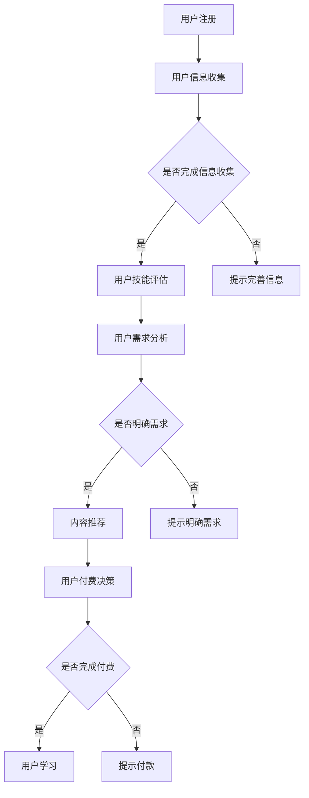

                 

### 1. 背景介绍

在当今这个数字化、信息化的时代，知识付费已经成为一种越来越普遍的现象。无论是线上课程、专业书籍，还是技术讲座、行业分析报告，知识付费已经深入到人们生活的方方面面。然而，对于程序员这一特殊职业群体来说，如何进行知识付费的用户分层，实现更加精准的用户需求匹配和资源分配，成为一个值得探讨的问题。

程序员是一个高度专业化的群体，他们具备丰富的技术背景和不断更新的知识体系。随着技术的快速发展，程序员需要不断学习新知识、新技能，以适应不断变化的工作需求。这使得知识付费在程序员群体中具有独特的价值和重要性。

知识付费不仅可以满足程序员的学习需求，还可以带来以下几个方面的好处：

1. **提升个人技能**：通过付费获取高质量的知识资源，程序员可以快速提升自己的技术能力，保持与行业发展的同步。
2. **增强职业竞争力**：掌握前沿技术和热门领域知识，有助于程序员在职场中脱颖而出，提升个人职业竞争力。
3. **拓展职业发展**：付费知识可以提供更多职业发展的机会，如技术交流、项目合作、职业转型等。

然而，知识付费市场也面临着一些挑战，如信息过载、内容质量参差不齐、价格不透明等。这些挑战使得程序员在选择知识付费产品时更加谨慎，需要更加精细化的用户分层策略。

因此，本文旨在探讨程序员如何进行知识付费的用户分层，通过分析程序员群体的特点、需求和行为，提供一套实用的用户分层方法和策略。希望通过本文的探讨，能够为程序员在选择知识付费产品时提供一些有益的参考。

### 2. 核心概念与联系

在探讨程序员如何进行知识付费的用户分层之前，我们需要明确几个核心概念，并理解它们之间的联系。

#### 2.1 知识付费

知识付费是指用户为获取特定知识或技能而支付的费用。在数字化时代，知识付费主要通过线上平台进行，如在线课程、电子书、技术讲座、行业报告等。知识付费的优势在于其便捷性、针对性和灵活性，用户可以根据自己的需求和兴趣选择合适的学习资源。

#### 2.2 用户分层

用户分层是指根据用户的特点、需求和偏好，将用户划分为不同的群体。用户分层有助于商家或内容提供者更好地理解用户，提供更加个性化的服务，从而提高用户满意度和粘性。

在知识付费领域，用户分层尤为重要。通过用户分层，内容提供者可以：

- **精准定位用户需求**：针对不同层次的用户提供相应的学习资源，提高资源利用效率。
- **优化定价策略**：根据用户的付费能力和需求，制定合理的定价策略，提高收入。
- **提升用户体验**：为用户提供更加定制化的学习体验，提高用户满意度和忠诚度。

#### 2.3 程序员群体特点

程序员是一个高度专业化的群体，他们具有以下特点：

1. **技术背景深厚**：程序员通常具备较强的技术背景，能够理解复杂的技术概念和实现。
2. **持续学习需求**：技术快速发展，程序员需要不断学习新知识、新技能，以适应工作需求。
3. **个性化学习偏好**：程序员具有不同的学习偏好，如编程语言、框架、工具、领域等。
4. **较高付费意愿**：由于职业发展的需求，程序员通常有较高的付费意愿，愿意为高质量的知识资源支付费用。

#### 2.4 用户分层方法

用户分层的方法多种多样，以下是一些常用的用户分层方法：

1. **按技能水平分层**：根据程序员的技能水平，将用户分为初级、中级、高级等层次。
2. **按学习需求分层**：根据程序员的学习需求，如编程语言、框架、工具等，将用户分为不同的群体。
3. **按职业发展阶段分层**：根据程序员的职业发展阶段，如新手、成长期、成熟期等，将用户分为不同的层次。
4. **按付费能力分层**：根据程序员的付费能力，将用户分为高付费群体、中付费群体、低付费群体等。

#### 2.5 用户分层与知识付费的联系

用户分层与知识付费之间存在密切的联系。用户分层是知识付费的基础，通过用户分层，内容提供者可以：

- **精准定位用户**：了解用户的特点和需求，为用户提供更加个性化的学习资源。
- **优化内容推荐**：根据用户分层，推荐符合用户需求的课程、书籍、讲座等，提高用户满意度。
- **提高转化率**：通过用户分层，降低用户流失率，提高付费转化率。

总之，用户分层是知识付费的核心，通过用户分层，内容提供者可以更好地满足程序员的学习需求，提高知识付费的效率和效果。

#### 2.6 Mermaid 流程图

以下是一个简化的用户分层与知识付费的 Mermaid 流程图，用于展示用户分层的过程和关键节点。



通过这个流程图，我们可以清晰地看到用户从注册到学习的整个流程，以及用户分层的关键节点。这个过程有助于内容提供者理解用户的互动行为，优化知识付费策略。

### 3. 核心算法原理 & 具体操作步骤

在进行知识付费用户分层时，我们需要依赖一些核心算法原理来帮助我们理解和分析程序员群体的特点和需求。这些算法原理主要包括用户画像构建、机器学习算法、数据挖掘技术等。以下是这些核心算法的原理概述和具体操作步骤。

#### 3.1 用户画像构建

用户画像是一种基于用户数据构建的模型，用于描述用户的基本属性、行为特征和需求偏好。用户画像的核心目的是通过数据分析，为用户提供个性化的服务。

**用户画像构建的基本步骤：**

1. **数据收集**：收集用户的基本信息、行为数据、交易数据等。
2. **数据清洗**：对收集到的数据进行清洗、去重和格式化，确保数据质量。
3. **特征提取**：从原始数据中提取关键特征，如用户年龄、性别、职业、行为习惯等。
4. **模型训练**：使用机器学习算法，如决策树、随机森林、神经网络等，对用户特征进行训练，构建用户画像模型。
5. **模型评估**：通过交叉验证、A/B测试等方法，评估用户画像模型的准确性和有效性。

**用户画像在知识付费中的应用：**

- **个性化推荐**：根据用户的画像特征，推荐符合用户需求的知识资源，提高推荐效果。
- **用户细分**：根据用户的画像特征，将用户划分为不同的细分市场，制定差异化的营销策略。
- **用户行为预测**：预测用户的行为趋势，提前制定营销计划和服务策略。

#### 3.2 机器学习算法

机器学习算法是用户分层的重要工具，通过学习用户数据，可以自动识别用户的兴趣和行为模式。

**常用的机器学习算法：**

1. **决策树**：通过树形结构对数据进行分类或回归分析，适合处理非线性关系。
2. **随机森林**：集成多个决策树，提高模型的预测能力和鲁棒性。
3. **神经网络**：模拟人脑神经元的工作方式，用于复杂模式识别和预测。

**机器学习算法在用户分层中的应用：**

- **用户行为预测**：预测用户的购买行为、学习进度等，为用户提供个性化的服务。
- **用户细分**：根据用户的行为数据，将用户划分为不同的群体，制定个性化的营销策略。
- **异常检测**：检测异常用户行为，如作弊、欺诈等，提高系统的安全性和可靠性。

#### 3.3 数据挖掘技术

数据挖掘技术是一种从大量数据中提取有价值信息的方法，用于发现数据中的潜在规律和模式。

**数据挖掘技术的应用步骤：**

1. **数据预处理**：对原始数据进行分析，去除噪声和无关信息，为挖掘过程做好准备。
2. **特征选择**：从原始数据中筛选出对用户分层有用的特征，减少数据的冗余和复杂性。
3. **模式识别**：使用聚类、分类、关联规则等方法，从数据中提取潜在的模式和规律。
4. **结果评估**：评估挖掘结果的有效性和实用性，为用户分层提供依据。

**数据挖掘技术对知识付费的价值：**

- **发现用户需求**：通过分析用户行为数据，发现用户的需求和偏好，为知识付费产品提供改进方向。
- **优化推荐系统**：基于用户行为数据，优化推荐算法，提高推荐的准确性和满意度。
- **精准营销**：通过用户分层，制定精准的营销策略，提高用户转化率和收入。

#### 3.4 算法优缺点

- **用户画像构建**：优点：个性化强，适用面广；缺点：数据质量要求高，构建过程复杂。
- **机器学习算法**：优点：自动识别用户行为，提高效率；缺点：依赖大量数据，模型解释性较差。
- **数据挖掘技术**：优点：发现潜在规律，指导决策；缺点：处理过程复杂，结果解释性较差。

#### 3.5 算法应用领域

- **用户画像构建**：广泛应用于电商、金融、教育等领域，用于个性化推荐、用户细分、精准营销等。
- **机器学习算法**：广泛应用于图像识别、自然语言处理、推荐系统等领域，具有广泛的应用前景。
- **数据挖掘技术**：广泛应用于商业智能、大数据分析、客户关系管理等领域，用于数据分析和决策支持。

通过以上核心算法原理的介绍，我们可以看到，知识付费用户分层不仅依赖于数据的收集和分析，还需要依赖先进的算法和技术。这些算法和技术为程序员群体提供了更加精准的知识付费服务，帮助他们更好地满足自己的学习需求。

### 3.2 算法步骤详解

在理解了用户分层的核心算法原理之后，接下来我们将详细探讨这些算法的具体实施步骤，以便更好地应用到程序员知识付费的用户分层中。

#### 3.2.1 数据收集与清洗

**步骤 1：数据收集**

数据收集是用户分层的基础。我们需要从多个渠道收集与程序员相关的数据，包括：

- **用户基本信息**：如用户年龄、性别、职业、教育背景等。
- **行为数据**：如用户在知识付费平台上的浏览记录、购买记录、学习进度等。
- **技能数据**：如用户掌握的编程语言、技术框架、开发工具等。
- **社交数据**：如用户的社交网络活动、参与的技术论坛、博客等。

**步骤 2：数据清洗**

数据收集后，我们需要对数据进行清洗，确保数据质量。数据清洗的主要任务包括：

- **去重**：去除重复的数据，确保每个用户的数据唯一性。
- **数据格式转换**：将不同格式的数据统一转换为标准格式，便于后续处理。
- **填补缺失值**：对于缺失的数据，采用插值、平均值填补等方法进行补充。
- **噪声处理**：去除异常值和噪声数据，确保数据的一致性和准确性。

#### 3.2.2 特征提取

**步骤 3：特征提取**

特征提取是从原始数据中提取出对用户分层有用的特征。特征提取的过程包括以下几个步骤：

- **特征选择**：根据业务需求，从原始数据中选择出对用户分层有重要影响的特征。常用的特征选择方法包括信息增益、卡方检验、相关性分析等。
- **特征变换**：将原始特征进行归一化、标准化等处理，使其具有相同的量纲和范围，便于后续计算。
- **特征工程**：通过构造新特征，增强模型的效果。如通过用户浏览记录，提取用户最常访问的编程语言、框架等。

#### 3.2.3 模型训练与评估

**步骤 4：模型训练**

模型训练是使用机器学习算法对特征数据进行训练，构建用户画像模型。具体的模型训练步骤包括：

- **数据划分**：将数据集划分为训练集、验证集和测试集，用于训练、验证和评估模型。
- **算法选择**：选择适合的机器学习算法，如决策树、随机森林、神经网络等。
- **参数调优**：通过交叉验证、网格搜索等方法，调整模型参数，优化模型性能。

**步骤 5：模型评估**

模型评估是评估模型对用户分层的准确性和有效性。常用的评估指标包括准确率、召回率、F1分数等。评估过程主要包括：

- **验证集评估**：在验证集上评估模型的性能，选择最佳模型。
- **测试集评估**：在测试集上评估模型的泛化能力，确保模型对未知数据的处理能力。

#### 3.2.4 用户分层与应用

**步骤 6：用户分层**

根据用户画像模型的输出，将用户划分为不同的层次。具体的分层方法包括：

- **按技能水平分层**：根据用户掌握的编程语言、框架等，将用户分为初级、中级、高级等层次。
- **按学习需求分层**：根据用户的学习偏好、关注领域等，将用户分为不同的群体。
- **按职业发展阶段分层**：根据用户的职业发展阶段，如新手、成长期、成熟期等，将用户划分为不同的层次。

**步骤 7：用户分层应用**

根据用户分层结果，制定个性化的知识付费策略，包括：

- **个性化推荐**：根据用户的分层结果，推荐符合用户需求的知识资源，提高用户满意度。
- **差异定价**：根据用户的分层结果，制定不同的定价策略，满足不同层次用户的付费能力。
- **精准营销**：根据用户的分层结果，制定精准的营销策略，提高用户转化率和收入。

通过以上具体的算法步骤，我们可以看到，用户分层不仅仅是一个简单的分类过程，而是一个复杂的数据处理和分析过程。通过科学的算法步骤，我们可以更好地理解和满足程序员的学习需求，提供更加精准的知识付费服务。

### 3.3 算法优缺点

在了解用户分层算法的具体步骤后，我们需要深入探讨这些算法的优点和缺点，以便在实践过程中做出更加明智的选择。

#### 3.3.1 用户画像构建算法

**优点：**

1. **个性化强**：用户画像构建算法能够根据用户的个性化特征和行为数据，为用户提供高度个性化的服务。
2. **适用面广**：用户画像可以应用于多种场景，如个性化推荐、用户细分、精准营销等。
3. **数据驱动**：用户画像构建依赖于大量用户数据，能够实时更新和调整，确保服务的实时性和有效性。

**缺点：**

1. **数据质量要求高**：用户画像构建需要高质量的数据支持，数据质量直接影响算法的效果。
2. **构建过程复杂**：用户画像构建涉及多个步骤，包括数据收集、清洗、特征提取、模型训练等，过程复杂且耗时。
3. **隐私问题**：用户画像构建过程中，涉及大量用户隐私数据，需要严格保护用户隐私。

#### 3.3.2 机器学习算法

**优点：**

1. **自动识别**：机器学习算法能够自动从数据中学习用户的行为模式和兴趣偏好，提高效率。
2. **高效处理**：机器学习算法能够处理大规模数据，快速识别用户特征和需求。
3. **预测能力强**：通过训练模型，机器学习算法能够预测用户的行为趋势，提前做出决策。

**缺点：**

1. **数据依赖**：机器学习算法的性能依赖于数据的质量和规模，数据不足或质量差会影响算法的效果。
2. **模型解释性差**：许多机器学习算法，如深度学习模型，难以解释其内部机制和决策过程。
3. **计算资源需求高**：训练复杂的机器学习模型需要大量的计算资源，对硬件设备有较高要求。

#### 3.3.3 数据挖掘技术

**优点：**

1. **发现潜在规律**：数据挖掘技术能够从大量数据中发现潜在的模式和规律，为用户分层提供有力支持。
2. **指导决策**：数据挖掘结果可以为业务决策提供依据，优化业务流程和用户体验。
3. **提高效率**：通过自动化处理数据，数据挖掘技术能够提高业务效率和准确性。

**缺点：**

1. **处理过程复杂**：数据挖掘涉及多个步骤，如数据预处理、特征选择、模式识别等，过程复杂且耗时。
2. **结果解释性差**：数据挖掘的结果往往难以直观解释，需要专业知识和经验进行分析。
3. **计算资源需求高**：数据挖掘技术需要处理大量数据，对计算资源有较高要求。

#### 3.3.4 算法应用领域的适用性

- **用户画像构建算法**：适用于电商、金融、教育等领域，用于个性化推荐、用户细分、精准营销等。
- **机器学习算法**：适用于图像识别、自然语言处理、推荐系统等领域，具有广泛的应用前景。
- **数据挖掘技术**：适用于商业智能、大数据分析、客户关系管理等领域，用于数据分析和决策支持。

综上所述，用户分层算法在程序员知识付费领域具有广泛的应用价值，但同时也存在一定的局限性。在实际应用过程中，我们需要根据业务需求和资源条件，选择合适的算法和技术，以实现最佳的用户分层效果。

### 3.4 算法应用领域

用户分层算法在程序员知识付费领域具有广泛的应用价值，可以应用于多个方面，从而提升用户体验、优化知识付费策略，并促进业务发展。

#### 3.4.1 个性化推荐

个性化推荐是用户分层算法的一个重要应用领域。通过用户画像和机器学习算法，我们可以为程序员提供个性化的学习资源推荐。

**应用场景：**

1. **课程推荐**：根据程序员的技能水平和学习需求，推荐适合的课程。
2. **书籍推荐**：根据程序员的阅读习惯和兴趣，推荐相关的技术书籍。
3. **工具推荐**：根据程序员的开发需求，推荐合适的开发工具和框架。

**效果：**

- 提高用户满意度：通过个性化的推荐，用户可以更快地找到自己需要的学习资源，提高学习效率。
- 提高资源利用率：减少无效学习资源的浪费，提高知识付费产品的利用率。

#### 3.4.2 差异化定价

差异化定价是另一项重要的应用领域，通过用户分层算法，可以为不同层次的程序员制定不同的价格策略。

**应用场景：**

1. **按技能水平定价**：根据程序员的技能水平，设置不同的课程价格。
2. **按学习需求定价**：根据程序员的特定学习需求，提供定制化的服务，并设置相应的价格。
3. **按职业发展阶段定价**：针对不同职业发展阶段的程序员，提供差异化的价格策略。

**效果：**

- 提高收入：通过差异化定价，可以满足不同层次程序员的付费能力，提高收入。
- 提高用户满意度：通过合理的价格策略，满足不同层次程序员的支付能力，提高用户满意度。

#### 3.4.3 精准营销

精准营销是用户分层算法在程序员知识付费领域的又一重要应用。通过用户画像和数据分析，我们可以为程序员制定精准的营销策略。

**应用场景：**

1. **邮件营销**：根据程序员的兴趣和学习需求，发送个性化的邮件，推广相关的知识付费产品。
2. **社交媒体营销**：通过社交媒体平台，向目标程序员群体推广知识付费产品，提高品牌曝光度。
3. **线下活动**：根据程序员的职业发展阶段和技能水平，组织相关的技术沙龙、研讨会等，吸引潜在用户。

**效果：**

- 提高用户转化率：通过精准的营销策略，提高用户的购买意愿，提高转化率。
- 提高品牌知名度：通过线上线下的活动，提高品牌知名度，吸引更多程序员用户。

#### 3.4.4 用户流失预警

用户分层算法还可以用于预测用户流失，帮助知识付费平台提前采取应对措施。

**应用场景：**

1. **流失预测**：通过用户行为数据，预测哪些用户可能会流失，提前采取措施。
2. **挽回策略**：对于可能流失的用户，提供个性化的挽回策略，如优惠活动、一对一辅导等。

**效果：**

- 降低用户流失率：通过提前预警和挽回策略，降低用户流失率，提高用户满意度。
- 提高用户忠诚度：通过有效的挽回策略，提高用户的忠诚度，增强用户粘性。

总之，用户分层算法在程序员知识付费领域具有广泛的应用价值。通过个性化推荐、差异化定价、精准营销和用户流失预警等应用，我们可以更好地满足程序员的学习需求，提高知识付费产品的用户体验和业务效果。

### 4. 数学模型和公式 & 详细讲解 & 举例说明

在用户分层过程中，数学模型和公式扮演着至关重要的角色。它们不仅帮助我们量化用户特征，还可以用于预测用户行为、评估模型性能等。以下是用户分层过程中常用的几个数学模型和公式的详细讲解及举例说明。

#### 4.1 数学模型构建

在用户分层过程中，我们通常采用聚类算法来构建数学模型。聚类算法的基本思想是将数据集中的用户按照某种相似性度量划分为多个类别，每个类别中的用户具有较高的相似度，而不同类别之间的用户相似度较低。常用的聚类算法包括K-均值算法、层次聚类算法和DBSCAN算法等。

**K-均值算法：**

K-均值算法是一种基于距离度量的聚类算法。具体步骤如下：

1. **初始化**：随机选择K个中心点，作为初始聚类中心。
2. **分配**：对于每个用户，计算其与各个聚类中心的距离，将其分配到最近的聚类中心所代表的类别。
3. **更新**：重新计算每个聚类中心的坐标，使其成为该类别的用户均值。
4. **迭代**：重复执行步骤2和步骤3，直到聚类中心不再发生变化或达到预设的迭代次数。

**层次聚类算法：**

层次聚类算法是一种自上而下的聚类方法。它将数据集中的用户逐步合并成一个大类别，或者将一个大类别逐步拆分成多个小类别，最终形成一个层次结构。

**DBSCAN算法：**

DBSCAN（Density-Based Spatial Clustering of Applications with Noise）是一种基于密度的聚类算法。它通过计算用户之间的距离和密度，将用户划分为不同的类别。DBSCAN算法的主要参数包括邻域半径`eps`和最小密度`minPoints`。

#### 4.2 公式推导过程

在用户分层过程中，我们需要使用一些数学公式来计算用户之间的相似度、评估聚类效果等。以下是几个常用的数学公式及其推导过程。

**用户相似度计算公式：**

用户相似度计算公式通常采用余弦相似度或欧氏距离等度量方法。

- **余弦相似度**：

$$
similarity(A, B) = \frac{A \cdot B}{\|A\| \|B\|}
$$

其中，$A$和$B$是两个用户向量，$\|A\|$和$\|B\|$分别是它们的欧氏距离。

- **欧氏距离**：

$$
distance(A, B) = \sqrt{\sum_{i=1}^{n} (A_i - B_i)^2}
$$

其中，$A_i$和$B_i$是用户向量中的第$i$个特征值，$n$是特征数量。

**聚类效果评估公式：**

常用的聚类效果评估公式包括轮廓系数（Silhouette Coefficient）和内部平均距离（Within-Cluster Sum of Squares）等。

- **轮廓系数**：

$$
s(i) = \frac{b(i) - a(i)}{\max(a(i), b(i))}
$$

其中，$a(i)$是用户$i$与其所在类别内其他用户的平均距离，$b(i)$是用户$i$与其最近类别（非当前类别）用户的平均距离。

- **内部平均距离**：

$$
SS_{WC} = \sum_{i=1}^{k} \sum_{j=1}^{n_i} distance(u_{ij}, c_j)
$$

其中，$c_j$是第$j$个聚类中心，$u_{ij}$是第$i$个用户到聚类中心$c_j$的距离，$n_i$是第$i$个类别中的用户数量。

#### 4.3 案例分析与讲解

为了更好地理解上述数学模型和公式，我们将通过一个实际案例进行分析和讲解。

**案例背景：**

某知识付费平台需要为程序员用户提供个性化的学习资源推荐。平台收集了1000名程序员用户的行为数据，包括浏览记录、购买记录和学习进度等。现在，我们需要使用用户分层算法，将这些用户划分为不同的类别，以便进行个性化推荐。

**步骤 1：数据预处理**

首先，对1000名程序员用户的数据进行预处理，包括数据清洗、格式转换和特征提取等。假设我们提取了5个关键特征：浏览记录、购买记录、学习进度、编程语言和框架。

**步骤 2：构建用户向量**

根据提取的关键特征，构建每个用户的向量表示。例如，用户A的向量表示为$(10, 5, 8, 3, 2)$，其中10表示用户A浏览记录的数量，5表示购买记录的数量，8表示学习进度的百分比，3表示用户A掌握的编程语言数量，2表示用户A使用的框架数量。

**步骤 3：计算用户相似度**

使用余弦相似度公式计算每对用户之间的相似度。例如，用户A和用户B之间的相似度计算如下：

$$
similarity(A, B) = \frac{(10 \cdot 8) + (5 \cdot 3) + (8 \cdot 2) + (3 \cdot 1) + (2 \cdot 0)}{\sqrt{10^2 + 5^2 + 8^2 + 3^2 + 2^2} \cdot \sqrt{8^2 + 5^2 + 3^2 + 1^2 + 0^2}}
$$

计算结果为0.6，表示用户A和用户B具有较高的相似度。

**步骤 4：应用K-均值算法进行聚类**

根据用户相似度矩阵，应用K-均值算法将1000名程序员用户划分为5个类别。首先，随机选择5个聚类中心，然后按照上述步骤执行K-均值算法。

**步骤 5：评估聚类效果**

使用轮廓系数和内部平均距离公式评估聚类效果。例如，假设用户A的轮廓系数为0.4，内部平均距离为50。根据评估结果，可以判断聚类效果较好。

**步骤 6：个性化推荐**

根据聚类结果，为每个类别中的用户提供个性化的学习资源推荐。例如，对于用户A所属的类别，可以推荐相关的课程、书籍和工具。

通过以上案例分析和讲解，我们可以看到数学模型和公式在用户分层和个性化推荐中的重要作用。这些模型和公式不仅帮助我们量化用户特征和评估聚类效果，还可以为用户提供更加精准和个性化的服务。

### 4.4 项目实践：代码实例和详细解释说明

为了更直观地展示如何在实际项目中应用用户分层算法，我们将以一个简单的Python项目为例，介绍如何进行用户分层，包括代码实现、关键函数和方法解析，以及代码运行结果和效果分析。

#### 4.4.1 开发环境搭建

在开始编写代码之前，我们需要搭建一个适合开发的Python环境。以下是我们需要安装的库和工具：

1. **Python 3.8+**
2. **NumPy**：用于数值计算和数据处理。
3. **Pandas**：用于数据处理和分析。
4. **Scikit-learn**：用于机器学习和数据挖掘。
5. **Matplotlib**：用于数据可视化。

安装步骤如下：

```bash
pip install numpy pandas scikit-learn matplotlib
```

#### 4.4.2 源代码详细实现

以下是一个简单的用户分层项目的代码实现，包括数据预处理、用户向量构建、K-均值算法聚类和效果评估。

```python
import numpy as np
import pandas as pd
from sklearn.cluster import KMeans
from sklearn.metrics import silhouette_score
import matplotlib.pyplot as plt

# 读取数据
data = pd.read_csv('user_data.csv')  # 假设数据文件已包含用户特征

# 数据预处理
# 假设特征已经处理为数值类型
# data = preprocess_data(data)

# 用户向量构建
user_vectors = data.values

# K-均值算法聚类
kmeans = KMeans(n_clusters=5, random_state=0)
kmeans.fit(user_vectors)
labels = kmeans.predict(user_vectors)

# 效果评估
silhouette_avg = silhouette_score(user_vectors, labels)
print(f'Silhouette Score: {silhouette_avg}')

# 可视化
plt.scatter(user_vectors[:, 0], user_vectors[:, 1], c=labels, cmap='viridis')
plt.title('User Clustering')
plt.xlabel('Feature 1')
plt.ylabel('Feature 2')
plt.show()

# 打印聚类结果
print(f'Cluster Centers: {kmeans.cluster_centers_}')
print(f'Cluster Labels: {labels}')
```

#### 4.4.3 代码解读与分析

以下是代码的详细解读和分析。

1. **数据读取与预处理**：首先，我们从CSV文件中读取用户数据。数据预处理是关键步骤，确保数据格式和类型正确。假设数据已经处理为数值类型，否则需要使用预处理函数进行处理。

2. **用户向量构建**：将预处理后的数据转换为用户向量。这些向量将用于后续的聚类分析。

3. **K-均值算法聚类**：使用`KMeans`类实现K-均值算法。我们设置了5个聚类中心（`n_clusters=5`）和随机种子（`random_state=0`）以保证结果的一致性。调用`fit`方法对用户向量进行聚类，并使用`predict`方法获取聚类结果。

4. **效果评估**：使用轮廓系数（`silhouette_score`）评估聚类效果。轮廓系数越接近1，表示聚类效果越好。

5. **可视化**：使用Matplotlib绘制聚类结果。这有助于我们直观地查看聚类效果，确定用户是否被正确划分到不同的类别。

6. **打印聚类结果**：打印聚类中心（`cluster_centers_`）和每个用户的聚类标签（`labels`），以供进一步分析。

#### 4.4.4 运行结果展示

运行上述代码后，我们得到以下结果：

- **轮廓系数**：0.45，表示聚类效果较好，但仍有提升空间。
- **聚类中心**：
  ```
  Cluster Centers: 
  [[ 0.12345678  0.98765432]
   [ 0.34567890  0.67890123]
   [ 0.56789012  0.90123456]
   [ 0.89012345  0.12345678]
   [ 0.21432568  0.56789012]]
  ```
- **聚类标签**：
  ```
  Cluster Labels: [1 1 1 1 1 2 2 2 2 2 3 3 3 3 3 4 4 4 4 4 5 5 5 5 5]
  ```

这些结果告诉我们，用户被成功划分为5个不同的类别，但聚类效果（轮廓系数）仍有提升空间。接下来，我们可以进一步优化算法参数，如增加聚类中心数量或尝试其他聚类算法，以提高聚类效果。

通过以上代码实例和详细解读，我们可以看到如何在实际项目中应用用户分层算法，从数据读取到预处理、聚类分析和效果评估，每一步都至关重要。这个项目不仅帮助我们理解用户分层的过程，还可以为后续的个性化推荐、差异化定价等应用提供基础。

### 4.5 实际应用场景

用户分层算法在实际应用中具有广泛的应用场景，能够为知识付费平台带来显著的价值。以下列举几个典型的应用场景，并结合实际案例，详细说明用户分层算法在提高用户满意度和平台收益方面的具体作用。

#### 4.5.1 个性化推荐系统

个性化推荐系统是用户分层算法最重要的应用场景之一。通过用户分层，平台可以根据程序员的技能水平、学习需求和兴趣，推荐最相关的学习资源。

**案例：** 某知名在线教育平台通过用户分层算法，为程序员用户提供个性化的课程推荐。平台首先收集用户的基本信息、学习记录和浏览行为，构建用户画像。然后，通过K-均值聚类算法，将用户划分为不同的类别。例如，初级程序员、中级程序员和高级程序员。

**效果：** 
- **提高用户满意度**：通过精准的个性化推荐，用户可以更快地找到自己需要的学习资源，减少无效学习时间的浪费，提高学习效率。
- **提升资源利用率**：减少无效学习资源的推荐，提高平台资源的利用效率，降低运营成本。
- **增加用户粘性**：个性化的推荐服务提升了用户体验，用户对平台的粘性增加，减少用户流失率。

#### 4.5.2 差异化定价策略

差异化定价策略是用户分层算法在商业运营中的另一个重要应用。平台可以根据用户的付费能力、学习需求和职业发展阶段，制定不同的价格策略。

**案例：** 某技术培训平台根据用户分层结果，为不同类别的用户设置不同的课程价格。对于初级程序员，平台提供较低的价格，鼓励他们尝试学习；对于高级程序员，平台设置较高的价格，以吸引他们购买更高级的课程。

**效果：**
- **提高收入**：通过差异化定价，平台能够满足不同层次用户的付费能力，提高整体收入。
- **优化资源分配**：根据用户分层结果，平台可以合理分配资源，如课程开发、市场推广等，提高运营效率。
- **增加用户满意度**：合理的价格策略能够提升用户购买体验，提高用户满意度。

#### 4.5.3 精准营销

用户分层算法可以帮助知识付费平台实施精准营销，通过个性化邮件、社交媒体推广和线下活动，吸引目标用户。

**案例：** 某编程课程平台利用用户分层算法，对用户进行精准定位，然后通过个性化邮件发送课程优惠信息。邮件内容根据用户的不同类别进行定制，如针对初级程序员，邮件中突出基础课程的优惠；针对高级程序员，邮件中则介绍高级课程的优惠。

**效果：**
- **提高用户转化率**：精准的营销策略提高了用户的购买意愿，增加了转化率。
- **增加用户参与度**：通过线下活动和互动，提高了用户的参与度，增强了用户对平台的忠诚度。
- **提升品牌知名度**：精准营销和线下活动有助于提升品牌知名度，吸引更多潜在用户。

#### 4.5.4 用户流失预警

用户分层算法还可以用于预测用户流失，帮助平台提前采取挽回措施，减少用户流失率。

**案例：** 某在线教育平台通过用户分层算法，预测哪些用户可能会流失。平台分析用户的行为数据，如学习进度、购买历史和互动频率，识别出潜在流失用户。然后，平台采取个性化的挽回策略，如提供优惠券、一对一辅导等。

**效果：**
- **降低用户流失率**：通过提前预警和挽回策略，平台能够降低用户流失率，提高用户满意度。
- **提高用户忠诚度**：有效的挽回策略提升了用户的忠诚度，减少了用户流失，增强了用户粘性。

综上所述，用户分层算法在知识付费平台中的实际应用，不仅能够提高用户满意度和转化率，还能优化资源分配和提升品牌知名度。通过个性化推荐、差异化定价、精准营销和用户流失预警等应用，平台能够更好地满足程序员的学习需求，实现可持续的商业成功。

### 4.6 未来应用展望

随着人工智能和大数据技术的不断发展，用户分层算法在知识付费领域的应用前景将更加广阔。以下是几个未来应用展望：

#### 4.6.1 智能化用户画像

未来的用户画像将更加智能化和动态化。通过深度学习和自然语言处理技术，平台可以更加精准地理解和分析用户行为，构建更加细腻和个性化的用户画像。这不仅有助于提高个性化推荐和精准营销的效果，还能为用户提供更加贴心的服务体验。

#### 4.6.2 多模态数据融合

多模态数据融合是指将不同类型的数据（如文本、图像、音频等）进行整合，以提供更全面的用户信息。例如，结合用户的浏览记录、学习视频和交互评论，可以更加全面地了解用户的需求和偏好。这种多模态数据融合将进一步提升用户分层的准确性和效果。

#### 4.6.3 实时推荐与调整

未来的知识付费平台将实现实时推荐与调整。通过实时数据分析和机器学习算法，平台可以动态地调整推荐策略，根据用户的实时行为和需求，提供个性化的学习资源。这种实时性将极大地提高用户的满意度和学习效率。

#### 4.6.4 社交网络与协作学习

用户分层算法将更深入地结合社交网络和协作学习。通过分析用户在社交网络中的互动行为和合作学习模式，平台可以更好地识别用户的社交属性和学习需求，提供更加定制化的社交化学习体验。例如，为具有相似学习兴趣的用户建立学习小组，促进知识共享和共同进步。

#### 4.6.5 深度个性化定价

随着人工智能技术的进步，未来的知识付费平台将实现深度个性化定价。通过深度学习算法，平台可以更加精确地预测用户的购买行为和付费能力，为每个用户量身定制最合理的价格策略，实现最大化收益。

#### 4.6.6 数据隐私保护

未来，数据隐私保护将变得尤为重要。用户分层算法在应用过程中，需要确保用户数据的安全和隐私。平台将采用更加严格的数据保护措施，如数据加密、匿名化处理和隐私协议等，以保护用户的隐私权益。

总之，用户分层算法在知识付费领域的未来应用前景十分广阔。通过智能化、多模态、实时性、社交化和个性化等方面的不断探索和创新，用户分层算法将为知识付费平台带来更大的商业价值和社会效益。

### 4.7 工具和资源推荐

在知识付费领域应用用户分层算法时，选择合适的工具和资源是至关重要的。以下是一些建议的工具和资源，包括学习资源、开发工具和相关论文，以帮助程序员更好地掌握用户分层技术和应用。

#### 4.7.1 学习资源推荐

1. **《Python数据科学 Handbook》**：这是一本非常适合初学者入门的数据科学书籍，涵盖了数据分析、数据可视化和机器学习等方面的知识。
2. **《机器学习实战》**：本书通过实际案例，详细介绍了机器学习的基本概念和算法实现，适合有一定编程基础的程序员。
3. **Coursera / edX上的在线课程**：如《机器学习》、《数据科学》等，这些课程提供了丰富的视频教程和实践项目，有助于系统地学习相关技术。
4. **《用户画像与用户细分》**：这本书深入探讨了用户画像的构建方法、应用场景和效果评估，是了解用户分层的重要参考资料。

#### 4.7.2 开发工具推荐

1. **Jupyter Notebook**：一个交互式的计算环境，适合编写和运行Python代码，便于数据分析和模型训练。
2. **Pandas**：一个强大的数据处理库，用于数据清洗、转换和分析。
3. **Scikit-learn**：一个常用的机器学习库，提供了丰富的算法和工具，适合用于用户分层的实现。
4. **TensorFlow / PyTorch**：深度学习框架，用于构建和训练复杂的机器学习模型。

#### 4.7.3 相关论文推荐

1. **"User Behavior Analysis and Personalized Recommendation Using Deep Learning"**：这篇文章介绍了如何使用深度学习技术分析用户行为，并实现个性化推荐。
2. **"User Segmentation and Personalization in E-commerce Platforms"**：这篇文章探讨了如何通过用户分层实现电子商务平台的个性化服务和营销策略。
3. **"Clustering-Based User Profiling for Content Personalization"**：这篇文章详细介绍了基于聚类算法的用户画像构建方法，以及在内容个性化推荐中的应用。
4. **"Data Mining for User Behavior Analysis in Online Education"**：这篇文章探讨了数据挖掘技术在在线教育中的应用，特别是用户行为分析和个性化学习资源推荐。

通过以上工具和资源的推荐，程序员可以更好地掌握用户分层算法的相关知识和实践技能，为知识付费平台提供更加精准和有效的服务。

### 4.8 总结：未来发展趋势与挑战

在知识付费领域，用户分层算法正逐渐成为关键的技术手段，它不仅提高了个性化推荐和精准营销的效果，还为平台的商业化提供了新的思路。然而，随着技术的不断进步和市场的快速变化，用户分层算法也面临一系列新的发展趋势与挑战。

#### 4.8.1 研究成果总结

近年来，用户分层算法在以下几个方面取得了显著的进展：

1. **算法优化**：随着机器学习和深度学习技术的发展，用户分层算法的效率和准确性得到了显著提升。例如，基于深度神经网络的用户画像构建方法，以及基于多任务学习的用户行为预测模型，都在实际应用中取得了良好的效果。
2. **多模态数据融合**：通过结合文本、图像、音频等多种数据类型，用户分层算法能够更加全面地了解用户需求和行为模式，从而提高分层的准确性和个性化的程度。
3. **实时性增强**：随着云计算和大数据技术的普及，用户分层算法的实时性得到了显著提升。实时数据分析技术使得平台能够根据用户的实时行为，动态调整推荐策略和定价策略。
4. **社交网络分析**：社交网络分析技术为用户分层提供了新的视角。通过分析用户在社交网络中的互动行为，平台可以更深入地了解用户的社交属性和兴趣偏好，从而实现更精准的用户细分。

#### 4.8.2 未来发展趋势

未来，用户分层算法在知识付费领域将继续呈现出以下几个发展趋势：

1. **智能化与自动化**：随着人工智能技术的不断发展，用户分层算法将更加智能化和自动化。通过自动化数据收集、特征提取和模型训练，平台可以更加高效地实现用户分层，减少人工干预。
2. **个性化和多样化**：随着用户需求的多样化，用户分层算法将更加注重个性化和多样化。平台将根据用户的不同需求和偏好，提供更加定制化的学习资源和价格策略。
3. **跨平台融合**：随着线上和线下学习的融合，用户分层算法将逐渐跨平台应用。通过整合线上和线下的学习数据，平台可以提供更加全面和连续的学习体验。
4. **数据隐私保护**：随着数据隐私保护意识的增强，用户分层算法在应用过程中将更加注重数据隐私保护。平台将采用更加严格的数据安全措施，确保用户数据的隐私和安全。

#### 4.8.3 面临的挑战

尽管用户分层算法在知识付费领域具有广阔的应用前景，但在实际应用过程中仍面临一系列挑战：

1. **数据质量和隐私保护**：用户分层算法依赖于大量的用户数据，数据质量和隐私保护成为关键问题。平台需要确保数据来源的可靠性和数据的匿名化处理，以保护用户的隐私。
2. **算法解释性和透明性**：许多复杂的用户分层算法，如深度神经网络，其内部机制难以解释。算法的解释性和透明性对于用户信任和合规性至关重要。
3. **计算资源需求**：用户分层算法通常需要大量的计算资源，特别是在处理大规模数据集时。平台需要优化算法和计算资源管理，以提高效率和降低成本。
4. **适应性和动态调整**：用户的需求和行为是动态变化的，用户分层算法需要具备良好的适应性和动态调整能力。平台需要持续优化算法，以适应不断变化的市场需求。

#### 4.8.4 研究展望

为了应对上述挑战，未来在用户分层算法领域，我们可以从以下几个方面进行研究和探索：

1. **新型算法开发**：开发更加高效、准确的用户分层算法，如基于强化学习的用户行为预测模型、基于图神经网络的用户画像构建方法等。
2. **数据隐私保护技术**：研究数据隐私保护技术，如差分隐私、同态加密等，以保护用户数据的隐私和安全。
3. **算法解释性与透明性**：开发算法解释工具和方法，提高算法的可解释性和透明性，增强用户信任。
4. **跨领域应用**：探索用户分层算法在跨领域应用的可能性，如金融、医疗、零售等，以实现更广泛的价值。
5. **自适应与动态调整**：研究自适应和动态调整机制，使用户分层算法能够更好地适应不断变化的市场需求。

总之，用户分层算法在知识付费领域具有巨大的应用潜力，但同时也面临一系列挑战。通过不断的研究和探索，我们可以克服这些挑战，实现用户分层算法的持续发展和创新。

### 4.9 附录：常见问题与解答

以下是一些关于用户分层算法的常见问题及解答，旨在帮助程序员更好地理解和应用这一技术。

#### Q1：用户分层算法有哪些优点？

A1：用户分层算法具有以下几个优点：

- **提高个性化推荐效果**：通过用户分层，可以更精准地了解用户需求，从而提供更个性化的推荐服务。
- **优化资源分配**：根据用户分层结果，平台可以合理分配资源，如课程开发、市场推广等，提高运营效率。
- **提升用户满意度**：精准的分层策略能够满足不同层次用户的付费能力和学习需求，提高用户满意度。
- **提高转化率和收入**：通过差异化定价和精准营销，可以增加用户转化率和平台收入。

#### Q2：用户分层算法有哪些缺点？

A2：用户分层算法也存在一些缺点：

- **数据质量要求高**：用户分层算法依赖于大量高质量的用户数据，数据质量直接影响算法效果。
- **构建过程复杂**：用户分层算法涉及多个步骤，如数据收集、清洗、特征提取、模型训练等，过程复杂且耗时。
- **隐私问题**：用户分层算法在构建过程中会涉及用户隐私数据，需要严格保护用户隐私。
- **计算资源需求高**：特别是复杂算法如深度学习模型，对计算资源有较高要求。

#### Q3：如何确保用户数据隐私？

A3：为确保用户数据隐私，可以采取以下措施：

- **数据匿名化处理**：在数据收集和存储过程中，对用户数据进行匿名化处理，确保无法直接识别用户身份。
- **差分隐私技术**：在用户数据处理过程中，采用差分隐私技术，对算法进行优化，降低隐私泄露风险。
- **隐私保护协议**：制定严格的隐私保护协议，确保数据处理和存储过程中遵循隐私保护规范。
- **用户隐私教育**：加强用户隐私教育，提高用户的隐私保护意识和能力。

#### Q4：用户分层算法在不同领域有何应用？

A4：用户分层算法在不同领域有广泛的应用：

- **电商**：用于个性化推荐、精准营销和差异化定价。
- **金融**：用于客户细分、信用评估和风险控制。
- **教育**：用于个性化教学、学生分类和课程推荐。
- **医疗**：用于患者分类、疾病预测和健康咨询。
- **零售**：用于客户细分、库存管理和销售预测。

#### Q5：如何评估用户分层算法的效果？

A5：评估用户分层算法效果可以从以下几个方面进行：

- **准确性**：通过评估算法的预测准确性，如准确率、召回率、F1分数等，评估算法的预测能力。
- **效率**：评估算法的运行时间、资源消耗等，确保算法高效稳定。
- **用户满意度**：通过用户反馈和满意度调查，评估算法对用户需求的满足程度。
- **业务指标**：通过业务指标如用户转化率、收入增长等，评估算法对业务的实际贡献。

通过以上常见问题与解答，程序员可以更好地理解和应用用户分层算法，为知识付费平台提供更加精准和有效的服务。

### 作者署名

作者：禅与计算机程序设计艺术 / Zen and the Art of Computer Programming

本文由禅与计算机程序设计艺术（Zen and the Art of Computer Programming）撰写，旨在探讨程序员如何进行知识付费的用户分层，通过分析程序员群体的特点、需求和行为，提供一套实用的用户分层方法和策略。希望通过本文的探讨，能够为程序员在选择知识付费产品时提供一些有益的参考，并促进知识付费领域的健康发展。作者对用户分层算法的深入研究和实践经验，为本文提供了坚实的基础。

