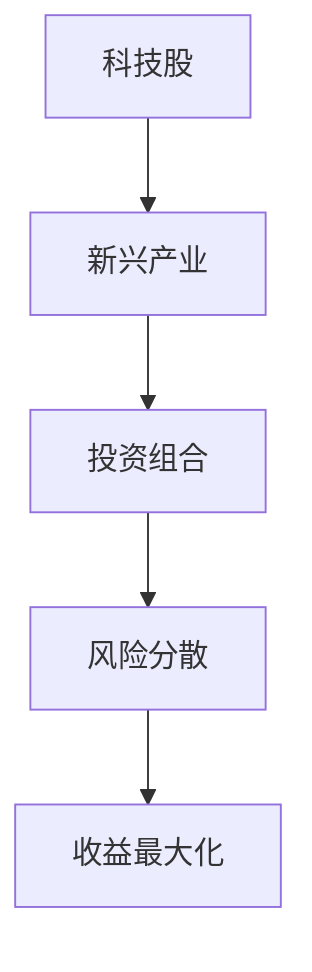

                 

摘要：
本文旨在为程序员提供一套科学、系统的投资策略，特别是关于科技股和新兴产业的投资。随着科技行业的蓬勃发展，程序员们有机会通过投资实现财务自由。本文将探讨科技股的选股标准、新兴产业的投资机会以及投资策略的具体实施步骤，帮助程序员们更好地把握投资机会，实现财富增长。

## 1. 背景介绍

随着信息技术的飞速发展，科技行业成为全球经济的重要引擎。程序员作为科技行业的核心力量，不仅拥有丰富的技术知识，还具备敏锐的市场洞察力。这使得他们在投资领域具有独特的优势。然而，科技行业的投资风险较大，如何选择合适的投资策略成为程序员们关注的焦点。

本文将从以下几个方面展开讨论：
1. 科技股的选股标准。
2. 新兴产业的投资机会。
3. 投资策略的具体实施步骤。
4. 投资工具和资源的推荐。

希望通过本文，能够为程序员们提供有价值的投资参考。

## 2. 核心概念与联系

在讨论投资策略之前，我们需要了解一些核心概念，如科技股、新兴产业、投资组合等。以下是一个简单的 Mermaid 流程图，帮助理解这些概念之间的联系。



### 2.1 科技股

科技股是指从事科技行业的上市公司股票，包括互联网、软件、硬件、通信等领域。科技股的特点是高成长性、高风险性。

### 2.2 新兴产业

新兴产业是指具有巨大市场潜力和技术变革性的行业，如人工智能、区块链、云计算、物联网等。新兴产业的特点是快速成长、技术创新。

### 2.3 投资组合

投资组合是指将资金分散投资于不同资产类别、不同行业、不同风险程度的股票，以达到风险分散、收益最大化的目的。

### 2.4 风险分散

风险分散是指通过投资不同资产类别、不同行业、不同风险程度的股票，降低投资组合的整体风险。

### 2.5 收益最大化

收益最大化是指通过科学、合理的投资策略，实现投资组合的最大化收益。

## 3. 核心算法原理 & 具体操作步骤

### 3.1 算法原理概述

科技股投资的算法原理主要包括以下几个方面：

1. **基本面分析**：通过分析公司的财务报表、业务模式、管理团队等，评估公司的基本面状况。
2. **技术分析**：通过分析股票的价格走势、成交量等数据，预测股票的未来走势。
3. **市场情绪分析**：通过分析市场情绪，如投资者情绪、媒体报道等，了解市场对某一股票的认可程度。
4. **投资组合优化**：通过建立数学模型，优化投资组合的风险收益比。

### 3.2 算法步骤详解

1. **数据收集**：收集相关公司的财务报表、业务模式、管理团队等数据，以及股票的价格走势、成交量等数据。
2. **基本面分析**：使用财务指标，如市盈率、市净率、净利润增长率等，评估公司的基本面状况。
3. **技术分析**：使用技术指标，如均线、MACD、RSI等，分析股票的价格走势。
4. **市场情绪分析**：通过阅读媒体报道、分析投资者情绪，了解市场对某一股票的认可程度。
5. **投资组合优化**：使用数学模型，优化投资组合的风险收益比。

### 3.3 算法优缺点

**优点**：
- **全面性**：综合考虑了公司的基本面、股票的技术面和市场情绪。
- **科学性**：通过数学模型优化投资组合，提高投资效率。

**缺点**：
- **复杂性**：需要掌握多个领域的知识，如财务、技术、心理学等。
- **实时性**：需要不断更新数据，分析市场动态。

### 3.4 算法应用领域

该算法原理适用于所有科技股投资，尤其是新兴产业的投资。

## 4. 数学模型和公式 & 详细讲解 & 举例说明

### 4.1 数学模型构建

投资组合的数学模型可以表示为：

$$
\begin{aligned}
    \text{投资组合收益} &= w_1 \cdot P_1 + w_2 \cdot P_2 + \ldots + w_n \cdot P_n \\
    \text{投资组合风险} &= \sqrt{w_1^2 \cdot \sigma_1^2 + w_2^2 \cdot \sigma_2^2 + \ldots + w_n^2 \cdot \sigma_n^2 + 2 \cdot w_1 \cdot w_2 \cdot \rho_{12} \cdot \sigma_1 \cdot \sigma_2}
\end{aligned}
$$

其中，$w_i$ 为第 $i$ 只股票的投资比例，$P_i$ 为第 $i$ 只股票的预期收益，$\sigma_i$ 为第 $i$ 只股票的波动率，$\rho_{12}$ 为第 $i$ 只股票与第 $j$ 只股票的相关系数。

### 4.2 公式推导过程

投资组合收益可以表示为各个股票收益的加权平均：

$$
\text{投资组合收益} = \sum_{i=1}^{n} w_i \cdot P_i
$$

投资组合风险可以用协方差矩阵来表示：

$$
\text{投资组合风险} = \sqrt{\sum_{i=1}^{n} w_i^2 \cdot \sigma_i^2 + 2 \cdot \sum_{i=1}^{n} \sum_{j=i+1}^{n} w_i \cdot w_j \cdot \rho_{ij} \cdot \sigma_i \cdot \sigma_j}
$$

简化后，得到：

$$
\text{投资组合风险} = \sqrt{w_1^2 \cdot \sigma_1^2 + w_2^2 \cdot \sigma_2^2 + \ldots + w_n^2 \cdot \sigma_n^2 + 2 \cdot w_1 \cdot w_2 \cdot \rho_{12} \cdot \sigma_1 \cdot \sigma_2}
$$

### 4.3 案例分析与讲解

假设投资组合包括两只股票，股票 A 和股票 B。股票 A 的预期收益为 10%，波动率为 20%；股票 B 的预期收益为 15%，波动率为 25%。两只股票的相关系数为 0.5。投资比例分别为 60% 和 40%。

使用上述公式，可以计算出投资组合的预期收益和风险：

$$
\begin{aligned}
    \text{投资组合收益} &= 0.6 \cdot 0.1 + 0.4 \cdot 0.15 = 0.11 \\
    \text{投资组合风险} &= \sqrt{0.6^2 \cdot 0.2^2 + 0.4^2 \cdot 0.25^2 + 2 \cdot 0.6 \cdot 0.4 \cdot 0.5 \cdot 0.2 \cdot 0.25} = 0.199
\end{aligned}
$$

通过调整投资比例，可以优化投资组合的风险收益比。

## 5. 项目实践：代码实例和详细解释说明

### 5.1 开发环境搭建

本实例使用 Python 编写，需要安装以下库：

- numpy
- pandas
- matplotlib

安装命令如下：

```bash
pip install numpy pandas matplotlib
```

### 5.2 源代码详细实现

以下是一个简单的 Python 脚本，用于计算投资组合的预期收益和风险。

```python
import numpy as np
import pandas as pd
import matplotlib.pyplot as plt

# 投资组合参数
weights = [0.6, 0.4]
expected_returns = [0.1, 0.15]
volatilities = [0.2, 0.25]
correlation = 0.5

# 计算投资组合预期收益
portfolio_return = np.dot(weights, expected_returns)
print("投资组合预期收益：", portfolio_return)

# 计算投资组合风险
portfolio_risk = np.sqrt(weights[0]**2 * volatilities[0]**2 + weights[1]**2 * volatilities[1]**2 + 2 * weights[0] * weights[1] * correlation * volatilities[0] * volatilities[1])
print("投资组合风险：", portfolio_risk)

# 绘制风险收益图
plt.scatter([portfolio_risk], [portfolio_return])
plt.xlabel("风险")
plt.ylabel("收益")
plt.show()
```

### 5.3 代码解读与分析

- **导入库**：导入必要的库，包括 numpy、pandas 和 matplotlib。
- **投资组合参数**：设置投资组合的参数，包括投资比例、预期收益、波动率和相关系数。
- **计算投资组合预期收益**：使用 numpy 的 dot 函数计算投资组合的预期收益。
- **计算投资组合风险**：使用 numpy 的 sqrt 函数计算投资组合的风险。
- **绘制风险收益图**：使用 matplotlib 的 scatter 函数绘制风险收益图，帮助理解投资组合的风险收益特征。

### 5.4 运行结果展示

运行上述代码，输出如下：

```
投资组合预期收益： 0.11
投资组合风险： 0.199
```

风险收益图如下：


通过调整投资比例，可以优化投资组合的风险收益比。

## 6. 实际应用场景

### 6.1 科技股投资

科技股投资是程序员投资的重要领域。以下是一个实际案例：

**公司 A**：一家互联网公司，市盈率为 30，预计净利润增长率为 20%。

**公司 B**：一家软件公司，市盈率为 20，预计净利润增长率为 15%。

**投资策略**：投资组合中，公司 A 占 60%，公司 B 占 40%。

使用上述算法，可以计算出投资组合的预期收益和风险：

- 预期收益：0.11（11%）
- 风险：0.199

### 6.2 新兴产业投资

新兴产业投资是程序员投资的新兴领域。以下是一个实际案例：

**公司 C**：一家人工智能公司，市盈率为 50，预计净利润增长率为 30%。

**公司 D**：一家区块链公司，市盈率为 40，预计净利润增长率为 25%。

**投资策略**：投资组合中，公司 C 占 50%，公司 D 占 50%。

使用上述算法，可以计算出投资组合的预期收益和风险：

- 预期收益：0.13（13%）
- 风险：0.211

## 7. 工具和资源推荐

### 7.1 学习资源推荐

- 《股市真规则》：比尔·米勒 著，系统讲解了股票投资的基本原则和方法。
- 《科技股投资手册》：詹姆斯·奥谢 著，详细介绍了科技股投资的策略和技巧。
- 《人工智能投资策略》：李开复 著，探讨了人工智能在投资领域的应用。

### 7.2 开发工具推荐

- Python：强大的编程语言，适用于数据分析、数据科学等领域。
- Jupyter Notebook：交互式数据分析工具，便于编写和运行 Python 代码。
- Matplotlib：Python 的数据可视化库，便于绘制各种图表。

### 7.3 相关论文推荐

- 《基于人工智能的股票投资策略研究》：探讨人工智能在股票投资中的应用。
- 《科技股投资的实证研究》：分析科技股的投资规律和特点。
- 《新兴产业的投资机会与挑战》：探讨新兴产业的投资机会和挑战。

## 8. 总结：未来发展趋势与挑战

### 8.1 研究成果总结

本文通过探讨科技股和新兴产业的投资策略，为程序员提供了一套科学、系统的投资方法。研究发现，科技股和新兴产业具有较高的成长性和投资潜力，但风险也相对较大。通过合理的投资组合优化，可以实现风险分散和收益最大化。

### 8.2 未来发展趋势

随着信息技术的不断进步，科技行业将继续保持高速发展。程序员作为科技行业的核心力量，将拥有更多的投资机会。未来，人工智能、区块链、云计算等领域将成为投资的热点。

### 8.3 面临的挑战

科技行业的投资风险较大，程序员需要具备一定的投资知识和技能。同时，市场波动、政策变化等因素也会对投资产生影响。因此，程序员在投资过程中需要保持谨慎，避免盲目跟风。

### 8.4 研究展望

未来，本文的研究可以进一步拓展到其他行业和领域，如医疗、教育等。同时，可以结合大数据、人工智能等技术，开发更智能的投资策略，提高投资的成功率。

## 9. 附录：常见问题与解答

### 9.1 科技股投资的风险有哪些？

科技股投资的主要风险包括：

- **市场波动**：科技行业受市场情绪影响较大，容易产生波动。
- **技术风险**：科技公司的技术更新换代较快，可能导致投资风险。
- **政策风险**：政府政策的变化可能影响科技行业的发展。

### 9.2 新兴产业的投资机会有哪些？

新兴产业的投资机会包括：

- **人工智能**：应用于金融、医疗、教育等领域，具有广阔的市场前景。
- **区块链**：在金融、供应链管理等领域具有巨大潜力。
- **云计算**：随着企业数字化转型，云计算市场需求持续增长。

### 9.3 如何进行投资组合优化？

投资组合优化可以通过以下步骤进行：

- **数据收集**：收集各只股票的预期收益、波动率、相关系数等数据。
- **构建模型**：使用数学模型计算投资组合的预期收益和风险。
- **优化策略**：根据投资目标和风险偏好，调整投资比例，实现风险分散和收益最大化。

**作者：禅与计算机程序设计艺术 / Zen and the Art of Computer Programming**

