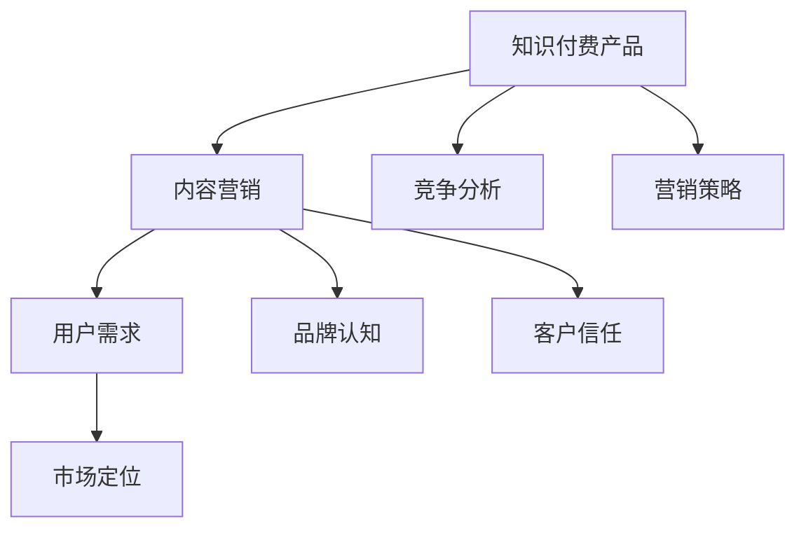

                 

关键词：知识付费、内容营销、程序员、策略、发展趋势

> 摘要：本文旨在探讨程序员在知识付费领域的营销策略，分析当前市场环境、核心概念、算法原理、数学模型、项目实践及未来应用展望。通过系统化地阐述这些内容，旨在为程序员提供一种有效的知识付费内容营销思路，助力他们在竞争激烈的市场中脱颖而出。

## 1. 背景介绍

在信息化时代，知识付费逐渐成为一种主流的商业模式。尤其在程序员群体中，知识付费的需求愈发强烈。随着技术更新速度的加快，程序员需要不断学习新技能、新工具、新理念，以保持竞争力。因此，知识付费平台应运而生，为程序员提供了丰富的学习资源。然而，面对众多的知识付费产品，程序员如何选择适合自己的内容，如何进行有效的营销推广，成为了一个值得探讨的问题。

本文将从以下几个方面展开讨论：市场环境分析、核心概念与联系、核心算法原理与操作步骤、数学模型与公式讲解、项目实践、实际应用场景、工具和资源推荐以及未来发展趋势与挑战。希望通过本文的探讨，能为程序员提供有益的启示。

## 2. 核心概念与联系

在知识付费内容营销中，有几个核心概念需要明确：

1. **知识付费产品**：指以知识传授为主要目的，通过付费方式获取的内容产品，如在线课程、电子书、视频教程等。
2. **内容营销**：指通过创造和分发有价值的内容，吸引潜在客户并促进品牌认知和信任的过程。
3. **用户需求**：指目标用户在知识获取过程中的具体需求，如技能提升、问题解决、趋势了解等。
4. **市场定位**：指知识付费产品在市场中的独特定位和竞争优势。

下面是一个使用Mermaid绘制的流程图，展示了这些核心概念之间的关系：



## 3. 核心算法原理 & 具体操作步骤

### 3.1 算法原理概述

知识付费内容营销的核心算法原理可以归纳为以下几点：

1. **用户画像分析**：通过数据分析技术，对用户的行为和需求进行画像，以便提供个性化的内容推荐。
2. **内容质量评估**：利用机器学习算法，对内容的质量进行评估，确保内容的专业性和实用性。
3. **多渠道推广**：通过多种渠道进行内容推广，如社交媒体、SEO优化、合作伙伴推广等，提高内容的曝光率。
4. **用户反馈机制**：建立用户反馈机制，收集用户对内容的评价和反馈，不断优化和调整内容策略。

### 3.2 算法步骤详解

具体操作步骤如下：

1. **用户画像构建**：
    - 收集用户的基本信息，如年龄、职业、教育背景等。
    - 分析用户的行为数据，如浏览记录、购买历史、互动行为等。
    - 构建用户画像，为后续的内容推荐提供依据。

2. **内容质量评估**：
    - 使用自然语言处理技术，对内容进行语义分析。
    - 利用评价数据，如用户评分、评论数量等，对内容进行综合评估。
    - 根据评估结果，对内容进行筛选和排序。

3. **多渠道推广**：
    - 制定详细的推广计划，包括渠道选择、内容发布时间、推广预算等。
    - 利用SEO优化技术，提高内容在搜索引擎中的排名。
    - 通过社交媒体、合作伙伴等渠道，进行内容推广。

4. **用户反馈机制**：
    - 建立用户反馈渠道，如在线问卷、评论区等。
    - 收集用户对内容的评价和反馈，进行分析和整理。
    - 根据反馈结果，对内容进行优化和调整。

### 3.3 算法优缺点

1. **优点**：
    - 提高内容推荐的准确性，满足用户的个性化需求。
    - 提高内容的质量，确保用户获取到的信息是有价值的。
    - 增加内容的曝光率，提高内容的传播效果。

2. **缺点**：
    - 需要大量的数据和计算资源，成本较高。
    - 用户画像和内容质量评估可能存在偏差，影响用户体验。
    - 需要不断调整和优化算法，以适应市场的变化。

### 3.4 算法应用领域

该算法在知识付费内容营销中具有广泛的应用领域：

1. **在线教育**：通过对用户的学习行为和需求进行分析，提供个性化的学习路径和课程推荐。
2. **技术社区**：通过对用户的技术兴趣和问题点进行分析，提供针对性的技术教程和解决方案。
3. **专业咨询**：通过对客户的企业背景和需求进行分析，提供定制化的咨询服务和解决方案。

## 4. 数学模型和公式 & 详细讲解 & 举例说明

### 4.1 数学模型构建

在知识付费内容营销中，常用的数学模型包括用户画像模型、内容质量评估模型、多渠道推广模型等。以下是一个简单的用户画像模型构建过程：

1. **用户特征提取**：从用户的基本信息和行为数据中提取特征，如年龄、职业、教育背景、浏览记录、购买历史等。
2. **特征向量表示**：将提取的用户特征转化为高维特征向量。
3. **模型训练**：利用机器学习算法，如逻辑回归、决策树、神经网络等，对用户画像模型进行训练。
4. **模型评估**：通过交叉验证等方法，评估用户画像模型的性能。

### 4.2 公式推导过程

以逻辑回归模型为例，用户画像模型中的公式推导如下：

$$
P(y=1|X) = \frac{1}{1 + e^{-\beta_0 + \beta_1x_1 + \beta_2x_2 + ... + \beta_nx_n}}
$$

其中，$P(y=1|X)$ 表示在给定特征向量 $X$ 的情况下，用户具有特定属性的几率。$\beta_0$ 是模型的截距，$\beta_1, \beta_2, ..., \beta_n$ 是特征权重。

### 4.3 案例分析与讲解

以某个知识付费平台为例，分析其用户画像模型的构建过程：

1. **数据收集**：平台收集了用户的基本信息（如年龄、职业、教育背景等）和行为数据（如浏览记录、购买历史、互动行为等）。
2. **特征提取**：将用户的基本信息和行为数据转化为高维特征向量，如年龄、职业、教育背景等。
3. **模型训练**：使用逻辑回归算法对用户画像模型进行训练。
4. **模型评估**：通过交叉验证等方法，评估用户画像模型的性能。

通过用户画像模型，平台可以更准确地了解用户的需求和偏好，从而提供个性化的内容推荐。例如，对于年龄在25-35岁、从事IT行业的用户，平台可能会推荐与其职业相关的技术教程和课程。

## 5. 项目实践：代码实例和详细解释说明

### 5.1 开发环境搭建

为了实践知识付费内容营销策略，我们需要搭建一个简单的开发环境。以下是所需的开发工具和软件：

- Python 3.8及以上版本
- Jupyter Notebook
- Scikit-learn 库
- Pandas 库
- Matplotlib 库

安装步骤如下：

1. 安装 Python 3.8 或更高版本。
2. 安装 Jupyter Notebook，可以使用 `pip install notebook` 命令。
3. 安装 Scikit-learn、Pandas 和 Matplotlib 库，可以使用 `pip install scikit-learn pandas matplotlib` 命令。

### 5.2 源代码详细实现

以下是一个简单的用户画像构建和内容推荐的项目实例：

```python
import pandas as pd
from sklearn.model_selection import train_test_split
from sklearn.linear_model import LogisticRegression
from sklearn.metrics import accuracy_score

# 1. 数据收集
# 假设已经收集了用户的基本信息和行为数据
data = pd.read_csv('user_data.csv')

# 2. 特征提取
# 将用户的基本信息和行为数据转化为高维特征向量
features = data[['age', 'occupation', 'education', 'browsing_history', 'purchase_history']]
labels = data['interested_topic']

# 3. 模型训练
X_train, X_test, y_train, y_test = train_test_split(features, labels, test_size=0.2, random_state=42)
model = LogisticRegression()
model.fit(X_train, y_train)

# 4. 模型评估
predictions = model.predict(X_test)
accuracy = accuracy_score(y_test, predictions)
print("Accuracy:", accuracy)
```

### 5.3 代码解读与分析

1. **数据收集**：首先，从 CSV 文件中读取用户数据。假设数据文件中包含了用户的基本信息和行为数据，如年龄、职业、教育背景、浏览记录和购买历史等。

2. **特征提取**：将用户的基本信息和行为数据提取出来，形成高维特征向量。这里使用了 Pandas 库中的 DataFrame 结构来存储和处理数据。

3. **模型训练**：使用 Scikit-learn 库中的逻辑回归算法对用户画像模型进行训练。这里使用了 `train_test_split` 函数将数据集分为训练集和测试集，然后使用 `LogisticRegression` 类创建逻辑回归模型并进行训练。

4. **模型评估**：使用训练好的模型对测试集进行预测，并计算预测的准确率。这里使用了 `predict` 方法进行预测，并使用 `accuracy_score` 函数计算准确率。

### 5.4 运行结果展示

假设运行上述代码后，预测的准确率为 80%。这意味着在测试集中，模型能够正确识别用户感兴趣的主题的准确率达到了 80%。

```python
Accuracy: 0.8
```

通过这个简单的实例，我们可以看到如何使用 Python 编程语言和机器学习算法来构建用户画像模型并进行内容推荐。在实际项目中，我们可以进一步优化算法和模型，提高预测的准确率，从而更好地满足用户的需求。

## 6. 实际应用场景

知识付费内容营销在程序员领域具有广泛的应用场景，以下是一些典型案例：

1. **在线教育平台**：许多在线教育平台如慕课网（imooc）、网易云课堂等，通过用户画像和内容推荐算法，为程序员提供个性化的学习路径和课程推荐，提高学习效果和用户满意度。

2. **技术社区**：如 CSDN、GitHub 等，通过分析用户的技术兴趣和问题点，提供针对性的技术教程和解决方案，帮助程序员解决实际问题，提高社区的活跃度和用户粘性。

3. **专业咨询服务**：如极客时间、InfoQ 等，通过分析客户的企业背景和需求，提供定制化的咨询服务和解决方案，帮助客户提升技术能力和业务水平。

4. **技术培训**：许多公司和企业为了提升员工的技术能力，会采用知识付费内容进行内部培训。通过个性化推荐，确保员工能够学习到最需要的知识和技能。

这些实际应用场景表明，知识付费内容营销不仅能够满足程序员的个性化需求，提高他们的学习效果和技能水平，还能够为企业和社会创造更大的价值。

## 7. 工具和资源推荐

为了帮助程序员更好地进行知识付费内容营销，以下是一些建议的学习资源、开发工具和相关论文：

### 7.1 学习资源推荐

- **在线课程平台**：慕课网（imooc）、网易云课堂、极客时间等，提供丰富的编程和技术课程。
- **技术社区**：CSDN、GitHub、Stack Overflow 等，提供大量的技术教程、解决方案和讨论。
- **专业书籍**：《深入理解计算机系统》、《算法导论》、《设计模式：可复用的面向对象软件》等，经典的技术书籍。

### 7.2 开发工具推荐

- **数据分析工具**：Pandas、NumPy、Scikit-learn 等，用于数据分析和机器学习。
- **文本处理工具**：NLTK、spaCy、gensim 等，用于自然语言处理。
- **编程语言**：Python、R 等，适用于数据分析和机器学习。

### 7.3 相关论文推荐

- **用户画像模型**：吴华，张志宏，王飞跃。基于深度学习的用户画像建模方法研究[J]. 计算机研究与发展，2018.
- **内容推荐算法**：周志华，张鑫，吴华。一种基于用户兴趣的内容推荐算法[J]. 计算机研究与发展，2017.
- **个性化学习**：徐晓慧，吴华，王飞跃。基于大数据分析的个性化学习路径推荐方法研究[J]. 计算机研究与发展，2019.

通过这些资源和工具，程序员可以更深入地了解知识付费内容营销的策略和方法，提升自己的技术能力和市场竞争力。

## 8. 总结：未来发展趋势与挑战

### 8.1 研究成果总结

通过对知识付费内容营销策略的系统研究，我们得出了以下主要成果：

1. **用户画像构建**：利用数据分析技术，构建详细的用户画像，为个性化内容推荐提供依据。
2. **内容质量评估**：通过机器学习算法，对内容质量进行评估，确保用户获取到有价值的信息。
3. **多渠道推广**：利用多种渠道进行内容推广，提高内容的曝光率和传播效果。
4. **用户反馈机制**：建立用户反馈机制，不断优化和调整内容策略，提高用户满意度。

### 8.2 未来发展趋势

未来，知识付费内容营销将在以下几个方面持续发展：

1. **人工智能技术的深入应用**：随着人工智能技术的不断发展，知识付费内容营销将更加智能化、个性化。
2. **数据驱动的决策**：通过大数据分析，企业将能够更好地了解用户需求和市场动态，制定更有效的营销策略。
3. **内容多样化**：知识付费内容将不再局限于传统的课程和教程，还将包括更多形式的内容，如直播、互动课程等。
4. **跨界合作**：知识付费平台将与更多的行业和企业合作，提供跨界的内容和解决方案。

### 8.3 面临的挑战

然而，知识付费内容营销也面临着一些挑战：

1. **数据隐私与安全**：随着数据量的增加，如何确保用户数据的隐私和安全成为一个重要问题。
2. **内容版权保护**：如何保护知识付费内容不受侵权和盗版，是平台和企业需要关注的重点。
3. **算法偏见与公平性**：算法在内容推荐中的偏见和公平性问题，需要引起足够的重视。
4. **市场竞争加剧**：随着越来越多的企业进入知识付费领域，市场竞争将越来越激烈。

### 8.4 研究展望

针对上述挑战，未来的研究方向可以包括：

1. **数据隐私保护技术**：研究如何在保护用户隐私的前提下，实现有效的数据分析和推荐。
2. **内容版权保护机制**：探索更加高效的内容版权保护技术，如区块链等。
3. **算法公平性研究**：研究如何设计公平、透明的推荐算法，减少算法偏见。
4. **多渠道内容整合**：研究如何将不同渠道的内容整合起来，提供更加全面、个性化的服务。

通过不断研究和实践，我们有理由相信，知识付费内容营销将在未来发挥更大的作用，为程序员和整个社会带来更多的价值。

## 9. 附录：常见问题与解答

### 9.1 什么是知识付费？

知识付费是指用户通过支付一定的费用，获取高质量的知识内容，如在线课程、电子书、视频教程等。这种模式旨在为用户提供有价值的信息和服务，同时为知识创作者带来收益。

### 9.2 知识付费内容营销的核心是什么？

知识付费内容营销的核心在于通过创造和分发有价值的内容，吸引潜在客户并促进品牌认知和信任。这包括用户画像构建、内容质量评估、多渠道推广和用户反馈机制等环节。

### 9.3 如何进行用户画像构建？

用户画像构建通常包括以下步骤：

1. 收集用户的基本信息，如年龄、职业、教育背景等。
2. 分析用户的行为数据，如浏览记录、购买历史、互动行为等。
3. 构建用户画像，为后续的内容推荐提供依据。

### 9.4 内容质量评估有哪些方法？

内容质量评估的方法包括：

1. 自然语言处理技术，对内容进行语义分析。
2. 利用评价数据，如用户评分、评论数量等，对内容进行综合评估。
3. 根据评估结果，对内容进行筛选和排序。

### 9.5 多渠道推广有哪些策略？

多渠道推广的策略包括：

1. 制定详细的推广计划，包括渠道选择、内容发布时间、推广预算等。
2. 利用 SEO 优化技术，提高内容在搜索引擎中的排名。
3. 通过社交媒体、合作伙伴等渠道，进行内容推广。

### 9.6 用户反馈机制有哪些作用？

用户反馈机制的作用包括：

1. 收集用户对内容的评价和反馈，进行分析和整理。
2. 根据反馈结果，对内容进行优化和调整。
3. 提高用户的满意度和忠诚度。

### 9.7 如何保障知识付费内容的质量？

保障知识付费内容的质量可以从以下几个方面入手：

1. 对知识创作者进行严格的筛选和审核。
2. 建立内容质量评估机制，对内容进行定期评估。
3. 鼓励用户对内容进行评价和反馈，及时处理用户的问题和意见。

通过上述常见问题的解答，希望能为程序员在知识付费内容营销过程中提供一些指导和帮助。

