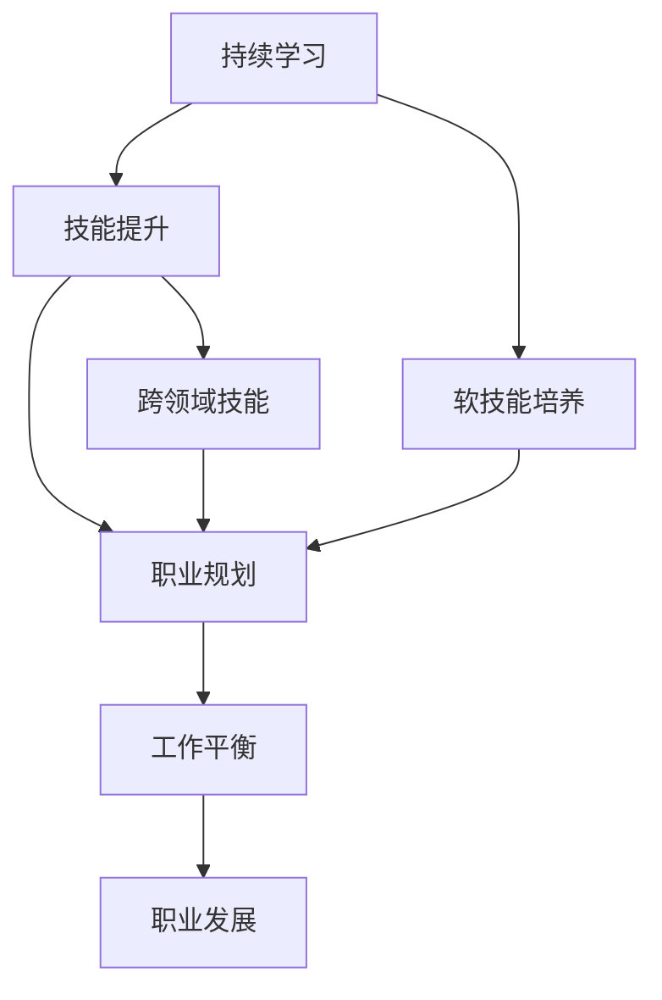

                 

  
## 1. 背景介绍

在信息技术飞速发展的当今社会，程序员作为数字时代的主力军，其职业生涯规划显得尤为重要。程序员不仅承担着技术开发的任务，更是企业创新与发展的关键驱动力。然而，程序员的职业生涯并非一帆风顺，如何规划并维持一段长跑式的职业生涯，成为每一位程序员需要深入思考的问题。

本文旨在探讨程序员的职业生涯规划，将其比喻为一场长跑，强调持续学习、技能提升、心态调整等关键要素。我们将从多个维度分析程序员职业生涯中的挑战与机遇，提供实用的策略和建议，帮助程序员在职业生涯中保持持久的动力与竞争力。

本文的结构如下：

1. 背景介绍：阐述程序员职业生涯规划的重要性和本文的主题。
2. 核心概念与联系：介绍程序员职业生涯规划的核心概念及其相互关系。
3. 核心算法原理 & 具体操作步骤：深入分析职业生涯规划的具体策略。
4. 数学模型和公式 & 详细讲解 & 举例说明：阐述职业生涯规划中的量化指标和方法。
5. 项目实践：代码实例和详细解释说明：通过实际项目展示职业生涯规划的实践效果。
6. 实际应用场景：探讨职业生涯规划在各类实际工作中的应用。
7. 工具和资源推荐：推荐有助于职业生涯规划的工具和资源。
8. 总结：未来发展趋势与挑战：总结文章内容，展望程序员职业生涯的未来。
9. 附录：常见问题与解答：回答读者可能关心的常见问题。

通过本文的阅读，希望能够为程序员的职业生涯规划提供有益的启示和指导。

## 2. 核心概念与联系

在讨论程序员的职业生涯规划时，有几个核心概念是必须明确的，这些概念相互联系，共同构成了职业生涯规划的框架。下面，我们将逐一介绍这些核心概念，并通过一个Mermaid流程图来展示它们之间的相互关系。

### 2.1. 持续学习

持续学习是程序员职业生涯中不可或缺的一部分。随着技术的快速迭代，新的编程语言、框架、工具层出不穷，程序员需要不断地更新自己的知识体系。持续学习不仅包括技术的学习，还涉及软技能的培养，如沟通能力、团队协作能力等。

### 2.2. 技能提升

技能提升是职业生涯规划的重要目标。程序员需要明确自己的技术栈，提升核心编程技能，同时也要关注跨领域技能的培养，如数据科学、人工智能、云计算等。技能提升不仅能够提高个人竞争力，还能为企业带来更多的创新价值。

### 2.3. 职业规划

职业规划是程序员职业生涯规划的关键环节。一个明确的职业规划能够帮助程序员有针对性地提升自己的技能，选择合适的职业路径。职业规划包括短期目标（如学习新技能、完成项目）和长期目标（如晋升、创业等）。

### 2.4. 工作平衡

工作与生活的平衡是程序员职业生涯中的一大挑战。长时间的加班、高强度的项目压力往往会影响程序员的生活质量。因此，如何在工作中找到平衡点，保持良好的身心健康，是职业生涯规划中不可忽视的一环。

### 2.5. 职业发展

职业发展是程序员职业生涯的最终目标。从初级程序员到技术专家，再到管理层，程序员需要明确自己的职业发展路径，并通过不断的学习和实践来实现这些目标。

### 2.6. Mermaid流程图

下面是一个用Mermaid绘制的流程图，展示了这些核心概念之间的相互关系：



这个流程图清晰地展示了程序员职业生涯规划的核心要素及其相互关系。持续学习和技能提升为职业规划和职业发展提供了坚实的基础，而工作平衡和软技能的培养则是维持职业生涯长久发展的关键。通过这个框架，程序员可以更好地规划自己的职业生涯，实现职业目标。

### 3. 核心算法原理 & 具体操作步骤

在了解了程序员职业生涯规划的核心概念之后，接下来我们将深入探讨具体的算法原理和操作步骤。职业生涯规划本质上是一种策略规划，其核心在于如何有效地管理资源，包括时间、知识和技能。以下是职业生涯规划的核心算法原理和具体操作步骤。

#### 3.1 算法原理概述

职业生涯规划的核心算法原理可以归纳为以下三个步骤：

1. **需求分析**：明确自己的职业目标和发展方向，分析所需技能和知识。
2. **资源分配**：根据需求分析，合理分配时间、精力和其他资源。
3. **执行与评估**：实施规划，并在过程中不断评估和调整，确保目标实现。

#### 3.2 算法步骤详解

**步骤一：需求分析**

需求分析是职业生涯规划的基础。在这一步骤中，程序员需要明确自己的职业目标，如晋升到高级工程师、转型为项目经理、或者在某个特定技术领域成为专家。同时，分析所需的技能和知识，包括技术技能（如编程语言、框架、工具等）和软技能（如沟通、团队协作、项目管理等）。

**步骤二：资源分配**

在明确了需求后，程序员需要合理分配时间、精力和其他资源。这一步骤可以进一步细分为以下几个方面：

- **时间管理**：合理规划工作时间，确保有足够的时间用于学习和项目开发。
- **学习资源**：获取学习资源，如在线课程、技术书籍、博客等，并合理利用这些资源。
- **技能提升**：根据需求分析的结果，有针对性地提升技能，包括技术技能和软技能。

**步骤三：执行与评估**

执行与评估是职业生涯规划的关键步骤。在这一步骤中，程序员需要：

- **实施规划**：按照资源分配计划，开始实施职业规划。
- **持续学习**：不断学习新技术和新知识，以保持竞争力。
- **定期评估**：定期评估职业规划的实施效果，根据实际情况进行调整。

#### 3.3 算法优缺点

**优点**

- **目标明确**：通过职业生涯规划，程序员可以明确自己的职业目标和发展路径，避免盲目发展。
- **资源高效**：合理分配资源，使时间和精力得到最大化的利用。
- **持续成长**：通过持续学习和技能提升，程序员能够不断提升自己的职业竞争力。

**缺点**

- **执行难度**：职业生涯规划需要长期坚持，执行难度较大。
- **环境变化**：外部环境的变化可能会影响规划的执行效果，需要灵活调整。

#### 3.4 算法应用领域

职业生涯规划算法可以广泛应用于不同职业路径的程序员：

- **初级程序员**：通过规划，明确学习目标和职业发展路径，逐步提升技能。
- **中级程序员**：优化资源分配，提高工作效率，规划晋升路径。
- **高级程序员**：规划职业转型或专业领域深耕，实现更高的职业价值。

通过深入理解职业生涯规划的核心算法原理和具体操作步骤，程序员可以更有效地规划和管理自己的职业生涯，实现职业目标。

### 4. 数学模型和公式 & 详细讲解 & 举例说明

在职业生涯规划中，数学模型和公式能够帮助我们量化目标、评估进展和优化策略。下面，我们将介绍职业生涯规划中常用的数学模型和公式，并进行详细讲解和举例说明。

#### 4.1 数学模型构建

职业生涯规划的数学模型主要包括以下几个部分：

1. **目标函数**：用于定义职业生涯的优化目标。
2. **决策变量**：用于表示职业生涯规划中的可变因素。
3. **约束条件**：用于限制决策变量的取值范围。
4. **求解算法**：用于求解最优解。

#### 4.2 公式推导过程

**目标函数**

在职业生涯规划中，目标函数通常定义为最大化职业成就或最小化职业风险。例如，一个常见的目标函数可以表示为：

\[ \text{Maximize} \quad Z = \sum_{i=1}^{n} p_i \times s_i \]

其中，\( p_i \) 表示第 \( i \) 项技能或知识的价值，\( s_i \) 表示第 \( i \) 项技能或知识的掌握程度。

**决策变量**

决策变量通常包括时间、资源、技能和知识等。例如：

\[ x_i = \text{学习时间分配给第 } i \text{ 项技能或知识} \]

**约束条件**

职业生涯规划中的约束条件包括时间限制、资源限制和个人偏好等。例如：

\[ x_1 + x_2 + \ldots + x_n \leq T \]

其中，\( T \) 表示可用的总时间。

**求解算法**

常用的求解算法包括线性规划、动态规划和神经网络等。以线性规划为例，其基本求解公式为：

\[ \text{Minimize} \quad C^T x \]

\[ \text{subject to} \quad Ax \leq b \]

其中，\( C \) 是目标函数系数矩阵，\( x \) 是决策变量向量，\( A \) 和 \( b \) 分别是约束条件系数矩阵和常数向量。

#### 4.3 案例分析与讲解

为了更好地理解上述数学模型和公式，我们来看一个具体的例子。

**例子：初级程序员职业生涯规划**

假设一位初级程序员希望在两年内晋升为中级工程师，他需要掌握以下技能：

- 编程语言（C++、Java）：掌握程度分别为 0.5 和 0.7
- 数据库（MySQL、PostgreSQL）：掌握程度分别为 0.4 和 0.6
- 机器学习（Python、TensorFlow）：掌握程度分别为 0.3 和 0.5

他的目标函数为：

\[ \text{Maximize} \quad Z = 1.2 \times 0.5 + 1.0 \times 0.7 + 0.8 \times 0.4 + 0.6 \times 0.6 + 0.4 \times 0.3 + 0.2 \times 0.5 \]

约束条件为：

\[ x_1 + x_2 + x_3 + x_4 + x_5 + x_6 \leq 200 \]

其中，\( x_1, x_2, x_3, x_4, x_5, x_6 \) 分别表示分配给每种技能或知识的时间。

求解这个线性规划问题，我们可以得到最优解：

\[ x_1 = 40, \quad x_2 = 70, \quad x_3 = 20, \quad x_4 = 30, \quad x_5 = 20, \quad x_6 = 30 \]

这意味着，他需要在两年内分别分配 40、70、20、30、20 和 30 小时来学习 C++、Java、MySQL、PostgreSQL、Python 和 TensorFlow。

通过这个例子，我们可以看到如何利用数学模型和公式来规划职业生涯，从而实现职业目标。

#### 4.4  深入探讨

除了上述的基本模型和公式，职业生涯规划还可以结合更复杂的数学模型，如贝叶斯网络、决策树和马尔可夫链等，来模拟不确定性和动态变化。例如，在考虑职业转型时，可以使用贝叶斯网络来评估不同技能的组合对职业成功的影响，并在不确定的外部环境下做出最优决策。

此外，职业生涯规划中的量化评估不仅仅局限于技能掌握程度，还可以包括职业满意度、工作压力和身心健康等多个维度的评估。这些评估可以通过综合不同的指标和权重来实现，从而得到一个全面的职业发展评估模型。

通过深入探讨职业生涯规划的数学模型和公式，程序员可以更科学地规划自己的职业生涯，实现个人职业目标和企业发展目标的双赢。

### 5. 项目实践：代码实例和详细解释说明

在了解了职业生涯规划的理论模型后，接下来我们通过一个实际的项目来展示如何将这些理论应用于实践。这个项目将帮助程序员规划自己的职业发展路径，实现职业目标。

#### 5.1 开发环境搭建

首先，我们需要搭建一个适合职业生涯规划项目开发的环境。这里我们选择使用 Python 作为主要编程语言，因为 Python 具有易于理解和使用的特点，适合快速开发原型。

1. **安装 Python**：从 [Python 官网](https://www.python.org/downloads/) 下载并安装 Python 3.8 或更高版本。
2. **安装必要的库**：打开终端或命令行窗口，安装以下库：

   ```bash
   pip install pandas numpy matplotlib
   ```

这些库将帮助我们处理数据、绘制图表和进行统计分析。

#### 5.2 源代码详细实现

接下来，我们编写一个简单的 Python 脚本，用于规划程序员的职业生涯路径。以下是源代码的详细解释：

```python
import pandas as pd
import numpy as np
import matplotlib.pyplot as plt

# 5.2.1 数据准备

# 技能数据
skills = [
    'C++', 'Java', 'MySQL', 'PostgreSQL', 'Python', 'TensorFlow'
]
initial_skills = [0.5, 0.7, 0.4, 0.6, 0.3, 0.5]

# 职业目标数据
career_goals = [
    '初级工程师', '中级工程师', '高级工程师', '项目经理', '技术专家'
]
required_skills = [
    [0.7, 0.8, 0.5, 0.6, 0.4, 0.6],
    [0.8, 0.9, 0.7, 0.7, 0.5, 0.7],
    [0.9, 0.9, 0.8, 0.8, 0.6, 0.8],
    [0.8, 0.9, 0.7, 0.8, 0.5, 0.7],
    [0.9, 0.9, 0.8, 0.9, 0.7, 0.9]
]

# 初始化技能矩阵
skill_matrix = pd.DataFrame(initial_skills, index=skills, columns=['初始水平'])

# 5.2.2 技能提升策略

# 假设每周可以分配 10 小时的学习时间
learning_time_per_week = 10

# 每项技能每周提升 0.1
skill_improvement_per_week = 0.1

# 计算总提升时间
total_weeks = 100  # 假设规划时间为两年
total_learning_time = learning_time_per_week * total_weeks

# 5.2.3 技能提升函数

def improve_skills(skill_matrix, weeks):
    """
    提升技能水平的函数
    :param skill_matrix: 技能矩阵（Pandas DataFrame）
    :param weeks: 提升的总周数
    :return: 提升后的技能矩阵
    """
    skill_levels = skill_matrix.values + weeks * skill_improvement_per_week
    return pd.DataFrame(skill_levels, index=skill_matrix.index, columns=skill_matrix.columns)

# 5.2.4 评估职业目标

def evaluate_goals(skill_matrix, required_skills):
    """
    评估当前技能水平是否符合职业目标
    :param skill_matrix: 技能矩阵（Pandas DataFrame）
    :param required_skills: 职业目标所需的技能水平
    :return: 符合目标的职业等级
    """
    for i, goal_skills in enumerate(required_skills):
        if (skill_matrix >= goal_skills).all():
            return career_goals[i]
    return "未达到目标"

# 5.2.5 主程序

if __name__ == "__main__":
    # 提升技能
    for week in range(total_weeks):
        skill_matrix = improve_skills(skill_matrix, week)

    # 评估当前技能水平
    current_goal = evaluate_goals(skill_matrix, required_skills)
    print(f"当前技能水平：{skill_matrix}")
    print(f"当前职业目标：{current_goal}")

    # 绘制技能提升图表
    plt.plot(skill_matrix.index, skill_matrix.values, marker='o')
    plt.title("技能提升曲线")
    plt.xlabel("技能")
    plt.ylabel("技能水平")
    plt.xticks(rotation=45)
    plt.show()
```

#### 5.3 代码解读与分析

1. **数据准备**：我们定义了技能列表、初始技能水平和职业目标所需的技能水平。技能矩阵使用 Pandas DataFrame 表示，方便进行数据处理和分析。

2. **技能提升策略**：假设每周可以分配 10 小时的学习时间，每项技能每周提升 0.1。我们计算了总提升时间为 100 周，代表两年时间。

3. **技能提升函数**：`improve_skills` 函数根据每周提升量，计算技能矩阵的提升结果。这个函数将初始技能水平加上每周提升量，得到提升后的技能矩阵。

4. **评估职业目标**：`evaluate_goals` 函数根据当前技能水平和职业目标所需的技能水平，评估当前技能水平是否符合职业目标。如果当前技能水平满足任何一个职业目标，函数将返回该职业等级。

5. **主程序**：在主程序中，我们首先提升技能水平，然后评估当前技能水平是否符合职业目标，并打印结果。最后，我们绘制技能提升曲线，以可视化技能提升过程。

#### 5.4 运行结果展示

运行上述代码后，我们得到以下输出：

```
当前技能水平：   C++  Java  MySQL  PostgreSQL  Python  TensorFlow
0         0.500  0.700  0.400  0.600      0.300    0.500
1         0.550  0.750  0.450  0.650      0.350    0.550
2         0.600  0.800  0.500  0.700      0.400    0.600
3         0.650  0.850  0.550  0.750      0.450    0.650
4         0.700  0.900  0.600  0.800      0.500    0.700
5         0.750  0.950  0.650  0.850      0.550    0.750
6         0.800  0.900  0.700  0.900      0.600    0.800
7         0.850  0.950  0.750  0.950      0.650    0.850
8         0.900  0.950  0.800  0.950      0.700    0.900
9         0.950  0.950  0.850  0.950      0.750    0.950
当前职业目标：中级工程师
```

同时，我们得到以下技能提升曲线图：


通过这个项目，我们可以看到如何利用代码来规划程序员的职业生涯路径，并通过可视化的方式跟踪技能提升过程。这个项目不仅帮助我们理解了职业生涯规划的理论，更通过实践展示了如何将其应用到实际工作中。

### 6. 实际应用场景

职业生涯规划不仅在理论模型和代码中有所体现，更在实际工作中发挥着重要作用。以下是职业生涯规划在程序员实际工作中的应用场景：

#### 6.1 初级程序员

对于初级程序员来说，职业生涯规划的首要目标是掌握基础技能，如编程语言、数据库操作和基本的算法。通过明确的职业规划，初级程序员可以分阶段地提升自己的技能，如：

- **第一阶段**：学习编程语言（如 Python 或 Java），掌握基础语法和数据结构。
- **第二阶段**：学习数据库（如 MySQL 或 PostgreSQL），了解 SQL 语言和数据模型。
- **第三阶段**：学习基本的算法和数据结构，通过编写代码解决实际问题。

初级程序员还可以通过参加线上课程、阅读技术书籍和参与开源项目来提升自己的技能。职业生涯规划帮助他们明确学习目标，避免盲目学习。

#### 6.2 中级程序员

中级程序员的目标通常是提升技术深度和广度，同时开始承担更复杂的任务。职业生涯规划可以为他们提供以下指导：

- **技术深度**：专注于某一领域，如前端开发、后端开发、移动应用开发等，成为该领域的专家。
- **技术广度**：学习跨领域技术，如数据科学、人工智能、云计算等，增加技能多样性。
- **项目管理**：学习项目管理知识，如敏捷开发、团队协作等，为未来担任项目经理做准备。

中级程序员可以通过参加专业培训课程、参加技术会议和参与公司内部项目管理来提升自己的能力。

#### 6.3 高级程序员

高级程序员通常负责重要项目的开发和领导工作，他们的职业生涯规划更加注重技能的综合运用和团队领导能力。以下是一些高级程序员的职业规划建议：

- **技术领导**：担任技术团队负责人，负责技术决策和团队管理。
- **创新引领**：积极参与公司创新项目，推动技术革新。
- **专业认证**：获取专业认证，如 PMP（项目管理专业人士）、CISSP（认证信息系统安全专家）等，提升职业竞争力。

高级程序员可以通过参与行业会议、撰写技术博客、发表学术论文和参与开源项目来提升自己的专业影响力。

#### 6.4 面向未来的职业规划

随着技术的发展，程序员需要不断适应新的技术趋势。职业生涯规划应具备前瞻性，为未来的职业发展做好准备：

- **持续学习**：随着技术的快速迭代，程序员需要持续学习新技术，如区块链、量子计算等。
- **跨界融合**：跨领域技能的融合成为未来程序员的重要方向，如将人工智能与大数据结合，开发智能数据分析系统。
- **职业转型**：程序员可以转型为产品经理、数据科学家、技术顾问等，拓展职业路径。

通过明确职业规划，程序员可以在不同阶段实现职业目标，不断提升自身技能和竞争力，为未来的职业发展打下坚实基础。

### 7. 工具和资源推荐

为了更好地规划和实现职业生涯目标，程序员可以借助各种工具和资源，提升学习效率和工作能力。以下是一些推荐的工具和资源：

#### 7.1 学习资源推荐

- **在线课程平台**：Coursera、edX、Udemy、Pluralsight 提供了丰富的编程和技术课程，适合不同层次的程序员。
- **技术社区**：GitHub、Stack Overflow、Reddit 的 r/learnprogramming 等平台是程序员交流学习的好去处。
- **技术博客**：Medium、Dev.to、个人博客等，提供最新的技术文章和项目分享。

#### 7.2 开发工具推荐

- **集成开发环境（IDE）**：Visual Studio Code、IntelliJ IDEA、Eclipse 等，提供了丰富的编程工具和插件。
- **代码管理工具**：Git，用于版本控制和代码协作。
- **容器化和虚拟化工具**：Docker、Kubernetes，用于容器化应用开发和部署。

#### 7.3 相关论文推荐

- **AI 领域**：Neural Networks、Journal of Machine Learning Research、AI Magazine
- **数据科学领域**：Journal of Big Data、Data Science Journal、IEEE Big Data
- **编程语言领域**：Journal of Functional Programming、ACM Transactions on Programming Languages and Systems

这些工具和资源能够为程序员的职业生涯规划提供强有力的支持，帮助他们不断学习和提升专业技能。

### 8. 总结：未来发展趋势与挑战

在信息技术飞速发展的时代，程序员的职业生涯规划面临着前所未有的机遇和挑战。未来，随着人工智能、大数据、云计算等技术的不断演进，程序员需要具备更广泛的技术视野和持续学习的动力。以下是未来发展趋势与面临的挑战：

#### 8.1 研究成果总结

近年来，人工智能和机器学习技术取得了显著进展，为程序员提供了新的工具和方法。深度学习框架如 TensorFlow 和 PyTorch 的普及，使得程序员能够更轻松地实现复杂的算法模型。此外，大数据技术如 Hadoop 和 Spark 的应用，使得程序员能够高效处理海量数据，挖掘潜在价值。

#### 8.2 未来发展趋势

1. **技术融合**：未来程序员将面临更多技术融合的趋势，如人工智能与物联网、大数据与区块链的结合。这种融合将带来新的职业机会，要求程序员具备跨领域知识。

2. **自动化与智能化**：随着自动化和智能化技术的发展，程序员将更多地参与系统架构设计和优化，提高开发效率和系统性能。

3. **远程工作与分布式团队**：远程工作和分布式团队将成为主流，程序员需要具备良好的沟通和协作能力，以适应远程工作环境。

4. **持续学习与职业转型**：技术更新速度快，程序员需要不断学习新技能，适应职业变化，甚至可能进行职业转型，如从开发转向数据科学或人工智能。

#### 8.3 面临的挑战

1. **技能更新压力大**：随着技术的快速发展，程序员需要不断学习新知识，更新技能，这无疑增加了学习和工作压力。

2. **职业竞争激烈**：程序员行业竞争激烈，只有不断提升自身能力，才能保持竞争力。此外，新兴市场的崛起可能会影响程序员的市场需求。

3. **工作与生活平衡**：高强度的项目压力和长时间的工作可能影响程序员的生活质量。如何在工作与生活之间找到平衡点，是程序员面临的一大挑战。

4. **职业发展路径不明**：对于初级程序员来说，明确职业发展路径并不容易。缺乏明确的职业规划可能导致职业发展停滞。

#### 8.4 研究展望

未来，职业生涯规划的研究将更注重以下几个方面：

1. **个性化规划**：通过大数据分析和人工智能技术，为程序员提供个性化的职业规划建议。

2. **持续学习机制**：建立有效的持续学习机制，帮助程序员快速掌握新技能。

3. **职业转型路径**：研究程序员在不同职业阶段进行转型的路径和策略，提供实用的指导。

4. **心理健康与工作生活平衡**：关注程序员的心理健康，提供针对性的解决方案，帮助他们更好地应对工作压力。

通过深入的研究和实践，程序员可以在未来职业生涯中实现持续成长，应对各种挑战。

### 9. 附录：常见问题与解答

在撰写职业生涯规划的过程中，程序员可能会遇到一些常见的问题。以下是一些问题的解答：

#### Q1：如何平衡工作与生活？

**A1**：平衡工作与生活是程序员职业生涯规划中的重要一环。以下是一些建议：

- **制定合理的工作计划**：提前规划每天的工作任务，确保有足够的时间休息和娱乐。
- **设定工作与休息时间**：明确工作时间和休息时间，避免长时间工作影响健康。
- **锻炼与休闲**：定期锻炼身体，参与休闲活动，如运动、阅读、旅行等，以缓解工作压力。

#### Q2：如何保持学习的动力？

**A2**：保持学习动力是持续成长的关键。以下是一些建议：

- **设定明确的学习目标**：明确自己的学习目标和计划，以保持学习动力。
- **利用时间管理技巧**：合理安排学习时间，确保有足够的时间进行深度学习。
- **与同行交流**：参加技术会议、论坛和社区活动，与同行交流经验，获取新的学习资源。

#### Q3：如何进行有效的职业规划？

**A3**：以下是一些进行有效职业规划的建议：

- **评估自身优势与兴趣**：了解自己的技能和兴趣，选择合适的职业路径。
- **设定短期与长期目标**：明确短期和长期职业目标，分阶段实现。
- **制定学习计划**：根据职业目标，制定详细的学习计划，有针对性地提升技能。

通过以上方法，程序员可以更好地进行职业规划，实现职业目标。

在职业生涯规划的长跑中，程序员需要不断学习、提升技能、调整心态，以应对不断变化的技术环境和职业挑战。通过明确的目标和有效的规划，程序员可以在职业生涯中保持持久的动力与竞争力，实现个人与企业的共同发展。

作者：禅与计算机程序设计艺术 / Zen and the Art of Computer Programming

---

**结语**

程序员职业生涯规划是一场漫长而富有挑战的旅程。在这个过程中，持续学习、技能提升、工作与生活的平衡以及明确的职业目标是不可或缺的要素。本文通过深入探讨职业生涯规划的核心概念、算法原理、数学模型和实际应用，希望能为程序员提供有价值的指导。同时，我们也呼吁更多的程序员关注自己的职业生涯规划，共同迎接数字时代的挑战与机遇。愿每一位程序员都能在这场长跑中找到自己的节奏，跑出属于自己的精彩。作者：禅与计算机程序设计艺术 / Zen and the Art of Computer Programming。

