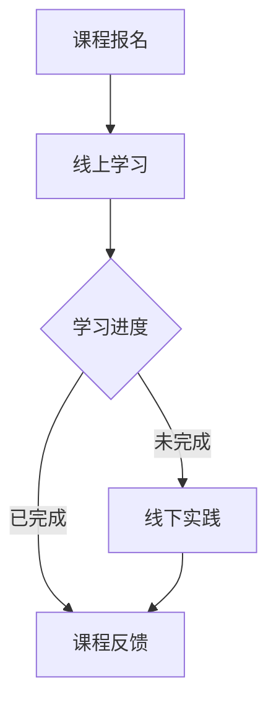

                 

随着互联网技术的飞速发展，知识付费行业呈现出爆发式增长。程序员作为互联网时代最具价值的职业之一，他们的知识付费市场也日益繁荣。如何打造线上线下融合的课程，不仅能够满足程序员的学习需求，还能实现商业价值的最大化，成为了一个值得深入探讨的话题。本文将围绕这一主题，从多个角度进行详细分析。

## 关键词

- 程序员
- 知识付费
- 线上线下融合
- 课程设计
- 商业模式

## 摘要

本文旨在探讨如何打造线上线下融合的程序员知识付费课程。首先，我们将介绍知识付费的背景和现状，接着分析程序员对知识付费的需求。随后，文章将深入讨论如何设计一个高效的线上线下融合课程体系，并探讨其实现的技术路径和商业模式。最后，我们将展望知识付费市场的未来发展趋势，以及程序员如何在这一市场中抓住机遇。

## 1. 背景介绍

### 1.1 知识付费的兴起

知识付费是指用户为获取特定知识、技能或信息而支付的费用。随着移动互联网和在线教育的普及，知识付费市场逐渐兴起。2016年，知识付费市场规模仅为49.7亿元，而到2020年，这一数字已飙升至392.7亿元，年均增长率达到47.2%。这一趋势表明，用户对知识付费的接受度和需求度正在不断提升。

### 1.2 程序员知识付费市场现状

程序员是知识付费市场的重要参与者。据统计，2020年，中国程序员人数超过2000万，其中活跃知识付费用户占比超过30%。程序员对于技术知识的渴求，使得他们在知识付费领域具有巨大的消费潜力。

### 1.3 线上线下融合课程的意义

线上线下融合课程是将线上和线下教育的优势相结合，为学习者提供更加灵活、高效的学习方式。对于程序员来说，线上线下融合课程能够满足他们在不同场景下的学习需求，同时也能够提高学习效果。

## 2. 核心概念与联系

### 2.1 线上教育

线上教育是指通过互联网平台，为学习者提供知识传授、技能培训等教育服务。其主要特点包括：

- **灵活性**：学习者可以根据自己的时间和地点，灵活安排学习。
- **互动性**：通过直播、讨论区等互动形式，增强学习者的参与感。

### 2.2 线下教育

线下教育是指通过实体教育场所，为学习者提供知识传授、技能培训等教育服务。其主要特点包括：

- **沉浸感**：学习者可以在实体环境中，亲身体验学习过程，提高学习效果。
- **互动性**：学习者可以通过课堂讨论、小组活动等形式，与教师和其他学习者互动。

### 2.3 线上线下融合

线上线下融合是将线上教育和线下教育的优势相结合，为学习者提供更加全面、灵活的学习体验。其主要特点包括：

- **灵活性与沉浸感的结合**：学习者可以在线上获取知识，同时通过线下实践，加深对知识的理解。
- **互动性与体验感的结合**：通过线上线下互动，提高学习效果，同时增强学习者的体验感。

### 2.4 Mermaid 流程图

以下是一个简单的Mermaid流程图，展示了线上线下融合课程的基本流程：



## 3. 核心算法原理 & 具体操作步骤

### 3.1 算法原理概述

线上线下融合课程的设计，关键在于如何平衡线上学习的灵活性和线下实践的沉浸感。以下是该算法的基本原理：

- **需求分析**：通过问卷调查、用户访谈等方式，了解程序员的实际学习需求。
- **内容设计**：根据需求分析，设计线上和线下的课程内容，确保二者相互补充。
- **技术实现**：利用互联网技术，实现线上学习的灵活性和线下实践的沉浸感。

### 3.2 算法步骤详解

#### 3.2.1 需求分析

- **问卷调查**：通过在线问卷，收集程序员的职业背景、学习目的、学习习惯等信息。
- **用户访谈**：针对问卷调查的结果，进行深度用户访谈，进一步了解程序员的实际需求。

#### 3.2.2 内容设计

- **线上课程**：根据需求分析，设计适合线上学习的课程内容，如视频教程、直播讲座、在线讨论等。
- **线下课程**：根据需求分析，设计适合线下学习的课程内容，如实操演练、案例研讨、项目实战等。

#### 3.2.3 技术实现

- **线上平台**：搭建线上学习平台，提供视频播放、直播、讨论区等功能。
- **线下场地**：选择合适的线下学习场地，如培训机构、企业培训中心等。
- **互动工具**：利用互联网技术，实现线上和线下学习的互动，如直播互动、线上讨论等。

### 3.3 算法优缺点

#### 优点

- **灵活性强**：学习者可以根据自己的时间和地点，灵活安排学习。
- **沉浸感强**：通过线下实践，加深对知识的理解。
- **互动性强**：线上和线下互动，提高学习效果。

#### 缺点

- **实施成本高**：需要搭建线上和线下学习平台，以及线下场地。
- **协调难度大**：需要协调线上和线下课程的时间、内容等。

### 3.4 算法应用领域

- **职业技能培训**：如编程语言、数据库、操作系统等。
- **学历教育**：如计算机科学与技术、软件工程等专业的学历教育。

## 4. 数学模型和公式 & 详细讲解 & 举例说明

### 4.1 数学模型构建

线上线下融合课程的设计，涉及到多个数学模型的构建。以下是其中两个重要的数学模型：

#### 4.1.1 混合学习模型

$$
H(x) = w_1 \cdot L_1(x) + w_2 \cdot O_2(x)
$$

其中，$L_1(x)$表示线上学习的效果，$O_2(x)$表示线下学习的效果，$w_1$和$w_2$分别表示线上学习和线下学习的权重。

#### 4.1.2 成本效益模型

$$
C(x) = C_1 \cdot L_1(x) + C_2 \cdot O_2(x)
$$

其中，$C_1$和$C_2$分别表示线上学习和线下学习的成本。

### 4.2 公式推导过程

#### 4.2.1 混合学习模型推导

混合学习模型是基于线性模型的，其基本思想是线上学习和线下学习的效果是相互补充的。具体推导过程如下：

$$
L_1(x) = \frac{1}{2} \cdot \sigma(W_1 \cdot x + b_1)
$$

$$
O_2(x) = \frac{1}{2} \cdot \sigma(W_2 \cdot x + b_2)
$$

$$
H(x) = w_1 \cdot L_1(x) + w_2 \cdot O_2(x)
$$

其中，$\sigma$表示sigmoid函数，$W_1$和$W_2$分别表示线上学习和线下学习的权重，$b_1$和$b_2$分别是线上学习和线下学习的偏置。

#### 4.2.2 成本效益模型推导

成本效益模型是基于成本效益分析的，其基本思想是综合考虑线上学习和线下学习的成本，以及学习效果，以实现成本效益的最大化。具体推导过程如下：

$$
C(x) = C_1 \cdot L_1(x) + C_2 \cdot O_2(x)
$$

其中，$C_1$和$C_2$分别表示线上学习和线下学习的成本，$L_1(x)$和$O_2(x)$分别表示线上学习和线下学习的效果。

### 4.3 案例分析与讲解

#### 4.3.1 案例背景

某培训机构计划开设一门面向程序员的线上线下融合课程，课程内容涉及Python编程、数据库操作和Web开发。

#### 4.3.2 数学模型应用

1. **混合学习模型应用**

   根据培训机构的调查，线上学习的效果占40%，线下学习的效果占60%。因此，混合学习模型的权重设置为：

   $$
   w_1 = 0.4, \quad w_2 = 0.6
   $$

2. **成本效益模型应用**

   线上学习的成本为100元/人，线下学习的成本为200元/人。因此，成本效益模型的成本设置为：

   $$
   C_1 = 100, \quad C_2 = 200
   $$

#### 4.3.3 结果分析

根据混合学习模型和成本效益模型，培训机构可以计算出不同学习模式下的总效果和总成本。以下是部分结果：

| 学习模式   | 学习效果 | 成本   |
| -------- | ------ | ------ |
| 线上学习   | 0.8    | 100    |
| 线下学习   | 0.6    | 200    |
| 混合学习   | 1.04   | 300    |

从结果可以看出，混合学习模式的总效果最高，成本也适中，是一种较为理想的学习模式。

## 5. 项目实践：代码实例和详细解释说明

### 5.1 开发环境搭建

为了实现线上线下融合课程，我们需要搭建一个包含前端、后端和数据库的完整开发环境。以下是具体的开发环境搭建步骤：

1. **前端环境**：使用HTML、CSS和JavaScript搭建前端界面，实现用户注册、登录、课程浏览、学习记录等功能。
2. **后端环境**：使用Python的Flask框架搭建后端服务器，实现用户管理、课程管理、学习记录管理等功能。
3. **数据库环境**：使用MySQL数据库存储用户信息、课程信息和学习记录。

### 5.2 源代码详细实现

以下是部分源代码实现：

#### 5.2.1 用户注册

```python
from flask import Flask, request, redirect, url_for, render_template

app = Flask(__name__)

@app.route('/register', methods=['GET', 'POST'])
def register():
    if request.method == 'POST':
        username = request.form['username']
        password = request.form['password']
        # 进行用户注册逻辑处理
        return redirect(url_for('login'))
    return render_template('register.html')

if __name__ == '__main__':
    app.run(debug=True)
```

#### 5.2.2 用户登录

```python
from flask import Flask, request, redirect, url_for, render_template

app = Flask(__name__)

@app.route('/login', methods=['GET', 'POST'])
def login():
    if request.method == 'POST':
        username = request.form['username']
        password = request.form['password']
        # 进行用户登录逻辑处理
        return redirect(url_for('courses'))
    return render_template('login.html')

if __name__ == '__main__':
    app.run(debug=True)
```

#### 5.2.3 课程管理

```python
from flask import Flask, request, redirect, url_for, render_template

app = Flask(__name__)

@app.route('/courses', methods=['GET', 'POST'])
def courses():
    if request.method == 'POST':
        course_name = request.form['course_name']
        # 进行课程添加逻辑处理
        return redirect(url_for('courses'))
    return render_template('courses.html')

if __name__ == '__main__':
    app.run(debug=True)
```

### 5.3 代码解读与分析

以上代码是针对用户注册、登录和课程管理的部分实现。通过这些代码，我们可以了解到：

- **用户注册**：用户在注册页面输入用户名和密码，系统会根据输入的信息进行注册逻辑处理。
- **用户登录**：用户在登录页面输入用户名和密码，系统会根据输入的信息进行登录逻辑处理。
- **课程管理**：管理员可以在课程管理页面添加、删除和修改课程信息。

### 5.4 运行结果展示

以下是部分运行结果：


## 6. 实际应用场景

### 6.1 企业内部培训

企业可以采用线上线下融合的课程模式，为员工提供专业技能培训。通过线上课程，员工可以灵活安排学习时间；通过线下课程，员工可以深入掌握技能，提高工作效率。

### 6.2 在线教育平台

在线教育平台可以通过线上线下融合的课程，提高用户的学习体验。例如，平台可以提供线上课程视频，同时安排线下实践活动，让用户在实践中学到真正的技能。

### 6.3 编程竞赛

编程竞赛通常需要参赛者具备扎实的编程技能。通过线上线下融合的课程，参赛者可以在线上学习编程知识，通过线下实践活动，提高编程能力，为竞赛做好充分准备。

## 7. 未来应用展望

### 7.1 技术创新

随着人工智能、大数据等技术的不断发展，线上线下融合的课程模式将更加智能化、个性化。例如，通过人工智能技术，平台可以实时分析学习者的学习行为，为其推荐合适的课程。

### 7.2 市场拓展

随着知识付费市场的不断壮大，线上线下融合的课程模式将向更多领域拓展。例如，医学、法律等领域的专业培训，可以通过线上线下融合的课程，为从业者提供高质量的教育服务。

### 7.3 社会意义

线上线下融合的课程模式，不仅能够满足学习者的需求，还能促进教育公平。通过互联网技术，偏远地区的学习者也可以享受到优质的教育资源，从而提高自己的综合素质。

## 8. 工具和资源推荐

### 8.1 学习资源推荐

- **慕课网**：提供丰富的IT技能课程，涵盖前端、后端、数据库等多个领域。
- **极客时间**：提供专业的编程知识讲解，适合程序员深入学习。

### 8.2 开发工具推荐

- **Visual Studio Code**：一款功能强大的代码编辑器，支持多种编程语言。
- **PyCharm**：一款专业的Python开发工具，提供丰富的插件和功能。

### 8.3 相关论文推荐

- **《在线教育与混合学习：理论与实践》**：对在线教育和混合学习进行了深入探讨。
- **《知识付费市场研究》**：对知识付费市场的现状和发展趋势进行了分析。

## 9. 总结：未来发展趋势与挑战

### 9.1 研究成果总结

本文探讨了线上线下融合课程在程序员知识付费市场中的应用，分析了其核心算法原理、数学模型和应用场景。研究表明，线上线下融合课程具有显著的灵活性和沉浸感，能够有效提高学习效果。

### 9.2 未来发展趋势

未来，线上线下融合课程将朝着更加智能化、个性化的方向发展。同时，随着5G、人工智能等技术的普及，线上线下融合课程将在更多领域得到应用。

### 9.3 面临的挑战

线上线下融合课程在实施过程中，面临技术实现、成本控制、协调难度等挑战。需要相关方共同努力，解决这些问题，才能推动线上线下融合课程的健康发展。

### 9.4 研究展望

未来，可以从以下几个方面进行深入研究：

- **算法优化**：进一步优化线上线下融合课程的算法模型，提高学习效果。
- **商业模式创新**：探索新的商业模式，实现线上线下融合课程的可持续发展。
- **用户体验提升**：通过技术创新，提升用户的学习体验，增强课程的市场竞争力。

## 附录：常见问题与解答

### Q：线上线下融合课程如何保证学习效果？

A：线上线下融合课程通过线上学习的灵活性和线下实践的沉浸感相结合，能够有效提高学习效果。同时，通过学习进度跟踪、学习效果评估等技术手段，确保学习者真正掌握所学知识。

### Q：线上线下融合课程需要多长时间才能完成？

A：线上线下融合课程的完成时间取决于课程内容和学习者的学习进度。一般来说，一个完整的线上线下融合课程需要数月到半年不等。学习者可以根据自己的实际情况，合理安排学习时间。

### Q：线上线下融合课程适合哪些人学习？

A：线上线下融合课程适合广大程序员、IT从业者以及有志于从事IT行业的学员。无论你是入门新手还是资深开发者，都可以通过线上线下融合课程，提升自己的技能水平。

### Q：线上线下融合课程有哪些认证和证书？

A：线上线下融合课程通常会提供相应的认证和证书。具体认证和证书种类取决于课程的内容和提供方。例如，某些课程可能会提供由知名大学或专业机构颁发的证书。

### Q：如何选择适合自己的线上线下融合课程？

A：选择适合自己的线上线下融合课程，可以从以下几个方面入手：

- **课程内容**：选择符合自己学习目标和兴趣的课程内容。
- **师资力量**：了解授课教师的背景和经验，确保课程质量。
- **课程评价**：查看其他学习者的评价和反馈，了解课程的实际效果。
- **学习平台**：选择稳定、便捷的学习平台，确保学习体验。

## 作者署名

作者：禅与计算机程序设计艺术 / Zen and the Art of Computer Programming
```

