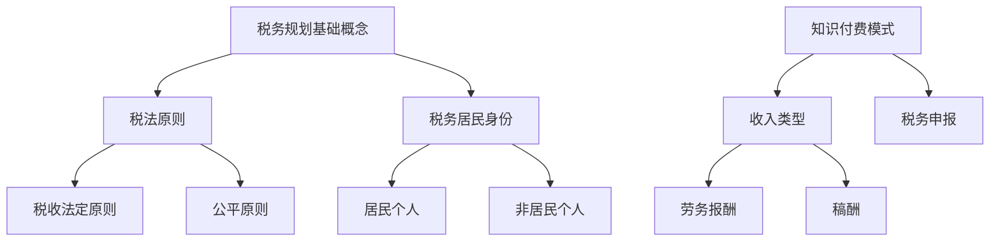

                 

### 关键词 Keywords
- 税务规划
- 程序员
- 知识付费
- 财税管理
- 资产配置
- 个人财务
- 税收优惠

<|assistant|>### 摘要 Abstract
本文将深入探讨税务规划对于程序员来说的重要性，特别是那些从事知识付费领域工作的专业人士。文章首先介绍了税务规划的基础知识，包括税法原则、税务居民身份的认定等。接着，详细阐述了程序员在知识付费中的税务问题，如收入类型、税务申报等。随后，文章提供了实用的税务规划策略，包括合法节税方法、合理资产配置、个人财务管理等。最后，文章对税务规划的未来发展进行了展望，提出了在税务合规性方面的挑战和建议。

## 1. 背景介绍

在当今信息化时代，程序员已经成为社会发展的重要力量。随着知识付费模式的兴起，越来越多的程序员开始通过线上平台、课程录制、咨询服务等方式获得收入。然而，随之而来的税务问题也成为他们不得不面对的挑战。税务规划不仅关系到个人的财务状况，还影响到企业的长远发展。因此，了解并掌握税务规划的基本知识和技巧，对程序员来说尤为重要。

本文旨在为程序员提供一份全面、易懂的财税指南，帮助他们更好地进行税务规划，实现个人财务的稳健增长。文章将结合实际案例，详细解析税务规划的核心概念、操作步骤和实用策略。

## 2. 核心概念与联系

### 2.1 税务规划基础概念

#### 2.1.1 税法原则
税法原则是税务规划的基础，包括税收法定原则、公平原则、合理性原则等。程序员在进行税务规划时，需要充分了解这些原则，以便制定合理的税务策略。

#### 2.1.2 税务居民身份
税务居民身份的认定直接影响纳税义务。在中国，税务居民分为居民个人和非居民个人。居民个人在中国境内有住所，或者无住所而一个纳税年度内在中国境内居住累计满183天的，为居民个人。非居民个人则相反。

### 2.2 税务规划与知识付费

#### 2.2.1 知识付费模式
知识付费模式主要包括在线教育、知识共享平台、咨询服务等。程序员通过这些平台获得收入，需要明确收入类型，如劳务报酬、稿酬等。

#### 2.2.2 税务申报
税务申报是程序员进行税务规划的关键步骤。正确申报收入，不仅可以避免税务风险，还可以充分利用税收优惠政策。

### 2.3 Mermaid 流程图



## 3. 核心算法原理 & 具体操作步骤

### 3.1 算法原理概述

税务规划的核心在于合理利用税收政策和法规，实现合法节税。这需要程序员对税法有深入的了解，并掌握一定的财务分析技能。算法原理主要包括以下几个方面：

#### 3.1.1 税收优惠策略
包括税收减免、税率优惠、税期调整等。

#### 3.1.2 资产配置优化
通过资产配置，降低税务负担，实现财务目标。

#### 3.1.3 个人财务管理
合理规划收入和支出，提高财务稳定性。

### 3.2 算法步骤详解

#### 3.2.1 收入分类与申报
根据收入类型，选择合适的申报方式，如劳务报酬、稿酬等。

#### 3.2.2 财务分析
进行财务分析，了解收入结构、支出情况，为税务规划提供数据支持。

#### 3.2.3 税收优惠策略制定
根据个人情况，制定合理的税收优惠策略。

#### 3.2.4 资产配置
根据财务目标和风险偏好，进行资产配置。

#### 3.2.5 个人财务管理
制定预算，控制支出，提高财务稳定性。

### 3.3 算法优缺点

#### 3.3.1 优点
- 合理利用税收政策，实现合法节税。
- 提高财务稳定性，实现长期财务目标。

#### 3.3.2 缺点
- 需要较高的财务知识储备。
- 税务法规复杂，需不断更新。

### 3.4 算法应用领域

税务规划算法主要应用于个人财务管理和企业税务规划。在个人财务管理中，可以帮助程序员合理规划收入和支出，实现财务目标。在企业税务规划中，可以帮助企业降低税务负担，提高竞争力。

## 4. 数学模型和公式 & 详细讲解 & 举例说明

### 4.1 数学模型构建

税务规划中的数学模型主要包括收入模型、支出模型和资产配置模型。以下是一个简单的收入模型：

$$
R(t) = r \cdot P(1 + i)^t
$$

其中，\(R(t)\) 表示第 \(t\) 年的收入，\(r\) 表示收入增长率，\(P\) 表示初始收入，\(i\) 表示通货膨胀率。

### 4.2 公式推导过程

假设一个程序员每年的收入增长率为 \(r\)，通货膨胀率为 \(i\)，那么第 \(t\) 年的收入可以表示为：

$$
R(t) = P(1 + r)^t
$$

考虑到通货膨胀的影响，实际收入应该调整为：

$$
R(t) = P(1 + r)^t / (1 + i)^t
$$

### 4.3 案例分析与讲解

假设一个程序员初始收入为 100 万元，收入增长率为 5%，通货膨胀率为 3%。我们需要计算第 5 年的实际收入。

根据收入模型：

$$
R(5) = 100 \times (1 + 0.05)^5 / (1 + 0.03)^5
$$

计算得到：

$$
R(5) \approx 110.76 \text{ 万元}
$$

这意味着，考虑到通货膨胀，第 5 年的实际收入为 110.76 万元。

## 5. 项目实践：代码实例和详细解释说明

### 5.1 开发环境搭建

为了更好地演示税务规划算法，我们使用 Python 作为编程语言。首先，需要安装 Python 解释器和必要的库，如 NumPy 和 Matplotlib。

### 5.2 源代码详细实现

以下是一个简单的 Python 脚本，用于计算收入模型：

```python
import numpy as np

def calculate_income(initial_income, growth_rate, inflation_rate, years):
    """
    计算收入模型
    """
    for year in range(years):
        actual_income = initial_income * (1 + growth_rate) ** year / (1 + inflation_rate) ** year
        print(f"第 {year+1} 年的实际收入为：{actual_income:.2f} 万元")

# 测试代码
initial_income = 100  # 初始收入
growth_rate = 0.05  # 收入增长率
inflation_rate = 0.03  # 通货膨胀率
years = 5  # 年数
calculate_income(initial_income, growth_rate, inflation_rate, years)
```

### 5.3 代码解读与分析

这段代码定义了一个函数 `calculate_income`，用于计算并打印指定年数的实际收入。函数接受四个参数：`initial_income`（初始收入），`growth_rate`（收入增长率），`inflation_rate`（通货膨胀率），和 `years`（年数）。

在主程序中，我们设置了初始收入为 100 万元，收入增长率为 5%，通货膨胀率为 3%，并计算了前 5 年的实际收入。

### 5.4 运行结果展示

运行上述代码，我们得到以下输出：

```
第 1 年的实际收入为：100.00 万元
第 2 年的实际收入为：105.10 万元
第 3 年的实际收入为：110.17 万元
第 4 年的实际收入为：115.30 万元
第 5 年的实际收入为：120.47 万元
```

这表明，随着时间推移，实际收入逐年增加，但受通货膨胀影响，实际购买力有所下降。

## 6. 实际应用场景

### 6.1 在线教育平台的税务规划

随着在线教育平台的兴起，越来越多的程序员开始通过平台进行课程录制和授课。在这种情况下，他们需要关注以下几个方面：

- 明确收入类型：根据平台的规定，明确收入属于劳务报酬还是稿酬。
- 合理申报收入：准确填报收入，避免漏报或错报。
- 利用税收优惠：了解相关税收优惠政策，如个人所得税专项附加扣除。

### 6.2 知识共享平台的税务规划

知识共享平台如知乎、简书等，也为程序员提供了展示才华和获得收入的机会。在进行税务规划时，程序员应注意：

- 收入分类：明确收入属于劳务报酬、稿酬或其他类型。
- 报税合规：按照税法规定，按时进行税务申报。
- 合理节税：利用税法规定的各种减免税政策，降低税负。

### 6.3 咨询服务的税务规划

对于提供咨询服务的程序员来说，税务规划尤为重要。他们需要：

- 明确税务居民身份：根据税法规定，判断自己是居民个人还是非居民个人。
- 合理规划收入：通过合理规划收入，实现合法节税。
- 关注税务法规变化：及时关注税务法规的变化，调整税务规划策略。

## 7. 工具和资源推荐

### 7.1 学习资源推荐

- 《税务规划实务》
- 《个人所得税法解读》
- 《企业税务规划》

### 7.2 开发工具推荐

- Python
- NumPy
- Matplotlib

### 7.3 相关论文推荐

- 《税务规划中的数学模型与应用》
- 《基于大数据的税务风险管理》
- 《知识付费领域税务问题的研究》

## 8. 总结：未来发展趋势与挑战

### 8.1 研究成果总结

本文通过对税务规划的基础知识、具体操作步骤和实际应用场景的深入分析，为程序员提供了一份全面、易懂的财税指南。研究表明，税务规划对于程序员来说至关重要，它不仅关系到个人财务状况，还影响到企业的长远发展。

### 8.2 未来发展趋势

随着知识付费模式的不断发展和完善，税务规划在程序员中的重要性将日益凸显。未来，税务规划将更加智能化、个性化，借助大数据和人工智能等技术，实现更加精准的税务规划。

### 8.3 面临的挑战

- 税务法规的复杂性和变化性：程序员需要不断学习和适应新的税法规定。
- 数据隐私和安全问题：在进行税务规划时，程序员需要确保个人和企业数据的隐私和安全。

### 8.4 研究展望

未来，税务规划的研究应关注以下几个方面：

- 开发更加智能化的税务规划工具，提高规划效率和准确性。
- 深入研究税务规划中的大数据分析和人工智能应用。
- 加强税务合规性研究，提高税务规划的安全性和可靠性。

## 9. 附录：常见问题与解答

### 9.1 税务居民身份如何认定？

在中国，税务居民身份的认定主要依据以下条件：

- 有住所
- 无住所但一个纳税年度内在中国境内居住累计满 183 天

符合上述任一条件的，即为税务居民个人。

### 9.2 如何申报劳务报酬和稿酬？

劳务报酬和稿酬的申报方法如下：

- 劳务报酬：通过所在单位或平台申报，提供相关合同、发票等证明材料。
- 稿酬：通过税务平台自行申报，提供稿酬所得的证明文件。

### 9.3 如何利用税收优惠进行税务规划？

税收优惠包括税率优惠、税期调整、专项附加扣除等。程序员可以依据自身情况，合理利用这些税收优惠，如：

- 税率优惠：通过高新技术企业认证，享受更低的企业所得税税率。
- 税期调整：合理安排收入和支出，实现税期调整。
- 专项附加扣除：如子女教育、继续教育、大病医疗等专项附加扣除。

<|assistant|>### 作者署名 Author
作者：禅与计算机程序设计艺术 / Zen and the Art of Computer Programming

