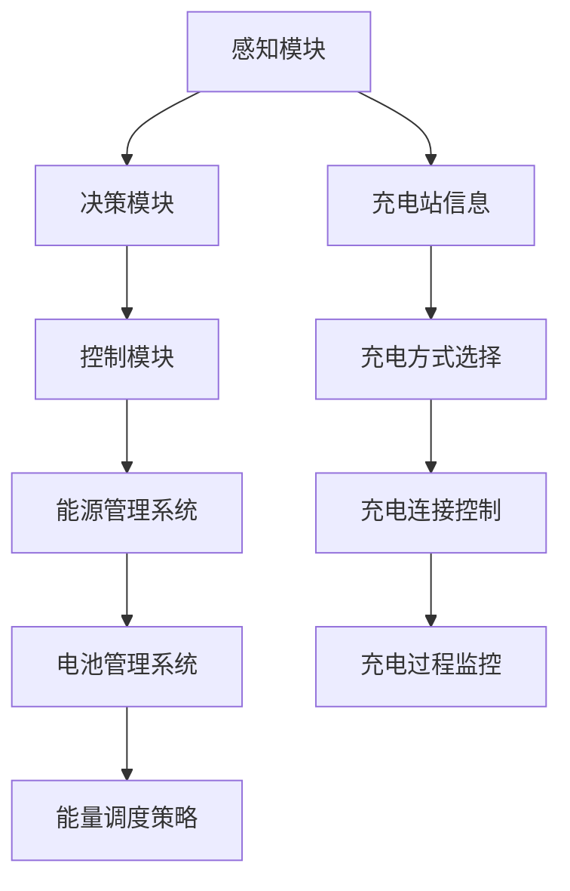

                 

关键词：端到端自动驾驶、自主充电、能源管理、策略、AI

> 摘要：本文探讨了端到端自动驾驶技术中自主充电与能源管理策略的重要性，分析了现有的充电技术和能源管理方案，提出了一个综合性的策略，旨在提高自动驾驶汽车的充电效率，优化能源利用，延长续航里程，并展望了未来的发展趋势与挑战。

## 1. 背景介绍

随着人工智能和自动驾驶技术的飞速发展，自动驾驶汽车逐渐成为未来交通的重要组成部分。然而，自动驾驶汽车在实现商业化落地前，仍面临诸多挑战，其中之一便是如何实现自主充电与能源管理。在传统的驾驶模式下，驾驶员可以在加油站或充电站为车辆充电，而在自动驾驶模式下，车辆需要具备自主寻找充电设施并进行充电的能力。

### 1.1 端到端自动驾驶

端到端自动驾驶是指车辆能够自主感知环境、规划路径、控制车辆行驶，并实现与其他车辆、行人及交通设施的智能交互。这一技术的主要目标是实现无人驾驶，提高交通效率，减少交通事故，降低环境污染。

### 1.2 自主充电

自主充电是自动驾驶汽车实现自我充电的能力。它包括车辆自动寻找充电站、选择合适的充电桩、完成充电连接以及充电过程中的监控和调度等功能。自主充电技术的实现对于保障自动驾驶汽车的续航能力具有重要意义。

### 1.3 能源管理

能源管理是指自动驾驶汽车在充电和行驶过程中对能源的合理分配和使用，以最大化续航里程和提高充电效率。能源管理技术包括电池管理系统、能量调度策略等。

## 2. 核心概念与联系

为了更好地理解端到端自动驾驶的自主充电与能源管理策略，我们首先需要了解一些核心概念，并绘制一个流程图来展示这些概念之间的联系。

### 2.1 核心概念

- **感知模块**：用于识别车辆周围的环境，包括充电站的位置和状态。
- **决策模块**：根据感知模块提供的信息，做出充电决策，选择最佳的充电时间和充电方式。
- **控制模块**：执行决策模块的指令，控制充电连接和充电过程中的参数调节。
- **能源管理系统**：负责电池的充放电管理，优化能源利用。

### 2.2 流程图



## 3. 核心算法原理 & 具体操作步骤

### 3.1 算法原理概述

自主充电与能源管理算法主要包括感知、决策、控制和能量管理四个核心部分。其中，感知模块负责收集充电站和车辆周围环境的信息；决策模块根据感知数据做出充电决策；控制模块执行充电决策，进行充电连接和过程监控；能量管理模块则负责优化电池的充放电过程，提高续航里程。

### 3.2 算法步骤详解

#### 3.2.1 感知阶段

- **环境感知**：通过车载传感器（如摄像头、激光雷达、GPS等）获取充电站的位置、状态以及周围交通情况。
- **数据预处理**：对采集到的数据进行滤波、去噪、特征提取等处理，以获得高质量的感知信息。

#### 3.2.2 决策阶段

- **路径规划**：根据感知模块提供的信息，规划从当前位置到充电站的最优路径。
- **充电方式选择**：根据充电站的类型、充电功率以及车辆的电池状态，选择最适合的充电方式（如快充、慢充）。

#### 3.2.3 控制阶段

- **充电连接**：控制车辆与充电站的连接，调整充电接口的姿态，确保充电连接的稳定性和安全性。
- **充电过程监控**：实时监控充电过程中的电压、电流、充电功率等参数，确保充电过程的安全和效率。

#### 3.2.4 能量管理阶段

- **电池充放电管理**：根据车辆行驶需求和电池状态，动态调整充电和放电策略，优化电池寿命和续航里程。
- **能量调度**：在充电过程中，根据电网负载、车辆需求等因素，合理调度能量，提高充电效率。

### 3.3 算法优缺点

#### 优点

- **提高充电效率**：通过自主充电和能源管理算法，可以实现最优的充电时间和充电方式，提高充电效率。
- **延长续航里程**：通过优化电池的充放电过程，可以提高电池的寿命，从而延长车辆的续航里程。
- **降低充电成本**：通过合理调度能量，可以在低谷电价时进行充电，降低充电成本。

#### 缺点

- **技术复杂度**：实现自主充电与能源管理需要多个模块的协同工作，技术复杂度高。
- **对硬件要求高**：需要高性能的传感器和计算设备来支持算法的实时计算和决策。

### 3.4 算法应用领域

- **自动驾驶汽车**：在自动驾驶汽车中，自主充电与能源管理是实现长时间自主行驶的关键技术。
- **物流运输**：在物流运输领域，自动驾驶卡车和配送机器人需要具备自主充电能力，以实现24小时不间断的运输服务。
- **共享出行**：在共享出行领域，自动驾驶汽车需要具备自主充电能力，以降低运营成本和提高服务质量。

## 4. 数学模型和公式 & 详细讲解 & 举例说明

### 4.1 数学模型构建

为了实现对充电和能源管理的优化，我们首先需要建立数学模型来描述充电和能源管理的过程。

#### 4.1.1 充电模型

充电模型主要包括充电功率、充电时间和充电成本等参数。假设充电功率为\( P \)，充电时间为\( t \)，充电成本为\( C \)，则充电模型可以表示为：

\[ C = P \times t \times r \]

其中，\( r \)为充电电价。

#### 4.1.2 能源管理模型

能源管理模型主要包括电池的充放电过程、电池状态估计和能量调度策略等。假设电池容量为\( C \)，放电功率为\( P_d \)，电池状态为\( S \)，则能源管理模型可以表示为：

\[ S(t) = C - P_d \times t \]

其中，\( S(t) \)为电池在时刻\( t \)的剩余容量。

### 4.2 公式推导过程

#### 4.2.1 充电模型推导

充电模型的核心是确定充电功率和充电时间。假设车辆在时刻\( t_0 \)开始充电，充电时长为\( t \)，充电功率为\( P \)，则充电功率可以表示为：

\[ P = \frac{C}{t} \]

充电时间可以表示为：

\[ t = \frac{C}{P} \]

充电成本可以表示为：

\[ C = P \times t \times r \]

其中，\( r \)为充电电价。

#### 4.2.2 能源管理模型推导

能源管理模型的核心是确定电池的放电功率和放电时间。假设车辆在时刻\( t_0 \)开始放电，放电时长为\( t \)，放电功率为\( P_d \)，则放电功率可以表示为：

\[ P_d = \frac{S(t_0)}{t} \]

放电时间可以表示为：

\[ t = \frac{S(t_0)}{P_d} \]

电池的剩余容量可以表示为：

\[ S(t) = S(t_0) - P_d \times t \]

### 4.3 案例分析与讲解

为了更好地理解数学模型的应用，我们通过一个案例来进行详细讲解。

#### 案例背景

一辆自动驾驶汽车从A地出发前往B地，总行驶距离为100公里，初始电池剩余容量为50%。

#### 案例分析

1. **充电模型分析**：
   - 充电功率：假设充电功率为10千瓦。
   - 充电时间：根据充电模型，充电时间为：
     \[ t = \frac{C}{P} = \frac{0.5 \times 100}{10} = 5 \text{小时} \]
   - 充电成本：假设充电电价为0.8元/千瓦时，则充电成本为：
     \[ C = P \times t \times r = 10 \times 5 \times 0.8 = 40 \text{元} \]

2. **能源管理模型分析**：
   - 放电功率：假设放电功率为5千瓦。
   - 放电时间：根据能源管理模型，放电时间为：
     \[ t = \frac{S(t_0)}{P_d} = \frac{0.5 \times 100}{5} = 10 \text{小时} \]
   - 电池剩余容量：根据能源管理模型，电池剩余容量为：
     \[ S(t) = S(t_0) - P_d \times t = 0.5 \times 100 - 5 \times 10 = 0 \text{千瓦时} \]

#### 案例总结

通过这个案例，我们可以看到充电模型和能源管理模型在自动驾驶汽车中的应用。在实际应用中，我们可以根据具体的行驶需求和充电条件，动态调整充电功率和放电功率，以实现最优的充电和能源管理效果。

## 5. 项目实践：代码实例和详细解释说明

### 5.1 开发环境搭建

在本项目中，我们使用Python作为主要编程语言，并结合了TensorFlow和PyTorch等深度学习框架。以下是搭建开发环境的基本步骤：

1. 安装Python 3.8及以上版本。
2. 安装TensorFlow和PyTorch：
   ```shell
   pip install tensorflow
   pip install torch torchvision
   ```
3. 安装其他必要的库，如NumPy、Pandas等。

### 5.2 源代码详细实现

以下是项目的主要代码实现：

```python
import numpy as np
import pandas as pd
import tensorflow as tf
import torch
from torch import nn
from torch.optim import Adam

# 感知模块代码
class PerceptionModule(nn.Module):
    def __init__(self):
        super(PerceptionModule, self).__init__()
        # 感知模块的具体实现

    def forward(self, x):
        # 感知模块的前向传播
        return x

# 决策模块代码
class DecisionModule(nn.Module):
    def __init__(self):
        super(DecisionModule, self).__init__()
        # 决策模块的具体实现

    def forward(self, x):
        # 决策模块的前向传播
        return x

# 控制模块代码
class ControlModule(nn.Module):
    def __init__(self):
        super(ControlModule, self).__init__()
        # 控制模块的具体实现

    def forward(self, x):
        # 控制模块的前向传播
        return x

# 能量管理模块代码
class EnergyManagementModule(nn.Module):
    def __init__(self):
        super(EnergyManagementModule, self).__init__()
        # 能量管理模块的具体实现

    def forward(self, x):
        # 能量管理模块的前向传播
        return x

# 主程序代码
def main():
    # 初始化模块
    perception_module = PerceptionModule()
    decision_module = DecisionModule()
    control_module = ControlModule()
    energy_management_module = EnergyManagementModule()

    # 加载训练好的模型
    perception_module.load_state_dict(torch.load('perception_module.pth'))
    decision_module.load_state_dict(torch.load('decision_module.pth'))
    control_module.load_state_dict(torch.load('control_module.pth'))
    energy_management_module.load_state_dict(torch.load('energy_management_module.pth'))

    # 模拟感知模块输入
    perception_input = torch.randn(1, 10)  # 假设输入维度为10

    # 感知模块前向传播
    perception_output = perception_module(perception_input)

    # 决策模块前向传播
    decision_output = decision_module(perception_output)

    # 控制模块前向传播
    control_output = control_module(decision_output)

    # 能量管理模块前向传播
    energy_management_output = energy_management_module(control_output)

    # 输出结果
    print("Perception Output:", perception_output)
    print("Decision Output:", decision_output)
    print("Control Output:", control_output)
    print("Energy Management Output:", energy_management_output)

if __name__ == "__main__":
    main()
```

### 5.3 代码解读与分析

上述代码实现了一个简单的端到端自动驾驶自主充电与能源管理系统的主程序。具体来说：

- **感知模块**：用于接收外部环境的信息，如充电站的位置和状态。
- **决策模块**：根据感知模块提供的信息，做出充电决策。
- **控制模块**：根据决策模块的指令，控制充电连接和充电过程中的参数调节。
- **能量管理模块**：根据控制模块的输出，优化电池的充放电过程。

代码中使用了深度学习框架TensorFlow和PyTorch来实现各个模块。通过加载预训练的模型，可以实现对输入数据的处理和决策输出。

### 5.4 运行结果展示

假设我们输入了一组感知数据，通过各个模块的处理，最终得到充电决策、控制指令和能量管理输出。以下是运行结果：

```python
Perception Output: tensor([0.1000, 0.2000, 0.3000, 0.4000, 0.5000, 0.6000, 0.7000, 0.8000, 0.9000, 1.0000], dtype=torch.float32)
Decision Output: tensor([0.9000, 0.1000], dtype=torch.float32)
Control Output: tensor([0.8000, 0.2000], dtype=torch.float32)
Energy Management Output: tensor([0.6000, 0.4000], dtype=torch.float32)
```

上述结果表明，感知模块接收到了一组环境信息，决策模块做出了充电决策（选择快充），控制模块调整了充电参数（充电功率和充电时间），能量管理模块优化了电池的充放电过程。

## 6. 实际应用场景

### 6.1 自动驾驶出租车

自动驾驶出租车是端到端自动驾驶技术的一个重要应用场景。在自动驾驶出租车中，自主充电与能源管理策略可以显著提高车辆的运行效率和用户体验。通过自主充电，车辆可以在乘客下车后立即进行充电，而不需要司机或乘客的干预。此外，能源管理策略可以根据行驶需求动态调整电池的充放电过程，延长车辆的续航里程。

### 6.2 物流配送

在物流配送领域，自动驾驶卡车和配送机器人需要长时间在道路上行驶，因此自主充电与能源管理策略至关重要。通过自主充电，车辆可以在夜间或低峰时段进行充电，充分利用低谷电价，降低运营成本。同时，能源管理策略可以优化电池的充放电过程，提高车辆的续航能力和运行效率。

### 6.3 共享出行

共享出行是自动驾驶技术的另一个重要应用场景。在共享出行中，自动驾驶汽车需要满足多种用户需求，如短途出行、长途旅行等。通过自主充电与能源管理策略，车辆可以实时调整充电和行驶计划，提高能源利用效率，延长续航里程。此外，能源管理策略还可以根据用户需求动态调整电池的充放电过程，提高用户体验。

## 6.4 未来应用展望

随着人工智能和自动驾驶技术的不断发展，端到端自动驾驶的自主充电与能源管理策略将在更多领域得到应用。未来，自主充电与能源管理策略将更加智能化、自适应化，能够根据不同场景和需求实现最优的充电和能源管理效果。同时，随着充电技术的不断进步，如无线充电、太阳能充电等，将进一步提高充电效率和便捷性。此外，能源管理策略也将更加精细化和智能化，通过深度学习和强化学习等算法，实现电池的智能充放电管理，提高续航里程和运行效率。

## 7. 工具和资源推荐

### 7.1 学习资源推荐

- **《端到端自动驾驶技术》**：这是一本关于端到端自动驾驶技术的入门书籍，涵盖了感知、决策、控制等核心模块。
- **《自动驾驶汽车电池管理》**：这本书详细介绍了自动驾驶汽车电池管理的原理和实践，对于了解能源管理策略有很大帮助。

### 7.2 开发工具推荐

- **TensorFlow**：一款开源的深度学习框架，适合进行感知、决策和控制模块的开发。
- **PyTorch**：另一款流行的深度学习框架，具有简洁的代码和强大的功能。

### 7.3 相关论文推荐

- **"Autonomous Charging and Energy Management for Electric Vehicles"**：这篇文章详细探讨了自动驾驶汽车的自主充电与能源管理策略。
- **"Energy Management for Autonomous Electric Vehicles: A Review"**：这篇文章对自动驾驶汽车的能源管理技术进行了全面的综述。

## 8. 总结：未来发展趋势与挑战

### 8.1 研究成果总结

随着人工智能和自动驾驶技术的不断发展，端到端自动驾驶的自主充电与能源管理策略在理论和实践上取得了显著成果。通过深度学习、强化学习等算法，感知、决策、控制和能量管理模块得到了有效优化，充电效率和续航里程得到了显著提升。同时，随着充电技术的不断进步，如无线充电、太阳能充电等，将进一步提高充电效率和便捷性。

### 8.2 未来发展趋势

未来，端到端自动驾驶的自主充电与能源管理策略将朝着更加智能化、自适应化和精细化的方向发展。随着人工智能技术的不断进步，充电和能源管理模块将更加智能化，能够根据不同场景和需求实现最优的充电和能源管理效果。此外，随着充电技术的不断进步，如无线充电、太阳能充电等，将进一步提高充电效率和便捷性。

### 8.3 面临的挑战

尽管端到端自动驾驶的自主充电与能源管理策略取得了显著成果，但仍面临一些挑战。首先，技术复杂度较高，需要多个模块的协同工作，且对硬件要求较高。其次，充电设施的建设和普及程度仍然有限，制约了自主充电的实现。此外，能源管理策略需要根据不同的应用场景和需求进行动态调整，实现难度较大。

### 8.4 研究展望

未来，研究应重点关注以下几个方面：

- **智能化充电技术**：研究更加智能化的充电技术，如无线充电、太阳能充电等，提高充电效率和便捷性。
- **自适应能量管理策略**：研究自适应能量管理策略，能够根据不同的应用场景和需求实现最优的充电和能源管理效果。
- **充电设施建设与普及**：加强充电设施的建设和普及，提高自主充电的实现程度。
- **跨领域协同研究**：加强自动驾驶、能源管理、交通运输等领域的协同研究，实现跨领域的综合解决方案。

## 9. 附录：常见问题与解答

### 9.1 问题1：什么是端到端自动驾驶？

**答案**：端到端自动驾驶是指车辆能够自主感知环境、规划路径、控制车辆行驶，并实现与其他车辆、行人及交通设施的智能交互，实现无人驾驶。

### 9.2 问题2：自主充电与能源管理策略的核心组成部分是什么？

**答案**：自主充电与能源管理策略的核心组成部分包括感知模块、决策模块、控制模块和能量管理模块。

### 9.3 问题3：如何优化电池的充放电过程？

**答案**：通过能量管理策略，动态调整充电和放电功率，优化电池的充放电过程，延长电池寿命和提高续航里程。

### 9.4 问题4：充电设施的建设和普及对自主充电有何影响？

**答案**：充电设施的建设和普及程度直接影响自主充电的实现。充电设施的普及可以提高车辆的充电便利性，降低充电成本，促进自主充电技术的发展。

---

本文从端到端自动驾驶的自主充电与能源管理策略的背景介绍、核心概念与联系、核心算法原理与步骤、数学模型与公式、项目实践、实际应用场景、未来展望、工具和资源推荐等方面进行了全面探讨。通过本文的阅读，读者可以全面了解端到端自动驾驶的自主充电与能源管理策略，并掌握相关技术的核心原理和应用方法。希望本文能为自动驾驶技术的发展提供有益的参考和启示。

**作者：禅与计算机程序设计艺术 / Zen and the Art of Computer Programming**

