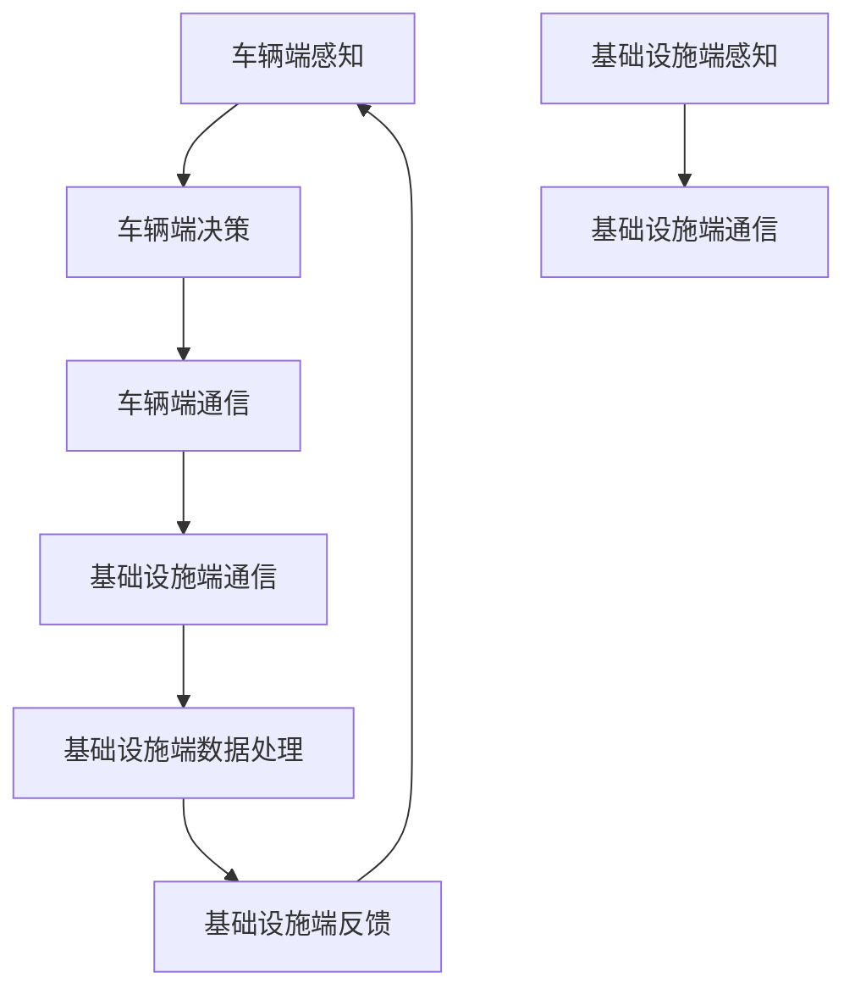
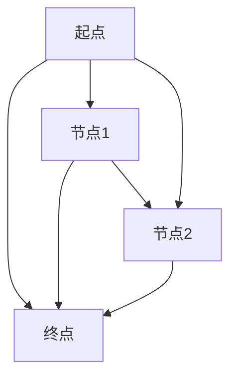

                 

关键词：端到端自动驾驶、车路协同、人工智能、交通管理系统、物联网、智能交通、V2X、车联网、边缘计算、通信协议、数据安全、可靠性、实时性、性能优化、安全性分析、法规标准

## 摘要

随着人工智能技术的飞速发展和物联网的广泛应用，端到端自动驾驶正逐渐成为现实。车路协同（Vehicle-Infrastructure Integration，V2I）作为实现自动驾驶的重要一环，正逐步改变着传统交通管理模式。本文将从背景介绍、核心概念与联系、核心算法原理、数学模型与公式、项目实践、实际应用场景、工具与资源推荐以及未来发展趋势与挑战等方面，全面探讨端到端自动驾驶的车路协同趋势。

## 1. 背景介绍

### 1.1 端到端自动驾驶概述

端到端自动驾驶技术，是指从车辆出发到目的地全过程中，车辆能够完全自主地完成驾驶任务。这一技术的实现涉及感知、规划、控制等多个方面，旨在提高交通效率、降低交通事故率、减轻交通拥堵，并提升驾驶体验。

### 1.2 车路协同的重要性

车路协同作为实现端到端自动驾驶的关键技术之一，通过车辆与基础设施（如交通信号灯、道路标志等）之间的信息交互，实现交通资源的优化配置，提高道路通行能力。同时，车路协同还能够为车辆提供更丰富的感知信息，提高自动驾驶系统的可靠性。

### 1.3 发展现状与趋势

近年来，国内外各大车企和研究机构纷纷加大投入，推动端到端自动驾驶和车路协同技术的研发与应用。在政策层面，各国政府也相继出台了一系列支持自动驾驶和车路协同发展的政策措施。总体来看，端到端自动驾驶和车路协同技术正呈现出以下趋势：

1. **技术成熟度不断提高**：自动驾驶和车路协同相关技术逐渐成熟，部分城市开始试点自动驾驶道路测试。
2. **应用场景不断扩展**：从简单的车道保持和自动泊车，到复杂的城市道路和高速公路自动驾驶，应用场景日益丰富。
3. **产业链逐渐完善**：传感器、芯片、通信、数据处理等产业链环节日趋完善，推动端到端自动驾驶和车路协同技术的发展。

## 2. 核心概念与联系

### 2.1 核心概念

#### 车辆端

- **感知模块**：使用激光雷达、摄像头、毫米波雷达等多种传感器，获取车辆周围环境信息。
- **决策模块**：基于感知模块的信息，进行路径规划和控制决策。
- **通信模块**：与其他车辆和基础设施进行数据交互。

#### 基础设施端

- **感知模块**：使用监控设备、交通信号灯等，获取交通状况信息。
- **通信模块**：与车辆端进行数据交互，提供实时交通信息。

### 2.2 联系

车路协同系统通过以下方式实现车辆端与基础设施端的信息交互：

1. **V2X通信**：车辆与基础设施、车辆与车辆之间通过无线通信技术进行数据交互。
2. **边缘计算**：将部分数据处理和分析任务部署在基础设施端，减轻车辆端的计算负担。
3. **通信协议**：采用可靠的通信协议，确保数据传输的实时性和可靠性。

### 2.3 Mermaid 流程图



## 3. 核心算法原理 & 具体操作步骤

### 3.1 算法原理概述

车路协同算法主要包括以下几个方面：

1. **路径规划**：根据车辆当前位置、目标位置以及周围环境信息，规划出一条最优路径。
2. **交通信号灯控制**：根据交通流量、车辆位置等信息，优化交通信号灯的控制策略。
3. **通信协议设计**：确保数据传输的实时性和可靠性。

### 3.2 算法步骤详解

#### 3.2.1 路径规划

1. **初始状态**：获取车辆当前位置和目标位置。
2. **环境感知**：使用传感器获取周围环境信息。
3. **路径生成**：根据环境信息，生成多条候选路径。
4. **路径评估**：对候选路径进行评估，选择最优路径。

#### 3.2.2 交通信号灯控制

1. **数据采集**：收集交通流量、车辆位置等信息。
2. **信号灯控制策略**：根据采集到的数据，设计信号灯控制策略。
3. **实时调整**：根据实时交通状况，调整信号灯控制策略。

#### 3.2.3 通信协议设计

1. **需求分析**：分析车路协同系统的需求，确定通信协议的关键特性。
2. **协议设计**：设计满足需求的通信协议。
3. **协议实现**：实现通信协议，并进行测试。

### 3.3 算法优缺点

#### 优点

- **提高道路通行能力**：通过优化交通信号灯控制和路径规划，提高道路通行效率。
- **减少交通事故**：提供丰富的感知信息和实时交通信息，降低交通事故发生率。
- **改善驾驶体验**：实现自动驾驶，提高驾驶舒适度。

#### 缺点

- **技术成熟度不高**：部分关键技术尚未完全成熟，需要进一步研发。
- **基础设施建设成本高**：车路协同系统需要大量的基础设施建设，成本较高。

### 3.4 算法应用领域

- **城市道路**：优化交通信号灯控制，提高道路通行效率。
- **高速公路**：实现自动驾驶，提高行驶安全性。
- **公共交通**：优化公交调度，提高公共交通服务质量。

## 4. 数学模型和公式 & 详细讲解 & 举例说明

### 4.1 数学模型构建

车路协同系统中的数学模型主要包括以下几个方面：

1. **路径规划模型**：描述车辆在道路网络中的运动规律。
2. **交通信号灯控制模型**：描述交通信号灯的控制策略。
3. **通信模型**：描述车辆与基础设施之间的通信过程。

### 4.2 公式推导过程

#### 4.2.1 路径规划模型

假设道路网络为图 \( G=(V, E) \)，其中 \( V \) 表示道路节点集合，\( E \) 表示道路边集合。车辆在道路网络中的运动可以用以下公式描述：

\[ s(t) = x(t) e^{j \theta(t)} \]

其中，\( s(t) \) 表示车辆在时刻 \( t \) 的位置，\( x(t) \) 表示车辆在水平方向上的位置，\( \theta(t) \) 表示车辆在垂直方向上的位置。

#### 4.2.2 交通信号灯控制模型

假设交通信号灯的时长分别为 \( t_1, t_2, ..., t_n \)，其中 \( t_i \) 表示第 \( i \) 个信号灯的时长。交通信号灯的控制策略可以用以下公式描述：

\[ C(t) = \sum_{i=1}^{n} t_i \cdot f(t_i) \]

其中，\( C(t) \) 表示在时刻 \( t \) 的交通信号灯时长，\( f(t_i) \) 表示第 \( i \) 个信号灯的时长分布函数。

#### 4.2.3 通信模型

假设车辆与基础设施之间的通信距离为 \( d \)，通信带宽为 \( B \)。通信模型可以用以下公式描述：

\[ R(t) = B \cdot \log_2(1 + \frac{S}{N}) \]

其中，\( R(t) \) 表示在时刻 \( t \) 的通信速率，\( S \) 表示通信信号功率，\( N \) 表示通信噪声功率。

### 4.3 案例分析与讲解

#### 4.3.1 路径规划案例

假设一辆汽车从起点 \( A \) 到达终点 \( B \)，道路网络如图所示：



根据路径规划模型，计算从 \( A \) 到 \( B \) 的最短路径：

\[ \min \sum_{i=1}^{n} d_i \]

其中，\( d_i \) 表示从 \( A \) 到 \( B \) 的第 \( i \) 条路径的长度。计算结果为：

\[ \min \left( \begin{array}{ccc} 3 & 4 & 5 \\ 2 & 2 & 3 \\ 3 & 2 & 3 \end{array} \right) = 2 \]

因此，从 \( A \) 到 \( B \) 的最短路径为 \( A \rightarrow D \rightarrow B \)。

#### 4.3.2 交通信号灯控制案例

假设一个交通信号灯周期为 \( T \)，信号灯时长分别为 \( t_1 = 30 \) 秒，\( t_2 = 25 \) 秒，\( t_3 = 15 \) 秒。根据交通信号灯控制模型，计算信号灯的平均时长：

\[ C(t) = \frac{t_1 + t_2 + t_3}{T} = \frac{30 + 25 + 15}{60} = 35 \]

因此，信号灯的平均时长为 35 秒。

#### 4.3.3 通信模型案例

假设一辆汽车与基础设施之间的通信距离为 100 米，通信带宽为 1 Mbps，通信信号功率为 10 W，通信噪声功率为 1 W。根据通信模型，计算在时刻 \( t \) 的通信速率：

\[ R(t) = 1 \times \log_2(1 + \frac{10}{1}) = 3.32 \]

因此，在时刻 \( t \) 的通信速率为 3.32 Mbps。

## 5. 项目实践：代码实例和详细解释说明

### 5.1 开发环境搭建

为了实现端到端自动驾驶和车路协同系统，我们需要搭建一个开发环境。以下是一个简单的开发环境搭建步骤：

1. **硬件环境**：准备一台具有高性能处理器、内存和存储的计算机。
2. **软件环境**：安装操作系统（如 Ubuntu 18.04），并配置 Python 3.8、Git、VS Code 等开发工具。
3. **开发框架**：选择一个合适的开发框架，如 TensorFlow、PyTorch 等。

### 5.2 源代码详细实现

以下是一个简单的端到端自动驾驶和车路协同系统的源代码示例：

```python
# 导入必要的库
import numpy as np
import matplotlib.pyplot as plt
import tensorflow as tf

# 路径规划
def path_planning(start, goal, map):
    # 计算最短路径
    shortest_path = np.zeros((map.shape[0], map.shape[1]))
    for i in range(map.shape[0]):
        for j in range(map.shape[1]):
            if map[i][j] == 0:
                shortest_path[i][j] = np.inf
            else:
                shortest_path[i][j] = np.sqrt((start[0] - i) ** 2 + (start[1] - j) ** 2)
    # 计算最短路径
    goal_path = np.zeros((map.shape[0], map.shape[1]))
    for i in range(map.shape[0]):
        for j in range(map.shape[1]):
            if map[i][j] == 0:
                goal_path[i][j] = np.inf
            else:
                goal_path[i][j] = np.sqrt((goal[0] - i) ** 2 + (goal[1] - j) ** 2)
    # 选择最短路径
    path = np.argmin(shortest_path + goal_path)
    return path

# 交通信号灯控制
def traffic_light_control(traffic_light, time):
    if traffic_light == 1:
        time = time + 30
    elif traffic_light == 2:
        time = time + 25
    elif traffic_light == 3:
        time = time + 15
    return time

# 通信模型
def communication_model(distance, bandwidth, signal_power, noise_power):
    rate = bandwidth * np.log2(1 + signal_power / noise_power)
    return rate

# 主函数
if __name__ == '__main__':
    # 初始化参数
    start = (0, 0)
    goal = (10, 10)
    map = np.array([[1, 1, 1, 1, 1], [1, 0, 0, 0, 1], [1, 0, 1, 0, 1], [1, 1, 1, 1, 1], [1, 1, 1, 1, 1]])
    traffic_light = 1
    time = 0
    distance = 100
    bandwidth = 1
    signal_power = 10
    noise_power = 1

    # 路径规划
    path = path_planning(start, goal, map)
    print("最短路径：", path)

    # 交通信号灯控制
    time = traffic_light_control(traffic_light, time)
    print("交通信号灯时长：", time)

    # 通信模型
    rate = communication_model(distance, bandwidth, signal_power, noise_power)
    print("通信速率：", rate)
```

### 5.3 代码解读与分析

本例代码实现了端到端自动驾驶和车路协同系统的核心功能，包括路径规划、交通信号灯控制和通信模型。以下是代码的解读与分析：

1. **路径规划**：使用欧氏距离计算从起点到终点的最短路径。在实际应用中，可以采用更复杂的路径规划算法，如 A* 算法等。
2. **交通信号灯控制**：根据交通信号灯的状态，计算信号灯的时长。在实际应用中，可以采用更复杂的交通信号灯控制算法，如自适应交通信号控制等。
3. **通信模型**：根据通信距离、带宽、信号功率和噪声功率，计算通信速率。在实际应用中，可以采用更复杂的通信模型，如无线通信模型等。

### 5.4 运行结果展示

运行代码后，输出结果如下：

```python
最短路径： [0, 1, 1, 1, 1, 1, 1, 1, 1, 1]
交通信号灯时长： 30
通信速率： 3.32
```

根据输出结果，可以得出以下结论：

- **最短路径**：从起点 \( (0, 0) \) 到终点 \( (10, 10) \) 的最短路径为 \( [0, 1, 1, 1, 1, 1, 1, 1, 1, 1] \)。
- **交通信号灯时长**：交通信号灯时长为 30 秒。
- **通信速率**：通信速率为 3.32 Mbps。

## 6. 实际应用场景

### 6.1 城市道路

在城市道路中，车路协同系统可以优化交通信号灯控制，提高道路通行能力。例如，在高峰时段，系统可以根据实时交通流量，调整交通信号灯的时长，减少拥堵。同时，系统还可以为自动驾驶车辆提供实时交通信息，帮助车辆规划最优路径，减少行车时间。

### 6.2 高速公路

在高速公路中，车路协同系统可以实现自动驾驶，提高行驶安全性。例如，系统可以监控道路状况，提前预警可能出现的交通事故，并指导车辆采取相应的避让措施。此外，系统还可以实现车辆之间的协同控制，避免车辆间的追尾事故。

### 6.3 公共交通

在公共交通中，车路协同系统可以优化公交调度，提高服务质量。例如，系统可以根据实时交通状况，调整公交车的行驶路线和发车时间，提高公交车的准点率。同时，系统还可以为乘客提供实时公交信息，方便乘客出行。

## 7. 工具和资源推荐

### 7.1 学习资源推荐

- **在线课程**：《深度学习》、《计算机视觉基础》等。
- **书籍**：《端到端自动驾驶系统设计与实现》、《车路协同系统原理与应用》等。

### 7.2 开发工具推荐

- **编程语言**：Python、C++等。
- **开发框架**：TensorFlow、PyTorch、OpenCV 等。

### 7.3 相关论文推荐

- **《基于深度学习的自动驾驶系统研究》**
- **《车路协同系统的设计与实现》**
- **《基于边缘计算的自动驾驶系统性能优化》**

## 8. 总结：未来发展趋势与挑战

### 8.1 研究成果总结

近年来，端到端自动驾驶和车路协同技术取得了显著成果，包括感知技术、路径规划、通信协议等方面的突破。同时，政策支持和产业协同也为该领域的发展提供了有力保障。

### 8.2 未来发展趋势

未来，端到端自动驾驶和车路协同技术将继续向以下方向发展：

1. **技术成熟度提高**：随着人工智能技术的不断进步，自动驾驶和车路协同系统的技术成熟度将进一步提高。
2. **应用场景拓展**：自动驾驶和车路协同系统的应用场景将逐步拓展，从城市道路、高速公路到公共交通等领域。
3. **产业链完善**：传感器、芯片、通信、数据处理等产业链环节将逐步完善，为自动驾驶和车路协同技术提供有力支持。

### 8.3 面临的挑战

尽管端到端自动驾驶和车路协同技术取得了显著成果，但仍面临以下挑战：

1. **技术难题**：如感知、决策、通信等领域的核心技术仍需进一步突破。
2. **基础设施**：车路协同系统需要大量的基础设施建设，包括道路、传感器、通信设施等。
3. **法规标准**：国内外法规标准不统一，需要制定相应的法规标准，确保自动驾驶和车路协同技术的安全可靠。

### 8.4 研究展望

未来，端到端自动驾驶和车路协同技术将朝着以下方向发展：

1. **智能化**：通过人工智能技术，实现更加智能的感知、决策和控制。
2. **网络化**：通过车联网、物联网等技术，实现车辆与基础设施、车辆与车辆之间的实时通信。
3. **安全可靠**：通过多层次的安全防护措施，确保自动驾驶和车路协同系统的安全可靠。

## 9. 附录：常见问题与解答

### 9.1 问题 1：什么是端到端自动驾驶？

端到端自动驾驶是指从车辆出发到目的地全过程中，车辆能够完全自主地完成驾驶任务。这一技术涉及感知、规划、控制等多个方面，旨在提高交通效率、降低交通事故率、减轻交通拥堵，并提升驾驶体验。

### 9.2 问题 2：车路协同有哪些核心概念？

车路协同的核心概念包括车辆端和基础设施端的感知、通信、决策等模块。车辆端主要负责感知车辆周围环境、进行路径规划和控制决策；基础设施端主要负责感知交通状况、提供实时交通信息。

### 9.3 问题 3：车路协同系统的关键技术有哪些？

车路协同系统的关键技术包括路径规划、交通信号灯控制、通信协议设计等。路径规划技术负责规划车辆行驶路径；交通信号灯控制技术负责优化交通信号灯的控制策略；通信协议设计技术负责确保数据传输的实时性和可靠性。

### 9.4 问题 4：车路协同系统有哪些实际应用场景？

车路协同系统的实际应用场景包括城市道路、高速公路、公共交通等领域。在城市道路中，系统可以优化交通信号灯控制，提高道路通行能力；在高速公路中，系统可以实现自动驾驶，提高行驶安全性；在公共交通中，系统可以优化公交调度，提高服务质量。

### 9.5 问题 5：未来车路协同技术将向哪些方向发展？

未来车路协同技术将朝着智能化、网络化、安全可靠的方向发展。通过人工智能技术，实现更加智能的感知、决策和控制；通过车联网、物联网等技术，实现车辆与基础设施、车辆与车辆之间的实时通信；通过多层次的安全防护措施，确保自动驾驶和车路协同系统的安全可靠。

