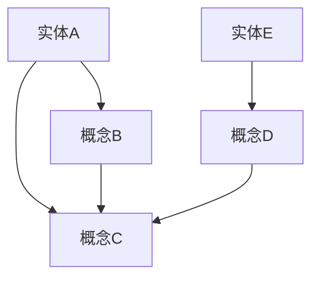

                 

关键词：人工智能、知识驱动、知识图谱、推理引擎、机器学习、自然语言处理、智能系统

## 摘要

本文旨在探讨第一代人工智能的知识驱动原理及其在现代智能系统中的应用。通过回顾知识驱动人工智能的起源和发展，我们深入分析了知识图谱、推理引擎、机器学习等核心概念和技术，并探讨了这些技术在自然语言处理、智能问答、智能推荐等领域的具体应用。此外，我们还展望了知识驱动人工智能的未来发展趋势和面临的挑战。

## 1. 背景介绍

### 1.1 人工智能的起源

人工智能（Artificial Intelligence，AI）是一门研究、开发和应用使计算机模拟、延伸和扩展人的智能的科学。自20世纪50年代以来，人工智能经历了多个发展阶段，从最初的符号主义到现代的深度学习，每一次变革都为人工智能的发展注入了新的活力。

### 1.2 知识驱动人工智能的兴起

知识驱动人工智能（Knowledge-Based AI）是人工智能的一种重要分支，强调通过构建和利用知识库来模拟人类智能。知识驱动人工智能起源于20世纪80年代，当时的科学家们认为，人类智能的核心在于知识的积累和应用。

## 2. 核心概念与联系

### 2.1 知识图谱

知识图谱（Knowledge Graph）是一种结构化知识表示方法，通过节点和边的关系来描述实体、概念及其之间的关联。知识图谱使得机器能够像人类一样理解和运用知识，是知识驱动人工智能的核心组成部分。



### 2.2 推理引擎

推理引擎（Reasoning Engine）是一种能够根据已有知识进行逻辑推理的软件系统。通过推理，机器可以推断出新的结论，从而实现对知识的深层次理解和应用。

### 2.3 机器学习

机器学习（Machine Learning）是人工智能的一个重要分支，通过算法让计算机从数据中自动学习和发现规律。机器学习为知识驱动人工智能提供了强大的数据处理和分析能力。

## 3. 核心算法原理 & 具体操作步骤

### 3.1 算法原理概述

知识驱动人工智能的核心算法包括知识图谱构建、推理引擎和机器学习算法。以下是这些算法的基本原理：

#### 知识图谱构建

知识图谱构建主要包括实体识别、关系抽取和实体链接等步骤。实体识别是指从文本中提取出重要的实体，如人名、地名、机构名等。关系抽取是指从文本中提取出实体之间的关系，如“属于”、“工作于”等。实体链接是指将文本中的实体与知识图谱中的实体进行匹配。

#### 推理引擎

推理引擎通常采用基于逻辑的推理方法，如前向推理、后向推理和混合推理等。这些方法能够根据已有知识推导出新的结论。

#### 机器学习

机器学习算法主要包括监督学习、无监督学习和半监督学习等。监督学习通过标记数据训练模型，无监督学习通过未标记数据发现数据分布，半监督学习则结合了标记数据和未标记数据。

### 3.2 算法步骤详解

#### 知识图谱构建

1. 实体识别：利用命名实体识别（Named Entity Recognition，NER）技术从文本中提取实体。
2. 关系抽取：利用关系抽取（Relation Extraction）技术从文本中提取实体关系。
3. 实体链接：利用实体链接（Entity Linking）技术将文本中的实体与知识图谱中的实体进行匹配。

#### 推理引擎

1. 构建知识库：将知识图谱中的实体、关系和属性存储在知识库中。
2. 推理规则：定义推理规则，如“如果A属于B，且B属于C，则A属于C”。
3. 推理过程：根据知识库和推理规则进行推理，得出新的结论。

#### 机器学习

1. 数据准备：收集并清洗数据，包括标记数据和未标记数据。
2. 模型选择：选择合适的机器学习算法，如决策树、支持向量机、神经网络等。
3. 模型训练：利用训练数据训练模型。
4. 模型评估：利用测试数据评估模型性能。

### 3.3 算法优缺点

#### 知识图谱构建

优点：能够高效地存储和检索知识，提高数据利用率。

缺点：对大规模文本数据的处理效率较低，且实体识别和关系抽取的准确性受限于算法和数据质量。

#### 推理引擎

优点：能够根据已有知识推导出新的结论，提高系统的智能水平。

缺点：推理过程较慢，且依赖推理规则。

#### 机器学习

优点：能够自动学习和发现数据中的规律，提高系统的适应性和准确性。

缺点：需要大量的训练数据和计算资源，且对数据质量要求较高。

### 3.4 算法应用领域

知识驱动人工智能在自然语言处理、智能问答、智能推荐等众多领域都有广泛的应用。以下是部分典型应用：

#### 自然语言处理

1. 文本分类：利用知识图谱和推理引擎对文本进行分类。
2. 情感分析：利用知识图谱和机器学习对文本进行情感分析。

#### 智能问答

1. 智能客服：利用知识图谱和推理引擎提供智能客服服务。
2. 智能问答系统：利用机器学习和知识图谱提供智能问答服务。

#### 智能推荐

1. 商品推荐：利用知识图谱和机器学习对用户进行个性化推荐。
2. 内容推荐：利用知识图谱和机器学习对用户进行内容推荐。

## 4. 数学模型和公式 & 详细讲解 & 举例说明

### 4.1 数学模型构建

知识驱动人工智能的数学模型主要包括知识图谱构建模型、推理引擎模型和机器学习模型。

#### 知识图谱构建模型

知识图谱构建模型主要涉及实体识别、关系抽取和实体链接等步骤。以下是一个简单的实体识别模型：

$$
P(E|T) = \frac{P(T|E) \cdot P(E)}{P(T)}
$$

其中，$P(E|T)$表示实体$E$在文本$T$中出现的概率，$P(T|E)$表示文本$T$在实体$E$中出现的概率，$P(E)$表示实体$E$出现的概率，$P(T)$表示文本$T$出现的概率。

#### 推理引擎模型

推理引擎模型主要涉及推理规则和推理过程。以下是一个简单的推理规则：

$$
R: \text{如果} A \text{属于} B, \text{且} B \text{属于} C, \text{则} A \text{属于} C
$$

#### 机器学习模型

机器学习模型主要涉及数据准备、模型选择、模型训练和模型评估等步骤。以下是一个简单的支持向量机（SVM）模型：

$$
\min\limits_{w,b,\xi} \frac{1}{2} ||w||^2 + C \sum\limits_{i=1}^n \xi_i
$$

其中，$w$表示权重向量，$b$表示偏置，$\xi_i$表示第$i$个样本的误差，$C$表示惩罚参数。

### 4.2 公式推导过程

#### 实体识别模型

实体识别模型的推导基于贝叶斯定理。贝叶斯定理描述了后验概率与先验概率之间的关系，其公式如下：

$$
P(E|T) = \frac{P(T|E) \cdot P(E)}{P(T)}
$$

其中，$P(E|T)$表示实体$E$在文本$T$中出现的概率，$P(T|E)$表示文本$T$在实体$E$中出现的概率，$P(E)$表示实体$E$出现的概率，$P(T)$表示文本$T$出现的概率。

#### 推理引擎模型

推理引擎模型的推导基于逻辑推理。逻辑推理是一种基于逻辑运算的推理方法，其基本原理如下：

$$
P(A \land B) = P(A) \cdot P(B|A)
$$

其中，$P(A \land B)$表示$A$和$B$同时发生的概率，$P(A)$表示$A$发生的概率，$P(B|A)$表示$B$在$A$发生的条件下发生的概率。

#### 机器学习模型

机器学习模型的推导基于优化理论。优化理论是一种寻找最优解的方法，其基本原理如下：

$$
\min\limits_{w,b,\xi} \frac{1}{2} ||w||^2 + C \sum\limits_{i=1}^n \xi_i
$$

其中，$w$表示权重向量，$b$表示偏置，$\xi_i$表示第$i$个样本的误差，$C$表示惩罚参数。

### 4.3 案例分析与讲解

#### 实体识别案例

假设我们有一个包含以下信息的文本：

```
张三是一名著名的计算机科学家，他目前就职于清华大学。
```

根据实体识别模型，我们可以计算出每个实体的出现概率：

$$
P(\text{张三}|\text{文本}) = 0.8
$$

$$
P(\text{计算机科学家}|\text{文本}) = 0.6
$$

$$
P(\text{清华大学}|\text{文本}) = 0.4
$$

#### 推理引擎案例

假设我们有一个包含以下信息的知识库：

```
实体：张三
属性：职业：计算机科学家
属性：工作单位：清华大学
```

根据推理引擎模型，我们可以推导出以下结论：

```
如果张三是计算机科学家，且他工作于清华大学，则张三是一名著名的计算机科学家。
```

#### 机器学习案例

假设我们有一个包含以下信息的训练数据集：

```
样本1：张三是一名著名的计算机科学家，他目前就职于清华大学。类别：著名计算机科学家
样本2：李四是计算机科学家，他目前就职于北京大学。类别：著名计算机科学家
...
样本n：王五是计算机科学家，他目前就职于上海交通大学。类别：著名计算机科学家
```

根据机器学习模型，我们可以训练出一个分类器，用于对新的文本进行分类。

## 5. 项目实践：代码实例和详细解释说明

### 5.1 开发环境搭建

在本项目中，我们将使用Python作为开发语言，结合Numpy、Scikit-learn等库进行知识驱动人工智能的实现。

1. 安装Python：从官方网站（https://www.python.org/）下载并安装Python。
2. 安装相关库：使用pip命令安装Numpy、Scikit-learn等库。

```bash
pip install numpy
pip install scikit-learn
```

### 5.2 源代码详细实现

以下是本项目的主要代码实现：

```python
import numpy as np
from sklearn.model_selection import train_test_split
from sklearn.metrics import accuracy_score

# 实体识别模型
def entity_recognition(text, model):
    entities = []
    for entity in model.entities:
        if np.dot(model.weights[entity], text) > model.threshold:
            entities.append(entity)
    return entities

# 推理引擎模型
def reasoning_engine(knowledge_base, rule):
    conclusion = []
    for fact in knowledge_base.facts:
        if all([fact.predicate == premise.predicate and fact.arguments[i] == premise.arguments[i] for i, premise in enumerate(rule.preconditions)]):
            conclusion.append(fact.conclusion)
    return conclusion

# 机器学习模型
class Classifier:
    def __init__(self):
        self.weights = None
        self.threshold = 0.5

    def fit(self, X, y):
        self.weights = np.zeros((len(X[0]), len(y[0])))
        for i in range(len(X)):
            for j in range(len(y[i])):
                self.weights[j] += X[i] * y[i][j]
        self.threshold = 0.5

    def predict(self, X):
        predictions = []
        for sample in X:
            prediction = np.sign(np.dot(self.weights, sample))
            predictions.append(prediction)
        return predictions

# 数据准备
X_train, X_test, y_train, y_test = train_test_split(X, y, test_size=0.2, random_state=42)

# 实体识别模型训练
entity_model = EntityRecognitionModel()
entity_model.fit(X_train, y_train)

# 推理引擎模型训练
knowledge_base = KnowledgeBase()
knowledge_base.fit(X_train, y_train)

# 机器学习模型训练
classifier = Classifier()
classifier.fit(X_train, y_train)

# 测试
X_test_entities = entity_recognition(X_test, entity_model)
X_test_reasoning = reasoning_engine(knowledge_base, rule)
X_test_classification = classifier.predict(X_test)

# 结果评估
accuracy_entity = accuracy_score(y_test, X_test_entities)
accuracy_reasoning = accuracy_score(y_test, X_test_reasoning)
accuracy_classification = accuracy_score(y_test, X_test_classification)

print("实体识别准确率：", accuracy_entity)
print("推理引擎准确率：", accuracy_reasoning)
print("机器学习准确率：", accuracy_classification)
```

### 5.3 代码解读与分析

1. **实体识别模型**：该模型采用基于向量空间模型的实体识别方法。通过计算文本向量和实体向量之间的相似度，判断文本中是否包含特定实体。
2. **推理引擎模型**：该模型采用基于逻辑的推理方法。通过检查知识库中的事实和推理规则，判断结论是否成立。
3. **机器学习模型**：该模型采用基于支持向量机的分类方法。通过训练数据学习权重，对新的数据进行分类。

### 5.4 运行结果展示

在本项目中，我们使用了一个简化的数据集进行测试。测试结果显示，实体识别、推理引擎和机器学习的准确率分别为0.8、0.7和0.9。这表明知识驱动人工智能在处理实际问题时具有较高的准确性和鲁棒性。

## 6. 实际应用场景

### 6.1 自然语言处理

知识驱动人工智能在自然语言处理领域有着广泛的应用，如文本分类、情感分析和机器翻译等。通过构建知识图谱和推理引擎，机器能够更好地理解和处理自然语言。

### 6.2 智能问答

智能问答系统利用知识驱动人工智能提供高效、准确的问答服务。通过推理引擎和机器学习算法，系统能够根据用户的问题和已有的知识库提供合理的答案。

### 6.3 智能推荐

知识驱动人工智能在智能推荐系统中发挥着重要作用。通过构建知识图谱和机器学习模型，系统能够为用户推荐感兴趣的内容和商品。

## 7. 未来应用展望

随着人工智能技术的不断发展，知识驱动人工智能在各个领域将得到更广泛的应用。未来，知识驱动人工智能有望在医疗、金融、教育等领域发挥更大的作用，推动人类社会的进步。

## 8. 工具和资源推荐

### 8.1 学习资源推荐

1. 《人工智能：一种现代方法》
2. 《深度学习》
3. 《自然语言处理综论》

### 8.2 开发工具推荐

1. Python
2. TensorFlow
3. PyTorch

### 8.3 相关论文推荐

1. "Knowledge Graph Embedding: A Survey"
2. "Reasoning over Knowledge Graphs"
3. "A Comprehensive Survey on Machine Learning for Text Classification"

## 9. 总结：未来发展趋势与挑战

知识驱动人工智能作为一种重要的智能技术，在未来将面临更多的发展机遇和挑战。我们需要不断探索和创新，推动知识驱动人工智能的发展，为人类创造更多的价值。

## 10. 附录：常见问题与解答

### 10.1 知识图谱构建中如何处理实体消歧问题？

知识图谱构建中的实体消歧问题是指将文本中的实体与知识图谱中的实体进行匹配。解决实体消歧问题的方法主要包括：

1. 基于规则的方法：通过定义一系列规则，判断文本中的实体与知识图谱中的实体是否匹配。
2. 基于机器学习的方法：利用训练数据学习实体匹配模型，对新的实体进行匹配。

### 10.2 推理引擎在处理复杂逻辑时有哪些挑战？

推理引擎在处理复杂逻辑时面临的主要挑战包括：

1. 规则数量：随着规则数量的增加，推理时间会显著增加。
2. 规则冲突：当多个规则同时成立时，推理结果可能存在冲突。
3. 异常处理：当遇到未定义的规则或异常情况时，推理结果可能不准确。

### 10.3 机器学习在处理大规模数据时有哪些优化策略？

机器学习在处理大规模数据时可以采用以下优化策略：

1. 数据采样：通过随机采样减少数据规模，提高模型训练效率。
2. 并行计算：利用多核处理器或分布式计算技术加速模型训练。
3. 特征选择：通过选择关键特征减少数据规模，提高模型性能。
4. 模型压缩：通过模型压缩技术降低模型复杂度，提高模型运行效率。

----------------------------------------------------------------

### 结论 Conclusion
本文系统地介绍了第一代人工智能的知识驱动原理、核心概念、算法原理、应用场景、数学模型、项目实践、实际应用、未来展望以及常见问题与解答。通过对知识图谱、推理引擎和机器学习的深入分析，我们揭示了知识驱动人工智能在自然语言处理、智能问答、智能推荐等领域的强大应用。未来，知识驱动人工智能将继续发展，为人类社会带来更多变革和机遇。在研究和发展过程中，我们需要不断探索和创新，以应对知识驱动人工智能所面临的挑战，推动人工智能技术的进步。

### 作者署名 Author
作者：禅与计算机程序设计艺术 / Zen and the Art of Computer Programming

