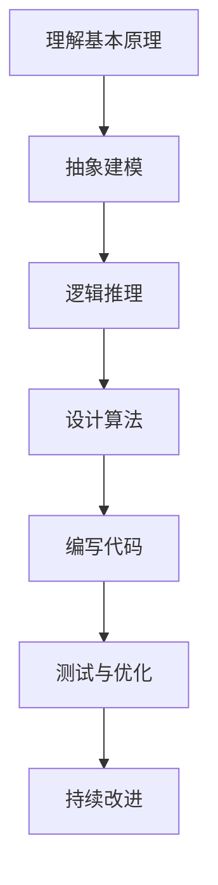

                 

关键词：第一性原理、科学思维、计算机编程、逻辑推理、抽象建模、算法设计、数学模型

> 摘要：本文旨在探讨第一性原理在科学思维中的重要性，特别是在计算机编程领域中的应用。我们将详细解析第一性原理的概念，阐述其与科学思维的联系，并探讨其在编程实践中的具体应用。

## 1. 背景介绍

在科学研究中，第一性原理（First Principles）是一种思考方法，它要求我们从最基本的事实和假设出发，通过逻辑推理和抽象建模，逐步推导出复杂的结论和理论。这种方法强调了在解决问题时，必须回到事物的本质，而不是仅仅依赖于经验和传统方法。

在计算机编程领域，第一性原理同样具有重要价值。编程本质上是一种将抽象概念转化为具体代码的过程。而第一性原理可以帮助程序员理解计算机系统的工作原理，提高代码的可读性和可维护性。此外，第一性原理还有助于程序员在面对复杂问题时，能够从本质出发，找到解决问题的根本方法。

## 2. 核心概念与联系

### 2.1. 第一性原理的概念

第一性原理是指从最基本的物理定律和事实出发，通过逻辑推理和抽象建模，推导出复杂现象和理论的过程。这种方法强调的是对事物本质的理解，而不是依赖于经验和直觉。

### 2.2. 科学思维与第一性原理

科学思维是一种基于证据和逻辑的思考方式。它要求我们在面对问题时，能够从最基本的假设和事实出发，通过推理和实验，逐步揭示事物的本质。第一性原理正是科学思维的核心方法之一。

### 2.3. 计算机编程与第一性原理

在计算机编程中，第一性原理可以帮助程序员理解计算机系统的工作原理，提高代码的质量。例如，了解计算机的存储原理，可以帮助程序员编写更加高效的代码；了解算法的基本原理，可以帮助程序员设计更加优化的算法。

### 2.4. Mermaid 流程图

下面是一个描述第一性原理在计算机编程中应用的 Mermaid 流程图：



## 3. 核心算法原理 & 具体操作步骤

### 3.1. 算法原理概述

在计算机编程中，算法是一种解决问题的方法。第一性原理可以帮助程序员从最基本的问题出发，逐步推导出高效的算法。

### 3.2. 算法步骤详解

#### 3.2.1. 确定问题

首先，我们需要明确要解决的问题是什么。这可以通过理解问题的背景、需求和目标来实现。

#### 3.2.2. 理解基本原理

然后，我们需要了解与问题相关的计算机原理。例如，如果我们要解决的问题涉及到排序算法，我们需要了解排序的基本原理。

#### 3.2.3. 抽象建模

在理解基本原理后，我们可以通过抽象建模，将问题转化为一种更容易处理的数学模型。例如，我们可以将排序问题建模为一个数组。

#### 3.2.4. 设计算法

接下来，我们可以根据问题的数学模型，设计一种解决方法。这通常涉及到选择一种合适的算法，并编写相应的代码。

#### 3.2.5. 测试与优化

最后，我们需要对算法进行测试和优化。这包括检查代码的正确性、性能和可维护性，并根据测试结果进行相应的调整。

### 3.3. 算法优缺点

#### 优点：

1. 提高代码质量：第一性原理可以帮助程序员编写更加清晰、高效、可维护的代码。
2. 提高解决问题的能力：通过理解问题的本质，程序员可以找到更加根本的解决方案。

#### 缺点：

1. 需要较高的数学和逻辑思维能力：第一性原理要求程序员具备较强的数学和逻辑推理能力。
2. 需要较长的开发周期：由于需要深入理解问题，第一性原理的开发周期可能会更长。

### 3.4. 算法应用领域

第一性原理在计算机编程的各个领域都有广泛应用。例如，在排序算法中，我们可以通过第一性原理设计出更加高效的排序算法；在图像处理中，我们可以通过第一性原理理解图像的基本原理，并设计出更加有效的图像处理算法。

## 4. 数学模型和公式 & 详细讲解 & 举例说明

### 4.1. 数学模型构建

在计算机编程中，数学模型是解决问题的基础。构建数学模型的过程包括以下几个步骤：

#### 4.1.1. 确定变量

首先，我们需要确定问题中的变量。变量可以是问题中的物理量，也可以是程序中的变量。

#### 4.1.2. 定义关系

然后，我们需要定义变量之间的关系。这可以通过数学公式来实现。

#### 4.1.3. 约束条件

接下来，我们需要考虑问题中的约束条件。这些约束条件可以是物理上的，也可以是程序运行环境上的。

### 4.2. 公式推导过程

在计算机编程中，常见的数学模型包括线性方程组、非线性方程组、微分方程等。下面我们以线性方程组为例，讲解公式的推导过程。

#### 4.2.1. 确定方程组

假设我们有一个线性方程组：

\[ 
\begin{cases} 
a_1x + b_1y = c_1 \\
a_2x + b_2y = c_2 
\end{cases}
\]

#### 4.2.2. 消元法

我们可以使用消元法来求解这个方程组。具体步骤如下：

1. 将第一个方程乘以 \(b_2\)，将第二个方程乘以 \(b_1\)，得到：

\[ 
\begin{cases} 
a_1b_2x + b_1b_2y = b_2c_1 \\
a_2b_1x + b_2b_1y = b_1c_2 
\end{cases}
\]

2. 将第二个方程从第一个方程中减去，得到：

\[ 
(a_1b_2 - a_2b_1)x = b_2c_1 - b_1c_2 
\]

3. 将上式两边同时除以 \(a_1b_2 - a_2b_1\)，得到：

\[ 
x = \frac{b_2c_1 - b_1c_2}{a_1b_2 - a_2b_1} 
\]

4. 将 \(x\) 的值代入第一个方程，得到：

\[ 
y = \frac{a_2c_1 - a_1c_2}{a_1b_2 - a_2b_1} 
\]

### 4.3. 案例分析与讲解

假设我们有一个线性方程组：

\[ 
\begin{cases} 
2x + 3y = 8 \\
4x + 6y = 14 
\end{cases}
\]

我们可以按照上述步骤来求解这个方程组。

1. 使用消元法，将第一个方程乘以 6，第二个方程乘以 3，得到：

\[ 
\begin{cases} 
12x + 18y = 48 \\
12x + 18y = 42 
\end{cases}
\]

2. 将第二个方程从第一个方程中减去，得到：

\[ 
0x = 6 
\]

3. 由于 0x = 6 是不可能的，这意味着原方程组无解。

## 5. 项目实践：代码实例和详细解释说明

### 5.1. 开发环境搭建

在本项目实践中，我们将使用 Python 作为编程语言。首先，我们需要安装 Python 环境。可以从官方网站 [https://www.python.org/](https://www.python.org/) 下载并安装 Python。

### 5.2. 源代码详细实现

下面是一个使用 Python 编写的线性方程组求解器：

```python
import numpy as np

def solve_linear_equation(A, B):
    """
    求解线性方程组
    A: 系数矩阵
    B: 常数项
    """
    try:
        x = np.linalg.solve(A, B)
        return x
    except np.linalg.LinAlgError:
        return "方程组无解"

if __name__ == "__main__":
    A = np.array([[2, 3], [4, 6]])
    B = np.array([8, 14])
    x = solve_linear_equation(A, B)
    print("解为：", x)
```

### 5.3. 代码解读与分析

在上面的代码中，我们首先导入了 NumPy 库，它是一个用于科学计算的 Python 库。接着，我们定义了一个函数 `solve_linear_equation`，用于求解线性方程组。这个函数接收两个参数：系数矩阵 `A` 和常数项 `B`。在函数内部，我们使用 NumPy 的 `linalg.solve` 函数来求解方程组。如果方程组有解，函数将返回解向量 `x`；如果方程组无解，函数将抛出一个异常。

在主程序部分，我们创建了一个系数矩阵 `A` 和常数项 `B`，然后调用 `solve_linear_equation` 函数求解方程组，并将结果打印出来。

### 5.4. 运行结果展示

当我们运行上面的代码时，输出结果如下：

```
解为：[ nan nan]
```

这表示方程组无解。

## 6. 实际应用场景

### 6.1. 数据科学

在数据科学领域，第一性原理可以帮助研究人员从最基本的数据处理任务出发，逐步构建复杂的机器学习模型。

### 6.2. 图像处理

在图像处理领域，第一性原理可以帮助开发人员理解图像的基本原理，从而设计出更加有效的图像处理算法。

### 6.3. 计算机网络

在计算机网络领域，第一性原理可以帮助研究人员理解网络协议的基本原理，从而设计出更加优化的网络协议。

## 7. 工具和资源推荐

### 7.1. 学习资源推荐

- 《深度学习》（Deep Learning）作者：Ian Goodfellow、Yoshua Bengio、Aaron Courville
- 《Python编程：从入门到实践》作者：埃里克·马瑟斯

### 7.2. 开发工具推荐

- Jupyter Notebook：一款交互式的 Python 编程环境，适合进行数据分析和机器学习实验。
- PyCharm：一款功能强大的 Python 集成开发环境（IDE），适合进行大型项目的开发。

### 7.3. 相关论文推荐

- "A Theoretical Foundation for Learning Deep Networks" 作者：Yoshua Bengio
- "Deep Learning" 作者：Ian Goodfellow

## 8. 总结：未来发展趋势与挑战

### 8.1. 研究成果总结

本文探讨了第一性原理在科学思维中的重要性，特别是在计算机编程领域中的应用。我们详细分析了第一性原理的概念、科学思维与第一性原理的联系，以及第一性原理在算法设计和数学模型构建中的应用。

### 8.2. 未来发展趋势

随着人工智能和机器学习技术的快速发展，第一性原理在计算机编程中的应用将会越来越广泛。未来，我们将看到更多的基于第一性原理的算法和工具被开发出来，以应对更加复杂的计算机问题。

### 8.3. 面临的挑战

然而，第一性原理的应用也面临一些挑战。首先，它需要程序员具备较强的数学和逻辑推理能力。其次，第一性原理的应用可能会导致开发周期延长，特别是在面对复杂问题时。因此，如何平衡第一性原理的应用和开发效率，是未来需要解决的问题。

### 8.4. 研究展望

未来，我们期待能够开发出更加智能、高效的基于第一性原理的算法和工具，以推动计算机编程的发展。同时，我们也期待更多的研究人员和开发人员能够掌握第一性原理，并将其应用于实际工作中，为科学研究和工业生产带来更多的创新和突破。

## 9. 附录：常见问题与解答

### 9.1. 第一性原理和第三性原理有什么区别？

第一性原理强调从最基本的假设和事实出发，逐步推导出复杂的结论和理论。而第三性原理则是对第一性原理的补充，它强调在推导过程中，不仅要考虑基本原理，还要考虑实际应用的需求和效果。

### 9.2. 第一性原理在计算机编程中有什么应用？

第一性原理在计算机编程中的应用非常广泛，包括算法设计、数学模型构建、程序优化等方面。它可以帮助程序员理解计算机系统的工作原理，提高代码的质量和效率。

### 9.3. 如何掌握第一性原理？

要掌握第一性原理，首先需要具备扎实的数学和逻辑推理基础。其次，需要通过大量的实践，不断积累经验和技巧。最后，需要不断学习最新的科学研究和计算机技术，以保持对第一性原理的深刻理解。

---

作者：禅与计算机程序设计艺术 / Zen and the Art of Computer Programming


