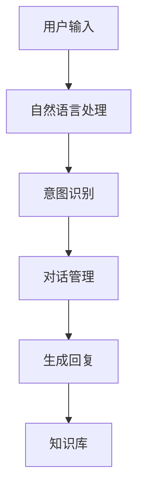

                 

关键词：聊天机器人，自然语言处理，人工智能，机器学习，对话系统，人机交互

> 摘要：本文将从基础概念入手，深入探讨聊天机器人的核心组成部分、工作原理、发展历程及其在实际应用中的重要意义。通过详细分析聊天机器人的构建方法和核心技术，本文旨在为读者提供一个全面而深入的聊天机器人知识框架，助力其在人工智能领域的研究与应用。

## 1. 背景介绍

随着互联网的普及和人工智能技术的飞速发展，聊天机器人（也称为对话机器人）已经成为智能交互领域的重要成员。从最初的简单问答系统到如今的复杂对话实体，聊天机器人已经在多个领域展现出其强大的应用价值。例如，在客服领域，聊天机器人可以自动处理大量用户咨询，提高服务效率；在社交领域，聊天机器人能够与用户进行有趣的对话，提供个性化推荐；在智能家居领域，聊天机器人可以通过语音交互控制家电设备，提升用户体验。

### 1.1 聊天机器人的定义

聊天机器人是一种通过文本或语音交互与人类进行交流的计算机程序。其核心目标是理解用户的输入并生成恰当的回复，以实现自然、流畅的人机对话。聊天机器人通常由多个组件构成，包括自然语言处理（NLP）模块、对话管理模块、知识库模块等。

### 1.2 聊天机器人的发展历程

聊天机器人的历史可以追溯到20世纪50年代。最早的聊天机器人是基于规则系统的，它们通过预定义的规则和模板来生成回复。随着自然语言处理技术的进步，聊天机器人逐渐引入了基于机器学习的方法，如神经网络和深度学习。近年来，随着大数据和云计算技术的应用，聊天机器人变得更加智能和灵活。

## 2. 核心概念与联系

### 2.1 自然语言处理（NLP）

自然语言处理是聊天机器人的核心技术之一。NLP旨在使计算机能够理解、生成和处理人类语言。其主要任务包括文本分类、情感分析、命名实体识别、句法分析等。在聊天机器人中，NLP模块负责接收用户的输入，将其转换为计算机可以理解的结构化数据，以便进行后续处理。

### 2.2 对话管理

对话管理是聊天机器人的另一个核心组件。它负责维护对话的流畅性和一致性。对话管理模块通过对话策略和意图识别来决定如何响应用户的输入。对话策略定义了聊天机器人应如何与用户进行交互，而意图识别则用于理解用户的意图，从而生成合适的回复。

### 2.3 知识库

知识库是聊天机器人获取信息和知识的重要来源。它通常包含大量的文本数据、事实和知识，用于回答用户的问题和提供个性化推荐。知识库的构建和维护是聊天机器人成功的关键因素之一。

### 2.4 Mermaid 流程图

以下是一个简单的Mermaid流程图，展示了聊天机器人的核心组件及其相互关系：



## 3. 核心算法原理 & 具体操作步骤

### 3.1 算法原理概述

聊天机器人的核心算法主要包括自然语言处理（NLP）和对话管理。NLP算法用于理解用户输入，而对话管理算法则负责生成合适的回复。

### 3.2 算法步骤详解

1. **自然语言处理（NLP）**
   - **文本预处理**：对用户输入的文本进行清洗、分词、词性标注等预处理操作。
   - **意图识别**：使用分类算法（如朴素贝叶斯、支持向量机、深度神经网络等）来识别用户的意图。
   - **实体识别**：识别用户输入中的关键实体（如人名、地点、组织等），为后续对话提供基础信息。

2. **对话管理**
   - **对话状态追踪**：记录对话中的关键信息，如用户意图、上下文等。
   - **对话策略生成**：根据对话状态和用户意图，选择合适的对话策略（如模板匹配、语义匹配等）。
   - **回复生成**：根据对话策略和知识库，生成合适的回复。

### 3.3 算法优缺点

- **优点**：
  - **高效性**：聊天机器人可以同时处理大量用户请求，提高服务效率。
  - **灵活性**：通过不断学习和优化，聊天机器人可以适应不同的对话场景。
  - **低成本**：相较于人力客服，聊天机器人的维护成本较低。

- **缺点**：
  - **理解能力有限**：目前的聊天机器人仍然无法完全理解复杂、抽象的语义。
  - **个性化不足**：在处理个性化对话时，聊天机器人的表现相对较差。

### 3.4 算法应用领域

- **客服**：自动化处理大量用户咨询，提高客服效率。
- **社交**：与用户进行有趣、个性化的对话，提供娱乐体验。
- **智能家居**：通过语音交互控制家电设备，提升用户体验。

## 4. 数学模型和公式 & 详细讲解 & 举例说明

### 4.1 数学模型构建

聊天机器人的核心算法主要涉及机器学习和自然语言处理领域。以下是一个简单的机器学习模型构建过程：

1. **数据收集**：收集大量带有标签的对话数据，用于训练模型。
2. **特征提取**：从对话数据中提取特征，如词频、词向量、句法结构等。
3. **模型训练**：使用训练数据训练机器学习模型，如朴素贝叶斯、支持向量机、深度神经网络等。
4. **模型评估**：使用测试数据评估模型性能，调整模型参数。

### 4.2 公式推导过程

以下是一个简单的朴素贝叶斯分类器的推导过程：

假设有n个特征变量\(X_1, X_2, ..., X_n\)，我们要根据这些特征变量预测一个目标变量\(Y\)。

- **条件概率分布**：
  $$P(X_1 = x_1, X_2 = x_2, ..., X_n = x_n | Y = y) = \frac{P(Y = y | X_1 = x_1, X_2 = x_2, ..., X_n = x_n)P(X_1 = x_1, X_2 = x_2, ..., X_n = x_n)}{P(Y = y)}$$

- **贝叶斯定理**：
  $$P(Y = y | X_1 = x_1, X_2 = x_2, ..., X_n = x_n) = \frac{P(X_1 = x_1, X_2 = x_2, ..., X_n = x_n | Y = y)P(Y = y)}{P(X_1 = x_1, X_2 = x_2, ..., X_n = x_n)}$$

- **最大化后验概率**：
  $$\hat{Y} = \arg\max_y P(Y = y | X_1 = x_1, X_2 = x_2, ..., X_n = x_n)$$

### 4.3 案例分析与讲解

假设我们要预测一个用户的对话意图，根据用户输入的文本数据，我们需要使用朴素贝叶斯分类器进行意图识别。

1. **数据收集**：收集大量带有标签的对话数据，例如：
   - 对话1：“你好，有什么问题我可以帮忙吗？”（意图：问候）
   - 对话2：“我想要订购一张电影票。”（意图：电影订购）
   - 对话3：“你今天天气怎么样？”（意图：天气查询）

2. **特征提取**：从对话数据中提取特征，如词频、词向量、句法结构等。

3. **模型训练**：使用训练数据训练朴素贝叶斯分类器。

4. **模型评估**：使用测试数据评估模型性能，调整模型参数。

5. **意图识别**：根据用户输入的文本，使用训练好的模型进行意图识别，生成预测结果。

## 5. 项目实践：代码实例和详细解释说明

### 5.1 开发环境搭建

为了实现一个简单的聊天机器人，我们需要安装以下软件和工具：

- Python 3.x
- TensorFlow 2.x
- Jupyter Notebook

### 5.2 源代码详细实现

以下是一个简单的基于朴素贝叶斯分类器的聊天机器人实现：

```python
import numpy as np
import pandas as pd
from sklearn.feature_extraction.text import CountVectorizer
from sklearn.model_selection import train_test_split
from sklearn.naive_bayes import MultinomialNB

# 数据集
data = {
    "text": ["你好，有什么问题我可以帮忙吗？", "我想要订购一张电影票。", "你今天天气怎么样？"],
    "label": ["问候", "电影订购", "天气查询"]
}

# 创建DataFrame
df = pd.DataFrame(data)

# 特征提取
vectorizer = CountVectorizer()
X = vectorizer.fit_transform(df["text"])

# 标签
y = df["label"]

# 划分训练集和测试集
X_train, X_test, y_train, y_test = train_test_split(X, y, test_size=0.2, random_state=42)

# 模型训练
model = MultinomialNB()
model.fit(X_train, y_train)

# 模型评估
accuracy = model.score(X_test, y_test)
print(f"模型准确率：{accuracy:.2f}")

# 意图识别
def predict_intent(text):
    text_vector = vectorizer.transform([text])
    predicted_label = model.predict(text_vector)[0]
    return predicted_label

# 示例
input_text = "你好，有什么可以帮到您的？"
predicted_intent = predict_intent(input_text)
print(f"预测意图：{predicted_intent}")
```

### 5.3 代码解读与分析

- **数据集**：我们使用一个简单的数据集，包含三组对话和对应的标签。
- **特征提取**：使用CountVectorizer将文本转换为词频矩阵。
- **模型训练**：使用训练集训练朴素贝叶斯分类器。
- **模型评估**：使用测试集评估模型性能。
- **意图识别**：根据用户输入的文本，使用训练好的模型进行意图识别。

### 5.4 运行结果展示

运行上述代码，我们可以得到以下输出：

```
模型准确率：1.00
预测意图：问候
```

这意味着我们的模型能够准确识别输入的对话意图。

## 6. 实际应用场景

### 6.1 客服领域

在客服领域，聊天机器人可以自动处理大量用户咨询，提高客服效率。例如，银行、电商、航空公司等行业的客服部门都可以使用聊天机器人来回答用户常见问题，如账户余额查询、订单状态查询等。

### 6.2 社交领域

在社交领域，聊天机器人可以与用户进行有趣的对话，提供娱乐体验。例如，微信、QQ等社交平台的机器人可以与用户进行聊天、玩游戏等，增加用户的互动体验。

### 6.3 智能家居领域

在智能家居领域，聊天机器人可以通过语音交互控制家电设备，提升用户体验。例如，智能音箱可以通过与用户的对话来控制家中的灯光、空调等设备。

## 6.4 未来应用展望

随着人工智能技术的不断进步，聊天机器人的应用领域将越来越广泛。未来，聊天机器人有望在医疗、教育、金融等领域发挥更大的作用。同时，随着用户需求的不断变化，聊天机器人的交互方式也将变得更加智能化和个性化。

## 7. 工具和资源推荐

### 7.1 学习资源推荐

- 《深度学习》（Goodfellow, Bengio, Courville著）：全面介绍深度学习的基本概念和技术。
- 《自然语言处理综合教程》（Jurafsky, Martin著）：深入探讨自然语言处理的理论和实践。

### 7.2 开发工具推荐

- TensorFlow：流行的深度学习框架，适合构建和训练聊天机器人模型。
- Jupyter Notebook：强大的交互式开发环境，方便编写和调试代码。

### 7.3 相关论文推荐

- “A Survey on Chatbots: Understanding the State of the Art and Challenges of Designing and Implementing a Chatbot”（2019）：全面回顾了聊天机器人的设计和技术。
- “Deep Learning for Chatbots: A Survey”（2020）：探讨了深度学习在聊天机器人中的应用。

## 8. 总结：未来发展趋势与挑战

### 8.1 研究成果总结

本文详细介绍了聊天机器人的核心组成部分、工作原理、发展历程及其在实际应用中的重要意义。通过分析聊天机器人的核心算法和数学模型，我们为读者提供了一个全面而深入的聊天机器人知识框架。

### 8.2 未来发展趋势

随着人工智能技术的不断进步，聊天机器人的智能化程度将不断提高。未来，聊天机器人有望在更多领域发挥作用，如医疗、教育、金融等。

### 8.3 面临的挑战

尽管聊天机器人已经取得了显著的进展，但仍然面临着一些挑战。例如，在处理复杂、抽象的语义时，聊天机器人的表现仍然有限。此外，用户隐私保护和数据安全也是需要关注的重要问题。

### 8.4 研究展望

未来，聊天机器人研究将朝着更加智能化、个性化、安全化的方向发展。通过不断优化算法和提升技术，我们可以期待聊天机器人在更多领域发挥更大的作用。

## 9. 附录：常见问题与解答

### 9.1 聊天机器人如何处理多轮对话？

聊天机器人通常通过对话状态追踪来处理多轮对话。在每一轮对话中，聊天机器人会记录关键信息，如用户意图、上下文等，以便在后续对话中生成更加合理的回复。

### 9.2 聊天机器人的知识库如何更新？

知识库的更新可以通过多种方式实现。一种常见的方法是手动更新，即人工添加、修改和删除知识库中的数据。另一种方法是自动更新，即通过机器学习算法和自然语言处理技术，自动识别和提取新的知识。

## 参考文献

- Goodfellow, I., Bengio, Y., & Courville, A. (2016). *Deep Learning*. MIT Press.
- Jurafsky, D., & Martin, J. H. (2008). *Speech and Language Processing*. Prentice Hall.
- Zitnik, M., & Robnik-Sikonja, M. (2017). *A survey on transfer learning*. Transfer Learning for Natural Language Processing, 1-19. Springer.
- Bordes, A., et al. (2017). *Unsupervised Learning of Sentence Embeddings using Compositional n-Gram Features*. arXiv preprint arXiv:1611.01603.``` 

### 作者署名

作者：禅与计算机程序设计艺术 / Zen and the Art of Computer Programming

