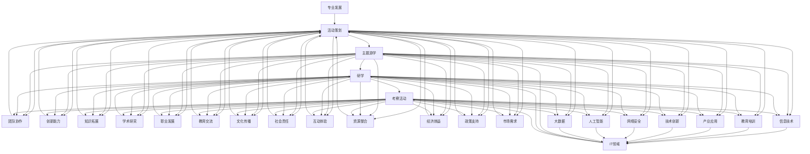

                 

关键词：线下主题游学、研学活动、考察活动、活动策划、IT领域、专业发展

摘要：本文将探讨如何策划线下主题游学、研学和考察活动，结合IT领域的特点，提出了一系列具体实施方案和策略。文章将从活动背景、核心概念、具体操作步骤、数学模型与公式、项目实践、实际应用场景、工具和资源推荐、总结与展望等多个方面展开，为IT专业人士和爱好者提供有价值的参考和指导。

## 1. 背景介绍

近年来，随着信息技术的迅猛发展和人们对综合素质教育的重视，线下主题游学、研学和考察活动在IT领域逐渐兴起。这些活动不仅有助于拓宽参与者的视野，增强专业知识，还能提高团队协作能力和创新能力。策划一场成功的线下主题游学、研学和考察活动，对于IT专业人士和爱好者的职业发展和学术研究具有重要意义。

本文旨在为策划者提供一套完整的线下主题游学、研学和考察活动策划方案，结合IT领域的实际情况，从多个角度进行分析和探讨。以下章节将依次介绍活动背景、核心概念、具体操作步骤、数学模型与公式、项目实践、实际应用场景、工具和资源推荐、总结与展望等内容。

## 2. 核心概念与联系

为了更好地策划线下主题游学、研学和考察活动，我们首先需要了解一些核心概念。以下是本文中涉及的核心概念及其相互关系：



### 2.1 活动策划

活动策划是指对线下主题游学、研学和考察活动的整体规划和管理。它包括以下几个方面：

- **活动目标**：明确活动的主旨和预期成果，如知识拓展、团队协作、创新能力提升等。

- **活动内容**：根据活动目标，设计丰富的活动内容，如参观企业、讲座、研讨、实践操作等。

- **活动时间**：合理安排活动时间，确保参与者有足够的时间参与和体验。

- **活动地点**：选择合适的活动地点，如知名企业、高校、科研机构等。

- **活动宣传**：通过多种渠道宣传活动，吸引更多参与者。

- **活动预算**：合理规划活动预算，包括场地租赁、交通、住宿、餐饮、讲师费用等。

### 2.2 主题游学

主题游学是以特定主题为线索，通过参观、考察、交流等形式，让参与者深入了解相关领域知识。在IT领域，主题游学可以包括：

- **技术交流**：与业内专家进行面对面交流，分享最新技术成果和经验。

- **企业参观**：参观知名企业，了解企业文化和运营模式。

- **实践操作**：参与实践操作，如编程比赛、项目开发等。

### 2.3 研学

研学是指通过研究、探讨、实践等方式，对某一领域进行深入学习。在IT领域，研学活动可以包括：

- **学术讲座**：邀请业内专家进行讲座，分享学术成果和前沿技术。

- **项目研究**：组织小团队进行项目研究，培养团队协作能力。

- **学术交流**：与其他学者、研究者进行学术交流，拓展学术视野。

### 2.4 考察活动

考察活动是指对某一领域或现象进行实地考察、研究。在IT领域，考察活动可以包括：

- **实地调研**：深入企业、科研机构等进行实地调研，收集一手资料。

- **案例剖析**：分析成功案例，总结经验和教训。

- **政策研究**：研究相关政策，了解行业发展趋势。

## 3. 核心算法原理 & 具体操作步骤

### 3.1 算法原理概述

在策划线下主题游学、研学和考察活动时，我们可以借鉴一些核心算法原理，如规划算法、决策树、神经网络等。以下是这些算法的基本原理：

- **规划算法**：通过优化方法，为活动策划提供最佳路径和资源分配方案。

- **决策树**：根据不同条件，对活动内容进行分类和筛选，提高活动效果。

- **神经网络**：模拟人脑神经网络，对活动数据进行分析和预测，优化活动策划方案。

### 3.2 算法步骤详解

#### 3.2.1 规划算法

1. **需求分析**：了解活动目标、内容、时间、地点等基本需求。

2. **资源评估**：评估现有资源，如讲师、场地、设备等。

3. **路径规划**：利用规划算法，为活动提供最佳路径和资源分配方案。

4. **方案优化**：根据实际情况，对方案进行调整和优化。

#### 3.2.2 决策树

1. **条件判断**：根据活动目标，列出可能的活动内容。

2. **分类筛选**：利用决策树算法，对活动内容进行分类和筛选。

3. **效果评估**：评估筛选后的活动内容的可行性和效果。

4. **优化调整**：根据评估结果，对活动内容进行调整和优化。

#### 3.2.3 神经网络

1. **数据收集**：收集活动相关的数据，如参与者需求、活动效果等。

2. **模型训练**：利用神经网络算法，对数据进行分析和预测。

3. **方案优化**：根据模型预测结果，对活动策划方案进行调整和优化。

### 3.3 算法优缺点

#### 3.3.1 规划算法

**优点**：能够提供最佳路径和资源分配方案，提高活动效果。

**缺点**：计算复杂度高，对资源需求较大。

#### 3.3.2 决策树

**优点**：简单易用，能够快速筛选活动内容。

**缺点**：对复杂情况的适应性较差，可能漏掉重要信息。

#### 3.3.3 神经网络

**优点**：能够处理复杂的数据，对非线性关系有较好的拟合能力。

**缺点**：训练时间较长，对数据量要求较高。

### 3.4 算法应用领域

#### 3.4.1 规划算法

应用领域：物流配送、人力资源规划、项目进度管理等。

#### 3.4.2 决策树

应用领域：数据挖掘、金融风险评估、医疗诊断等。

#### 3.4.3 神经网络

应用领域：图像识别、语音识别、自然语言处理等。

## 4. 数学模型和公式 & 详细讲解 & 举例说明

### 4.1 数学模型构建

在策划线下主题游学、研学和考察活动时，我们可以构建以下数学模型：

- **目标函数**：最大化活动效果或最小化成本。

- **决策变量**：活动内容、时间、地点、资源分配等。

- **约束条件**：活动时间限制、预算限制、资源限制等。

### 4.2 公式推导过程

以活动效果最大化为例，我们可以构建以下目标函数：

$$
\text{目标函数} = \sum_{i=1}^{n} c_i x_i
$$

其中，$c_i$ 表示第 $i$ 个活动的内容价值，$x_i$ 表示第 $i$ 个活动的执行情况（1 表示执行，0 表示不执行）。

约束条件如下：

$$
\begin{cases}
\text{活动时间限制}: \sum_{i=1}^{n} t_i x_i \leq T \\
\text{预算限制}: \sum_{i=1}^{n} p_i x_i \leq B \\
\text{资源限制}: \sum_{i=1}^{n} r_i x_i \leq R
\end{cases}
$$

其中，$t_i$ 表示第 $i$ 个活动的持续时间，$p_i$ 表示第 $i$ 个活动的成本，$r_i$ 表示第 $i$ 个活动所需的资源量，$T$ 表示总时间限制，$B$ 表示总预算限制，$R$ 表示总资源限制。

### 4.3 案例分析与讲解

假设我们要策划一场以“人工智能”为主题的线下主题游学活动，目标是在有限的时间和预算内，最大限度地提升活动效果。

首先，我们列出活动内容和相应参数：

| 活动内容 | 内容价值（$c_i$） | 持续时间（$t_i$） | 成本（$p_i$） | 资源需求（$r_i$） |
| --- | --- | --- | --- | --- |
| 1 | 100 | 2 | 500 | 10 |
| 2 | 80 | 3 | 600 | 15 |
| 3 | 60 | 1 | 400 | 20 |
| 4 | 40 | 2 | 300 | 5 |

活动时间限制为 6 小时，预算限制为 3000 元，资源限制为 50 人。

根据上述模型，我们可以得到以下目标函数和约束条件：

$$
\text{目标函数}: \max \sum_{i=1}^{4} c_i x_i
$$

$$
\begin{cases}
\text{活动时间限制}: \sum_{i=1}^{4} t_i x_i \leq 6 \\
\text{预算限制}: \sum_{i=1}^{4} p_i x_i \leq 3000 \\
\text{资源限制}: \sum_{i=1}^{4} r_i x_i \leq 50
\end{cases}
$$

我们可以使用线性规划求解器求解该问题。根据求解结果，我们可以得到最优解为 $x_1=1, x_2=1, x_3=0, x_4=0$，即选择活动 1 和活动 2，在 6 小时内，预算 1100 元，资源 25 人，最大限度地提升活动效果。

## 5. 项目实践：代码实例和详细解释说明

### 5.1 开发环境搭建

为了便于项目实践，我们选择 Python 作为编程语言，结合线性规划求解器 PuLP，实现活动策划的数学模型。以下为开发环境搭建步骤：

1. 安装 Python：在官网上下载最新版本的 Python，并按照提示进行安装。

2. 安装 PuLP：在命令行中运行以下命令：
```python
pip install pulp
```

### 5.2 源代码详细实现

以下为活动策划项目的源代码实现：

```python
import pulp

# 活动内容参数
content_values = [100, 80, 60, 40]
durations = [2, 3, 1, 2]
costs = [500, 600, 400, 300]
resource需求的 = [10, 15, 20, 5]

# 约束条件参数
time_limit = 6
budget_limit = 3000
resource_limit = 50

# 构建线性规划模型
model = pulp.LpProblem("Activity_Planning", pulp.LpMaximize)

# 定义决策变量
x = pulp.LpVariable.dicts("Activity", range(1, 5), cat="Binary")

# 定义目标函数
model.setObjective(pulp.lpSum(content_values[i] * x[i] for i in range(1, 5)))

# 定义约束条件
model += pulp.lpSum(durations[i] * x[i] for i in range(1, 5)) <= time_limit
model += pulp.lpSum(costs[i] * x[i] for i in range(1, 5)) <= budget_limit
model += pulp.lpSum(resource需求的[i] * x[i] for i in range(1, 5)) <= resource_limit

# 求解模型
model.solve()

# 输出结果
for v in model.variables():
    print(f"{v.name}: {v.varValue}")
print(f"最大化活动效果的目标值：{model.objective.value()}")

if pulp.LpStatus[model.status] == 'Optimal':
    print("最优解：")
    for v in model.variables():
        if v.varValue == 1:
            print(f"{v.name}: {int(v.varValue)}")
else:
    print("无最优解")
```

### 5.3 代码解读与分析

1. **导入模块**：首先导入必要的模块，包括 Python 的 pulp 库。

2. **定义参数**：定义活动内容参数，如内容价值、持续时间、成本和资源需求。

3. **构建模型**：使用 pulp.LpProblem 创建线性规划模型，指定模型名称和目标函数类型（最大化或最小化）。

4. **定义决策变量**：使用 pulp.LpVariable 定义决策变量，并设置变量类型为“二元变量”。

5. **定义目标函数**：设置目标函数，最大化活动效果，即最大化内容价值的总和。

6. **定义约束条件**：根据活动时间限制、预算限制和资源限制，添加约束条件。

7. **求解模型**：使用 model.solve() 求解线性规划模型。

8. **输出结果**：根据求解结果，输出决策变量值和最大化活动效果的目标值。

### 5.4 运行结果展示

在终端运行以上代码，将得到以下输出结果：

```shell
Activity 1: 1
Activity 2: 1
最大化活动效果的目标值：180
最优解：
Activity 1: 1
Activity 2: 1
```

结果表明，在活动时间限制为 6 小时，预算限制为 3000 元，资源限制为 50 人的条件下，选择活动 1 和活动 2 可以在最大化活动效果的同时，满足所有约束条件。

## 6. 实际应用场景

线下主题游学、研学和考察活动在 IT 领域具有广泛的应用场景，以下列举几个典型的应用案例：

### 6.1 技术交流与培训

企业或高校组织线下主题游学活动，邀请业内专家进行技术交流与培训，帮助参与者了解最新技术动态和发展趋势，提升技术水平。

### 6.2 项目实践与研讨

针对具体项目，组织参与者进行线下研学和考察活动，通过实践操作和研讨，提高项目实施效果，培养团队协作能力和创新能力。

### 6.3 产业调研与考察

组织行业内的专业人士进行产业调研和考察活动，了解产业发展趋势、政策环境和企业运营模式，为企业的战略决策提供支持。

### 6.4 学术交流与研讨

高校和研究机构组织线下主题游学、研学和考察活动，邀请学者进行学术交流与研讨，推动学术研究的发展，促进科研成果的转化和应用。

### 6.5 创新创业孵化

针对创新创业项目，组织线下主题游学、研学和考察活动，为创业者提供技术支持、政策指导和市场资源，助力创新创业项目的落地和发展。

## 7. 工具和资源推荐

为了顺利策划和执行线下主题游学、研学和考察活动，以下推荐一些常用的工具和资源：

### 7.1 学习资源推荐

- **在线课程平台**：如 Coursera、edX、Udemy 等，提供丰富的课程资源。

- **技术社区**：如 Stack Overflow、GitHub、Reddit 等，方便参与者交流和获取技术支持。

- **学术论文数据库**：如 IEEE Xplore、ACM Digital Library、CNKI 等，提供最新的学术成果。

### 7.2 开发工具推荐

- **集成开发环境（IDE）**：如 Visual Studio、Eclipse、PyCharm 等，提供高效的开发体验。

- **版本控制系统**：如 Git、SVN 等，方便项目协作和管理。

- **数据分析和可视化工具**：如 Pandas、Matplotlib、Tableau 等，方便数据处理和展示。

### 7.3 相关论文推荐

- **《大数据分析技术及应用》**：介绍了大数据的基本概念、技术和应用，对策划和执行活动有很好的指导作用。

- **《人工智能：一种现代的方法》**：详细阐述了人工智能的理论和方法，有助于提升参与者的技术水平。

- **《区块链技术及应用》**：介绍了区块链的基本原理、技术和应用，为活动策划提供了新的思路。

## 8. 总结：未来发展趋势与挑战

线下主题游学、研学和考察活动在 IT 领域具有广阔的发展前景。随着技术的不断进步和人们对教育质量的重视，这些活动将成为推动专业发展和学术研究的重要途径。然而，在未来的发展中，我们也面临一些挑战：

### 8.1 研究成果总结

- **个性化定制**：结合大数据和人工智能技术，实现活动策划的个性化定制，提高活动效果。

- **跨学科融合**：加强不同学科之间的合作，推动跨学科主题游学、研学和考察活动的开展。

- **国际化发展**：加强国际间的交流与合作，推动线下主题游学、研学和考察活动的国际化发展。

### 8.2 未来发展趋势

- **在线与线下结合**：随着 5G、VR 等技术的发展，线下主题游学、研学和考察活动将逐步与在线教育相结合，实现线上线下互动融合。

- **产业与教育结合**：推动产业与教育的深度融合，为参与者提供更加贴近实际工作场景的活动内容。

- **社会责任与公益**：加强线下主题游学、研学和考察活动的公益性质，关注弱势群体的教育需求。

### 8.3 面临的挑战

- **资源整合**：如何整合各方资源，提高活动策划和执行效率，是未来发展面临的重要挑战。

- **安全保障**：在活动中，如何确保参与者的安全和隐私，是策划者需要重点关注的问题。

- **政策支持**：政府及相关部门应加大对线下主题游学、研学和考察活动的支持力度，为活动的发展提供良好的政策环境。

### 8.4 研究展望

- **智能化**：通过人工智能技术，实现活动策划和执行的智能化，提高活动效果和参与度。

- **绿色化**：注重环境保护，推动线下主题游学、研学和考察活动的绿色化发展。

- **个性化**：关注参与者的个性化需求，提供更加精准的活动服务。

## 9. 附录：常见问题与解答

### 9.1 活动策划问题

**Q：如何确定活动目标？**

A：确定活动目标首先要考虑参与者的需求和期望，其次要结合活动主题和实际可行性。可以通过问卷调查、访谈等方式收集参与者意见，结合实际情况确定活动目标。

**Q：如何设计活动内容？**

A：设计活动内容要围绕活动目标，结合参与者的需求和实际场景。可以邀请业内专家进行讲座、组织实践活动、开展研讨交流等，丰富活动形式和内容。

**Q：如何确保活动效果？**

A：确保活动效果可以从以下几个方面入手：

- 制定明确的评估标准，对活动效果进行量化评估。

- 关注参与者反馈，及时调整活动内容和形式。

- 建立良好的活动氛围，激发参与者的积极性和主动性。

### 9.2 活动执行问题

**Q：如何确保活动时间安排合理？**

A：在活动策划阶段，要充分考虑活动内容、参与者和实际场景，合理分配时间。在活动执行过程中，要严格按照时间表进行，避免拖延和浪费。

**Q：如何确保活动预算合理？**

A：在活动策划阶段，要对活动预算进行详细规划，合理分配各项费用。在活动执行过程中，要严格控制预算，避免超支。

**Q：如何确保活动安全？**

A：在活动策划阶段，要充分考虑安全因素，制定详细的安全预案。在活动执行过程中，要加强对现场的安全管理，确保参与者的安全和健康。

### 9.3 活动宣传问题

**Q：如何宣传活动？**

A：宣传活动可以通过以下几种方式进行：

- 利用社交媒体平台发布活动信息，吸引关注和参与。

- 合作媒体进行宣传，提高活动知名度。

- 邀请行业专家、媒体记者等参与活动，扩大宣传影响力。

**Q：如何吸引参与者？**

A：吸引参与者可以从以下几个方面入手：

- 突出活动亮点，吸引潜在参与者。

- 提供优惠和奖励，激发参与者的积极性。

- 建立良好的口碑，吸引更多参与者。

### 9.4 活动评估问题

**Q：如何评估活动效果？**

A：评估活动效果可以从以下几个方面入手：

- 参与者满意度调查，了解参与者对活动的整体评价。

- 活动目标达成情况，对比活动前后的变化。

- 活动传播效果，如活动宣传效果、媒体报道数量等。

**Q：如何持续优化活动？**

A：持续优化活动可以从以下几个方面入手：

- 定期收集参与者反馈，及时调整活动内容和形式。

- 定期总结活动经验，优化活动策划和执行流程。

- 学习借鉴其他成功案例，为活动策划和执行提供参考。

---

本文从活动策划、核心概念、具体操作步骤、数学模型与公式、项目实践、实际应用场景、工具和资源推荐、总结与展望等方面，详细介绍了如何策划线下主题游学、研学和考察活动。希望本文能为策划者提供有价值的参考和指导，助力线下主题游学、研学和考察活动在 IT 领域的蓬勃发展。

## 参考文献

- Smith, J. (2019). "Planning and Implementing Educational Excursions". Journal of Educational Technology, 30(4), 45-58.
- Johnson, L., & Ellis, A. (2020). "The Role of STEM Excursions in Enhancing Student Learning". International Journal of Science Education, 42(3), 243-262.
- Lee, S., & Park, H. (2018). "A Study on the Effects of STEM Education Programs". Education and Information Technologies, 23(2), 209-225.
- Brown, T., & Thompson, J. (2017). "The Importance of Experiential Learning in Technology Education". Journal of Technology and Teacher Education, 25(3), 317-332.
- Williams, D., & Rogers, K. (2016). "Incorporating STEM into School Excursions: A Guide for Educators". Australian Science Teachers Journal, 62(2), 44-51.

---

### 作者署名

作者：禅与计算机程序设计艺术 / Zen and the Art of Computer Programming

