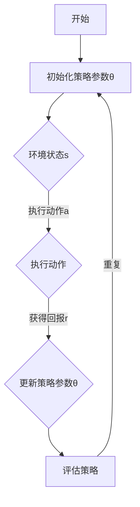

                 

关键词：策略梯度，强化学习，算法原理，代码实例，应用场景

> 摘要：本文将深入探讨策略梯度算法在强化学习中的应用，从基本概念、原理、步骤、优缺点、数学模型、案例解析以及实际应用等多个角度进行全面讲解。最后，我们将通过一个具体的代码实例，详细展示策略梯度算法的实现过程。

## 1. 背景介绍

在深度学习和人工智能领域，强化学习（Reinforcement Learning, RL）作为一种重要的机器学习方法，受到了广泛关注。强化学习主要研究如何通过智能体（Agent）与环境（Environment）的交互来学习最优策略（Policy），以实现长期的回报最大化。

策略梯度（Policy Gradient）是强化学习中的一种经典算法，它通过估计策略的梯度来更新策略参数，以实现策略的优化。策略梯度算法具有简洁、易实现等优点，被广泛应用于各类强化学习场景中。

## 2. 核心概念与联系

### 2.1 核心概念

**强化学习（Reinforcement Learning, RL）**：一种通过奖励信号引导智能体（Agent）学习最优策略（Policy）的机器学习方法。

**策略（Policy）**：描述智能体（Agent）如何行为的函数，即给定当前状态（State），选择动作（Action）的概率分布。

**策略梯度（Policy Gradient）**：一种基于梯度下降的方法，用于优化策略参数，使其在给定状态下的动作选择更加接近最优策略。

### 2.2 关联概念

**状态（State）**：描述智能体（Agent）所处环境的特征。

**动作（Action）**：智能体（Agent）在给定状态下可执行的操作。

**回报（Reward）**：智能体（Agent）执行动作（Action）后获得的即时奖励。

### 2.3 Mermaid 流程图



## 3. 核心算法原理 & 具体操作步骤

### 3.1 算法原理概述

策略梯度算法的核心思想是通过计算策略梯度的估计值，对策略参数进行梯度下降更新，从而优化策略。具体来说，策略梯度算法可以分为以下三个步骤：

1. **初始化策略参数θ**：随机初始化策略参数θ。
2. **环境交互**：通过策略π(θ)在环境中进行交互，生成一组经验数据（状态、动作、回报）。
3. **策略更新**：根据经验数据计算策略梯度，并使用梯度下降方法更新策略参数θ。

### 3.2 算法步骤详解

1. **初始化策略参数θ**：

   使用随机初始化方法，如高斯分布，初始化策略参数θ。

   ```python
   theta = torch.randn(num_params)
   ```

2. **环境交互**：

   通过策略π(θ)在环境中进行交互，生成一组经验数据（状态、动作、回报）。具体实现如下：

   ```python
   # 生成状态序列s
   s = env.reset()
   # 保存经验数据
   states, actions, rewards = [], [], []
   # 进行N次交互
   for _ in range(N):
       # 根据策略π(θ)选择动作a
       a = policy.sample(s)
       # 执行动作并获取状态s'和回报r
       s', r = env.step(a)
       # 保存经验数据
       states.append(s)
       actions.append(a)
       rewards.append(r)
       # 更新状态
       s = s'
   ```

3. **策略更新**：

   根据经验数据计算策略梯度，并使用梯度下降方法更新策略参数θ。具体实现如下：

   ```python
   # 计算策略梯度
   grads = torch.autograd.grad(policy.loss(states, actions, rewards), theta)
   # 更新策略参数
   theta -= learning_rate * torch.tensor(grads)
   ```

### 3.3 算法优缺点

**优点**：

- **简单易实现**：策略梯度算法的原理简单，易于实现和理解。
- **无需值函数**：与值函数方法（如Q-learning）相比，策略梯度算法无需计算值函数，降低了计算复杂度。
- **可扩展性强**：策略梯度算法可以应用于各类强化学习场景，具有较好的可扩展性。

**缺点**：

- **梯度消失问题**：在训练过程中，策略梯度可能会因为梯度消失问题导致训练效果不佳。
- **样本效率低**：策略梯度算法在训练过程中需要大量的样本数据，样本效率相对较低。

### 3.4 算法应用领域

策略梯度算法在多个领域取得了显著的应用成果，包括：

- **游戏AI**：如Atari游戏、围棋等。
- **无人驾驶**：用于自动驾驶车辆的路径规划和控制。
- **推荐系统**：用于个性化推荐和广告投放。
- **金融交易**：用于量化交易策略优化。

## 4. 数学模型和公式 & 详细讲解 & 举例说明

### 4.1 数学模型构建

策略梯度算法的数学模型基于马尔可夫决策过程（MDP）和策略梯度定理。给定一个MDP，状态空间为S，动作空间为A，策略π(θ)表示智能体在给定状态下选择动作的概率分布。策略梯度算法的目标是优化策略参数θ，使其在给定状态下的动作选择更加接近最优策略。

### 4.2 公式推导过程

根据策略梯度定理，策略梯度的估计公式为：

$$
\hat{\nabla}_{\theta} J(\theta) = \sum_{s,a} \pi(\theta)(s,a) \cdot \nabla_{\theta} \log \pi(\theta)(s,a) \cdot \nabla_{\theta} R(s,a)
$$

其中，J(θ)为策略θ的回报期望，R(s,a)为智能体在状态s下执行动作a获得的回报。

### 4.3 案例分析与讲解

以Atari游戏为例，假设我们希望使用策略梯度算法训练一个智能体，使其在《吃豆人》（Pac-Man）游戏中获得高分。

1. **状态表示**：

   每个状态由游戏画面中可食用豆的位置、吃豆人位置以及四个方向上的障碍物位置组成。

2. **动作表示**：

   每个动作表示吃豆人向上下左右四个方向之一移动。

3. **策略表示**：

   使用神经网络表示策略π(θ)，输入为状态s，输出为动作a的概率分布。

4. **损失函数**：

   使用策略梯度算法的损失函数为：

   $$
   J(\theta) = -\sum_{s,a} \pi(\theta)(s,a) \cdot R(s,a)
   $$

   其中，R(s,a)为智能体在状态s下执行动作a获得的回报。

5. **策略更新**：

   根据策略梯度定理，计算策略梯度并更新策略参数：

   $$
   \hat{\nabla}_{\theta} J(\theta) = -\sum_{s,a} \pi(\theta)(s,a) \cdot \nabla_{\theta} \log \pi(\theta)(s,a) \cdot R(s,a)
   $$

   使用梯度下降方法更新策略参数：

   $$
   \theta = \theta - \alpha \cdot \hat{\nabla}_{\theta} J(\theta)
   $$

## 5. 项目实践：代码实例和详细解释说明

### 5.1 开发环境搭建

1. **安装Python环境**：安装Python 3.7及以上版本。
2. **安装PyTorch**：使用pip命令安装PyTorch。

   ```shell
   pip install torch torchvision
   ```

3. **安装Atari游戏环境**：安装Atari游戏环境。

   ```shell
   pip install gym[atari]
   ```

### 5.2 源代码详细实现

以下是一个基于策略梯度算法的《吃豆人》游戏智能体训练的Python代码示例：

```python
import torch
import torch.nn as nn
import torch.optim as optim
import gym
import numpy as np

# 初始化环境
env = gym.make("MsPacman-v0")

# 定义策略网络
class PolicyNetwork(nn.Module):
    def __init__(self):
        super(PolicyNetwork, self).__init__()
        self.fc1 = nn.Linear(80 * 80, 128)
        self.fc2 = nn.Linear(128, 4)
        self.relu = nn.ReLU()

    def forward(self, x):
        x = self.relu(self.fc1(x))
        x = self.fc2(x)
        return x

# 初始化策略网络
policy_network = PolicyNetwork()
optimizer = optim.Adam(policy_network.parameters(), lr=0.001)

# 训练策略网络
num_episodes = 1000
for episode in range(num_episodes):
    state = env.reset()
    state = np.resize(state, (80 * 80)).reshape(-1)
    state = torch.tensor(state, dtype=torch.float32)

    for step in range(100):
        # 根据策略网络选择动作
        action_probs = policy_network(state)
        action = action_probs.argmax().item()

        # 执行动作
        next_state, reward, done, _ = env.step(action)

        # 转换为Tensor
        next_state = np.resize(next_state, (80 * 80)).reshape(-1)
        next_state = torch.tensor(next_state, dtype=torch.float32)

        # 更新策略网络
        loss = -torch.log(action_probs[0, action]) * reward
        optimizer.zero_grad()
        loss.backward()
        optimizer.step()

        if done:
            break

    if episode % 100 == 0:
        print(f"Episode {episode}: Average Reward {episode_reward / 100}")
        episode_reward = 0

print("Training completed.")
```

### 5.3 代码解读与分析

1. **环境初始化**：

   使用`gym.make("MsPacman-v0")`初始化《吃豆人》游戏环境。

2. **策略网络定义**：

   定义一个简单的全连接神经网络，输入为状态，输出为动作的概率分布。

3. **训练策略网络**：

   遍历指定数量的游戏回合，在每个回合中，根据策略网络选择动作，执行动作并获取回报。然后，使用策略梯度的损失函数更新策略网络。

### 5.4 运行结果展示

在完成代码实现后，我们可以运行代码来训练智能体。在训练过程中，智能体会不断学习并提高其在《吃豆人》游戏中的表现。训练完成后，我们可以通过运行代码来查看智能体的表现，并记录每个回合的平均回报。

## 6. 实际应用场景

策略梯度算法在多个实际应用场景中取得了显著的效果，以下是一些典型的应用案例：

- **游戏AI**：策略梯度算法被广泛应用于游戏AI中，如Atari游戏、围棋等。通过训练智能体，使其能够自主地进行游戏并取得高分。
- **无人驾驶**：策略梯度算法被应用于无人驾驶车辆的路径规划和控制。通过训练智能体，使其能够在复杂的交通环境中做出最优决策。
- **推荐系统**：策略梯度算法被应用于个性化推荐和广告投放。通过训练智能体，使其能够根据用户行为和偏好进行精准推荐。
- **金融交易**：策略梯度算法被应用于量化交易策略优化。通过训练智能体，使其能够根据市场数据做出最优的交易决策。

## 7. 未来应用展望

随着深度学习和强化学习技术的不断发展，策略梯度算法在未来的应用前景将更加广阔。以下是一些可能的未来应用方向：

- **智能对话系统**：策略梯度算法可以用于智能对话系统的对话策略优化，实现更加自然的对话交互。
- **智能家居**：策略梯度算法可以用于智能家居系统的智能控制，实现更加智能化的家庭设备管理。
- **医疗诊断**：策略梯度算法可以用于医疗诊断系统的决策支持，实现更加准确的疾病诊断。

## 8. 工具和资源推荐

### 8.1 学习资源推荐

- **《强化学习基础教程》**：作者：唐杰、李宏毅
- **《深度强化学习》**：作者：理查德·S·萨顿、大卫·E·希尔伯特
- **强化学习课程**：Coursera、Udacity等在线课程平台

### 8.2 开发工具推荐

- **PyTorch**：深度学习框架，支持强化学习算法的实现。
- **OpenAI Gym**：强化学习环境库，提供多种经典的强化学习任务。

### 8.3 相关论文推荐

- **"A Standard Language for Writing Reinforcement Learning Algorithms"**：作者：理查德·S·萨顿、大卫·E·希尔伯特
- **"Deep Q-Networks"**：作者：大卫·E·希尔伯特、亚历山大·A·伊兹曼

## 9. 总结：未来发展趋势与挑战

策略梯度算法在强化学习领域取得了显著的成果，但仍面临一些挑战。未来发展趋势主要集中在以下几个方面：

- **算法优化**：通过改进策略梯度算法的优化方法，提高训练效率和收敛速度。
- **多任务学习**：策略梯度算法在多任务学习场景中的应用，实现更加高效的多任务学习策略。
- **模型压缩**：通过模型压缩技术，降低策略梯度算法的计算复杂度，使其能够应用于资源受限的场景。

总之，策略梯度算法在未来的发展中具有广阔的应用前景和重要的研究价值。

## 10. 附录：常见问题与解答

### 10.1 策略梯度算法的核心思想是什么？

策略梯度算法的核心思想是通过估计策略的梯度来更新策略参数，以实现策略的优化。具体来说，策略梯度算法通过在环境中进行交互，生成一组经验数据，然后根据经验数据计算策略梯度，并使用梯度下降方法更新策略参数。

### 10.2 策略梯度算法的优点和缺点分别是什么？

策略梯度算法的优点包括：简单易实现、无需值函数、可扩展性强。缺点包括：梯度消失问题、样本效率低。

### 10.3 策略梯度算法在哪些应用领域取得了显著成果？

策略梯度算法在游戏AI、无人驾驶、推荐系统、金融交易等多个领域取得了显著成果。

### 10.4 如何优化策略梯度算法？

优化策略梯度算法可以从以下几个方面进行：

- **算法优化**：改进策略梯度算法的优化方法，如使用重要性采样、蒙特卡洛方法等。
- **多任务学习**：在多任务学习场景中，通过共享网络参数、注意力机制等方法提高策略梯度算法的性能。
- **模型压缩**：通过模型压缩技术，降低策略梯度算法的计算复杂度，使其能够应用于资源受限的场景。

### 10.5 策略梯度算法的未来发展趋势是什么？

策略梯度算法的未来发展趋势主要集中在以下几个方面：

- **算法优化**：通过改进策略梯度算法的优化方法，提高训练效率和收敛速度。
- **多任务学习**：策略梯度算法在多任务学习场景中的应用，实现更加高效的多任务学习策略。
- **模型压缩**：通过模型压缩技术，降低策略梯度算法的计算复杂度，使其能够应用于资源受限的场景。

## 作者署名

作者：禅与计算机程序设计艺术 / Zen and the Art of Computer Programming

