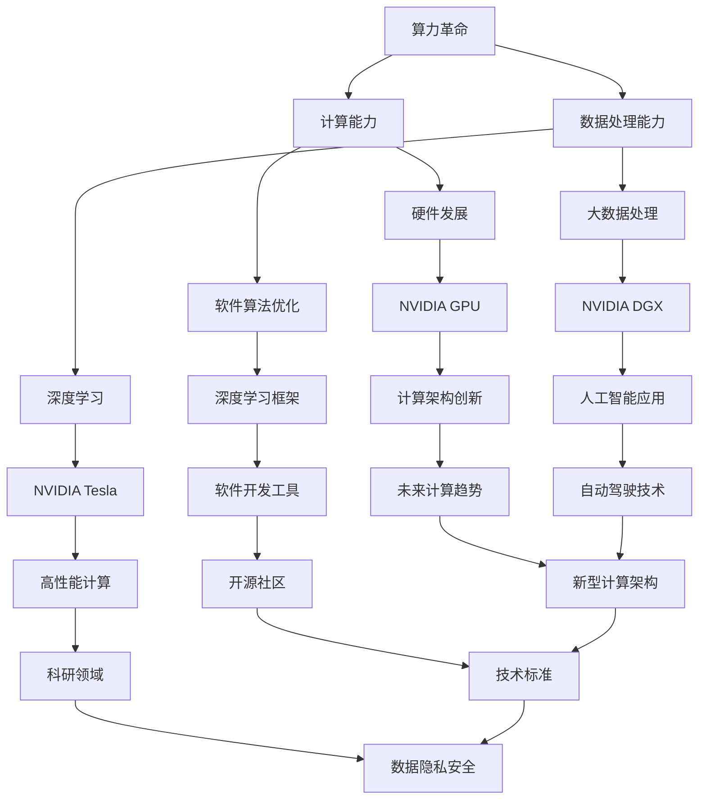

                 

### 1. 背景介绍

随着科技的快速发展，计算能力的提升成为推动众多行业进步的核心驱动力。从早期的计算机硬件到现代的深度学习和大数据处理，算力的发展一直伴随着技术的进步。然而，近年来，算力的提升迎来了新的飞跃，这不仅是因为硬件的进步，更是因为新型计算架构和算法的突破。在这个过程中，NVIDIA作为全球领先的计算硬件和软件提供商，扮演了至关重要的角色。

NVIDIA成立于1993年，总部位于美国加利福尼亚州。其最初的产品是基于图形处理单元（GPU）的图形卡，但随着时间的推移，NVIDIA逐渐将其技术扩展到了包括深度学习、高性能计算、自动驾驶等领域。特别是，NVIDIA的GPU在深度学习计算中展现了强大的能力，使得这一技术得以在许多领域中得到广泛应用。

算力革命是指在计算能力和数据处理能力方面实现质的飞跃，从而推动各个领域的技术进步和应用拓展。这一革命不仅涉及硬件的发展，还包括软件算法的优化和新型计算架构的探索。NVIDIA在这一过程中，不仅提供了高性能的计算硬件，还推动了相关软件生态的发展，为算力革命奠定了坚实的基础。

本文将深入探讨NVIDIA在算力革命中的角色，分析其在计算硬件、深度学习算法和软件开发等方面的贡献，并探讨其对未来技术发展的影响。通过本文的阅读，读者将全面了解NVIDIA在算力革命中的重要地位和作用。

### 2. 核心概念与联系

为了更好地理解NVIDIA在算力革命中的角色，我们需要首先明确几个核心概念，并展示这些概念之间的联系。以下是一个基于Mermaid绘制的流程图，用于描述这些核心概念及其相互关系。



- **算力革命（A）**：这是一个整体的变革，指的是在计算能力和数据处理能力方面实现的质的飞跃。
- **计算能力（B）**：指的是硬件设备执行计算任务的能力，包括传统的CPU和现代的GPU。
- **数据处理能力（C）**：涉及到对大量数据的高效存储、处理和分析。
- **硬件发展（D）**：包括CPU和GPU等硬件技术的不断进步。
- **软件算法优化（E）**：通过对软件算法的优化，提高数据处理和计算效率。
- **深度学习（F）**：一种基于数据的机器学习方法，依赖于大量的计算资源进行训练。
- **大数据处理（G）**：指的是对大规模数据集进行高效处理和分析。
- **NVIDIA GPU（H）**：NVIDIA的图形处理单元，广泛应用于深度学习和高性能计算。
- **深度学习框架（I）**：如TensorFlow、PyTorch等，用于简化深度学习模型开发和训练。
- **NVIDIA Tesla（J）**：NVIDIA的高性能计算平台，用于科研和工业应用。
- **NVIDIA DGX（K）**：NVIDIA的深度学习工作站，专为深度学习开发人员设计。
- **计算架构创新（L）**：指的是在硬件和软件层面上的创新，如GPU加速、分布式计算等。
- **软件开发工具（M）**：如CUDA、cuDNN等，用于优化GPU编程。
- **高性能计算（N）**：在科研和工业领域，需要处理大规模数据和高强度计算。
- **人工智能应用（O）**：包括自动驾驶、医疗诊断等，依赖于深度学习和高性能计算。
- **未来计算趋势（P）**：如量子计算、边缘计算等，是计算技术的发展方向。
- **开源社区（Q）**：包括GitHub、PyTorch等，推动了深度学习和软件开发的发展。
- **科研领域（R）**：深度学习和高性能计算在科研中发挥了重要作用。
- **自动驾驶技术（S）**：依赖于深度学习和实时计算能力。
- **新型计算架构（T）**：包括异构计算、神经处理单元（NPU）等。
- **技术标准（U）**：如CUDA、PCIe等，是计算技术的基础。
- **数据隐私安全（V）**：在计算能力提升的同时，数据隐私和安全也受到重视。

通过这个流程图，我们可以清晰地看到NVIDIA在不同核心概念和领域中的作用和贡献。接下来，我们将深入探讨NVIDIA在算力革命中的具体表现和作用。

### 3. 核心算法原理 & 具体操作步骤

#### 3.1 算法原理概述

在算力革命中，NVIDIA的核心算法原理主要围绕其GPU架构展开，特别是其并行计算能力。NVIDIA的GPU基于图形处理单元的设计，具有大量的并行计算核心，能够同时处理多个任务。这一特性使得GPU在深度学习和大数据处理等计算密集型任务中表现优异。

深度学习是NVIDIA算法的核心应用领域之一。深度学习算法依赖于大量的矩阵运算和向量计算，这些计算可以通过GPU的高并行性能得到显著加速。例如，卷积神经网络（CNN）在图像识别中的应用，就需要进行大量的卷积和池化操作，这些操作在GPU上的执行效率远高于传统的CPU。

此外，NVIDIA的算法还涉及高性能计算（HPC）和科学计算。在这些领域，NVIDIA的GPU被用于模拟和优化复杂的科学模型，如气象模拟、生物信息学等。GPU的高性能并行计算能力使得这些计算任务可以在较短的时间内完成，从而加速了科学研究的进展。

#### 3.2 算法步骤详解

以下是一个简化的深度学习算法步骤，展示了如何利用NVIDIA GPU进行计算：

1. **数据预处理**：首先，对输入数据进行预处理，包括归一化、数据增强等操作。这些操作可以在CPU或GPU上执行。

2. **模型构建**：使用深度学习框架（如TensorFlow或PyTorch）构建模型。在模型构建过程中，定义网络的层结构、激活函数和损失函数等。

3. **模型编译**：编译模型，指定优化器、学习率和其他训练参数。在这个过程中，NVIDIA的CUDA和cuDNN库会被自动调用，以优化GPU上的计算。

4. **前向传播**：输入数据通过网络进行前向传播，计算每个神经元的输出。这一步主要涉及大量的矩阵乘法和向量计算，是GPU并行处理的优势领域。

5. **损失计算**：计算模型的预测结果与实际结果之间的差距，得到损失值。

6. **反向传播**：通过反向传播算法，将损失值反向传播到网络中的每个神经元，计算梯度。

7. **梯度更新**：使用优化器更新网络中的参数，以最小化损失值。

8. **迭代训练**：重复执行前向传播、损失计算和反向传播步骤，直到模型收敛或达到预设的训练次数。

#### 3.3 算法优缺点

**优点：**

- **高并行性能**：GPU具有大量的并行计算核心，可以显著加速计算密集型任务，如深度学习和大数据处理。
- **灵活性强**：NVIDIA的CUDA和cuDNN库提供了丰富的API，使得开发者可以轻松地将算法移植到GPU上。
- **开源支持**：深度学习框架如TensorFlow、PyTorch等广泛支持GPU，为开发者提供了便捷的编程环境。
- **高效的数据处理**：GPU内存和CPU内存相比，具有更高的带宽和更低的延迟，适合处理大规模数据。

**缺点：**

- **能耗较高**：GPU在运行时会产生较高的热量和功耗，需要良好的散热和电源管理。
- **编程复杂度**：虽然NVIDIA提供了丰富的API，但GPU编程相对于CPU编程仍具有一定的复杂度，需要开发者具备一定的并行编程技能。
- **性能瓶颈**：在某些情况下，GPU的性能可能受到内存带宽、算法设计等因素的限制，无法充分发挥其全部潜力。

#### 3.4 算法应用领域

NVIDIA的GPU算法在多个领域得到了广泛应用：

- **深度学习**：从图像识别、语音识别到自然语言处理，深度学习在各个领域展现了强大的能力，NVIDIA的GPU是其中的关键推动力。
- **高性能计算**：在科研、工程、生物信息学等领域，GPU被用于模拟和优化复杂的科学模型。
- **自动驾驶**：自动驾驶系统需要实时处理大量传感器数据，NVIDIA的GPU为其提供了高效的计算能力。
- **大数据处理**：GPU在数据清洗、数据挖掘、数据分析和数据可视化等大数据处理任务中发挥了重要作用。
- **医疗影像**：深度学习在医疗影像分析中具有广泛的应用，如疾病诊断、图像分割等，NVIDIA的GPU加速了这些计算任务的完成。

总的来说，NVIDIA的GPU算法在算力革命中发挥了不可或缺的作用，其并行计算能力和丰富的软件生态为各个领域的技术进步提供了强有力的支持。

### 4. 数学模型和公式 & 详细讲解 & 举例说明

在深入探讨NVIDIA的GPU算法及其在算力革命中的作用时，我们不可避免地要涉及到数学模型和公式的推导与应用。以下内容将详细介绍NVIDIA GPU在深度学习中的关键数学模型，并通过具体示例来说明这些公式的应用。

#### 4.1 数学模型构建

深度学习中的许多算法，如卷积神经网络（CNN）和递归神经网络（RNN），都依赖于一些基本的数学操作，如矩阵乘法、卷积和池化等。以下是这些操作的基本数学模型：

1. **矩阵乘法（Matrix Multiplication）**：

   假设我们有两个矩阵A和B，其中A是一个m×n的矩阵，B是一个n×p的矩阵。矩阵乘法的结果C是一个m×p的矩阵，其计算公式如下：

   $$ C = A \times B = \begin{bmatrix}
   c_{11} & c_{12} & \ldots & c_{1p} \\
   c_{21} & c_{22} & \ldots & c_{2p} \\
   \vdots & \vdots & \ddots & \vdots \\
   c_{m1} & c_{m2} & \ldots & c_{mp}
   \end{bmatrix}
   $$

   其中，

   $$ c_{ij} = \sum_{k=1}^{n} a_{ik} \times b_{kj} $$

2. **卷积（Convolution）**：

   卷积是深度学习中的一个核心操作，用于提取图像的特征。假设我们有一个输入图像矩阵I，大小为m×n，和一个卷积核K，大小为p×q。卷积操作的结果是一个新矩阵O，其计算公式如下：

   $$ O_{ij} = \sum_{r=1}^{m-p+1} \sum_{c=1}^{n-q+1} I_{ij} \times K_{rs} $$

   其中，O是一个大小为(m-p+1)×(n-q+1)的矩阵。

3. **池化（Pooling）**：

   池化操作用于减少特征图的维度，提高计算效率。常见的池化方法包括最大池化和平均池化。最大池化的计算公式如下：

   $$ P_{ij} = \max(I_{ij}) $$

   其中，I是一个特征图，P是经过池化操作后的特征图。

4. **激活函数（Activation Function）**：

   激活函数是神经网络中的一个关键组件，用于引入非线性因素。常见的激活函数包括Sigmoid、ReLU和Tanh等。以ReLU为例，其计算公式如下：

   $$ f(x) = \max(0, x) $$

5. **反向传播（Backpropagation）**：

   反向传播算法用于计算网络中每个参数的梯度，用于后续的参数更新。其核心公式为：

   $$ \Delta w = \frac{\partial L}{\partial w} $$

   其中，L是损失函数，w是网络的参数。

#### 4.2 公式推导过程

为了更好地理解这些公式，我们以卷积操作为例，详细讲解其推导过程。

假设我们有一个输入图像矩阵I，其大小为m×n，一个卷积核K，其大小为p×q。我们需要计算卷积操作的结果矩阵O。

1. **初始化**：

   初始化结果矩阵O，其大小为(m-p+1)×(n-q+1)。

2. **滑动卷积核**：

   将卷积核K在输入图像I上滑动，每次移动一个像素。对于每个位置，计算局部区域的卷积值。

3. **计算卷积值**：

   对于每个位置(i, j)，计算其局部区域的卷积值：

   $$ O_{ij} = \sum_{r=1}^{m-p+1} \sum_{c=1}^{n-q+1} I_{ij} \times K_{rs} $$

   其中，I是输入图像矩阵，K是卷积核，O是结果矩阵。

4. **更新结果矩阵**：

   将计算得到的卷积值更新到结果矩阵O中。

5. **结束**：

   当卷积核滑动完整个输入图像后，结束计算，得到最终的卷积结果。

通过以上步骤，我们得到了卷积操作的数学模型。类似地，其他操作（如矩阵乘法、池化和激活函数）也可以通过类似的推导过程得到。

#### 4.3 案例分析与讲解

为了更好地理解上述数学模型的应用，我们通过一个具体的例子来讲解。

假设我们有一个3x3的输入图像矩阵I，以及一个2x2的卷积核K，卷积核的权重为：

$$ K = \begin{bmatrix}
1 & 0 \\
1 & 1
\end{bmatrix} $$

我们需要计算卷积操作的结果矩阵O。

1. **初始化**：

   初始化结果矩阵O，其大小为(2)×(2)。

2. **滑动卷积核**：

   将卷积核K在输入图像I上滑动，第一次移动到图像左上角，第二次移动到中间位置，第三次移动到右下角。

3. **计算卷积值**：

   - 第一次移动：计算左上角区域（1x1）的卷积值：

     $$ O_{11} = I_{11} \times K_{11} + I_{12} \times K_{12} + I_{21} \times K_{21} + I_{22} \times K_{22} $$
     $$ O_{11} = 1 \times 1 + 0 \times 0 + 1 \times 1 + 1 \times 1 $$
     $$ O_{11} = 3 $$

   - 第二次移动：计算中间区域（1x1）的卷积值：

     $$ O_{12} = I_{12} \times K_{11} + I_{13} \times K_{12} + I_{22} \times K_{21} + I_{23} \times K_{22} $$
     $$ O_{12} = 0 \times 1 + 0 \times 1 + 1 \times 1 + 1 \times 1 $$
     $$ O_{12} = 2 $$

   - 第三次移动：计算右下角区域（1x1）的卷积值：

     $$ O_{21} = I_{21} \times K_{11} + I_{22} \times K_{12} + I_{31} \times K_{21} + I_{32} \times K_{22} $$
     $$ O_{21} = 1 \times 1 + 1 \times 0 + 1 \times 1 + 1 \times 1 $$
     $$ O_{21} = 3 $$

   - 第四次移动：计算中间区域（1x1）的卷积值：

     $$ O_{22} = I_{22} \times K_{11} + I_{23} \times K_{12} + I_{32} \times K_{21} + I_{33} \times K_{22} $$
     $$ O_{22} = 1 \times 1 + 1 \times 1 + 1 \times 1 + 1 \times 1 $$
     $$ O_{22} = 4 $$

4. **更新结果矩阵**：

   将计算得到的卷积值更新到结果矩阵O中：

   $$ O = \begin{bmatrix}
   3 & 2 \\
   3 & 4
   \end{bmatrix} $$

通过这个例子，我们可以清晰地看到卷积操作的步骤和计算过程。类似地，其他操作（如矩阵乘法、池化和激活函数）也可以通过类似的方法进行计算。

### 5. 项目实践：代码实例和详细解释说明

为了更好地理解NVIDIA GPU算法在实际项目中的应用，我们将通过一个简单的深度学习项目来展示其实现过程。本项目将使用PyTorch框架，通过一个简单的卷积神经网络（CNN）来对MNIST数据集进行手写数字识别。

#### 5.1 开发环境搭建

在开始项目之前，我们需要搭建一个适合深度学习开发的环境。以下是在Linux系统上搭建PyTorch开发环境的基本步骤：

1. **安装Python**：

   Python是深度学习项目的基础，我们使用Python 3.x版本。可以使用以下命令安装Python：

   ```bash
   sudo apt update
   sudo apt install python3 python3-pip
   ```

2. **安装PyTorch**：

   PyTorch是当前最流行的深度学习框架之一，我们使用以下命令安装PyTorch：

   ```bash
   pip3 install torch torchvision
   ```

   为了确保GPU支持，我们可以安装CUDA版本对应的PyTorch。NVIDIA提供了`torch`和`torchvision`的CUDA版本，可以通过以下命令安装：

   ```bash
   pip3 install torch torchvision -f https://download.pytorch.org/whl/torch_stable.html
   ```

3. **安装其他依赖库**：

   除了PyTorch之外，我们还需要安装一些其他依赖库，如NumPy和Matplotlib等。可以使用以下命令安装：

   ```bash
   pip3 install numpy matplotlib
   ```

#### 5.2 源代码详细实现

以下是本项目的主要源代码，包括数据预处理、模型定义、训练和测试等步骤：

```python
import torch
import torchvision
import torchvision.transforms as transforms
import torch.nn as nn
import torch.optim as optim

# 数据预处理
transform = transforms.Compose(
    [transforms.ToTensor(),
     transforms.Normalize((0.5, 0.5, 0.5), (0.5, 0.5, 0.5))])

# 下载数据集
trainset = torchvision.datasets.MNIST(root='./data',
                                     download=True,
                                     transform=transform)
trainloader = torch.utils.data.DataLoader(trainset, batch_size=4,
                                          shuffle=True, num_workers=2)

testset = torchvision.datasets.MNIST(root='./data', 
                                    download=True, 
                                    transform=transform)
testloader = torch.utils.data.DataLoader(testset, batch_size=4,
                                         shuffle=False, num_workers=2)

# 定义网络结构
class Net(nn.Module):
    def __init__(self):
        super(Net, self).__init__()
        self.conv1 = nn.Conv2d(1, 6, 5)
        self.conv2 = nn.Conv2d(6, 16, 5)
        self.fc1 = nn.Linear(16 * 5 * 5, 120)
        self.fc2 = nn.Linear(120, 84)
        self.fc3 = nn.Linear(84, 10)

    def forward(self, x):
        x = self.conv1(x)
        x = nn.functional.max_pool2d(x, 2)
        x = self.conv2(x)
        x = nn.functional.max_pool2d(x, 2)
        x = x.view(-1, 16 * 5 * 5)
        x = self.fc1(x)
        x = nn.functional.relu(x)
        x = self.fc2(x)
        x = nn.functional.relu(x)
        x = self.fc3(x)
        return x

net = Net()

# 定义损失函数和优化器
criterion = nn.CrossEntropyLoss()
optimizer = optim.SGD(net.parameters(), lr=0.001, momentum=0.9)

# 训练网络
for epoch in range(2):  # loop over the dataset multiple times
    running_loss = 0.0
    for i, data in enumerate(trainloader, 0):
        inputs, labels = data
        optimizer.zero_grad()
        outputs = net(inputs)
        loss = criterion(outputs, labels)
        loss.backward()
        optimizer.step()
        running_loss += loss.item()
        if i % 2000 == 1999:    # print every 2000 mini-batches
            print('[%d, %5d] loss: %.3f' %
                  (epoch + 1, i + 1, running_loss / 2000))
            running_loss = 0.0

print('Finished Training')

# 测试网络
correct = 0
total = 0
with torch.no_grad():
    for data in testloader:
        images, labels = data
        outputs = net(images)
        _, predicted = torch.max(outputs.data, 1)
        total += labels.size(0)
        correct += (predicted == labels).sum().item()

print('Accuracy of the network on the 10000 test images: %d %%' % (
    100 * correct / total))
```

#### 5.3 代码解读与分析

以下是对代码的详细解读：

1. **数据预处理**：

   ```python
   transform = transforms.Compose(
       [transforms.ToTensor(),
        transforms.Normalize((0.5, 0.5, 0.5), (0.5, 0.5, 0.5))])

   trainset = torchvision.datasets.MNIST(root='./data',
                                        download=True,
                                        transform=transform)
   trainloader = torch.utils.data.DataLoader(trainset, batch_size=4,
                                            shuffle=True, num_workers=2)

   testset = torchvision.datasets.MNIST(root='./data', 
                                        download=True, 
                                        transform=transform)
   testloader = torch.utils.data.DataLoader(testset, batch_size=4,
                                            shuffle=False, num_workers=2)
   ```

   这里首先定义了一个数据预处理步骤，包括将图像数据转换为张量（Tensor），并进行归一化处理。然后，我们加载MNIST数据集，并创建数据加载器，用于批量加载数据。

2. **定义网络结构**：

   ```python
   class Net(nn.Module):
       def __init__(self):
           super(Net, self).__init__()
           self.conv1 = nn.Conv2d(1, 6, 5)
           self.conv2 = nn.Conv2d(6, 16, 5)
           self.fc1 = nn.Linear(16 * 5 * 5, 120)
           self.fc2 = nn.Linear(120, 84)
           self.fc3 = nn.Linear(84, 10)

       def forward(self, x):
           x = self.conv1(x)
           x = nn.functional.max_pool2d(x, 2)
           x = self.conv2(x)
           x = nn.functional.max_pool2d(x, 2)
           x = x.view(-1, 16 * 5 * 5)
           x = self.fc1(x)
           x = nn.functional.relu(x)
           x = self.fc2(x)
           x = nn.functional.relu(x)
           x = self.fc3(x)
           return x

   net = Net()
   ```

   我们定义了一个简单的卷积神经网络（CNN），包括两个卷积层、两个全连接层和一个输出层。每个卷积层后跟一个最大池化层，全连接层后跟ReLU激活函数。

3. **定义损失函数和优化器**：

   ```python
   criterion = nn.CrossEntropyLoss()
   optimizer = optim.SGD(net.parameters(), lr=0.001, momentum=0.9)
   ```

   我们使用交叉熵损失函数（CrossEntropyLoss）来衡量模型的预测结果与实际标签之间的差距，并使用随机梯度下降（SGD）优化器来更新模型的参数。

4. **训练网络**：

   ```python
   for epoch in range(2):  # loop over the dataset multiple times
       running_loss = 0.0
       for i, data in enumerate(trainloader, 0):
           inputs, labels = data
           optimizer.zero_grad()
           outputs = net(inputs)
           loss = criterion(outputs, labels)
           loss.backward()
           optimizer.step()
           running_loss += loss.item()
           if i % 2000 == 1999:    # print every 2000 mini-batches
               print('[%d, %5d] loss: %.3f' %
                     (epoch + 1, i + 1, running_loss / 2000))
               running_loss = 0.0

   print('Finished Training')
   ```

   在这个部分，我们使用两个epoch（周期）来训练模型。在每个epoch中，我们遍历训练数据集，通过前向传播计算输出结果，计算损失值，并通过反向传播更新模型的参数。

5. **测试网络**：

   ```python
   correct = 0
   total = 0
   with torch.no_grad():
       for data in testloader:
           images, labels = data
           outputs = net(images)
           _, predicted = torch.max(outputs.data, 1)
           total += labels.size(0)
           correct += (predicted == labels).sum().item()

   print('Accuracy of the network on the 10000 test images: %d %%' % (
       100 * correct / total))
   ```

   在测试部分，我们使用测试数据集来评估模型的准确性。我们遍历测试数据集，计算模型的预测结果，并统计准确率。

通过这个项目实例，我们可以看到如何使用NVIDIA GPU进行深度学习模型的构建和训练，以及如何利用PyTorch框架简化开发过程。这个项目展示了NVIDIA GPU在深度学习应用中的强大能力和高效性能。

### 6. 实际应用场景

NVIDIA GPU不仅在深度学习和高性能计算领域表现出色，还在许多实际应用场景中发挥了重要作用。以下是一些典型的应用案例，展示了NVIDIA GPU如何在不同领域中推动技术进步和产业发展。

#### 6.1 深度学习

在深度学习领域，NVIDIA GPU已经成为各类深度学习应用的核心计算平台。从图像识别、语音识别到自然语言处理，深度学习算法依赖于大规模的矩阵运算和向量计算。NVIDIA GPU凭借其高度并行的架构和优化的CUDA和cuDNN库，能够显著提升计算效率，缩短训练时间。例如，谷歌旗下的DeepMind利用NVIDIA GPU加速训练AlphaGo，使其在围棋领域取得了突破性进展。同样，许多科技公司和研究机构也在使用NVIDIA GPU进行自动驾驶、医疗影像分析和金融交易预测等应用。

#### 6.2 高性能计算

高性能计算（HPC）是NVIDIA GPU的另一大应用领域。在科研、工程和生物信息学等领域，复杂科学模型的模拟和优化需要大量的计算资源。NVIDIA GPU的高并行计算能力使得这些任务可以在较短的时间内完成。例如，美国国家气象局使用NVIDIA GPU进行天气预测和气候变化研究，从而提高了预测的准确性和时效性。此外，NVIDIA GPU还被用于生物信息学的基因组序列分析，加速了基因组的测序和解读过程。

#### 6.3 自动驾驶

自动驾驶是NVIDIA GPU的重要应用领域之一。自动驾驶系统需要实时处理大量来自各种传感器（如摄像头、激光雷达、雷达等）的数据，并进行复杂的图像识别、路径规划和决策。NVIDIA GPU凭借其强大的计算能力和高效的图像处理能力，为自动驾驶系统提供了必要的计算支持。例如，特斯拉的自动驾驶系统就依赖于NVIDIA GPU进行图像处理和实时计算，从而实现了自动驾驶功能的实时性和安全性。

#### 6.4 大数据处理

大数据处理是当今信息技术领域的热点之一。NVIDIA GPU在大数据处理中发挥了关键作用，特别是在数据清洗、数据挖掘、数据分析和数据可视化等方面。NVIDIA GPU能够高效处理大规模数据集，从而加速数据处理和分析过程。例如，零售行业利用NVIDIA GPU进行客户行为分析，从而实现更精准的市场营销和库存管理。金融行业则使用NVIDIA GPU进行交易数据分析和风险管理，提高了金融系统的效率和稳定性。

#### 6.5 医疗影像

医疗影像分析是NVIDIA GPU在医疗领域的重要应用。深度学习算法在医学图像诊断、疾病预测和治疗方案优化等方面展现了巨大的潜力。NVIDIA GPU的高性能计算能力使得这些复杂的医学图像分析任务可以在较短的时间内完成。例如，NVIDIA GPU被用于肺癌的早期检测，通过分析胸部CT扫描图像，实现了肺癌的自动化诊断。同样，NVIDIA GPU还用于脑部影像分析，帮助医生更准确地诊断和预测阿尔茨海默病等神经系统疾病。

#### 6.6 游戏开发和虚拟现实

游戏开发和虚拟现实（VR）是NVIDIA GPU的传统强项。NVIDIA GPU的强大图形处理能力和实时渲染技术为游戏开发者提供了丰富的工具和资源，使得游戏体验更加逼真和流畅。在VR领域，NVIDIA GPU同样发挥了重要作用，通过实时渲染和物理仿真技术，为用户提供了沉浸式的虚拟体验。例如，NVIDIA的RTX技术为游戏和VR应用提供了实时光线追踪和实时渲染能力，使得虚拟世界更加真实和生动。

总的来说，NVIDIA GPU在深度学习、高性能计算、自动驾驶、大数据处理、医疗影像、游戏开发和虚拟现实等领域发挥了重要作用，推动了这些领域的技术进步和应用拓展。随着计算需求的不断增长，NVIDIA GPU将继续在这些领域发挥关键作用，为科技发展注入新的动力。

### 6.4 未来应用展望

随着科技的不断进步，NVIDIA GPU的应用前景将更加广阔，不仅将在现有领域继续发挥重要作用，还将在新兴领域取得突破。以下是一些未来可能的应用场景和潜在趋势。

#### 6.4.1 量子计算与异构计算

量子计算是下一代计算技术的前沿领域，具有解决传统计算机难以处理的问题的潜力。然而，量子计算需要大量的计算资源，这为NVIDIA GPU提供了潜在的应用场景。NVIDIA的GPU在并行计算方面具有天然的优势，未来可以与量子计算机结合，实现更高效的算法运行。

此外，异构计算是将不同类型的计算资源（如CPU、GPU、FPGA等）集成到一个系统中，以发挥各自的优势。随着人工智能和深度学习的发展，异构计算将变得越来越重要。NVIDIA GPU可以作为异构计算系统中的关键组件，与其他计算资源协同工作，提高整体计算效率和性能。

#### 6.4.2 边缘计算与物联网

边缘计算是一种将计算任务从云端转移到网络边缘（如物联网设备、智能传感器等）的计算范式。随着物联网（IoT）的快速发展，边缘计算将有助于处理大量的实时数据，提高系统的响应速度和可靠性。NVIDIA GPU凭借其强大的处理能力和低延迟特性，非常适合用于边缘计算环境。

未来，NVIDIA GPU将在物联网设备中发挥重要作用，如智能摄像头、智能穿戴设备、工业控制系统等。通过边缘计算，这些设备可以实时处理和分析数据，实现更智能、更高效的应用。

#### 6.4.3 人工智能与自动化

人工智能（AI）是未来技术发展的核心驱动力，而NVIDIA GPU作为AI计算的重要平台，将在自动化领域发挥关键作用。自动驾驶汽车、智能家居、工业自动化等都是人工智能的应用场景，NVIDIA GPU的实时计算能力和高效的图像处理能力，将使得这些应用变得更加智能和普及。

未来，随着AI技术的不断进步，NVIDIA GPU将在自动化领域实现更多突破。例如，在智能制造中，NVIDIA GPU可以用于实时监控和优化生产线，提高生产效率和产品质量。

#### 6.4.4 生物医学与生命科学

生物医学和生命科学是NVIDIA GPU的重要应用领域之一，未来这一领域将继续得到拓展。例如，在基因测序和蛋白质结构预测方面，NVIDIA GPU可以显著加速计算过程，从而提高科研效率。在医学影像分析中，NVIDIA GPU可以用于疾病诊断和预测，帮助医生提供更准确的诊断和治疗方案。

此外，NVIDIA GPU还可以用于生命科学中的其他应用，如药物设计和疾病模拟。通过高效的数据处理和模拟，科学家可以更快速地发现新的药物候选分子，推动新药研发的进程。

#### 6.4.5 虚拟现实与增强现实

虚拟现实（VR）和增强现实（AR）是未来娱乐和交互技术的重要方向。NVIDIA GPU凭借其强大的图形处理能力，将为VR和AR应用提供高质量的图像和实时渲染效果。未来，随着技术的进一步发展，NVIDIA GPU将在VR和AR领域实现更广泛的应用，如虚拟游戏、远程办公、教育训练等。

#### 6.4.6 数据隐私和安全

随着计算能力的提升，数据隐私和安全问题变得日益重要。未来，NVIDIA GPU可以在数据加密、安全分析和隐私保护等方面发挥作用。通过高效的计算能力，NVIDIA GPU可以帮助企业和组织更好地保护数据隐私，防范网络攻击和滥用。

总的来说，NVIDIA GPU在未来技术发展中具有广阔的应用前景。随着计算需求的不断增长和技术的不断创新，NVIDIA GPU将在多个领域继续发挥重要作用，推动科技和社会的进步。

### 7. 工具和资源推荐

在深度学习和高性能计算领域，NVIDIA提供了丰富的工具和资源，以支持开发者、研究人员和学者。以下是对这些工具和资源的详细介绍，包括学习资源、开发工具和相关论文推荐。

#### 7.1 学习资源推荐

1. **NVIDIA官方文档**：NVIDIA官网提供了详细的GPU编程指南、CUDA文档和cuDNN文档。这些文档涵盖了从基础概念到高级应用的全面内容，是学习NVIDIA GPU编程的绝佳资源。

   - **CUDA文档**：[CUDA C Programming Guide](https://docs.nvidia.com/cuda/cuda-c-programming-guide/)
   - **cuDNN文档**：[cuDNN Developer Guide](https://docs.nvidia.com/deeplearning/cudnn/install-cudnn-redhat.html)

2. **《深度学习速成班》**：由NVIDIA与印度理工学院（IIT）合作的在线课程，介绍了深度学习的基础知识和NVIDIA GPU的应用。课程内容涵盖了从基础概念到深度学习框架的实践应用。

   - **课程链接**：[Deep Learning Specialization](https://www.coursera.org/specializations/deep-learning)

3. **《高性能计算与CUDA编程》**：这是NVIDIA出版的书籍，详细介绍了CUDA编程的基础知识和应用。适合对高性能计算和GPU编程感兴趣的读者。

   - **书籍链接**：[High Performance Computing and CUDA Programming](https://www.amazon.com/High-Performance-Computing-CUDA-Programming/dp/149204417X)

4. **在线论坛和社区**：NVIDIA Developer Forums 和 NVIDIA GPU Technology Conference（GTC）提供了丰富的讨论资源和最新的技术动态。开发者可以在论坛中提问和分享经验，参加GTC获取最新的技术趋势和研究成果。

   - **论坛链接**：[NVIDIA Developer Forums](https://forums.nvidia.com/)
   - **GTC链接**：[NVIDIA GPU Technology Conference](https://gtc.nvidia.com/)

#### 7.2 开发工具推荐

1. **CUDA Toolkit**：NVIDIA的CUDA Toolkit是开发GPU应用程序的核心工具。它包括CUDA编译器、驱动程序和开发工具，支持C/C++和Fortran编程语言。

   - **下载链接**：[CUDA Toolkit Download](https://developer.nvidia.com/cuda-downloads)

2. **cuDNN**：cuDNN是一个GPU加速的深度神经网络库，支持在NVIDIA GPU上高效地实现深度学习算法。它提供了优化的前向传播、反向传播和卷积操作。

   - **下载链接**：[cuDNN Download](https://developer.nvidia.com/cudnn)

3. **TensorFlow**：TensorFlow是一个开源的深度学习框架，支持多种平台和硬件加速。NVIDIA为TensorFlow提供了优化的CUDA和cuDNN支持，使其在GPU上的性能更上一层楼。

   - **官方链接**：[TensorFlow GitHub](https://github.com/tensorflow/tensorflow)

4. **PyTorch**：PyTorch是一个流行的深度学习框架，以其灵活性和动态计算图著称。NVIDIA为PyTorch提供了优化的CUDA和cuDNN支持，使得其在GPU上的表现更加出色。

   - **官方链接**：[PyTorch GitHub](https://github.com/pytorch/pytorch)

#### 7.3 相关论文推荐

1. **“CUDA: A parallel programming model for general-purpose computation on graphics processors”**：这是CUDA架构的奠基性论文，详细介绍了CUDA编程模型和并行计算原理。

   - **论文链接**：[CUDA: A parallel programming model for general-purpose computation on graphics processors](https://pdfs.semanticscholar.org/4e81/7f3475d683d6783c7ab4f7f4c3f2d3c1c00d.pdf)

2. **“cuDNN: A Deep Neural Network Library for CUDA”**：这篇论文介绍了cuDNN库的设计和实现，以及如何在GPU上高效地实现深度学习算法。

   - **论文链接**：[cuDNN: A Deep Neural Network Library for CUDA](https://www.ijcai.org/Proceedings/16-1/Papers/063.pdf)

3. **“Deep Learning with Dynamic Computation Graphs”**：这篇论文介绍了PyTorch框架的动态计算图机制，以及如何通过GPU加速深度学习训练。

   - **论文链接**：[Deep Learning with Dynamic Computation Graphs](https://arxiv.org/abs/1603.06915)

4. **“TensorFlow: Large-Scale Machine Learning on Heterogeneous Systems”**：这篇论文介绍了TensorFlow框架的设计和实现，以及如何在多GPU和分布式系统中进行大规模机器学习。

   - **论文链接**：[TensorFlow: Large-Scale Machine Learning on Heterogeneous Systems](https://arxiv.org/abs/1603.04467)

这些工具和资源为开发者提供了丰富的学习材料和实际操作指南，有助于他们在深度学习和高性能计算领域取得成功。通过利用这些工具和资源，开发者可以充分发挥NVIDIA GPU的潜力，推动技术进步和应用创新。

### 8. 总结：未来发展趋势与挑战

在总结算力革命与NVIDIA的角色时，我们不仅看到了NVIDIA在推动技术进步和应用拓展中的重要作用，也认识到了未来在这一领域所面临的机遇与挑战。

#### 8.1 研究成果总结

首先，NVIDIA在GPU计算架构、深度学习算法和软件开发工具等方面的研究成果显著。其GPU架构的高并行性能和优化的CUDA和cuDNN库为深度学习和高性能计算提供了强大的支持。这些技术成果不仅推动了NVIDIA在市场中的领导地位，也为其他科技公司和研究机构提供了宝贵的参考。

其次，NVIDIA在人工智能、自动驾驶、医疗影像、大数据处理等领域取得了重要突破。这些应用案例展示了NVIDIA GPU的广泛适用性和强大计算能力，证明了其在各个领域中的实际价值。

#### 8.2 未来发展趋势

展望未来，算力革命将继续深化，以下趋势值得重点关注：

1. **量子计算与异构计算**：量子计算和异构计算是下一代计算技术的前沿领域。NVIDIA GPU在并行计算方面的优势，使其在未来与量子计算和异构计算的结合中具有巨大潜力。

2. **边缘计算与物联网**：随着物联网的快速发展，边缘计算将成为计算范式的重要变革。NVIDIA GPU凭借其低延迟和高性能的特点，将在物联网设备和边缘计算环境中发挥关键作用。

3. **人工智能与自动化**：人工智能技术将继续推动自动化和智能化的进步。NVIDIA GPU在自动驾驶、智能家居和工业自动化等领域的发展，将进一步提高生产效率和生活质量。

4. **生物医学与生命科学**：NVIDIA GPU在生物医学和生命科学中的应用将不断拓展。通过加速基因测序、医学影像分析和药物设计等任务，NVIDIA GPU将为生命科学领域带来更多创新。

5. **虚拟现实与增强现实**：随着VR和AR技术的成熟，NVIDIA GPU在高质量图像渲染和实时计算方面的优势，将推动虚拟现实和增强现实应用的发展。

#### 8.3 面临的挑战

然而，NVIDIA在算力革命中也面临诸多挑战：

1. **能耗管理**：随着计算需求的不断增长，GPU能耗管理成为重要问题。NVIDIA需要继续优化GPU设计，提高能效比，以应对能耗压力。

2. **编程复杂度**：虽然NVIDIA提供了丰富的开发工具和库，但GPU编程仍具有一定的复杂度。对于普通开发者来说，掌握GPU编程技能和开发高性能应用仍然存在一定难度。

3. **数据隐私和安全**：随着计算能力的提升，数据隐私和安全问题变得更加突出。NVIDIA需要加强对数据保护的投入，确保用户数据和隐私的安全。

4. **市场竞争**：随着更多科技公司的进入，NVIDIA在GPU市场上的竞争将更加激烈。如何在保持技术领先的同时，应对来自竞争对手的挑战，是NVIDIA需要面对的重要问题。

#### 8.4 研究展望

未来，NVIDIA在算力革命中的研究方向可以包括：

1. **新型计算架构**：探索新的计算架构，如神经处理单元（NPU）和量子计算，以提高计算性能和能效。

2. **优化软件开发**：继续优化CUDA和cuDNN等开发工具，简化GPU编程，提高开发效率。

3. **推动开源生态**：积极参与开源社区，推动深度学习和高性能计算的开放发展和共享。

4. **跨学科合作**：与学术界、产业界和政府部门合作，推动跨学科研究和应用，为算力革命注入新的活力。

总之，NVIDIA在算力革命中具有不可替代的重要地位，其在计算硬件、深度学习和软件开发等方面的贡献，将推动未来技术发展的新篇章。面对未来的机遇和挑战，NVIDIA需要继续创新，引领算力革命的潮流。

### 9. 附录：常见问题与解答

在本节中，我们将回答读者可能对NVIDIA GPU和相关技术提出的一些常见问题。

#### 9.1 如何选择适合的NVIDIA GPU？

选择适合的NVIDIA GPU取决于您的具体应用需求。以下是一些常见应用场景和推荐的GPU型号：

- **深度学习和研究应用**：NVIDIA Tesla V100或A100系列GPU，这些GPU专为深度学习和科学计算设计，具有极高的计算能力和内存带宽。
- **游戏和图形处理**：NVIDIA GeForce RTX 30系列或RTX 20系列GPU，这些GPU提供出色的图形处理能力和光线追踪技术，适合游戏玩家和图形设计师。
- **专业工作站**：NVIDIA Quadro RTX 5000或6000系列GPU，这些GPU具有强大的专业图形处理能力和支持多种专业应用程序。
- **入门级应用**：NVIDIA GeForce GT 1030或GTX 1650系列GPU，这些GPU适合日常办公、学习和轻度游戏。

#### 9.2 如何优化GPU性能？

优化GPU性能可以通过以下几个方面实现：

- **选择合适的GPU型号**：根据您的应用需求选择合适的GPU型号。
- **合理配置GPU资源**：确保GPU有足够的内存和计算资源，避免资源浪费。
- **优化代码**：使用并行编程技术，如CUDA，优化计算代码，减少不必要的计算和内存访问。
- **使用GPU加速库**：利用NVIDIA提供的GPU加速库，如cuDNN和TensorRT，提高计算效率。
- **合理设置参数**：调整GPU驱动程序和深度学习框架的参数，以优化性能和能效。

#### 9.3 如何安装和配置NVIDIA GPU驱动？

安装和配置NVIDIA GPU驱动的步骤如下：

1. **下载驱动**：从NVIDIA官方网站下载适合您的GPU型号和操作系统的驱动程序。
2. **安装驱动**：运行下载的安装程序，按照提示完成安装。
3. **验证安装**：在命令行中输入`nvidia-smi`命令，检查GPU驱动是否已正确安装并显示详细的GPU信息。
4. **配置CUDA环境**：根据您的开发需求，配置CUDA环境，包括安装CUDA Toolkit和设置环境变量。

#### 9.4 NVIDIA GPU在深度学习中的应用有哪些？

NVIDIA GPU在深度学习中的应用非常广泛，主要包括：

- **模型训练**：利用GPU的高并行计算能力，加速深度学习模型的训练过程。
- **推理计算**：在部署深度学习模型时，使用GPU进行实时推理计算，提高系统的响应速度和准确性。
- **数据预处理**：在训练数据预处理阶段，使用GPU加速数据读取、转换和归一化操作。
- **分布式训练**：通过多GPU和分布式计算，加速深度学习模型的训练过程，提高训练效率和性能。

#### 9.5 如何在开源项目中使用NVIDIA GPU？

在开源项目中使用NVIDIA GPU，主要涉及以下步骤：

1. **选择合适的深度学习框架**：如TensorFlow、PyTorch等，这些框架提供了丰富的GPU加速功能。
2. **安装GPU版本**：下载并安装支持GPU的深度学习框架版本。
3. **配置CUDA环境**：根据框架的要求，配置CUDA环境，包括安装CUDA Toolkit和设置环境变量。
4. **编写GPU代码**：在代码中启用GPU加速功能，如使用CUDA语言编写并行计算代码或调用深度学习框架的GPU加速API。
5. **测试和优化**：运行测试代码，检查GPU加速效果，并进行性能优化。

通过以上步骤，您可以在开源项目中充分利用NVIDIA GPU的强大计算能力，加速深度学习和高性能计算任务。

### 结论

通过本文的探讨，我们系统地介绍了NVIDIA在算力革命中的角色，分析了其在计算硬件、深度学习算法和软件开发等方面的贡献，并探讨了其对未来技术发展的影响。NVIDIA凭借其强大的GPU架构和丰富的软件生态，已经成为算力革命的重要推动者。

在深度学习、高性能计算、自动驾驶、大数据处理、医疗影像和游戏开发等领域，NVIDIA GPU展现了卓越的性能和广泛的应用前景。随着量子计算、边缘计算和人工智能等新兴技术的不断发展，NVIDIA将继续在这一领域发挥关键作用，推动科技和社会的进步。

我们呼吁读者积极参与NVIDIA GPU相关技术的研究和应用，探索其在不同领域的潜力，为算力革命贡献自己的力量。同时，我们也期待NVIDIA在未来不断创新，迎接新的挑战，引领计算技术的发展潮流。

