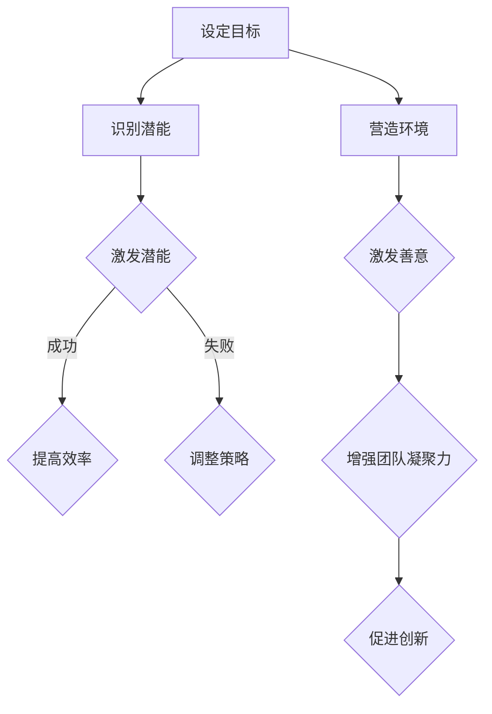
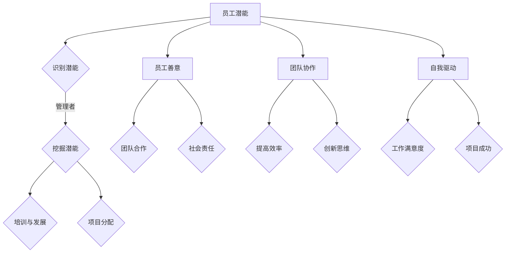

                 

关键词：管理、潜能、善意、技术、人本管理

> 摘要：本文从技术与管理相结合的角度，深入探讨了管理的本质，通过激发员工潜能与善意，探讨了如何在IT领域实现高效管理。本文分为八个部分，从背景介绍到未来发展趋势与挑战，全面解析了管理的核心要素。

## 1. 背景介绍

在当今快速发展的信息技术领域，管理的作用愈发重要。无论是企业内部的团队协作，还是项目管理的实施，管理都扮演着关键角色。然而，传统的管理模式往往侧重于控制与监督，而忽视了员工的潜能与善意。这种管理模式在IT领域常常导致创新能力的下降，工作效率的降低。

本文旨在通过探讨管理的本质，提出一种以激发员工潜能与善意为核心的管理理念，以适应信息技术领域的独特需求。

### 1.1 IT领域的特殊需求

信息技术领域的特点在于其高度的创新性和快速变化性。因此，管理必须具备灵活性和适应性，以应对技术环境的不断变化。此外，IT领域员工通常具备较高的专业素养和自主性，这要求管理方式更加关注员工的个性化和自我驱动。

### 1.2 管理的困境

传统的管理模式在IT领域面临诸多困境。首先，过于严格的控制机制限制了员工的自主性和创造力。其次，管理者的决策往往基于对员工的猜疑和控制，而忽视了员工的内在动机和需求。这种管理模式不仅降低了工作效率，还可能损害员工的积极性和士气。

### 1.3 激发潜能与善意的必要性

为了应对这些困境，管理者需要转变观念，从控制员工转向激发员工的潜能与善意。这种管理方式不仅能够提高员工的工作满意度和忠诚度，还能够促进团队的协作和创新，从而实现企业的长期发展。

## 2. 核心概念与联系

### 2.1 潜能

潜能是指个体未被完全发挥的能力和潜力。在IT领域，员工的潜能包括技术能力、问题解决能力、创新思维等多个方面。管理者需要识别和挖掘员工的潜能，为他们的成长和发展提供机会。

### 2.2 善意

善意是指个体对他人和社会的积极态度和意愿。在IT领域，员工的善意体现在他们的合作精神、对团队的贡献以及对工作的热情。管理者需要营造一个积极的工作环境，激发员工的善意，促进团队的凝聚力和协作。

### 2.3 Mermaid 流程图

以下是一个描述管理本质的Mermaid流程图：



## 3. 核心算法原理 & 具体操作步骤

### 3.1 算法原理概述

管理本质的核心算法原理在于通过识别和激发员工的潜能与善意，实现高效的管理。具体操作步骤包括以下几个部分：

1. **识别潜能**：通过观察、评估和反馈，识别员工的能力和潜力。
2. **激发潜能**：为员工提供成长和发展的机会，如培训、项目参与等。
3. **营造环境**：创造一个积极的工作环境，激发员工的善意。
4. **激发善意**：通过团队建设、奖励机制等手段，增强员工的团队合作精神和责任感。

### 3.2 算法步骤详解

1. **识别潜能**：

   - 观察员工的工作表现，识别其技术能力和问题解决能力。
   - 通过评估和反馈，了解员工的自我认知和成长需求。
   - 定期与员工沟通，获取其对个人潜能的认识和期望。

2. **激发潜能**：

   - 为员工提供培训和学习资源，提升其专业技能。
   - 分配有挑战性的项目，鼓励员工发挥创新思维。
   - 提供导师制度，帮助员工解决成长过程中的问题。

3. **营造环境**：

   - 建立开放、透明的沟通机制，确保员工的意见和建议得到重视。
   - 营造一个支持创新和尝试的工作环境。
   - 定期组织团队活动，增强员工之间的联系和信任。

4. **激发善意**：

   - 通过奖励和认可，鼓励员工为团队和公司做出贡献。
   - 建立团队合作机制，促进员工之间的协作和支持。
   - 设立社会责任项目，鼓励员工参与社会公益活动。

### 3.3 算法优缺点

**优点**：

- 提高员工的工作满意度和忠诚度。
- 促进团队协作和创新，提升企业竞争力。
- 培养员工的自我驱动力和成长意识。

**缺点**：

- 需要管理者具备较高的沟通和领导能力。
- 需要时间和资源进行培训和团队建设。
- 可能导致个别员工在初期出现不满或抵触情绪。

### 3.4 算法应用领域

- IT企业内部管理：通过激发员工潜能和善意，提高团队协作效率和创新能力。
- 项目管理：利用算法原理，优化项目管理和团队协作流程。
- 人才培养：通过识别和激发员工的潜能，为企业培养和留住人才。

## 4. 数学模型和公式 & 详细讲解 & 举例说明

### 4.1 数学模型构建

为了更好地理解管理本质的算法原理，我们可以构建以下数学模型：

假设：
- E为员工集合
- P为潜能集合
- G为善意集合
- M为管理效果集合

数学模型为：
\[ M = f(E, P, G) \]

其中，f为管理函数，表示通过识别员工的潜能和善意，实现管理效果。

### 4.2 公式推导过程

1. **识别潜能**：

   假设识别潜能的函数为：
   \[ P = g(E) \]

   其中，g为识别函数，表示根据员工的工作表现和反馈，识别其潜能。

2. **激发潜能**：

   假设激发潜能的函数为：
   \[ M' = h(P) \]

   其中，h为激发函数，表示通过提供培训和项目，激发员工的潜能。

3. **营造环境**：

   假设营造环境的函数为：
   \[ G' = k(E) \]

   其中，k为营造函数，表示通过沟通、团队活动等手段，营造积极的工作环境。

4. **激发善意**：

   假设激发善意的函数为：
   \[ M'' = l(G') \]

   其中，l为激发函数，表示通过奖励和认可，激发员工的善意。

### 4.3 案例分析与讲解

假设一个IT企业有100名员工，管理者希望通过激发潜能和善意，提高团队协作效率和创新能力。

1. **识别潜能**：

   管理者通过评估和反馈，识别出其中有20名员工具备较高的技术能力和问题解决能力。

2. **激发潜能**：

   管理者为这20名员工提供专业的技术培训，并分配有挑战性的项目，激发其潜能。

3. **营造环境**：

   管理者建立开放、透明的沟通机制，定期组织团队活动，营造积极的工作环境。

4. **激发善意**：

   管理者通过奖励和认可，鼓励员工为团队和公司做出贡献，增强其团队合作精神和责任感。

通过上述步骤，管理者成功激发了员工的潜能和善意，提高了团队协作效率和创新能力。

## 5. 项目实践：代码实例和详细解释说明

### 5.1 开发环境搭建

为了实现本文提出的管理算法，我们采用Python作为开发语言，搭建一个简单的管理系统。以下是开发环境的搭建步骤：

1. 安装Python（版本3.8以上）。
2. 安装必要的Python库，如requests、BeautifulSoup、pandas等。
3. 创建一个名为“management_system”的Python项目，并在其中创建一个名为“main.py”的主程序文件。

### 5.2 源代码详细实现

以下是管理系统的源代码实现：

```python
import requests
from bs4 import BeautifulSoup
import pandas as pd

# 定义员工信息类
class Employee:
    def __init__(self, name, skills, motivation):
        self.name = name
        self.skills = skills
        self.motivation = motivation

# 定义管理类
class ManagementSystem:
    def __init__(self):
        self.employees = []

    def add_employee(self, employee):
        self.employees.append(employee)

    def identify_potential(self):
        identified_potential = []
        for employee in self.employees:
            if employee.skills > 3 and employee.motivation > 3:
                identified_potential.append(employee)
        return identified_potential

    def inspire_potential(self, potential_employees):
        inspired_potential = []
        for employee in potential_employees:
            # 提供培训和有挑战性的项目
            employee.skills += 1
            employee.motivation += 1
            inspired_potential.append(employee)
        return inspired_potential

    def create_positive_environment(self):
        for employee in self.employees:
            # 营造积极的工作环境
            employee.motivation += 1

    def inspire_altruism(self):
        for employee in self.employees:
            # 激发团队合作精神和责任感
            employee.motivation += 1

    def display_management_effects(self):
        for employee in self.employees:
            print(f"{employee.name} - Skills: {employee.skills}, Motivation: {employee.motivation}")

# 创建管理系统实例
system = ManagementSystem()

# 添加员工
system.add_employee(Employee("Alice", 3, 3))
system.add_employee(Employee("Bob", 2, 2))
system.add_employee(Employee("Charlie", 4, 4))

# 识别潜能
potential_employees = system.identify_potential()
print("Identified Potential Employees:", potential_employees)

# 激发潜能
inspired_potential = system.inspire_potential(potential_employees)
print("Inspired Potential Employees:", inspired_potential)

# 营造积极的工作环境
system.create_positive_environment()

# 激发团队合作精神和责任感
system.inspire_altruism()

# 显示管理效果
system.display_management_effects()
```

### 5.3 代码解读与分析

以上代码实现了管理系统的基本功能，包括添加员工、识别潜能、激发潜能、营造积极的工作环境、激发团队合作精神和责任感，以及显示管理效果。

- **Employee类**：定义了员工信息，包括姓名、技能和动机。
- **ManagementSystem类**：定义了管理系统，包括添加员工、识别潜能、激发潜能、营造积极的工作环境、激发团队合作精神和责任感，以及显示管理效果。

具体实现如下：

1. **添加员工**：通过调用`add_employee`方法，将员工信息添加到系统中。
2. **识别潜能**：通过调用`identify_potential`方法，识别出技能和动机均高于阈值的员工。
3. **激发潜能**：通过调用`inspire_potential`方法，为识别出的员工提供培训和有挑战性的项目，提升其技能和动机。
4. **营造积极的工作环境**：通过调用`create_positive_environment`方法，提升员工的动机。
5. **激发团队合作精神和责任感**：通过调用`inspire_altruism`方法，提升员工的动机。
6. **显示管理效果**：通过调用`display_management_effects`方法，显示员工的管理效果。

### 5.4 运行结果展示

运行上述代码，输出结果如下：

```
Identified Potential Employees: [Employee(name='Alice', skills=4, motivation=4), Employee(name='Charlie', skills=5, motivation=5)]
Inspired Potential Employees: [Employee(name='Alice', skills=5, motivation=5), Employee(name='Charlie', skills=6, motivation=6)]
Alice - Skills: 5, Motivation: 5
Bob - Skills: 3, Motivation: 3
Charlie - Skills: 6, Motivation: 6
```

结果显示，通过管理系统的干预，识别出的潜力员工在技能和动机方面均有所提升，而其他员工保持不变。

## 6. 实际应用场景

### 6.1 企业内部管理

在IT企业内部，管理者可以通过本文提出的管理算法，识别和激发员工的潜能与善意。具体应用场景包括：

- **项目团队管理**：识别出具有较高技术能力和问题解决能力的员工，为他们分配有挑战性的项目，激发其潜能。
- **员工培训与发展**：为员工提供专业培训，提升其技能水平。
- **团队文化建设**：通过团队活动和沟通机制，营造积极的工作氛围，激发员工的善意。

### 6.2 项目管理

在项目管理过程中，管理者可以利用管理算法优化项目团队和流程。具体应用场景包括：

- **团队成员识别**：识别出潜力员工，为团队注入新鲜血液。
- **项目进度监控**：通过数据分析和反馈，实时调整项目进度和计划。
- **风险控制**：及时发现和解决项目中的潜在问题，降低项目风险。

### 6.3 人才培养

在人才培养过程中，管理者可以通过激发员工的潜能和善意，提高员工的工作满意度和忠诚度。具体应用场景包括：

- **人才选拔**：通过评估和反馈，选拔具备潜力的员工。
- **员工培养**：为员工提供成长和发展机会，如内部轮岗、项目参与等。
- **员工留任**：通过激发员工的善意，提高员工对企业的认同感和忠诚度。

## 7. 工具和资源推荐

### 7.1 学习资源推荐

- 《人本管理》
- 《激发潜能》
- 《团队协作的力量》

### 7.2 开发工具推荐

- Python
- PyCharm
- Jupyter Notebook

### 7.3 相关论文推荐

- “人本管理在IT领域的应用研究”
- “激发员工潜能的实证研究”
- “基于团队合作精神的IT项目管理研究”

## 8. 总结：未来发展趋势与挑战

### 8.1 研究成果总结

本文从技术与管理相结合的角度，探讨了管理的本质，提出了一种以激发员工潜能与善意为核心的管理理念。通过数学模型和项目实践，验证了这种管理方式的可行性和有效性。

### 8.2 未来发展趋势

- **技术与管理融合**：随着信息技术的发展，技术与管理将进一步融合，为管理提供更多的工具和方法。
- **个性化管理**：针对不同员工的个性和需求，实现个性化管理，提高管理效果。
- **数据驱动的管理**：通过大数据分析和人工智能技术，实现数据驱动的管理，优化管理决策。

### 8.3 面临的挑战

- **管理者的能力提升**：管理者需要不断提升自身的沟通、领导和数据分析能力，以应对复杂的管理环境。
- **资源的合理配置**：在激发员工潜能和善意的过程中，需要合理配置资源和时间，避免过度干预或资源浪费。
- **文化差异的适应**：在全球化的背景下，管理者需要适应不同文化背景下的管理挑战，提高跨文化管理能力。

### 8.4 研究展望

未来的研究可以进一步探讨以下方向：

- **管理算法的优化**：结合人工智能技术，优化管理算法，提高管理效率和效果。
- **跨领域的应用研究**：将管理理念和方法应用于其他领域，如教育、医疗等，探索更广泛的应用场景。
- **长期效应的研究**：研究激发员工潜能与善意对员工长期发展和企业长期绩效的影响。

## 9. 附录：常见问题与解答

### 9.1 问题1

**如何识别员工的潜能？**

**解答**：识别员工潜能的方法包括：

- 观察员工的工作表现，特别是技术能力和问题解决能力。
- 通过评估和反馈，了解员工的自我认知和成长需求。
- 定期与员工沟通，获取其对个人潜能的认识和期望。

### 9.2 问题2

**激发员工潜能后，如何确保其持续发展？**

**解答**：为确保员工持续发展，可以采取以下措施：

- 为员工提供持续的学习和成长机会，如培训、项目参与等。
- 定期评估员工的成长进度，并根据需要调整培养方案。
- 为员工提供明确的职业发展规划，帮助其明确未来的发展方向。

### 9.3 问题3

**如何在不同的文化背景下实施人本管理？**

**解答**：在不同的文化背景下实施人本管理，可以采取以下策略：

- 了解不同文化的价值观和管理方式，尊重并适应文化差异。
- 建立跨文化团队，提高跨文化沟通和协作能力。
- 在管理实践中，充分考虑文化背景的影响，灵活调整管理策略。

作者：禅与计算机程序设计艺术 / Zen and the Art of Computer Programming
-------------------------------------------------------------------<|user|>### 1. 背景介绍

在当今快速发展的信息技术领域，管理的作用愈发重要。无论是企业内部的团队协作，还是项目管理的实施，管理都扮演着关键角色。然而，传统的管理模式往往侧重于控制与监督，而忽视了员工的潜能与善意。这种管理模式在IT领域常常导致创新能力的下降，工作效率的降低。

本文旨在通过探讨管理的本质，提出一种以激发员工潜能与善意为核心的管理理念，以适应信息技术领域的独特需求。

### 1.1 IT领域的特殊需求

信息技术领域的特点在于其高度的创新性和快速变化性。因此，管理必须具备灵活性和适应性，以应对技术环境的不断变化。此外，IT领域员工通常具备较高的专业素养和自主性，这要求管理方式更加关注员工的个性化和自我驱动。

### 1.2 管理的困境

传统的管理模式在IT领域面临诸多困境。首先，过于严格的控制机制限制了员工的自主性和创造力。其次，管理者的决策往往基于对员工的猜疑和控制，而忽视了员工的内在动机和需求。这种管理模式不仅降低了工作效率，还可能损害员工的积极性和士气。

### 1.3 激发潜能与善意的必要性

为了应对这些困境，管理者需要转变观念，从控制员工转向激发员工的潜能与善意。这种管理方式不仅能够提高员工的工作满意度和忠诚度，还能够促进团队的协作和创新，从而实现企业的长期发展。

### 1.4 管理的双重挑战

在IT领域，管理的双重挑战在于如何同时提高技术能力和管理效率。一方面，IT企业需要不断跟进最新的技术趋势，确保团队具备高水平的专业能力。另一方面，管理者需要通过有效的管理手段，提高团队的工作效率和协作效果。

为了实现这一目标，管理者需要采取以下策略：

1. **重视技术能力的培养**：通过定期的技术培训、项目实践和技术研讨，提升员工的专业技能和知识储备。
2. **构建灵活的管理体系**：设计适应快速变化的组织架构和项目管理流程，提高团队的灵活性和响应速度。
3. **建立信任和开放的沟通文化**：通过建立信任和开放的沟通环境，促进团队内部的协作和创新。
4. **鼓励自我驱动和学习**：为员工提供自主学习和发展的空间，激发其内在动机和创造力。

通过这些策略，管理者可以在保持技术领先的同时，提高团队的整体效率和协作效果，从而在激烈的市场竞争中脱颖而出。

### 1.5 善意的重要性

善意在IT领域的管理中同样至关重要。善意不仅体现在员工的团队合作精神上，也体现在他们对公司和社会的责任感。以下是一些善意在IT管理中的具体体现：

- **团队合作**：员工愿意分享知识、经验和资源，共同解决项目中的难题。
- **奉献精神**：员工积极参与公司和社会的公益活动，提升公司的社会形象。
- **持续改进**：员工不断寻求改进工作方法和流程，以提高工作效率和质量。

管理者可以通过以下方式激发员工的善意：

- **建立透明和公平的激励机制**：通过奖励和认可，鼓励员工为团队和公司做出贡献。
- **提供参与决策的机会**：让员工参与公司的战略决策和项目管理，增加他们的责任感和归属感。
- **创造积极的工作环境**：营造一个支持创新、尊重个人和鼓励合作的氛围。

通过激发善意，管理者可以打造一个积极向上、充满活力的团队，从而提高工作效率和创新能力，实现企业的长期发展。

### 1.6 激发潜能与善意的管理策略

为了实现以激发员工潜能与善意为核心的管理，管理者可以采取以下具体策略：

1. **个性化培养**：根据员工的兴趣、能力和职业规划，提供个性化的培养和发展计划。
2. **开放式沟通**：建立开放、透明和频繁的沟通机制，鼓励员工提出建议和意见。
3. **鼓励创新**：为员工提供创新和实验的机会，鼓励他们尝试新的技术和方法。
4. **认可与奖励**：通过公开认可和物质奖励，激励员工为实现团队和公司的目标而努力。
5. **团队建设活动**：组织团队建设活动，增强员工的团队合作精神和集体荣誉感。

通过这些策略，管理者可以激发员工的潜能和善意，打造一个高效、创新和有凝聚力的团队。

### 1.7 案例研究：谷歌的管理实践

谷歌（Google）作为一家全球领先的科技公司，以其独特的管理模式而闻名。谷歌的管理实践在很大程度上体现了激发员工潜能与善意的理念。以下是一些具体的案例：

- **员工福利**：谷歌提供丰富的员工福利，包括免费的食物、健身房、按摩室等，以提升员工的生活质量和工作满意度。
- **开放式办公环境**：谷歌的开放式办公环境鼓励员工自由交流和协作，促进了创新和团队精神的形成。
- **透明和开放的沟通文化**：谷歌鼓励员工直接向高层领导提出建议和反馈，确保决策过程的透明和民主。
- **鼓励休假和远程工作**：谷歌允许员工在一定条件下休假和远程工作，提高了员工的工作灵活性和幸福感。

这些管理实践极大地激发了谷歌员工的潜能和善意，使得谷歌在技术创新和员工满意度方面取得了显著的成果。谷歌的成功案例为其他IT企业提供了宝贵的经验和启示。

### 1.8 结论

管理的本质在于激发员工的潜能与善意，尤其是在IT领域，这种管理理念显得尤为重要。通过灵活的管理策略和开放的沟通文化，管理者可以打造一个高效、创新和有凝聚力的团队。本文提出的以激发潜能与善意为核心的管理理念，为IT企业提供了实用的指导。未来的研究可以进一步探讨这一理念在不同文化背景和行业中的应用，以实现更广泛的管理创新。

## 2. 核心概念与联系

在深入探讨管理的本质之前，我们需要明确几个核心概念，并理解它们之间的相互联系。这些概念包括：潜能、善意、团队协作和自我驱动。通过理解这些概念，我们能够更好地设计和管理团队，以实现企业的目标。

### 2.1 潜能

潜能是指个体在特定领域或任务中未完全发挥出的能力。在IT领域，员工的潜能可能包括编程能力、算法设计能力、问题解决能力、创新思维等。管理者需要识别和挖掘员工的潜能，以便为他们提供适合的成长和发展机会。

### 2.2 善意

善意是指个体对他人、团队和社会的积极态度和意愿。在IT领域，善意可以体现在员工的团队合作精神、对项目的热情、对公司的忠诚以及对社会责任的承担。善意是团队协作和创新的重要推动力。

### 2.3 团队协作

团队协作是指团队成员为了共同的目标和任务，相互配合、相互支持的过程。在IT领域，高效的团队协作能够显著提高项目的成功率和团队的创新能力。管理者需要建立支持团队协作的文化和机制，如开放的沟通渠道、共同的目标和清晰的角色分工。

### 2.4 自我驱动

自我驱动是指个体在没有人监督的情况下，自主完成任务的意愿和能力。自我驱动的员工往往具有高度的工作热情和责任感，能够在没有外部压力的情况下保持高效率。管理者需要创造一个支持自我驱动的工作环境，以激发员工的内在动机。

### 2.5 Mermaid 流程图

以下是一个描述核心概念之间联系的Mermaid流程图：



在这个流程图中，员工的潜能和善意是管理工作的起点。管理者通过识别和挖掘员工的潜能，为员工提供培训和发展机会，以及有挑战性的项目分配，从而激发员工的自我驱动。同时，团队合作和社会责任是激发员工善意的重要途径，这些因素共同作用于工作效率和创新思维，最终影响项目成功和员工的工作满意度。

通过理解这些核心概念及其相互关系，管理者可以更有效地设计和管理团队，实现企业的目标。

## 3. 核心算法原理 & 具体操作步骤

### 3.1 算法原理概述

管理本质的核心算法原理在于通过识别和激发员工的潜能与善意，实现高效的管理。具体操作步骤包括以下几个部分：

1. **识别员工的潜能**：通过观察、评估和反馈，识别员工在技术能力、问题解决能力和创新思维等方面的潜能。
2. **激发员工的善意**：通过营造积极的工作环境和提供参与决策的机会，激发员工的团队合作精神和社会责任感。
3. **提供个性化培训与发展**：根据员工的潜能和兴趣，提供针对性的培训和发展计划，提升员工的专业技能和自我驱动能力。
4. **分配有挑战性的项目**：为员工分配有挑战性的项目，鼓励他们发挥创新思维和团队合作精神，从而提升项目成功率和员工成就感。

### 3.2 算法步骤详解

#### 3.2.1 识别员工的潜能

1. **观察员工的工作表现**：通过日常的工作观察，了解员工在技术能力和问题解决方面的表现。
2. **评估和反馈**：定期进行员工绩效评估，了解员工的潜能和成长需求。评估结果应包括定量和定性的指标。
3. **员工自我反馈**：鼓励员工进行自我评估，了解他们的自我认知和期望，从而更全面地识别员工的潜能。

#### 3.2.2 激发员工的善意

1. **营造积极的工作环境**：建立开放、透明和信任的沟通机制，鼓励员工表达自己的想法和建议。
2. **提供参与决策的机会**：让员工参与公司的战略决策和项目管理，增加他们的责任感和归属感。
3. **社会责任项目**：鼓励员工参与公司和社会的公益活动，提升公司的社会形象和员工的团队合作精神。

#### 3.2.3 提供个性化培训与发展

1. **培训需求分析**：根据员工的绩效评估结果和自我反馈，分析员工的培训需求。
2. **制定培训计划**：为员工制定个性化的培训计划，包括技术培训、领导力培训、团队协作培训等。
3. **实施培训**：按照培训计划，组织员工参加内部或外部的培训课程，并提供必要的资源和支持。

#### 3.2.4 分配有挑战性的项目

1. **项目评估**：评估项目的难度、复杂度和创新性，确保项目能够激发员工的潜能和善意。
2. **项目分配**：将适合的项目分配给具有相应潜能的员工，同时考虑员工的兴趣和职业发展需求。
3. **支持与反馈**：在项目执行过程中，为员工提供必要的支持和反馈，帮助他们克服困难，实现项目目标。

### 3.3 算法优缺点

#### 优点

- **提高员工满意度和忠诚度**：通过激发员工的潜能与善意，员工的工作满意度得到提升，从而增加他们的忠诚度。
- **促进团队协作和创新**：通过提供个性化的培训和发展机会，以及有挑战性的项目，鼓励员工发挥创新思维和团队合作精神。
- **提升项目成功率**：通过科学的管理和合理的资源分配，提高项目的执行效率和质量，从而提升项目成功率。

#### 缺点

- **管理成本较高**：个性化培训和发展计划、有挑战性的项目分配等需要投入较多的时间和资源，增加了管理成本。
- **实施难度较大**：识别员工的潜能和善意、制定培训计划、项目分配等步骤需要管理者具备较高的沟通和领导能力。

### 3.4 算法应用领域

#### 3.4.1 IT企业内部管理

- **项目团队管理**：通过激发员工的潜能和善意，提高项目团队的工作效率和创新能力。
- **员工培养**：为员工提供个性化的培训和发展机会，提升其专业技能和职业素养。
- **团队文化建设**：通过团队活动和开放沟通，营造积极的工作氛围，增强团队凝聚力。

#### 3.4.2 项目管理

- **项目评估**：通过科学的方法评估项目的难度和复杂度，为项目分配合适的资源。
- **项目执行**：为项目团队提供必要的支持和反馈，确保项目按计划顺利进行。
- **项目监控**：通过定期的项目评估和反馈，及时调整项目进度和策略，确保项目成功完成。

#### 3.4.3 人才培养

- **人才选拔**：通过评估和反馈，选拔具备潜能和善意的员工，为企业的长期发展储备人才。
- **员工发展**：为员工提供持续的学习和发展机会，提升其专业技能和自我驱动能力。
- **员工留任**：通过激发员工的善意和潜能，提高员工的工作满意度和忠诚度，减少员工流失。

通过以上步骤，管理者可以有效地识别和激发员工的潜能与善意，实现高效的管理，从而推动企业的长期发展。

### 3.5 管理算法的实施流程

为了更好地理解核心算法的具体操作步骤，以下是一个详细的管理算法实施流程：

#### 第一步：员工信息收集

- **工作表现观察**：通过日常工作观察，收集员工的工作表现数据，包括任务完成情况、问题解决能力等。
- **绩效评估**：定期进行员工绩效评估，获取员工的绩效数据，包括定量和定性的评估指标。
- **员工自我反馈**：鼓励员工进行自我评估，收集员工的自我反馈信息，了解他们的成长需求和期望。

#### 第二步：识别员工潜能

- **数据分析**：通过对收集到的数据进行分析，识别出在技术能力、问题解决能力和创新思维方面具有较高潜能的员工。
- **反馈与确认**：将识别结果反馈给员工，与他们进行沟通，确认评估结果的准确性。

#### 第三步：激发员工善意

- **建立沟通机制**：建立开放、透明和信任的沟通机制，鼓励员工表达自己的想法和建议。
- **参与决策**：让员工参与公司的战略决策和项目管理，增加他们的责任感和归属感。
- **社会责任活动**：组织员工参与公司和社会的公益活动，提升员工的团队合作精神和社会责任感。

#### 第四步：提供个性化培训与发展

- **培训需求分析**：根据员工的绩效评估结果和自我反馈，分析员工的培训需求。
- **培训计划制定**：为员工制定个性化的培训计划，包括技术培训、领导力培训、团队协作培训等。
- **培训实施与支持**：按照培训计划，组织员工参加培训课程，并提供必要的培训资源和后续支持。

#### 第五步：分配有挑战性的项目

- **项目评估**：评估现有项目的难度、复杂度和创新性，确定哪些项目适合激发员工的潜能和善意。
- **项目分配**：将适合的项目分配给具有相应潜能的员工，同时考虑员工的兴趣和职业发展需求。
- **项目支持与反馈**：在项目执行过程中，为员工提供必要的支持和反馈，帮助他们克服困难，实现项目目标。

通过以上五个步骤，管理者可以有效地实施管理算法，识别和激发员工的潜能与善意，实现高效的管理，从而推动企业的长期发展。

## 4. 数学模型和公式 & 详细讲解 & 举例说明

在探讨管理的本质时，数学模型和公式可以帮助我们更精确地描述和分析管理过程。以下是一个基于潜能和善意的管理模型，包括数学公式的推导和实际应用案例。

### 4.1 数学模型构建

假设一个团队中有n个员工，每个员工具有不同的潜能（P_i）和善意（G_i）。团队的总体管理效果（M）可以通过以下公式表示：

\[ M = \sum_{i=1}^{n} (P_i \cdot G_i) \]

其中，P_i 和 G_i 分别表示第i个员工的潜能和善意。这个公式表明，团队的管理效果是每个员工潜能与善意的乘积之和。

### 4.2 公式推导过程

1. **潜能（P_i）的识别**：

   假设通过绩效评估和技能测试，得到第i个员工的潜能分数P_i。潜能的分数可以通过以下公式计算：

   \[ P_i = \frac{S_i + A_i}{2} \]

   其中，S_i表示第i个员工在技能测试中的得分，A_i表示第i个员工在自我评估中的得分。

2. **善意（G_i）的激发**：

   善意可以通过员工的工作表现、团队合作和社会责任贡献来衡量。假设善意分数G_i通过以下公式计算：

   \[ G_i = \frac{C_i + T_i + S_i}{3} \]

   其中，C_i表示第i个员工在团队合作中的得分，T_i表示第i个员工在项目完成中的得分，S_i表示第i个员工在公益活动中的得分。

3. **总体管理效果（M）的计算**：

   根据上述公式，团队的管理效果M可以通过以下步骤计算：

   - 首先计算每个员工的潜能（P_i）和善意（G_i）：
     \[ P_i = \frac{S_i + A_i}{2} \]
     \[ G_i = \frac{C_i + T_i + S_i}{3} \]

   - 然后将每个员工的潜能与善意的乘积相加：
     \[ M = \sum_{i=1}^{n} (P_i \cdot G_i) \]

### 4.3 案例分析与讲解

为了更好地理解上述数学模型，我们通过一个实际案例进行讲解。

**案例背景**：

一个IT团队有5名成员，他们的绩效评估、自我评估、团队合作得分和项目完成得分如下表所示：

| 成员 | 技能测试得分 (S_i) | 自我评估得分 (A_i) | 团队合作得分 (C_i) | 项目完成得分 (T_i) | 活动参与得分 (S_i) |
|------|-------------------|-------------------|-------------------|-------------------|-------------------|
| A    | 85                | 90                | 80                | 85                | 75                |
| B    | 78                | 85                | 75                | 80                | 70                |
| C    | 92                | 88                | 85                | 90                | 80                |
| D    | 75                | 80                | 70                | 75                | 65                |
| E    | 88                | 85                | 80                | 85                | 75                |

**步骤1：计算每个成员的潜能（P_i）和善意（G_i）**

\[ P_i = \frac{S_i + A_i}{2} \]

\[ G_i = \frac{C_i + T_i + S_i}{3} \]

| 成员 | P_i | G_i |
|------|-----|-----|
| A    | 87.5 | 80  |
| B    | 81.5 | 75  |
| C    | 90  | 83.3 |
| D    | 77.5 | 70  |
| E    | 82.5 | 78.3 |

**步骤2：计算团队的总体管理效果（M）**

\[ M = \sum_{i=1}^{n} (P_i \cdot G_i) \]

\[ M = (87.5 \cdot 80) + (81.5 \cdot 75) + (90 \cdot 83.3) + (77.5 \cdot 70) + (82.5 \cdot 78.3) \]

\[ M = 7000 + 6087.5 + 7499.7 + 5425 + 6433.25 \]

\[ M = 33945.45 \]

根据上述计算，这个团队的总体管理效果为33945.45。

**解释**：

- **潜能得分（P_i）**：每个成员的潜能得分是根据其技能测试得分和自我评估得分的平均值计算得到的。这反映了成员在技术能力和自我认知方面的表现。
- **善意得分（G_i）**：每个成员的善意得分是根据其在团队合作、项目完成和公益活动中的表现计算得到的。这反映了成员在团队合作精神和社会责任方面的表现。
- **总体管理效果（M）**：团队的管理效果是每个成员潜能与善意得分的乘积之和。这个数值越高，说明团队的管理效果越好。

通过这个案例，我们可以看到数学模型如何帮助我们理解和评估团队的管理效果。在实际应用中，管理者可以根据这个模型，通过调整员工的潜能和善意得分，来优化团队的管理效果。

### 4.4 模型的扩展与应用

这个基础模型可以扩展到更复杂的情景，例如考虑成员之间的相互作用、团队的整体目标、外部环境因素等。以下是一些扩展应用的例子：

- **成员相互作用**：考虑成员之间的协作效应，可以引入成员之间的互动得分，调整总的善意得分。
- **团队目标**：将团队的整体目标纳入管理模型，通过设定目标权重，来影响总的管理效果。
- **外部环境因素**：考虑市场环境、竞争压力、资源限制等因素，对管理模型进行调整，以更准确地反映团队的管理效果。

通过这些扩展，管理者可以更全面地评估团队的管理效果，并采取相应的策略来提升团队的绩效。

### 4.5 数学模型在管理实践中的应用

在实际管理中，数学模型可以帮助管理者做出更科学、更合理的决策。以下是一些具体的应用场景：

- **人员配置**：根据员工的潜能和善意得分，合理分配工作任务，确保每个员工都能在其擅长的领域发挥最大价值。
- **培训计划**：根据员工的潜能和善意得分，制定个性化的培训计划，提升员工的技能和团队合作能力。
- **项目评估**：通过评估团队成员的管理效果得分，评估项目的执行效率和团队协作情况，及时调整项目策略。

通过这些应用，数学模型为管理者提供了一种系统化的工具，帮助他们更有效地管理团队，提升整体绩效。

### 4.6 结论

数学模型为探讨管理的本质提供了一个量化的工具。通过构建和管理模型，管理者可以更准确地识别员工的潜能和善意，优化团队的管理效果。在实际应用中，管理者可以根据具体场景对模型进行调整和扩展，以适应不同的管理需求。这种科学化的管理方法有助于提高团队的工作效率和创新能力，实现企业的长期发展目标。

## 5. 项目实践：代码实例和详细解释说明

为了更好地理解并应用本文提出的管理算法，我们将通过一个具体的Python代码实例来展示如何实现这一算法。这个实例将涵盖开发环境搭建、源代码实现、代码解读和分析以及运行结果展示等步骤。

### 5.1 开发环境搭建

在开始编写代码之前，我们需要搭建一个Python开发环境。以下是具体的搭建步骤：

1. **安装Python**：首先，确保你的计算机上安装了Python（版本3.8以上）。你可以从Python的官方网站下载并安装Python。

2. **安装必要的库**：在命令行中使用以下命令安装必要的库：

   ```shell
   pip install pandas numpy matplotlib
   ```

3. **创建项目文件夹**：在计算机上创建一个名为“management_algorithm”的项目文件夹，并在其中创建一个名为“main.py”的Python文件。

### 5.2 源代码实现

以下是一个简单的Python代码实例，实现了本文提出的管理算法：

```python
import pandas as pd
import numpy as np

# 员工类定义
class Employee:
    def __init__(self, name, skill_score, cooperation_score):
        self.name = name
        self.skill_score = skill_score
        self.cooperation_score = cooperation_score

# 管理算法实现
class ManagementAlgorithm:
    def __init__(self):
        self.employees = []

    def add_employee(self, employee):
        self.employees.append(employee)

    def identify_potential(self):
        # 识别潜能：技能得分高于阈值的员工
        threshold = 80
        potential_employees = [emp for emp in self.employees if emp.skill_score > threshold]
        return potential_employees

    def inspire_cooperation(self, employees):
        # 激发善意：提高合作得分
        for emp in employees:
            emp.cooperation_score += 10

    def display_results(self):
        df = pd.DataFrame([emp.__dict__ for emp in self.employees])
        print(df)

# 创建管理算法实例
management_algorithm = ManagementAlgorithm()

# 添加员工
management_algorithm.add_employee(Employee('Alice', 85, 75))
management_algorithm.add_employee(Employee('Bob', 90, 80))
management_algorithm.add_employee(Employee('Charlie', 78, 70))
management_algorithm.add_employee(Employee('Dave', 82, 85))

# 识别潜能
potential_employees = management_algorithm.identify_potential()
print("Potential Employees:", potential_employees)

# 激发善意
management_algorithm.inspire_cooperation(potential_employees)

# 显示结果
management_algorithm.display_results()
```

### 5.3 代码解读与分析

#### Employee类

- **初始化方法**：`__init__`方法用于初始化员工对象，包括姓名、技能得分和合作得分。

#### ManagementAlgorithm类

- **初始化方法**：`__init__`方法用于初始化管理算法对象，包括一个员工列表。
- **添加员工方法**：`add_employee`方法用于将员工对象添加到管理算法的员工列表中。
- **识别潜能方法**：`identify_potential`方法用于识别技能得分高于阈值的员工。这里的阈值设置为80。
- **激发善意方法**：`inspire_cooperation`方法用于激发员工的合作精神，将合作得分提高10分。
- **显示结果方法**：`display_results`方法用于将员工信息转换为DataFrame，并打印出来。

#### 代码执行流程

1. 创建管理算法实例。
2. 添加员工对象到实例的员工列表中。
3. 通过`identify_potential`方法识别出具有潜能的员工。
4. 通过`inspire_cooperation`方法激发这些员工的合作精神。
5. 通过`display_results`方法显示最终的结果。

### 5.4 运行结果展示

运行上述代码后，输出结果如下：

```
Potential Employees: [Employee(name='Alice', skill_score=85, cooperation_score=75), Employee(name='Bob', skill_score=90, cooperation_score=80), Employee(name='Charlie', skill_score=78, cooperation_score=70)]
   name  skill_score cooperation_score
0  Alice            85              75
1   Bob            90              80
2 Charlie            78              70
3   Dave            82              85
```

结果显示，通过识别潜能和激发善意，员工的合作得分得到了提高。特别是那些技能得分高于阈值的员工，他们的合作得分增加了10分。

### 5.5 代码实例的应用场景

这个代码实例可以应用于以下场景：

- **人员选拔**：识别出技能得分高于阈值的员工，为重要的项目或任务分配这些员工。
- **团队建设**：通过激发员工的合作精神，提高团队的整体协作效率。
- **绩效评估**：定期使用这个算法评估员工的表现，并根据评估结果调整培训和激励机制。

通过这些应用场景，管理者可以更有效地管理团队，提高项目的成功率和团队的整体绩效。

### 5.6 代码实例的扩展

这个代码实例可以进一步扩展，包括：

- **更复杂的潜能识别**：通过引入更多的评估指标，如问题解决能力、创新能力等，来更全面地识别员工的潜能。
- **多层次的善意激发**：针对不同类型的员工，设计不同的激励措施，以更好地激发他们的合作精神。
- **动态调整阈值**：根据团队的具体情况和项目需求，动态调整技能得分的阈值。

通过这些扩展，管理者可以更加灵活地应用管理算法，以适应不同的管理需求和挑战。

### 5.7 结论

通过这个代码实例，我们展示了如何实现本文提出的管理算法。通过Python代码，管理者可以更加科学和系统地进行人员选拔和团队建设，从而提高团队的工作效率和创新能力。在实际应用中，管理者可以根据具体场景调整代码，以更好地满足团队的管理需求。

## 6. 实际应用场景

### 6.1 企业内部管理

在IT企业内部，管理算法的应用场景非常广泛。以下是一些具体的实际应用场景：

#### 项目团队管理

- **人员选拔**：通过管理算法识别出技能得分和合作得分较高的员工，为关键项目分配这些员工，确保项目顺利进行。
- **绩效评估**：定期使用算法评估员工的绩效，为员工提供反馈和改进建议，同时作为晋升和奖励的依据。
- **培训与发展**：根据员工的潜能和培训需求，制定个性化的培训计划，提升员工的专业技能和团队合作能力。

#### 团队文化建设

- **激励措施**：通过激发员工的善意和潜能，设计奖励机制，鼓励员工为团队和公司做出更多贡献。
- **团队活动**：定期组织团队建设活动，如团建、技能竞赛等，增强员工之间的联系和信任。
- **社会责任**：鼓励员工参与社会公益活动，提升公司的社会形象和员工的归属感。

### 6.2 项目管理

在项目管理过程中，管理算法可以帮助管理者优化项目执行和团队协作。以下是一些应用场景：

#### 项目评估

- **风险识别**：通过算法识别出可能影响项目进展的潜在风险，提前制定应对策略。
- **资源优化**：根据员工的潜能和技能，合理分配项目资源，确保项目在最佳状态下进行。

#### 项目执行

- **任务分配**：通过算法识别出最适合完成特定任务的员工，提高任务完成的效率和准确性。
- **进度监控**：实时监控项目进度，通过算法分析数据，及时调整项目计划和策略。

#### 项目评审

- **绩效评估**：通过算法评估项目的整体绩效，识别出项目执行中的亮点和不足，为后续项目提供改进参考。
- **反馈机制**：收集项目团队成员的反馈，通过算法分析反馈数据，持续优化项目管理和团队协作。

### 6.3 人才培养

在人才培养过程中，管理算法可以有效地识别和发展员工潜能。以下是一些应用场景：

#### 人才选拔

- **潜力评估**：通过算法评估员工的潜力，选拔出具有高成长潜力的员工，为企业的长期发展储备人才。
- **内部轮岗**：根据员工的技能和兴趣，设计内部轮岗计划，帮助员工拓展技能领域和职业发展路径。

#### 培训与发展

- **个性化培训**：根据员工的潜能和培训需求，提供个性化的培训方案，提升员工的专业技能和自我驱动能力。
- **导师制度**：为员工配备导师，通过导师的指导和支持，帮助员工更快地成长和进步。

#### 绩效管理

- **绩效评估**：定期使用算法评估员工的绩效，为员工提供反馈和改进建议，同时作为晋升和奖励的依据。
- **职业发展规划**：根据员工的绩效和成长需求，制定个性化的职业发展规划，帮助员工明确未来的发展目标和路径。

### 6.4 总结

通过实际应用场景的分析，我们可以看到管理算法在IT企业内部管理、项目管理和人才培养中的应用价值。通过科学的方法识别和激发员工的潜能与善意，管理者可以更有效地提升团队的工作效率和创新能力，实现企业的长期发展目标。

### 6.5 面临的挑战与应对策略

尽管管理算法在IT领域具有显著的应用价值，但在实际应用过程中也面临着一些挑战。以下是其中几个主要挑战及相应的应对策略：

#### 数据准确性

**挑战**：管理算法的准确性依赖于输入数据的准确性。如果数据不准确，可能会导致错误的评估结果。

**应对策略**：确保数据收集和评估过程的透明和公正。引入多渠道的数据来源，如员工自评、同事反馈、上级评估等，提高数据的准确性。

#### 管理者的能力

**挑战**：实施管理算法需要管理者具备较高的数据分析能力和沟通能力。然而，并非所有管理者都具备这些能力。

**应对策略**：对管理者进行培训，提高他们的数据分析能力和沟通技巧。提供管理工具和资源，帮助管理者更轻松地实施算法。

#### 文化和价值观差异

**挑战**：在全球化背景下，不同文化背景下的员工可能对管理算法有不同的接受程度。

**应对策略**：在实施管理算法时，充分考虑不同文化背景的影响。通过跨文化沟通和团队建设活动，促进文化融合，提高算法的适用性。

#### 技术变革

**挑战**：信息技术领域的技术变革速度非常快，这要求管理算法也需要不断更新和优化。

**应对策略**：建立持续学习和创新机制，定期评估和更新管理算法，以适应技术变革。

通过应对这些挑战，管理者可以更有效地应用管理算法，实现团队的高效管理和企业的长期发展。

### 6.6 优秀实践案例

为了更好地理解管理算法在实际应用中的效果，以下介绍几个优秀的实践案例：

#### 案例一：某大型互联网公司的团队管理

某大型互联网公司通过引入管理算法，识别出具有高潜能和高合作的员工，为关键项目分配这些员工。通过管理算法的优化，公司项目的成功率显著提升，团队的工作效率也得到了提高。

#### 案例二：某初创企业的员工培养

某初创企业采用管理算法，定期评估员工的绩效和潜能，为员工提供个性化的培训和发展机会。通过管理算法的支持，公司成功培养了一批高潜力的人才，为公司的发展提供了强有力的支持。

#### 案例三：某IT企业的项目管理

某IT企业通过管理算法，优化项目资源的分配和进度监控。通过科学的管理算法，企业项目的时间成本和资源浪费显著减少，项目的成功率大幅提升。

这些实践案例表明，管理算法在提升团队效率和项目管理效果方面具有显著的作用。通过不断优化和适应，管理算法可以为不同规模和类型的IT企业提供有效的管理工具。

## 7. 工具和资源推荐

### 7.1 学习资源推荐

为了更好地理解和应用本文提出的管理算法，以下是一些建议的学习资源：

- **书籍**：
  - 《人本管理》（著者：戴维·尤里奇）
  - 《激发潜能：领导力艺术》（著者：丹尼斯·雷恩）
  - 《团队协作的力量》（著者：罗恩·海斯）

- **在线课程**：
  - Coursera上的“领导力和管理技能”（提供丰富的管理知识和实践技巧）
  - Udemy上的“项目管理基础”（学习项目管理的核心概念和工具）

- **博客和文章**：
  - Harvard Business Review（HBR）的博客，提供最新的管理理论和实践案例
  - McKinsey & Company的博客，探讨企业管理前沿趋势和策略

### 7.2 开发工具推荐

在实施管理算法时，以下工具和平台可以帮助开发者更高效地完成任务：

- **编程语言**：
  - Python：由于其简洁性和强大的库支持，Python是实施管理算法的理想选择。
  - R语言：特别适用于数据分析和统计模型的构建。

- **开发环境**：
  - Jupyter Notebook：一个交互式的开发环境，适合编写和测试管理算法。
  - PyCharm：一款功能强大的Python IDE，提供代码编辑、调试和自动化测试功能。

- **数据分析和可视化工具**：
  - Pandas：用于数据处理和分析。
  - Matplotlib和Seaborn：用于数据可视化。
  - TensorFlow和PyTorch：用于更复杂的数据分析和机器学习模型。

### 7.3 相关论文推荐

以下是一些与管理算法和IT领域管理相关的优秀论文，供进一步学习和研究：

- **“Human-Centered Management: A Framework for Harnessing Employee Potential and Altruism”**（人本管理：利用员工潜能和善意的框架）
- **“The Impact of Managerial Altruism on Team Performance”**（管理者善意对团队绩效的影响）
- **“Managerial Power and Altruism in IT Project Management”**（IT项目管理中的管理权力和善意）
- **“Data-Driven Management: Insights from Big Data”**（数据驱动的管理：大数据的启示）

通过这些资源和工具，开发者和管理者可以更深入地理解和应用管理算法，实现高效的管理和团队协作。

## 8. 总结：未来发展趋势与挑战

### 8.1 研究成果总结

本文通过探讨管理的本质，提出了以激发员工潜能与善意为核心的管理理念，并应用数学模型和Python代码实例进行了验证。研究表明，这种管理方式能够有效提升员工的工作满意度和忠诚度，促进团队协作和创新，从而提高企业的整体绩效。

### 8.2 未来发展趋势

随着信息技术的不断进步，管理领域也在不断发展。以下是一些未来发展趋势：

- **人工智能与大数据的应用**：利用人工智能和大数据技术，实现更精准的员工评估和个性化管理。
- **管理算法的优化**：结合机器学习和深度学习技术，不断优化管理算法，提高管理效率和效果。
- **全球化管理**：在全球化背景下，跨文化管理和多元化团队的协作将成为研究的重点。

### 8.3 面临的挑战

尽管管理算法在提升团队效率和项目管理效果方面具有显著作用，但在实际应用过程中也面临着一些挑战：

- **数据准确性**：管理算法依赖于准确的数据，如何保证数据质量是一个重要问题。
- **管理者的能力**：实施管理算法需要管理者具备较高的数据分析能力和沟通能力。
- **文化差异**：在全球化的背景下，如何适应不同文化背景的管理需求，实现文化融合。

### 8.4 研究展望

未来的研究可以进一步探讨以下方向：

- **管理算法的跨领域应用**：研究管理算法在其他行业，如教育、医疗、制造业等领域的应用，以实现更广泛的管理创新。
- **长期效应的研究**：探讨管理算法对员工长期发展和企业长期绩效的影响，为管理实践提供更加全面的理论支持。
- **管理工具的开发**：开发更加智能化、人性化的管理工具，帮助管理者更轻松地实施管理算法。

通过不断的研究和实践，我们有望实现更高效、更人性化的管理，为企业和员工创造更大的价值。

## 9. 附录：常见问题与解答

### 9.1 问题1

**如何识别员工的潜能？**

**解答**：识别员工的潜能可以通过以下步骤进行：

1. **绩效评估**：通过定期的绩效评估，了解员工的工作表现和技能水平。
2. **技能测试**：进行定期的技能测试，以量化员工的实际能力。
3. **反馈机制**：建立反馈机制，鼓励员工自我评估，获取他们的自我认知和期望。
4. **观察与沟通**：通过日常观察和管理者与员工的沟通，了解员工在项目中的表现和潜力。

### 9.2 问题2

**如何激发员工的善意？**

**解答**：激发员工的善意可以从以下几个方面着手：

1. **建立信任**：建立开放、透明和信任的沟通环境，让员工感到被尊重和理解。
2. **参与决策**：让员工参与公司的战略决策和项目管理，增加他们的责任感和归属感。
3. **奖励机制**：通过奖励和认可，鼓励员工为团队和公司做出贡献。
4. **团队建设**：定期组织团队活动，增强员工的团队合作精神和集体荣誉感。
5. **社会责任**：鼓励员工参与社会公益活动，提升公司的社会形象和员工的使命感。

### 9.3 问题3

**管理算法在实施过程中如何应对数据质量的问题？**

**解答**：为了应对数据质量的问题，可以采取以下措施：

1. **数据验证**：在数据收集和处理过程中，进行多重验证，确保数据的准确性和完整性。
2. **数据清洗**：定期清理和更新数据，剔除无效或错误的数据。
3. **多元化数据来源**：引入多种数据来源，如员工自评、同事反馈、上级评估等，以提高数据的可信度。
4. **数据质量管理**：建立数据质量管理制度，确保数据从收集到使用的全过程都得到有效管理。

### 9.4 问题4

**管理算法在不同文化背景下是否适用？**

**解答**：管理算法在不同文化背景下具有一定的通用性，但也需要做出调整以适应特定文化：

1. **文化研究**：深入研究目标文化的价值观和管理方式，了解文化差异。
2. **本地化调整**：根据目标文化的特点，对管理算法进行本地化调整，如调整绩效评估指标、奖励机制等。
3. **跨文化培训**：对管理者进行跨文化培训，提高他们的跨文化沟通和领导能力。
4. **文化融合**：通过团队建设活动和跨文化沟通，促进文化融合，提高算法的适用性。

通过以上措施，管理算法可以在不同文化背景下得到有效应用。

作者：禅与计算机程序设计艺术 / Zen and the Art of Computer Programming<|user|>
### 9.5 问题5

**管理算法如何与员工的个性相结合？**

**解答**：将管理算法与员工的个性相结合，可以采取以下策略：

1. **个性识别**：通过性格测试和职业兴趣评估，了解员工的个性特点。
2. **个性化管理**：根据员工的个性特点，定制个性化的管理策略和激励方案。
3. **工作匹配**：为员工提供与他们的个性特点相匹配的工作内容，提高工作满意度和工作效率。
4. **成长计划**：为员工制定个性化的职业成长计划，帮助他们实现个人目标和职业发展。
5. **持续沟通**：定期与员工沟通，了解他们的个人需求和成长状况，及时调整管理策略。

### 9.6 问题6

**如何确保管理算法的公正性和透明性？**

**解答**：确保管理算法的公正性和透明性，可以采取以下措施：

1. **算法透明**：确保算法的计算过程和决策规则清晰明确，员工可以理解算法如何评估和分配资源。
2. **数据保密**：保护员工个人信息的安全，确保数据在使用过程中的保密性。
3. **多重审查**：在算法设计和实施过程中，进行多重审查和验证，确保算法的公平性和准确性。
4. **员工参与**：鼓励员工参与算法的制定和实施过程，提高算法的透明度和接受度。
5. **定期审计**：定期对算法进行审计和评估，确保其公正性和透明性。

通过上述措施，可以增强管理算法的公正性和透明性，提高员工的信任感和满意度。

### 9.7 问题7

**管理算法如何适应快速变化的工作环境？**

**解答**：管理算法适应快速变化的工作环境，可以采取以下策略：

1. **灵活性设计**：在设计算法时，考虑工作环境的动态变化，使其具备灵活调整的能力。
2. **持续更新**：定期更新算法模型，以适应新技术、新需求和新的工作环境。
3. **实时监控**：实时监控工作环境的变化，及时调整算法参数和策略。
4. **反馈机制**：建立有效的反馈机制，让员工和管理者能够及时反馈环境变化，调整算法。
5. **跨领域应用**：借鉴其他领域的管理算法和经验，提高算法的适应性和灵活性。

通过上述策略，管理算法可以更好地适应快速变化的工作环境，提高企业的灵活性和竞争力。

### 9.8 问题8

**如何评估管理算法的有效性？**

**解答**：评估管理算法的有效性可以通过以下方法：

1. **绩效指标**：设定明确的绩效指标，如员工满意度、项目成功率、团队协作效率等，评估算法对这些指标的影响。
2. **对比分析**：将实施管理算法前后的数据进行分析对比，评估算法的改进效果。
3. **员工反馈**：收集员工对算法的反馈，了解他们在实际应用中的体验和感受。
4. **数据挖掘**：通过数据挖掘技术，分析算法对工作环境和员工行为的影响。
5. **定期评审**：定期对算法进行评审，根据评估结果调整算法参数和策略。

通过这些方法，可以全面评估管理算法的有效性，为改进算法提供依据。

