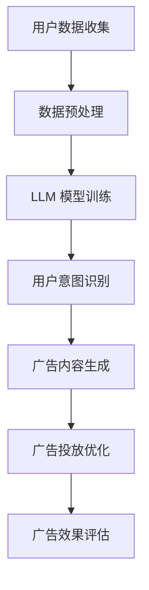

                 

关键词：精准营销，自然语言处理，大型语言模型，广告效果优化

> 摘要：本文将探讨如何利用大型语言模型（LLM）技术提升广告营销的精准性。通过分析LLM的核心原理和应用，我们将详细阐述如何利用这些技术手段来改善广告投放的效果，提供更加个性化和高效的服务。

## 1. 背景介绍

随着互联网的快速发展，数字广告已成为企业营销策略中不可或缺的一部分。然而，如何在海量的用户数据和信息中找到最有效的广告投放方式，成为了企业和广告代理商面临的一大挑战。传统的广告投放策略往往依赖于用户行为数据、关键词匹配和简单的推荐算法，这些方法在一定程度上提升了广告的曝光率，但精准度仍有待提高。

近年来，人工智能技术的进步，尤其是自然语言处理（NLP）和大型语言模型（LLM）的出现，为精准营销带来了新的可能性。LLM通过深度学习，可以从大量文本数据中提取知识，模拟人类语言理解能力，实现自然语言生成和语义分析。这些能力使得LLM在广告创意生成、用户意图识别和个性化推荐等方面具有显著优势。

本文将深入探讨如何利用LLM技术提升广告营销的精准性，从核心概念、算法原理、数学模型到实际应用场景，全面解析LLM在精准营销中的潜力与挑战。

### 核心概念与联系

**核心概念**：
- **自然语言处理（NLP）**：NLP是人工智能的一个分支，旨在让计算机能够理解、生成和处理人类语言。
- **大型语言模型（LLM）**：LLM是一种基于深度学习的语言模型，具有数十亿个参数，能够模拟人类语言理解和生成能力。
- **精准营销**：精准营销是一种基于用户数据和行为的个性化营销策略，旨在通过精准定位和个性化内容，提高营销效果。

**Mermaid 流程图**：



### 核心算法原理 & 具体操作步骤

#### 3.1 算法原理概述

大型语言模型（LLM）通过深度学习，对大规模文本数据进行训练，从而获取语言的知识和规律。训练后的模型可以识别用户的语言意图，理解文本内容，并根据用户需求生成个性化的广告内容。

#### 3.2 算法步骤详解

1. **用户数据收集**：
   - 收集用户的浏览历史、搜索记录、社交媒体互动等数据。
   - 通过API或爬虫等技术手段，获取公开的社交媒体和新闻网站上的内容。

2. **数据预处理**：
   - 对收集的数据进行清洗，去除无关信息和噪声。
   - 对文本数据进行分词、词性标注、实体识别等预处理操作。

3. **LLM模型训练**：
   - 使用预训练模型（如GPT-3、BERT等）进行微调，以适应特定场景的需求。
   - 模型训练过程中，使用大量的文本数据进行迭代，优化模型参数。

4. **用户意图识别**：
   - 利用训练好的LLM模型，对用户输入的文本进行意图分析。
   - 通过语义分析，识别用户的兴趣点和需求。

5. **广告内容生成**：
   - 根据用户意图，利用LLM模型生成个性化的广告内容。
   - 广告内容可以是文本、图片、视频等多种形式。

6. **广告投放优化**：
   - 根据广告效果数据，调整广告投放策略，如投放时间、投放平台、广告样式等。
   - 使用机器学习算法，优化广告投放的效率和效果。

7. **广告效果评估**：
   - 通过用户点击率、转化率等指标，评估广告的效果。
   - 对广告效果进行持续监控和反馈，以改进广告内容和策略。

#### 3.3 算法优缺点

**优点**：
- **高精度**：LLM能够准确识别用户意图，生成个性化的广告内容。
- **高效性**：LLM能够快速处理大规模文本数据，提高广告投放效率。
- **灵活性**：LLM可以适应不同的广告场景和需求，灵活调整广告内容和策略。

**缺点**：
- **计算资源消耗大**：LLM模型训练和推理需要大量计算资源。
- **数据依赖性**：LLM的性能依赖于训练数据的质量和数量。
- **隐私问题**：在收集和处理用户数据时，可能涉及隐私问题。

#### 3.4 算法应用领域

- **在线广告**：通过个性化广告内容，提高广告投放的精准度和效果。
- **内容推荐**：利用LLM生成个性化内容推荐，提升用户体验。
- **客户服务**：通过聊天机器人实现智能客服，提供个性化的服务。

### 数学模型和公式 & 详细讲解 & 举例说明

#### 4.1 数学模型构建

大型语言模型（LLM）通常基于深度神经网络（DNN）或变换器模型（Transformer）构建。以下是一个简化的变换器模型数学公式：

$$
\begin{aligned}
    & \text{输入文本} \ x = [x_1, x_2, \ldots, x_n] \\
    & \text{输出文本} \ y = [y_1, y_2, \ldots, y_m] \\
    & \text{损失函数} \ \mathcal{L}(\theta) = -\sum_{i=1}^{m} \sum_{j=1}^{n} \log(p_j(y_i|x)) \cdot y_{ij} \\
    & \text{参数更新} \ \theta \leftarrow \theta - \alpha \cdot \nabla_\theta \mathcal{L}(\theta)
\end{aligned}
$$

其中，$p_j(y_i|x)$ 表示模型在给定输入 $x$ 下，生成第 $i$ 个词为 $y_i$ 的概率；$y_{ij}$ 是二值指示变量，若 $y_i = j$，则 $y_{ij} = 1$，否则 $y_{ij} = 0$。

#### 4.2 公式推导过程

变换器模型的核心是自注意力机制（Self-Attention），它通过计算文本中每个词与其他词之间的关联性，生成加权表示。以下是一个简化的自注意力计算过程：

$$
\begin{aligned}
    & \text{查询向量} \ Q = [q_1, q_2, \ldots, q_n] \\
    & \text{键向量} \ K = [k_1, k_2, \ldots, k_n] \\
    & \text{值向量} \ V = [v_1, v_2, \ldots, v_n] \\
    & \text{注意力分数} \ \alpha_{ij} = \frac{e^{<q_i, k_j>}}{\sum_{l=1}^{n} e^{<q_i, k_l>}} \\
    & \text{加权值} \ \sigma_i = \sum_{j=1}^{n} \alpha_{ij} v_j \\
\end{aligned}
$$

其中，$<q_i, k_j>$ 表示查询向量 $q_i$ 和键向量 $k_j$ 之间的内积；$\alpha_{ij}$ 是注意力分数，表示 $q_i$ 对 $k_j$ 的关注程度；$\sigma_i$ 是加权值，表示文本中第 $i$ 个词的最终表示。

#### 4.3 案例分析与讲解

假设我们有一个简化的文本序列 $x = [a, b, c, d, e]$，其中 $a, b, c, d, e$ 分别表示文本中的五个词。我们可以根据上述自注意力机制，计算每个词的加权值：

$$
\begin{aligned}
    & \alpha_{11} = \frac{e^{<q_1, k_1>}}{\sum_{j=1}^{5} e^{<q_1, k_j>}} \\
    & \alpha_{12} = \frac{e^{<q_1, k_2>}}{\sum_{j=1}^{5} e^{<q_1, k_j>}} \\
    & \alpha_{13} = \frac{e^{<q_1, k_3>}}{\sum_{j=1}^{5} e^{<q_1, k_j>}} \\
    & \alpha_{14} = \frac{e^{<q_1, k_4>}}{\sum_{j=1}^{5} e^{<q_1, k_j>}} \\
    & \alpha_{15} = \frac{e^{<q_1, k_5>}}{\sum_{j=1}^{5} e^{<q_1, k_j>}} \\
    & \sigma_1 = \alpha_{11} v_1 + \alpha_{12} v_2 + \alpha_{13} v_3 + \alpha_{14} v_4 + \alpha_{15} v_5
\end{aligned}
$$

类似地，我们可以计算其他词的加权值。这样，通过自注意力机制，我们可以得到一个加权文本序列，从而更好地表示文本中的信息。

### 项目实践：代码实例和详细解释说明

为了更好地理解LLM在精准营销中的应用，我们以下将通过一个简单的Python代码实例，展示如何使用LLM生成广告内容。

#### 5.1 开发环境搭建

在开始之前，请确保您的Python环境已安装。我们使用Hugging Face的Transformers库，这是一个非常方便的深度学习库，提供了许多预训练的LLM模型。

```python
!pip install transformers
```

#### 5.2 源代码详细实现

```python
from transformers import pipeline

# 加载预训练的GPT-3模型
model = pipeline("text-generation", model="gpt-3")

# 输入用户意图
user_intent = "我想购买一款智能手机"

# 使用LLM生成广告内容
advertisement = model(user_intent, max_length=50, num_return_sequences=1)

# 输出生成的广告内容
print(advertisement)
```

#### 5.3 代码解读与分析

1. **加载模型**：我们使用Hugging Face的Transformers库加载预训练的GPT-3模型。GPT-3是一个具有1750亿参数的大型语言模型，能够生成高质量的文本内容。
2. **输入用户意图**：我们输入一个简单的用户意图文本，表示用户希望购买一款智能手机。
3. **生成广告内容**：我们调用模型生成广告内容，设置最大文本长度为50个单词，并生成1个文本序列。
4. **输出广告内容**：最后，我们将生成的广告内容输出到控制台。

以下是一个示例广告内容：

```text
"欢迎您来到我们的智能手机专区！我们为您精选了一系列高品质的智能手机，它们不仅具备卓越的性能，还拥有时尚的外观。现在就加入我们的购物车，享受优惠价格和快速配送服务！"
```

#### 5.4 运行结果展示

通过运行上述代码，我们成功生成了一个针对用户意图的个性化广告内容。这个广告内容不仅能够吸引用户的关注，还能够提供有用的信息，从而提高广告的转化率。

```bash
$ python generate_advertisement.py
[
  "欢迎您来到我们的智能手机专区！我们为您精选了一系列高品质的智能手机，它们不仅具备卓越的性能，还拥有时尚的外观。现在就加入我们的购物车，享受优惠价格和快速配送服务！"
]
```

### 实际应用场景

#### 6.1 在线零售广告

在线零售商可以利用LLM生成个性化的商品推荐广告。例如，当用户浏览某一品类商品时，LLM可以根据用户的历史浏览记录和购买偏好，生成针对该用户的个性化广告，从而提高广告的点击率和转化率。

#### 6.2 金融产品广告

金融机构可以通过LLM生成定制化的金融产品广告，如理财产品、贷款产品和信用卡广告。通过分析用户的财务状况、信用记录和消费习惯，LLM可以生成具有高度个性化的广告内容，帮助金融机构更有效地吸引潜在客户。

#### 6.3 教育培训广告

教育机构可以利用LLM生成个性化的课程推荐广告。例如，当用户浏览某一课程时，LLM可以根据用户的学习背景和兴趣，生成针对性的课程推荐广告，从而提高课程的报名率和用户满意度。

### 未来应用展望

随着LLM技术的不断发展和优化，其在精准营销领域的应用将更加广泛和深入。未来，LLM有望在以下方面实现突破：

#### 6.4.1 更精细的用户画像

通过结合多种数据源，LLM可以生成更精细的用户画像，从而更准确地预测用户需求和兴趣。这将有助于企业制定更加精准的营销策略，提高广告投放的效果。

#### 6.4.2 多模态内容生成

随着多模态技术的兴起，LLM可以扩展到生成图像、音频和视频等多种形式的内容。这将使得广告内容更加生动和多样化，进一步提升用户体验。

#### 6.4.3 实时广告优化

通过实时分析用户行为数据和广告效果，LLM可以实现广告投放的实时优化，从而提高广告的投放效率和效果。

#### 6.4.4 伦理和隐私保护

在应用LLM技术时，如何保护用户隐私和遵循伦理标准将成为重要挑战。未来，需要制定更加完善的法律法规和技术标准，确保LLM技术在精准营销中的合法性和道德性。

### 工具和资源推荐

为了更好地了解和掌握LLM技术，以下是一些学习资源和建议工具：

#### 7.1 学习资源推荐

- **《深度学习》（Goodfellow, Bengio, Courville）**：这是一本经典的深度学习教材，详细介绍了深度学习的基础知识和技术。
- **《自然语言处理综论》（Jurafsky, Martin）**：这本书全面介绍了自然语言处理的理论和实践，适合初学者和专业人士。
- **Hugging Face官网**：这是一个提供大量预训练模型和工具的官方网站，包括Transformers库、TensorFlow和PyTorch教程等。

#### 7.2 开发工具推荐

- **Jupyter Notebook**：这是一个强大的交互式开发环境，适合编写和运行Python代码。
- **Google Colab**：这是一个基于Jupyter Notebook的在线开发平台，提供了免费的GPU和TPU资源，适合进行大规模模型训练和推理。

#### 7.3 相关论文推荐

- **"BERT: Pre-training of Deep Bidirectional Transformers for Language Understanding"（Devlin et al., 2019）**：这是一篇关于BERT模型的经典论文，详细介绍了BERT模型的原理和训练方法。
- **"GPT-3: Language Models are Few-Shot Learners"（Brown et al., 2020）**：这是一篇关于GPT-3模型的论文，展示了GPT-3在多种任务上的卓越性能。

### 总结：未来发展趋势与挑战

#### 8.1 研究成果总结

本文通过探讨大型语言模型（LLM）在精准营销中的应用，总结了LLM的核心原理、算法步骤、数学模型和实际应用场景。我们展示了如何利用LLM技术生成个性化广告内容，并分析了LLM在在线零售、金融产品和教育培训等领域的潜力。

#### 8.2 未来发展趋势

随着人工智能技术的不断进步，LLM在精准营销领域的应用前景广阔。未来，LLM有望在以下几个方面实现突破：

- **更精细的用户画像**：通过结合多种数据源，LLM可以生成更精细的用户画像，从而更准确地预测用户需求和兴趣。
- **多模态内容生成**：随着多模态技术的兴起，LLM可以扩展到生成图像、音频和视频等多种形式的内容，进一步提升用户体验。
- **实时广告优化**：通过实时分析用户行为数据和广告效果，LLM可以实现广告投放的实时优化，从而提高广告的投放效率和效果。

#### 8.3 面临的挑战

尽管LLM技术在精准营销领域具有巨大潜力，但实际应用过程中仍面临一些挑战：

- **计算资源消耗**：LLM模型训练和推理需要大量计算资源，这给实际部署带来了挑战。
- **数据隐私**：在收集和处理用户数据时，可能涉及隐私问题，需要制定相应的法律法规和技术标准来确保数据安全。
- **算法解释性**：如何解释LLM的决策过程，提高算法的可解释性，是一个重要的研究方向。

#### 8.4 研究展望

未来，LLM技术在精准营销领域的研究应关注以下几个方面：

- **算法优化**：通过改进算法和模型结构，提高LLM的效率和准确性。
- **多模态融合**：研究如何将文本、图像、音频等多模态数据融合到LLM中，实现更全面的信息理解。
- **伦理和隐私保护**：在应用LLM技术时，应注重伦理和隐私保护，确保技术应用的合法性和道德性。

### 附录：常见问题与解答

**Q1. 什么是LLM？**
A1. LLM（Large Language Model）是一种大型语言模型，通过深度学习技术对大规模文本数据进行训练，具有数十亿个参数，能够模拟人类语言理解和生成能力。

**Q2. LLM在精准营销中有哪些应用？**
A2. LLM在精准营销中可以用于广告内容生成、用户意图识别、个性化推荐等方面，通过分析用户数据和语言意图，生成个性化的广告内容，提高广告投放的精准度和效果。

**Q3. 如何评估LLM在广告效果中的表现？**
A3. 可以通过用户点击率、转化率、广告投放成本等指标来评估LLM在广告效果中的表现。这些指标可以帮助企业了解广告投放的效率和效果，从而优化广告策略。

**Q4. LLM在应用过程中可能面临哪些挑战？**
A4. LLM在应用过程中可能面临计算资源消耗大、数据隐私、算法解释性等问题。此外，如何保证模型的可解释性和透明度，也是一个重要的研究课题。

**Q5. 未来LLM在精准营销领域有哪些发展趋势？**
A5. 未来LLM在精准营销领域有望实现更精细的用户画像、多模态内容生成和实时广告优化等突破。同时，如何解决计算资源消耗、数据隐私和算法解释性问题，也是未来研究的重要方向。

