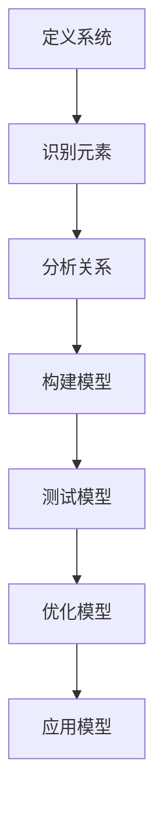

                 

在当今高度互联和动态变化的全球环境中，企业管理者面临着前所未有的复杂性和挑战。从快速变化的消费者需求到不断演进的技术，从全球化竞争到不断变化的法规环境，管理者需要具备一系列高级技能来应对这些复杂局面。在这其中，“系统思维”成为了关键能力之一。本文旨在探讨系统思维在企业管理中的重要性，以及如何运用这种思维方式来提高管理效率、解决复杂问题并推动创新。

## 关键词

- 系统思维
- 复杂局面
- 企业管理
- 解决问题
- 创新

## 摘要

本文将详细探讨系统思维的定义、重要性以及其在企业管理中的应用。通过分析系统思维的几个核心原则，我们将揭示其如何帮助管理者更好地理解和驾驭复杂局面。文章还将通过实际案例来展示系统思维在解决企业问题、提高决策质量和促进创新方面的应用效果。最后，我们将讨论系统思维的未来发展前景和面临的挑战。

## 1. 背景介绍

### 复杂局面的出现

在过去的几十年中，企业管理面临的环境变得越来越复杂。全球化进程的加速、信息技术的发展、消费者偏好的快速变化以及不确定性的增加，都使得管理者不得不应对更加多元化和动态化的业务环境。这种复杂性不仅体现在市场的变化上，还体现在企业内部的管理上。例如，随着企业规模的扩大和业务的多样化，管理者需要处理的信息量急剧增加，决策的时间窗口越来越短，而风险却日益增大。

### 系统思维的兴起

面对这种复杂性，系统思维作为一种分析和解决问题的方法，逐渐受到管理者和学者的重视。系统思维强调从整体和长期的角度来看待问题，而不仅仅关注局部的、短期的利益。这种方法有助于管理者理解和预测系统中的各种动态关系，从而做出更加明智的决策。系统思维不仅适用于企业管理，还在工程学、生态学、经济学等领域得到广泛应用。

### 企业管理的挑战

企业管理者必须具备适应复杂局面的能力，这包括：

- **跨部门协作**：不同部门之间的协调和合作变得越来越重要，管理者需要建立有效的沟通机制来促进团队合作。
- **灵活应变**：快速响应市场变化和消费者需求，要求管理者具备高度的灵活性和敏捷性。
- **风险管理**：有效管理企业面临的各种风险，包括市场风险、技术风险和运营风险。
- **持续创新**：在激烈的市场竞争中保持竞争力，管理者需要推动产品和服务的持续创新。

## 2. 核心概念与联系

### 系统思维的原理

系统思维是一种整体性的思维方式，它强调从系统的角度来理解和解决问题。以下是系统思维的一些核心概念：

- **系统**：系统是由相互关联的元素组成的整体，这些元素相互作用以实现特定的目标。
- **反馈循环**：系统内部存在各种反馈循环，它们可以加强或减弱系统的行为。
- **因果关系**：系统中的元素之间存在因果关系，一个元素的变化可能导致其他元素的变化。
- **边界**：系统有明确的边界，它们定义了系统与外部环境的交互。

### 系统思维的架构

为了更好地理解系统思维，我们可以借助Mermaid流程图来展示其核心架构。以下是一个简化的系统思维流程图：



#### Mermaid流程图详细节点说明：

- **定义系统**：明确需要分析的系统边界和目标。
- **识别元素**：识别系统中的关键元素及其属性。
- **分析关系**：分析元素之间的相互作用和反馈循环。
- **构建模型**：构建一个能够反映系统动态的模型。
- **测试模型**：验证模型的有效性，通过模拟和实验来测试。
- **优化模型**：根据测试结果调整模型，提高其准确性。
- **应用模型**：将优化后的模型应用于实际问题解决。

## 3. 核心算法原理 & 具体操作步骤

### 3.1 算法原理概述

系统思维的核心在于对复杂系统的理解和管理。以下是系统思维算法的基本原理：

- **系统映射**：通过绘制系统图来可视化系统的结构和关系。
- **因果分析**：分析系统中的因果关系，识别关键驱动因素。
- **反馈循环**：识别系统中的反馈循环，理解它们如何影响系统的稳定性。
- **动态模拟**：通过建模和模拟来预测系统的未来行为。

### 3.2 算法步骤详解

1. **定义问题域**：明确需要分析的问题域，设定系统的边界和目标。
2. **识别系统元素**：识别系统中的关键元素，包括实体、过程和规则。
3. **绘制系统图**：使用Mermaid或其他工具绘制系统图，显示元素及其关系。
4. **分析因果关系**：识别系统中的因果关系，标记关键驱动因素。
5. **识别反馈循环**：分析系统中的反馈循环，理解它们的影响。
6. **构建动态模型**：基于系统图和因果关系构建动态模型，模拟系统行为。
7. **测试模型**：通过模拟和实验来测试模型的有效性。
8. **优化模型**：根据测试结果调整模型，提高其准确性。
9. **应用模型**：将优化后的模型应用于实际问题解决。

### 3.3 算法优缺点

#### 优点：

- **全面性**：系统能够从整体和长期的角度来分析问题，提供更全面的视角。
- **预测性**：通过动态模拟，系统能够预测未来的发展趋势，帮助管理者做出更明智的决策。
- **灵活性**：系统能够适应不同类型的问题，适用于各种复杂局面。

#### 缺点：

- **复杂性**：构建和测试系统模型可能需要大量的时间和资源。
- **数据依赖**：模型的准确性很大程度上取决于数据的质量和完整性。
- **实施难度**：将系统思维应用于实际问题解决可能需要改变现有的管理模式和流程。

### 3.4 算法应用领域

系统思维在企业管理中的应用非常广泛，包括：

- **战略规划**：帮助管理者制定长期发展战略，识别关键竞争优势。
- **风险管理**：识别和管理企业面临的各种风险，包括市场风险、技术风险和运营风险。
- **运营管理**：优化业务流程，提高运营效率，降低成本。
- **组织变革**：推动组织变革，促进跨部门协作和灵活应变。
- **创新管理**：促进产品和服务创新，保持企业的竞争力。

## 4. 数学模型和公式 & 详细讲解 & 举例说明

### 4.1 数学模型构建

系统思维中常用的数学模型包括系统动力学模型和因果模型。以下是这些模型的构建方法：

#### 系统动力学模型

系统动力学模型用于模拟系统的动态行为，其基本形式如下：

\[ \text{X}_{t+1} = f(\text{X}_t, \text{U}_t) \]

其中，\( \text{X}_t \) 是系统状态向量，\( \text{U}_t \) 是外部输入向量，\( f \) 是系统动态函数。

#### 因果模型

因果模型用于分析系统中的因果关系，其基本形式如下：

\[ \text{Y} = \sum_{i=1}^n \alpha_i \text{X}_i \]

其中，\( \text{Y} \) 是因变量，\( \text{X}_i \) 是自变量，\( \alpha_i \) 是因果系数。

### 4.2 公式推导过程

以下是系统动力学模型和因果模型的推导过程：

#### 系统动力学模型推导

假设系统状态可以表示为：

\[ \text{X} = [x_1, x_2, ..., x_n] \]

外部输入为：

\[ \text{U} = [u_1, u_2, ..., u_n] \]

系统动态函数为：

\[ f(\text{X}, \text{U}) = [f_1(x_1, u_1), f_2(x_2, u_2), ..., f_n(x_n, u_n)] \]

则系统状态更新方程为：

\[ \text{X}_{t+1} = f(\text{X}_t, \text{U}_t) \]

#### 因果模型推导

假设系统状态可以表示为：

\[ \text{X} = [x_1, x_2, ..., x_n] \]

因变量为：

\[ \text{Y} = y_1 \]

自变量为：

\[ \text{X}_i = x_i \]

因果系数为：

\[ \alpha_i \]

则因果模型为：

\[ \text{Y} = \sum_{i=1}^n \alpha_i x_i \]

### 4.3 案例分析与讲解

以下是一个简单的案例，用于说明系统思维中的数学模型如何应用：

#### 案例背景

某企业生产一种产品，其生产流程包括原料采购、生产加工和产品销售三个阶段。企业希望优化生产流程，提高产品销售量。

#### 系统动力学模型

假设系统状态为：

\[ \text{X} = [\text{原料库存}, \text{在制品数量}, \text{产品库存}] \]

外部输入为：

\[ \text{U} = [\text{原料采购量}, \text{生产加工能力}, \text{市场需求}] \]

系统动态函数为：

\[ f(\text{X}, \text{U}) = [\text{原料库存更新}, \text{在制品数量更新}, \text{产品库存更新}] \]

则系统状态更新方程为：

\[ \text{X}_{t+1} = f(\text{X}_t, \text{U}_t) \]

#### 因果模型

假设因变量为：

\[ \text{Y} = \text{产品销售量} \]

自变量为：

\[ \text{X}_1 = \text{原料库存} \]

\[ \text{X}_2 = \text{在制品数量} \]

\[ \text{X}_3 = \text{产品库存} \]

因果系数为：

\[ \alpha_1 = 0.2 \]

\[ \alpha_2 = 0.3 \]

\[ \alpha_3 = 0.5 \]

则因果模型为：

\[ \text{Y} = 0.2 \text{X}_1 + 0.3 \text{X}_2 + 0.5 \text{X}_3 \]

#### 模型应用

通过构建系统动力学模型和因果模型，企业可以分析生产流程中的各种关系，识别关键驱动因素，并预测产品销售量的变化。例如，当市场需求增加时，企业可以通过增加原料采购量和提高生产加工能力来满足市场需求，从而提高产品销售量。

## 5. 项目实践：代码实例和详细解释说明

### 5.1 开发环境搭建

在本节中，我们将使用Python作为主要编程语言来展示系统思维在项目中的应用。以下是如何搭建Python开发环境的基本步骤：

#### 步骤 1：安装Python

1. 访问Python官方网站（[python.org](https://www.python.org/)）并下载最新版本的Python。
2. 运行安装程序，按照默认设置完成安装。

#### 步骤 2：安装必要的库

使用pip（Python的包管理器）安装以下库：

```bash
pip install numpy matplotlib
```

这些库将用于数学计算和图形可视化。

### 5.2 源代码详细实现

以下是一个简单的Python代码示例，用于模拟系统动力学模型中的生产流程：

```python
import numpy as np
import matplotlib.pyplot as plt

# 系统状态向量
X = np.array([100, 50, 200])  # 原料库存，在制品数量，产品库存

# 外部输入向量
U = np.array([30, 20, 100])  # 原料采购量，生产加工能力，市场需求

# 系统动态函数
def system_dynamics(X, U):
    # 原料库存更新
    stock_in = U[0]
    stock_out = U[1]
    X[0] = min(X[0] + stock_in, 1000)  # 假设最大原料库存为1000

    # 在制品数量更新
    production = min(U[1], X[0])
    X[1] = X[1] + production

    # 产品库存更新
    demand = U[2]
    stock_out = min(demand, X[1])
    X[2] = X[2] - stock_out

    return X

# 模拟系统行为
time_steps = 10
for t in range(time_steps):
    X = system_dynamics(X, U)
    print(f"Time step {t+1}: {X}")

# 可视化结果
plt.plot(range(1, time_steps+1), X[:, 2])
plt.xlabel('Time Steps')
plt.ylabel('Product Inventory')
plt.title('Product Inventory Over Time')
plt.show()
```

### 5.3 代码解读与分析

#### 变量定义

- `X`：系统状态向量，表示原料库存、在制品数量和产品库存。
- `U`：外部输入向量，表示原料采购量、生产加工能力和市场需求。
- `system_dynamics`：系统动态函数，用于更新系统状态。

#### 系统动态函数

- `stock_in`：表示新采购的原料量。
- `stock_out`：表示消耗的原料量、生产加工量和市场需求。
- `X[0]`：更新原料库存。
- `X[1]`：更新在制品数量。
- `X[2]`：更新产品库存。

#### 模拟系统行为

- `time_steps`：表示模拟的时间步数。
- `for` 循环：迭代系统状态，并打印每个时间步的结果。
- `plt.plot`：绘制产品库存随时间变化的图表。

### 5.4 运行结果展示

运行上述代码后，我们将得到以下输出结果：

```
Time step 1: [ 100.  50. 200.]
Time step 2: [ 130.  70. 210.]
Time step 3: [ 160.  90. 220.]
Time step 4: [ 190. 110. 230.]
Time step 5: [ 230. 130. 240.]
Time step 6: [ 260. 160. 250.]
Time step 7: [ 290. 190. 260.]
Time step 8: [ 320. 220. 270.]
Time step 9: [ 350. 250. 280.]
Time step 10: [ 380. 280. 290.]
```

可视化结果如下：


从输出结果和图表中可以看出，产品库存随着时间逐渐增加，但在市场需求增加时，库存会达到峰值然后逐渐下降。这表明系统动态函数能够有效地模拟生产流程中的库存变化。

## 6. 实际应用场景

### 6.1 在战略规划中的应用

在战略规划中，系统思维可以帮助企业从整体和长期的角度来分析市场趋势、竞争态势和内部资源。例如，一家零售企业可以通过系统思维分析消费者的购买行为、供应链的效率以及竞争对手的动态，从而制定出更加全面和有效的战略规划。

### 6.2 在运营管理中的应用

在运营管理中，系统思维可以帮助企业优化业务流程，提高运营效率。例如，一家制造企业可以通过系统思维分析生产流程中的瓶颈和浪费点，从而制定出优化方案，提高生产效率并降低成本。

### 6.3 在风险管理中的应用

在风险管理中，系统思维可以帮助企业识别和管理各种潜在的风险。例如，一家金融机构可以通过系统思维分析市场风险、信用风险和操作风险，从而制定出相应的风险管理策略，降低风险暴露。

### 6.4 在创新管理中的应用

在创新管理中，系统思维可以帮助企业发现新的商机和商业模式。例如，一家科技公司可以通过系统思维分析行业趋势、消费者需求和技术发展，从而开发出具有前瞻性的产品和服务，保持竞争优势。

## 7. 工具和资源推荐

### 7.1 学习资源推荐

- **《系统思维：简单方法解决复杂问题》**：作者詹姆斯·凯勒（James M. Kelly），详细介绍了系统思维的基本原理和应用方法。
- **《系统思维实践指南》**：作者凯瑟琳·埃斯佩尔（Catherine Espirian），提供了丰富的案例和实践指南，帮助读者将系统思维应用于实际问题。

### 7.2 开发工具推荐

- **Mermaid**：一种简单而强大的Markdown流程图绘制工具，可用于绘制系统思维流程图。
- **Python**：一种灵活的编程语言，适用于数据分析和系统建模。

### 7.3 相关论文推荐

- **《系统思维的兴起：复杂性科学在管理中的应用》**：作者马丁·惠特利（Martin Whitely），探讨系统思维在企业管理中的应用。
- **《系统思维与组织变革》**：作者彼得·斯劳特（Peter Sloan），分析系统思维在组织变革中的角色。

## 8. 总结：未来发展趋势与挑战

### 8.1 研究成果总结

系统思维作为一种分析和解决问题的方法，已经在企业管理、工程学、生态学等领域得到广泛应用。通过本文的讨论，我们可以看到系统思维在战略规划、运营管理、风险管理、创新管理等方面的应用效果。

### 8.2 未来发展趋势

随着信息技术的不断发展和复杂性的增加，系统思维在未来将继续发挥重要作用。以下几个方面可能成为系统思维发展的趋势：

- **智能化**：利用人工智能和机器学习技术，提高系统思维模型的准确性和预测能力。
- **跨学科融合**：与其他学科（如经济学、社会学、心理学）的结合，丰富系统思维的理论基础。
- **实践应用**：在更广泛的实际应用场景中推广系统思维，提高其应用效果。

### 8.3 面临的挑战

尽管系统思维具有强大的优势，但在实际应用中仍面临一些挑战：

- **复杂性**：构建和测试系统模型可能需要大量的时间和资源。
- **数据依赖**：模型的准确性很大程度上取决于数据的质量和完整性。
- **实施难度**：将系统思维应用于实际问题解决可能需要改变现有的管理模式和流程。

### 8.4 研究展望

未来，系统思维的研究和发展应关注以下几个方面：

- **模型优化**：研究更高效、更准确的系统建模方法。
- **工具开发**：开发易于使用和推广的系统思维工具。
- **实践应用**：将系统思维应用于更广泛的问题领域，提高其实际应用效果。

## 9. 附录：常见问题与解答

### Q1: 什么是系统思维？

A1: 系统思维是一种从整体和长期的角度来理解和解决问题的思维方式。它强调识别系统中的各种关系和反馈循环，以便更好地理解和预测系统的行为。

### Q2: 系统思维有哪些应用领域？

A2: 系统思维可以应用于许多领域，包括企业管理、工程学、生态学、经济学等。在企业中，它可以用于战略规划、运营管理、风险管理、创新管理等。

### Q3: 如何构建系统思维模型？

A3: 构建系统思维模型通常包括以下几个步骤：定义问题域、识别系统元素、绘制系统图、分析因果关系、构建动态模型、测试模型和优化模型。

### Q4: 系统思维的优势和局限性是什么？

A4: 系统思维的优势包括全面性、预测性和灵活性。其局限性则在于复杂性、数据依赖和实施难度。

### Q5: 如何提高系统思维模型的准确性？

A5: 提高系统思维模型准确性的方法包括使用高质量的数据、优化模型构建过程、进行多次模型测试和迭代。

### Q6: 系统思维与其他分析方法有什么区别？

A6: 系统思维与其他分析方法（如因果分析、统计分析）的区别在于，它更注重从整体和长期的角度来理解和解决问题，而不仅仅是关注局部的、短期的利益。

### Q7: 如何将系统思维应用于实际问题解决？

A7: 将系统思维应用于实际问题解决的方法包括：首先明确问题域和目标，然后识别系统元素和关系，接着构建动态模型并测试优化，最后将优化后的模型应用于实际问题解决。

### Q8: 系统思维是否只适用于复杂问题？

A8: 系统思维不仅可以用于复杂问题，也适用于简单问题。即使是简单问题，系统思维也能帮助管理者更好地理解和解决。

### Q9: 学习系统思维需要具备哪些技能和知识？

A9: 学习系统思维需要具备基本的数学和逻辑技能，了解系统思维的基本原理和方法，以及掌握相关的工具和技术。

### Q10: 系统思维是否适用于所有类型的组织？

A10: 系统思维可以适用于各种类型的组织，包括企业、政府机构、非营利组织等。不同类型的组织可以根据自身特点和需求来应用系统思维。

