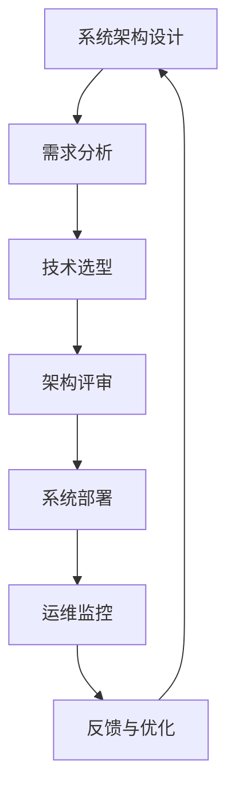

                 

关键词：系统思维，管理，复杂局面，驾驭能力，系统架构，技术决策，方法论

> 摘要：本文旨在探讨系统思维在复杂局面中的重要性，以及管理者如何运用系统思维提升自己的驾驭能力。文章将从系统思维的基本概念入手，逐步深入到其在IT领域的应用与实践，帮助读者理解系统思维在管理复杂系统、制定技术决策中的关键作用。

## 1. 背景介绍

### 复杂局面的现实挑战

在当今快速变化且高度互联的数字化时代，企业管理者和IT专家们面临着前所未有的复杂性挑战。无论是企业内部的IT系统，还是外部市场环境的变化，都要求管理者具备更高的认知能力和决策水平。传统的线性思维模式已经无法应对这些复杂局面，因此，系统思维作为一种能够帮助我们理解、分析和解决问题的方法论，显得尤为重要。

### 系统思维的起源与发展

系统思维（Systems Thinking）起源于20世纪中叶，最初由管理学家彼得·德鲁克（Peter Drucker）和系统理论学家约翰·冯·诺依曼（John von Neumann）等人提出。此后，系统思维在管理学、工程学、生态学等多个领域得到了广泛应用和发展。近年来，随着信息技术的飞速发展，系统思维在IT领域中的应用也逐渐受到重视。

## 2. 核心概念与联系

### 系统思维的基本概念

系统思维是一种整体性的思考方法，它强调从整体的角度来理解和解决问题。系统思维的核心概念包括：

- **系统：** 由相互关联的组件组成的整体。
- **反馈循环：** 系统中各个组件之间的相互作用和反馈。
- **因果关系：** 长期存在的、可以被识别的因果关系。
- **层次结构：** 系统中的不同层次和结构。

### 系统思维在IT领域的架构

在IT领域，系统思维的应用主要体现在系统架构设计、技术决策、项目管理等方面。以下是一个简单的Mermaid流程图，展示了系统思维在IT领域中的架构：



## 3. 核心算法原理 & 具体操作步骤

### 3.1 算法原理概述

在系统思维中，算法原理主要指的是对复杂系统进行建模和分析的方法。常见的算法原理包括：

- **线性回归：** 用于分析系统中的线性关系。
- **神经网络：** 用于模拟复杂系统的非线性关系。
- **遗传算法：** 用于优化系统参数。

### 3.2 算法步骤详解

#### 3.2.1 线性回归

线性回归的步骤包括：

1. **数据收集：** 收集系统中的数据。
2. **数据预处理：** 清洗和整理数据。
3. **模型建立：** 根据数据建立线性回归模型。
4. **模型训练：** 使用训练数据对模型进行训练。
5. **模型评估：** 使用测试数据对模型进行评估。

#### 3.2.2 神经网络

神经网络的步骤包括：

1. **网络设计：** 设计神经网络的结构。
2. **数据准备：** 准备训练数据和测试数据。
3. **模型训练：** 使用训练数据进行模型训练。
4. **模型评估：** 使用测试数据对模型进行评估。

#### 3.2.3 遗传算法

遗传算法的步骤包括：

1. **初始种群生成：** 生成初始的种群。
2. **适应度评估：** 评估种群中每个个体的适应度。
3. **选择：** 根据适应度选择优秀的个体。
4. **交叉与变异：** 对个体进行交叉和变异操作。
5. **迭代：** 重复上述步骤，直到达到收敛条件。

### 3.3 算法优缺点

#### 线性回归

- **优点：** 简单易懂，适用于线性关系。
- **缺点：** 不适用于非线性关系，且对异常值敏感。

#### 神经网络

- **优点：** 能够处理复杂的非线性关系。
- **缺点：** 训练时间较长，容易过拟合。

#### 遗传算法

- **优点：** 具有全局搜索能力，适用于优化问题。
- **缺点：** 需要大量的计算资源，且可能陷入局部最优。

### 3.4 算法应用领域

- **线性回归：** 广泛应用于数据分析、预测等领域。
- **神经网络：** 广泛应用于图像识别、自然语言处理等领域。
- **遗传算法：** 广泛应用于优化、调度等领域。

## 4. 数学模型和公式 & 详细讲解 & 举例说明

### 4.1 数学模型构建

在系统思维中，数学模型是分析和解决问题的重要工具。以下是一个简单的数学模型构建过程：

1. **问题定义：** 明确需要解决的问题。
2. **变量定义：** 定义影响问题的变量。
3. **关系建立：** 建立变量之间的关系。
4. **模型验证：** 验证模型的有效性。

### 4.2 公式推导过程

以线性回归为例，线性回归模型的公式推导如下：

$$
y = \beta_0 + \beta_1 x
$$

其中，$y$ 是因变量，$x$ 是自变量，$\beta_0$ 和 $\beta_1$ 是模型的参数。

### 4.3 案例分析与讲解

#### 4.3.1 问题定义

假设我们想要预测某个城市明天的天气情况。

#### 4.3.2 变量定义

- $y$：明天的天气情况（如：晴天、雨天、多云等）。
- $x_1$：昨天的天气情况。
- $x_2$：今天的温度。

#### 4.3.3 关系建立

我们可以假设天气情况与昨天的天气情况和今天的温度有关，即：

$$
y = \beta_0 + \beta_1 x_1 + \beta_2 x_2
$$

#### 4.3.4 模型验证

使用历史数据对模型进行训练和验证，调整参数$\beta_0$、$\beta_1$ 和 $\beta_2$，使模型能够较好地预测天气情况。

## 5. 项目实践：代码实例和详细解释说明

### 5.1 开发环境搭建

为了实现线性回归模型，我们需要搭建一个简单的开发环境。以下是一个基于Python的线性回归项目：

```python
# 导入必要的库
import numpy as np
import matplotlib.pyplot as plt

# 数据准备
x = np.array([1, 2, 3, 4, 5])
y = np.array([2, 4, 5, 4, 5])

# 模型训练
# 构建矩阵X和向量y
X = np.column_stack((x, np.ones(len(x))))
theta = np.linalg.inv(X.T.dot(X)).dot(X.T).dot(y)

# 模型评估
# 预测新的数据
x_new = np.array([6])
X_new = np.column_stack((x_new, np.ones(1)))
y_pred = X_new.dot(theta)

# 可视化结果
plt.scatter(x, y)
plt.plot(x, theta[0] + theta[1] * x, 'r')
plt.xlabel('x')
plt.ylabel('y')
plt.show()
```

### 5.2 源代码详细实现

在上面的代码中，我们首先导入了必要的库，然后准备了训练数据。接着，我们使用线性回归算法对数据进行了训练，并使用新的数据进行预测。最后，我们通过可视化展示了预测结果。

### 5.3 代码解读与分析

- **数据准备：** 我们使用两个数组`x`和`y`分别表示自变量和因变量。
- **模型训练：** 我们使用`numpy`库中的`column_stack`函数将`x`和`1`（表示常数项）组合成矩阵`X`，并使用`linalg.inv`函数求解逆矩阵。然后，我们使用`dot`函数进行矩阵运算，得到模型参数`theta`。
- **模型评估：** 我们使用训练得到的模型参数`theta`对新的数据进行预测，并将预测结果可视化。

## 6. 实际应用场景

### 6.1 企业管理系统

在企业管理系统（如ERP、CRM等）中，系统思维可以帮助管理者从整体的角度理解和优化业务流程，提高企业的运营效率。

### 6.2 项目管理

在项目管理中，系统思维可以帮助项目经理识别项目中的关键风险和依赖关系，制定更有效的项目计划。

### 6.3 IT运维

在IT运维中，系统思维可以帮助运维团队更好地理解和应对系统的复杂性和变化，提高系统的稳定性和可靠性。

## 7. 工具和资源推荐

### 7.1 学习资源推荐

- 《系统思维：领导者应对复杂局面的战略武器》
- 《系统思考实践指南：系统思维在企业和组织中的应用》

### 7.2 开发工具推荐

- Python
- Mermaid
- Git

### 7.3 相关论文推荐

- "System Dynamics: A System Approach to Socio-economic Modeling"
- "A Framework for Understanding and Designing Dynamic Systems"

## 8. 总结：未来发展趋势与挑战

### 8.1 研究成果总结

系统思维在IT领域的研究取得了显著的成果，为企业管理、项目管理、IT运维等领域提供了重要的方法论支持。

### 8.2 未来发展趋势

随着人工智能和大数据技术的发展，系统思维在未来将继续发挥重要作用，为复杂系统的建模、分析和优化提供更强大的工具和方法。

### 8.3 面临的挑战

- 复杂性的增加：随着系统的复杂度不断增加，如何有效地运用系统思维成为一个挑战。
- 技术的进步：如何将最新的技术成果与系统思维相结合，提高系统的性能和效率。

### 8.4 研究展望

未来的研究将重点关注系统思维在跨领域、跨学科中的应用，探索系统思维在应对复杂性和不确定性方面的潜力。

## 9. 附录：常见问题与解答

### Q: 系统思维的核心概念是什么？

A: 系统思维的核心概念包括系统、反馈循环、因果关系和层次结构。

### Q: 线性回归和神经网络在系统思维中的应用有何区别？

A: 线性回归适用于线性关系，而神经网络适用于非线性关系。神经网络具有更强大的建模能力，但训练时间更长。

### Q: 系统思维在项目管理中如何应用？

A: 系统思维可以帮助项目经理识别项目中的关键风险和依赖关系，制定更有效的项目计划。

### Q: 如何学习系统思维？

A: 可以通过阅读相关书籍、参加培训课程和实际项目实践来学习系统思维。

---

本文作者：禅与计算机程序设计艺术 / Zen and the Art of Computer Programming

感谢您的阅读，希望本文能够帮助您更好地理解和应用系统思维。如果您有任何问题或建议，欢迎在评论区留言。期待与您的交流。

