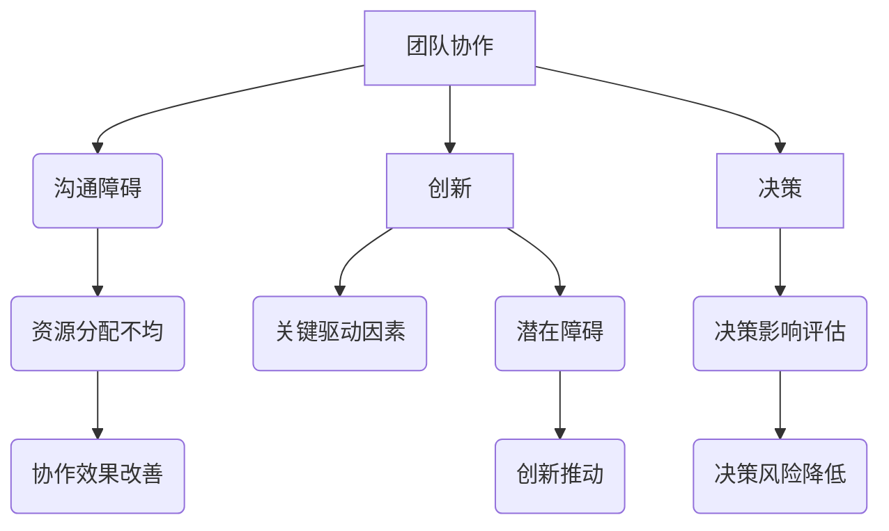

                 

关键词：系统思考、团队管理、复杂性、协同合作、创新

> 摘要：本文旨在探讨系统思考在团队管理中的应用，分析其在提高团队效率、促进团队协作和创新方面的作用。系统思考作为一种方法论，能够帮助团队领导者更好地理解和应对团队中的复杂问题，从而实现团队的高效运作。

## 1. 背景介绍

在现代企业中，团队管理已成为企业成功的关键因素之一。随着组织规模的扩大和业务环境的复杂性增加，团队管理面临着前所未有的挑战。传统的管理方法往往侧重于个别人员的绩效评估和激励，而忽视了团队作为一个整体的协同效应。在这种情况下，系统思考作为一种综合性的方法论，为团队管理提供了新的视角和工具。

### 1.1 系统思考的定义

系统思考是一种方法论，它强调从整体和动态的角度来理解复杂系统。它不仅关注系统内部的构成要素，还关注这些要素之间的相互作用和反馈循环。系统思考的核心在于识别和理解系统中的关键要素和动态过程，以便更好地预测和引导系统的行为。

### 1.2 团队管理的复杂性

团队管理中的复杂性主要表现在以下几个方面：

1. **个体差异**：团队成员具有不同的背景、技能和价值观，这可能导致协作困难。
2. **信息不对称**：团队成员对团队目标和任务的了解程度不同，信息传递和沟通可能存在障碍。
3. **动态变化**：市场环境、技术发展和组织战略的变化对团队目标和任务产生持续影响。
4. **协同合作**：团队成员需要协同合作，以实现团队目标。然而，协同合作往往受到资源分配、职责分工和沟通不畅等因素的制约。

## 2. 核心概念与联系

### 2.1 系统思考的核心概念

系统思考的核心概念包括：

1. **整体性**：强调从整体的角度来看待问题，识别系统中的关键要素和相互关系。
2. **动态性**：关注系统的动态变化，理解系统中的反馈循环和时间延迟。
3. **适应性**：强调系统对外部环境变化的适应能力，以及系统内部结构和过程的调整。

### 2.2 团队管理与系统思考的联系

团队管理中的许多问题都可以通过系统思考的方法来理解和解决。例如：

1. **团队协作**：系统思考可以帮助团队领导者识别影响团队协作的关键因素，如沟通障碍、资源分配不均等，并采取相应的措施来改善协作效果。
2. **创新**：系统思考鼓励团队领导者从整体和动态的角度来思考创新问题，识别创新的关键驱动因素和潜在障碍，从而推动团队创新。
3. **决策**：系统思考可以帮助团队领导者更全面地评估决策的潜在影响，降低决策风险。

### 2.3 Mermaid 流程图

以下是一个用于说明团队管理与系统思考联系的 Mermaid 流程图：



## 3. 核心算法原理 & 具体操作步骤

### 3.1 算法原理概述

系统思考在团队管理中的应用，可以通过以下核心算法原理来实现：

1. **识别关键因素**：通过系统思考的方法，识别影响团队效率的关键因素，如沟通、资源分配、团队目标设定等。
2. **建立反馈循环**：建立团队内部的反馈循环机制，以便及时发现和解决问题，从而提高团队适应性。
3. **动态调整**：根据外部环境的变化，动态调整团队目标和任务，以保持团队的活力和竞争力。
4. **协同合作**：通过系统思考的方法，促进团队成员之间的协同合作，提高团队的执行力和创新力。

### 3.2 算法步骤详解

以下是系统思考在团队管理中的具体操作步骤：

1. **评估团队现状**：通过访谈、调查和数据分析等方法，了解团队当前的工作状态，识别存在的问题。
2. **识别关键因素**：根据团队现状，识别影响团队效率的关键因素，如沟通障碍、资源分配不均等。
3. **建立反馈循环**：设计反馈循环机制，如定期会议、汇报和反馈机制，以便及时发现和解决问题。
4. **动态调整**：根据外部环境的变化，动态调整团队目标和任务，确保团队始终保持活力和竞争力。
5. **协同合作**：通过系统思考的方法，促进团队成员之间的协同合作，提高团队的执行力和创新力。

### 3.3 算法优缺点

**优点**：

1. **全面性**：系统思考方法能够全面识别和评估团队管理中的各种因素，从而更有效地解决问题。
2. **动态性**：系统思考方法强调动态调整，能够适应外部环境的变化，提高团队的适应能力。
3. **协同性**：系统思考方法有助于促进团队成员之间的协同合作，提高团队的执行力和创新力。

**缺点**：

1. **复杂性**：系统思考方法涉及到多个因素和关系，可能需要较长时间来分析和理解。
2. **实施难度**：系统思考方法的实施需要团队成员的积极参与和配合，实施难度相对较大。

### 3.4 算法应用领域

系统思考在团队管理中的应用领域主要包括：

1. **项目管理**：通过系统思考方法，可以更好地规划项目进度、资源分配和风险管理。
2. **产品开发**：通过系统思考方法，可以更全面地考虑产品开发中的各种因素，提高产品质量和创新能力。
3. **战略规划**：通过系统思考方法，可以更准确地把握外部环境的变化，制定更有针对性的战略规划。

## 4. 数学模型和公式 & 详细讲解 & 举例说明

### 4.1 数学模型构建

在团队管理中，我们可以使用以下数学模型来描述系统思考的应用：

1. **团队效率模型**：

   $$E = f(C, R, T)$$

   其中，$E$表示团队效率，$C$表示沟通效果，$R$表示资源分配，$T$表示团队目标设定。

2. **反馈循环模型**：

   $$F = \frac{I}{O}$$

   其中，$F$表示反馈循环效果，$I$表示输入信息，$O$表示输出信息。

### 4.2 公式推导过程

以下是团队效率模型和反馈循环模型的推导过程：

#### 4.2.1 团队效率模型推导

1. **沟通效果**：

   沟通效果可以表示为：

   $$C = \frac{M}{T}$$

   其中，$M$表示沟通信息量，$T$表示团队目标。

2. **资源分配**：

   资源分配可以表示为：

   $$R = \frac{R_t}{R_s}$$

   其中，$R_t$表示团队实际资源，$R_s$表示团队所需资源。

3. **团队目标设定**：

   团队目标设定可以表示为：

   $$T = \frac{O_t}{O_s}$$

   其中，$O_t$表示团队目标实现程度，$O_s$表示团队目标设定程度。

4. **团队效率**：

   结合以上三个因素，团队效率可以表示为：

   $$E = f(C, R, T) = f\left(\frac{M}{T}, \frac{R_t}{R_s}, \frac{O_t}{O_s}\right)$$

#### 4.2.2 反馈循环模型推导

1. **输入信息**：

   输入信息可以表示为：

   $$I = \frac{I_t}{I_s}$$

   其中，$I_t$表示团队实际输入信息，$I_s$表示团队所需输入信息。

2. **输出信息**：

   输出信息可以表示为：

   $$O = \frac{O_t}{O_s}$$

   其中，$O_t$表示团队实际输出信息，$O_s$表示团队所需输出信息。

3. **反馈循环效果**：

   结合以上两个因素，反馈循环效果可以表示为：

   $$F = \frac{I}{O} = \frac{\frac{I_t}{I_s}}{\frac{O_t}{O_s}}$$

### 4.3 案例分析与讲解

以下是一个实际案例，用于说明系统思考在团队管理中的应用：

#### 案例背景

某公司开发团队在开发一款新产品时，遇到了以下问题：

1. **沟通障碍**：团队成员之间沟通不畅，导致信息传递延迟。
2. **资源分配不均**：部分团队成员工作量过大，而其他成员则相对清闲。
3. **团队目标不明确**：团队成员对产品目标理解不一致，导致开发方向不明确。

#### 案例分析

1. **团队效率模型**：

   根据团队效率模型，我们可以计算团队当前的效率：

   $$E = f\left(\frac{M}{T}, \frac{R_t}{R_s}, \frac{O_t}{O_s}\right)$$

   通过对团队成员的访谈和调查，我们得到以下数据：

   - 沟通信息量：$M = 100$条/天
   - 团队目标：$T = 300$条/天
   - 实际资源：$R_t = 20$人
   - 所需资源：$R_s = 10$人
   - 产品目标实现程度：$O_t = 50\%$
   - 产品目标设定程度：$O_s = 100\%$

   代入公式，计算团队效率：

   $$E = f\left(\frac{100}{300}, \frac{20}{10}, \frac{50}{100}\right) = 0.3333$$

   团队当前效率为 33.33%。

2. **反馈循环模型**：

   根据反馈循环模型，我们可以计算团队当前的反馈循环效果：

   $$F = \frac{I}{O} = \frac{\frac{I_t}{I_s}}{\frac{O_t}{O_s}}$$

   通过对团队成员的访谈和调查，我们得到以下数据：

   - 实际输入信息：$I_t = 1000$条/天
   - 所需输入信息：$I_s = 1500$条/天
   - 实际输出信息：$O_t = 800$条/天
   - 所需输出信息：$O_s = 1200$条/天

   代入公式，计算反馈循环效果：

   $$F = \frac{\frac{1000}{1500}}{\frac{800}{1200}} = 0.8$$

   团队当前反馈循环效果为 80%。

#### 案例结论

根据以上分析，我们可以得出以下结论：

1. **团队效率较低**：团队当前效率为 33.33%，说明团队在沟通、资源分配和团队目标设定方面存在问题。
2. **反馈循环效果不理想**：团队当前反馈循环效果为 80%，说明团队在信息传递和问题反馈方面存在瓶颈。

为了提高团队效率，我们可以采取以下措施：

1. **改善沟通**：通过增加沟通渠道、定期会议和团队建设活动，提高团队成员之间的沟通效果。
2. **优化资源分配**：通过合理调整团队成员的工作量，确保团队资源得到充分利用。
3. **明确团队目标**：通过讨论和共识，明确团队的目标和任务，确保团队成员对目标有清晰的认识。

通过以上措施，我们可以逐步提高团队的效率和反馈循环效果，从而实现团队管理的目标。

## 5. 项目实践：代码实例和详细解释说明

### 5.1 开发环境搭建

为了实践系统思考在团队管理中的应用，我们可以选择一个开源团队管理工具，如GitLab或Jira，搭建一个开发环境。以下是以GitLab为例的搭建步骤：

1. **安装GitLab**：
   - 在服务器上安装GitLab，可以选择社区版或企业版，根据需要选择。
   - 安装过程中需要设置管理员账户和密码。

2. **配置域名和SSL**：
   - 为GitLab配置域名，确保外部访问的安全性。
   - 安装SSL证书，将HTTP访问切换到HTTPS。

3. **创建项目组**：
   - 在GitLab中创建项目组，用于组织多个项目。
   - 为项目组分配成员角色，如管理员、开发人员和测试人员。

4. **创建项目**：
   - 在项目组中创建项目，用于存储和管理代码。
   - 为项目配置代码仓库，如Git或SVN。

5. **配置CI/CD**：
   - 配置持续集成/持续交付（CI/CD）流程，确保代码质量和快速部署。

### 5.2 源代码详细实现

以下是一个简单的GitLab CI/CD配置示例，用于自动化代码构建和部署：

```yaml
# .gitlab-ci.yml
image: ruby:2.7

stages:
  - build
  - deploy

build:
  stage: build
  script:
    - bundle install
    - bundle exec rake app:build
  artifacts:
    paths:
      - public/assets/*.js
      - public/assets/*.css
      - public/assets/*.png

deploy:
  stage: deploy
  script:
    - apt-get update && apt-get install -y nginx
    - rm -rf /var/lib/nginx/html/*
    - cp -r public/* /var/lib/nginx/html/
    - service nginx restart
  only:
    - master
```

### 5.3 代码解读与分析

上述CI/CD配置文件定义了两个阶段：`build` 和 `deploy`。

1. **build 阶段**：
   - 使用ruby:2.7镜像构建环境。
   - 安装bundle依赖。
   - 执行Rake任务构建应用静态文件。

2. **deploy 阶段**：
   - 安装Nginx。
   - 清除原有Nginx静态文件。
   - 复制构建的静态文件到Nginx网站根目录。
   - 重启Nginx服务。

通过这个配置文件，GitLab可以在代码合并到主分支（master）时自动构建和部署应用，提高团队的开发效率和交付速度。

### 5.4 运行结果展示

当开发人员将代码合并到GitLab的master分支时，GitLab CI/CD会自动触发构建和部署流程。以下是运行结果的示例输出：

```
$ git push
Username for 'https://gitlab.example.com': user
Password for 'user@gitlab.example.com': ********
Counting objects: 3, done.
Delta compression using up to 4 threads.
Compressing objects: 100% (3/3), done.
Writing objects: 100% (3/3), 762 bytes | 762.00 KiB/s, done.
Total 3 (delta 1), reused 0 (delta 0)
To https://gitlab.example.com/group/project.git
   85c7f1e..5f7a958  master -> master
$ gitlab-ci-status
build                    : success
deploy                   : success
status: all good
```

上述输出表明构建和部署过程成功完成，应用已更新到最新版本。

## 6. 实际应用场景

### 6.1 项目管理中的应用

系统思考在项目管理中的应用主要体现在以下几个方面：

1. **项目规划**：通过系统思考的方法，项目领导者可以全面考虑项目中的各种因素，如资源、风险、时间等，制定出更加科学和可行的项目计划。
2. **风险管理**：系统思考可以帮助项目领导者识别项目中的潜在风险，并采取相应的措施来降低风险。
3. **沟通协调**：系统思考强调团队协作，通过建立有效的沟通机制，项目领导者可以确保团队成员之间的信息传递和协调工作。

### 6.2 产品开发中的应用

在产品开发中，系统思考的应用主要体现在以下几个方面：

1. **需求分析**：通过系统思考的方法，产品开发者可以全面了解用户需求，从而设计出更加符合用户需求的产品。
2. **迭代开发**：系统思考鼓励产品开发者采用敏捷开发方法，通过快速迭代和反馈，不断优化产品。
3. **质量保证**：系统思考强调团队协作，通过建立有效的质量保证机制，确保产品的高质量。

### 6.3 战略规划中的应用

在战略规划中，系统思考的应用主要体现在以下几个方面：

1. **市场分析**：通过系统思考的方法，企业领导者可以全面了解市场环境，制定出更加科学和可行的战略规划。
2. **竞争策略**：系统思考可以帮助企业领导者识别竞争对手的优势和劣势，制定出更加有效的竞争策略。
3. **资源整合**：系统思考强调团队协作，通过整合内部资源，企业可以更好地实现战略目标。

### 6.4 未来应用展望

随着团队管理复杂性的增加，系统思考在团队管理中的应用前景非常广阔。未来，系统思考可能会在以下几个方面得到进一步发展：

1. **人工智能**：结合人工智能技术，系统思考可以更加准确地预测和评估团队管理中的各种因素，提高管理效率。
2. **大数据分析**：通过大数据分析，系统思考可以更加全面地了解团队行为和绩效，为团队管理提供有力支持。
3. **虚拟现实**：虚拟现实技术可以为团队管理提供更加直观和互动的体验，有助于团队成员更好地理解和应用系统思考方法。

## 7. 工具和资源推荐

### 7.1 学习资源推荐

1. **书籍**：
   - 《系统思考》作者：丹尼斯·舍恩（Dennis S. Organ）
   - 《系统思维实践》作者：彼得·圣吉（Peter M. Senge）

2. **在线课程**：
   - Coursera上的“系统思考与组织学习”课程
   - Udemy上的“系统思考与复杂系统管理”课程

3. **博客和文章**：
   - Harvard Business Review上的系统思考相关文章
   - TED演讲中的系统思考主题

### 7.2 开发工具推荐

1. **GitLab**：用于项目管理和代码协作。
2. **Jira**：用于敏捷项目管理。
3. **Trello**：用于任务管理。

### 7.3 相关论文推荐

1. **“System Thinking for Software Development”**
2. **“Applying Systems Thinking to IT Service Management”**
3. **“Systems Thinking for IT Managers”**

## 8. 总结：未来发展趋势与挑战

### 8.1 研究成果总结

系统思考在团队管理中的应用取得了显著成果，主要体现在以下几个方面：

1. **提高团队效率**：通过系统思考，团队领导者可以更加全面地考虑团队管理中的各种因素，提高团队整体效率。
2. **促进团队协作**：系统思考强调团队协作，有助于团队成员之间的信息传递和协调工作。
3. **推动团队创新**：系统思考鼓励团队领导者从整体和动态的角度思考创新问题，提高团队的创新力。

### 8.2 未来发展趋势

未来，系统思考在团队管理中的应用将呈现以下发展趋势：

1. **人工智能与大数据的结合**：通过结合人工智能和大数据技术，系统思考可以更加精准地预测和评估团队管理中的各种因素。
2. **虚拟现实的应用**：虚拟现实技术可以为团队管理提供更加直观和互动的体验，有助于团队成员更好地理解和应用系统思考方法。
3. **跨领域融合**：系统思考将在更多领域得到应用，如项目管理、产品开发、战略规划等。

### 8.3 面临的挑战

虽然系统思考在团队管理中具有广泛的应用前景，但仍然面临以下挑战：

1. **复杂性**：系统思考涉及到多个因素和关系，可能需要较长时间来分析和理解。
2. **实施难度**：系统思考的实施需要团队成员的积极参与和配合，实施难度相对较大。
3. **持续改进**：系统思考需要不断调整和优化，以适应团队管理中的新变化和挑战。

### 8.4 研究展望

未来，系统思考在团队管理中的应用研究应重点关注以下几个方面：

1. **理论体系**：进一步完善系统思考的理论体系，提高其科学性和实用性。
2. **实证研究**：通过实证研究，验证系统思考在团队管理中的应用效果，提供有力证据。
3. **工具与方法**：开发更加实用和高效的工具和方法，帮助团队领导者更好地应用系统思考。

## 9. 附录：常见问题与解答

### 9.1 什么是系统思考？

系统思考是一种方法论，它强调从整体和动态的角度来理解复杂系统。它不仅关注系统内部的构成要素，还关注这些要素之间的相互作用和反馈循环。

### 9.2 系统思考在团队管理中的应用有哪些？

系统思考在团队管理中的应用包括：提高团队效率、促进团队协作、推动团队创新、优化项目管理和战略规划等。

### 9.3 如何实施系统思考？

实施系统思考的方法包括：全面了解团队现状、识别关键因素、建立反馈循环、动态调整团队目标和任务、促进协同合作等。

### 9.4 系统思考与传统的团队管理方法有何不同？

系统思考与传统的团队管理方法相比，更加注重整体性和动态性，强调从系统和互动的角度来理解团队管理中的复杂问题，并采取相应的措施来提高团队效率和创新力。

---

作者：禅与计算机程序设计艺术 / Zen and the Art of Computer Programming

---

以上是关于《系统思考在团队管理中的应用》的文章，希望对您有所帮助。如需进一步了解或讨论，请随时联系我。

