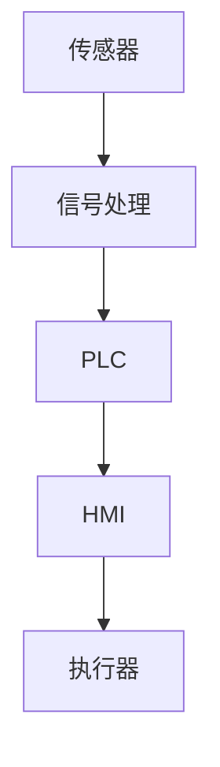

                 

关键词：纺织机械、自动化、历史变迁、技术进步、产业升级

> 摘要：本文旨在探讨纺织机械自动化的历史变迁，分析其技术进步和产业升级的过程，并展望未来纺织机械自动化的发展趋势和面临的挑战。

## 1. 背景介绍

纺织工业作为全球经济的重要支柱之一，拥有悠久的历史。然而，随着科技的不断进步，传统手工纺织业逐渐向机械化、自动化方向转变。纺织机械的自动化不仅提高了生产效率，降低了成本，还改善了劳动条件，推动了整个产业的升级。

### 1.1 纺织机械自动化的必要性

首先，随着人口红利的消失，劳动力成本逐年上升，传统手工纺织业逐渐失去了竞争优势。因此，自动化成为降低成本、提高效率的必要手段。其次，自动化可以减少人为操作的误差，提高产品的质量和一致性。此外，自动化还可以实现24小时不间断生产，极大地提升了生产效率。

### 1.2 纺织机械自动化的历史背景

回顾纺织机械自动化的历史，我们可以看到几个重要的节点。首先是18世纪末的工业革命，蒸汽机的发明使得纺织机械开始出现机械化趋势。然后是20世纪中叶，电子技术的兴起推动了自动化技术的发展。再到21世纪，计算机和物联网技术的应用使得纺织机械自动化进入了一个全新的阶段。

## 2. 核心概念与联系

### 2.1 纺织机械自动化的核心概念

纺织机械自动化涉及多个核心概念，包括传感器、执行器、PLC（可编程逻辑控制器）、HMI（人机界面）等。这些概念相互联系，共同构成了自动化系统的基本框架。

### 2.2 纺织机械自动化的架构

为了更好地理解纺织机械自动化的架构，我们可以使用Mermaid流程图进行说明。



在这个流程图中，传感器负责采集生产过程中的各种数据，经过信号处理后由PLC进行处理，最终通过HMI显示给操作人员，并控制执行器进行相应的操作。

## 3. 核心算法原理 & 具体操作步骤

### 3.1 算法原理概述

纺织机械自动化的核心算法包括控制算法、数据处理算法和优化算法等。控制算法主要用于调节生产过程的参数，如温度、湿度等，以保证产品质量。数据处理算法则用于对采集到的数据进行分析和处理，以优化生产过程。优化算法则通过对生产过程的各种参数进行优化，以提高生产效率和降低成本。

### 3.2 算法步骤详解

1. **控制算法步骤：**
   - 收集生产过程中的数据。
   - 对数据进行滤波和预处理。
   - 根据预设的参数和模型，计算控制输出。
   - 控制执行器进行相应的操作。

2. **数据处理算法步骤：**
   - 对采集到的数据进行分析。
   - 根据分析结果，调整生产过程的参数。
   - 对新的数据进行分析，形成闭环控制。

3. **优化算法步骤：**
   - 建立生产过程的数学模型。
   - 使用优化算法，如遗传算法、模拟退火算法等，对模型进行优化。
   - 根据优化结果，调整生产过程的各种参数。

### 3.3 算法优缺点

1. **控制算法：**
   - 优点：可以精确控制生产过程，提高产品质量。
   - 缺点：对算法的依赖较高，调试和维护成本较高。

2. **数据处理算法：**
   - 优点：可以提高生产效率，降低成本。
   - 缺点：对数据质量要求较高，可能存在误判。

3. **优化算法：**
   - 优点：可以优化生产过程，提高效率。
   - 缺点：优化过程可能需要较长时间。

### 3.4 算法应用领域

纺织机械自动化的算法广泛应用于纺织生产过程的各个领域，如纺纱、织造、染色等。通过算法的应用，不仅提高了生产效率，还降低了成本，提高了产品质量。

## 4. 数学模型和公式 & 详细讲解 & 举例说明

### 4.1 数学模型构建

纺织机械自动化的数学模型主要包括控制模型、数据模型和优化模型。其中，控制模型主要用于描述生产过程中的控制策略，数据模型主要用于描述生产过程中的数据特征，优化模型则用于优化生产过程的各种参数。

### 4.2 公式推导过程

控制模型的公式推导过程如下：

$$
u(t) = K_p e(t) + K_i \int e(t) dt + K_d \frac{de(t)}{dt}
$$

其中，$u(t)$为控制输出，$e(t)$为误差，$K_p$、$K_i$、$K_d$分别为比例、积分、微分系数。

### 4.3 案例分析与讲解

以下是一个纺纱过程的控制案例：

假设纺纱过程中的温度需要控制在$20^\circ$C，当前温度为$22^\circ$C，温度误差为$e(t) = 2^\circ$C。使用上述控制公式进行调节，可以得到：

$$
u(t) = K_p \times 2 + K_i \times \int 2 dt + K_d \frac{d(2)}{dt}
$$

通过调试，可以得到合适的控制参数$K_p$、$K_i$、$K_d$，使温度能够快速稳定在$20^\circ$C。

## 5. 项目实践：代码实例和详细解释说明

### 5.1 开发环境搭建

在开发纺织机械自动化的项目中，我们需要搭建相应的开发环境。以下是搭建过程：

1. 安装编程软件，如Visual Studio Code。
2. 安装PLC编程软件，如Siemens TIA Portal。
3. 安装数据库软件，如MySQL。

### 5.2 源代码详细实现

以下是一个简单的PLC控制程序的源代码示例：

```plc
// 初始化
VAR
  temperature: REAL;
  setpoint: REAL;
  error: REAL;
  Kp: REAL := 1;
  Ki: REAL := 0;
  Kd: REAL := 0;
END_VAR

// 主循环
PROGRAM Main
  WHILE TRUE DO
    // 读取温度传感器数据
    temperature := ReadTemperatureSensor();
    
    // 设置目标温度
    setpoint := 20;
    
    // 计算误差
    error := setpoint - temperature;
    
    // 计算控制输出
    control_output := Kp * error + Ki * error * TicksSinceLastCall + Kd * (error - previous_error) / TicksSinceLastCall;
    
    // 控制加热器
    ControlHeater(control_output);
    
    // 更新上一次的误差
    previous_error := error;
    
    // 延时
    Wait(1000);
  END_WHILE
END_PROGRAM
```

### 5.3 代码解读与分析

该代码首先定义了温度传感器、目标温度、误差以及控制参数。然后在主循环中，读取温度传感器数据，计算误差，并使用PID控制公式计算控制输出，最后控制加热器进行调节。

### 5.4 运行结果展示

通过运行该程序，我们可以看到温度传感器数据的变化，以及加热器的工作状态。当温度高于目标温度时，加热器会减少加热功率，反之则会增加加热功率，从而实现温度的稳定控制。

## 6. 实际应用场景

纺织机械自动化在纺织生产过程中有着广泛的应用。例如，在纺纱过程中，自动化系统可以实时监测纺纱质量，并根据监测结果自动调整纺纱参数，如速度、张力等。在织造过程中，自动化系统可以自动检测织物质量，并调整织机的工作状态，以确保织物的质量。此外，自动化系统还可以用于染色、印花等环节，提高生产效率，降低成本。

### 6.1 纺纱过程的自动化

在纺纱过程中，自动化系统可以实时监测纺纱质量，如纤维长度、质量等，并根据监测结果自动调整纺纱参数。这样可以确保纺纱质量的一致性，提高生产效率。

### 6.2 织造过程的自动化

在织造过程中，自动化系统可以自动检测织物质量，如经纬密度、图案准确性等，并根据检测结果调整织机的运行状态。这样可以提高织物的质量，减少废品率。

### 6.3 染色、印花过程的自动化

在染色、印花过程中，自动化系统可以实时监测染料、印花墨水的使用量，并根据检测结果调整染料、墨水的供给量，从而确保染色、印花效果的一致性，提高生产效率。

## 7. 工具和资源推荐

### 7.1 学习资源推荐

1. 《PLC编程技术》
2. 《自动化控制系统原理与应用》
3. 《现代纺织机械自动化技术》

### 7.2 开发工具推荐

1. Siemens TIA Portal
2. Visual Studio Code
3. MySQL

### 7.3 相关论文推荐

1. "PLC技术在纺织机械自动化中的应用"
2. "纺织机械自动化系统的设计与应用"
3. "基于物联网的纺织机械自动化系统研究"

## 8. 总结：未来发展趋势与挑战

### 8.1 研究成果总结

近年来，纺织机械自动化取得了显著的研究成果，包括控制算法的优化、数据处理算法的提升、优化算法的应用等。这些成果为纺织机械自动化的进一步发展奠定了基础。

### 8.2 未来发展趋势

未来，纺织机械自动化将继续向智能化、数字化、网络化方向发展。具体表现为：

1. 智能化：利用人工智能、大数据等技术，实现更精准的生产控制和预测。
2. 数字化：通过物联网、云计算等技术，实现生产数据的实时监测和分析。
3. 网络化：通过工业互联网，实现设备之间的互联互通，提高生产协同效率。

### 8.3 面临的挑战

1. 技术挑战：如何进一步提高自动化系统的稳定性和可靠性，如何解决复杂生产过程的多变量控制问题。
2. 成本挑战：如何降低自动化系统的成本，使中小企业也能享受到自动化带来的红利。
3. 人才挑战：如何培养更多的自动化技术人才，以应对快速发展的市场需求。

### 8.4 研究展望

未来，纺织机械自动化将在以下方面取得突破：

1. 控制算法的优化：结合人工智能、机器学习等技术，实现更精准、更智能的控制。
2. 数据处理算法的提升：通过大数据分析，实现生产过程的数据挖掘和预测。
3. 网络化协同生产：通过工业互联网，实现设备之间的互联互通，实现生产过程的协同优化。

## 9. 附录：常见问题与解答

### 9.1 纺织机械自动化有哪些优点？

1. 提高生产效率：自动化系统可以实时监测生产过程，自动调整参数，提高生产效率。
2. 降低成本：自动化系统可以减少人工操作，降低人工成本。
3. 提高产品质量：自动化系统可以确保生产过程的一致性，提高产品质量。

### 9.2 纺织机械自动化有哪些缺点？

1. 初始投资较大：自动化系统的建设和维护需要较高的成本。
2. 对技术人才的需求较高：自动化系统的操作和维护需要专业人才。

### 9.3 纺织机械自动化有哪些应用领域？

1. 纺纱：自动化系统可以实时监测纺纱质量，调整纺纱参数。
2. 织造：自动化系统可以自动检测织物质量，调整织机运行状态。
3. 染色、印花：自动化系统可以实时监测染料、墨水的使用量，调整供给量。

### 9.4 纺织机械自动化的未来发展趋势是什么？

未来，纺织机械自动化将向智能化、数字化、网络化方向发展，通过人工智能、大数据、物联网等技术，实现生产过程的精准控制、实时监测和协同优化。
----------------------------------------------------------------

### 作者署名

作者：禅与计算机程序设计艺术 / Zen and the Art of Computer Programming

