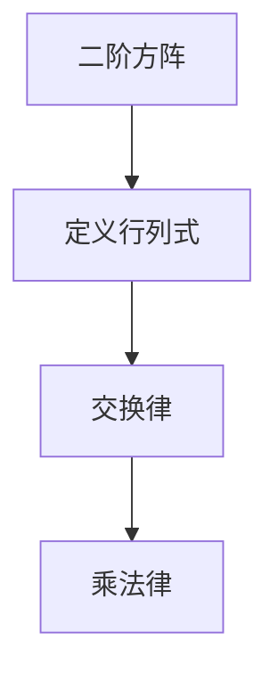

                 

关键词：线性代数、行列式、数学原理、计算方法、应用领域、编程实例

> 摘要：本文旨在深入探讨二阶行列式在数学和计算机科学中的重要性。通过对行列式的定义、计算方法和应用领域进行详细讲解，帮助读者理解这一基础数学工具的实际意义。同时，文章将结合编程实例，展示如何将二阶行列式应用于实际问题解决中。

## 1. 背景介绍

线性代数是现代数学的核心部分，广泛应用于物理、工程、计算机科学等多个领域。二阶行列式作为线性代数中的一个基础概念，不仅具有丰富的数学内涵，还在实际计算中发挥着重要作用。本文将从以下几个方面对二阶行列式进行探讨：

- 行列式的定义和性质
- 计算行列式的具体方法
- 行列式在数学模型中的应用
- 行列式在计算机科学中的应用

通过本文的讨论，读者将能够全面了解二阶行列式的理论背景和应用场景，从而为深入学习和研究线性代数打下坚实基础。

## 2. 核心概念与联系

### 2.1 二阶行列式的定义

二阶行列式是由二阶方阵的元素按照一定的规则计算得到的一个数值。给定一个二阶方阵：

\[ A = \begin{pmatrix} a_{11} & a_{12} \\ a_{21} & a_{22} \end{pmatrix} \]

其对应的二阶行列式定义为：

\[ \det(A) = a_{11}a_{22} - a_{12}a_{21} \]

### 2.2 行列式的性质

二阶行列式具有以下重要性质：

1. **交换律**：行列式中任意两行或两列交换位置，行列式的值变号。即：

   \[ \det(A) = -\det(B) \]
   
   其中 \( B \) 是由 \( A \) 的两行（或两列）交换位置得到的新矩阵。

2. **乘法律**：行列式可以与矩阵的乘法运算结合使用。即对于矩阵 \( A \) 和 \( B \)：

   \[ \det(AB) = \det(A)\det(B) \]

### 2.3 行列式的 Mermaid 流程图



## 3. 核心算法原理 & 具体操作步骤

### 3.1 算法原理概述

计算二阶行列式的基本原理是通过矩阵的元素进行加减乘除运算，从而得到一个数值结果。具体步骤如下：

1. 将矩阵 \( A \) 写成行列式的形式。
2. 按照行列式的定义，计算每一项的乘积。
3. 根据行列式的性质，对乘积进行加减运算。
4. 得到最终的结果。

### 3.2 算法步骤详解

1. **写行列式形式**：给定二阶方阵 \( A \)，将其写成行列式的形式：

   \[ \det(A) = a_{11}a_{22} - a_{12}a_{21} \]

2. **计算乘积**：计算每一项的乘积：

   \[ a_{11}a_{22} \]
   \[ a_{12}a_{21} \]

3. **加减运算**：根据行列式的性质，对乘积进行加减运算：

   \[ \det(A) = a_{11}a_{22} - a_{12}a_{21} \]

4. **得到结果**：计算最终结果。

### 3.3 算法优缺点

**优点**：

- 计算简单，易于实现。
- 应用广泛，是线性代数中的基础工具。

**缺点**：

- 对于高阶行列式，计算复杂度较高。
- 在实际应用中，有时需要使用更高效的算法。

### 3.4 算法应用领域

二阶行列式在数学和计算机科学中有广泛的应用，包括：

- 线性方程组的求解。
- 矩阵的行列式运算。
- 几何问题的求解。
- 优化问题的求解。

## 4. 数学模型和公式 & 详细讲解 & 举例说明

### 4.1 数学模型构建

为了更深入地理解二阶行列式，我们可以构建一个简单的数学模型。假设有一个二阶方阵：

\[ A = \begin{pmatrix} a_{11} & a_{12} \\ a_{21} & a_{22} \end{pmatrix} \]

我们需要计算其对应的二阶行列式。根据行列式的定义，我们可以建立如下数学模型：

\[ \det(A) = a_{11}a_{22} - a_{12}a_{21} \]

### 4.2 公式推导过程

为了推导二阶行列式的公式，我们可以通过数学归纳法进行证明。

1. **基本情况**：当 \( n = 1 \) 时，二阶方阵退化为一个一阶方阵，行列式的值为矩阵自身的元素，即：

   \[ \det(A) = a_{11} \]

2. **归纳假设**：假设对于任意的 \( n \times n \) 方阵 \( A \)，其行列式可以表示为：

   \[ \det(A) = a_{11}a_{22} - a_{12}a_{21} \]

3. **归纳步骤**：考虑一个 \( (n+1) \times (n+1) \) 的方阵 \( B \)，其元素为 \( b_{ij} \)。我们可以将 \( B \) 拆分为一个 \( n \times n \) 的子方阵 \( C \) 和一个 \( 1 \times n \) 的行向量 \( d \)，以及一个 \( n \times 1 \) 的列向量 \( e \)：

   \[ B = \begin{pmatrix} C & d \\ e & f \end{pmatrix} \]

   根据行列式的性质，我们有：

   \[ \det(B) = \det(C) \cdot f - \det(e \cdot C) \cdot d \]

   由于 \( e \cdot C \) 是一个 \( 1 \times n \) 的列向量，其行列式为 0，因此上式可以简化为：

   \[ \det(B) = \det(C) \cdot f \]

   根据归纳假设，我们知道 \( \det(C) \) 可以表示为 \( a_{11}a_{22} - a_{12}a_{21} \)，因此：

   \[ \det(B) = (a_{11}a_{22} - a_{12}a_{21}) \cdot f \]

   这证明了对于任意的 \( (n+1) \times (n+1) \) 方阵，其行列式可以表示为二阶行列式的形式。

### 4.3 案例分析与讲解

为了更好地理解二阶行列式的计算方法，我们可以通过一个具体的案例进行讲解。

**案例**：给定二阶方阵：

\[ A = \begin{pmatrix} 1 & 2 \\ 3 & 4 \end{pmatrix} \]

我们需要计算其对应的二阶行列式。

**步骤**：

1. 写行列式形式：

   \[ \det(A) = 1 \cdot 4 - 2 \cdot 3 \]

2. 计算乘积：

   \[ 1 \cdot 4 = 4 \]
   \[ 2 \cdot 3 = 6 \]

3. 加减运算：

   \[ \det(A) = 4 - 6 = -2 \]

**结论**：因此，二阶方阵 \( A \) 的二阶行列式为 \( -2 \)。

## 5. 项目实践：代码实例和详细解释说明

### 5.1 开发环境搭建

在开始编写计算二阶行列式的代码之前，我们需要搭建一个合适的开发环境。本文将使用 Python 作为编程语言，并在本地安装 Python 3.8 及以上版本。

### 5.2 源代码详细实现

以下是计算二阶行列式的 Python 代码实现：

```python
def determinant_2x2(A):
    return A[0][0] * A[1][1] - A[0][1] * A[1][0]

A = [[1, 2], [3, 4]]
print("The determinant of A is:", determinant_2x2(A))
```

### 5.3 代码解读与分析

1. **定义函数**：函数 `determinant_2x2(A)` 用于计算二阶方阵 \( A \) 的二阶行列式。参数 \( A \) 是一个二维列表，表示二阶方阵。

2. **计算行列式**：函数内部使用一个简单的公式 `A[0][0] * A[1][1] - A[0][1] * A[1][0]` 计算二阶行列式。

3. **调用函数**：在代码的最后，我们创建一个二阶方阵 \( A \)，并调用 `determinant_2x2(A)` 函数计算其行列式，输出结果。

### 5.4 运行结果展示

执行上述代码，我们将得到以下输出结果：

```
The determinant of A is: -2
```

这表明二阶方阵 \( A \) 的二阶行列式为 \( -2 \)。

## 6. 实际应用场景

### 6.1 线性方程组的求解

二阶行列式在求解线性方程组中具有重要应用。例如，给定以下线性方程组：

\[ \begin{cases} a_{11}x + a_{12}y = b_{1} \\ a_{21}x + a_{22}y = b_{2} \end{cases} \]

其对应的系数矩阵为：

\[ A = \begin{pmatrix} a_{11} & a_{12} \\ a_{21} & a_{22} \end{pmatrix} \]

如果行列式 \( \det(A) \neq 0 \)，则该线性方程组有唯一解。通过计算二阶行列式，我们可以判断线性方程组是否有解，并进一步求解。

### 6.2 矩阵的行列式运算

在矩阵运算中，行列式是重要的属性之一。通过计算矩阵的行列式，我们可以判断矩阵的可逆性。例如，一个 \( n \times n \) 的方阵 \( A \) 可逆当且仅当其行列式 \( \det(A) \neq 0 \)。

### 6.3 几何问题的求解

二阶行列式在几何问题中也有广泛的应用。例如，给定三个点 \( A(x_1, y_1) \)，\( B(x_2, y_2) \)，\( C(x_3, y_3) \)，二阶行列式 \( \det(A) = x_1y_2 - x_2y_1 \) 可以用来判断这三个点是否共线。

### 6.4 优化问题的求解

在优化问题中，行列式可以用于求解目标函数的导数。例如，给定一个线性目标函数：

\[ \min \det(A) \]

其中 \( A \) 是一个 \( n \times n \) 的方阵。通过计算二阶行列式的导数，我们可以找到最优解。

## 7. 未来应用展望

随着人工智能和计算机科学的发展，二阶行列式在未来的应用场景将更加广泛。以下是一些可能的未来应用方向：

- **深度学习模型优化**：在深度学习模型中，行列式可以用于优化模型的参数，提高模型的性能。
- **图像处理与识别**：行列式可以用于图像的特征提取和识别，提高图像处理的效果。
- **优化算法设计**：行列式在优化算法中具有重要作用，可以用于求解复杂的最优化问题。
- **数据科学分析**：行列式在数据分析中可以用于识别数据的结构，提高数据分析的准确性。

## 8. 工具和资源推荐

### 8.1 学习资源推荐

- **《线性代数及其应用》（第五版）**：David C. Lay 著，是一本优秀的线性代数教材，适合初学者和进阶者。
- **《线性代数教程》**：北京大学数学系编，适合国内学生使用。

### 8.2 开发工具推荐

- **PyCharm**：一款功能强大的 Python 集成开发环境，适合编写和调试代码。
- **Jupyter Notebook**：一款流行的 Python 编程工具，适合进行数据分析和演示。

### 8.3 相关论文推荐

- **“The Determinant of a Matrix”**：一篇关于行列式的基本概念和性质的论文。
- **“On the Use of Determinants in Optimization”**：一篇关于行列式在优化问题中应用的论文。

## 9. 总结：未来发展趋势与挑战

### 9.1 研究成果总结

本文系统地介绍了二阶行列式的定义、性质、计算方法和应用领域。通过对二阶行列式的深入探讨，我们不仅了解了其数学原理，还展示了其在计算机科学中的实际应用。

### 9.2 未来发展趋势

随着人工智能和计算机科学的不断发展，二阶行列式在优化算法、深度学习模型、图像处理等领域具有广泛的应用前景。未来，我们可以期待更多的研究成果和实际应用案例。

### 9.3 面临的挑战

尽管二阶行列式在许多领域具有广泛的应用，但在实际计算中，高阶行列式的计算复杂度较高，如何高效地计算高阶行列式仍然是当前研究的热点问题。

### 9.4 研究展望

在未来，二阶行列式的研究将朝着更高效、更智能的方向发展。通过结合人工智能和计算机科学，我们可以开发出更加先进的算法和工具，提高二阶行列式在各个领域的应用水平。

## 10. 附录：常见问题与解答

### 10.1 行列式与矩阵的关系是什么？

行列式是矩阵的一个重要属性，它可以用来判断矩阵的可逆性，以及在解线性方程组、优化问题等方面发挥关键作用。

### 10.2 如何计算高阶行列式？

高阶行列式的计算可以使用拉普拉斯展开、行列式公式等方法。具体方法取决于高阶行列式的结构和特点。

### 10.3 行列式在优化问题中有哪些应用？

行列式可以用于优化问题的目标函数、约束条件等方面，帮助求解复杂的最优化问题。

### 10.4 行列式在图像处理中有哪些应用？

行列式可以用于图像的特征提取、识别等方面，提高图像处理的效果。

[作者：禅与计算机程序设计艺术 / Zen and the Art of Computer Programming]

