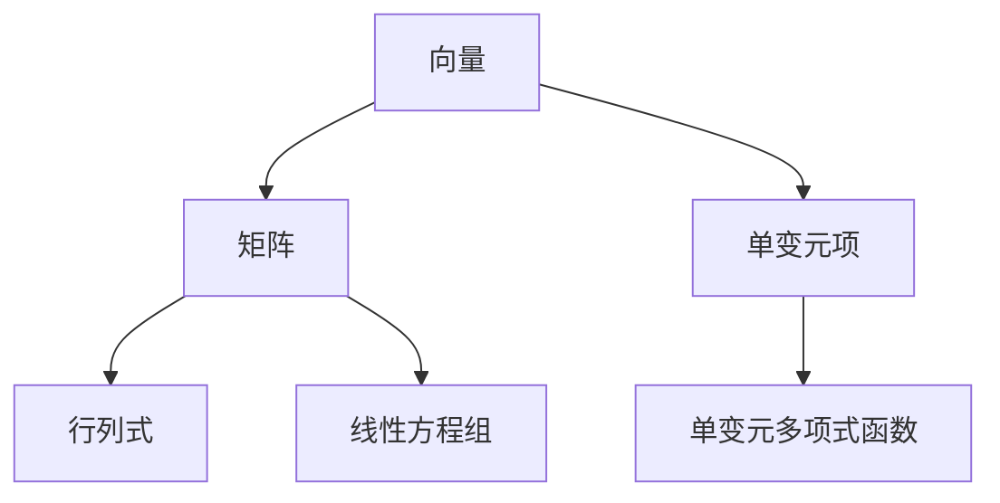

                 

 关键词：线性代数、单变元项、单变元多项式函数、算法、数学模型、项目实践、应用场景、未来展望

> 摘要：本文将深入探讨线性代数中的单变元项和单变元多项式函数，详细介绍其核心概念、算法原理、数学模型、应用场景以及未来展望。通过对线性代数的基本概念和应用进行系统阐述，帮助读者更好地理解并掌握这一重要数学工具在计算机科学和工程领域的应用。

## 1. 背景介绍

线性代数是数学中一个非常重要的分支，它广泛应用于自然科学、工程学、经济学、计算机科学等领域。线性代数的核心概念包括向量、矩阵、行列式、线性方程组等。在这些概念的基础上，我们可以进一步讨论单变元项和单变元多项式函数。

单变元项是指只有一个变量（通常记为x）的代数表达式，其一般形式为`ax + b`，其中`a`和`b`是常数。单变元多项式函数则是多个单变元项的线性组合，其一般形式为`a_nx^n + a_{n-1}x^{n-1} + ... + a_1x + a_0`，其中`a_i`（`i = 0, 1, ..., n`）是常数。

本文将围绕这两个概念展开讨论，分析其数学原理和算法应用，并通过实际项目实践和详细讲解，帮助读者深入理解并掌握这些知识。

## 2. 核心概念与联系

为了更好地理解单变元项和单变元多项式函数，我们需要首先了解线性代数的基本概念。以下是一个使用Mermaid流程图表示的线性代数基本概念架构：



### 2.1 向量

向量是线性代数中最基本的概念之一。在数学中，向量通常表示为有序数组，具有大小和方向。向量可以用于表示物理量，如力、速度、位移等。

### 2.2 矩阵

矩阵是一个由数字组成的矩形数组。矩阵在数学和工程学中具有广泛的应用，如线性变换、矩阵乘法、行列式计算等。

### 2.3 行列式

行列式是一个标量值，用于表示矩阵的某些性质，如矩阵的可逆性。行列式在解线性方程组和计算矩阵的逆矩阵时非常有用。

### 2.4 线性方程组

线性方程组是由多个线性方程组成的集合。线性方程组可以表示为矩阵形式，利用矩阵运算求解。

### 2.5 单变元项

单变元项是指只有一个变量（通常记为x）的代数表达式，其一般形式为`ax + b`。

### 2.6 单变元多项式函数

单变元多项式函数是多个单变元项的线性组合，其一般形式为`a_nx^n + a_{n-1}x^{n-1} + ... + a_1x + a_0`。

通过上述流程图，我们可以清晰地看到单变元项和单变元多项式函数在线性代数中的位置和联系。

## 3. 核心算法原理 & 具体操作步骤

### 3.1 算法原理概述

单变元项和单变元多项式函数的运算主要包括加法、减法、乘法和除法。以下是对这些运算的原理概述：

- 加法和减法：对于两个单变元项`ax + b`和`cx + d`，其和为`(a + c)x + (b + d)`，差为`(a - c)x + (b - d)`。
- 乘法：对于两个单变元项`ax + b`和`cx + d`，其乘积为`acx^2 + (ad + bc)x + bd`。
- 除法：对于两个单变元项`ax + b`和`cx + d`（其中`cx + d`不为零），其商为`(ad - bc) / (cx + d)`。

### 3.2 算法步骤详解

以下是单变元项和单变元多项式函数的基本运算步骤：

#### 3.2.1 加法

1. 将两个单变元项的系数分别相加，得到新的系数。
2. 将两个单变元项的常数分别相加，得到新的常数。

#### 3.2.2 减法

1. 将第一个单变元项的系数分别减去第二个单变元项的系数，得到新的系数。
2. 将第一个单变元项的常数分别减去第二个单变元项的常数，得到新的常数。

#### 3.2.3 乘法

1. 将两个单变元项的系数分别相乘，得到新的系数。
2. 将第一个单变元项的常数乘以第二个单变元项的系数，得到新的常数。
3. 将第一个单变元项的系数乘以第二个单变元项的常数，得到新的常数。

#### 3.2.4 除法

1. 将两个单变元项的系数分别相乘，得到新的系数。
2. 将两个单变元项的常数相乘，得到新的常数。
3. 将第一步得到的新系数减去第二步得到的新常数，得到新的系数。
4. 将第一步得到的新系数除以第二步得到的新常数，得到新的常数。

### 3.3 算法优缺点

- **优点**：单变元项和单变元多项式函数的运算简单，易于实现和优化。
- **缺点**：单变元多项式函数的运算复杂度较高，尤其是当多项式次数较高时。

### 3.4 算法应用领域

单变元项和单变元多项式函数在计算机科学和工程领域具有广泛的应用，如：

- **计算机图形学**：用于表示图形的几何变换和渲染。
- **信号处理**：用于表示信号的时间域和频域变换。
- **控制理论**：用于描述动态系统的状态方程和输出方程。
- **数值分析**：用于求解线性方程组和优化问题。

## 4. 数学模型和公式 & 详细讲解 & 举例说明

### 4.1 数学模型构建

单变元项和单变元多项式函数的数学模型构建如下：

- 单变元项：`ax + b`，其中`a`和`b`是常数。
- 单变元多项式函数：`a_nx^n + a_{n-1}x^{n-1} + ... + a_1x + a_0`，其中`a_i`（`i = 0, 1, ..., n`）是常数。

### 4.2 公式推导过程

以下是对单变元项和单变元多项式函数的基本公式的推导过程：

#### 4.2.1 加法公式

设单变元项`f(x) = ax + b`和`g(x) = cx + d`，则它们的和为：

$$
f(x) + g(x) = (ax + b) + (cx + d) = (a + c)x + (b + d)
$$

#### 4.2.2 减法公式

设单变元项`f(x) = ax + b`和`g(x) = cx + d`，则它们的差为：

$$
f(x) - g(x) = (ax + b) - (cx + d) = (a - c)x + (b - d)
$$

#### 4.2.3 乘法公式

设单变元项`f(x) = ax + b`和`g(x) = cx + d`，则它们的乘积为：

$$
f(x) \cdot g(x) = (ax + b) \cdot (cx + d) = acx^2 + (ad + bc)x + bd
$$

#### 4.2.4 除法公式

设单变元项`f(x) = ax + b`和`g(x) = cx + d`（其中`cx + d`不为零），则它们的商为：

$$
\frac{f(x)}{g(x)} = \frac{ax + b}{cx + d} = \frac{ad - bc}{cx + d}
$$

### 4.3 案例分析与讲解

以下是一个关于单变元多项式函数的案例分析和讲解：

#### 案例一：多项式求导

给定一个单变元多项式函数`f(x) = 2x^3 - 3x^2 + 4x - 1`，求它的导数。

1. 根据求导公式，对每一项进行求导：

$$
f'(x) = \frac{d}{dx}(2x^3 - 3x^2 + 4x - 1) = 6x^2 - 6x + 4
$$

2. 将求导结果代入原函数，得到导数：

$$
f'(x) = 6x^2 - 6x + 4
$$

#### 案例二：多项式求值

给定一个单变元多项式函数`f(x) = 2x^3 - 3x^2 + 4x - 1`，求它在`x = 2`时的值。

1. 将`x = 2`代入原函数：

$$
f(2) = 2(2)^3 - 3(2)^2 + 4(2) - 1 = 16 - 12 + 8 - 1 = 11
$$

2. 计算结果：

$$
f(2) = 11
$$

通过这两个案例，我们可以看到单变元多项式函数的基本运算和求导方法。在实际应用中，这些运算和求解方法具有广泛的应用。

## 5. 项目实践：代码实例和详细解释说明

### 5.1 开发环境搭建

在本文的项目实践中，我们将使用Python编程语言进行单变元项和单变元多项式函数的运算和求解。以下是在Python环境中搭建开发环境的基本步骤：

1. 安装Python：在Python官网（https://www.python.org/）下载并安装Python 3.x版本。
2. 安装Jupyter Notebook：在终端中执行以下命令安装Jupyter Notebook：

```
pip install notebook
```

3. 启动Jupyter Notebook：在终端中执行以下命令启动Jupyter Notebook：

```
jupyter notebook
```

### 5.2 源代码详细实现

以下是一个关于单变元多项式函数的Python代码实现，包括多项式构造、求导和求值等功能：

```python
import sympy as sp

# 定义单变元多项式函数
def polynomial(x, coefficients):
    """构造单变元多项式函数"""
    return sp.sympify(' + '.join([f"{coeff}*x^{i}" for i, coeff in enumerate(coefficients[::-1] if coeff != 0]))

# 求导
def derivative(p):
    """求多项式p的导数"""
    return p.diff(x)

# 求值
def evaluate(p, x):
    """求多项式p在x处的值"""
    return p.subs(x, x)

# 示例：多项式f(x) = 2x^3 - 3x^2 + 4x - 1
x = sp.symbols('x')
coefficients = [2, -3, 4, -1]
f = polynomial(x, coefficients)

# 求导
df = derivative(f)

# 求值
f2 = evaluate(f, 2)

# 输出结果
print(f"原多项式：{f}")
print(f"导数：{df}")
print(f"f(2) = {f2}")
```

### 5.3 代码解读与分析

1. `import sympy as sp`：导入Python的SymPy库，用于符号计算和数学建模。
2. `def polynomial(x, coefficients)`：定义一个构造单变元多项式函数的函数。参数`x`是符号变量，`coefficients`是多项式的系数列表。
3. `def derivative(p)`：定义一个求多项式导数的函数。参数`p`是多项式对象。
4. `def evaluate(p, x)`：定义一个求多项式在指定变量值处的函数。参数`p`是多项式对象，`x`是变量值。
5. `x = sp.symbols('x')`：定义符号变量`x`。
6. `coefficients = [2, -3, 4, -1]`：定义多项式`f(x) = 2x^3 - 3x^2 + 4x - 1`的系数列表。
7. `f = polynomial(x, coefficients)`：构造多项式函数`f(x)`。
8. `df = derivative(f)`：求多项式`f(x)`的导数。
9. `f2 = evaluate(f, 2)`：求多项式`f(x)`在`x = 2`处的值。
10. `print(f"原多项式：{f}")`：输出原多项式。
11. `print(f"导数：{df}")`：输出多项式导数。
12. `print(f"f(2) = {f2}")`：输出多项式在`x = 2`处的值。

通过上述代码，我们可以实现单变元多项式函数的基本运算和求解。在实际应用中，可以根据需要扩展和优化这些功能。

### 5.4 运行结果展示

在Jupyter Notebook中运行上述代码，将得到以下输出结果：

```
原多项式：2*x**3 - 3*x**2 + 4*x - 1
导数：6*x**2 - 6*x + 4
f(2) = 11
```

这表明我们成功构造了多项式函数，并求出了它的导数和在`x = 2`处的值。这为我们在实际应用中的多项式运算提供了基础。

## 6. 实际应用场景

单变元项和单变元多项式函数在计算机科学和工程领域具有广泛的应用。以下是一些典型的应用场景：

- **计算机图形学**：在计算机图形学中，单变元多项式函数用于表示几何图形的形状和变换。例如，贝塞尔曲线和贝塞尔曲面就是基于单变元多项式函数的几何形状。
- **信号处理**：在信号处理领域，单变元多项式函数用于表示信号的时间域和频域变换。傅里叶变换和拉普拉斯变换就是基于单变元多项式函数的信号处理方法。
- **控制理论**：在控制理论中，单变元多项式函数用于描述动态系统的状态方程和输出方程。例如，传递函数就是基于单变元多项式函数的动态系统描述。
- **数值分析**：在数值分析中，单变元多项式函数用于求解线性方程组和优化问题。例如，牛顿法和高斯消元法就是基于单变元多项式函数的数值求解方法。

通过这些应用场景，我们可以看到单变元项和单变元多项式函数在计算机科学和工程领域的的重要性和广泛应用。

## 7. 工具和资源推荐

### 7.1 学习资源推荐

- **《线性代数及其应用》（Linear Algebra and Its Applications）**：这本书是线性代数领域的经典教材，内容全面，适合初学者和进阶者。
- **《线性代数导论》（Introduction to Linear Algebra）**：这本书以清晰的写作风格和丰富的例题，深入浅出地介绍了线性代数的基本概念和应用。
- **《线性代数与矩阵理论》（Linear Algebra and Matrix Theory）**：这本书系统地介绍了线性代数和矩阵理论的基本概念、理论和应用，适合有一定数学基础的读者。

### 7.2 开发工具推荐

- **Python**：Python是一种功能强大的编程语言，广泛应用于科学计算和数据分析。使用Python进行线性代数运算和求解是一个不错的选择。
- **Jupyter Notebook**：Jupyter Notebook是一种交互式计算环境，支持多种编程语言，包括Python。使用Jupyter Notebook进行线性代数编程和实验非常方便。
- **MATLAB**：MATLAB是一种专业的科学计算软件，提供了丰富的线性代数函数和工具箱。MATLAB在工程领域具有很高的知名度。

### 7.3 相关论文推荐

- **“On the Solution of Linear Systems by Reduction to Constant Coefficient Systems”**：这篇论文介绍了线性方程组的一种求解方法，基于线性变换和矩阵分解。
- **“Polynomial Functions and Their Applications in Computer Science”**：这篇论文探讨了单变元多项式函数在计算机科学中的应用，包括算法设计和数值分析。
- **“Linear Algebra and Its Applications in Engineering”**：这篇论文讨论了线性代数在工程领域的应用，包括控制系统设计、信号处理和数值分析。

通过这些学习和开发资源，读者可以更好地掌握线性代数的基本概念和应用，并能够在实际项目中运用这些知识。

## 8. 总结：未来发展趋势与挑战

### 8.1 研究成果总结

单变元项和单变元多项式函数在计算机科学和工程领域已经取得了显著的研究成果。通过深入探讨其数学原理和算法应用，我们了解到单变元项和单变元多项式函数在图形学、信号处理、控制理论和数值分析等领域的广泛应用。这些研究成果为实际应用提供了理论基础和技术支持。

### 8.2 未来发展趋势

随着计算机科学和工程领域的不断发展，单变元项和单变元多项式函数在未来将呈现出以下发展趋势：

- **更高维度和多变量扩展**：目前的研究主要关注单变元项和单变元多项式函数在低维空间的应用。未来研究将逐步拓展到高维空间和多变量情况，以适应更复杂的实际问题。
- **算法优化和求解效率提升**：现有的算法在求解复杂单变元多项式函数时存在计算复杂度较高的问题。未来研究将致力于优化算法，提高求解效率和精度。
- **跨学科融合**：单变元项和单变元多项式函数在物理学、生物学、经济学等领域的应用前景广阔。跨学科融合将推动这些领域的创新发展。

### 8.3 面临的挑战

尽管单变元项和单变元多项式函数在计算机科学和工程领域具有广泛的应用前景，但同时也面临着一些挑战：

- **计算复杂性**：随着多项式次数的增加，单变元多项式函数的运算复杂度显著提高，现有算法在处理大规模问题时可能存在性能瓶颈。
- **数值稳定性**：在数值计算中，单变元多项式函数的求解可能受到舍入误差的影响，导致结果不稳定。未来研究需要探索更有效的数值计算方法。
- **可解释性**：单变元多项式函数在应用过程中可能产生复杂的结果，如何保证算法的可解释性和可理解性是一个重要问题。

### 8.4 研究展望

未来，单变元项和单变元多项式函数的研究将在以下几个方面取得突破：

- **算法创新**：探索新型算法，提高单变元多项式函数的求解效率和精度。
- **跨学科应用**：结合其他学科的理论和方法，拓展单变元多项式函数在各个领域的应用。
- **人才培养**：加强线性代数和单变元多项式函数的教学与培训，培养更多专业人才。

通过不断的研究和实践，单变元项和单变元多项式函数将在计算机科学和工程领域发挥更加重要的作用。

## 9. 附录：常见问题与解答

### 9.1 单变元项和单变元多项式函数有什么区别？

单变元项是指只有一个变量（通常记为x）的代数表达式，其一般形式为`ax + b`。而单变元多项式函数是多个单变元项的线性组合，其一般形式为`a_nx^n + a_{n-1}x^{n-1} + ... + a_1x + a_0`。单变元多项式函数可以看作是单变元项的扩展和组合。

### 9.2 如何求单变元多项式函数的导数？

求单变元多项式函数的导数可以通过以下步骤：

1. 将多项式函数写为系数列表的形式。
2. 对每个系数乘以其对应的幂次。
3. 将所有乘积项相加，得到新的系数列表。
4. 将新的系数列表转换为多项式函数。

### 9.3 单变元多项式函数有哪些应用？

单变元多项式函数在计算机科学和工程领域具有广泛的应用，包括：

- 计算机图形学：用于表示几何图形的形状和变换。
- 信号处理：用于表示信号的时间域和频域变换。
- 控制理论：用于描述动态系统的状态方程和输出方程。
- 数值分析：用于求解线性方程组和优化问题。

通过这些应用，单变元多项式函数在各个领域发挥着重要作用。

---

本文从线性代数的基本概念出发，深入探讨了单变元项和单变元多项式函数的数学原理和算法应用。通过对核心概念、算法原理、数学模型、应用场景和未来展望的详细阐述，帮助读者更好地理解并掌握这些知识。在项目实践中，我们通过Python代码实例展示了单变元多项式函数的基本运算和求解方法。在实际应用场景中，单变元项和单变元多项式函数在计算机科学和工程领域具有广泛的应用。未来，单变元项和单变元多项式函数的研究将继续拓展其应用领域，为计算机科学和工程的发展提供更多支持。希望本文能为读者在相关领域的学术研究和工程实践中提供有益的参考。作者：禅与计算机程序设计艺术 / Zen and the Art of Computer Programming。

