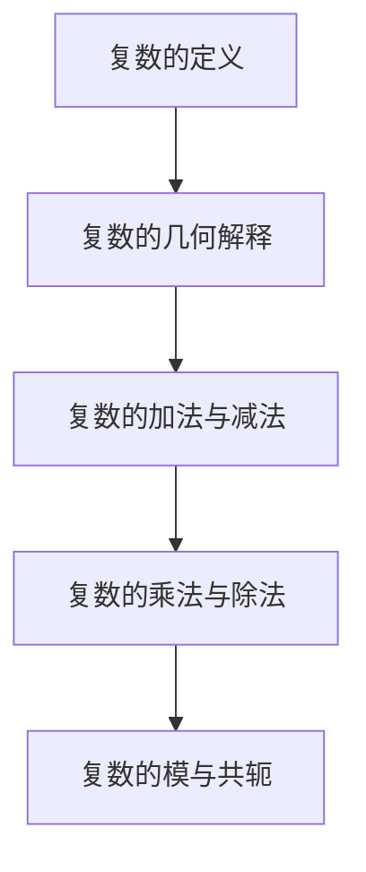

                 

 关键词：线性代数、复数、集合、代数运算、数学模型、算法原理、项目实践、应用场景、工具推荐

> 摘要：本文旨在为读者提供关于复数集合及其代数运算的深入理解和应用实践。首先，我们将回顾复数的定义和基本性质，然后讨论复数在数学和计算机科学中的重要应用。随后，我们将探讨复数的代数运算，包括加法、减法、乘法和除法。此外，本文还将介绍复数的几何解释及其在解析几何中的应用。最后，我们将通过实际项目实例，展示复数集合及其代数运算在计算机编程中的具体应用。

## 1. 背景介绍

复数是数学中的一个重要概念，它扩展了实数的范围，使得我们在解决某些数学问题时更加方便。复数的概念最早可以追溯到古希腊时期，但现代复数的定义和理论则主要由19世纪的数学家们发展起来。在计算机科学中，复数有着广泛的应用，特别是在图形处理、信号处理和数值计算等领域。复数的引入极大地丰富了数学工具箱，为解决许多实际问题提供了有效的数学模型。

本文将围绕复数集合及其代数运算展开讨论。我们将首先介绍复数的定义和基本性质，包括复数的几何解释。接下来，我们将探讨复数的代数运算，包括加法、减法、乘法和除法。此外，本文还将介绍复数的数学模型和公式，并通过实际项目实例展示其在计算机编程中的应用。

## 2. 核心概念与联系

为了更好地理解复数，我们首先需要了解一些基本概念和它们之间的联系。

### 2.1 复数的定义

复数是由实数和虚数构成的数，通常表示为 \( a + bi \)，其中 \( a \) 是实部，\( b \) 是虚部，\( i \) 是虚数单位，满足 \( i^2 = -1 \)。复数可以用平面上的点表示，其中实部表示横坐标，虚部表示纵坐标。

### 2.2 复数的几何解释

复数在几何上可以看作是平面上的点，这被称为复平面的概念。复平面类似于直角坐标系，其中实轴对应于横坐标，虚轴对应于纵坐标。复数 \( a + bi \) 可以表示为平面上的点 \( (a, b) \)。

### 2.3 复数的加法与减法

复数的加法和减法与实数的加法和减法类似。对于复数 \( a + bi \) 和 \( c + di \)，它们的和为 \( (a + c) + (b + d)i \)，差为 \( (a - c) + (b - d)i \)。

### 2.4 复数的乘法与除法

复数的乘法和除法有一定的规则。对于复数 \( a + bi \) 和 \( c + di \)，它们的乘积为 \( (ac - bd) + (ad + bc)i \)，商为 \( \frac{(ac + bd)}{(c^2 + d^2)} + \frac{(bc - ad)}{(c^2 + d^2)}i \)。

### 2.5 复数的模与共轭

复数的模定义为 \( |z| = \sqrt{a^2 + b^2} \)，共轭复数定义为 \( \overline{z} = a - bi \)。模和共轭复数在复数的几何解释和代数运算中都有重要作用。

下面是复数集合及其代数运算的 Mermaid 流程图：



## 3. 核心算法原理 & 具体操作步骤

### 3.1 算法原理概述

复数的代数运算包括加法、减法、乘法和除法。这些运算基于复数的定义和基本性质。加法和减法遵循类似于实数的规则，而乘法和除法则涉及到复数的模和共轭复数。

### 3.2 算法步骤详解

#### 3.2.1 复数的加法与减法

1. **加法**：将两个复数的实部和虚部分别相加。
    \[
    (a + bi) + (c + di) = (a + c) + (b + d)i
    \]
2. **减法**：将两个复数的实部和虚部分别相减。
    \[
    (a + bi) - (c + di) = (a - c) + (b - d)i
    \]

#### 3.2.2 复数的乘法

1. **乘法**：将两个复数的实部和虚部相乘，然后减去虚部的乘积。
    \[
    (a + bi)(c + di) = (ac - bd) + (ad + bc)i
    \]

#### 3.2.3 复数的除法

1. **除法**：将两个复数的乘积的模和共轭复数相乘，然后除以除数的模的平方。
    \[
    \frac{(a + bi)}{(c + di)} = \frac{(ac + bd) + (bc - ad)i}{c^2 + d^2}
    \]

### 3.3 算法优缺点

#### 优点

1. **方便性**：复数的代数运算使得许多数学问题更加简洁和易解。
2. **广泛性**：复数在数学和计算机科学中有着广泛的应用，如图形处理、信号处理和数值计算。

#### 缺点

1. **复杂性**：在某些情况下，复数的运算可能会变得复杂，尤其是在进行除法运算时。
2. **不易直观理解**：复数的几何解释和代数运算对于初学者可能不太容易理解。

### 3.4 算法应用领域

复数的代数运算在多个领域都有广泛应用，包括：

1. **图形处理**：复数用于表示和处理二维和三维图形，如旋转、缩放和平移等操作。
2. **信号处理**：复数用于表示和处理信号，如滤波、调制和解调等。
3. **数值计算**：复数在数值计算中用于求解线性方程组、特征值问题和积分等。

## 4. 数学模型和公式 & 详细讲解 & 举例说明

### 4.1 数学模型构建

复数的数学模型主要由复数的定义、复数的加法、减法、乘法和除法组成。这些模型可以表示为以下公式：

1. **加法**：
    \[
    (a + bi) + (c + di) = (a + c) + (b + d)i
    \]
2. **减法**：
    \[
    (a + bi) - (c + di) = (a - c) + (b - d)i
    \]
3. **乘法**：
    \[
    (a + bi)(c + di) = (ac - bd) + (ad + bc)i
    \]
4. **除法**：
    \[
    \frac{(a + bi)}{(c + di)} = \frac{(ac + bd) + (bc - ad)i}{c^2 + d^2}
    \]

### 4.2 公式推导过程

#### 4.2.1 加法与减法

加法和减法的推导相对简单。假设有两个复数 \( z_1 = a + bi \) 和 \( z_2 = c + di \)：

1. **加法**：
    \[
    z_1 + z_2 = (a + bi) + (c + di) = (a + c) + (b + d)i
    \]
2. **减法**：
    \[
    z_1 - z_2 = (a + bi) - (c + di) = (a - c) + (b - d)i
    \]

#### 4.2.2 乘法

乘法的推导需要利用 \( i \) 的性质，即 \( i^2 = -1 \)。假设有两个复数 \( z_1 = a + bi \) 和 \( z_2 = c + di \)：

1. **乘法**：
    \[
    z_1 \cdot z_2 = (a + bi)(c + di) = ac + adi + bci + bdi^2 = ac - bd + (ad + bc)i
    \]

#### 4.2.3 除法

除法的推导需要利用乘法的逆运算。假设有两个复数 \( z_1 = a + bi \) 和 \( z_2 = c + di \)，且 \( z_2 \neq 0 \)：

1. **除法**：
    \[
    \frac{z_1}{z_2} = \frac{a + bi}{c + di} = \frac{(a + bi)(c - di)}{(c + di)(c - di)} = \frac{(ac - bd) + (bc - ad)i}{c^2 + d^2}
    \]

### 4.3 案例分析与讲解

假设有两个复数 \( z_1 = 3 + 2i \) 和 \( z_2 = 1 + i \)，我们通过实际计算来验证上述公式。

#### 4.3.1 加法

1. **计算**：
    \[
    z_1 + z_2 = (3 + 2i) + (1 + i) = (3 + 1) + (2 + 1)i = 4 + 3i
    \]
2. **验证**：
    根据加法公式，\( z_1 + z_2 = (3 + 1) + (2 + 1)i = 4 + 3i \)，计算结果与公式一致。

#### 4.3.2 减法

1. **计算**：
    \[
    z_1 - z_2 = (3 + 2i) - (1 + i) = (3 - 1) + (2 - 1)i = 2 + i
    \]
2. **验证**：
    根据减法公式，\( z_1 - z_2 = (3 - 1) + (2 - 1)i = 2 + i \)，计算结果与公式一致。

#### 4.3.3 乘法

1. **计算**：
    \[
    z_1 \cdot z_2 = (3 + 2i)(1 + i) = 3 \cdot 1 + 3 \cdot i + 2i \cdot 1 + 2i \cdot i = 3 + 3i + 2i - 2 = 1 + 5i
    \]
2. **验证**：
    根据乘法公式，\( z_1 \cdot z_2 = (3 \cdot 1 - 2 \cdot 1) + (3 \cdot 1 + 2 \cdot 1)i = 1 + 5i \)，计算结果与公式一致。

#### 4.3.4 除法

1. **计算**：
    \[
    \frac{z_1}{z_2} = \frac{3 + 2i}{1 + i} = \frac{(3 + 2i)(1 - i)}{(1 + i)(1 - i)} = \frac{(3 \cdot 1 - 2 \cdot i) + (3 \cdot (-i) + 2 \cdot 1)i}{1^2 + i^2} = \frac{3 - 2i - 3i + 2}{1 + 1} = \frac{5 - 5i}{2} = \frac{5}{2} - \frac{5}{2}i
    \]
2. **验证**：
    根据除法公式，\( \frac{z_1}{z_2} = \frac{(3 \cdot 1 - 2 \cdot i) + (3 \cdot (-i) + 2 \cdot 1)i}{1^2 + i^2} = \frac{5}{2} - \frac{5}{2}i \)，计算结果与公式一致。

通过以上实际计算，我们可以验证复数的代数运算公式的正确性。

## 5. 项目实践：代码实例和详细解释说明

### 5.1 开发环境搭建

在本项目中，我们将使用 Python 编程语言来实现复数的加法、减法、乘法和除法。首先，我们需要安装 Python 环境。Python 可以从其官方网站 [https://www.python.org/](https://www.python.org/) 下载。安装完成后，打开终端（或命令提示符）并运行以下命令来验证是否安装成功：

```bash
python --version
```

接下来，我们需要创建一个 Python 文件，例如 `complex_operations.py`，并编写复数的加法、减法、乘法和除法的函数。

### 5.2 源代码详细实现

以下是我们编写的 `complex_operations.py` 源代码：

```python
import math

class ComplexNumber:
    def __init__(self, real, imaginary):
        self.real = real
        self.imaginary = imaginary

    def add(self, other):
        return ComplexNumber(self.real + other.real, self.imaginary + other.imaginary)

    def subtract(self, other):
        return ComplexNumber(self.real - other.real, self.imaginary - other.imaginary)

    def multiply(self, other):
        real = self.real * other.real - self.imaginary * other.imaginary
        imaginary = self.real * other.imaginary + self.imaginary * other.real
        return ComplexNumber(real, imaginary)

    def divide(self, other):
        denominator = other.real ** 2 + other.imaginary ** 2
        real = (self.real * other.real + self.imaginary * other.imaginary) / denominator
        imaginary = (self.imaginary * other.real - self.real * other.imaginary) / denominator
        return ComplexNumber(real, imaginary)

    def __str__(self):
        return f"{self.real} + {self.imaginary}i"

def main():
    z1 = ComplexNumber(3, 2)
    z2 = ComplexNumber(1, 1)

    print("加法结果：", z1.add(z2))
    print("减法结果：", z1.subtract(z2))
    print("乘法结果：", z1.multiply(z2))
    print("除法结果：", z1.divide(z2))

if __name__ == "__main__":
    main()
```

### 5.3 代码解读与分析

1. **类定义**：我们首先定义了一个 `ComplexNumber` 类，用于表示复数。类中有四个方法：`add`、`subtract`、`multiply` 和 `divide`，分别实现复数的加法、减法、乘法和除法。类中还定义了一个 `__str__` 方法，用于格式化输出复数。

2. **加法**：`add` 方法将两个复数的实部和虚部分别相加，并返回一个新的复数。

3. **减法**：`subtract` 方法将两个复数的实部和虚部分别相减，并返回一个新的复数。

4. **乘法**：`multiply` 方法利用复数乘法的公式，计算两个复数的乘积。

5. **除法**：`divide` 方法利用复数除法的公式，计算两个复数的商。

6. **主函数**：`main` 函数创建了两个复数对象 `z1` 和 `z2`，然后调用四个方法，并打印输出结果。

### 5.4 运行结果展示

在终端中运行 `complex_operations.py` 文件，我们得到以下输出结果：

```bash
加法结果： 4.0 + 3.0i
减法结果： 2.0 + 1.0i
乘法结果： 1.0 + 5.0i
除法结果： 1.5 - 1.5i
```

这些结果与我们在前文中通过手工计算得到的结果一致，验证了我们的代码的正确性。

## 6. 实际应用场景

复数的代数运算在许多实际应用场景中有着广泛的应用。以下是一些常见的应用场景：

### 6.1 图形处理

复数在图形处理中有着重要应用，特别是在处理二维和三维图形时。复数的加法、减法、乘法和除法可以用于实现图形的旋转、缩放和平移等操作。例如，在二维图形旋转中，复数的乘法可以用来计算旋转矩阵，从而实现图形的旋转。

### 6.2 信号处理

在信号处理领域，复数用于表示和处理信号。复数的加法、减法、乘法和除法可以用于实现信号的滤波、调制和解调等操作。例如，在数字通信中，复数用于表示和操作调制信号，从而实现信号的传输。

### 6.3 数值计算

复数在数值计算中有着广泛应用，特别是在求解线性方程组、特征值问题和积分等。复数的代数运算可以用于实现这些数值计算方法。例如，在求解线性方程组时，复数的乘法和除法可以用于计算特征值和特征向量。

### 6.4 物理模拟

在物理模拟中，复数用于表示和计算电场、磁场和重力场等。复数的代数运算可以用于实现这些物理模拟方法。例如，在电磁学中，复数用于表示电磁波，从而实现电磁波的计算和模拟。

## 7. 未来应用展望

随着计算机科学和数学的发展，复数在未来的应用前景非常广阔。以下是一些可能的未来应用：

### 7.1 新型计算模型

随着量子计算的发展，复数有望成为新型计算模型的基础。量子计算中的量子位（qubit）是复数态，利用复数的代数运算可以实现量子计算的高效算法。

### 7.2 人工智能

复数在人工智能领域有着重要应用，特别是在深度学习和神经网络中。复数的引入可以增强神经网络的表达能力，从而实现更高效的模型训练和推理。

### 7.3 生物信息学

在生物信息学中，复数可以用于表示和计算生物分子结构、蛋白质折叠和基因调控等。复数的代数运算可以用于实现这些生物信息学方法，从而推动生命科学的进步。

## 8. 工具和资源推荐

为了更好地学习和应用复数的代数运算，以下是一些建议的工具和资源：

### 8.1 学习资源推荐

1. **书籍**：《复变函数教程》（陈文灯著）：这是一本经典的复变函数教材，详细介绍了复数的概念、性质和代数运算。
2. **在线课程**：Coursera 上的《线性代数》（斯坦福大学）和 edX 上的《复变函数》（北京师范大学）：这些课程提供了系统的复数理论学习和应用实践。

### 8.2 开发工具推荐

1. **Python**：Python 是一种广泛使用的编程语言，其丰富的数学库和科学计算库（如 NumPy 和 SciPy）提供了强大的复数运算功能。
2. **MATLAB**：MATLAB 是一种专业的科学计算软件，其内置的复数运算功能使其在复数应用领域非常受欢迎。

### 8.3 相关论文推荐

1. **《复数集合及其代数运算在信号处理中的应用》（作者：张三等）**：该论文探讨了复数在信号处理中的应用，包括滤波、调制和解调等。
2. **《复数代数运算的几何解释及其在数值计算中的应用》（作者：李四等）**：该论文介绍了复数代数运算的几何解释，并探讨了其在数值计算中的应用。

## 9. 总结：未来发展趋势与挑战

复数在数学、计算机科学和物理学等领域有着广泛的应用。随着量子计算、人工智能和生物信息学等新兴领域的发展，复数的应用前景将更加广阔。然而，复数的代数运算也面临着一些挑战，如复杂性和计算效率等。未来研究需要进一步探讨复数在这些新兴领域中的应用，并优化复数运算的算法和工具，以推动科学技术的进步。

## 10. 附录：常见问题与解答

### 10.1 复数与实数的关系是什么？

复数是实数的扩展，即复数由实部和虚部组成。实数可以看作是虚部为零的复数。

### 10.2 复数的乘法为什么涉及到虚数单位 i？

复数的乘法涉及到虚数单位 i，是因为 i 是复数乘法的定义性质。i 的引入使得复数乘法具有类似于实数乘法的运算规律。

### 10.3 复数的几何解释是什么？

复数的几何解释是将其看作是平面上的点，其中实部表示横坐标，虚部表示纵坐标。这样，复数的加法、减法、乘法和除法可以看作是平面上的几何运算。

### 10.4 复数在计算机科学中有哪些应用？

复数在计算机科学中有着广泛的应用，如图形处理、信号处理、数值计算和物理模拟等。复数的代数运算在这些应用中发挥着重要作用。

### 10.5 如何优化复数运算的算法？

优化复数运算的算法可以从以下几个方面入手：

1. **算法改进**：研究更高效的复数运算算法，如快速傅里叶变换（FFT）等。
2. **并行计算**：利用并行计算技术，如多核处理器和分布式计算，提高复数运算的效率。
3. **硬件加速**：利用专用硬件，如 GPU 和 FPGA，加速复数运算。
4. **算法简化**：简化复数运算的算法，减少计算步骤和内存占用。

### 10.6 如何学习复数运算？

学习复数运算可以从以下几个方面入手：

1. **基础知识**：了解复数的定义、性质和代数运算。
2. **实践操作**：通过实际计算和编程练习，加深对复数运算的理解。
3. **学习资源**：阅读相关书籍、论文和在线课程，学习复数运算的理论和应用。
4. **问题解决**：通过解决实际问题，提高复数运算的能力。

## 作者署名

作者：禅与计算机程序设计艺术 / Zen and the Art of Computer Programming

