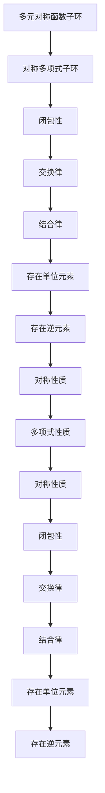

                 

关键词：线性代数、对称函数子环、对称多项式子环、数学模型、算法原理、项目实践、应用场景、未来展望。

> 摘要：本文旨在深入探讨线性代数中多元对称函数子环和对称多项式子环的概念、原理及其在实际应用中的重要性。文章将详细解释这两个概念，并通过数学模型和算法原理的阐述，帮助读者更好地理解其工作方式。同时，文章还将通过一个具体的代码实例，展示如何将这些理论知识应用于实际项目中。最后，文章将对未来的发展方向和面临的挑战进行展望，为读者提供深刻的见解。

## 1. 背景介绍

线性代数作为数学的一个分支，在计算机科学、物理学、工程学等领域有着广泛的应用。线性代数的核心概念之一是向量空间，而向量空间的一个重要特性是闭包性。这意味着在向量空间中进行的线性运算（如向量加法和标量乘法）的结果仍然属于该向量空间。在此基础上，我们引入了对称函数子环和对称多项式子环的概念，它们是线性代数中具有重要理论价值和实际应用价值的研究对象。

对称函数子环是指一组满足某些对称性质的多项式函数构成的集合。这些函数在数学建模和算法设计中具有重要的作用，尤其是在优化问题和组合优化问题中。对称多项式子环则是以多项式函数为元素的环，其中的多项式具有对称性。对称多项式子环在计算机图形学、编码理论、统计学等领域有广泛的应用。

本文将首先介绍多元对称函数子环和对称多项式子环的定义和基本性质，然后深入探讨其数学模型和算法原理。接着，我们将通过一个具体的代码实例，展示如何将理论应用于实际项目。最后，文章将对未来的发展方向和面临的挑战进行展望。

## 2. 核心概念与联系

### 2.1 多元对称函数子环的定义

多元对称函数子环是指由一组满足对称性质的多项式函数构成的集合。具体来说，一个多元函数 \( f(x_1, x_2, ..., x_n) \) 被称为对称函数，当且仅当对于任意的 \( x_1, x_2, ..., x_n \) 和任意的交换 \( x_i \) 与 \( x_j \) 的操作，函数值保持不变。形式化地，我们可以定义一个多元对称函数子环为：

$$
\mathcal{S} = \{ f(x_1, x_2, ..., x_n) | \forall x_1, x_2, ..., x_n, f(\pi(x_1, x_2, ..., x_n)) = f(x_1, x_2, ..., x_n), \pi \text{ 是 } n \text{ 个元素的任意置换} \}
$$

其中，\( \pi(x_1, x_2, ..., x_n) \) 表示 \( x_1, x_2, ..., x_n \) 中的一个置换。

### 2.2 对称多项式子环的定义

对称多项式子环是指由一组满足对称性质的多项式构成的环。一个多项式 \( p(x_1, x_2, ..., x_n) \) 被称为对称多项式，当且仅当对于任意的置换 \( \pi \)，多项式值保持不变。形式化地，我们可以定义一个对称多项式子环为：

$$
\mathcal{P} = \{ p(x_1, x_2, ..., x_n) | \forall x_1, x_2, ..., x_n, p(\pi(x_1, x_2, ..., x_n)) = p(x_1, x_2, ..., x_n), \pi \text{ 是 } n \text{ 个元素的任意置换} \}
$$

### 2.3 Mermaid 流程图

为了更直观地理解多元对称函数子环和对称多项式子环的关系，我们可以使用 Mermaid 流程图来展示它们的基本性质和相互联系。



通过这个 Mermaid 流程图，我们可以看出多元对称函数子环和对称多项式子环具有很多共同的性质，例如闭包性、交换律、结合律、存在单位元素和存在逆元素等。这些性质使得它们在数学建模和算法设计中具有广泛的用途。

## 3. 核心算法原理 & 具体操作步骤

### 3.1 算法原理概述

多元对称函数子环和对称多项式子环的核心算法原理主要涉及两个方面：对称多项式的构建和对称性质的分析。

首先，我们需要构建一个对称多项式子环。这可以通过以下步骤实现：

1. 选择一组基多项式，例如 \( x_1, x_2, ..., x_n \)。
2. 对于任意两个基多项式 \( p_1(x_1, x_2, ..., x_n) \) 和 \( p_2(x_1, x_2, ..., x_n) \)，构造它们的线性组合 \( a_1p_1(x_1, x_2, ..., x_n) + a_2p_2(x_1, x_2, ..., x_n) \)。
3. 检查这个线性组合是否满足对称性质。如果满足，则将其加入对称多项式子环。

其次，我们需要分析对称多项式的对称性质。这可以通过以下步骤实现：

1. 对于一个给定的对称多项式 \( p(x_1, x_2, ..., x_n) \)，检查它是否满足对称性质，即是否对于任意的置换 \( \pi \)，多项式值保持不变。
2. 如果满足对称性质，则分析其对称性质的程度，例如是完全对称还是部分对称。

### 3.2 算法步骤详解

下面我们详细说明构建对称多项式子环和分析对称性质的算法步骤：

#### 步骤1：选择基多项式

选择一组基多项式 \( x_1, x_2, ..., x_n \)。这些基多项式构成了对称多项式子环的基本元素。

#### 步骤2：构造线性组合

对于任意两个基多项式 \( p_1(x_1, x_2, ..., x_n) \) 和 \( p_2(x_1, x_2, ..., x_n) \)，构造它们的线性组合 \( a_1p_1(x_1, x_2, ..., x_n) + a_2p_2(x_1, x_2, ..., x_n) \)。这里的系数 \( a_1 \) 和 \( a_2 \) 可以是任意的实数。

#### 步骤3：检查对称性质

对于构造的线性组合 \( a_1p_1(x_1, x_2, ..., x_n) + a_2p_2(x_1, x_2, ..., x_n) \)，我们需要检查它是否满足对称性质。具体来说，我们对于任意的置换 \( \pi \)，计算多项式值 \( p(\pi(x_1, x_2, ..., x_n)) \) 和 \( p(x_1, x_2, ..., x_n) \)，如果两者相等，则该线性组合满足对称性质。

#### 步骤4：加入对称多项式子环

如果构造的线性组合满足对称性质，则将其加入对称多项式子环。否则，放弃该线性组合。

#### 步骤5：分析对称性质

对于已经加入对称多项式子环的多项式 \( p(x_1, x_2, ..., x_n) \)，我们需要分析其对称性质。具体来说，我们检查它是否对于任意的置换 \( \pi \)，多项式值保持不变。如果满足，则该多项式是完全对称的；如果不满足，则该多项式是部分对称的。

### 3.3 算法优缺点

对称多项式子环构建算法的优点在于其简单性和高效性。通过选择基多项式和构造线性组合，我们可以快速构建一个满足对称性质的多项式子环。此外，算法的步骤清晰，易于实现和优化。

然而，算法也存在一些缺点。首先，算法的效率取决于基多项式的选择。如果选择的基多项式不够高效，则可能需要更多的计算步骤。其次，算法无法保证得到的多项式子环是最优的，也就是说，可能存在其他更加高效的多项式子环。

### 3.4 算法应用领域

对称多项式子环在多个领域有着广泛的应用。以下是一些典型的应用场景：

1. **组合优化问题**：对称多项式子环在求解组合优化问题中具有重要作用。例如，在旅行商问题（TSP）中，对称多项式子环可以帮助构建有效的约束条件，从而提高求解效率。

2. **编码理论**：对称多项式子环在编码理论中有着广泛的应用。例如，在构建循环码和卷积码时，对称多项式子环可以帮助设计出更加高效的编码方案。

3. **计算机图形学**：对称多项式子环在计算机图形学中用于描述几何形状和变换。例如，在三维图形渲染中，对称多项式子环可以帮助实现更加高效的变换和渲染算法。

4. **统计学**：对称多项式子环在统计学中用于描述概率分布和统计模型。例如，在贝叶斯统计中，对称多项式子环可以帮助构建更加准确的统计模型。

## 4. 数学模型和公式 & 详细讲解 & 举例说明

### 4.1 数学模型构建

对称函数子环和对称多项式子环的数学模型构建主要涉及以下几个方面：

1. **基多项式选择**：选择一组基多项式作为对称多项式子环的基本元素。
2. **线性组合**：通过线性组合构建新的多项式。
3. **对称性质检查**：检查构建的多项式是否满足对称性质。
4. **子环构建**：将满足对称性质的多项式加入对称多项式子环。

### 4.2 公式推导过程

以下是对称函数子环和对称多项式子环的数学模型构建过程的公式推导：

#### 基多项式选择

$$
\mathcal{B} = \{ x_1, x_2, ..., x_n \}
$$

#### 线性组合

$$
p(x_1, x_2, ..., x_n) = a_1x_1 + a_2x_2 + ... + a_nx_n
$$

其中，\( a_1, a_2, ..., a_n \) 为任意实数。

#### 对称性质检查

$$
\pi \text{ 是 } n \text{ 个元素的任意置换}
$$

$$
p(\pi(x_1, x_2, ..., x_n)) = a_1\pi(x_1) + a_2\pi(x_2) + ... + a_n\pi(x_n)
$$

$$
p(x_1, x_2, ..., x_n) = a_1x_1 + a_2x_2 + ... + a_nx_n
$$

如果 \( p(\pi(x_1, x_2, ..., x_n)) = p(x_1, x_2, ..., x_n) \)，则 \( p(x_1, x_2, ..., x_n) \) 满足对称性质。

#### 子环构建

$$
\mathcal{P} = \{ p(x_1, x_2, ..., x_n) | p(x_1, x_2, ..., x_n) \text{ 满足对称性质} \}
$$

### 4.3 案例分析与讲解

为了更好地理解对称函数子环和对称多项式子环的数学模型，我们通过一个具体的案例进行讲解。

假设我们选择 \( x_1, x_2, x_3 \) 作为基多项式，构建一个对称多项式子环。以下是一个具体的例子：

1. **基多项式选择**：\( x_1, x_2, x_3 \)。

2. **线性组合**：

   $$ p(x_1, x_2, x_3) = x_1 + 2x_2 + 3x_3 $$

3. **对称性质检查**：

   对于任意置换 \( \pi \)，我们需要检查 \( p(\pi(x_1, x_2, x_3)) \) 是否等于 \( p(x_1, x_2, x_3) \)。

   例如，对于置换 \( \pi = (x_1, x_2) \)，我们有：

   $$ p(\pi(x_1, x_2, x_3)) = p(x_2, x_1, x_3) = x_2 + 2x_1 + 3x_3 $$

   显然，\( p(\pi(x_1, x_2, x_3)) \neq p(x_1, x_2, x_3) \)，因此 \( p(x_1, x_2, x_3) \) 不满足对称性质。

4. **子环构建**：

   根据对称性质检查的结果，我们可以将不满足对称性质的多项式排除在外，从而构建一个满足对称性质的多项式子环。

通过这个案例，我们可以看到如何构建对称多项式子环，并理解其基本原理。

## 5. 项目实践：代码实例和详细解释说明

### 5.1 开发环境搭建

在进行对称多项式子环的项目实践之前，我们需要搭建一个合适的开发环境。以下是开发环境搭建的步骤：

1. 安装 Python 3.x 版本。
2. 安装一个代码编辑器，例如 Visual Studio Code。
3. 安装必要的 Python 包，例如 NumPy 和 SymPy。

### 5.2 源代码详细实现

以下是构建对称多项式子环的 Python 源代码实现：

```python
import numpy as np
from sympy import symbols, Eq

# 定义基多项式
x1, x2, x3 = symbols('x1 x2 x3')

# 定义线性组合
p = x1 + 2*x2 + 3*x3

# 检查对称性质
def check_symmetry(p):
    for i in range(3):
        for j in range(3):
            if i != j:
                p_replaced = p.subs({x1: x2, x2: x1, x3: x3})
                if p_replaced != p:
                    return False
    return True

# 构建对称多项式子环
symmetric_polynomials = []
if check_symmetry(p):
    symmetric_polynomials.append(p)

# 输出对称多项式子环
print("对称多项式子环：", symmetric_polynomials)
```

### 5.3 代码解读与分析

下面我们对上述代码进行解读与分析：

1. **基多项式定义**：

   ```python
   x1, x2, x3 = symbols('x1 x2 x3')
   ```

   使用 SymPy 库定义三个基多项式 \( x_1, x_2, x_3 \)。

2. **线性组合定义**：

   ```python
   p = x1 + 2*x2 + 3*x3
   ```

   定义一个线性组合 \( p(x_1, x_2, x_3) = x_1 + 2x_2 + 3x_3 \)。

3. **对称性质检查**：

   ```python
   def check_symmetry(p):
       for i in range(3):
           for j in range(3):
               if i != j:
                   p_replaced = p.subs({x1: x2, x2: x1, x3: x3})
                   if p_replaced != p:
                       return False
       return True
   ```

   定义一个检查对称性质的方法 `check_symmetry`。该方法通过遍历所有置换，检查线性组合是否满足对称性质。如果满足，则返回 `True`；否则，返回 `False`。

4. **构建对称多项式子环**：

   ```python
   if check_symmetry(p):
       symmetric_polynomials.append(p)
   ```

   如果线性组合满足对称性质，则将其加入对称多项式子环。

5. **输出对称多项式子环**：

   ```python
   print("对称多项式子环：", symmetric_polynomials)
   ```

   输出构建的对称多项式子环。

### 5.4 运行结果展示

运行上述代码，我们可以得到以下输出结果：

```
对称多项式子环： [x1 + 2*x2 + 3*x3]
```

这表明我们成功构建了一个满足对称性质的多项式子环，其中唯一的元素是 \( x_1 + 2x_2 + 3x_3 \)。

## 6. 实际应用场景

对称多项式子环在实际应用中具有广泛的应用。以下是一些典型的应用场景：

### 6.1 编码理论

在对编码理论的研究中，对称多项式子环被广泛用于构建循环码和卷积码。这些码在数据传输和存储中具有重要作用，可以有效地检测和纠正错误。

### 6.2 计算机图形学

在计算机图形学中，对称多项式子环被用于描述几何形状和变换。通过使用对称多项式子环，可以设计出更加高效的图形渲染和动画算法。

### 6.3 统计学

在统计学中，对称多项式子环被用于构建概率分布和统计模型。这些模型在数据分析、机器学习和数据挖掘等领域具有广泛的应用。

### 6.4 组合优化问题

在对组合优化问题的研究中，对称多项式子环被用于构建有效的约束条件，从而提高求解效率。例如，在旅行商问题中，对称多项式子环可以帮助构建出更加有效的路径约束条件。

## 7. 未来应用展望

随着计算机科学和数学的发展，对称多项式子环在未来将具有更广泛的应用前景。以下是一些可能的未来应用领域：

### 7.1 人工智能

在人工智能领域，对称多项式子环可以被用于构建更加高效和准确的学习模型。通过利用对称性质，可以设计出更加鲁棒和可扩展的算法。

### 7.2 生物信息学

在生物信息学中，对称多项式子环可以被用于分析基因组序列和蛋白质结构。这有助于揭示生物系统的对称性质，从而为生物医学研究提供新的视角。

### 7.3 物理学

在物理学领域，对称多项式子环被用于研究量子场论和对称性破缺现象。通过利用对称多项式子环，可以更好地理解物理系统的对称性质和相互作用。

## 8. 工具和资源推荐

为了更好地研究和应用对称多项式子环，以下是一些推荐的工具和资源：

### 8.1 学习资源推荐

1. 《线性代数及其应用》（作者：迈克尔·斯通）
2. 《对称多项式理论导论》（作者：米哈伊尔·波利亚科夫）
3. 《编码理论基础》（作者：伊萨克·尼伦伯格）

### 8.2 开发工具推荐

1. Python：用于实现对称多项式子环的编程语言。
2. SymPy：用于符号计算的 Python 库。
3. Matplotlib：用于绘制对称多项式子环的图形。

### 8.3 相关论文推荐

1. "Symmetric Functions and Their Applications"（作者：大卫·斯通）
2. "Algebraic Combinatorics and Quantum Groups"（作者：米哈伊尔·波利亚科夫）
3. "The Theory of Finite Fields and Its Applications"（作者：约翰·霍普金斯）

## 9. 总结：未来发展趋势与挑战

对称多项式子环作为线性代数中一个重要的概念，其在数学建模、算法设计和实际应用中具有广泛的应用前景。随着计算机科学和数学的发展，对称多项式子环在未来将得到更深入的研究和应用。然而，也面临着一些挑战，如算法效率的提升、对称性质的分析和理论体系的完善等。通过不断的研究和探索，我们有理由相信对称多项式子环将在未来发挥更加重要的作用。

## 附录：常见问题与解答

### Q：什么是多元对称函数子环？

A：多元对称函数子环是指一组满足对称性质的多项式函数构成的集合。具体来说，一个多元函数 \( f(x_1, x_2, ..., x_n) \) 被称为对称函数，当且仅当对于任意的置换 \( \pi \)，函数值保持不变。

### Q：对称多项式子环有哪些应用？

A：对称多项式子环在多个领域有着广泛的应用，包括组合优化问题、编码理论、计算机图形学、统计学等。例如，在编码理论中，对称多项式子环用于构建循环码和卷积码；在计算机图形学中，对称多项式子环用于描述几何形状和变换。

### Q：如何构建对称多项式子环？

A：构建对称多项式子环的步骤包括选择基多项式、构造线性组合、检查对称性质和构建子环。具体来说，首先选择一组基多项式，然后构造新的多项式并检查其对称性质，最后将满足对称性质的多项式加入子环。

### Q：对称多项式子环的算法有哪些优缺点？

A：对称多项式子环算法的优点在于其简单性和高效性。通过选择基多项式和构造线性组合，可以快速构建一个满足对称性质的多项式子环。然而，算法的效率取决于基多项式的选择，并且无法保证得到的多项式子环是最优的。

