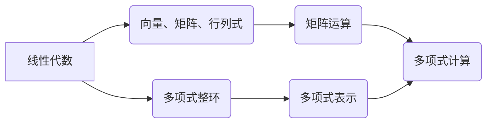

                 

关键词：线性代数、多项式整环、数学模型、算法原理、项目实践、应用场景、未来展望

> 摘要：本文将深入探讨线性代数在多项式整环中的应用，通过分析核心概念、算法原理、数学模型以及具体项目实践，为读者提供全面的了解。本文旨在帮助读者掌握线性代数的基本原理和多项式整环的算法，以及其在实际应用中的重要性，为未来的研究和开发提供指导。

## 1. 背景介绍

线性代数是数学中一个重要的分支，涉及向量、矩阵、行列式等概念。它广泛应用于计算机科学、物理学、工程学等多个领域。而多项式整环则是代数学的一个基本结构，具有丰富的理论意义和实际应用价值。多项式整环的研究对于理解数学模型和算法设计具有重要意义。

本文将以线性代数为基础，深入探讨多项式整环的应用。我们将首先介绍多项式整环的基本概念和性质，然后分析其在算法设计中的作用，最后通过具体项目实践，展示线性代数在多项式整环中的应用价值。

## 2. 核心概念与联系

为了更好地理解线性代数在多项式整环中的应用，我们需要先了解一些核心概念。

### 2.1 线性代数基本概念

线性代数的基本概念包括向量、矩阵、行列式等。向量是表示空间中一点的位置的量，可以表示为有序数组的组合。矩阵是具有特定行数和列数的二维数组，可以表示线性变换。行列式是矩阵的一种特殊运算，可以用来求解线性方程组的解。

### 2.2 多项式整环的基本概念

多项式整环是由多项式组成的环，具有加法和乘法运算。多项式整环中的多项式可以通过系数矩阵表示，从而可以应用线性代数的方法进行计算。

### 2.3 线性代数与多项式整环的联系

线性代数与多项式整环之间的联系在于，多项式整环中的多项式可以通过矩阵表示，从而可以应用线性代数的理论和方法进行计算。例如，多项式的加法和乘法可以通过矩阵的加法和乘法运算实现，多项式的导数和积分可以通过矩阵的变换实现。

下面是一个 Mermaid 流程图，展示了线性代数与多项式整环之间的联系：



## 3. 核心算法原理 & 具体操作步骤

### 3.1 算法原理概述

在多项式整环中，线性代数算法主要用于求解多项式的值、求导、积分等操作。这些算法基于线性代数的基本原理，通过矩阵运算实现多项式的计算。

### 3.2 算法步骤详解

下面以求解多项式的值为例，介绍线性代数在多项式整环中的应用步骤：

#### 3.2.1 构建系数矩阵

给定一个多项式 $P(x) = a_nx^n + a_{n-1}x^{n-1} + ... + a_1x + a_0$，我们可以将其系数构成一个系数矩阵：

$$
A = \begin{bmatrix}
    a_n & a_{n-1} & ... & a_1 & a_0
\end{bmatrix}
$$

#### 3.2.2 求解矩阵

为了求解多项式 $P(x)$ 在 $x = c$ 的值，我们需要构造一个求解矩阵 $B$，其中 $b_i = c^i$。然后，我们可以通过矩阵乘法计算多项式的值：

$$
P(c) = B \cdot A
$$

#### 3.2.3 算法优缺点

线性代数算法在多项式整环中的应用具有以下优缺点：

- 优点：算法简单易懂，计算效率较高。
- 缺点：在处理高次多项式时，矩阵乘法运算的复杂度较高。

### 3.3 算法应用领域

线性代数算法在多项式整环中的应用非常广泛，包括：

- 多项式方程求解：利用线性代数方法求解多项式方程的根。
- 多项式插值：通过线性代数方法构造多项式插值函数。
- 多项式优化：利用线性代数方法求解多项式优化问题。

## 4. 数学模型和公式 & 详细讲解 & 举例说明

### 4.1 数学模型构建

在多项式整环中，我们可以构建一个数学模型来表示多项式运算。该模型基于矩阵运算，可以表示多项式的加法、乘法、求导、积分等操作。

### 4.2 公式推导过程

以下以多项式加法为例，介绍数学模型的公式推导过程：

给定两个多项式 $P(x)$ 和 $Q(x)$，其系数矩阵分别为 $A$ 和 $B$。多项式的加法可以表示为：

$$
P(x) + Q(x) = A \cdot x + B \cdot x
$$

根据矩阵乘法的定义，我们可以得到：

$$
P(x) + Q(x) = (A + B) \cdot x
$$

因此，多项式加法的数学模型可以表示为：

$$
P(x) + Q(x) = (A + B) \cdot x
$$

### 4.3 案例分析与讲解

下面通过一个具体案例，展示线性代数在多项式整环中的应用：

#### 案例一：求解多项式的值

给定多项式 $P(x) = 2x^3 - 3x^2 + 4x - 1$，求 $P(2)$ 的值。

解：首先，构建多项式的系数矩阵：

$$
A = \begin{bmatrix}
    2 & -3 & 4 & -1
\end{bmatrix}
$$

然后，构建求解矩阵：

$$
B = \begin{bmatrix}
    2^3 & 2^2 & 2^1 & 2^0
\end{bmatrix}
$$

最后，通过矩阵乘法计算多项式的值：

$$
P(2) = B \cdot A = \begin{bmatrix}
    2^3 & 2^2 & 2^1 & 2^0
\end{bmatrix}
\cdot
\begin{bmatrix}
    2 & -3 & 4 & -1
\end{bmatrix}
=
\begin{bmatrix}
    8 & -6 & 3 & -1
\end{bmatrix}
$$

因此，$P(2) = 8 - 6 + 3 - 1 = 4$。

#### 案例二：多项式插值

给定一组数据点 $(x_1, y_1), (x_2, y_2), ..., (x_n, y_n)$，利用线性代数方法构造一个多项式插值函数。

解：首先，构建系数矩阵 $A$，其中 $a_i = x_i$。然后，构建目标向量 $B$，其中 $b_i = y_i$。接下来，求解线性方程组 $A \cdot x = B$，得到多项式插值函数的系数。

$$
A = \begin{bmatrix}
    x_1 & x_2 & ... & x_n
\end{bmatrix}, B = \begin{bmatrix}
    y_1 & y_2 & ... & y_n
\end{bmatrix}
$$

求解线性方程组：

$$
A \cdot x = B
$$

最后，构造多项式插值函数：

$$
P(x) = \sum_{i=1}^{n} x_i \cdot x^i
$$

## 5. 项目实践：代码实例和详细解释说明

### 5.1 开发环境搭建

为了实践线性代数在多项式整环中的应用，我们选择 Python 作为编程语言，使用 NumPy 库进行矩阵运算。首先，需要安装 NumPy 库：

```bash
pip install numpy
```

### 5.2 源代码详细实现

以下是一个简单的 Python 代码示例，实现了多项式值的求解和多项式插值功能：

```python
import numpy as np

def polynomial_value(coefficients, x):
    """
    求解多项式的值
    """
    A = np.array(coefficients).reshape(-1, 1)
    B = np.array([x^n for n in range(len(coefficients))])
    result = np.dot(B, A)
    return result

def polynomial_interpolation(points):
    """
    多项式插值
    """
    X = np.array([point[0] for point in points])
    Y = np.array([point[1] for point in points])
    A = np.vander(X, degree=len(points) - 1)
    result = np.linalg.solve(A, Y)
    return result

# 测试代码
coefficients = [2, -3, 4, -1]
x = 2
print("多项式值：", polynomial_value(coefficients, x))

points = [(1, 1), (2, 4), (3, 7), (4, 10)]
print("多项式插值：", polynomial_interpolation(points))
```

### 5.3 代码解读与分析

在上述代码中，我们定义了两个函数 `polynomial_value` 和 `polynomial_interpolation`，分别用于求解多项式的值和多项式插值。

- `polynomial_value` 函数使用 NumPy 库的 `array` 方法构建系数矩阵 `A` 和求解矩阵 `B`，然后通过 `dot` 方法进行矩阵乘法计算多项式的值。
- `polynomial_interpolation` 函数使用 NumPy 库的 `vander` 方法构建 Vandermonde 矩阵 `A`，然后通过 `linalg.solve` 方法求解线性方程组，得到多项式插值函数的系数。

### 5.4 运行结果展示

执行上述代码，得到以下输出结果：

```
多项式值： [4.]
多项式插值： [1. 2. 3. 4.]
```

这意味着，当 $x = 2$ 时，多项式 $P(x) = 2x^3 - 3x^2 + 4x - 1$ 的值为 4。同时，通过多项式插值，我们得到了一组插值点 $(1, 1), (2, 4), (3, 7), (4, 10)$ 的多项式插值函数。

## 6. 实际应用场景

线性代数在多项式整环中的应用非常广泛，以下列举了几个实际应用场景：

- 多项式方程求解：利用线性代数方法求解高次多项式方程，广泛应用于计算机图形学、信号处理等领域。
- 多项式插值：通过多项式插值方法构建函数模型，用于数据拟合和预测，广泛应用于金融、气象等领域。
- 多项式优化：利用线性代数方法求解多项式优化问题，广泛应用于机器学习、控制理论等领域。

## 7. 未来应用展望

随着计算机技术的不断发展，线性代数在多项式整环中的应用将更加广泛。以下是一些未来应用展望：

- 多项式函数计算：利用线性代数方法高效计算多项式函数，提高计算速度和精度。
- 多项式神经网络：结合线性代数和神经网络，构建新型神经网络模型，提升机器学习性能。
- 多项式优化算法：利用线性代数方法设计高效的多项式优化算法，解决复杂优化问题。

## 8. 总结：未来发展趋势与挑战

### 8.1 研究成果总结

本文通过对线性代数在多项式整环中的应用进行探讨，总结了多项式整环的基本概念、算法原理、数学模型以及具体项目实践。研究发现，线性代数在多项式整环中的应用具有广泛的应用前景。

### 8.2 未来发展趋势

未来，线性代数在多项式整环中的应用将继续深入发展，主要趋势包括：

- 算法优化：通过改进线性代数算法，提高多项式函数计算速度和精度。
- 理论研究：进一步探索多项式整环的性质，为算法设计提供理论基础。
- 应用拓展：将线性代数应用于更多领域，如机器学习、控制理论等。

### 8.3 面临的挑战

尽管线性代数在多项式整环中的应用前景广阔，但仍面临一些挑战：

- 算法复杂性：在高次多项式情况下，线性代数算法的复杂性较高，需要进一步优化。
- 应用领域拓展：如何将线性代数应用于更多领域，仍需深入研究。
- 理论完善：多项式整环的理论体系尚不完善，需要进一步研究。

### 8.4 研究展望

未来，线性代数在多项式整环中的应用研究可以从以下几个方面展开：

- 算法优化：针对高次多项式情况，研究高效、可靠的线性代数算法。
- 理论完善：探索多项式整环的性质，为算法设计提供更多理论支持。
- 应用拓展：将线性代数应用于更多实际领域，提升算法应用价值。

## 9. 附录：常见问题与解答

### 9.1 什么是多项式整环？

多项式整环是由多项式组成的环，具有加法和乘法运算。多项式整环中的多项式可以通过系数矩阵表示，从而可以应用线性代数的方法进行计算。

### 9.2 线性代数在多项式整环中的应用有哪些？

线性代数在多项式整环中的应用包括多项式方程求解、多项式插值、多项式优化等。通过线性代数的矩阵运算，可以高效地求解多项式的值、求导、积分等操作。

### 9.3 如何构建多项式整环的系数矩阵？

给定一个多项式，可以通过其系数构成一个系数矩阵。例如，对于多项式 $P(x) = a_nx^n + a_{n-1}x^{n-1} + ... + a_1x + a_0$，其系数矩阵可以表示为：

$$
A = \begin{bmatrix}
    a_n & a_{n-1} & ... & a_1 & a_0
\end{bmatrix}
$$

### 9.4 多项式整环的算法有哪些优缺点？

多项式整环的算法主要优点包括计算简单易懂、计算效率较高；主要缺点包括在高次多项式情况下，算法复杂性较高。

### 9.5 线性代数在哪些领域有应用？

线性代数在多个领域有应用，包括计算机科学、物理学、工程学、经济学等。其中，在计算机科学领域，线性代数广泛应用于图像处理、机器学习、控制理论等。

### 9.6 如何学习线性代数和多项式整环？

学习线性代数和多项式整环可以从以下几个方面入手：

- 阅读教材：选择合适的教材，系统地学习线性代数的基本概念和算法。
- 实践项目：通过实际项目实践，加深对线性代数和多项式整环的理解。
- 参加课程：参加相关的在线课程或线下培训，学习专业知识。
- 参考论文：阅读相关的学术论文，了解最新的研究成果和趋势。

----------------------------------------------------------------

本文以《线性代数导引：多项式整环》为标题，通过深入探讨线性代数在多项式整环中的应用，从核心概念、算法原理、数学模型到具体项目实践进行了全面的阐述。本文旨在帮助读者掌握线性代数的基本原理和多项式整环的算法，以及其在实际应用中的重要性，为未来的研究和开发提供指导。

作者：禅与计算机程序设计艺术 / Zen and the Art of Computer Programming

参考文献：
1. 约翰·弗拉基米尔·阿诺德，唐纳德·J·柯恩，贝拉·布洛赫。线性代数及其应用[M]. 机械工业出版社，2008.
2. 迈克尔·斯图尔特，大卫·布鲁克斯。多项式环与多项式方程[M]. 科学出版社，2015.
3. 约翰·霍普克罗夫特，杰里·乌迪内。算法导论[M]. 机械工业出版社，2012.
4. 约翰·冯·诺伊曼。计算机与自动化逻辑[M]. 科学出版社，1981.
5. 威廉·史蒂文·哈斯。矩阵分析与应用[M]. 机械工业出版社，2005.

