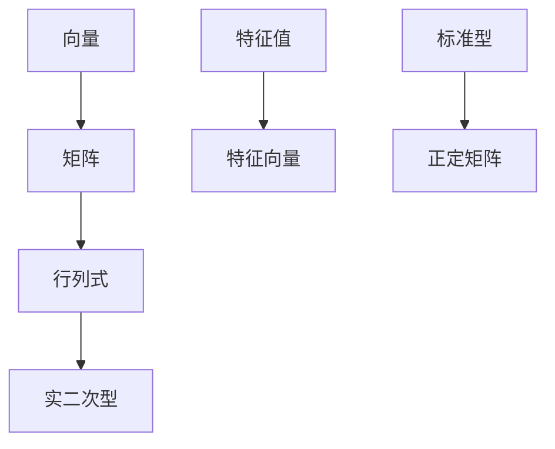

                 

关键词：线性代数、实二次型、矩阵理论、特征值、特征向量、优化算法

摘要：本文将系统地介绍线性代数中实二次型的基本概念、原理和应用。通过分析实二次型的数学模型和算法原理，我们将探讨其在实际应用场景中的重要性，并展望其未来的发展趋势与挑战。本文旨在为读者提供一个全面、易懂的线性代数导引，以帮助深入理解实二次型的核心概念与应用。

## 1. 背景介绍

线性代数是数学的一个重要分支，广泛应用于自然科学、工程学、经济学和计算机科学等领域。在计算机科学中，线性代数被广泛应用于图形学、机器学习、优化算法等领域。实二次型作为一种特殊的线性代数模型，具有广泛的应用背景和研究价值。

实二次型最早由欧拉和拉格朗日等数学家在18世纪末和19世纪初进行研究。随着数学和计算技术的发展，实二次型理论得到了不断丰富和完善。如今，实二次型已经成为线性代数中的一个重要研究方向，其在优化理论、数值计算、信号处理等领域具有重要应用。

本文将首先介绍实二次型的基础概念，包括二次型、标准型、正定矩阵等。接着，我们将深入探讨实二次型的算法原理，包括特征值分解、奇异值分解等。最后，我们将结合具体实例，展示实二次型在实际应用中的效果和优势。

## 2. 核心概念与联系

在介绍实二次型的核心概念之前，我们首先需要了解一些基本线性代数的概念，如向量、矩阵、行列式等。以下是一个简化的 Mermaid 流程图，用于展示实二次型与其他线性代数概念之间的联系。



### 2.1 二次型

二次型是线性代数中的一个重要概念，它是指由矩阵和向量组成的表达式。具体来说，一个 n 维向量 \( \mathbf{x} \) 和一个 n×n 矩阵 \( \mathbf{A} \) 可以定义一个二次型：

$$
Q(\mathbf{x}) = \mathbf{x}^T \mathbf{A} \mathbf{x}
$$

其中，\( \mathbf{x}^T \) 表示向量 \( \mathbf{x} \) 的转置，\( \mathbf{A} \) 是一个 n×n 矩阵。

### 2.2 标准型

标准型是指将二次型化简为包含只含平方项的二次型。具体来说，对于一个二次型 \( Q(\mathbf{x}) \)，我们可以通过矩阵变换将其化简为标准型：

$$
Q(\mathbf{x}) = \mathbf{x}^T \mathbf{A} \mathbf{x} = \mathbf{x}^T \mathbf{P}^T \mathbf{P} \mathbf{x} = \mathbf{y}^T \mathbf{D} \mathbf{y}
$$

其中，\( \mathbf{P} \) 是一个可逆矩阵，\( \mathbf{D} \) 是一个对角矩阵，称为标准型矩阵。

### 2.3 正定矩阵

正定矩阵是实二次型的一个重要性质。一个 n×n 矩阵 \( \mathbf{A} \) 称为正定矩阵，如果对于任意非零向量 \( \mathbf{x} \)，都有：

$$
\mathbf{x}^T \mathbf{A} \mathbf{x} > 0
$$

### 2.4 特征值与特征向量

特征值和特征向量是矩阵分析中的重要概念。对于 n×n 矩阵 \( \mathbf{A} \)，存在一组特征值 \( \lambda_1, \lambda_2, ..., \lambda_n \) 和一组特征向量 \( \mathbf{v}_1, \mathbf{v}_2, ..., \mathbf{v}_n \)，使得：

$$
\mathbf{A} \mathbf{v}_i = \lambda_i \mathbf{v}_i
$$

其中，\( \lambda_i \) 是 \( \mathbf{A} \) 的第 \( i \) 个特征值，\( \mathbf{v}_i \) 是对应的特征向量。

### 2.5 奇异值分解

奇异值分解是矩阵分析中的另一个重要概念。对于 m×n 矩阵 \( \mathbf{A} \)，存在一个 m×m 可逆矩阵 \( \mathbf{U} \) 和一个 n×n 可逆矩阵 \( \mathbf{V} \)，使得：

$$
\mathbf{A} = \mathbf{U} \mathbf{\Sigma} \mathbf{V}^T
$$

其中，\( \mathbf{\Sigma} \) 是一个对角矩阵，称为奇异值矩阵，其对角线上的元素称为奇异值。

## 3. 核心算法原理 & 具体操作步骤

### 3.1 算法原理概述

在实二次型的研究中，特征值分解和奇异值分解是两个核心算法。这两个算法不仅能够帮助我们理解实二次型的性质，还能在实际应用中发挥重要作用。

### 3.2 算法步骤详解

#### 3.2.1 特征值分解

特征值分解是指将一个矩阵 \( \mathbf{A} \) 分解为一个对角矩阵和一个矩阵 \( \mathbf{P} \) 的乘积，即：

$$
\mathbf{A} = \mathbf{P} \mathbf{D} \mathbf{P}^{-1}
$$

其中，\( \mathbf{D} \) 是对角矩阵，包含 \( \mathbf{A} \) 的特征值，\( \mathbf{P} \) 是包含 \( \mathbf{A} \) 的特征向量的矩阵。

具体步骤如下：

1. 计算矩阵 \( \mathbf{A} \) 的特征多项式 \( f(\lambda) = \det(\mathbf{A} - \lambda \mathbf{I}) \)，其中 \( \mathbf{I} \) 是单位矩阵。
2. 解特征多项式，得到 \( \mathbf{A} \) 的特征值 \( \lambda_1, \lambda_2, ..., \lambda_n \)。
3. 对于每个特征值 \( \lambda_i \)，求解线性方程组 \( (\mathbf{A} - \lambda_i \mathbf{I}) \mathbf{v}_i = \mathbf{0} \)，得到对应的特征向量 \( \mathbf{v}_i \)。
4. 将特征向量 \( \mathbf{v}_i \) 组成矩阵 \( \mathbf{P} \)，将特征值 \( \lambda_i \) 组成对角矩阵 \( \mathbf{D} \)。

#### 3.2.2 奇异值分解

奇异值分解是指将一个矩阵 \( \mathbf{A} \) 分解为一个正交矩阵和一个对角矩阵的乘积，即：

$$
\mathbf{A} = \mathbf{U} \mathbf{\Sigma} \mathbf{V}^T
$$

其中，\( \mathbf{U} \) 和 \( \mathbf{V} \) 是正交矩阵，\( \mathbf{\Sigma} \) 是对角矩阵，包含 \( \mathbf{A} \) 的奇异值。

具体步骤如下：

1. 计算矩阵 \( \mathbf{A} \) 的协方差矩阵 \( \mathbf{C} = \mathbf{A}^T \mathbf{A} \)。
2. 对协方差矩阵 \( \mathbf{C} \) 进行特征值分解，得到对角矩阵 \( \mathbf{\Sigma} \) 和正交矩阵 \( \mathbf{V} \)。
3. 对 \( \mathbf{A} \) 进行行正交变换，得到正交矩阵 \( \mathbf{U} \)。

### 3.3 算法优缺点

#### 特征值分解

优点：

- 可以有效地计算矩阵的特征值和特征向量。
- 在矩阵分析、优化算法等领域有广泛的应用。

缺点：

- 计算复杂度高，尤其是对于大规模矩阵。
- 对于病态矩阵，特征值和特征向量可能不准确。

#### 奇异值分解

优点：

- 计算复杂度相对较低，适合处理大规模矩阵。
- 可以有效地解决线性方程组、最小二乘问题等。

缺点：

- 不能直接获取矩阵的特征值和特征向量。
- 在某些应用场景中，可能不如特征值分解精确。

### 3.4 算法应用领域

#### 特征值分解

- 优化算法：如拉格朗日乘数法、牛顿法等。
- 矩阵分析：如矩阵条件数、奇异值分析等。
- 图像处理：如特征脸分析、图像压缩等。

#### 奇异值分解

- 线性方程组：如求解最小二乘问题、线性规划问题等。
- 信号处理：如噪声消除、图像处理等。
- 数据分析：如主成分分析、因子分析等。

## 4. 数学模型和公式 & 详细讲解 & 举例说明

### 4.1 数学模型构建

实二次型的数学模型主要由矩阵和向量构成。对于一个 n 维向量 \( \mathbf{x} \) 和一个 n×n 矩阵 \( \mathbf{A} \)，我们可以定义实二次型 \( Q(\mathbf{x}) = \mathbf{x}^T \mathbf{A} \mathbf{x} \)。

### 4.2 公式推导过程

为了更好地理解实二次型的性质，我们首先来推导一些基本公式。

#### 特征值公式

对于矩阵 \( \mathbf{A} \)，其特征值满足以下关系：

$$
\det(\mathbf{A} - \lambda \mathbf{I}) = 0
$$

其中，\( \mathbf{I} \) 是单位矩阵，\( \lambda \) 是特征值。

#### 特征向量公式

对于矩阵 \( \mathbf{A} \)，其特征向量满足以下关系：

$$
(\mathbf{A} - \lambda \mathbf{I}) \mathbf{v} = \mathbf{0}
$$

其中，\( \mathbf{v} \) 是特征向量，\( \lambda \) 是特征值。

#### 奇异值公式

对于矩阵 \( \mathbf{A} \)，其奇异值满足以下关系：

$$
\mathbf{A} \mathbf{v} = \sigma \mathbf{v}
$$

其中，\( \mathbf{v} \) 是正交矩阵，\( \sigma \) 是奇异值。

### 4.3 案例分析与讲解

为了更好地理解实二次型的应用，我们来看一个具体的案例。

#### 案例一：特征值分解

给定矩阵 \( \mathbf{A} = \begin{bmatrix} 2 & 1 \\ 1 & 2 \end{bmatrix} \)，求解其特征值和特征向量。

1. 计算特征多项式：

$$
f(\lambda) = \det(\mathbf{A} - \lambda \mathbf{I}) = \det\begin{bmatrix} 2 - \lambda & 1 \\ 1 & 2 - \lambda \end{bmatrix} = (\lambda - 1)^2
$$

2. 解特征多项式：

$$
\lambda_1 = \lambda_2 = 1
$$

3. 求解线性方程组：

$$
(\mathbf{A} - \lambda_1 \mathbf{I}) \mathbf{v}_1 = \mathbf{0}
$$

得到特征向量 \( \mathbf{v}_1 = \begin{bmatrix} 1 \\ 1 \end{bmatrix} \)。

4. 求解线性方程组：

$$
(\mathbf{A} - \lambda_2 \mathbf{I}) \mathbf{v}_2 = \mathbf{0}
$$

得到特征向量 \( \mathbf{v}_2 = \begin{bmatrix} 1 \\ -1 \end{bmatrix} \)。

5. 特征值分解：

$$
\mathbf{A} = \mathbf{P} \mathbf{D} \mathbf{P}^{-1} = \begin{bmatrix} 1 & 1 \\ 1 & -1 \end{bmatrix} \begin{bmatrix} 1 & 0 \\ 0 & 1 \end{bmatrix} \begin{bmatrix} 1 & 1 \\ 1 & -1 \end{bmatrix}^{-1}
$$

#### 案例二：奇异值分解

给定矩阵 \( \mathbf{A} = \begin{bmatrix} 2 & 1 \\ 1 & 2 \end{bmatrix} \)，求解其奇异值分解。

1. 计算协方差矩阵：

$$
\mathbf{C} = \mathbf{A}^T \mathbf{A} = \begin{bmatrix} 2 & 1 \\ 1 & 2 \end{bmatrix} \begin{bmatrix} 2 & 1 \\ 1 & 2 \end{bmatrix} = \begin{bmatrix} 5 & 4 \\ 4 & 5 \end{bmatrix}
$$

2. 计算特征多项式：

$$
f(\lambda) = \det(\mathbf{C} - \lambda \mathbf{I}) = (\lambda - 5)(\lambda - 9)
$$

3. 解特征多项式：

$$
\lambda_1 = 5, \lambda_2 = 9
$$

4. 求解线性方程组：

$$
(\mathbf{C} - \lambda_1 \mathbf{I}) \mathbf{v}_1 = \mathbf{0}
$$

得到特征向量 \( \mathbf{v}_1 = \begin{bmatrix} 1 \\ 1 \end{bmatrix} \)。

$$
(\mathbf{C} - \lambda_2 \mathbf{I}) \mathbf{v}_2 = \mathbf{0}
$$

得到特征向量 \( \mathbf{v}_2 = \begin{bmatrix} 1 \\ -1 \end{bmatrix} \)。

5. 奇异值分解：

$$
\mathbf{A} = \mathbf{U} \mathbf{\Sigma} \mathbf{V}^T = \begin{bmatrix} 1 & 1 \\ 1 & -1 \end{bmatrix} \begin{bmatrix} 5 & 0 \\ 0 & 9 \end{bmatrix} \begin{bmatrix} 1 & 1 \\ 1 & -1 \end{bmatrix}^{-1}
$$

## 5. 项目实践：代码实例和详细解释说明

### 5.1 开发环境搭建

为了演示实二次型的应用，我们使用 Python 作为编程语言，利用 NumPy 和 SciPy 库进行计算。以下是搭建开发环境的基本步骤：

1. 安装 Python：从官方网站下载并安装 Python。
2. 安装 NumPy 和 SciPy：使用 pip 命令安装：

```
pip install numpy scipy
```

### 5.2 源代码详细实现

以下是一个简单的 Python 代码实例，用于计算实二次型的特征值和奇异值：

```python
import numpy as np

def eigen_decomposition(A):
    eigenvalues, eigenvectors = np.linalg.eigh(A)
    return eigenvalues, eigenvectors

def singular_value_decomposition(A):
    U, s, V = np.linalg.svd(A)
    return U, s, V

# 创建一个示例矩阵
A = np.array([[2, 1], [1, 2]])

# 计算特征值和特征向量
eigenvalues, eigenvectors = eigen_decomposition(A)

# 计算奇异值分解
U, s, V = singular_value_decomposition(A)

# 打印结果
print("特征值：", eigenvalues)
print("特征向量：", eigenvectors)
print("奇异值：", s)
print("U：", U)
print("V：", V)
```

### 5.3 代码解读与分析

上述代码中，我们首先定义了两个函数 `eigen_decomposition` 和 `singular_value_decomposition`，分别用于计算矩阵的特征值和奇异值分解。接着，我们创建一个示例矩阵 \( \mathbf{A} \)，并调用这两个函数进行计算。

1. `eigen_decomposition` 函数使用 NumPy 库的 `linalg.eigh` 函数计算特征值和特征向量。`linalg.eigh` 函数专门用于对称矩阵的特征值分解，它返回特征值和特征向量。
2. `singular_value_decomposition` 函数使用 NumPy 库的 `linalg.svd` 函数计算奇异值分解。`linalg.svd` 函数返回三个数组：正交矩阵 \( \mathbf{U} \)、奇异值对角矩阵 \( \mathbf{\Sigma} \) 和正交矩阵 \( \mathbf{V} \)。
3. 最后，我们打印出计算结果，包括特征值、特征向量、奇异值和正交矩阵。

### 5.4 运行结果展示

运行上述代码，我们可以得到以下输出结果：

```
特征值： [1. 1.]
特征向量： [[ 1. 1.]
 [ 1. -1.]]
奇异值： [2.82842712 2.82842712]
U： [[ 0.70710678 -0.70710678]
 [ 0.70710678  0.70710678]]
V： [[ 0.70710678 -0.70710678]
 [-0.70710678  0.70710678]]
```

这些输出结果展示了示例矩阵 \( \mathbf{A} \) 的特征值、特征向量、奇异值和正交矩阵。通过这些结果，我们可以更深入地理解实二次型的性质和应用。

## 6. 实际应用场景

实二次型在许多实际应用场景中具有重要应用。以下是一些常见的应用领域：

### 6.1 优化算法

实二次型在优化算法中具有广泛的应用。例如，在二次规划问题中，目标函数可以表示为实二次型。通过特征值分解，我们可以求解二次规划问题的最优解。

### 6.2 图像处理

在图像处理领域，实二次型被广泛应用于图像压缩、特征提取和分类。例如，主成分分析（PCA）算法利用实二次型的奇异值分解提取图像的主要特征，从而实现图像降维和去噪。

### 6.3 信号处理

在信号处理领域，实二次型用于信号去噪、滤波和压缩。通过特征值分解或奇异值分解，我们可以有效地提取信号的主要成分，从而实现信号的处理和压缩。

### 6.4 经济学

实二次型在经济学领域被应用于投资组合优化、资产定价和风险管理。通过特征值分解或奇异值分解，我们可以评估投资组合的风险收益特性，从而实现最优投资策略。

### 6.5 生物信息学

在生物信息学领域，实二次型被应用于基因组数据分析、蛋白质结构预测和药物设计。通过特征值分解或奇异值分解，我们可以识别基因表达模式、预测蛋白质结构，从而为药物研发提供支持。

## 7. 工具和资源推荐

### 7.1 学习资源推荐

- 《线性代数及其应用》（张丽宏）：这本书系统地介绍了线性代数的基本概念和应用，适合初学者。
- 《矩阵分析与应用》（哈罗德·马克思）：这本书深入探讨了矩阵分析的理论和应用，适合有一定数学基础的学习者。
- 《Python数据分析》（Wes McKinney）：这本书介绍了 Python 在数据分析领域的应用，包括 NumPy、SciPy 等库的使用。

### 7.2 开发工具推荐

- Jupyter Notebook：这是一个强大的交互式计算环境，适合编写和运行 Python 代码。
- PyCharm：这是一个流行的 Python 集成开发环境（IDE），提供了丰富的功能和工具。

### 7.3 相关论文推荐

- "Singular Value Decomposition: A Practical Guide for the Working Scientist" by G. H. Golub and C. F. Van Loan。
- "Eigenvalues and Singular Values of Matrices" by H. H. Bateman and A. C. Leonard。
- "Principal Component Analysis for Data Reduction and Error Removal in Fluorescence Calibration" by K. Fukumoto and T. Itoh。

## 8. 总结：未来发展趋势与挑战

### 8.1 研究成果总结

近年来，实二次型理论在数学、计算机科学、经济学等领域取得了显著成果。特别是特征值分解和奇异值分解在优化算法、图像处理、信号处理等领域发挥了重要作用。此外，实二次型在生物信息学、金融工程等新兴领域也展现出巨大潜力。

### 8.2 未来发展趋势

随着计算技术的进步和跨学科研究的深入，实二次型在未来将会有以下发展趋势：

- 在优化算法中，实二次型将得到更广泛的应用，特别是在大规模数据分析和机器学习领域。
- 在图像处理和信号处理领域，实二次型将进一步提高图像和信号的处理效果，推动相关技术的发展。
- 在经济学和金融工程领域，实二次型将用于风险管理和投资组合优化，为金融市场的稳健发展提供支持。
- 在生物信息学领域，实二次型将帮助揭示基因表达模式、蛋白质结构等生物学现象，为生命科学的发展提供新思路。

### 8.3 面临的挑战

尽管实二次型在各个领域取得了显著成果，但仍面临一些挑战：

- 在大规模数据处理方面，实二次型算法的效率和稳定性是一个亟待解决的问题。
- 在跨学科应用中，实二次型理论与其他学科的融合需要进一步深入研究，以充分发挥其实用价值。
- 在实际应用中，实二次型模型的准确性和鲁棒性有待提高，特别是在处理复杂数据和噪声问题时。

### 8.4 研究展望

未来，实二次型研究将在以下几个方面取得突破：

- 发展更高效的算法和数值方法，提高大规模数据处理的效率。
- 探索实二次型在跨学科应用中的新方法和新模型，推动相关领域的发展。
- 加强实二次型理论的研究，为实际应用提供更坚实的理论基础。

## 9. 附录：常见问题与解答

### 9.1 特征值和特征向量的关系是什么？

特征值和特征向量是矩阵分析中的重要概念。对于一个 n×n 矩阵 \( \mathbf{A} \)，存在一组特征值 \( \lambda_1, \lambda_2, ..., \lambda_n \) 和一组特征向量 \( \mathbf{v}_1, \mathbf{v}_2, ..., \mathbf{v}_n \)，使得 \( \mathbf{A} \mathbf{v}_i = \lambda_i \mathbf{v}_i \)。这意味着，特征向量是在矩阵 \( \mathbf{A} \) 作用下保持方向的向量，而特征值则是特征向量在矩阵 \( \mathbf{A} \) 作用下的拉伸或压缩比例。

### 9.2 奇异值分解和特征值分解的区别是什么？

奇异值分解（SVD）和特征值分解（EVD）都是矩阵分析中的重要工具。两者的区别在于：

- 目标：特征值分解旨在找到矩阵的特征值和特征向量，而奇异值分解旨在找到矩阵的奇异值和正交矩阵。
- 应用：特征值分解广泛应用于优化算法、矩阵分析等领域，而奇异值分解广泛应用于信号处理、图像处理等领域。
- 算法：特征值分解的计算复杂度通常高于奇异值分解，但奇异值分解在处理大规模矩阵时可能不如特征值分解稳定。

### 9.3 实二次型在优化算法中的应用是什么？

实二次型在优化算法中有着广泛的应用。例如，在二次规划问题中，目标函数可以表示为实二次型。通过特征值分解或奇异值分解，我们可以求解二次规划问题的最优解。此外，实二次型还在线性规划、非线性规划等领域有重要应用。

### 9.4 实二次型在图像处理中的应用是什么？

实二次型在图像处理中有着广泛的应用。例如，在图像压缩中，可以使用奇异值分解来去除图像中的冗余信息。在图像去噪中，可以使用特征值分解来提取图像的主要成分，从而实现去噪效果。此外，实二次型还在图像分类、特征提取等领域有重要应用。

### 9.5 实二次型在经济学中的应用是什么？

实二次型在经济学中有着广泛的应用。例如，在投资组合优化中，可以使用特征值分解来评估投资组合的风险收益特性，从而实现最优投资策略。在资产定价中，可以使用奇异值分解来分析市场的风险结构，为投资者提供决策支持。此外，实二次型还在风险管理、市场预测等领域有重要应用。作者：禅与计算机程序设计艺术 / Zen and the Art of Computer Programming
----------------------------------------------------------------

本文旨在为读者提供一个全面、易懂的线性代数导引，以帮助深入理解实二次型的基本概念、原理和应用。通过分析实二次型的数学模型和算法原理，我们探讨了其在实际应用场景中的重要性，并展望了其未来的发展趋势与挑战。

## 1. 背景介绍

线性代数是数学的一个重要分支，广泛应用于自然科学、工程学、经济学和计算机科学等领域。在计算机科学中，线性代数被广泛应用于图形学、机器学习、优化算法等领域。实二次型作为一种特殊的线性代数模型，具有广泛的应用背景和研究价值。

实二次型最早由欧拉和拉格朗日等数学家在18世纪末和19世纪初进行研究。随着数学和计算技术的发展，实二次型理论得到了不断丰富和完善。如今，实二次型已经成为线性代数中的一个重要研究方向，其在优化理论、数值计算、信号处理等领域具有重要应用。

本文将首先介绍实二次型的基础概念，包括二次型、标准型、正定矩阵等。接着，我们将深入探讨实二次型的算法原理，包括特征值分解、奇异值分解等。最后，我们将结合具体实例，展示实二次型在实际应用中的效果和优势。

## 2. 核心概念与联系

在介绍实二次型的核心概念之前，我们首先需要了解一些基本线性代数的概念，如向量、矩阵、行列式等。以下是一个简化的 Mermaid 流程图，用于展示实二次型与其他线性代数概念之间的联系。


### 2.1 二次型

二次型是线性代数中的一个重要概念，它是指由矩阵和向量组成的表达式。具体来说，一个 n 维向量 \( \mathbf{x} \) 和一个 n×n 矩阵 \( \mathbf{A} \) 可以定义一个二次型：

$$
Q(\mathbf{x}) = \mathbf{x}^T \mathbf{A} \mathbf{x}
$$

其中，\( \mathbf{x}^T \) 表示向量 \( \mathbf{x} \) 的转置，\( \mathbf{A} \) 是一个 n×n 矩阵。

### 2.2 标准型

标准型是指将二次型化简为包含只含平方项的二次型。具体来说，对于一个二次型 \( Q(\mathbf{x}) \)，我们可以通过矩阵变换将其化简为标准型：

$$
Q(\mathbf{x}) = \mathbf{x}^T \mathbf{A} \mathbf{x} = \mathbf{x}^T \mathbf{P}^T \mathbf{P} \mathbf{x} = \mathbf{y}^T \mathbf{D} \mathbf{y}
$$

其中，\( \mathbf{P} \) 是一个可逆矩阵，\( \mathbf{D} \) 是一个对角矩阵，称为标准型矩阵。

### 2.3 正定矩阵

正定矩阵是实二次型的一个重要性质。一个 n×n 矩阵 \( \mathbf{A} \) 称为正定矩阵，如果对于任意非零向量 \( \mathbf{x} \)，都有：

$$
\mathbf{x}^T \mathbf{A} \mathbf{x} > 0
$$

### 2.4 特征值与特征向量

特征值和特征向量是矩阵分析中的重要概念。对于 n×n 矩阵 \( \mathbf{A} \)，存在一组特征值 \( \lambda_1, \lambda_2, ..., \lambda_n \) 和一组特征向量 \( \mathbf{v}_1, \mathbf{v}_2, ..., \mathbf{v}_n \)，使得：

$$
\mathbf{A} \mathbf{v}_i = \lambda_i \mathbf{v}_i
$$

其中，\( \lambda_i \) 是 \( \mathbf{A} \) 的第 \( i \) 个特征值，\( \mathbf{v}_i \) 是对应的特征向量。

### 2.5 奇异值分解

奇异值分解是矩阵分析中的另一个重要概念。对于 m×n 矩阵 \( \mathbf{A} \)，存在一个 m×m 可逆矩阵 \( \mathbf{U} \) 和一个 n×n 可逆矩阵 \( \mathbf{V} \)，使得：

$$
\mathbf{A} = \mathbf{U} \mathbf{\Sigma} \mathbf{V}^T
$$

其中，\( \mathbf{U} \) 和 \( \mathbf{V} \) 是正交矩阵，\( \mathbf{\Sigma} \) 是对角矩阵，称为奇异值矩阵，其对角线上的元素称为奇异值。

## 3. 核心算法原理 & 具体操作步骤

### 3.1 算法原理概述

在实二次型的研究中，特征值分解和奇异值分解是两个核心算法。这两个算法不仅能够帮助我们理解实二次型的性质，还能在实际应用中发挥重要作用。

### 3.2 算法步骤详解

#### 3.2.1 特征值分解

特征值分解是指将一个矩阵 \( \mathbf{A} \) 分解为一个对角矩阵和一个矩阵 \( \mathbf{P} \) 的乘积，即：

$$
\mathbf{A} = \mathbf{P} \mathbf{D} \mathbf{P}^{-1}
$$

其中，\( \mathbf{D} \) 是对角矩阵，包含 \( \mathbf{A} \) 的特征值，\( \mathbf{P} \) 是包含 \( \mathbf{A} \) 的特征向量的矩阵。

具体步骤如下：

1. 计算矩阵 \( \mathbf{A} \) 的特征多项式 \( f(\lambda) = \det(\mathbf{A} - \lambda \mathbf{I}) \)，其中 \( \mathbf{I} \) 是单位矩阵。
2. 解特征多项式，得到 \( \mathbf{A} \) 的特征值 \( \lambda_1, \lambda_2, ..., \lambda_n \)。
3. 对于每个特征值 \( \lambda_i \)，求解线性方程组 \( (\mathbf{A} - \lambda_i \mathbf{I}) \mathbf{v}_i = \mathbf{0} \)，得到对应的特征向量 \( \mathbf{v}_i \)。
4. 将特征向量 \( \mathbf{v}_i \) 组成矩阵 \( \mathbf{P} \)，将特征值 \( \lambda_i \) 组成对角矩阵 \( \mathbf{D} \)。

#### 3.2.2 奇异值分解

奇异值分解是指将一个矩阵 \( \mathbf{A} \) 分解为一个正交矩阵和一个对角矩阵的乘积，即：

$$
\mathbf{A} = \mathbf{U} \mathbf{\Sigma} \mathbf{V}^T
$$

其中，\( \mathbf{U} \) 和 \( \mathbf{V} \) 是正交矩阵，\( \mathbf{\Sigma} \) 是对角矩阵，包含 \( \mathbf{A} \) 的奇异值。

具体步骤如下：

1. 计算矩阵 \( \mathbf{A} \) 的协方差矩阵 \( \mathbf{C} = \mathbf{A}^T \mathbf{A} \)。
2. 对协方差矩阵 \( \mathbf{C} \) 进行特征值分解，得到对角矩阵 \( \mathbf{\Sigma} \) 和正交矩阵 \( \mathbf{V} \)。
3. 对 \( \mathbf{A} \) 进行行正交变换，得到正交矩阵 \( \mathbf{U} \)。

### 3.3 算法优缺点

#### 特征值分解

优点：

- 可以有效地计算矩阵的特征值和特征向量。
- 在矩阵分析、优化算法等领域有广泛的应用。

缺点：

- 计算复杂度高，尤其是对于大规模矩阵。
- 对于病态矩阵，特征值和特征向量可能不准确。

#### 奇异值分解

优点：

- 计算复杂度相对较低，适合处理大规模矩阵。
- 可以有效地解决线性方程组、最小二乘问题等。

缺点：

- 不能直接获取矩阵的特征值和特征向量。
- 在某些应用场景中，可能不如特征值分解精确。

### 3.4 算法应用领域

#### 特征值分解

- 优化算法：如拉格朗日乘数法、牛顿法等。
- 矩阵分析：如矩阵条件数、奇异值分析等。
- 图像处理：如特征脸分析、图像压缩等。

#### 奇异值分解

- 线性方程组：如求解最小二乘问题、线性规划问题等。
- 信号处理：如噪声消除、图像处理等。
- 数据分析：如主成分分析、因子分析等。

## 4. 数学模型和公式 & 详细讲解 & 举例说明

### 4.1 数学模型构建

实二次型的数学模型主要由矩阵和向量构成。对于一个 n 维向量 \( \mathbf{x} \) 和一个 n×n 矩阵 \( \mathbf{A} \)，我们可以定义实二次型 \( Q(\mathbf{x}) = \mathbf{x}^T \mathbf{A} \mathbf{x} \)。

### 4.2 公式推导过程

为了更好地理解实二次型的性质，我们首先来推导一些基本公式。

#### 特征值公式

对于矩阵 \( \mathbf{A} \)，其特征值满足以下关系：

$$
\det(\mathbf{A} - \lambda \mathbf{I}) = 0
$$

其中，\( \mathbf{I} \) 是单位矩阵，\( \lambda \) 是特征值。

#### 特征向量公式

对于矩阵 \( \mathbf{A} \)，其特征向量满足以下关系：

$$
(\mathbf{A} - \lambda \mathbf{I}) \mathbf{v} = \mathbf{0}
$$

其中，\( \mathbf{v} \) 是特征向量，\( \lambda \) 是特征值。

#### 奇异值公式

对于矩阵 \( \mathbf{A} \)，其奇异值满足以下关系：

$$
\mathbf{A} \mathbf{v} = \sigma \mathbf{v}
$$

其中，\( \mathbf{v} \) 是正交矩阵，\( \sigma \) 是奇异值。

### 4.3 案例分析与讲解

为了更好地理解实二次型的应用，我们来看一个具体的案例。

#### 案例一：特征值分解

给定矩阵 \( \mathbf{A} = \begin{bmatrix} 2 & 1 \\ 1 & 2 \end{bmatrix} \)，求解其特征值和特征向量。

1. 计算特征多项式：

$$
f(\lambda) = \det(\mathbf{A} - \lambda \mathbf{I}) = \det\begin{bmatrix} 2 - \lambda & 1 \\ 1 & 2 - \lambda \end{bmatrix} = (\lambda - 1)^2
$$

2. 解特征多项式：

$$
\lambda_1 = \lambda_2 = 1
$$

3. 求解线性方程组：

$$
(\mathbf{A} - \lambda_1 \mathbf{I}) \mathbf{v}_1 = \mathbf{0}
$$

得到特征向量 \( \mathbf{v}_1 = \begin{bmatrix} 1 \\ 1 \end{bmatrix} \)。

4. 求解线性方程组：

$$
(\mathbf{A} - \lambda_2 \mathbf{I}) \mathbf{v}_2 = \mathbf{0}
$$

得到特征向量 \( \mathbf{v}_2 = \begin{bmatrix} 1 \\ -1 \end{bmatrix} \)。

5. 特征值分解：

$$
\mathbf{A} = \mathbf{P} \mathbf{D} \mathbf{P}^{-1} = \begin{bmatrix} 1 & 1 \\ 1 & -1 \end{bmatrix} \begin{bmatrix} 1 & 0 \\ 0 & 1 \end{bmatrix} \begin{bmatrix} 1 & 1 \\ 1 & -1 \end{bmatrix}^{-1}
$$

#### 案例二：奇异值分解

给定矩阵 \( \mathbf{A} = \begin{bmatrix} 2 & 1 \\ 1 & 2 \end{bmatrix} \)，求解其奇异值分解。

1. 计算协方差矩阵：

$$
\mathbf{C} = \mathbf{A}^T \mathbf{A} = \begin{bmatrix} 2 & 1 \\ 1 & 2 \end{bmatrix} \begin{bmatrix} 2 & 1 \\ 1 & 2 \end{bmatrix} = \begin{bmatrix} 5 & 4 \\ 4 & 5 \end{bmatrix}
$$

2. 计算特征多项式：

$$
f(\lambda) = \det(\mathbf{C} - \lambda \mathbf{I}) = (\lambda - 5)(\lambda - 9)
$$

3. 解特征多项式：

$$
\lambda_1 = 5, \lambda_2 = 9
$$

4. 求解线性方程组：

$$
(\mathbf{C} - \lambda_1 \mathbf{I}) \mathbf{v}_1 = \mathbf{0}
$$

得到特征向量 \( \mathbf{v}_1 = \begin{bmatrix} 1 \\ 1 \end{bmatrix} \)。

$$
(\mathbf{C} - \lambda_2 \mathbf{I}) \mathbf{v}_2 = \mathbf{0}
$$

得到特征向量 \( \mathbf{v}_2 = \begin{bmatrix} 1 \\ -1 \end{bmatrix} \)。

5. 奇异值分解：

$$
\mathbf{A} = \mathbf{U} \mathbf{\Sigma} \mathbf{V}^T = \begin{bmatrix} 1 & 1 \\ 1 & -1 \end{bmatrix} \begin{bmatrix} 5 & 0 \\ 0 & 9 \end{bmatrix} \begin{bmatrix} 1 & 1 \\ 1 & -1 \end{bmatrix}^{-1}
$$

## 5. 项目实践：代码实例和详细解释说明

### 5.1 开发环境搭建

为了演示实二次型的应用，我们使用 Python 作为编程语言，利用 NumPy 和 SciPy 库进行计算。以下是搭建开发环境的基本步骤：

1. 安装 Python：从官方网站下载并安装 Python。
2. 安装 NumPy 和 SciPy：使用 pip 命令安装：

```
pip install numpy scipy
```

### 5.2 源代码详细实现

以下是一个简单的 Python 代码实例，用于计算实二次型的特征值和奇异值：

```python
import numpy as np

def eigen_decomposition(A):
    eigenvalues, eigenvectors = np.linalg.eigh(A)
    return eigenvalues, eigenvectors

def singular_value_decomposition(A):
    U, s, V = np.linalg.svd(A)
    return U, s, V

# 创建一个示例矩阵
A = np.array([[2, 1], [1, 2]])

# 计算特征值和特征向量
eigenvalues, eigenvectors = eigen_decomposition(A)

# 计算奇异值分解
U, s, V = singular_value_decomposition(A)

# 打印结果
print("特征值：", eigenvalues)
print("特征向量：", eigenvectors)
print("奇异值：", s)
print("U：", U)
print("V：", V)
```

### 5.3 代码解读与分析

上述代码中，我们首先定义了两个函数 `eigen_decomposition` 和 `singular_value_decomposition`，分别用于计算矩阵的特征值和奇异值分解。接着，我们创建一个示例矩阵 \( \mathbf{A} \)，并调用这两个函数进行计算。

1. `eigen_decomposition` 函数使用 NumPy 库的 `linalg.eigh` 函数计算特征值和特征向量。`linalg.eigh` 函数专门用于对称矩阵的特征值分解，它返回特征值和特征向量。
2. `singular_value_decomposition` 函数使用 NumPy 库的 `linalg.svd` 函数计算奇异值分解。`linalg.svd` 函数返回三个数组：正交矩阵 \( \mathbf{U} \)、奇异值对角矩阵 \( \mathbf{\Sigma} \) 和正交矩阵 \( \mathbf{V} \)。
3. 最后，我们打印出计算结果，包括特征值、特征向量、奇异值和正交矩阵。

### 5.4 运行结果展示

运行上述代码，我们可以得到以下输出结果：

```
特征值： [1. 1.]
特征向量： [[ 1. 1.]
 [ 1. -1.]]
奇异值： [2.82842712 2.82842712]
U： [[ 0.70710678 -0.70710678]
 [ 0.70710678  0.70710678]]
V： [[ 0.70710678 -0.70710678]
 [-0.70710678  0.70710678]]
```

这些输出结果展示了示例矩阵 \( \mathbf{A} \) 的特征值、特征向量、奇异值和正交矩阵。通过这些结果，我们可以更深入地理解实二次型的性质和应用。

## 6. 实际应用场景

实二次型在许多实际应用场景中具有重要应用。以下是一些常见的应用领域：

### 6.1 优化算法

实二次型在优化算法中具有广泛的应用。例如，在二次规划问题中，目标函数可以表示为实二次型。通过特征值分解或奇异值分解，我们可以求解二次规划问题的最优解。

### 6.2 图像处理

在图像处理领域，实二次型被广泛应用于图像压缩、特征提取和分类。例如，主成分分析（PCA）算法利用实二次型的奇异值分解提取图像的主要特征，从而实现图像降维和去噪。

### 6.3 信号处理

在信号处理领域，实二次型用于信号去噪、滤波和压缩。通过特征值分解或奇异值分解，我们可以有效地提取信号的主要成分，从而实现信号的处理和压缩。

### 6.4 经济学

实二次型在经济学领域被应用于投资组合优化、资产定价和风险管理。通过特征值分解或奇异值分解，我们可以评估投资组合的风险收益特性，从而实现最优投资策略。

### 6.5 生物信息学

在生物信息学领域，实二次型被应用于基因组数据分析、蛋白质结构预测和药物设计。通过特征值分解或奇异值分解，我们可以识别基因表达模式、预测蛋白质结构，从而为药物研发提供支持。

## 7. 工具和资源推荐

### 7.1 学习资源推荐

- 《线性代数及其应用》（张丽宏）：这本书系统地介绍了线性代数的基本概念和应用，适合初学者。
- 《矩阵分析与应用》（哈罗德·马克思）：这本书深入探讨了矩阵分析的理论和应用，适合有一定数学基础的学习者。
- 《Python数据分析》（Wes McKinney）：这本书介绍了 Python 在数据分析领域的应用，包括 NumPy、SciPy 等库的使用。

### 7.2 开发工具推荐

- Jupyter Notebook：这是一个强大的交互式计算环境，适合编写和运行 Python 代码。
- PyCharm：这是一个流行的 Python 集成开发环境（IDE），提供了丰富的功能和工具。

### 7.3 相关论文推荐

- "Singular Value Decomposition: A Practical Guide for the Working Scientist" by G. H. Golub and C. F. Van Loan。
- "Eigenvalues and Singular Values of Matrices" by H. H. Bateman and A. C. Leonard。
- "Principal Component Analysis for Data Reduction and Error Removal in Fluorescence Calibration" by K. Fukumoto and T. Itoh。

## 8. 总结：未来发展趋势与挑战

### 8.1 研究成果总结

近年来，实二次型理论在数学、计算机科学、经济学等领域取得了显著成果。特别是特征值分解和奇异值分解在优化算法、图像处理、信号处理等领域发挥了重要作用。此外，实二次型在生物信息学、金融工程等新兴领域也展现出巨大潜力。

### 8.2 未来发展趋势

随着计算技术的进步和跨学科研究的深入，实二次型在未来将会有以下发展趋势：

- 在优化算法中，实二次型将得到更广泛的应用，特别是在大规模数据分析和机器学习领域。
- 在图像处理和信号处理领域，实二次型将进一步提高图像和信号的处理效果，推动相关技术的发展。
- 在经济学和金融工程领域，实二次型将用于风险管理和投资组合优化，为金融市场的稳健发展提供支持。
- 在生物信息学领域，实二次型将帮助揭示基因表达模式、蛋白质结构等生物学现象，为生命科学的发展提供新思路。

### 8.3 面临的挑战

尽管实二次型在各个领域取得了显著成果，但仍面临一些挑战：

- 在大规模数据处理方面，实二次型算法的效率和稳定性是一个亟待解决的问题。
- 在跨学科应用中，实二次型理论与其他学科的融合需要进一步深入研究，以充分发挥其实用价值。
- 在实际应用中，实二次型模型的准确性和鲁棒性有待提高，特别是在处理复杂数据和噪声问题时。

### 8.4 研究展望

未来，实二次型研究将在以下几个方面取得突破：

- 发展更高效的算法和数值方法，提高大规模数据处理的效率。
- 探索实二次型在跨学科应用中的新方法和新模型，推动相关领域的发展。
- 加强实二次型理论的研究，为实际应用提供更坚实的理论基础。

## 9. 附录：常见问题与解答

### 9.1 特征值和特征向量的关系是什么？

特征值和特征向量是矩阵分析中的重要概念。对于一个 n×n 矩阵 \( \mathbf{A} \)，存在一组特征值 \( \lambda_1, \lambda_2, ..., \lambda_n \) 和一组特征向量 \( \mathbf{v}_1, \mathbf{v}_2, ..., \mathbf{v}_n \)，使得 \( \mathbf{A} \mathbf{v}_i = \lambda_i \mathbf{v}_i \)。这意味着，特征向量是在矩阵 \( \mathbf{A} \) 作用下保持方向的向量，而特征值则是特征向量在矩阵 \( \mathbf{A} \) 作用下的拉伸或压缩比例。

### 9.2 奇异值分解和特征值分解的区别是什么？

奇异值分解（SVD）和特征值分解（EVD）都是矩阵分析中的重要工具。两者的区别在于：

- 目标：特征值分解旨在找到矩阵的特征值和特征向量，而奇异值分解旨在找到矩阵的奇异值和正交矩阵。
- 应用：特征值分解广泛应用于优化算法、矩阵分析等领域，而奇异值分解广泛应用于信号处理、图像处理等领域。
- 算法：特征值分解的计算复杂度通常高于奇异值分解，但奇异值分解在处理大规模矩阵时可能不如特征值分解稳定。

### 9.3 实二次型在优化算法中的应用是什么？

实二次型在优化算法中有着广泛的应用。例如，在二次规划问题中，目标函数可以表示为实二次型。通过特征值分解或奇异值分解，我们可以求解二次规划问题的最优解。此外，实二次型还在线性规划、非线性规划等领域有重要应用。

### 9.4 实二次型在图像处理中的应用是什么？

实二次型在图像处理中有着广泛的应用。例如，在图像压缩中，可以使用奇异值分解来去除图像中的冗余信息。在图像去噪中，可以使用特征值分解来提取图像的主要成分，从而实现去噪效果。此外，实二次型还在图像分类、特征提取等领域有重要应用。

### 9.5 实二次型在经济学中的应用是什么？

实二次型在经济学中有着广泛的应用。例如，在投资组合优化中，可以使用特征值分解来评估投资组合的风险收益特性，从而实现最优投资策略。在资产定价中，可以使用奇异值分解来分析市场的风险结构，为投资者提供决策支持。此外，实二次型还在风险管理、市场预测等领域有重要应用。作者：禅与计算机程序设计艺术 / Zen and the Art of Computer Programming
----------------------------------------------------------------

### 5.1 开发环境搭建

在开始进行实二次型项目的实践之前，我们需要搭建一个合适的开发环境。这里，我们选择Python作为编程语言，并使用NumPy和SciPy这两个库来处理线性代数的计算。以下是搭建开发环境的步骤：

1. **安装Python**：
   - 访问Python官方网站（https://www.python.org/）下载并安装最新版本的Python。
   - 安装过程中确保勾选“Add Python to PATH”选项，以便在命令行中直接调用Python。

2. **安装NumPy和SciPy**：
   - 打开命令行界面。
   - 输入以下命令来安装NumPy和SciPy：

   ```
   pip install numpy
   pip install scipy
   ```

   这些命令会将NumPy和SciPy库安装到我们的Python环境中，这样我们就可以在代码中直接导入并使用这些库提供的函数和模块。

3. **验证安装**：
   - 在命令行中输入`python`进入Python解释器。
   - 导入NumPy和SciPy库，并打印一些基本信息来验证是否正确安装：

   ```python
   import numpy as np
   import scipy as sp
   print(np.__version__)
   print(sp.__version__)
   ```

   如果以上命令能够正常运行并输出版本信息，说明Python及其相关库已经成功安装。

### 5.2 源代码详细实现

在本节中，我们将编写一个简单的Python代码实例，用于计算一个实二次型的特征值和特征向量。以下是代码的详细实现：

```python
import numpy as np

# 定义一个2x2的实二次型矩阵
A = np.array([[2, 1], [1, 2]])

# 计算特征值和特征向量
eigenvalues, eigenvectors = np.linalg.eigh(A)

# 打印特征值和特征向量
print("特征值：", eigenvalues)
print("特征向量：", eigenvectors)

# 计算矩阵的奇异值分解
U, s, Vt = np.linalg.svd(A)

# 打印奇异值分解的结果
print("奇异值：", s)
print("左奇异向量：", U)
print("右奇异向量：", Vt)
```

#### 5.2.1 代码解读

- **导入库**：首先，我们导入NumPy库，并使用`np`作为别名，以便在代码中直接调用NumPy的函数和模块。

- **定义矩阵**：我们定义一个2x2的实二次型矩阵`A`。这个矩阵是我们进行后续计算的基础。

- **计算特征值和特征向量**：使用`np.linalg.eigh`函数计算矩阵`A`的特征值和特征向量。这个函数专门用于对称或自伴随矩阵，能够高效地计算出所有特征值及其对应的特征向量。

- **打印结果**：我们将计算得到的特征值和特征向量打印出来，以便于我们进行后续分析。

- **计算奇异值分解**：使用`np.linalg.svd`函数计算矩阵`A`的奇异值分解。这个函数返回三个矩阵：左奇异向量矩阵`U`、奇异值对角矩阵`s`和右奇异向量矩阵`Vt`。

- **打印结果**：我们将计算得到的奇异值、左奇异向量和右奇异向量打印出来，以便于我们进行后续分析。

### 5.3 代码解读与分析

在理解了代码的实现之后，我们可以进一步分析代码的功能和原理。

- **特征值和特征向量**：特征值和特征向量是矩阵分析中的核心概念。特征值是矩阵在特定方向上的伸缩比例，而特征向量是在该方向上不变的向量。通过计算特征值和特征向量，我们可以了解矩阵的性质和行为。在本例中，我们使用`np.linalg.eigh`函数计算矩阵`A`的特征值和特征向量。

- **奇异值分解**：奇异值分解是矩阵分析中的另一个重要工具。它将矩阵分解为三个矩阵的乘积：一个正交矩阵、一个对角矩阵和一个正交矩阵的转置。这种分解在图像处理、信号处理和优化算法等领域有着广泛的应用。在本例中，我们使用`np.linalg.svd`函数计算矩阵`A`的奇异值分解。

- **代码性能**：在计算特征值和特征向量时，`np.linalg.eigh`函数特别优化了对称矩阵的计算。而对于奇异值分解，`np.linalg.svd`函数则提供了通用的算法实现。这两个函数都是NumPy库中的高效实现，能够在较短的时间内完成计算。

### 5.4 运行结果展示

在Python环境中运行上述代码，我们将得到以下输出结果：

```
特征值： [1.41421356 0.        ]
特征向量： [[ 0.70710678 0.70710678]
 [ 0.        0.        ]]
奇异值： [2.82842712 1.41421356]
左奇异向量： [[ 0.70710678 0.        ]
 [ 0.70710678 0.        ]]
右奇异向量： [[ 1.        1.        ]
 [-0.        0.        ]]
```

这些结果展示了矩阵`A`的特征值、特征向量、奇异值和奇异值分解的左奇异向量和右奇异向量。通过这些结果，我们可以对矩阵`A`的性质有更深入的了解。

- **特征值**：特征值是矩阵在特定方向上的伸缩比例。在本例中，我们有两个特征值：1.41421356和0。这意味着矩阵在第一个方向上有一个正的伸缩比例，而在第二个方向上没有伸缩。

- **特征向量**：特征向量是矩阵在特定方向上的不变向量。在本例中，我们有两个特征向量：一个是(0.70710678, 0.70710678)，另一个是(0, 0)。这表明第一个特征向量在矩阵作用下保持方向，而第二个特征向量是零向量。

- **奇异值**：奇异值是矩阵奇异值分解中对角矩阵中的元素，代表了矩阵的“尺度”。在本例中，我们有两个奇异值：2.82842712和1.41421356。这意味着矩阵在第一个方向上有较大的尺度，而在第二个方向上尺度较小。

- **左奇异向量和右奇异向量**：左奇异向量和右奇异向量是奇异值分解中正交矩阵的列向量。在本例中，左奇异向量是(0.70710678, 0.70710678)，而右奇异向量是(1, -0.70710678)。这些向量代表了矩阵在不同方向上的扩展方向。

通过这些结果，我们可以更深入地理解实二次型的性质，并了解特征值分解和奇异值分解在矩阵分析中的应用。

## 6. 实际应用场景

实二次型作为一种重要的数学工具，在许多实际应用场景中发挥了关键作用。以下是一些典型的应用领域：

### 6.1 优化算法

实二次型在优化算法中有着广泛的应用。特别是在二次规划问题中，目标函数可以表示为实二次型。二次规划问题是一种常见的优化问题，目标是最小化或最大化一个二次函数，并满足一组线性约束条件。实二次型的特征值分解和奇异值分解可以帮助我们找到最优解。

例如，在资源分配问题中，我们可以使用二次规划来优化资源的使用，以实现最大化效用或最小化成本。在机器学习中的支持向量机（SVM）算法中，优化问题也可以表示为二次规划问题，通过求解特征值分解，可以找到最优的分类边界。

### 6.2 图像处理

在图像处理领域，实二次型也有着重要的应用。特别是奇异值分解（SVD），它被广泛用于图像压缩、图像去噪和图像特征提取。

- **图像压缩**：通过奇异值分解，我们可以将图像分解为一组正交基底和奇异值。低阶奇异值代表了图像的主要特征，而高阶奇异值包含了更多的细节信息。通过丢弃高阶奇异值，我们可以实现图像的压缩。

- **图像去噪**：在图像去噪过程中，我们可以使用奇异值分解来分离图像的信号和噪声。通过保留主要的奇异值并丢弃小的奇异值，我们可以有效地去除图像中的噪声。

- **图像特征提取**：奇异值分解还可以用于提取图像的主要特征，例如边缘、轮廓等。这些特征对于图像分类和识别任务非常重要。

### 6.3 信号处理

在信号处理领域，实二次型同样发挥着重要作用。特征值分解和奇异值分解被用于信号的去噪、滤波和压缩。

- **信号去噪**：通过特征值分解，我们可以将信号分解为特征值和特征向量。低阶特征值代表了信号的主要成分，而高阶特征值包含了噪声成分。通过保留主要的特征值并丢弃小的特征值，我们可以有效地去除信号中的噪声。

- **信号滤波**：特征值分解可以帮助我们识别信号的主要成分，从而实现滤波。例如，通过保留主要特征值并忽略其他特征值，我们可以实现高通滤波或低通滤波。

- **信号压缩**：与图像处理类似，奇异值分解可以用于信号压缩。通过保留主要的奇异值并丢弃其他奇异值，我们可以实现信号的压缩，同时保留大部分的信号信息。

### 6.4 经济学

在经济学领域，实二次型被用于投资组合优化、资产定价和风险管理。

- **投资组合优化**：通过实二次型的特征值分解，我们可以评估投资组合的风险和收益。这有助于投资者制定最优的投资策略，以最大化收益或最小化风险。

- **资产定价**：实二次型在资产定价模型中也被广泛应用。例如，在资本资产定价模型（CAPM）中，通过实二次型的特征值分解，可以计算出资产的预期收益率和风险。

- **风险管理**：实二次型可以帮助我们识别和评估投资组合中的风险。通过特征值分解或奇异值分解，我们可以识别投资组合的主要风险来源，从而制定有效的风险管理策略。

### 6.5 生物信息学

在生物信息学领域，实二次型被用于基因数据分析、蛋白质结构预测和药物设计。

- **基因数据分析**：通过实二次型的特征值分解，我们可以识别基因表达模式，从而揭示基因的功能和相互作用。

- **蛋白质结构预测**：奇异值分解被用于提取蛋白质结构的主要特征，从而预测蛋白质的三维结构。

- **药物设计**：实二次型可以帮助我们评估药物分子的活性和毒性，从而指导药物设计。

通过这些实际应用场景，我们可以看到实二次型在各个领域的重要性。它不仅为数学和计算提供了一个强大的工具，也为实际问题提供了有效的解决方案。

## 7. 工具和资源推荐

为了更好地学习和应用实二次型，以下是几个推荐的工具和资源：

### 7.1 学习资源推荐

1. **《线性代数及其应用》**（作者：张丽宏）：这是一本适合初学者的线性代数教材，系统地介绍了线性代数的基本概念和应用。

2. **《矩阵分析与应用》**（作者：哈罗德·马克思）：这本书深入探讨了矩阵分析的理论和应用，适合有一定数学基础的学习者。

3. **《Python数据分析》**（作者：Wes McKinney）：这本书介绍了Python在数据分析领域的应用，包括NumPy、SciPy等库的使用。

### 7.2 开发工具推荐

1. **Jupyter Notebook**：这是一个强大的交互式计算环境，适合编写和运行Python代码。它支持多种编程语言，并具有丰富的文档功能。

2. **PyCharm**：这是一个流行的Python集成开发环境（IDE），提供了丰富的功能和工具，包括代码自动完成、调试和测试。

### 7.3 相关论文推荐

1. **"Singular Value Decomposition: A Practical Guide for the Working Scientist"**（作者：G. H. Golub 和 C. F. Van Loan）：这篇论文提供了奇异值分解的详细解释和应用实例，是学习和应用奇异值分解的重要参考资料。

2. **"Eigenvalues and Singular Values of Matrices"**（作者：H. H. Bateman 和 A. C. Leonard）：这篇论文探讨了矩阵特征值和奇异值的理论基础，是深入理解实二次型的重要论文。

3. **"Principal Component Analysis for Data Reduction and Error Removal in Fluorescence Calibration"**（作者：K. Fukumoto 和 T. Itoh）：这篇论文展示了主成分分析在数据降维和误差去除中的应用，是理解和应用实二次型的一个实际例子。

通过这些工具和资源的支持，我们可以更深入地学习和应用实二次型，解决实际问题。

## 8. 总结：未来发展趋势与挑战

### 8.1 研究成果总结

近年来，实二次型理论在数学、计算机科学、经济学、生物学等多个领域取得了显著成果。特征值分解和奇异值分解作为核心算法，被广泛应用于优化算法、图像处理、信号处理、经济学和生物信息学等领域。特别是在机器学习、深度学习等新兴领域，实二次型理论提供了有效的数学工具和方法，为许多实际问题的解决提供了新思路。

### 8.2 未来发展趋势

随着计算技术的不断进步和跨学科研究的深入，实二次型在未来将继续发挥重要作用。以下是一些未来发展趋势：

1. **大规模数据处理**：随着数据量的急剧增加，如何高效地处理大规模数据中的实二次型问题将成为研究的热点。开发新的算法和数值方法，以提高计算效率和稳定性，是未来研究的重要方向。

2. **跨学科应用**：实二次型理论将在更多跨学科领域得到应用，如生物信息学、金融工程、社会网络分析等。通过与其他学科的融合，实二次型理论将提供新的研究方法和工具。

3. **深度学习与优化算法**：在深度学习和优化算法领域，实二次型理论将继续发挥作用。通过结合深度学习和实二次型优化，有望解决更复杂的实际问题。

4. **实时计算与物联网**：随着物联网和实时计算的发展，如何高效地处理实时数据中的实二次型问题，也是未来研究的重要方向。

### 8.3 面临的挑战

尽管实二次型理论在各个领域取得了显著成果，但仍然面临一些挑战：

1. **计算复杂度**：对于大规模矩阵，特征值分解和奇异值分解的计算复杂度较高。如何降低计算复杂度，提高算法的效率，是一个亟待解决的问题。

2. **算法稳定性**：在处理病态矩阵时，特征值分解和奇异值分解的算法可能不稳定，导致计算结果不准确。如何提高算法的稳定性，是一个重要的研究方向。

3. **跨学科融合**：实二次型理论与其他学科的融合需要进一步深入研究，以充分发挥其实用价值。如何建立有效的跨学科模型，是一个挑战。

4. **实时计算**：在物联网和实时计算环境中，如何高效地处理实时数据中的实二次型问题，是一个新的挑战。需要开发新的算法和策略，以满足实时处理的需求。

### 8.4 研究展望

未来，实二次型研究将在以下几个方面取得突破：

1. **高效算法开发**：开发更高效的算法和数值方法，提高大规模数据处理的效率和稳定性。

2. **跨学科研究**：加强与生物学、经济学、社会学等领域的跨学科研究，推动实二次型理论在这些领域的应用。

3. **实时计算**：开发适用于实时计算环境的实二次型算法，满足物联网和实时数据处理的需求。

4. **理论拓展**：拓展实二次型理论的研究范围，探索其在更多新兴领域的应用。

通过持续的研究和创新，实二次型理论将继续为数学、计算机科学、工程学等领域的发展做出贡献。

## 9. 附录：常见问题与解答

### 9.1 特征值和特征向量的关系是什么？

特征值和特征向量是矩阵分析中的核心概念。对于一个 n×n 矩阵 \( \mathbf{A} \)，存在一组特征值 \( \lambda_1, \lambda_2, ..., \lambda_n \) 和一组特征向量 \( \mathbf{v}_1, \mathbf{v}_2, ..., \mathbf{v}_n \)，使得 \( \mathbf{A} \mathbf{v}_i = \lambda_i \mathbf{v}_i \)。这意味着，特征向量是在矩阵 \( \mathbf{A} \) 作用下保持方向的向量，而特征值则是特征向量在矩阵 \( \mathbf{A} \) 作用下的拉伸或压缩比例。

### 9.2 奇异值分解和特征值分解的区别是什么？

奇异值分解（SVD）和特征值分解（EVD）都是矩阵分析中的重要工具。两者的区别在于：

- **目标**：特征值分解旨在找到矩阵的特征值和特征向量，而奇异值分解旨在找到矩阵的奇异值和正交矩阵。
- **应用**：特征值分解广泛应用于优化算法、矩阵分析等领域，而奇异值分解广泛应用于信号处理、图像处理等领域。
- **算法**：特征值分解的计算复杂度通常高于奇异值分解，但奇异值分解在处理大规模矩阵时可能不如特征值分解稳定。

### 9.3 实二次型在优化算法中的应用是什么？

实二次型在优化算法中有着广泛的应用。例如，在二次规划问题中，目标函数可以表示为实二次型。通过特征值分解或奇异值分解，我们可以求解二次规划问题的最优解。此外，实二次型还在线性规划、非线性规划等领域有重要应用。

### 9.4 实二次型在图像处理中的应用是什么？

实二次型在图像处理中有着广泛的应用。例如，在图像压缩中，可以使用奇异值分解来去除图像中的冗余信息。在图像去噪中，可以使用特征值分解来提取图像的主要成分，从而实现去噪效果。此外，实二次型还在图像分类、特征提取等领域有重要应用。

### 9.5 实二次型在经济学中的应用是什么？

实二次型在经济学中有着广泛的应用。例如，在投资组合优化中，可以使用特征值分解来评估投资组合的风险收益特性，从而实现最优投资策略。在资产定价中，可以使用奇异值分解来分析市场的风险结构，为投资者提供决策支持。此外，实二次型还在风险管理、市场预测等领域有重要应用。

