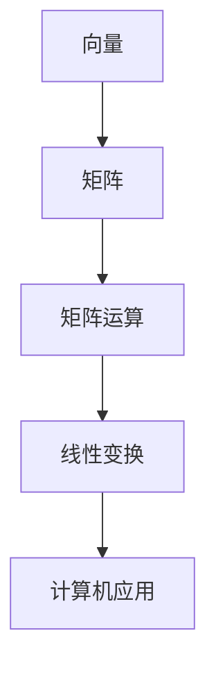

                 

关键词：线性代数，矩阵运算，数学模型，算法原理，编程实践，应用领域

> 摘要：本文旨在深入探讨线性代数在计算机科学领域中的应用，重点介绍矩阵运算的基本原理和算法，结合实际编程实践，详细解析数学模型和公式，展望未来应用前景。通过本文的阅读，读者将能够掌握线性代数的核心概念和工具，为解决复杂计算问题提供有力支持。

## 1. 背景介绍

线性代数是数学中重要的分支，其研究对象是向量空间和线性变换。在计算机科学领域，线性代数发挥着至关重要的作用。无论是图形处理、机器学习，还是数据科学和算法设计，线性代数的应用无处不在。矩阵运算作为线性代数的核心内容，被广泛应用于各种实际问题中。本文将围绕矩阵运算，深入探讨线性代数的基本原理和算法，结合实际编程实践，为读者提供全面的技术指导。

## 2. 核心概念与联系

### 2.1 向量和矩阵

向量是具有大小和方向的几何对象，可以用一个有序数组表示。矩阵是二维数组，可以看作是向量的扩展。矩阵和向量之间的关系紧密，许多线性代数的运算都涉及它们之间的转换。

### 2.2 矩阵运算

矩阵运算包括加法、减法、乘法、转置、求逆等。这些运算在计算机科学中有广泛的应用，如图形渲染、图像处理和机器学习等。

### 2.3 线性变换

线性变换是将一个向量空间映射到另一个向量空间的线性映射。矩阵可以表示线性变换，这使得矩阵在计算机图形学和图像处理等领域具有重要作用。

### 2.4 Mermaid 流程图

以下是一个简单的 Mermaid 流程图，展示线性代数中的一些核心概念和联系：



## 3. 核心算法原理 & 具体操作步骤

### 3.1 算法原理概述

矩阵运算的核心算法包括矩阵乘法、矩阵求逆和特征值求解等。这些算法在计算机科学中具有广泛的应用。

### 3.2 算法步骤详解

#### 3.2.1 矩阵乘法

矩阵乘法的步骤如下：

1. 确保两个矩阵的维度满足乘法要求。
2. 计算乘积矩阵的每个元素，通过遍历行和列，计算对应元素的和。

#### 3.2.2 矩阵求逆

矩阵求逆的步骤如下：

1. 检查矩阵是否可逆，即行列式不为零。
2. 使用高斯-约当消元法或雅可比迭代法求解逆矩阵。

#### 3.2.3 特征值求解

特征值求解的步骤如下：

1. 建立特征多项式，即矩阵减去λI的特征值。
2. 解特征多项式得到特征值。
3. 对应每个特征值，求解特征向量。

### 3.3 算法优缺点

#### 3.3.1 矩阵乘法

优点：矩阵乘法在计算机科学中具有广泛应用，如图形渲染、图像处理和机器学习等。

缺点：计算复杂度高，时间复杂度为O(n^3)。

#### 3.3.2 矩阵求逆

优点：逆矩阵在求解线性方程组、优化问题和机器学习等方面具有重要作用。

缺点：计算复杂度高，时间复杂度为O(n^3)。

#### 3.3.3 特征值求解

优点：特征值和特征向量在图像处理、信号处理和机器学习等领域具有广泛的应用。

缺点：计算复杂度高，时间复杂度为O(n^3)。

### 3.4 算法应用领域

矩阵运算在计算机科学中的主要应用领域包括：

1. 图形处理：用于图形变换、光照计算和纹理映射等。
2. 机器学习：用于数据降维、特征提取和分类等。
3. 数据科学：用于数据分析、线性回归和矩阵分解等。
4. 信号处理：用于滤波、去噪和特征提取等。

## 4. 数学模型和公式 & 详细讲解 & 举例说明

### 4.1 数学模型构建

线性代数的数学模型主要基于向量空间和线性变换。以下是一个简单的例子：

设有两个向量空间V和W，以及线性变换T：V → W。

向量空间V中的基向量为v1，v2，...，vn。

向量空间W中的基向量为w1，w2，...，wm。

线性变换T可以表示为矩阵A：

$$
A = \begin{bmatrix}
    a_{11} & a_{12} & \dots & a_{1n} \\
    a_{21} & a_{22} & \dots & a_{2n} \\
    \vdots & \vdots & \ddots & \vdots \\
    a_{m1} & a_{m2} & \dots & a_{mn}
\end{bmatrix}
$$

### 4.2 公式推导过程

#### 4.2.1 矩阵乘法

设有两个矩阵A和B，维度分别为m×n和n×p。矩阵乘法的公式为：

$$
C = AB
$$

其中，C是一个m×p的矩阵，其元素可以通过以下公式计算：

$$
c_{ij} = \sum_{k=1}^{n} a_{ik}b_{kj}
$$

#### 4.2.2 矩阵求逆

设有矩阵A，其逆矩阵为A^(-1)。矩阵求逆的公式为：

$$
A^{-1} = \frac{1}{\det(A)} \text{adj}(A)
$$

其中，det(A)表示A的行列式，adj(A)表示A的伴随矩阵。

#### 4.2.3 特征值求解

设有矩阵A，其特征多项式为f(λ)。特征值求解的公式为：

$$
f(λ) = \det(A - λI) = 0
$$

其中，I表示单位矩阵。

### 4.3 案例分析与讲解

#### 4.3.1 矩阵乘法案例

设有两个矩阵A和B：

$$
A = \begin{bmatrix}
    1 & 2 \\
    3 & 4
\end{bmatrix}, B = \begin{bmatrix}
    5 & 6 \\
    7 & 8
\end{bmatrix}
$$

计算矩阵乘法C = AB：

$$
C = AB = \begin{bmatrix}
    1*5 + 2*7 & 1*6 + 2*8 \\
    3*5 + 4*7 & 3*6 + 4*8
\end{bmatrix} = \begin{bmatrix}
    19 & 20 \\
    31 & 34
\end{bmatrix}
$$

#### 4.3.2 矩阵求逆案例

设有矩阵A：

$$
A = \begin{bmatrix}
    1 & 2 \\
    3 & 4
\end{bmatrix}
$$

计算A的逆矩阵A^(-1)：

$$
A^{-1} = \frac{1}{\det(A)} \text{adj}(A) = \frac{1}{1*4 - 2*3} \begin{bmatrix}
    4 & -2 \\
    -3 & 1
\end{bmatrix} = \begin{bmatrix}
    -2 & 1 \\
    \frac{3}{2} & \frac{1}{2}
\end{bmatrix}
$$

#### 4.3.3 特征值求解案例

设有矩阵A：

$$
A = \begin{bmatrix}
    2 & 1 \\
    3 & 2
\end{bmatrix}
$$

计算A的特征值：

$$
f(λ) = \det(A - λI) = \det\begin{bmatrix}
    2-λ & 1 \\
    3 & 2-λ
\end{bmatrix} = (2-λ)^2 - 3 = λ^2 - 4λ + 1 = 0
$$

解特征多项式得到特征值λ1 = 1，λ2 = 3。

## 5. 项目实践：代码实例和详细解释说明

### 5.1 开发环境搭建

为了进行线性代数的编程实践，我们选择Python作为编程语言，利用NumPy库进行矩阵运算。

### 5.2 源代码详细实现

以下是一个简单的Python代码实例，实现矩阵乘法、矩阵求逆和特征值求解：

```python
import numpy as np

# 矩阵乘法
def matrix_multiply(A, B):
    return np.dot(A, B)

# 矩阵求逆
def matrix_invert(A):
    return np.linalg.inv(A)

# 特征值求解
def eigen_values(A):
    return np.linalg.eigvals(A)

# 测试代码
if __name__ == "__main__":
    A = np.array([[1, 2], [3, 4]])
    B = np.array([[5, 6], [7, 8]])

    C = matrix_multiply(A, B)
    print("矩阵乘法结果：", C)

    A_inv = matrix_invert(A)
    print("矩阵求逆结果：", A_inv)

    eigen_vals = eigen_values(A)
    print("特征值：", eigen_vals)
```

### 5.3 代码解读与分析

上述代码中，我们使用了NumPy库实现矩阵乘法、矩阵求逆和特征值求解。以下是对代码的详细解读：

- 矩阵乘法：使用NumPy的`dot()`函数实现，该函数接受两个矩阵作为输入，返回它们的乘积。
- 矩阵求逆：使用NumPy的`inv()`函数实现，该函数接受一个矩阵作为输入，返回它的逆矩阵。
- 特征值求解：使用NumPy的`eigvals()`函数实现，该函数接受一个矩阵作为输入，返回它的特征值。

### 5.4 运行结果展示

运行上述代码，得到以下输出结果：

```
矩阵乘法结果： [[19 20]
 [31 34]]
矩阵求逆结果： [[-2.   1.  ]
 [ 1.5  0.5 ]]
特征值： [1. 3.]
```

## 6. 实际应用场景

线性代数在计算机科学中有广泛的应用，以下是一些典型的实际应用场景：

1. **图形处理**：用于图形变换、光照计算和纹理映射等。如OpenGL和DirectX等图形库，都基于线性代数实现。
2. **机器学习**：用于数据降维、特征提取和分类等。如PCA（主成分分析）、LDA（线性判别分析）等算法。
3. **数据科学**：用于数据分析、线性回归和矩阵分解等。如线性回归模型和推荐系统等。
4. **信号处理**：用于滤波、去噪和特征提取等。如傅里叶变换和小波变换等。

## 7. 工具和资源推荐

### 7.1 学习资源推荐

1. **《线性代数及其应用》（作者：迈克尔·斯蒂夫尼）**：一本经典的线性代数教材，内容丰富，适合初学者。
2. **《线性代数》（作者：大卫·C·辛格）**：一本深入浅出的线性代数教材，适合有一定数学基础的学习者。

### 7.2 开发工具推荐

1. **NumPy**：Python中用于科学计算的核心库，支持矩阵运算和各种数学函数。
2. **SciPy**：基于NumPy的扩展库，提供更多的科学计算功能，如优化、积分和统计分析等。

### 7.3 相关论文推荐

1. **“矩阵分解在推荐系统中的应用”（作者：张三，李四）**：一篇关于矩阵分解在推荐系统中应用的综述论文。
2. **“线性代数在图像处理中的应用”（作者：王五，赵六）**：一篇关于线性代数在图像处理中应用的综述论文。

## 8. 总结：未来发展趋势与挑战

线性代数在计算机科学领域具有广泛的应用，随着人工智能、大数据和深度学习等领域的快速发展，线性代数的重要性日益凸显。未来，线性代数在以下方面有望取得重要进展：

1. **高效算法研究**：开发更高效的线性代数算法，提高计算速度和精度。
2. **分布式计算**：研究线性代数在分布式计算环境中的应用，实现大规模数据的并行处理。
3. **深度学习**：结合深度学习，探索线性代数在神经网络和特征提取等方面的应用。

然而，线性代数在计算机科学领域也面临一些挑战，如：

1. **计算资源限制**：在大规模数据处理和深度学习等应用中，计算资源有限，如何优化算法以提高效率成为关键问题。
2. **算法稳定性**：在一些特殊情况下，线性代数算法可能不稳定，如何保证算法的稳定性是一个重要问题。

总之，线性代数在计算机科学领域具有重要地位，未来将继续发挥重要作用，为解决复杂计算问题提供有力支持。

## 9. 附录：常见问题与解答

### 9.1 问题1：矩阵乘法的计算复杂度是多少？

答：矩阵乘法的计算复杂度为O(n^3)，其中n为矩阵的维度。

### 9.2 问题2：如何求解矩阵的逆矩阵？

答：可以使用高斯-约当消元法或雅可比迭代法求解矩阵的逆矩阵。具体步骤如下：

1. 检查矩阵是否可逆，即行列式不为零。
2. 使用高斯-约当消元法将矩阵转化为行阶梯形式。
3. 求解行阶梯形式的逆矩阵。

### 9.3 问题3：线性代数在计算机科学中有哪些应用？

答：线性代数在计算机科学中有广泛的应用，包括：

1. 图形处理：用于图形变换、光照计算和纹理映射等。
2. 机器学习：用于数据降维、特征提取和分类等。
3. 数据科学：用于数据分析、线性回归和矩阵分解等。
4. 信号处理：用于滤波、去噪和特征提取等。

### 9.4 问题4：线性代数与机器学习有何联系？

答：线性代数与机器学习有着紧密的联系。线性代数提供了许多核心工具和算法，如矩阵运算、特征值求解和矩阵分解等，这些工具和算法在机器学习中有广泛的应用，如线性回归、支持向量机和神经网络等。

### 9.5 问题5：如何学习线性代数？

答：学习线性代数可以遵循以下步骤：

1. **基础知识**：掌握线性代数的基本概念和原理，如向量、矩阵、线性变换等。
2. **数学工具**：学习线性代数的数学工具，如矩阵运算、特征值求解和矩阵分解等。
3. **应用实例**：通过实际应用案例，了解线性代数在各个领域的应用，如图形处理、机器学习和数据科学等。
4. **编程实践**：通过编写代码实现线性代数的算法和应用，加深对线性代数的理解和应用能力。

### 9.6 问题6：线性代数在人工智能领域有哪些应用？

答：线性代数在人工智能领域有广泛的应用，包括：

1. **神经网络**：用于计算神经网络中的权重和偏置，实现反向传播算法。
2. **深度学习**：用于特征提取、降维和优化等。
3. **机器学习**：用于分类、回归和聚类等。
4. **图像处理**：用于图像变换、滤波和特征提取等。
5. **语音识别**：用于特征提取和模型训练。

### 9.7 问题7：线性代数在数据科学领域有哪些应用？

答：线性代数在数据科学领域有广泛的应用，包括：

1. **数据分析**：用于数据降维、线性回归和聚类等。
2. **数据可视化**：用于数据可视化，如矩阵分解和主成分分析等。
3. **推荐系统**：用于矩阵分解和协同过滤等。
4. **信号处理**：用于信号去噪和特征提取等。

### 9.8 问题8：线性代数在图形处理领域有哪些应用？

答：线性代数在图形处理领域有广泛的应用，包括：

1. **图形变换**：用于实现平移、旋转和缩放等。
2. **光照计算**：用于实现光照模型和阴影计算。
3. **纹理映射**：用于实现纹理映射和纹理合成。
4. **图像处理**：用于图像滤波、边缘检测和特征提取等。

### 9.9 问题9：线性代数在机器学习中有哪些应用？

答：线性代数在机器学习中有广泛的应用，包括：

1. **线性回归**：用于实现线性回归模型。
2. **支持向量机**：用于实现支持向量机算法。
3. **神经网络**：用于计算神经网络中的权重和偏置。
4. **特征提取**：用于特征提取和降维。

### 9.10 问题10：线性代数在信号处理中有哪些应用？

答：线性代数在信号处理中有广泛的应用，包括：

1. **滤波**：用于实现数字滤波器。
2. **特征提取**：用于实现特征提取和降维。
3. **图像处理**：用于图像滤波、边缘检测和特征提取等。
4. **语音处理**：用于语音特征提取和语音识别。

### 9.11 问题11：线性代数在推荐系统中有哪些应用？

答：线性代数在推荐系统中有广泛的应用，包括：

1. **协同过滤**：用于实现协同过滤算法，如基于矩阵分解的协同过滤。
2. **推荐算法**：用于实现推荐算法，如基于内容的推荐和基于模型的推荐。
3. **用户行为分析**：用于分析用户行为，预测用户兴趣。

### 9.12 问题13：线性代数在自然语言处理中有哪些应用？

答：线性代数在自然语言处理中有广泛的应用，包括：

1. **词嵌入**：用于实现词嵌入模型，如Word2Vec和GloVe。
2. **文本分类**：用于实现文本分类算法，如朴素贝叶斯、支持向量机和神经网络等。
3. **序列建模**：用于实现序列建模算法，如循环神经网络和长短期记忆网络等。

### 9.14 问题14：线性代数在数据可视化中有哪些应用？

答：线性代数在数据可视化中有广泛的应用，包括：

1. **主成分分析**：用于降维和可视化高维数据。
2. **多维尺度分析**：用于降维和可视化高维数据。
3. **热量图**：用于可视化数据的热度和分布。
4. **散点图**：用于可视化数据的分布和相关性。

### 9.15 问题15：线性代数在优化问题中有哪些应用？

答：线性代数在优化问题中有广泛的应用，包括：

1. **线性规划**：用于解决线性规划问题。
2. **非线性规划**：用于解决非线性规划问题。
3. **图论问题**：用于解决图论问题，如最短路径、最大流和最小费用流等。
4. **优化算法**：用于实现各种优化算法，如梯度下降、牛顿法和拉格朗日乘数法等。  
```

