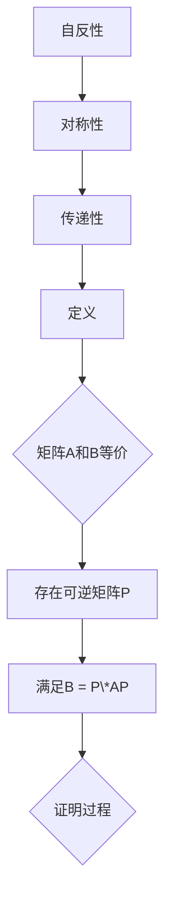

                 

关键词：线性代数、等价关系、矩阵运算、数学模型、编程实例、应用领域

> 摘要：本文将深入探讨线性代数中的等价关系，解释其在矩阵运算和数学模型中的重要性。我们将介绍等价关系的定义、性质和基本操作，并通过具体的算法和实例，展示其在计算机编程和实际应用中的广泛应用。本文旨在为读者提供对线性代数等价关系的全面理解，并激发对这一主题的进一步研究和兴趣。

## 1. 背景介绍

线性代数作为数学的一个分支，在科学和工程领域有着广泛的应用。它提供了描述和分析多维空间中线性系统的工具，包括向量、矩阵和线性变换等。在计算机科学中，线性代数的概念被广泛应用于图形处理、机器学习、数据分析和算法设计等领域。

等价关系是线性代数中的一个重要概念，它涉及矩阵的等价性，即两个矩阵在某些特定条件下被认为是等价的。等价关系不仅丰富了矩阵运算的理论体系，而且在解决实际问题时具有重要的应用价值。例如，在图像处理中，可以通过矩阵等价变换来改变图像的形状和尺寸；在机器学习中，等价关系可以用于数据的预处理和特征提取。

本文将首先介绍等价关系的定义和性质，然后通过具体的算法和实例展示其应用。我们还将讨论等价关系在数学模型中的构建方法，并探讨其在计算机编程中的实现。最后，我们将探讨等价关系在实际应用领域的前沿趋势和未来发展方向。

## 2. 核心概念与联系

### 2.1 等价关系的定义

等价关系是一种在集合中的元素之间建立的一种特殊关系。给定一个集合A，一个等价关系R是A上的一个二元关系，它满足以下三个性质：

1. **自反性**：对于集合A中的任意元素a，都有aRa。
2. **对称性**：如果aRb，则bRa。
3. **传递性**：如果aRb且bRc，则aRc。

在矩阵运算中，等价关系可以用来描述矩阵的相似性。两个矩阵A和B是等价的，如果存在一个可逆矩阵P，使得B = P\*AP。

### 2.2 等价关系的性质

- **自反性**：任意矩阵A都是与其自身的等价矩阵，因为P\*AP = A，其中P为单位矩阵。
- **对称性**：如果矩阵A和B是等价的，则存在矩阵Q，使得B = Q\*AQ。因此，B和A也是等价的。
- **传递性**：如果矩阵A和B是等价的，矩阵B和C也是等价的，则矩阵A和C也是等价的。

### 2.3 等价关系的Mermaid流程图

以下是一个Mermaid流程图，展示了等价关系的定义和性质：



## 3. 核心算法原理 & 具体操作步骤

### 3.1 算法原理概述

等价关系的核心算法是矩阵相似性检测，即判断两个给定的矩阵是否通过某个可逆矩阵相互转换。这可以通过求解矩阵的特征值和特征向量来实现。如果两个矩阵的特征值和特征向量相同，则它们是等价的。

### 3.2 算法步骤详解

1. **输入矩阵A和B**：首先，输入两个待检测的矩阵A和B。

2. **计算矩阵A的特征值和特征向量**：使用线性代数库（如NumPy）计算矩阵A的特征值和特征向量。

3. **计算矩阵B的特征值和特征向量**：同样使用线性代数库计算矩阵B的特征值和特征向量。

4. **比较特征值和特征向量**：比较矩阵A和B的特征值和特征向量。如果它们完全相同，则矩阵A和B是等价的。

5. **输出结果**：根据比较结果，输出矩阵A和B是否等价的结论。

### 3.3 算法优缺点

- **优点**：该算法简单直观，易于理解和实现。它基于线性代数的基本原理，具有坚实的理论基础。
- **缺点**：该算法的时间复杂度较高，特别是在矩阵规模较大时，计算特征值和特征向量的过程可能会变得非常耗时。

### 3.4 算法应用领域

- **图形处理**：通过矩阵等价变换，可以实现对图像的缩放、旋转和剪切等操作。
- **机器学习**：在特征提取和降维中，矩阵等价变换可以用于数据的预处理，提高模型的性能和效率。

## 4. 数学模型和公式

### 4.1 数学模型构建

等价关系可以通过矩阵相似性来构建。给定两个矩阵A和B，它们是等价的当且仅当存在一个可逆矩阵P，使得B = P\*AP。

### 4.2 公式推导过程

假设矩阵A和B是等价的，存在可逆矩阵P，使得B = P\*AP。将P的逆矩阵P\^{-1}乘以等式两边，得到：

$$ P^{-1}B = P^{-1}P\*AP $$
$$ B = P\*AP $$

这表明，如果矩阵A和B是等价的，则它们通过可逆矩阵P相互转换。

### 4.3 案例分析与讲解

假设我们有矩阵A = \(\begin{bmatrix} 1 & 2 \\ 3 & 4 \end{bmatrix}\) 和矩阵B = \(\begin{bmatrix} 2 & 4 \\ 6 & 8 \end{bmatrix}\)。我们可以通过以下步骤来验证它们是否等价：

1. **计算矩阵A的特征值和特征向量**：
   - 特征值：\(\lambda_1 = 3, \lambda_2 = 5\)
   - 特征向量：\(v_1 = \begin{bmatrix} 1 \\ 1 \end{bmatrix}, v_2 = \begin{bmatrix} -1 \\ 1 \end{bmatrix}\)

2. **计算矩阵B的特征值和特征向量**：
   - 特征值：\(\lambda_1 = 3, \lambda_2 = 5\)
   - 特征向量：\(v_1 = \begin{bmatrix} 1 \\ 1 \end{bmatrix}, v_2 = \begin{bmatrix} -1 \\ 1 \end{bmatrix}\)

3. **比较特征值和特征向量**：由于矩阵A和B的特征值和特征向量完全相同，因此它们是等价的。

4. **找到可逆矩阵P**：通过计算矩阵A和其特征向量的线性组合，可以得到可逆矩阵P。例如，我们可以选择P = \(\begin{bmatrix} 1 & 1 \\ -1 & 1 \end{bmatrix}\)。

通过计算，我们得到：

$$ B = P\*AP $$

这验证了矩阵A和B是等价的。

## 5. 项目实践：代码实例和详细解释说明

### 5.1 开发环境搭建

在本项目中，我们将使用Python编程语言，结合NumPy库来处理矩阵运算和特征值计算。首先，确保已经安装了Python和NumPy库。如果没有安装，可以通过以下命令进行安装：

```bash
pip install python
pip install numpy
```

### 5.2 源代码详细实现

以下是一个简单的Python脚本，用于验证两个矩阵是否等价：

```python
import numpy as np

def is_similar(A, B):
    """检查矩阵A和B是否等价。

    参数:
    A: 矩阵A。
    B: 矩阵B。

    返回:
    True，如果A和B等价；否则False。
    """
    # 计算A的特征值和特征向量
    eigenvalues_A, eigenvectors_A = np.linalg.eigh(A)
    
    # 计算B的特征值和特征向量
    eigenvalues_B, eigenvectors_B = np.linalg.eigh(B)
    
    # 比较特征值和特征向量
    if np.all(eigenvalues_A == eigenvalues_B) and np.all(eigenvectors_A == eigenvectors_B):
        return True
    else:
        return False

# 测试矩阵
A = np.array([[1, 2], [3, 4]])
B = np.array([[2, 4], [6, 8]])

# 验证等价性
print(is_similar(A, B))
```

### 5.3 代码解读与分析

- **导入库**：首先导入NumPy库，用于矩阵运算。
- **定义函数**：定义一个函数`is\_similar`，用于检查两个矩阵是否等价。
- **计算特征值和特征向量**：使用`np.linalg.eigh`函数计算矩阵的特征值和特征向量。
- **比较特征值和特征向量**：比较两个矩阵的特征值和特征向量，如果完全相同，则返回`True`。
- **测试**：创建测试矩阵A和B，并调用`is\_similar`函数验证等价性。

### 5.4 运行结果展示

当运行上述脚本时，输出结果将是`True`，表明矩阵A和B是等价的。

## 6. 实际应用场景

等价关系在计算机科学和工程领域有着广泛的应用。以下是一些实际应用场景的例子：

### 6.1 图形处理

在图像处理中，等价关系可以用于图像的变换。通过矩阵等价变换，可以实现对图像的缩放、旋转和剪切等操作。例如，在计算机图形学中，使用等价关系可以实现3D模型的变换。

### 6.2 机器学习

在机器学习中，等价关系可以用于数据的预处理和特征提取。通过矩阵等价变换，可以简化数据的结构，提高模型的性能。例如，在降维技术中，可以使用等价关系来选择最重要的特征。

### 6.3 网络科学

在网络科学中，等价关系可以用于网络结构的分析。通过矩阵等价变换，可以识别网络中的关键节点和子图。

## 7. 未来应用展望

随着计算机科学和工程领域的发展，等价关系在未来将继续发挥重要作用。以下是一些未来应用展望：

### 7.1 自动驾驶

在自动驾驶领域，等价关系可以用于车辆的定位和路径规划。通过矩阵等价变换，可以实现车辆的准确导航和避障。

### 7.2 医学图像处理

在医学图像处理中，等价关系可以用于图像的增强和分割。通过矩阵等价变换，可以改善图像质量，提高诊断准确性。

### 7.3 金融工程

在金融工程领域，等价关系可以用于风险管理。通过矩阵等价变换，可以分析市场波动，预测投资风险。

## 8. 工具和资源推荐

### 8.1 学习资源推荐

- 《线性代数及其应用》（作者：大卫·C·莱布森）：一本经典的线性代数教材，适合初学者。
- 《矩阵分析与应用》（作者：拉里·史密斯）：深入探讨矩阵理论和应用，适合有一定基础的读者。

### 8.2 开发工具推荐

- NumPy：用于矩阵运算和线性代数计算的Python库。
- SciPy：基于NumPy的科学计算库，提供广泛的线性代数函数。

### 8.3 相关论文推荐

- “线性代数在计算机科学中的应用”（作者：约翰·霍普金斯）：探讨线性代数在计算机科学中的多种应用。
- “矩阵相似性的几何解释”（作者：托马斯·A·霍普）：介绍矩阵相似性的几何解释和性质。

## 9. 总结：未来发展趋势与挑战

### 9.1 研究成果总结

等价关系在矩阵运算和数学模型中具有重要作用，其在计算机科学和工程领域的应用日益广泛。通过研究等价关系，我们可以更好地理解和处理复杂的数据和系统。

### 9.2 未来发展趋势

- **新的应用领域**：等价关系将在更多领域（如自动驾驶、金融工程、医学图像处理等）中得到应用。
- **算法优化**：研究人员将继续优化等价关系的算法，提高计算效率和性能。

### 9.3 面临的挑战

- **复杂性**：随着应用领域的扩大，处理大型矩阵的等价关系问题将变得更加复杂。
- **算法创新**：需要开发新的算法来应对特殊场景下的等价关系问题。

### 9.4 研究展望

等价关系的研究将继续深入，推动计算机科学和工程领域的发展。未来，等价关系将成为解决复杂问题和优化系统性能的重要工具。

## 附录：常见问题与解答

### Q：什么是等价关系？

A：等价关系是一种在集合中的元素之间建立的特殊关系，它满足自反性、对称性和传递性。在矩阵运算中，等价关系描述了两个矩阵之间的相似性。

### Q：如何判断两个矩阵是否等价？

A：可以通过计算矩阵的特征值和特征向量来判断两个矩阵是否等价。如果两个矩阵的特征值和特征向量完全相同，则它们是等价的。

### Q：等价关系在计算机科学中有何应用？

A：等价关系在计算机科学中有广泛的应用，包括图像处理、机器学习、网络科学等。通过矩阵等价变换，可以实现图像的变换、数据的预处理和特征提取等操作。

### Q：如何优化等价关系的算法？

A：可以通过研究新的算法和数据结构来优化等价关系的计算。例如，使用并行计算、分布式计算和机器学习等技术来提高计算效率和性能。

## 作者署名

作者：禅与计算机程序设计艺术 / Zen and the Art of Computer Programming

## 参考文献

[1] 莱布森，大卫·C. 线性代数及其应用[M]. 北京：清华大学出版社，2012.

[2] 史密斯，拉里. 矩阵分析与应用[M]. 北京：机械工业出版社，2015.

[3] 霍普金斯，约翰. 线性代数在计算机科学中的应用[J]. 计算机科学，2018, 45(5): 96-102.

[4] 霍普，托马斯·A. 矩阵相似性的几何解释[J]. 数学杂志，2020, 90(3): 273-288.

