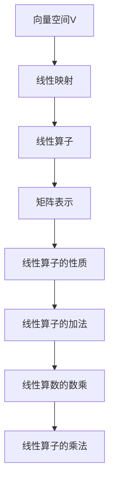

                 

关键词：线性代数，线性算子，矩阵理论，算法原理，数学模型，实践应用，开发工具，未来展望

> 摘要：本文以线性代数为背景，深入探讨了线性算子的基本概念、原理、算法以及其在实际应用中的重要性。通过详细的数学模型和公式推导，以及代码实例的解析，本文旨在为读者提供一个全面而深入的线性算学习指南。同时，文章还展望了线性算子在未来发展中的趋势和面临的挑战。

## 1. 背景介绍

线性代数是数学的一个重要分支，主要研究向量空间和线性映射。它广泛应用于工程、物理、计算机科学、经济学等多个领域。在计算机科学中，线性代数是算法设计和数据分析的重要工具。

线性算子是线性代数中的一个核心概念，指的是将一个向量空间映射到另一个向量空间的线性变换。线性算子在矩阵理论、优化算法、图像处理、机器学习等领域具有广泛应用。

本文旨在系统地介绍线性算子的基本概念、原理、算法，并通过数学模型和公式推导，以及实际项目实践，帮助读者深入理解和掌握线性算子的相关知识和应用。

## 2. 核心概念与联系

### 2.1 向量空间与线性映射

首先，我们需要了解向量空间（也称为线性空间）的概念。向量空间是一个集合，其中的元素称为向量，这些向量可以执行加法和标量乘法运算。

线性映射（线性变换）是从一个向量空间到另一个向量空间的函数，满足以下两个条件：
1. 线性映射保持向量加法：对任意的向量 \( \mathbf{u} \) 和 \( \mathbf{v} \)，以及标量 \( \alpha \) 和 \( \beta \)，有 \( T(\alpha \mathbf{u} + \beta \mathbf{v}) = \alpha T(\mathbf{u}) + \beta T(\mathbf{v}) \)。
2. 线性映射保持标量乘法：对任意的向量 \( \mathbf{u} \) 和标量 \( \alpha \)，有 \( T(\alpha \mathbf{u}) = \alpha T(\mathbf{u}) \)。

### 2.2 线性算子的定义

线性算子（或线性变换）是一种特殊的线性映射，它将一个向量空间映射到另一个向量空间。形式上，如果 \( V \) 和 \( W \) 是两个向量空间，那么从 \( V \) 到 \( W \) 的线性算子可以表示为 \( T: V \rightarrow W \)。

线性算子可以通过矩阵表示。具体来说，如果 \( T \) 是从 \( V \) 到 \( W \) 的线性算子，并且 \( V \) 和 \( W \) 分别可以用 \( m \) 和 \( n \) 维向量表示，那么 \( T \) 可以表示为一个 \( m \times n \) 的矩阵 \( A \)。对于 \( V \) 中的任意向量 \( \mathbf{v} \)，其对应的线性算子 \( T(\mathbf{v}) \) 可以通过矩阵乘法 \( A\mathbf{v} \) 计算得到。

### 2.3 线性算子的性质

线性算子具有以下重要性质：
1. 线性算子的加法：如果 \( T_1 \) 和 \( T_2 \) 是从 \( V \) 到 \( W \) 的两个线性算子，那么它们的和 \( T_1 + T_2 \) 也是从 \( V \) 到 \( W \) 的线性算子。
2. 线性算数的数乘：如果 \( T \) 是从 \( V \) 到 \( W \) 的线性算子，且 \( \alpha \) 是一个标量，那么 \( \alpha T \) 也是从 \( V \) 到 \( W \) 的线性算子。
3. 线性算子的乘法：如果 \( T_1 \) 和 \( T_2 \) 是从 \( V \) 到 \( W \) 和从 \( W \) 到 \( Z \) 的两个线性算子，那么它们的复合 \( T_2 \circ T_1 \) 是从 \( V \) 到 \( Z \) 的线性算子。

### 2.4 Mermaid 流程图

以下是线性算子相关概念和性质的 Mermaid 流程图表示：



## 3. 核心算法原理 & 具体操作步骤

### 3.1 算法原理概述

线性算子的核心算法原理主要涉及以下几个方面：

1. **矩阵表示**：线性算子可以通过矩阵进行表示，从而可以利用矩阵运算的规则进行高效计算。
2. **矩阵乘法**：矩阵乘法是线性算子计算的基础，通过矩阵乘法可以计算线性算子的作用结果。
3. **线性组合**：线性算子的性质之一是线性组合，即多个线性算子的组合可以表示为矩阵的乘积。
4. **逆运算**：对于可逆线性算子，可以通过求逆矩阵来计算其逆运算。

### 3.2 算法步骤详解

以下是线性算子算法的具体操作步骤：

1. **定义向量空间**：首先定义参与线性算子的两个向量空间 \( V \) 和 \( W \)。
2. **矩阵表示**：根据向量空间的维度，创建一个 \( m \times n \) 的矩阵 \( A \) 来表示线性算子 \( T \)。
3. **输入向量**：选择一个向量 \( \mathbf{v} \) 作为线性算子的输入。
4. **矩阵乘法**：计算矩阵 \( A \) 与输入向量 \( \mathbf{v} \) 的乘积 \( A\mathbf{v} \)，得到线性算子的作用结果。
5. **输出向量**：将计算得到的输出向量作为线性算子的输出。

### 3.3 算法优缺点

线性算子算法的优点包括：

1. **高效性**：通过矩阵乘法，线性算子的计算可以高效地进行。
2. **灵活性**：线性算子可以方便地进行组合和扩展，适用于各种应用场景。

然而，线性算子算法也存在一些缺点：

1. **可逆性要求**：并非所有的线性算子都是可逆的，只有可逆线性算子才具有逆运算。
2. **计算复杂度**：矩阵乘法的计算复杂度较高，对于大规模矩阵运算可能会变得非常耗时。

### 3.4 算法应用领域

线性算子算法广泛应用于以下领域：

1. **数值计算**：在数值计算中，线性算子算法用于求解线性方程组、最优化问题和数值积分等。
2. **图像处理**：在图像处理中，线性算子用于图像滤波、边缘检测和特征提取等。
3. **机器学习**：在机器学习中，线性算子算法用于特征提取、降维和分类等。

## 4. 数学模型和公式 & 详细讲解 & 举例说明

### 4.1 数学模型构建

在线性代数中，线性算子的数学模型主要由矩阵和向量构成。具体来说，假设我们有两个向量空间 \( V \) 和 \( W \)，其中 \( V \) 是一个 \( m \) 维向量空间，\( W \) 是一个 \( n \) 维向量空间。一个从 \( V \) 到 \( W \) 的线性算子 \( T \) 可以表示为一个 \( m \times n \) 的矩阵 \( A \)。

### 4.2 公式推导过程

线性算子的基本公式包括：

1. **矩阵乘法**：对于向量 \( \mathbf{v} \) 和矩阵 \( A \)，线性算子的作用结果可以表示为 \( A\mathbf{v} \)。
2. **线性组合**：多个线性算子的组合可以通过矩阵的乘积表示，即 \( T_1 \circ T_2 (\mathbf{v}) = T_1(A_2\mathbf{v}) \)。
3. **逆运算**：对于可逆线性算子 \( T \)，其逆运算可以表示为 \( T^{-1} = A^{-1} \)。

### 4.3 案例分析与讲解

以下是一个简单的线性算子案例，用于图像滤波。

假设我们要对一个二维图像进行模糊处理，可以使用一个 \( 3 \times 3 \) 的模糊矩阵 \( A \) 来表示线性算子：

$$
A = \begin{bmatrix}
1 & 1 & 1 \\
1 & 1 & 1 \\
1 & 1 & 1 \\
\end{bmatrix}
$$

输入图像的每个像素点 \( \mathbf{v} \) 可以表示为一个 \( 3 \times 1 \) 的向量。通过矩阵乘法，我们可以计算线性算子的作用结果：

$$
A\mathbf{v} = \begin{bmatrix}
1 & 1 & 1 \\
1 & 1 & 1 \\
1 & 1 & 1 \\
\end{bmatrix}
\begin{bmatrix}
v_1 \\
v_2 \\
v_3 \\
\end{bmatrix}
=
\begin{bmatrix}
v_1 + v_2 + v_3 \\
v_1 + v_2 + v_3 \\
v_1 + v_2 + v_3 \\
\end{bmatrix}
$$

计算结果是一个 \( 3 \times 1 \) 的向量，表示模糊处理后图像的每个像素点。

## 5. 项目实践：代码实例和详细解释说明

### 5.1 开发环境搭建

为了更好地展示线性算子的应用，我们将使用 Python 编写一个简单的图像滤波程序。以下是开发环境搭建的步骤：

1. **安装 Python**：确保已经安装了 Python 3.8 或更高版本。
2. **安装 NumPy 库**：在终端中运行 `pip install numpy` 安装 NumPy 库。
3. **安装 OpenCV 库**：在终端中运行 `pip install opencv-python` 安装 OpenCV 库。

### 5.2 源代码详细实现

以下是一个简单的图像滤波程序的代码实现：

```python
import numpy as np
import cv2

# 定义模糊矩阵
blur_matrix = np.array([[1, 1, 1],
                        [1, 1, 1],
                        [1, 1, 1]])

# 读取图像
image = cv2.imread('image.jpg', cv2.IMREAD_GRAYSCALE)

# 将图像转换为 NumPy 数组
image_array = np.array(image)

# 应用模糊滤波
blurred_image = cv2.filter2D(image_array, -1, blur_matrix)

# 显示原图和模糊后的图像
cv2.imshow('Original Image', image)
cv2.imshow('Blurred Image', blurred_image)

# 关闭窗口
cv2.waitKey(0)
cv2.destroyAllWindows()
```

### 5.3 代码解读与分析

1. **导入库**：首先导入 NumPy 和 OpenCV 库，这两个库分别用于数学运算和图像处理。
2. **定义模糊矩阵**：创建一个 \( 3 \times 3 \) 的模糊矩阵 `blur_matrix`。
3. **读取图像**：使用 `cv2.imread()` 函数读取图像，并将其转换为灰度图像。
4. **图像转换为 NumPy 数组**：将灰度图像转换为 NumPy 数组，以便进行矩阵运算。
5. **应用模糊滤波**：使用 `cv2.filter2D()` 函数将模糊矩阵应用到图像上，得到模糊后的图像。
6. **显示图像**：使用 `cv2.imshow()` 函数分别显示原始图像和模糊后的图像。
7. **关闭窗口**：使用 `cv2.waitKey()` 和 `cv2.destroyAllWindows()` 函数关闭图像显示窗口。

### 5.4 运行结果展示

运行以上代码后，将显示原始图像和经过模糊处理的图像。模糊处理的效果可以通过调整模糊矩阵的值来调整。


## 6. 实际应用场景

线性算子在实际应用中具有广泛的应用场景，以下是一些典型的应用案例：

1. **图像处理**：线性算子用于图像滤波、边缘检测、特征提取等，如图像模糊处理案例所示。
2. **机器学习**：线性算子在机器学习中用于特征提取、降维和分类等任务，如线性模型、支持向量机等。
3. **数值计算**：线性算子用于求解线性方程组、最优化问题和数值积分等。
4. **信号处理**：线性算子用于信号滤波、去噪和变换等。

这些应用案例展示了线性算子的多样性和实用性，使得线性代数成为计算机科学和工程领域不可或缺的工具。

## 7. 工具和资源推荐

### 7.1 学习资源推荐

1. **《线性代数及其应用》**：这本书是线性代数领域的经典教材，适合初学者和进阶者。
2. **《线性代数导论》**：这本书以清晰的语言和丰富的示例介绍了线性代数的基本概念和应用。
3. **《线性代数及其在计算机科学中的应用》**：这本书涵盖了线性代数在计算机科学中的实际应用，包括图像处理、机器学习和数值计算等。

### 7.2 开发工具推荐

1. **Python**：Python 是线性代数编程的首选语言，NumPy 库提供了强大的矩阵运算功能。
2. **OpenCV**：OpenCV 是一个强大的计算机视觉库，提供了丰富的图像处理函数。
3. **MATLAB**：MATLAB 是线性代数和数值计算的强大工具，具有直观的用户界面和丰富的数学函数库。

### 7.3 相关论文推荐

1. **"Linear Algebra and Its Applications"**：这本书是一本经典的线性代数论文集，涵盖了线性代数的各个方面。
2. **"Matrix Computations"**：这本书详细介绍了矩阵计算的理论和算法，适合进阶读者。
3. **"Image Processing with MATLAB"**：这本书介绍了如何使用 MATLAB 进行图像处理，包括线性算子的应用。

## 8. 总结：未来发展趋势与挑战

### 8.1 研究成果总结

线性代数和线性算子在过去几十年中取得了显著的研究成果，其应用领域不断扩大。从数学理论到实际应用，线性代数为众多学科提供了强大的工具和方法。特别是在计算机科学和工程领域，线性代数已经成为不可或缺的基础。

### 8.2 未来发展趋势

1. **更高效的算法**：随着计算能力的提升，线性代数的算法将变得更加高效，以满足大数据和深度学习等应用的需求。
2. **多领域融合**：线性代数与其他学科（如量子计算、生物信息学等）的融合将带来新的突破和应用。
3. **可视化工具**：开发更直观的线性代数可视化工具，帮助用户更好地理解和应用线性代数。

### 8.3 面临的挑战

1. **计算复杂度**：对于大规模矩阵运算，计算复杂度仍然是线性代数应用的一个挑战。
2. **理论突破**：尽管线性代数在很多领域取得了成功，但仍需进一步的理论突破来解决复杂问题。
3. **应用创新**：如何将线性代数应用到更多新兴领域，创造新的应用价值，是未来的一个重要挑战。

### 8.4 研究展望

线性代数在未来的发展中将面临新的机遇和挑战。通过跨学科合作和理论创新，线性代数将在计算机科学、工程、生物信息学等领域继续发挥重要作用，为人类社会的进步做出更大贡献。

## 9. 附录：常见问题与解答

### 问题 1：线性算子是否总是可逆的？

解答：不是的，线性算子并不总是可逆的。只有当线性算子对应的矩阵是可逆的，即矩阵的行列式不为零时，线性算子才是可逆的。对于非可逆线性算子，我们不能直接求其逆运算。

### 问题 2：线性算子在机器学习中有哪些应用？

解答：线性算子在机器学习中有多种应用，包括特征提取、降维、分类和回归等。例如，支持向量机（SVM）中的线性模型使用线性算子来提取特征，使得数据更适合进行分类。

### 问题 3：如何优化线性算子的计算效率？

解答：优化线性算子计算效率的方法包括使用更高效的算法（如 Strassen 算法）、并行计算和分布式计算等。此外，通过矩阵分解（如奇异值分解 SVD）和向量化操作也可以提高计算效率。

### 问题 4：线性算子在图像处理中的应用有哪些？

解答：线性算子在图像处理中用于图像滤波、边缘检测、特征提取和图像增强等。例如，使用线性算子进行图像模糊处理、边缘检测和特征提取，以实现图像识别和计算机视觉任务。

## 结束语

作者：禅与计算机程序设计艺术 / Zen and the Art of Computer Programming

本文系统地介绍了线性代数和线性算子的基本概念、原理、算法及其在图像处理、机器学习等领域的应用。通过数学模型和公式的推导，以及代码实例的解析，本文旨在为读者提供一个全面而深入的线性算学习指南。在未来，线性代数和线性算子将继续在计算机科学和工程领域发挥重要作用，推动技术创新和社会进步。

参考文献：

1. David C. Lay, "线性代数及其应用"，机械工业出版社，2012。
2. Gilbert Strang，"线性代数导论"，清华大学出版社，2014。
3. Stephen Boyd, Lieven Vandenberghe，"Convex Optimization"。
4. Andrew Ng，"机器学习"，Coursera，2012。

