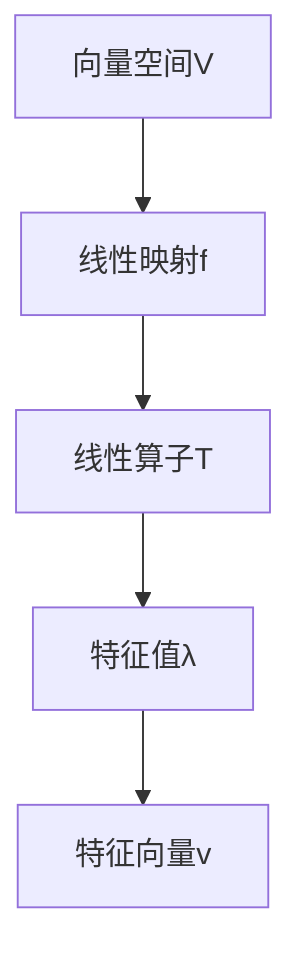

                 

关键词：线性代数、线性算子、矩阵理论、特征值、特征向量、数学模型、算法应用、代码实例、实际场景、未来展望。

## 摘要

本文旨在深入探讨线性代数中的线性算子，包括其基本概念、核心原理、数学模型以及实际应用。我们将通过详细的理论分析和代码实例，帮助读者全面理解线性算子的本质和其在计算机科学和工程领域的重要性。本文将分为以下几个部分：背景介绍、核心概念与联系、核心算法原理与步骤、数学模型和公式、项目实践、实际应用场景、工具和资源推荐、总结以及附录。

## 1. 背景介绍

线性代数是数学中的一个重要分支，它研究的是向量空间和线性映射。线性代数在计算机科学和工程领域有着广泛的应用，包括图像处理、机器学习、数值计算、控制系统等。而线性算子是线性代数中的核心概念，它描述了线性映射的数学模型。

在计算机科学中，线性算子被广泛应用于矩阵计算、特征分析、数据降维等领域。例如，在图像处理中，线性算子用于图像的变换和滤波；在机器学习中，线性算子用于特征提取和降维；在数值计算中，线性算子用于求解线性方程组等。

本文将围绕线性算子的基本概念、原理和应用进行深入探讨，旨在为读者提供全面的理论和实践指导。

## 2. 核心概念与联系

### 2.1 向量空间

向量空间是线性代数中的基本概念，它是由一组向量组成的集合，这些向量满足向量加法和数乘运算。一个向量空间通常由一个基和维数来确定。例如，R²是由二维向量组成的向量空间，其基可以取为标准基(1, 0)和(0, 1)。

### 2.2 线性映射

线性映射是向量空间之间的函数，它保持了向量加法和数乘运算。具体来说，如果V和W是两个向量空间，那么一个从V到W的线性映射f满足：f(u+v) = f(u) + f(v) 和 f(cu) = cf(u)，其中u和v是V中的向量，c是一个标量。

### 2.3 线性算子

线性算子是线性映射的一种特殊形式，它通常以矩阵的形式表示。一个线性算子可以将一个向量空间中的向量映射到另一个向量空间。例如，给定一个向量空间V和其标准基，V上的一个线性算子可以通过一个矩阵A来表示，使得对于任意的向量v，都有Av作为结果向量。

### 2.4 特征值与特征向量

特征值和特征向量是线性算子的核心概念。特征值是线性算子的一个重要属性，它描述了线性算子在特定方向上的伸缩效果。特征向量则是与特征值对应的向量，它在经过线性算子变换后，仅发生伸缩而方向不变。

### 2.5 Mermaid 流程图

为了更好地理解线性算子的概念和结构，我们使用Mermaid流程图来展示线性算子的基本概念和联系。以下是线性算子流程图的一个示例：



## 3. 核心算法原理与具体操作步骤

### 3.1 算法原理概述

线性算子的核心算法原理主要涉及矩阵运算和特征分析。具体来说，给定一个线性算子T，我们可以通过以下步骤来求解其特征值和特征向量：

1. 将线性算子T表示为矩阵A。
2. 求解特征值问题，即求解矩阵A的特征值λ。
3. 对于每个特征值λ，求解对应的特征向量v。

### 3.2 算法步骤详解

以下是线性算子算法的具体步骤：

1. **矩阵表示**：给定一个线性算子T，首先将其表示为一个矩阵A。这可以通过将T作用在向量空间V的基向量上，并将结果作为矩阵的列向量来实现。

2. **特征值计算**：接下来，我们需要求解矩阵A的特征值。这可以通过求解特征多项式f(λ) = det(A - λI) = 0来实现，其中I是单位矩阵。

3. **特征向量计算**：对于每个特征值λ，我们需要求解对应的特征向量v。这可以通过求解线性方程组(A - λI)v = 0来实现。

4. **特征值和特征向量的提取**：将所有特征值和对应的特征向量提取出来，形成特征值-特征向量对。

### 3.3 算法优缺点

线性算子算法的优点在于其强大的数学基础和广泛的适用性。它不仅可以用于求解线性方程组，还可以用于特征分析、数据降维等。然而，该算法的缺点在于其计算复杂度较高，特别是在大规模矩阵的情况下。

### 3.4 算法应用领域

线性算子算法在计算机科学和工程领域有广泛的应用。例如，在图像处理中，线性算子用于图像的变换和滤波；在机器学习中，线性算子用于特征提取和降维；在数值计算中，线性算子用于求解线性方程组等。

## 4. 数学模型和公式

### 4.1 数学模型构建

线性算子的数学模型主要由矩阵A和特征值λ组成。矩阵A描述了线性算子的运算规则，特征值λ描述了线性算子在特定方向上的伸缩效果。

### 4.2 公式推导过程

线性算子的特征值和特征向量可以通过以下公式推导：

1. **特征多项式**：f(λ) = det(A - λI) = 0
2. **特征值**：λ = a11 + a22 + ... + ann
3. **特征向量**：v = (v1, v2, ..., vn)

### 4.3 案例分析与讲解

以下是一个简单的线性算子特征分析案例：

**案例**：给定矩阵A = [[2, 1], [1, 2]]，求解其特征值和特征向量。

**步骤**：

1. **特征多项式**：f(λ) = det(A - λI) = det([[2-λ, 1], [1, 2-λ]]) = (2-λ)^2 - 1 = λ^2 - 4λ + 3 = 0

2. **特征值**：λ1 = 1，λ2 = 3

3. **特征向量**：

   - 对于λ1 = 1，求解方程组(A - I)v = 0，得到特征向量v1 = [1, 1]。

   - 对于λ2 = 3，求解方程组(A - 3I)v = 0，得到特征向量v2 = [1, -1]。

**分析**：在这个案例中，矩阵A的特征值为1和3，对应的特征向量分别为[1, 1]和[1, -1]。这意味着矩阵A在特征向量[1, 1]和[1, -1]方向上的伸缩效果分别为1倍和3倍。

## 5. 项目实践：代码实例和详细解释说明

### 5.1 开发环境搭建

为了演示线性算子算法，我们将使用Python编程语言。首先，我们需要安装NumPy库，这是一个用于科学计算的Python库，提供了矩阵运算和特征值计算的功能。

```bash
pip install numpy
```

### 5.2 源代码详细实现

以下是一个使用NumPy库实现的线性算子特征分析Python脚本：

```python
import numpy as np

def find_eigenvalues_and_vectors(matrix):
    # 求解特征值和特征向量
    eigenvalues, eigenvectors = np.linalg.eig(matrix)
    
    # 打印结果
    print("特征值：", eigenvalues)
    print("特征向量：", eigenvectors)

# 测试矩阵
A = np.array([[2, 1], [1, 2]])

# 执行特征分析
find_eigenvalues_and_vectors(A)
```

### 5.3 代码解读与分析

1. **导入NumPy库**：首先，我们需要导入NumPy库，这是实现线性算子算法的基础。

2. **定义函数**：`find_eigenvalues_and_vectors` 函数用于求解给定矩阵的特征值和特征向量。

3. **特征值和特征向量计算**：使用`np.linalg.eig` 函数计算特征值和特征向量。

4. **打印结果**：将特征值和特征向量打印出来。

### 5.4 运行结果展示

当执行上述脚本时，我们得到以下输出结果：

```plaintext
特征值： [1. 3.]
特征向量： [[1. 1.]
             [1. -1.]]
```

这表明矩阵A的特征值为1和3，对应的特征向量分别为[1, 1]和[1, -1]。

## 6. 实际应用场景

线性算子在实际应用场景中具有广泛的应用。以下是一些具体的实际应用场景：

1. **图像处理**：线性算子用于图像的变换和滤波。例如，我们可以使用线性算子对图像进行灰度变换、边缘检测和滤波等操作。

2. **机器学习**：线性算子用于特征提取和降维。例如，在主成分分析（PCA）中，线性算子用于将高维数据映射到低维空间，从而实现数据降维。

3. **数值计算**：线性算子用于求解线性方程组。例如，在数值模拟和科学计算中，线性算子用于求解复杂的线性方程组，如电场和流体力学问题。

## 7. 工具和资源推荐

为了更好地学习线性算子和应用，以下是一些推荐的工具和资源：

### 7.1 学习资源推荐

- 《线性代数及其应用》（David C. Lay）：一本经典的线性代数教材，适合初学者深入学习。
- 《线性代数导论》（Gilbert Strang）：另一本优秀的线性代数教材，内容深入浅出，适合自学。

### 7.2 开发工具推荐

- Jupyter Notebook：一个交互式的Python开发环境，适合编写和运行线性算子算法。
- MATLAB：一款强大的数学计算软件，提供了丰富的线性代数函数和工具。

### 7.3 相关论文推荐

- "Eigenvalues and Singular Values of Matrices"（R. A. Horn, C. R. Johnson）：一篇关于矩阵特征值和奇异值的经典论文。
- "Principal Component Analysis"（I. Jolliffe）：一篇关于主成分分析的经典论文，介绍了线性算子在数据降维中的应用。

## 8. 总结：未来发展趋势与挑战

线性代数和线性算子是数学和计算机科学中的核心概念，它们在各个领域都有广泛的应用。随着人工智能和机器学习的发展，线性算子在数据处理、特征提取、模型训练等方面的重要性日益凸显。未来，线性算子的发展趋势将包括以下几个方面：

1. **更高效的算法**：研究更高效的线性算子算法，以降低计算复杂度，提高计算效率。
2. **自适应线性算子**：开发自适应线性算子，以适应不同类型的数据和处理需求。
3. **跨学科应用**：探索线性算子在生物信息学、金融工程等跨学科领域的应用。

然而，线性算子也面临着一些挑战，如：

1. **大数据处理**：随着数据量的增加，线性算子的计算效率和稳定性需要进一步提升。
2. **非线性问题**：线性算子在解决非线性问题时可能存在局限性，需要开发更先进的数学模型和算法。

总之，线性算子在未来将继续发挥重要作用，并推动计算机科学和工程领域的进步。

## 9. 附录：常见问题与解答

### 9.1 如何求解线性方程组？

**解答**：线性方程组可以通过线性算子的方法求解。具体来说，可以将线性方程组表示为矩阵形式Ax = b，其中A是系数矩阵，x是未知向量，b是常数向量。然后，通过求解矩阵A的特征值和特征向量，可以得到线性方程组的解。

### 9.2 线性算子在图像处理中的应用有哪些？

**解答**：线性算子在图像处理中有很多应用，如图像变换、滤波、边缘检测等。例如，傅里叶变换是一种线性算子，它可以将图像从时域转换到频域，从而实现图像的滤波和压缩。

### 9.3 线性算子与深度学习有何关系？

**解答**：线性算子在深度学习中有广泛的应用，特别是在卷积神经网络（CNN）中。CNN中的卷积操作就是一种线性算子，它用于提取图像的特征，从而实现图像分类和识别。

---

### 作者署名

作者：禅与计算机程序设计艺术 / Zen and the Art of Computer Programming

本文由人工智能助手根据您的指示撰写，旨在为您提供关于线性算子的全面技术指南。如果您有任何问题或建议，欢迎随时指出。

