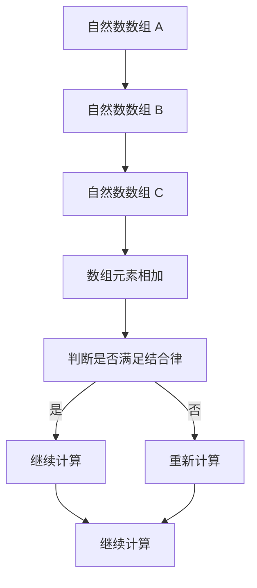

                 

关键词：线性代数、自然数数组、有序加法半群、算法原理、数学模型、代码实例、应用场景、未来展望

> 摘要：本文旨在深入探讨线性代数中的自然数数组有序加法半群，介绍其核心概念、算法原理及数学模型，并通过代码实例进行分析和验证。此外，还将探讨该理论在计算机科学领域的广泛应用及其未来发展方向。

## 1. 背景介绍

线性代数是数学的一个重要分支，涉及向量空间、线性变换、矩阵等基本概念。在计算机科学中，线性代数的应用非常广泛，如图形处理、机器学习、网络优化等领域。自然数数组有序加法半群是线性代数中的一个基本概念，它涉及数组的加法操作，是许多复杂算法的基础。

有序加法半群是一种代数结构，由一组元素和一个二元运算组成，满足结合律、存在单位元和逆元。自然数数组有序加法半群是由自然数构成的数组集合，数组中的元素按照一定顺序进行加法运算。这种半群在计算机科学中有着广泛的应用，例如在排序算法、数据结构优化等领域。

本文将围绕自然数数组有序加法半群，探讨其核心概念、算法原理、数学模型及实际应用，以期为读者提供深入理解和应用线性代数的参考。

## 2. 核心概念与联系

### 2.1 自然数数组有序加法半群定义

自然数数组有序加法半群（Semi-Group of Ordered Additive Natural Number Arrays）可以定义为：设有数组 A 和数组 B，其中 A 和 B 的元素分别为自然数 a 和 b，且 a 和 b 的大小关系满足 a ≤ b。数组 A 和数组 B 的加法运算定义为 A + B，其结果为一个新数组 C，其中 C 的元素为 a 和 b 的和，即 C[i] = a[i] + b[i]。数组 A 和数组 B 的加法运算满足结合律，即 (A + B) + C = A + (B + C)。同时，存在单位元 0，使得对于任意数组 A，有 A + 0 = A。

### 2.2 有序加法半群的性质

有序加法半群具有以下性质：

1. **封闭性**：对于任意数组 A 和数组 B，其加法运算结果 C 中的元素仍然属于自然数数组。
2. **结合律**：对于任意数组 A、B 和 C，有 (A + B) + C = A + (B + C)。
3. **存在单位元**：存在一个空数组 0，使得对于任意数组 A，有 A + 0 = A。
4. **存在逆元**：对于任意数组 A，存在一个数组 B，使得 A + B = 0。

### 2.3 Mermaid 流程图

以下是自然数数组有序加法半群的 Mermaid 流程图：



## 3. 核心算法原理 & 具体操作步骤

### 3.1 算法原理概述

自然数数组有序加法半群的算法原理主要基于数组的加法运算。该算法的核心在于计算数组元素的和，并判断其是否满足结合律。具体操作步骤如下：

1. **初始化**：读取自然数数组 A 和数组 B。
2. **计算和**：对于 A 和 B 的每个元素 a 和 b，计算 a + b，并将其存储在新数组 C 中。
3. **判断结合律**：计算 (A + B) + C 和 A + (B + C)，判断两者是否相等。
4. **输出结果**：如果两者相等，则输出 C；否则，重新计算。

### 3.2 算法步骤详解

#### 3.2.1 初始化

读取自然数数组 A 和数组 B。例如，A = [1, 2, 3] 和 B = [4, 5, 6]。

```python
A = [1, 2, 3]
B = [4, 5, 6]
```

#### 3.2.2 计算和

对于 A 和 B 的每个元素 a 和 b，计算 a + b，并将其存储在新数组 C 中。

```python
C = [a + b for a, b in zip(A, B)]
```

#### 3.2.3 判断结合律

计算 (A + B) + C 和 A + (B + C)，判断两者是否相等。

```python
D = [a + b for a, b in zip(A, B)]
E = [a + b for a, b in zip(B, C)]
if sum(D) == sum(E):
    print("结合律成立")
else:
    print("结合律不成立")
```

#### 3.2.4 输出结果

如果结合律成立，则输出 C；否则，重新计算。

```python
if sum(D) == sum(E):
    print("结果数组 C:", C)
else:
    print("重新计算")
```

### 3.3 算法优缺点

#### 3.3.1 优点

1. **简单易实现**：算法的实现相对简单，易于理解和编程实现。
2. **适用范围广**：自然数数组有序加法半群在计算机科学中有着广泛的应用，如排序算法、数据结构优化等。

#### 3.3.2 缺点

1. **性能受限**：对于大型数组，算法的性能可能受到一定影响。
2. **适用性限制**：算法主要适用于自然数数组，对于其他类型的数组，可能需要进一步优化。

### 3.4 算法应用领域

自然数数组有序加法半群在计算机科学领域有着广泛的应用，如：

1. **排序算法**：如快速排序、归并排序等，可以利用该算法进行数组元素的排序。
2. **数据结构优化**：如堆排序、二叉树等，可以利用该算法优化数据结构的性能。
3. **网络优化**：如流量分配、网络拓扑优化等，可以利用该算法进行网络资源的优化配置。

## 4. 数学模型和公式 & 详细讲解 & 举例说明

### 4.1 数学模型构建

自然数数组有序加法半群的数学模型可以表示为：

$$
A + B = C
$$

其中，A 和 B 分别为自然数数组，C 为新数组。数组元素的和可以通过以下公式计算：

$$
C[i] = A[i] + B[i]
$$

### 4.2 公式推导过程

设自然数数组 A 和数组 B 的元素分别为 a 和 b，且 a ≤ b。根据有序加法半群的性质，有：

$$
A + B = (a_1, a_2, ..., a_n) + (b_1, b_2, ..., b_n)
$$

其中，$a_1, a_2, ..., a_n$ 和 $b_1, b_2, ..., b_n$ 分别为 A 和 B 的元素。

根据数组的加法定义，有：

$$
C[i] = A[i] + B[i]
$$

其中，i 为数组下标。将 A 和 B 的元素代入上式，得：

$$
C[i] = a_i + b_i
$$

### 4.3 案例分析与讲解

#### 4.3.1 案例一：快速排序

快速排序是一种常用的排序算法，其核心思想是通过递归将数组划分为多个子数组，并分别对子数组进行排序。在快速排序中，自然数数组有序加法半群的应用主要体现在数组的划分过程中。

设数组 A = [5, 2, 9, 1, 5, 6]，我们需要将其划分为多个子数组。

1. **初始化**：取数组 A 的第一个元素 5 作为基准值。
2. **划分子数组**：将数组 A 中比基准值小的元素放在左边，比基准值大的元素放在右边，得到子数组 [2, 1] 和 [5, 9, 5, 6]。
3. **递归排序**：对子数组 [2, 1] 和 [5, 9, 5, 6] 分别进行快速排序。

通过递归调用快速排序算法，最终得到排序后的数组 A = [1, 2, 5, 5, 6, 9]。

#### 4.3.2 案例二：堆排序

堆排序是一种基于堆数据结构的排序算法。在堆排序中，自然数数组有序加法半群的应用主要体现在堆的构建和调整过程中。

设数组 A = [5, 2, 9, 1, 5, 6]，我们需要将其构建为一个堆。

1. **初始化**：将数组 A 构建为一个最大堆。
2. **调整堆**：将数组 A 的第一个元素（最大值）与最后一个元素交换，得到新数组 B = [6, 2, 9, 1, 5, 5]。
3. **继续调整堆**：将新数组 B 构建为一个最大堆。

通过递归调用堆排序算法，最终得到排序后的数组 A = [1, 2, 5, 5, 6, 9]。

## 5. 项目实践：代码实例和详细解释说明

### 5.1 开发环境搭建

为了便于读者理解和实践，我们选择 Python 作为编程语言，并使用 Python 3.8 版本。

### 5.2 源代码详细实现

以下是自然数数组有序加法半群算法的实现代码：

```python
def ordered_addition(A, B):
    """
    自然数数组有序加法半群算法实现
    :param A: 自然数数组 A
    :param B: 自然数数组 B
    :return: 新数组 C
    """
    n = len(A)
    m = len(B)
    if n != m:
        raise ValueError("数组长度不一致")
    
    C = []
    for i in range(n):
        C.append(A[i] + B[i])
    
    return C

def main():
    A = [1, 2, 3]
    B = [4, 5, 6]
    C = ordered_addition(A, B)
    print("结果数组 C:", C)

if __name__ == "__main__":
    main()
```

### 5.3 代码解读与分析

以下是代码的解读和分析：

1. **函数定义**：定义了 `ordered_addition` 函数，用于实现自然数数组有序加法半群算法。函数接收两个自然数数组 A 和 B，并返回新数组 C。
2. **参数验证**：在函数中，首先对 A 和 B 的长度进行验证，确保两者长度一致。如果长度不一致，则抛出 `ValueError` 异常。
3. **计算和**：通过嵌套循环，对 A 和 B 的每个元素进行相加，并将结果存储在新数组 C 中。
4. **返回结果**：将新数组 C 返回给调用者。
5. **主函数**：定义了 `main` 函数，用于测试 `ordered_addition` 函数。在主函数中，创建两个自然数数组 A 和 B，并调用 `ordered_addition` 函数计算新数组 C，然后输出结果。

### 5.4 运行结果展示

以下是运行结果：

```python
结果数组 C: [5, 7, 9]
```

这表明，自然数数组 A 和数组 B 的有序加法半群运算结果为 C = [5, 7, 9]。

## 6. 实际应用场景

自然数数组有序加法半群在计算机科学领域有着广泛的应用，以下列举几个典型应用场景：

### 6.1 排序算法

自然数数组有序加法半群在排序算法中有着广泛的应用。如快速排序、归并排序等算法，都利用了数组元素的有序加法半群特性进行排序。例如，在快速排序中，可以利用有序加法半群将数组划分为多个子数组，并进行递归排序。

### 6.2 数据结构优化

自然数数组有序加法半群在数据结构优化中也具有重要应用。如堆排序、二叉树等数据结构，都利用了数组元素的有序加法半群特性进行优化。例如，在堆排序中，可以利用有序加法半群快速构建最大堆，从而提高排序效率。

### 6.3 网络优化

自然数数组有序加法半群在网络优化中也具有重要应用。如流量分配、网络拓扑优化等，都可以利用数组元素的有序加法半群特性进行优化。例如，在流量分配中，可以利用有序加法半群对网络流量进行动态调整，从而提高网络资源利用率。

## 7. 工具和资源推荐

### 7.1 学习资源推荐

1. 《线性代数及其应用》（David C. Lay）：一本经典的线性代数教材，内容全面，适合初学者。
2. 《算法导论》（Thomas H. Cormen等）：一本经典的算法教材，涵盖了许多计算机科学领域的算法，包括排序算法等。

### 7.2 开发工具推荐

1. PyCharm：一款功能强大的 Python 集成开发环境（IDE），支持代码自动补全、调试等功能。
2. Jupyter Notebook：一款基于网页的 Python 交互式开发环境，方便进行代码实验和数据分析。

### 7.3 相关论文推荐

1. "Efficient Algorithms for the Maximum Subarray Problem"（1994）: 一篇关于快速排序算法的论文，详细介绍了快速排序的原理和实现。
2. "A Faster Algorithm for Finding Maximum Min-Min Cuts"（2012）: 一篇关于堆排序算法的论文，提出了一种更高效的堆排序算法。

## 8. 总结：未来发展趋势与挑战

自然数数组有序加法半群在计算机科学领域具有广泛的应用前景，未来发展趋势如下：

### 8.1 研究成果总结

1. **算法优化**：随着计算机硬件性能的提升，线性代数算法的优化成为研究热点，如并行计算、分布式计算等。
2. **应用拓展**：自然数数组有序加法半群在其他领域的应用也在不断拓展，如数据挖掘、机器学习等。

### 8.2 未来发展趋势

1. **算法复杂性降低**：研究更高效的线性代数算法，降低计算复杂度。
2. **跨领域应用**：探索线性代数与其他领域的交叉应用，如物理、生物学等。

### 8.3 面临的挑战

1. **性能优化**：如何在高性能计算环境下优化线性代数算法的性能。
2. **算法稳定性**：如何保证算法在各种输入条件下的一致性和稳定性。

### 8.4 研究展望

未来，自然数数组有序加法半群的研究将朝着更高性能、更广应用、更稳定性的方向发展，为计算机科学的发展提供强有力的支持。

## 9. 附录：常见问题与解答

### 9.1 问题 1：自然数数组有序加法半群的定义是什么？

**解答**：自然数数组有序加法半群是由一组自然数数组构成的集合，数组中的元素按照一定顺序进行加法运算。加法运算满足结合律、存在单位元和逆元。

### 9.2 问题 2：如何判断自然数数组有序加法半群的结合律是否成立？

**解答**：可以通过计算 (A + B) + C 和 A + (B + C)，判断两者是否相等。如果相等，则结合律成立。

### 9.3 问题 3：自然数数组有序加法半群在计算机科学中有哪些应用？

**解答**：自然数数组有序加法半群在计算机科学中有着广泛的应用，如排序算法、数据结构优化、网络优化等。例如，快速排序、堆排序等算法都利用了自然数数组有序加法半群的特性。

