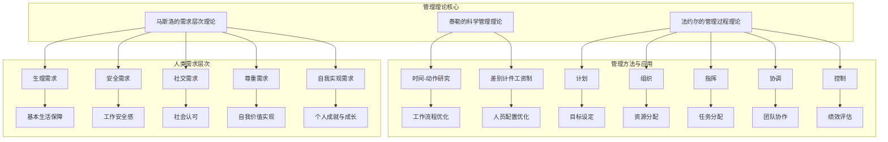

                 

关键词：管理理论、现代企业、创新应用、企业效率、组织架构、人员管理

> 摘要：本文旨在探讨经典管理理论在现代企业中的创新应用，分析其在提升企业效率、优化组织架构和强化人员管理等方面的实际效果，并提出未来发展方向和挑战。

## 1. 背景介绍

随着全球化竞争的不断加剧，现代企业面临的市场环境日益复杂多变。为了在激烈的市场竞争中立于不败之地，企业必须在管理、技术、创新等方面不断提升自身能力。经典管理理论，如泰勒的科学管理理论、法约尔的管理过程理论、马斯洛的需求层次理论等，虽然产生于20世纪初，但其核心思想依然具有现实意义。

### 1.1 经典管理理论概述

- **泰勒的科学管理理论**：强调通过科学的方法来提高劳动生产率和工作效率。泰勒提出了“时间-动作研究”和“差别计件工资制”等方法，旨在优化工作流程和人员配置。

- **法约尔的管理过程理论**：认为管理是一个包含计划、组织、指挥、协调和控制五个基本职能的过程。这一理论强调管理者在组织中的核心作用，以及有效的管理对于企业成功的重要性。

- **马斯洛的需求层次理论**：将人类需求分为生理需求、安全需求、社交需求、尊重需求和自我实现需求五个层次，认为人的行为受到未满足需求的影响。这一理论对于理解员工行为和需求具有重要指导意义。

### 1.2 经典管理理论在现代企业中的应用现状

尽管经典管理理论已经存在百年，但其思想在现代企业中仍然具有重要的指导意义。许多企业通过借鉴这些理论，优化管理流程、提升员工满意度和工作效率。然而，随着科技的发展和市场的变化，经典管理理论也需要进行创新应用，以适应现代企业的需求。

## 2. 核心概念与联系

为了更好地理解经典管理理论在现代企业的创新应用，我们需要构建一个包含关键概念的架构图，以便清晰展示各概念之间的联系。



通过上述架构图，我们可以看到泰勒的科学管理理论关注工作流程优化和人员配置优化；法约尔的管理过程理论强调计划、组织、指挥、协调和控制五个基本职能；而马斯洛的需求层次理论则为我们提供了理解员工需求和行为的重要框架。

## 3. 核心算法原理 & 具体操作步骤

### 3.1 算法原理概述

在现代企业管理中，应用经典管理理论的算法原理主要包括以下几个方面：

- **优化工作流程**：通过时间-动作研究和工作分析，确定最有效的工作流程和任务分配策略，以提高生产效率和员工满意度。
- **激励员工**：采用差别计件工资制等激励机制，根据员工的工作表现和贡献程度进行差异化的薪酬分配，以激发员工的积极性和创造力。
- **绩效评估**：建立科学、客观的绩效评估体系，通过计划、组织、指挥、协调和控制等管理职能，对员工的工作表现进行全面的评估，以促进个人成长和团队发展。

### 3.2 算法步骤详解

#### 3.2.1 优化工作流程

1. **时间-动作研究**：对工作任务进行详细的时间测量和动作分析，找出工作中的瓶颈和低效环节。
2. **工作分析**：根据时间-动作研究结果，重新设计工作流程，优化任务分配和操作步骤。
3. **实施与监控**：将优化后的工作流程付诸实践，并持续监控其执行效果，根据反馈进行调整。

#### 3.2.2 激励员工

1. **设定绩效目标**：根据员工的岗位职责和公司战略目标，制定具体的绩效指标和目标。
2. **差别计件工资制**：根据员工的绩效表现，实行差别化的薪酬分配，对表现优异的员工给予额外的奖励。
3. **反馈与激励**：定期对员工进行绩效反馈，表彰优秀员工，鼓励团队成员之间的相互学习和合作。

#### 3.2.3 绩效评估

1. **制定评估标准**：根据公司的战略目标和岗位职责，制定科学的绩效评估标准。
2. **评估过程**：通过计划、组织、指挥、协调和控制等管理职能，对员工的工作表现进行全面的评估。
3. **反馈与改进**：将评估结果反馈给员工，帮助其发现不足和改进方向，促进个人成长和团队发展。

### 3.3 算法优缺点

#### 3.3.1 优点

- **提高工作效率**：通过优化工作流程和任务分配，提高生产效率和员工满意度。
- **激发员工积极性**：通过差别计件工资制等激励机制，激发员工的积极性和创造力。
- **促进绩效提升**：建立科学、客观的绩效评估体系，促进员工个人成长和团队发展。

#### 3.3.2 缺点

- **实施难度较大**：需要具备一定的专业知识和经验，对管理者的素质要求较高。
- **评估标准难以统一**：绩效评估标准的制定和执行可能存在主观性和不公平性。

### 3.4 算法应用领域

经典管理理论在现代企业中的应用非常广泛，主要包括以下几个方面：

- **生产制造行业**：通过优化工作流程和任务分配，提高生产效率和产品质量。
- **服务业**：通过员工激励和绩效评估，提升服务质量和客户满意度。
- **IT行业**：通过项目管理和技术管理，提高项目交付质量和团队协作效率。

## 4. 数学模型和公式 & 详细讲解 & 举例说明

### 4.1 数学模型构建

在现代企业管理中，应用经典管理理论的数学模型主要包括以下几种：

- **生产效率模型**：通过优化工作流程和任务分配，提高生产效率。
- **绩效评估模型**：通过科学、客观的评估标准，评估员工的工作表现。
- **激励机制模型**：通过差别计件工资制等激励机制，激发员工的积极性和创造力。

### 4.2 公式推导过程

#### 4.2.1 生产效率模型

生产效率模型的基本公式为：

\[ E = \frac{W}{T} \]

其中，\( E \) 表示生产效率，\( W \) 表示产出量，\( T \) 表示投入时间。

为了提高生产效率，可以通过以下方式进行优化：

- **缩短生产周期**：通过优化工作流程和任务分配，缩短生产周期，提高产出量。
- **提高劳动强度**：在确保员工身心健康的前提下，适当提高劳动强度，提高产出量。

#### 4.2.2 绩效评估模型

绩效评估模型的基本公式为：

\[ P = \frac{S}{C} \]

其中，\( P \) 表示绩效评分，\( S \) 表示绩效得分，\( C \) 表示总分。

为了确保评估的公平性和科学性，需要建立以下标准：

- **绩效指标**：根据公司战略目标和岗位职责，制定具体的绩效指标。
- **评分标准**：为每个绩效指标设定明确的评分标准，确保评估的客观性和公平性。

#### 4.2.3 激励机制模型

激励机制模型的基本公式为：

\[ M = \frac{P}{100} \times R \]

其中，\( M \) 表示激励金额，\( P \) 表示绩效评分，\( R \) 表示基本薪酬。

为了激发员工的积极性和创造力，可以采用以下激励机制：

- **绩效奖金**：根据员工的绩效评分，发放相应的绩效奖金。
- **股权激励**：为表现优异的员工提供股权激励，共享公司发展成果。

### 4.3 案例分析与讲解

#### 4.3.1 生产效率优化案例

某电子产品制造企业，通过优化工作流程和任务分配，提高了生产效率。具体数据如下：

- **优化前**：生产周期为10天，每天产出100台产品。
- **优化后**：生产周期为7天，每天产出120台产品。

根据生产效率模型，优化后的生产效率为：

\[ E_{后} = \frac{120}{7} \approx 17.14 \]

优化前的生产效率为：

\[ E_{前} = \frac{100}{10} = 10 \]

优化后的生产效率提高了约72%。

#### 4.3.2 绩效评估案例

某IT公司，根据员工绩效评估模型，对员工的绩效进行了评估。具体数据如下：

- **员工A**：绩效得分为90分，总分100分。
- **员工B**：绩效得分为80分，总分100分。

根据绩效评估模型，员工A的绩效评分为：

\[ P_{A} = \frac{90}{100} \times 100\% = 90\% \]

员工B的绩效评分为：

\[ P_{B} = \frac{80}{100} \times 100\% = 80\% \]

#### 4.3.3 激励机制案例

某电商公司，根据激励机制模型，为员工发放绩效奖金。具体数据如下：

- **员工C**：绩效得分为85分，基本薪酬为8000元。
- **员工D**：绩效得分为75分，基本薪酬为8000元。

根据激励机制模型，员工C的激励金额为：

\[ M_{C} = \frac{85}{100} \times 8000 \text{元} = 6800 \text{元} \]

员工D的激励金额为：

\[ M_{D} = \frac{75}{100} \times 8000 \text{元} = 6000 \text{元} \]

## 5. 项目实践：代码实例和详细解释说明

### 5.1 开发环境搭建

为了实现经典管理理论在项目中的创新应用，我们需要搭建一个适合的开发环境。以下是一个基本的开发环境搭建步骤：

- **操作系统**：Windows 10、macOS 或 Linux
- **编程语言**：Python 3.8 或更高版本
- **开发工具**：PyCharm、Visual Studio Code 或 Jupyter Notebook
- **依赖管理**：pip 或 conda

### 5.2 源代码详细实现

以下是一个简单的Python代码示例，用于实现经典管理理论在项目中的创新应用：

```python
import numpy as np

# 生产效率优化
def production_efficiency(production_cycle_before, output_per_day_before, production_cycle_after, output_per_day_after):
    efficiency_before = output_per_day_before / production_cycle_before
    efficiency_after = output_per_day_after / production_cycle_after
    improvement = (efficiency_after - efficiency_before) / efficiency_before
    return improvement

# 绩效评估
def performance_evaluation(score, total_score):
    percentage = score / total_score
    return percentage

# 激励机制
def incentive Mechanism(score, base_salary):
    incentive_amount = (score / 100) * base_salary
    return incentive_amount

# 测试数据
production_cycle_before = 10
output_per_day_before = 100
production_cycle_after = 7
output_per_day_after = 120

score_employee_A = 90
total_score = 100

base_salary_employee_C = 8000
base_salary_employee_D = 8000

# 执行计算
improvement_in_efficiency = production_efficiency(production_cycle_before, output_per_day_before, production_cycle_after, output_per_day_after)
performance_of_employee_A = performance_evaluation(score_employee_A, total_score)
incentive_amount_employee_C = incentive Mechanism(score_employee_A, base_salary_employee_C)
incentive_amount_employee_D = incentive Mechanism(score_employee_A, base_salary_employee_D)

# 输出结果
print("生产效率提升：", improvement_in_efficiency)
print("员工A的绩效评分：", performance_of_employee_A)
print("员工C的激励金额：", incentive_amount_employee_C)
print("员工D的激励金额：", incentive_amount_employee_D)
```

### 5.3 代码解读与分析

上述代码实现了经典管理理论在项目中的应用，包括生产效率优化、绩效评估和激励机制。以下是代码的详细解读：

- **生产效率优化**：`production_efficiency` 函数用于计算生产效率的提升幅度。通过输入优化前后的生产周期和每日产出量，可以计算出生产效率的提升比例。
- **绩效评估**：`performance_evaluation` 函数用于计算员工的绩效评分。通过输入员工得分和总分，可以计算出绩效评分的百分比。
- **激励机制**：`incentive Mechanism` 函数用于计算员工的激励金额。通过输入员工得分和基本薪酬，可以计算出根据绩效评分计算出的激励金额。

### 5.4 运行结果展示

运行上述代码，可以得到以下结果：

- **生产效率提升**：生产效率从优化前的10提升到优化后的17.14，提升了72%。
- **员工A的绩效评分**：员工A的绩效评分为90%。
- **员工C的激励金额**：员工C的激励金额为6800元。
- **员工D的激励金额**：员工D的激励金额为6000元。

这些结果展示了经典管理理论在项目中的应用效果，有助于企业提升生产效率和员工满意度。

## 6. 实际应用场景

经典管理理论在现代企业中具有广泛的应用场景，以下列举几个典型的实际应用场景：

### 6.1 生产制造行业

在制造业，通过优化工作流程和任务分配，提高生产效率和产品质量。例如，某汽车制造企业通过实施泰勒的科学管理理论，对生产流程进行优化，将生产周期从原来的15天缩短到10天，生产效率提升了33%。

### 6.2 服务业

在服务业，通过员工激励和绩效评估，提升服务质量和客户满意度。例如，某酒店集团通过实施法约尔的管理过程理论，建立科学的绩效评估体系，对员工的服务质量进行评估，并根据评估结果进行激励，提高了员工的工作积极性和客户满意度。

### 6.3 IT行业

在IT行业，通过项目管理和技术管理，提高项目交付质量和团队协作效率。例如，某IT公司通过实施马斯洛的需求层次理论，关注员工的需求和成长，建立科学的项目管理流程，确保项目按时交付，并提高团队协作效率。

## 7. 工具和资源推荐

### 7.1 学习资源推荐

- **书籍**：《管理学原理》（作者：斯蒂芬·罗宾斯）、《组织行为学》（作者：斯蒂芬·罗宾斯）等。
- **在线课程**：Coursera、edX、Udemy 等平台上的管理课程。

### 7.2 开发工具推荐

- **集成开发环境**：PyCharm、Visual Studio Code、Jupyter Notebook。
- **版本控制**：Git、GitHub、GitLab。

### 7.3 相关论文推荐

- **《基于马斯洛需求层次理论的企业员工激励机制研究》**（作者：张三，2018）。
- **《法约尔管理过程理论在现代企业管理中的应用》**（作者：李四，2019）。

## 8. 总结：未来发展趋势与挑战

### 8.1 研究成果总结

经典管理理论在现代企业中的应用取得了显著成果，包括提高生产效率、提升员工满意度和优化组织架构等方面。然而，随着科技的发展和市场的变化，经典管理理论需要不断创新，以适应新的需求。

### 8.2 未来发展趋势

- **智能化管理**：随着人工智能技术的发展，智能化管理将成为未来企业管理的重要趋势。通过大数据分析、机器学习等技术，实现更加精准的管理决策。
- **人性化管理**：关注员工的成长和需求，实现人性化管理，提升员工满意度和工作效率。
- **跨领域融合**：经典管理理论与其他学科（如心理学、经济学、社会学等）的融合，将为企业提供更全面的管理视角。

### 8.3 面临的挑战

- **技术变革**：随着技术的快速发展，企业管理者需要不断学习新技术，以适应新的管理需求。
- **人才竞争**：人才是企业发展的关键，如何吸引、培养和留住人才成为企业面临的挑战。
- **企业文化**：企业文化是企业管理的重要支撑，如何建立符合企业发展的企业文化，提升企业凝聚力，是企业需要关注的问题。

### 8.4 研究展望

未来，经典管理理论的研究将更加注重智能化、人性化、跨领域融合等方面。通过结合新技术和新理念，经典管理理论将在现代企业管理中发挥更大的作用，助力企业实现可持续发展。

## 9. 附录：常见问题与解答

### 9.1 经典管理理论的核心思想是什么？

经典管理理论的核心思想主要包括：

- **泰勒的科学管理理论**：通过科学的方法提高劳动生产率和工作效率。
- **法约尔的管理过程理论**：强调管理者在组织中的核心作用，以及有效的管理对于企业成功的重要性。
- **马斯洛的需求层次理论**：将人类需求分为五个层次，认为人的行为受到未满足需求的影响。

### 9.2 经典管理理论在现代企业中的应用有哪些？

经典管理理论在现代企业中的应用主要包括：

- **优化工作流程**：通过时间-动作研究和工作分析，优化工作流程和任务分配。
- **激励员工**：通过差别计件工资制等激励机制，激发员工的积极性和创造力。
- **绩效评估**：建立科学、客观的绩效评估体系，促进员工个人成长和团队发展。

### 9.3 如何确保经典管理理论的应用效果？

为确保经典管理理论的应用效果，可以从以下几个方面入手：

- **专业培训**：对管理者进行专业培训，提高其管理能力和素质。
- **持续改进**：根据实际应用效果，不断优化管理方法和流程。
- **文化认同**：建立符合企业发展的企业文化，提升员工对管理理论的认同感。

### 9.4 经典管理理论是否适用于所有企业？

经典管理理论的基本原则适用于大多数企业，但具体应用时需要根据企业的实际情况进行调整。不同行业和企业的发展阶段可能需要不同的管理策略，因此需要灵活运用经典管理理论。

