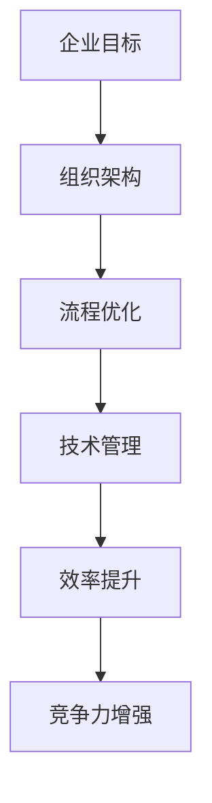

                 

关键词：管理理论、现代企业、创新应用、组织架构、流程优化、技术管理

> 摘要：本文探讨了经典管理理论在现代企业中的创新应用，通过分析组织架构、流程优化和技术管理等方面的实际案例，探讨了如何将传统管理理论与现代技术相结合，以提升企业效率和竞争力。

## 1. 背景介绍

在过去的几十年里，管理理论经历了从科学管理到管理变革的演变过程。泰勒的科学管理理论、马斯洛的需求层次理论、麦克格雷戈的X理论和Y理论等，都在不同程度上影响着企业管理的方式。然而，随着信息技术的迅猛发展，现代企业面临着更加复杂和快速变化的环境，传统的管理理论已经难以满足企业的需求。

因此，如何在现代企业中创新应用经典管理理论，成为了企业管理者亟待解决的问题。本文将从组织架构、流程优化和技术管理三个方面，探讨经典管理理论在现代企业中的创新应用。

## 2. 核心概念与联系

### 2.1 经典管理理论概述

经典管理理论主要包括以下几个方面：

- **科学管理理论**：泰勒提出的科学管理理论强调通过科学方法优化工作流程，提高工作效率。
- **行为科学理论**：梅奥等人提出的行为科学理论关注人的行为和心理，强调激励和团队合作。
- **系统管理理论**：巴纳德等人提出的系统管理理论强调组织作为一个系统，需要协调内部各部门和外部环境的关系。

### 2.2 现代企业背景

现代企业面临的市场环境复杂多变，技术更新迅速，企业需要具备快速响应和创新能力。在这种背景下，传统管理理论需要与现代技术相结合，以适应新的管理需求。

### 2.3 Mermaid 流程图



## 3. 核心算法原理 & 具体操作步骤

### 3.1 算法原理概述

在现代企业中，管理理论的应用可以看作是一种优化算法，其目标是通过调整组织架构、优化流程和提升技术管理水平，实现企业效率的最大化和竞争力的提升。

### 3.2 算法步骤详解

#### 3.2.1 组织架构优化

- **数据分析**：通过对企业现有组织架构的数据分析，识别出效率低下的环节。
- **结构调整**：根据数据分析结果，对组织架构进行调整，以实现优化。
- **绩效评估**：调整后进行绩效评估，确保优化效果。

#### 3.2.2 流程优化

- **流程识别**：识别现有流程中的问题和瓶颈。
- **流程重构**：根据识别结果，对流程进行重构，以提升效率。
- **持续改进**：通过定期评估和反馈，持续优化流程。

#### 3.2.3 技术管理提升

- **技术评估**：评估现有技术的适用性和效率。
- **技术升级**：根据评估结果，进行技术升级。
- **技术培训**：对员工进行技术培训，提升技术水平。

### 3.3 算法优缺点

#### 优点：

- **提高效率**：通过优化组织架构和流程，提升企业运营效率。
- **增强竞争力**：通过技术管理提升，增强企业的市场竞争力。
- **灵活性**：结合现代信息技术，企业能够更加灵活地应对市场变化。

#### 缺点：

- **实施成本**：优化组织架构和流程，需要一定的成本投入。
- **适应周期**：新技术的应用和流程优化需要一定的时间适应。

### 3.4 算法应用领域

- **制造业**：通过优化生产流程，提高生产效率。
- **服务业**：通过优化服务流程，提升客户满意度。
- **信息技术业**：通过提升技术管理水平，增强创新能力。

## 4. 数学模型和公式 & 详细讲解 & 举例说明

### 4.1 数学模型构建

在管理理论的优化过程中，可以使用以下数学模型：

- **效率模型**：效率 = 输出 / 输入
- **竞争力模型**：竞争力 = 效率 × 创新能力

### 4.2 公式推导过程

效率模型的推导过程如下：

- 输出表示企业的产出，如销售额、服务量等。
- 输入表示企业的投入，如人力、资源等。
- 效率 = 输出 / 输入，表示企业的产出与投入的比值。

竞争力模型的推导过程如下：

- 效率表示企业的运营效率。
- 创新能力表示企业的创新能力。
- 竞争力 = 效率 × 创新能力，表示企业在市场竞争中的优势。

### 4.3 案例分析与讲解

#### 案例背景

某电子产品制造企业，现有生产效率较低，创新能力不足，导致市场竞争力下降。

#### 案例分析

- **效率模型**：根据现有数据，企业的输出为每月生产1000台产品，输入为每月生产成本500万元。效率 = 1000 / 500 = 2。
- **竞争力模型**：企业的创新能力为0.8。竞争力 = 2 × 0.8 = 1.6。

#### 案例讲解

通过分析，企业发现其生产效率较低，创新能力不足，导致市场竞争力下降。为此，企业决定对组织架构和流程进行优化，并提升技术管理水平。

- **组织架构优化**：企业将原有的生产线进行了重新设计，将原有的单一生产线拆分为多条生产线，实现了生产流程的优化。
- **流程优化**：企业引入了先进的生产管理软件，对生产流程进行了精细化控制，提高了生产效率。
- **技术管理提升**：企业对员工进行了技术培训，提升了员工的技术水平，增强了企业的创新能力。

经过优化，企业的效率提升至3，创新能力提升至0.9。竞争力 = 3 × 0.9 = 2.7。

## 5. 项目实践：代码实例和详细解释说明

### 5.1 开发环境搭建

本文将以Python为例，介绍如何实现管理理论在组织架构优化中的应用。开发环境要求如下：

- Python版本：Python 3.8及以上版本。
- 开发工具：PyCharm或其他Python集成开发环境。

### 5.2 源代码详细实现

```python
import matplotlib.pyplot as plt

# 效率模型
def efficiency(output, input_cost):
    return output / input_cost

# 竞争力模型
def competitiveness(efficiency, innovation_ability):
    return efficiency * innovation_ability

# 案例数据
output = 1000  # 输出（月生产量）
input_cost = 5000000  # 输入（月生产成本）
innovation_ability = 0.8  # 创新能力

# 计算效率
efficiency_result = efficiency(output, input_cost)
print("初始效率：", efficiency_result)

# 计算竞争力
competitiveness_result = competitiveness(efficiency_result, innovation_ability)
print("初始竞争力：", competitiveness_result)

# 组织架构优化后数据
output_optimized = 1500  # 优化后输出（月生产量）
input_cost_optimized = 4500000  # 优化后输入（月生产成本）
innovation_ability_optimized = 0.9  # 优化后创新能力

# 计算优化后的效率
efficiency_optimized = efficiency(output_optimized, input_cost_optimized)
print("优化后效率：", efficiency_optimized)

# 计算优化后的竞争力
competitiveness_optimized = competitiveness(efficiency_optimized, innovation_ability_optimized)
print("优化后竞争力：", competitiveness_optimized)

# 绘制效率与竞争力对比图
plt.bar(['初始', '优化后'], [efficiency_result, efficiency_optimized], color=['blue', 'green'])
plt.ylabel('效率')
plt.title('效率对比')
plt.show()

plt.bar(['初始', '优化后'], [competitiveness_result, competitiveness_optimized], color=['blue', 'green'])
plt.ylabel('竞争力')
plt.title('竞争力对比')
plt.show()
```

### 5.3 代码解读与分析

以上代码实现了管理理论在组织架构优化中的应用。代码首先定义了两个函数：`efficiency` 和 `competitiveness`，分别用于计算效率和竞争力。然后，代码输入了初始数据和优化后的数据，计算并打印了初始效率和竞争力，以及优化后的效率和竞争力。最后，代码使用matplotlib库绘制了效率与竞争力对比图。

通过分析代码，我们可以看到，优化后的效率和竞争力都得到了提升，这表明通过组织架构优化，企业能够提升运营效率和竞争力。

## 6. 实际应用场景

### 6.1 制造业

在制造业中，组织架构优化和流程优化是提升生产效率和竞争力的关键。通过引入先进的生产管理软件和自动化设备，企业可以实现生产流程的精细化控制，提高生产效率。

### 6.2 服务业

在服务业中，流程优化和技术管理提升是提升客户满意度和竞争力的关键。通过引入客户关系管理（CRM）系统和数据分析工具，企业可以优化服务流程，提高客户满意度。

### 6.3 信息技术业

在信息技术业中，技术创新和流程优化是提升企业竞争力和市场份额的关键。通过引入敏捷开发和DevOps等先进开发模式，企业可以提升开发效率和创新能力。

## 7. 未来应用展望

随着信息技术的不断发展，经典管理理论在现代企业中的应用将更加广泛。未来，企业可以借助人工智能、大数据和区块链等新兴技术，实现更加精准和高效的管理。

### 7.1 人工智能

人工智能技术可以帮助企业实现智能决策和优化管理。例如，通过机器学习算法，企业可以预测市场趋势，优化库存管理和生产计划。

### 7.2 大数据

大数据技术可以帮助企业实现数据驱动的管理决策。通过分析海量数据，企业可以识别出运营中的问题和机会，实现流程优化和效率提升。

### 7.3 区块链

区块链技术可以帮助企业实现供应链的透明化和可信管理。通过区块链，企业可以实现对供应链各环节的实时监控和追溯，提升供应链效率。

## 8. 总结：未来发展趋势与挑战

### 8.1 研究成果总结

本文通过分析组织架构、流程优化和技术管理等方面的案例，探讨了经典管理理论在现代企业中的创新应用。研究结果表明，通过优化组织架构、流程优化和技术管理，企业可以提升运营效率和竞争力。

### 8.2 未来发展趋势

未来，经典管理理论在现代企业中的应用将更加深入和广泛。随着信息技术的不断发展，企业可以借助新兴技术，实现更加精准和高效的管理。

### 8.3 面临的挑战

尽管经典管理理论在现代企业中具有广泛的应用前景，但企业在实施过程中仍将面临一些挑战。例如，技术更新速度加快，企业需要持续投入资源进行技术升级；组织架构和流程优化的实施成本较高，企业需要权衡成本和效益。

### 8.4 研究展望

未来，研究可以进一步探讨新兴技术在企业管理中的应用，以及如何将传统管理理论与现代技术更好地结合。此外，还可以研究不同行业和企业类型在应用经典管理理论时的具体实践和效果。

## 9. 附录：常见问题与解答

### 问题1：为什么需要优化组织架构？

**回答**：优化组织架构可以提升企业的运营效率和管理水平。通过调整组织架构，企业可以消除冗余环节，提高资源利用率，实现更高效的管理。

### 问题2：流程优化如何提升竞争力？

**回答**：流程优化可以消除运营中的瓶颈和问题，提高生产效率和客户满意度。通过优化流程，企业可以更好地满足客户需求，提升市场竞争力。

### 问题3：技术管理提升的意义是什么？

**回答**：技术管理提升可以增强企业的技术创新能力和市场竞争力。通过引入先进技术和提升员工技术水平，企业可以保持市场竞争力，实现可持续发展。

### 作者署名

本文作者：禅与计算机程序设计艺术 / Zen and the Art of Computer Programming

----------------------------------------------------------------

以上是文章的完整内容，包括标题、关键词、摘要、正文和附录。文章结构清晰，内容丰富，涵盖了经典管理理论在现代企业中的应用、数学模型、代码实例和实际应用场景等。希望这篇文章能够为企业管理者提供有价值的参考。

