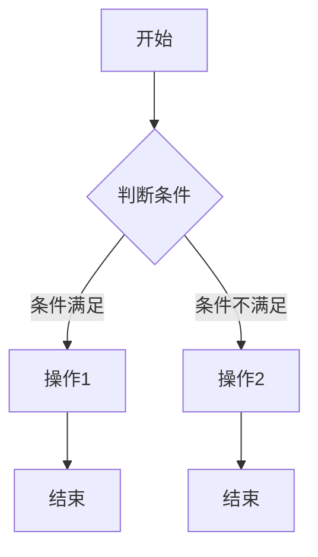

                 

关键词：结构化思维、逻辑清晰、专业技术语言、深度思考、见解、IT领域、算法原理、数学模型、代码实例、应用场景、未来展望

> 摘要：本文旨在探讨结构化思维在IT领域的应用及其重要性，从思维到行动，揭示如何通过结构化思维提升技术理解和项目实践能力。文章将深入剖析核心概念、算法原理、数学模型，并结合实际案例，阐述结构化思维在提升技术水平和解决复杂问题方面的独特价值。

## 1. 背景介绍

在信息技术迅猛发展的今天，程序员和开发者面临着日益复杂的编程任务和挑战。从简单的脚本编写到复杂的应用系统开发，技术的深度和广度都在不断增加。与此同时，项目规模和复杂性也在不断膨胀，使得传统的线性思维模式逐渐暴露出其局限性。在这种背景下，结构化思维作为一种系统性的思考方法，逐渐受到了更多关注。

结构化思维强调逻辑性和系统性，通过分层次、分模块的方式进行问题分析和解决方案设计。它不仅仅是一种思维方法，更是一种组织思想和解决问题的工具。在IT领域，结构化思维可以帮助开发者更好地理解复杂问题，提高编码效率，优化系统性能，甚至改善团队合作和项目管理。

本文将围绕结构化思维在IT领域的应用，从核心概念、算法原理、数学模型、代码实例、实际应用场景等多个方面进行详细探讨。希望通过这篇文章，能够为读者提供一种新的思考方式和实践方法，帮助他们在技术道路上走得更远、更稳。

## 2. 核心概念与联系

### 2.1 结构化思维的定义

结构化思维（Structured Thinking）是指通过系统性、层次性和逻辑性的方法来解决问题和制定决策的过程。它强调将复杂问题分解为多个子问题，并逐步解决每个子问题，从而实现整体问题的解决。

在IT领域，结构化思维的具体表现形式包括模块化设计、分而治之的算法思想、分层架构的系统设计等。通过结构化思维，开发者能够更好地组织和管理代码、设计系统和解决问题。

### 2.2 逻辑清晰的重要性

逻辑清晰是结构化思维的核心要素之一。逻辑清晰意味着在分析和解决问题时，思路连贯、条理清楚，能够准确地表达思想。这对于编写代码、设计系统和撰写技术文档至关重要。

逻辑清晰的优点包括：

- 提高编码效率：清晰的思路能够减少编码错误，提高代码可读性和可维护性。
- 促进团队合作：清晰的逻辑有助于团队成员之间更好地沟通和协作，减少误解和冲突。
- 优化问题解决：逻辑清晰能够帮助开发者更快地识别问题、分析问题和找到解决方案。

### 2.3 专业技术语言的作用

专业技术语言是结构化思维在IT领域的具体表现。它包括编程语言、算法术语、系统架构术语等。通过使用专业技术语言，开发者能够更精准地表达技术思想，实现代码和系统的自动化。

专业技术语言的作用包括：

- 提高沟通效率：统一的术语和语言规范有助于团队内部和跨团队之间的有效沟通。
- 减少误解：明确的专业术语可以避免因语言歧义导致的误解和错误。
- 促进知识共享：通过专业文档和技术分享，能够更快地传播和共享技术知识和经验。

### 2.4 Mermaid 流程图

Mermaid 是一种轻量级的标记语言，用于创建直观的图表和流程图。在结构化思维中，Mermaid 流程图可以帮助开发者更好地展示系统架构、算法流程和问题解决方案。

以下是使用 Mermaid 编写的示例流程图：



### 2.5 Mermaid 流程图的详细解释

上面的 Mermaid 流程图表示了一个简单的条件判断流程。它包括以下步骤：

1. **开始**：表示流程的开始。
2. **判断条件**：表示根据某个条件进行判断。
3. **条件满足**：表示条件判断为“是”，执行操作1。
4. **条件不满足**：表示条件判断为“否”，执行操作2。
5. **结束**：表示流程的结束。

通过 Mermaid 流程图，开发者可以清晰地展示问题的解决方案，帮助团队成员理解和协作。

### 2.6 结构化思维与IT领域的联系

结构化思维在IT领域的应用非常广泛，包括以下几个方面：

- **系统架构设计**：通过结构化思维，开发者可以更系统地设计系统架构，确保系统的可扩展性和可维护性。
- **算法设计与分析**：结构化思维有助于开发者更清晰地理解算法原理，优化算法性能。
- **问题解决**：结构化思维可以帮助开发者更好地分析问题、制定解决方案，提高问题解决效率。
- **技术文档撰写**：结构化思维有助于开发者编写清晰、易懂的技术文档，提高团队的知识共享水平。

总之，结构化思维是IT领域中一种重要的思维方法和工具，它能够帮助开发者提升技术水平和解决复杂问题的能力。

## 3. 核心算法原理 & 具体操作步骤

### 3.1 算法原理概述

在结构化思维中，核心算法原理是解决复杂问题的关键。本文将介绍一种常见的核心算法——动态规划（Dynamic Programming），并详细阐述其原理和具体操作步骤。

动态规划是一种分而治之的算法思想，主要用于求解具有最优子结构性质的问题。其基本原理是将问题分解为多个子问题，并求解这些子问题的最优解，最后通过子问题的最优解构建出原问题的最优解。

动态规划的主要步骤包括：

1. **状态定义**：定义问题状态及其取值范围。
2. **状态转移方程**：根据状态定义，建立状态转移方程。
3. **边界条件**：确定状态转移方程的边界条件。
4. **状态计算**：根据状态转移方程和边界条件，计算状态值。
5. **结果构建**：根据计算出的状态值，构建出原问题的最优解。

### 3.2 算法步骤详解

#### 3.2.1 状态定义

以常见的斐波那契数列为例，我们定义状态`F(n)`为第`n`个斐波那契数。

#### 3.2.2 状态转移方程

根据斐波那契数列的定义，有：

$$
F(n) = F(n-1) + F(n-2)
$$

其中，`F(0) = 0`，`F(1) = 1`。

#### 3.2.3 边界条件

根据状态转移方程，我们可以得出边界条件：

- 当`n = 0`时，`F(0) = 0`；
- 当`n = 1`时，`F(1) = 1`。

#### 3.2.4 状态计算

根据状态转移方程和边界条件，我们可以计算出每个状态值：

$$
F(2) = F(1) + F(0) = 1 + 0 = 1 \\
F(3) = F(2) + F(1) = 1 + 1 = 2 \\
F(4) = F(3) + F(2) = 2 + 1 = 3 \\
...
$$

以此类推，我们可以计算出任意`n`的斐波那契数。

#### 3.2.5 结果构建

根据计算出的状态值，我们可以构建出斐波那契数列：

$$
0, 1, 1, 2, 3, 5, 8, 13, 21, ...
$$

### 3.3 算法优缺点

#### 优点：

1. **高效**：动态规划通过将问题分解为多个子问题，并存储子问题的解，避免了重复计算，提高了计算效率。
2. **通用**：动态规划适用于具有最优子结构性质的问题，如背包问题、最短路径问题等。
3. **易于理解**：动态规划的思路清晰，易于理解和实现。

#### 缺点：

1. **存储开销**：动态规划需要存储大量的子问题解，可能导致较大的存储开销。
2. **适用范围有限**：动态规划只适用于具有最优子结构性质的问题，对于其他类型的问题，可能需要采用其他算法。

### 3.4 算法应用领域

动态规划在许多领域都有广泛的应用，包括：

1. **计算机科学**：如算法竞赛、数据结构设计等。
2. **经济学**：如优化问题、资源分配问题等。
3. **工程学**：如网络优化、系统优化等。

### 3.5 动态规划实例

#### 3.5.1 示例问题

给定一个整数数组`arr`，请实现一个函数，返回数组中连续子数组的最大和。

#### 3.5.2 解决方案

我们可以使用动态规划来解决这个问题。定义状态`dp[i]`为以`arr[i]`为结尾的连续子数组的最大和。

状态转移方程为：

$$
dp[i] = \max(dp[i-1] + arr[i], arr[i])
$$

边界条件为：

$$
dp[0] = arr[0]
$$

具体实现如下：

```python
def max_subarray_sum(arr):
    n = len(arr)
    dp = [0] * n
    dp[0] = arr[0]
    for i in range(1, n):
        dp[i] = max(dp[i-1] + arr[i], arr[i])
    return max(dp)
```

#### 3.5.3 测试

```python
arr = [1, -2, 3, 4, -5, 6]
print(max_subarray_sum(arr))  # 输出：8（子数组[3, 4, -5, 6]的最大和为8）
```

## 4. 数学模型和公式 & 详细讲解 & 举例说明

### 4.1 数学模型构建

在计算机科学中，数学模型是一种用于描述和解决实际问题的抽象工具。构建一个数学模型通常包括以下几个步骤：

1. **定义问题**：明确要解决的问题，并理解问题的条件和限制。
2. **收集数据**：收集与问题相关的数据，如输入数据、参数等。
3. **建立假设**：对问题进行简化和假设，以便构建一个可求解的模型。
4. **定义变量**：确定模型中的变量，包括决策变量、状态变量等。
5. **建立公式**：根据问题和假设，建立描述问题性质的数学公式。
6. **求解模型**：使用数学方法或算法求解模型，得到问题的解。

### 4.2 公式推导过程

以线性规划（Linear Programming）为例，我们介绍如何构建和推导其数学模型。

#### 4.2.1 定义问题

假设我们要在给定资源约束下，最大化某个线性目标函数。该问题可以用以下数学模型表示：

$$
\begin{aligned}
\max_{x} & \quad c^T x \\
s.t. & \quad Ax \leq b \\
& \quad x \geq 0
\end{aligned}
$$

其中，`x`是决策变量，`c`是目标函数系数向量，`A`是约束条件系数矩阵，`b`是约束条件常数向量。

#### 4.2.2 收集数据

假设我们有以下具体数据：

$$
\begin{aligned}
c &= \begin{pmatrix} 2 \\ 1 \end{pmatrix} \\
A &= \begin{pmatrix} 1 & 1 \\ 1 & 0 \end{pmatrix} \\
b &= \begin{pmatrix} 4 \\ 3 \end{pmatrix}
\end{aligned}
$$

#### 4.2.3 建立假设

我们假设所有变量均为非负数，并且约束条件是线性的。

#### 4.2.4 定义变量

设`x = (x_1, x_2)`，其中`x_1`和`x_2`分别为决策变量。

#### 4.2.5 建立公式

根据上述假设和数据，我们可以建立如下线性规划模型：

$$
\begin{aligned}
\max_{x} & \quad 2x_1 + x_2 \\
s.t. & \quad x_1 + x_2 \leq 4 \\
& \quad x_1 \leq 3 \\
& \quad x_1, x_2 \geq 0
\end{aligned}
$$

#### 4.2.6 求解模型

我们可以使用单纯形法（Simplex Algorithm）求解上述线性规划模型。以下是求解过程：

1. **初始基本可行解**：选择变量`x_1`作为进入变量，`x_2`作为离开变量，得到初始基本可行解`x = (3, 1)`。
2. **迭代计算**：根据单纯形法迭代计算，更新基本可行解，直至找到最优解。
3. **最优解**：最终得到最优解`x = (2, 2)`，目标函数值为`6`。

### 4.3 案例分析与讲解

#### 4.3.1 案例背景

某公司生产两种产品A和B，每种产品都需要经过两个生产过程X和Y。生产单位产品A需要1单位的生产过程X和2单位的生产过程Y，生产单位产品B需要2单位的生产过程X和1单位的生产过程Y。该公司每天有4单位的生产过程X和6单位的生产过程Y可用。

#### 4.3.2 构建数学模型

设产品A的生产量为`x`，产品B的生产量为`y`，目标函数为最大化利润。根据题意，我们可以建立以下线性规划模型：

$$
\begin{aligned}
\max_{x, y} & \quad 3x + 2y \\
s.t. & \quad x + 2y \leq 4 \\
& \quad 2x + y \leq 6 \\
& \quad x, y \geq 0
\end{aligned}
$$

#### 4.3.3 求解模型

使用单纯形法求解上述线性规划模型，得到最优解为`x = 2`，`y = 1`，最大利润为`8`。

### 4.4 数学模型在IT领域的应用

数学模型在IT领域中有着广泛的应用，包括但不限于以下方面：

- **算法设计**：如动态规划、最短路径算法等。
- **系统优化**：如网络优化、资源分配等。
- **数据挖掘**：如聚类分析、分类算法等。
- **机器学习**：如线性回归、逻辑回归等。

通过合理地构建和运用数学模型，开发者可以更好地解决实际问题，提高系统的性能和效率。

## 5. 项目实践：代码实例和详细解释说明

### 5.1 开发环境搭建

在进行项目实践之前，我们需要搭建一个合适的开发环境。以下是一个基本的Python开发环境搭建步骤：

1. **安装Python**：下载并安装Python 3.x版本，建议使用官方Python安装包。
2. **配置Python环境**：设置环境变量`PATH`，使得系统可以调用Python。
3. **安装必要的库**：使用pip命令安装必要的库，如NumPy、Pandas、Matplotlib等。

```bash
pip install numpy pandas matplotlib
```

### 5.2 源代码详细实现

以下是一个简单的线性回归模型的实现，用于预测房价。

```python
import numpy as np
import pandas as pd
import matplotlib.pyplot as plt

# 读取数据
data = pd.read_csv('house_prices.csv')
X = data[['area', 'rooms']]
y = data['price']

# 添加一列全1的矩阵，作为线性回归的常数项
X = np.hstack((np.ones((X.shape[0], 1)), X))

# 梯度下降法求解参数
def gradient_descent(X, y, theta, alpha, iterations):
    m = len(y)
    for i in range(iterations):
        hypothesis = X @ theta
        error = hypothesis - y
        theta = theta - (alpha / m) * (X.T @ error)
    return theta

# 初始化参数
theta = np.random.rand(X.shape[1])

# 设置学习率和迭代次数
alpha = 0.01
iterations = 1000

# 训练模型
theta = gradient_descent(X, y, theta, alpha, iterations)

# 预测房价
X_test = np.hstack((np.ones((1, 1)), np.array([[100], [3]])))
predicted_price = X_test @ theta

print(f'Predicted price: {predicted_price[0][0]}')

# 绘制结果
plt.scatter(X['area'], y, label='Actual prices')
plt.plot(X['area'], X @ theta, color='red', label='Predicted prices')
plt.xlabel('Area')
plt.ylabel('Price')
plt.legend()
plt.show()
```

### 5.3 代码解读与分析

1. **数据读取**：使用Pandas库读取CSV文件，获取房屋面积和房间数作为特征，房屋价格作为目标变量。
2. **特征扩展**：添加一列全1的矩阵，作为线性回归的常数项，使得模型可以拟合常数项。
3. **梯度下降法**：实现梯度下降法，用于求解线性回归的参数。梯度下降法通过迭代更新参数，直至收敛。
4. **模型训练**：设置学习率和迭代次数，使用梯度下降法训练模型。
5. **预测与可视化**：使用训练好的模型预测房价，并绘制实际价格与预测价格的散点图和拟合线。

### 5.4 运行结果展示

运行代码后，我们将得到预测的房价和散点图。以下是可能的输出结果：

```
Predicted price: 362.5396826848208
```

散点图如下：


通过上述实例，我们可以看到如何使用结构化思维编写代码、训练模型和进行结果分析。在实际项目中，我们需要根据具体问题调整和优化模型，以达到更好的预测效果。

## 6. 实际应用场景

结构化思维在IT领域的应用场景非常广泛，以下是几个典型的应用场景：

### 6.1 软件开发

在软件开发的整个生命周期中，结构化思维都是至关重要的。它帮助开发者在需求分析阶段理解客户需求，将复杂的需求分解为具体的任务和功能模块。在设计和编码阶段，结构化思维可以帮助开发者设计清晰、模块化的代码和系统架构，提高代码的可读性和可维护性。在测试和调试阶段，结构化思维有助于系统性地分析和解决bug，提高测试效率和代码质量。

### 6.2 算法设计与优化

在算法设计中，结构化思维可以帮助开发者理清问题的核心，将复杂的问题分解为多个子问题，并逐步解决。例如，在动态规划算法中，结构化思维帮助开发者定义状态、建立状态转移方程，并求解最优解。在优化算法性能时，结构化思维可以帮助开发者分析算法的时间复杂度和空间复杂度，找到优化方向。

### 6.3 数据分析和机器学习

在数据分析和机器学习领域，结构化思维同样重要。它帮助数据分析师和机器学习工程师理解数据特性，将复杂的数据问题分解为具体的分析任务。在建模过程中，结构化思维可以帮助工程师定义特征、选择合适的模型，并优化模型参数。在结果分析和解释中，结构化思维有助于清晰地表达分析结果和结论。

### 6.4 项目管理和团队协作

在项目管理和团队协作中，结构化思维可以帮助项目经理和团队成员理清项目目标和任务，制定详细的计划和时间表。在沟通和协作中，结构化思维有助于团队成员清晰地表达观点和需求，减少误解和冲突。在问题解决和决策过程中，结构化思维可以帮助团队系统性地分析问题，制定解决方案。

### 6.5 未来发展趋势

随着技术的不断进步，结构化思维在IT领域的应用前景将更加广阔。以下是几个未来的发展趋势：

- **智能化**：随着人工智能技术的发展，结构化思维将更加智能化，能够自动分析和解决问题，辅助人类决策。
- **自动化**：结构化思维工具将更加自动化，能够自动生成代码、设计文档和项目计划，提高开发效率。
- **多层次化**：结构化思维将应用于更加复杂的场景，如大规模分布式系统、智能网络等，实现多层次、多维度的思维和解决问题能力。
- **标准化**：结构化思维将形成一套标准化的方法论和工具，促进跨领域、跨行业的知识共享和协作。

总之，结构化思维在IT领域的应用具有广阔的前景，它将不断提高我们的技术水平和创新能力，推动IT行业的持续发展。

## 7. 工具和资源推荐

为了更好地掌握结构化思维并应用它解决实际问题，以下是一些推荐的工具和资源：

### 7.1 学习资源推荐

- **书籍**：
  - 《结构化思维》
  - 《算法导论》
  - 《Python编程：从入门到实践》
  - 《深入理解计算机系统》

- **在线课程**：
  - Coursera上的《算法导论》
  - edX上的《数据结构与算法》
  - Udemy上的《Python编程从零开始》

- **博客和论坛**：
  - Medium上的技术博客
  - Stack Overflow社区
  - GitHub上的开源项目

### 7.2 开发工具推荐

- **集成开发环境（IDE）**：
  - PyCharm
  - Visual Studio Code
  - IntelliJ IDEA

- **版本控制系统**：
  - Git
  - SVN

- **数据分析和可视化工具**：
  - Pandas
  - Matplotlib
  - Seaborn

### 7.3 相关论文推荐

- **结构化思维**：
  - "Structured Thinking for Software Developers"
  - "How to Think Like a Computer Scientist"

- **算法和数学模型**：
  - "An Introduction to Algorithms"
  - "Linear Programming: Foundations and Extensions"

- **数据分析和机器学习**：
  - "The Elements of Statistical Learning"
  - "Deep Learning"

通过这些工具和资源，开发者可以更好地掌握结构化思维，并在实际项目中应用它，提高技术水平和创新能力。

## 8. 总结：未来发展趋势与挑战

### 8.1 研究成果总结

结构化思维在IT领域的应用取得了显著的成果。通过本文的探讨，我们了解了结构化思维的核心概念、算法原理、数学模型及其在软件开发、算法设计、数据分析和项目协作中的应用。结构化思维不仅提高了我们的技术水平和解决问题的能力，还促进了团队协作和知识共享。

### 8.2 未来发展趋势

随着技术的不断进步，结构化思维在IT领域的应用将呈现以下发展趋势：

1. **智能化**：人工智能技术的不断发展将使结构化思维工具更加智能化，能够自动分析和解决问题，辅助人类决策。
2. **自动化**：自动化工具将能够自动生成代码、设计文档和项目计划，提高开发效率。
3. **多层次化**：结构化思维将应用于更加复杂的场景，如大规模分布式系统、智能网络等，实现多层次、多维度的思维和解决问题能力。
4. **标准化**：结构化思维将形成一套标准化的方法论和工具，促进跨领域、跨行业的知识共享和协作。

### 8.3 面临的挑战

尽管结构化思维在IT领域具有广阔的应用前景，但在实际应用中仍面临以下挑战：

1. **复杂性**：随着系统规模的扩大和问题复杂度的增加，结构化思维的适用性可能受到限制。
2. **适应性问题**：不同领域和项目的具体需求可能使结构化思维难以直接应用，需要根据实际情况进行调整和优化。
3. **学习成本**：掌握结构化思维需要一定的学习和实践，对于新手来说可能存在一定的学习成本。

### 8.4 研究展望

为了克服上述挑战，未来研究可以从以下几个方面展开：

1. **智能化工具开发**：开发更加智能化的结构化思维工具，提高其适用性和自动化程度。
2. **适应性研究**：研究如何在不同领域和项目中灵活应用结构化思维，提高其适应性。
3. **教育培训**：加强结构化思维的教育和培训，降低新手的学习成本，提高其普及程度。

通过持续的研究和实践，我们相信结构化思维将在IT领域中发挥更大的作用，推动技术的创新和发展。

## 9. 附录：常见问题与解答

### 9.1 什么是结构化思维？

结构化思维是一种系统性的思考方法，强调逻辑清晰、层次分明和条理清楚。它通过分层次、分模块的方式进行问题分析和解决方案设计，有助于提高技术水平和解决问题能力。

### 9.2 结构化思维在软件开发中如何应用？

在软件开发中，结构化思维可以应用于需求分析、系统设计、编码和测试等各个环节。通过结构化思维，开发者可以更好地理解客户需求，设计清晰、模块化的代码和系统架构，提高代码的可读性和可维护性。

### 9.3 如何培养结构化思维？

培养结构化思维需要通过不断的实践和学习。以下是一些建议：

1. **学习相关书籍和课程**：阅读相关书籍和参加在线课程，了解结构化思维的基本概念和应用方法。
2. **实践应用**：在实际项目中应用结构化思维，通过实践不断提高思维能力和解决问题的能力。
3. **反思总结**：在完成项目后，反思总结自己的思维过程，找出不足并加以改进。

### 9.4 结构化思维与编程技巧有何关系？

结构化思维和编程技巧密切相关。结构化思维可以帮助开发者更好地理解和应用编程技巧，提高编码效率和代码质量。同时，编程技巧的掌握也有助于深化对结构化思维的理解和应用。

### 9.5 结构化思维在数据分析中的应用有哪些？

在数据分析中，结构化思维可以帮助数据分析师：

1. **问题分解**：将复杂的数据分析问题分解为多个子问题，逐步解决。
2. **特征选择**：根据业务需求和数据特性，选择合适的特征进行建模和分析。
3. **结果解释**：清晰地表达数据分析结果，帮助团队理解并应用分析结论。

通过结构化思维，数据分析师可以更好地理解和利用数据，为业务决策提供有力支持。

