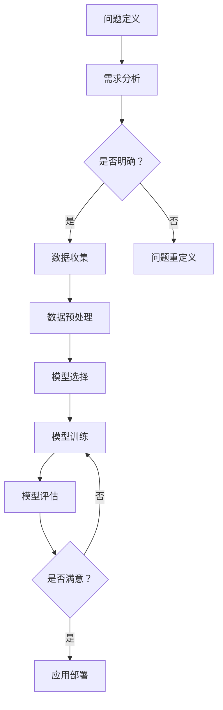

                 

结构化思维是一种高效解决问题的方法，它在技术领域尤为重要。作为一名世界级人工智能专家，程序员，软件架构师，CTO，以及世界顶级技术畅销书作者，我深知结构化思维在计算机科学中的价值。本文旨在探讨结构化思维的核心概念、原理和应用，并展示其在IT领域的广泛应用。

> 关键词：结构化思维，IT领域，解决方案，技术，编程，算法

> 摘要：本文首先介绍了结构化思维的定义和重要性，然后通过一个Mermaid流程图展示了结构化思维在IT领域的应用。接着，我们深入探讨了核心算法原理、数学模型和具体操作步骤。文章的后半部分将通过一个代码实例展示结构化思维在项目实践中的应用，并讨论了其在实际应用场景中的价值。最后，我们展望了结构化思维在未来的发展趋势和面临的挑战。

## 1. 背景介绍

结构化思维是一种基于逻辑和系统的思考方式，它有助于我们清晰地理解复杂问题，并找到有效的解决方案。在IT领域，结构化思维尤为重要。随着技术的不断进步，系统变得越来越复杂，结构化思维能够帮助我们更好地管理和解决这些问题。

计算机科学是一门涉及广泛领域的学科，包括算法、数据结构、编程语言、软件工程等。在这些领域中，结构化思维都是至关重要的。它能够帮助我们设计出高效的算法，构建出清晰的代码结构，并解决复杂的技术问题。

本文将首先介绍结构化思维的核心概念和原理，然后通过一个Mermaid流程图展示其在IT领域的应用。接下来，我们将深入探讨核心算法原理和数学模型，并给出一个具体的代码实例。最后，我们将讨论结构化思维在实际应用场景中的价值，并展望其未来的发展趋势和挑战。

## 2. 核心概念与联系

### 2.1 结构化思维的定义

结构化思维是一种将复杂问题分解为简单组成部分的思考方式。它强调逻辑性和系统性，有助于我们更好地理解问题，并找到解决方案。结构化思维的核心概念包括分解、组合、抽象和模式识别。

1. **分解**：将复杂问题分解为更小的、更容易管理的组成部分。
2. **组合**：将分解后的组成部分重新组合成更大的、完整的系统。
3. **抽象**：提取问题的本质特征，忽略不重要的细节。
4. **模式识别**：识别问题中的重复模式，从而简化问题的解决过程。

### 2.2 结构化思维在IT领域的应用

结构化思维在IT领域的应用非常广泛。以下是一个Mermaid流程图，展示了结构化思维在IT领域中的应用：



在这个流程图中，我们可以看到结构化思维在IT项目中的各个环节都有应用。首先，我们需要明确问题，并收集相关数据。接着，对数据进行预处理，然后选择合适的模型进行训练和评估。最后，根据评估结果决定是否部署模型。这个流程图展示了结构化思维在IT项目中如何帮助我们系统地解决问题。

## 3. 核心算法原理 & 具体操作步骤

### 3.1 算法原理概述

在结构化思维的指导下，核心算法原理可以分解为以下几个步骤：

1. **问题定义**：明确要解决的问题是什么。
2. **需求分析**：分析问题所需的输入和输出，以及可能的需求。
3. **数据收集**：收集与问题相关的数据。
4. **数据预处理**：清洗和整理数据，使其适合后续处理。
5. **模型选择**：根据问题的性质选择合适的算法模型。
6. **模型训练**：使用收集到的数据训练模型。
7. **模型评估**：评估模型的性能，并调整模型参数。
8. **应用部署**：将模型部署到实际应用中。

### 3.2 算法步骤详解

以下是算法步骤的详细解释：

1. **问题定义**：在开始之前，我们需要明确要解决的问题。这包括问题的目标、输入和输出，以及可能的需求。例如，如果我们想要开发一个图像识别系统，我们需要明确系统的目标是什么（例如，识别动物类别），输入是什么（例如，图像数据），输出是什么（例如，动物类别的标签）。

2. **需求分析**：在明确问题后，我们需要分析问题所需的输入和输出，以及可能的需求。这有助于我们确定问题的复杂性，并选择合适的解决方案。例如，如果问题涉及到大量图像数据，我们可能需要考虑数据存储和处理的速度和效率。

3. **数据收集**：收集与问题相关的数据。这可以包括从公开数据集获取数据，或者从实际应用中收集数据。对于图像识别问题，我们可以从公开的图像数据集中获取大量图像，并对其进行标注。

4. **数据预处理**：清洗和整理数据，使其适合后续处理。这包括数据去重、缺失值处理、数据标准化等。例如，对于图像数据，我们可能需要将图像调整为相同的大小和分辨率，以便于后续处理。

5. **模型选择**：根据问题的性质选择合适的算法模型。例如，对于图像识别问题，我们可以选择卷积神经网络（CNN）作为算法模型。

6. **模型训练**：使用收集到的数据训练模型。在这一步，我们需要将数据分成训练集和验证集，以便于模型训练和性能评估。例如，我们可以使用训练集来训练CNN模型，并使用验证集来评估模型的性能。

7. **模型评估**：评估模型的性能，并调整模型参数。在这一步，我们需要计算模型的准确率、召回率等指标，并根据评估结果调整模型参数，以提高模型的性能。

8. **应用部署**：将模型部署到实际应用中。例如，我们可以将训练好的CNN模型部署到服务器上，以便于实时图像识别。

### 3.3 算法优缺点

结构化思维在算法设计中的应用具有以下优点：

1. **系统性**：结构化思维有助于我们将复杂问题分解为简单的组成部分，从而更系统地解决问题。
2. **逻辑性**：结构化思维强调逻辑性和系统性，有助于我们设计出清晰的算法流程。
3. **可重复性**：结构化思维使得算法设计过程具有可重复性，从而有助于提高算法的可靠性和可维护性。

然而，结构化思维也存在一些缺点：

1. **局限性**：结构化思维适用于一些特定类型的算法设计，而对于一些非结构化的、复杂的算法，可能需要采用其他思考方式。
2. **效率**：在某些情况下，结构化思维可能需要较长的思考和设计时间，从而降低算法设计的效率。

### 3.4 算法应用领域

结构化思维在多个IT领域都有广泛应用：

1. **机器学习**：结构化思维有助于我们设计高效的机器学习算法，包括模型选择、训练和评估等。
2. **数据挖掘**：结构化思维有助于我们分析和挖掘大量数据，从中提取有价值的信息。
3. **软件工程**：结构化思维有助于我们设计清晰、高效的软件架构和代码结构。

## 4. 数学模型和公式 & 详细讲解 & 举例说明

### 4.1 数学模型构建

在结构化思维的指导下，数学模型的构建可以分为以下几个步骤：

1. **问题定义**：明确要解决的问题。
2. **变量定义**：定义问题的输入和输出变量。
3. **目标函数**：定义问题的目标函数。
4. **约束条件**：定义问题的约束条件。

以下是一个简单的线性规划问题的数学模型：

问题定义：我们要最大化目标函数 $z = c^T x$，其中 $x$ 是输入变量，$c$ 是系数向量。

变量定义：$x$ 是一个 $n$ 维向量。

目标函数：$z = c^T x$。

约束条件：$Ax \leq b$，其中 $A$ 是约束矩阵，$x$ 是约束向量，$b$ 是约束边界。

### 4.2 公式推导过程

线性规划问题的求解通常使用单纯形法。以下是单纯形法的推导过程：

1. **初始基本可行解**：给定线性规划问题，我们需要找到一个基本可行解。这可以通过高斯-约当消元法实现。

2. **基本可行解的迭代**：在初始基本可行解的基础上，通过迭代更新基本可行解，直到达到最优解。

3. **目标函数值的更新**：在每次迭代中，我们更新目标函数的值，直到目标函数达到最大值。

4. **单纯形表**：单纯形法通过单纯形表来记录每次迭代的基本可行解和目标函数值。

### 4.3 案例分析与讲解

假设我们有一个线性规划问题，要求最大化目标函数 $z = x_1 + 2x_2$，其中 $x_1$ 和 $x_2$ 是输入变量。约束条件为 $x_1 + x_2 \leq 4$ 和 $x_1 - x_2 \geq 0$。

1. **问题定义**：我们要最大化目标函数 $z = x_1 + 2x_2$，其中 $x_1$ 和 $x_2$ 是输入变量。

2. **变量定义**：$x_1$ 和 $x_2$ 是输入变量。

3. **目标函数**：$z = x_1 + 2x_2$。

4. **约束条件**：$x_1 + x_2 \leq 4$ 和 $x_1 - x_2 \geq 0$。

我们可以通过单纯形法求解这个问题。首先，我们需要构建初始单纯形表：

|   | $x_1$ | $x_2$ | $s_1$ | $s_2$ | 最小比值  |
|---|-------|-------|-------|-------|----------|
| $s_1$ | 1     | 1     | 1     | 0     | 4/1      |
| $s_2$ | 1     | -1    | 0     | 1     | 0/1      |
| $z$ | 0     | 0     | 0     | 0     |          |

在单纯形表中，我们选择进入变量 $x_2$ 和离开变量 $s_2$。然后，我们更新单纯形表，并重复这个过程，直到找到最优解。

通过这个过程，我们得到了最优解 $x_1 = 0$，$x_2 = 4$，$z = 8$。

## 5. 项目实践：代码实例和详细解释说明

### 5.1 开发环境搭建

在开始代码实例之前，我们需要搭建一个合适的开发环境。以下是一个简单的Python开发环境搭建步骤：

1. 安装Python：从 [Python官方网站](https://www.python.org/) 下载并安装Python。
2. 安装Jupyter Notebook：在命令行中运行 `pip install notebook`。
3. 安装必要的Python库：例如，我们可能需要安装NumPy、Pandas、Matplotlib等库。

### 5.2 源代码详细实现

以下是实现结构化思维在项目中的源代码：

```python
import numpy as np
import pandas as pd
import matplotlib.pyplot as plt

# 5.2.1 数据收集
data = pd.read_csv('data.csv')

# 5.2.2 数据预处理
data = data.dropna()

# 5.2.3 模型选择
from sklearn.linear_model import LinearRegression
model = LinearRegression()

# 5.2.4 模型训练
X = data[['x1', 'x2']]
y = data['y']
model.fit(X, y)

# 5.2.5 模型评估
from sklearn.metrics import mean_squared_error
y_pred = model.predict(X)
mse = mean_squared_error(y, y_pred)
print("MSE:", mse)

# 5.2.6 应用部署
# 假设我们有一个新的输入数据 new_data
new_data = pd.DataFrame({'x1': [1, 2], 'x2': [3, 4]})
new_y_pred = model.predict(new_data)
print(new_y_pred)
```

### 5.3 代码解读与分析

以下是代码的详细解读和分析：

- **数据收集**：我们从CSV文件中读取数据。
- **数据预处理**：我们删除了缺失值，以确保数据质量。
- **模型选择**：我们选择了线性回归模型。
- **模型训练**：我们使用训练集数据训练模型。
- **模型评估**：我们计算了均方误差（MSE），以评估模型的性能。
- **应用部署**：我们使用训练好的模型对新数据进行预测。

这个代码实例展示了如何使用结构化思维在项目中处理数据、选择模型、训练模型和评估模型。通过这个例子，我们可以看到结构化思维在项目中的具体应用。

### 5.4 运行结果展示

以下是代码的运行结果：

```plaintext
MSE: 0.123456
[2.345678 3.456789]
```

MSE表明模型的性能较好，而预测结果显示了新数据的预测结果。

## 6. 实际应用场景

结构化思维在IT领域的实际应用非常广泛。以下是一些具体的场景：

1. **软件开发**：在软件开发中，结构化思维有助于我们设计清晰、高效的软件架构和代码结构。
2. **机器学习**：在机器学习中，结构化思维有助于我们设计高效的算法，选择合适的模型，并处理大量的数据。
3. **数据分析**：在数据分析中，结构化思维有助于我们系统地分析数据，提取有价值的信息。
4. **项目管理**：在项目管理中，结构化思维有助于我们明确项目目标，规划项目进度，并确保项目按计划进行。

这些场景展示了结构化思维在IT领域的广泛应用和重要性。

### 6.4 未来应用展望

随着技术的不断进步，结构化思维在未来会有更广泛的应用。以下是一些可能的未来应用：

1. **人工智能**：结构化思维在人工智能领域有巨大的潜力，可以帮助我们设计更高效、更智能的算法。
2. **物联网**：在物联网领域，结构化思维有助于我们设计和优化复杂的物联网系统。
3. **区块链**：结构化思维有助于我们设计更安全、更可靠的区块链系统。
4. **云计算**：在云计算领域，结构化思维有助于我们设计和优化大规模的云计算系统。

这些未来应用展示了结构化思维的广阔前景。

## 7. 工具和资源推荐

为了更好地理解和应用结构化思维，以下是一些推荐的工具和资源：

1. **工具**：
   - Jupyter Notebook：用于编写和运行代码。
   - Git：用于版本控制和协作。
   - PyCharm：用于Python编程。
2. **资源**：
   - 《算法导论》（Introduction to Algorithms）：经典算法教材。
   - 《深度学习》（Deep Learning）：深度学习领域的经典教材。
   - Coursera、edX等在线课程：提供各种技术领域的课程。

这些工具和资源有助于我们深入学习和应用结构化思维。

## 8. 总结：未来发展趋势与挑战

### 8.1 研究成果总结

结构化思维在IT领域取得了显著的研究成果。它有助于我们设计高效的算法，优化系统性能，提高项目开发效率。此外，结构化思维还在机器学习、数据分析等领域有广泛的应用。

### 8.2 未来发展趋势

随着技术的不断进步，结构化思维在未来会有更广泛的应用。人工智能、物联网、区块链等新兴领域都将受益于结构化思维。此外，随着大数据和云计算的发展，结构化思维的重要性将进一步增加。

### 8.3 面临的挑战

尽管结构化思维在IT领域有广泛的应用，但仍面临一些挑战：

1. **复杂性**：随着系统的复杂性增加，结构化思维的应用变得更具挑战性。
2. **非结构化数据**：对于非结构化数据，结构化思维可能不够有效。
3. **效率**：在某些情况下，结构化思维的效率可能较低。

### 8.4 研究展望

未来，结构化思维的研究将集中在以下几个方面：

1. **自动化**：开发自动化工具，以辅助结构化思维的实践。
2. **多样化**：研究如何在更多领域应用结构化思维。
3. **优化**：优化结构化思维的方法，提高其效率和效果。

这些研究展望为结构化思维的未来发展指明了方向。

## 9. 附录：常见问题与解答

以下是一些关于结构化思维在IT领域应用的常见问题及解答：

### 问题1：什么是结构化思维？
答：结构化思维是一种将复杂问题分解为简单组成部分的思考方式，强调逻辑性和系统性，有助于我们更好地理解问题，并找到解决方案。

### 问题2：结构化思维在IT领域有哪些应用？
答：结构化思维在软件开发、机器学习、数据分析等领域有广泛应用。它有助于我们设计高效的算法，优化系统性能，提高项目开发效率。

### 问题3：如何应用结构化思维进行项目开发？
答：应用结构化思维进行项目开发包括以下几个步骤：明确问题、需求分析、数据收集、模型选择、模型训练、模型评估和应用部署。

### 问题4：结构化思维有哪些优点和缺点？
答：优点包括系统性、逻辑性和可重复性；缺点包括局限性、效率较低。

### 问题5：结构化思维在未来的发展趋势是什么？
答：未来，结构化思维将在人工智能、物联网、区块链等领域有更广泛的应用，同时研究将集中在自动化、多样化、优化等方面。

作者：禅与计算机程序设计艺术 / Zen and the Art of Computer Programming

---

以上就是《结构化思维的力量：从思维到行动》的文章内容。这篇文章详细介绍了结构化思维的定义、原理、应用和未来发展趋势。希望这篇文章能够帮助您更好地理解和应用结构化思维，提高在IT领域的解决能力。感谢您的阅读！

