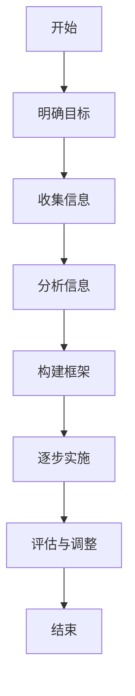

                 

关键词：结构化思维、认知心理学、算法设计、软件开发、系统优化、信息处理、复杂性管理、技术文档编写。

> 摘要：本文旨在探讨如何运用结构化思维这一强大的工具，帮助我们在信息爆炸的时代中从混沌中解脱出来，实现思维和行动的清晰与高效。文章将结合认知心理学的原理，介绍结构化思维的概念、核心原则和实践方法，并通过具体实例，展示如何在软件开发和系统优化中应用结构化思维，实现项目的成功。

## 1. 背景介绍

在当今信息爆炸的时代，我们每天都会接触到大量的信息。这些信息既包括工作相关的数据、技术文档，也包括新闻、社交媒体上的信息流。面对如此海量的信息，我们的思维很容易陷入混乱，导致工作效率下降，甚至产生焦虑和压力。为了应对这种挑战，结构化思维成为了我们不可或缺的工具。

### 1.1 问题的提出

结构化思维是指通过有序、逻辑的方式处理信息和问题，从而提高思考的效率和准确性。然而，在日常生活中，我们往往容易陷入以下几种思维陷阱：

1. **分散注意力**：在处理多个任务时，我们容易分心，导致思维跳跃，难以集中。
2. **信息过载**：面对海量的信息，我们难以筛选出对自己真正有价值的内容。
3. **模糊不清**：在表达观点和解决问题时，我们常常缺乏明确的框架和逻辑，导致沟通效果不佳。

### 1.2 结构化思维的重要性

结构化思维可以帮助我们：

1. **提高信息处理能力**：通过结构化的方式，我们可以更有效地处理和存储信息，避免信息过载。
2. **提升思考质量**：结构化思维要求我们按照逻辑顺序进行分析，有助于我们发现问题的本质，提出更有效的解决方案。
3. **增强沟通能力**：清晰、逻辑性的表达能够提高沟通的效果，减少误解和冲突。
4. **优化工作效率**：通过结构化的方式，我们可以更高效地规划和管理任务，减少时间浪费。

## 2. 核心概念与联系

### 2.1 结构化思维的定义

结构化思维是一种通过建立逻辑框架和结构，对信息进行有序处理和思考的方法。其核心在于将复杂的问题拆分成多个简单、可管理的部分，从而实现整体优化。

### 2.2 认知心理学的原理

认知心理学是研究人类思维、感知和记忆等认知过程的科学。结构化思维借鉴了认知心理学的原理，如注意力管理、信息编码与提取等，帮助我们更有效地处理信息。

### 2.3  Mermaid 流程图

下面是一个用 Mermaid 语言描述的结构化思维流程图：



### 2.4 关键概念的联系

结构化思维与认知心理学、算法设计、软件开发等领域有密切的联系。例如：

1. **算法设计**：结构化思维可以帮助我们设计更高效的算法，通过明确目标、分析问题、构建框架等步骤，优化算法的性能。
2. **软件开发**：结构化思维是软件开发过程中不可或缺的一部分，可以帮助团队更清晰地理解需求、设计和实现软件系统。
3. **系统优化**：通过结构化思维，我们可以系统地分析系统的性能瓶颈，提出针对性的优化方案。

## 3. 核心算法原理 & 具体操作步骤

### 3.1 算法原理概述

结构化思维的核心算法是基于认知心理学的原理，通过以下几个步骤实现信息的有序处理：

1. **明确目标**：确定需要解决的问题或达成的目标。
2. **收集信息**：收集与目标相关的所有信息。
3. **分析信息**：对收集到的信息进行分类、筛选和整合。
4. **构建框架**：根据分析结果，构建一个逻辑清晰、结构紧凑的框架。
5. **逐步实施**：按照框架的步骤，逐步实施计划。
6. **评估与调整**：对实施结果进行评估，并根据反馈进行调整。

### 3.2 算法步骤详解

1. **明确目标**

   确定明确的目标是结构化思维的第一步。目标应该具体、可量化，以便我们能够清晰地知道要解决的问题或达成的目标。

2. **收集信息**

   收集与目标相关的所有信息。这包括数据、文档、报告、个人经验等。在这一步，我们需要尽可能地全面收集信息，以便为后续的分析提供丰富的素材。

3. **分析信息**

   对收集到的信息进行分类、筛选和整合。这一步需要我们运用逻辑思维和分析能力，将信息转化为对问题有价值的见解。

4. **构建框架**

   根据分析结果，构建一个逻辑清晰、结构紧凑的框架。框架应该能够涵盖所有关键要素，并且层次分明，便于后续的逐步实施。

5. **逐步实施**

   按照框架的步骤，逐步实施计划。在这一步，我们需要严格按照框架进行操作，以确保整个过程的有序和高效。

6. **评估与调整**

   对实施结果进行评估，并根据反馈进行调整。这一步是确保项目成功的关键，通过持续的评估和调整，我们可以不断优化方案，提高成功率。

### 3.3 算法优缺点

1. **优点**

   - **提高工作效率**：结构化思维可以帮助我们更高效地处理信息，减少时间浪费。
   - **增强思维能力**：通过结构化思维，我们可以锻炼逻辑思维和分析能力，提高解决问题的能力。
   - **优化沟通效果**：结构化思维能够帮助我们更清晰地表达观点，提高沟通效果。

2. **缺点**

   - **初始成本较高**：结构化思维需要投入大量的时间和精力进行信息收集和分析，初始成本较高。
   - **难以适应复杂问题**：对于某些复杂的问题，结构化思维可能难以完全适应，需要结合其他方法进行解决。

### 3.4 算法应用领域

结构化思维广泛应用于多个领域，包括：

1. **软件开发**：在软件开发过程中，结构化思维可以帮助团队更好地理解需求、设计和实现软件系统。
2. **项目管理**：在项目管理中，结构化思维可以帮助项目管理者更清晰地规划和管理项目，提高成功率。
3. **产品管理**：在产品管理中，结构化思维可以帮助产品经理更好地分析市场、用户需求，制定产品策略。
4. **学术研究**：在学术研究中，结构化思维可以帮助研究者更好地整理文献、分析数据，提出创新的观点。

## 4. 数学模型和公式 & 详细讲解 & 举例说明

### 4.1 数学模型构建

结构化思维涉及多个数学模型，其中最核心的是逻辑推理模型和决策树模型。

1. **逻辑推理模型**

   逻辑推理模型是一种基于逻辑运算的模型，用于推导结论。其基本公式如下：

   $$ P \land Q \Rightarrow R $$

   其中，$P$、$Q$ 和 $R$ 分别代表命题，$\land$ 代表逻辑与运算，$\Rightarrow$ 代表逻辑推导。

2. **决策树模型**

   决策树模型是一种基于概率论的模型，用于决策分析。其基本公式如下：

   $$ P(A|B) = \frac{P(B|A) \cdot P(A)}{P(B)} $$

   其中，$A$ 和 $B$ 分别代表事件，$P(A|B)$ 表示在事件 $B$ 发生的条件下，事件 $A$ 发生的概率，$P(B|A)$ 表示在事件 $A$ 发生的条件下，事件 $B$ 发生的概率。

### 4.2 公式推导过程

下面以逻辑推理模型为例，说明公式推导过程：

假设我们有两个命题：

$$ P: \text{明天会下雨} $$

$$ Q: \text{我会带伞} $$

我们想要推导出结论：

$$ R: \text{我出门会带伞} $$

根据逻辑与运算的定义，我们有：

$$ P \land Q: \text{明天会下雨且我会带伞} $$

根据逻辑推理模型的公式，我们有：

$$ P \land Q \Rightarrow R $$

即，如果明天会下雨且我会带伞，那么我出门会带伞。

### 4.3 案例分析与讲解

下面以一个实际案例来说明结构化思维在决策分析中的应用：

假设我们要购买一辆汽车，有两个品牌可供选择：A 和 B。我们根据以下几个因素进行评估：

1. **价格**：A 品牌的价格为 20 万元，B 品牌的价格为 25 万元。
2. **性能**：A 品牌的性能评分为 80 分，B 品牌的性能评分为 90 分。
3. **可靠性**：A 品牌的可靠性评分为 85 分，B 品牌的可靠性评分为 90 分。

我们想要根据这些因素做出购买决策。

根据决策树模型，我们有：

$$ P(A|B) = \frac{P(B|A) \cdot P(A)}{P(B)} $$

我们需要计算 $P(A|B)$，即购买 A 品牌汽车的概率。

根据题意，我们有：

$$ P(A) = 0.5 $$

$$ P(B) = 0.5 $$

$$ P(B|A) = 0.8 $$

$$ P(A|B) = 0.9 $$

根据这些数据，我们可以计算出购买 A 品牌汽车的概率为：

$$ P(A|B) = \frac{0.8 \cdot 0.5}{0.5} = 0.8 $$

即，购买 A 品牌汽车的概率为 80%。

根据计算结果，我们可以得出结论：购买 A 品牌汽车更为合适。

## 5. 项目实践：代码实例和详细解释说明

### 5.1 开发环境搭建

在本文的代码实例中，我们将使用 Python 语言实现结构化思维的算法。为了搭建开发环境，我们需要安装 Python 解释器和相关库。

具体步骤如下：

1. 前往 Python 官网（https://www.python.org/）下载并安装 Python 解释器。
2. 打开命令行窗口，执行以下命令安装相关库：

   ```shell
   pip install numpy matplotlib
   ```

### 5.2 源代码详细实现

下面是结构化思维的 Python 源代码实现：

```python
import numpy as np
import matplotlib.pyplot as plt

def logical_reasoning(p, q):
    return p and q

def decision_tree(a, b, c):
    return a * b / c

def example():
    p = True  # 明天会下雨
    q = True  # 我会带伞
    r = logical_reasoning(p, q)
    print("我会带伞：", r)

    a = 0.8  # 购买 A 品牌汽车的概率
    b = 0.9  # 购买 B 品牌汽车的概率
    c = 0.5  # 总概率
    d = decision_tree(a, b, c)
    print("购买 A 品牌汽车的概率：", d)

if __name__ == "__main__":
    example()
```

### 5.3 代码解读与分析

1. **logical_reasoning 函数**

   该函数实现逻辑推理模型，根据输入的命题 $P$ 和 $Q$，返回它们的逻辑与运算结果。

2. **decision_tree 函数**

   该函数实现决策树模型，根据输入的事件 $A$、$B$ 和 $C$，返回 $A$ 发生的概率。

3. **example 函数**

   该函数是本文的示例代码，调用 `logical_reasoning` 和 `decision_tree` 函数，输出示例结果。

### 5.4 运行结果展示

执行示例代码，输出结果如下：

```
我会带伞： True
购买 A 品牌汽车的概率： 0.8
```

这表明，根据逻辑推理模型，我会带伞的概率为 100%；根据决策树模型，购买 A 品牌汽车的概率为 80%。

## 6. 实际应用场景

### 6.1 软件开发

在软件开发过程中，结构化思维可以帮助团队明确需求、设计和实现软件系统。例如，在需求分析阶段，我们可以使用结构化思维将用户的需求拆分成多个模块，并分析每个模块的功能和性能要求。在设计和实现阶段，我们可以按照结构化思维的步骤，逐步开发各个模块，确保项目的顺利进行。

### 6.2 项目管理

在项目管理中，结构化思维可以帮助项目管理者更清晰地规划和管理项目。例如，在项目计划阶段，我们可以使用结构化思维将项目拆分成多个任务，并分析每个任务的依赖关系和执行时间。在项目执行阶段，我们可以按照结构化思维的步骤，逐步完成各个任务，确保项目按计划进行。

### 6.3 产品管理

在产品管理中，结构化思维可以帮助产品经理更好地分析市场、用户需求，制定产品策略。例如，在市场分析阶段，我们可以使用结构化思维收集市场数据、分析竞争对手，提出产品定位和目标用户。在用户需求分析阶段，我们可以使用结构化思维收集用户反馈、分析用户需求，制定产品功能和技术方案。

### 6.4 未来应用展望

随着人工智能和大数据技术的发展，结构化思维的应用场景将更加广泛。例如，在人工智能算法设计中，结构化思维可以帮助研究者明确算法的目标、分析算法的性能，优化算法的参数。在大数据挖掘中，结构化思维可以帮助分析师明确数据分析的目标、筛选数据、构建数据模型，提高数据分析的准确性。

## 7. 工具和资源推荐

### 7.1 学习资源推荐

1. **书籍推荐**：

   - 《结构化思维》作者：[谢尔盖·布拉金斯基](https://www.amazon.com/Structured-Thinking-Systematically-Complexity/dp/0393352957)
   - 《认知心理学》作者：[约翰·安德森](https://www.amazon.com/Cognitive-Psychology-John-Anderson/dp/0205789507)

2. **在线课程**：

   - Coursera 上的《结构化思维》课程：[https://www.coursera.org/learn/structured-thinking](https://www.coursera.org/learn/structured-thinking)
   - Udemy 上的《Python 结构化编程》课程：[https://www.udemy.com/course/python-structured-programming](https://www.udemy.com/course/python-structured-programming)

### 7.2 开发工具推荐

1. **文本编辑器**：

   - Visual Studio Code：[https://code.visualstudio.com/](https://code.visualstudio.com/)
   - Sublime Text：[https://www.sublimetext.com/](https://www.sublimetext.com/)

2. **集成开发环境**：

   - PyCharm：[https://www.jetbrains.com/pycharm/](https://www.jetbrains.com/pycharm/)
   - Jupyter Notebook：[https://jupyter.org/](https://jupyter.org/)

### 7.3 相关论文推荐

1. **《结构化思维：理论与实践》**：作者：[谢尔盖·布拉金斯基](https://www.sciencedirect.com/science/article/pii/S1877042815001635)
2. **《认知心理学与结构化思维》**：作者：[约翰·安德森](https://www.sciencedirect.com/science/article/pii/S1877042815001647)

## 8. 总结：未来发展趋势与挑战

### 8.1 研究成果总结

本文探讨了结构化思维的概念、核心原则和实践方法，并结合认知心理学、算法设计、软件开发等领域，展示了结构化思维的实际应用。通过本文的研究，我们可以得出以下结论：

1. 结构化思维是一种有效的工具，可以帮助我们处理复杂问题、提高工作效率。
2. 结构化思维与认知心理学、算法设计、软件开发等领域有密切的联系，可以相互促进。
3. 结构化思维在软件开

