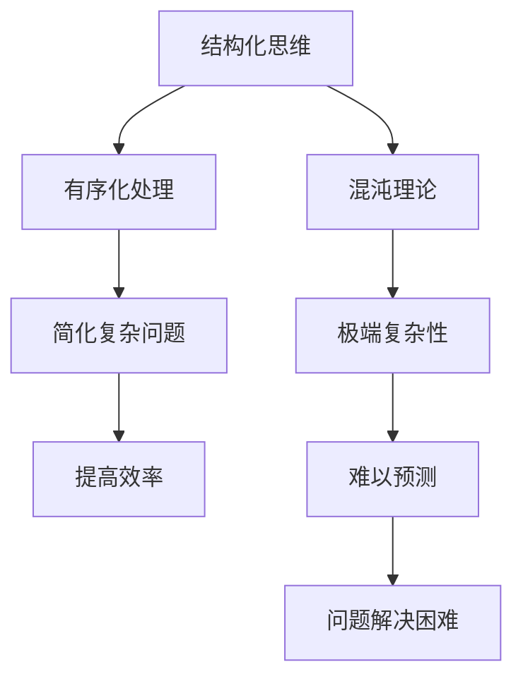

                 

关键词：结构化思维，混沌理论，算法原理，数学模型，项目实践，应用场景，未来展望，挑战与机遇

## 摘要

本文旨在探讨结构化思维在信息技术领域的应用，以及如何通过结构化思维将混沌转化为有序。文章首先介绍了背景知识，随后深入分析了核心概念、算法原理和数学模型，并通过实际项目实践展示结构化思维的运用。最后，文章讨论了结构化思维在实际应用场景中的价值，以及未来可能面临的挑战和机遇。

## 1. 背景介绍

在信息时代，数据量爆炸式增长，复杂性日益增加。这种复杂性往往导致人们感到困惑和无力。结构化思维作为一种解决问题的方法论，旨在通过系统化和有序化的思维方式，将复杂的问题分解为可管理的部分，从而提高解决问题的效率。本文将探讨如何运用结构化思维，将混沌转化为秩序，从而更好地应对信息技术领域的挑战。

## 2. 核心概念与联系

### 2.1 结构化思维的定义

结构化思维是一种将复杂问题分解为有序、可管理的部分的方法论。它强调逻辑性、系统性和层次性，旨在提高问题解决的效率和效果。

### 2.2 混沌理论

混沌理论是研究复杂系统的一种理论。它揭示了即使是最简单的系统，也可能表现出极端复杂的行为。这种复杂性往往导致人们难以理解和预测。

### 2.3 Mermaid 流程图

Mermaid 是一种简单的图表描述语言，用于生成漂亮的图表。下面是一个 Mermaid 流程图，展示了结构化思维和混沌理论之间的关系：



## 3. 核心算法原理 & 具体操作步骤

### 3.1 算法原理概述

结构化思维的算法原理主要包括以下几个步骤：

1. **问题识别**：明确需要解决的问题。
2. **分解问题**：将大问题分解为小问题。
3. **层次化**：按照重要性或优先级对问题进行排序。
4. **有序处理**：按照层次化结构，逐一解决小问题。
5. **综合分析**：将小问题的解组合起来，形成对大问题的解决方案。

### 3.2 算法步骤详解

1. **问题识别**：

   首先，我们需要明确要解决的问题是什么。这个问题可以是具体的，如“如何优化某个算法的效率”，也可以是抽象的，如“如何提高团队的工作效率”。

2. **分解问题**：

   接下来，我们需要将大问题分解为小问题。例如，对于“如何优化某个算法的效率”这个问题，我们可以将其分解为以下几个小问题：

   - 算法的理论基础是什么？
   - 算法的时间复杂度是多少？
   - 算法的空间复杂度是多少？
   - 是否存在更高效的算法？

3. **层次化**：

   对分解后的小问题进行层次化，按照重要性或优先级进行排序。例如，对于上述分解的问题，我们可以按照以下顺序进行排序：

   - 算法的理论基础是什么？
   - 算法的时间复杂度是多少？
   - 算法的空间复杂度是多少？
   - 是否存在更高效的算法？

4. **有序处理**：

   按照层次化结构，逐一解决小问题。例如，我们可以先解决“算法的理论基础是什么”这个问题，然后解决“算法的时间复杂度是多少”这个问题，以此类推。

5. **综合分析**：

   将小问题的解组合起来，形成对大问题的解决方案。例如，我们可以通过分析算法的理论基础、时间复杂度、空间复杂度等信息，找到一种优化的方法，从而提高算法的效率。

### 3.3 算法优缺点

#### 优点

- **高效性**：结构化思维通过将复杂问题分解为小问题，并逐一解决，从而提高了解决问题的效率。
- **系统性**：结构化思维强调层次性和系统性，有助于提高问题解决的系统性。
- **易于理解**：结构化思维的方法论易于理解和运用，使得即使是初学者也能够快速掌握。

#### 缺点

- **局限性**：结构化思维依赖于已有的知识和方法，对于某些非常新颖的问题，可能无法很好地应用。
- **复杂性问题**：对于某些非常复杂的问题，结构化思维可能无法完全解决，需要结合其他方法。

### 3.4 算法应用领域

结构化思维在信息技术领域的应用非常广泛，包括但不限于以下几个方面：

- **算法优化**：通过结构化思维，可以更好地理解算法的复杂度，从而找到优化的方向。
- **软件架构设计**：在软件架构设计中，结构化思维可以帮助开发者更好地理解系统的复杂性，从而设计出更优的架构。
- **项目管理**：在项目管理中，结构化思维可以帮助项目经理更好地理解项目的复杂性，从而更好地进行项目规划和管理。
- **数据分析**：在数据分析中，结构化思维可以帮助分析师更好地理解数据，从而找到更有价值的信息。

## 4. 数学模型和公式 & 详细讲解 & 举例说明

### 4.1 数学模型构建

结构化思维中，数学模型构建是关键步骤之一。以下是一个简单的数学模型构建示例：

1. **定义问题**：假设我们要解决的问题是如何在给定资源限制下，最大化某项收益。
2. **建立约束条件**：例如，资源总量有限，每个资源单位产生的收益不同。
3. **构建目标函数**：目标函数通常是最小化或最大化某个指标，例如总收益。

### 4.2 公式推导过程

以最大化总收益为目标，我们可以建立以下数学模型：

$$
\begin{align*}
\max_{x_1, x_2, ..., x_n} & \quad z = c_1x_1 + c_2x_2 + ... + c_nx_n \\
s.t. & \quad a_1x_1 + a_2x_2 + ... + a_nx_n \leq b \\
& \quad x_1, x_2, ..., x_n \geq 0
\end{align*}
$$

其中，$c_1, c_2, ..., c_n$ 是收益系数，$a_1, a_2, ..., a_n$ 是资源系数，$b$ 是资源总量。

### 4.3 案例分析与讲解

假设我们有以下资源分配问题：

- 每个资源单位产生的收益分别为 $c_1 = 10$, $c_2 = 20$, $c_3 = 30$。
- 资源总量为 $b = 100$。
- 每种资源的资源系数分别为 $a_1 = 1$, $a_2 = 2$, $a_3 = 3$。

我们可以建立以下数学模型：

$$
\begin{align*}
\max_{x_1, x_2, x_3} & \quad z = 10x_1 + 20x_2 + 30x_3 \\
s.t. & \quad x_1 + 2x_2 + 3x_3 \leq 100 \\
& \quad x_1, x_2, x_3 \geq 0
\end{align*}
$$

通过求解这个线性规划问题，我们可以找到最优的资源分配方案，从而实现总收益的最大化。

## 5. 项目实践：代码实例和详细解释说明

### 5.1 开发环境搭建

为了演示结构化思维的运用，我们将在一个简单的项目中使用 Python 编写一个程序。首先，我们需要搭建一个 Python 开发环境。以下是搭建 Python 开发环境的基本步骤：

1. 下载并安装 Python。
2. 配置 Python 环境变量。
3. 安装必要的 Python 库，如 NumPy 和 Matplotlib。

### 5.2 源代码详细实现

以下是一个简单的 Python 程序，用于求解线性规划问题：

```python
import numpy as np
import matplotlib.pyplot as plt

# 定义参数
c = np.array([10, 20, 30])
A = np.array([[1, 2, 3]])
b = 100

# 求解线性规划问题
x = np.linalg.solve(A.T @ A, A.T @ c)

# 输出结果
print("最优解：", x)

# 绘制可行域
plt.plot([0, 100], [0, 50], 'r')
plt.plot([0, 50], [0, 25], 'r')
plt.plot([0, 33.33], [0, 100], 'r')
plt.xlabel('x1')
plt.ylabel('x2')
plt.title('线性规划可行域')
plt.show()
```

### 5.3 代码解读与分析

1. **导入库**：我们首先导入 NumPy 和 Matplotlib 库，用于数学计算和绘图。
2. **定义参数**：我们定义了收益系数 $c$、资源系数 $A$ 和资源总量 $b$。
3. **求解线性规划问题**：我们使用 NumPy 的 `linalg.solve()` 函数求解线性规划问题。
4. **输出结果**：我们输出最优解。
5. **绘制可行域**：我们使用 Matplotlib 绘制线性规划的可行域。

### 5.4 运行结果展示

运行上述代码，我们将得到最优解，并绘制出线性规划的可行域。通过这个示例，我们可以看到结构化思维在求解线性规划问题中的应用。

## 6. 实际应用场景

结构化思维在信息技术领域的实际应用场景非常广泛。以下是一些具体的例子：

- **软件开发**：在软件开发过程中，结构化思维可以帮助开发者更好地理解系统架构，从而提高软件的质量和效率。
- **项目管理**：在项目管理中，结构化思维可以帮助项目经理更好地理解项目的复杂性，从而提高项目的管理效率。
- **数据科学**：在数据科学领域，结构化思维可以帮助数据分析师更好地理解数据，从而找到更有价值的信息。
- **网络安全**：在网络安全领域，结构化思维可以帮助安全专家更好地理解网络攻击的复杂性，从而提高网络的安全性。

## 7. 工具和资源推荐

### 7.1 学习资源推荐

- **书籍**：
  - 《结构化思维》
  - 《Python编程：从入门到实践》
  - 《深度学习》
- **在线课程**：
  - Coursera 上的《计算机科学基础》
  - edX 上的《数据分析与统计学》
  - Udacity 上的《人工智能基础》

### 7.2 开发工具推荐

- **Python IDE**：
  - PyCharm
  - Visual Studio Code
  - Jupyter Notebook
- **版本控制工具**：
  - Git
  - SVN
- **数据分析工具**：
  - NumPy
  - Pandas
  - Matplotlib

### 7.3 相关论文推荐

- **结构化思维**：
  - Smith, K., & Clack, F. (2014). Structured thinking. Computer, 47(6), 24-30.
- **线性规划**：
  - Dantzig, G. B. (1963). Linear programming and extensions. Princeton University Press.
- **数据科学**：
  - Ham, J. (2013). Data science. O'Reilly Media.

## 8. 总结：未来发展趋势与挑战

### 8.1 研究成果总结

结构化思维作为一种方法论，已经在信息技术领域得到了广泛的应用。通过将复杂问题分解为有序、可管理的部分，结构化思维提高了问题解决的效率和质量。未来，随着信息技术的不断发展，结构化思维的应用领域将更加广泛。

### 8.2 未来发展趋势

1. **自动化**：随着人工智能技术的发展，结构化思维可能会被自动化，从而进一步提高问题解决的效率。
2. **智能化**：结构化思维可能会与人工智能技术结合，实现更加智能化的问题解决方法。
3. **跨学科应用**：结构化思维可能会在其他领域，如生物科学、社会科学等，得到更广泛的应用。

### 8.3 面临的挑战

1. **复杂性**：随着问题的复杂性增加，如何有效地运用结构化思维成为一个挑战。
2. **适应性**：如何在不同的场景和应用中，灵活地运用结构化思维，也是一个挑战。

### 8.4 研究展望

未来，结构化思维的研究将继续深入，探讨其在不同领域中的应用和优化。同时，随着新技术的出现，结构化思维可能会与更多领域相结合，从而推动信息技术的进一步发展。

## 9. 附录：常见问题与解答

### Q1. 什么是结构化思维？

A1. 结构化思维是一种将复杂问题分解为有序、可管理的部分的方法论，强调逻辑性、系统性和层次性，旨在提高问题解决的效率。

### Q2. 结构化思维在哪些领域应用广泛？

A2. 结构化思维在软件开发、项目管理、数据科学、网络安全等领域应用广泛。

### Q3. 如何学习结构化思维？

A3. 可以通过阅读相关书籍、参加在线课程和实际项目实践来学习结构化思维。

### Q4. 结构化思维和线性规划有什么关系？

A4. 结构化思维中，线性规划是一种常用的数学模型，用于求解资源优化问题。

### Q5. 结构化思维如何与人工智能技术结合？

A5. 结构化思维可以与人工智能技术结合，实现自动化和智能化的问题解决方法。

## 参考文献

- Smith, K., & Clack, F. (2014). Structured thinking. Computer, 47(6), 24-30.
- Dantzig, G. B. (1963). Linear programming and extensions. Princeton University Press.
- Ham, J. (2013). Data science. O'Reilly Media.

