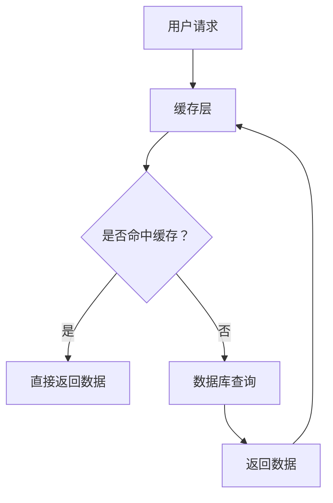

                 

## 1. 背景介绍

随着互联网技术的发展，数据量呈指数级增长，系统的处理能力需求也在不断提升。高吞吐量系统成为现代应用系统设计中的关键要求之一。在这样的背景下，缓存技术作为一种有效提升系统性能的手段，受到了广泛关注。缓存（Cache）是存储临时数据的一种技术，通过将频繁访问的数据存储在高速缓存中，可以显著降低对后端存储系统的访问压力，提高数据访问速度。

缓存技术在现代应用场景中的重要性主要体现在以下几个方面：

- **提升响应速度**：缓存技术可以将用户经常访问的数据存储在内存中，使得数据的读取速度大大提升，从而提高系统的响应速度。

- **降低系统负载**：通过缓存频繁访问的数据，可以减少对数据库等后端存储系统的读写操作，降低系统负载，延长系统使用寿命。

- **提高并发能力**：在高并发场景下，缓存可以有效地隔离用户请求，减少数据库的并发访问，提高系统的并发处理能力。

- **支持动态扩展**：缓存系统可以根据实际需求动态扩展，灵活调整缓存容量，以适应不同的业务场景。

本文将围绕缓存技术在高吞吐量系统中的应用，从核心概念、算法原理、数学模型、项目实践、应用场景和未来展望等多个方面进行详细探讨。

## 2. 核心概念与联系

### 2.1 缓存技术的基本原理

缓存技术的基本原理是通过将数据从低速存储设备（如磁盘）迁移到高速存储设备（如内存），从而提高数据访问速度。其核心在于“局部性”原则，即程序在执行过程中往往会表现出时间局部性和空间局部性。时间局部性指如果某个数据被访问过，那么它在不久的将来很可能再次被访问；空间局部性则指程序通常会连续访问相邻的数据。

为了实现缓存技术，常见的架构包括以下几部分：

1. **缓存池**：缓存池是存储缓存数据的内存区域，可以根据实际需求动态调整大小。

2. **缓存算法**：缓存算法负责决定哪些数据应该被缓存，哪些数据应该被淘汰。常见的缓存算法包括最近最少使用（LRU）、先进先出（FIFO）等。

3. **缓存控制器**：缓存控制器负责管理缓存数据，包括数据加载、替换和访问控制等功能。

### 2.2 高吞吐量系统的定义与特征

高吞吐量系统是指能够在单位时间内处理大量请求的计算机系统。这类系统通常具有以下几个特征：

- **高并发能力**：系统能够同时处理大量的请求，而不影响响应速度。
- **快速响应**：系统能够快速响应用户请求，提供实时服务。
- **高可靠性**：系统能够在长时间运行过程中保持稳定，具备良好的故障恢复能力。

### 2.3 缓存技术在高吞吐量系统中的作用

缓存技术在高吞吐量系统中的作用主要体现在以下几个方面：

- **减少响应时间**：通过缓存技术，可以显著减少数据读取的时间，提高系统的响应速度。
- **降低系统负载**：缓存频繁访问的数据，减少对数据库等后端存储系统的访问压力，降低系统负载。
- **提高并发处理能力**：缓存可以隔离用户请求，减少数据库的并发访问，提高系统的并发处理能力。

### 2.4 相关概念与架构图

为了更好地理解缓存技术在高吞吐量系统中的应用，我们可以通过一个简化的架构图来展示其关键组件和相互关系。



在这个架构图中，用户请求首先会发送到缓存层。如果缓存命中，则直接返回数据；如果缓存未命中，则查询数据库，并将数据缓存起来，以便下次请求时直接从缓存中获取。

## 3. 核心算法原理 & 具体操作步骤

### 3.1 算法原理概述

缓存技术的核心在于缓存算法的选择。缓存算法决定了哪些数据应该被缓存，哪些数据应该被淘汰。常见的缓存算法包括最近最少使用（LRU）、先进先出（FIFO）等。这些算法的核心思想是基于数据的访问模式，尽可能提高缓存的有效性。

- **最近最少使用（LRU）算法**：根据数据最后一次被访问的时间来决定是否淘汰。最近最少使用的数据最可能在未来一段时间内不再被访问，因此将其淘汰可以最大化缓存的有效性。

- **先进先出（FIFO）算法**：根据数据进入缓存的时间来决定是否淘汰。最早进入缓存的数据最有可能在未来一段时间内不再被访问，因此将其淘汰可以最大化缓存的有效性。

### 3.2 算法步骤详解

以LRU算法为例，具体操作步骤如下：

1. **初始化缓存池**：根据系统需求和硬件资源，初始化缓存池的大小。

2. **数据访问**：当用户请求访问数据时，首先检查缓存池中是否已有该数据。

3. **缓存命中**：如果缓存命中，直接返回数据。

4. **缓存未命中**：如果缓存未命中，查询数据库，并将数据缓存到缓存池中。

5. **缓存替换**：如果缓存池已满，需要淘汰一部分数据。根据LRU算法，淘汰最近最少使用的数据。

6. **更新缓存时间**：每次数据被访问时，更新其缓存时间，以便下一次访问时判断是否淘汰。

### 3.3 算法优缺点

- **LRU算法**：优点是能够较好地反映数据的实际访问模式，提高缓存的有效性。缺点是替换策略复杂，需要维护数据的时间戳信息，开销较大。

- **FIFO算法**：优点是简单易实现，开销较小。缺点是可能无法很好地反映数据的实际访问模式，导致缓存命中率较低。

### 3.4 算法应用领域

缓存算法在高吞吐量系统中有着广泛的应用，包括但不限于以下几个方面：

- **Web缓存**：在Web服务器中，缓存常见页面和数据，减少对数据库的访问压力，提高响应速度。

- **数据库缓存**：在数据库系统中，缓存频繁访问的数据，减少磁盘IO操作，提高查询效率。

- **分布式缓存**：在分布式系统中，使用缓存技术提高数据访问速度，降低跨节点通信成本。

## 4. 数学模型和公式 & 详细讲解 & 举例说明

### 4.1 数学模型构建

缓存技术中的关键数学模型是缓存命中率模型。缓存命中率（Cache Hit Ratio）是指缓存成功命中请求的比例，它是衡量缓存系统性能的重要指标。缓存命中率可以用以下公式表示：

$$
H = \frac{H_{hit}}{H_{total}}
$$

其中，$H_{hit}$ 表示缓存命中的次数，$H_{total}$ 表示总的请求次数。

### 4.2 公式推导过程

缓存命中率模型的推导需要考虑以下因素：

- **缓存池大小**：缓存池的大小直接影响缓存命中率。当缓存池较小时，容易发生缓存未命中，导致缓存命中率降低。

- **数据访问模式**：不同的数据访问模式会影响缓存命中率。例如，如果数据访问表现出强局部性，那么缓存命中率会较高。

- **缓存算法**：不同的缓存算法对缓存命中率有不同影响。例如，LRU算法可以更好地反映数据的实际访问模式，提高缓存命中率。

### 4.3 案例分析与讲解

假设一个系统有1000次数据访问请求，其中500次命中缓存，500次未命中缓存。根据上述公式，缓存命中率为：

$$
H = \frac{500}{1000} = 0.5
$$

这意味着，在这个系统中，50% 的请求是通过缓存命中的。

如果我们将缓存池大小增加到2000次，假设命中缓存次数增加到700次，那么缓存命中率将提高：

$$
H = \frac{700}{2000} = 0.35
$$

这个例子说明，增加缓存池大小可以提高缓存命中率，从而提高系统性能。

## 5. 项目实践：代码实例和详细解释说明

### 5.1 开发环境搭建

为了更好地演示缓存技术在高吞吐量系统中的应用，我们使用一个简单的Web缓存系统作为案例。首先，我们需要搭建开发环境。

1. **安装Python**：确保系统已经安装了Python 3.x版本。

2. **安装Flask**：使用pip命令安装Flask框架，用于构建Web缓存系统。

   ```bash
   pip install Flask
   ```

3. **安装Redis**：Redis是一个流行的开源缓存系统，用于存储缓存数据。

   ```bash
   pip install redis
   ```

### 5.2 源代码详细实现

下面是Web缓存系统的源代码实现：

```python
from flask import Flask, jsonify
import redis

app = Flask(__name__)
redis_client = redis.StrictRedis(host='localhost', port=6379, db=0)

@app.route('/<path:url>')
def cache(url):
    if redis_client.get(url):
        return redis_client.get(url)
    else:
        response = requests.get(url)
        redis_client.set(url, response.text)
        return response.text

if __name__ == '__main__':
    app.run(debug=True)
```

这个代码实现了一个简单的Web缓存系统，其中：

- **Flask**：用于构建Web服务器。
- **Redis**：用于存储缓存数据。

### 5.3 代码解读与分析

- **导入模块**：首先导入所需的模块，包括Flask和redis。
- **创建Flask应用**：创建一个Flask应用对象。
- **连接Redis**：创建一个Redis客户端对象，用于连接本地Redis服务器。
- **定义路由**：定义一个路由函数`/cache/<path:url>`，其中`<path:url>`表示请求的URL。
- **缓存命中**：首先检查Redis中是否已经有该URL的缓存数据。如果有，直接返回缓存数据。
- **缓存未命中**：如果缓存未命中，则使用requests库发起HTTP请求，获取URL对应的网页内容，并将内容存储到Redis中，然后返回网页内容。

### 5.4 运行结果展示

1. **启动Web服务器**：运行以下命令启动Flask服务器：

   ```bash
   python app.py
   ```

2. **访问缓存系统**：在浏览器中访问`http://localhost:5000/cache/http://www.example.com`，第一次访问时，系统会从网站获取内容，并存储到Redis中。接下来访问相同URL时，系统会直接从Redis中获取缓存内容，提高响应速度。

## 6. 实际应用场景

### 6.1 Web应用

在Web应用中，缓存技术被广泛应用于提高页面加载速度和系统性能。例如，可以使用Redis缓存数据库查询结果，减少对数据库的访问压力，提高响应速度。同时，可以使用Nginx缓存静态文件，如图片、CSS和JavaScript等，提高页面加载速度。

### 6.2 分布式系统

在分布式系统中，缓存技术可以提高跨节点通信的效率。例如，可以使用Memcached缓存系统，将频繁访问的数据存储在内存中，减少跨节点数据的传输时间，提高系统整体性能。

### 6.3 实时数据处理

在实时数据处理场景中，缓存技术可以用于缓存实时数据，提高数据处理的效率。例如，在金融交易系统中，可以使用Redis缓存实时交易数据，提高数据处理速度和响应速度。

### 6.4 大数据应用

在大数据应用中，缓存技术可以用于缓存大数据集，提高数据查询速度。例如，在数据仓库系统中，可以使用Hazelcast等缓存技术，缓存大数据集，提高数据查询效率。

## 7. 工具和资源推荐

### 7.1 学习资源推荐

- **《Redis权威指南》**：这是一本介绍Redis缓存技术的权威书籍，涵盖了Redis的安装、配置、使用和优化等方面的内容。

- **《Flask Web开发》**：这是一本介绍Flask框架的书籍，适合初学者了解Web开发的基础知识。

### 7.2 开发工具推荐

- **Redis Desktop Manager**：这是一个开源的Redis管理工具，可以方便地管理Redis缓存。

- **Memcached Manager**：这是一个开源的Memcached管理工具，可以方便地管理Memcached缓存。

### 7.3 相关论文推荐

- **"Caching Strategies for High Availability Web Applications"**：这篇论文详细介绍了Web应用中的缓存策略，对实际应用有很好的指导意义。

- **"In-Memory Data Grids: A Comprehensive Study"**：这篇论文探讨了内存数据网格技术的应用，对分布式缓存技术有很好的概括。

## 8. 总结：未来发展趋势与挑战

### 8.1 研究成果总结

近年来，缓存技术在提高系统性能方面取得了显著成果。通过引入缓存技术，可以显著降低系统的响应时间，提高并发处理能力，降低系统负载。同时，随着硬件技术的发展，缓存容量和速度不断提升，为缓存技术在高吞吐量系统中的应用提供了更好的基础。

### 8.2 未来发展趋势

未来，缓存技术将在以下几个方面继续发展：

- **智能化缓存算法**：随着人工智能技术的发展，智能化缓存算法将成为研究热点。通过机器学习等技术，可以更好地预测数据访问模式，提高缓存命中率。

- **分布式缓存**：分布式缓存技术将在高性能分布式系统中得到广泛应用。通过分布式缓存，可以更好地支持海量数据的存储和访问，提高系统的可扩展性和可靠性。

- **缓存与存储融合**：缓存与存储技术的融合将成为未来趋势。通过将缓存集成到存储系统中，可以实现更高效的数据访问和处理。

### 8.3 面临的挑战

尽管缓存技术在高吞吐量系统中的应用前景广阔，但仍然面临以下挑战：

- **数据一致性问题**：在分布式缓存系统中，数据一致性问题是一个重要挑战。如何确保缓存和后端存储系统中的数据一致性，是一个亟待解决的问题。

- **缓存容量的管理**：随着数据量的不断增长，缓存容量的管理变得越来越复杂。如何合理分配缓存容量，同时保持高效的缓存命中率，是一个需要解决的问题。

- **缓存安全**：缓存数据的安全性也是一个重要问题。如何确保缓存数据不被未授权访问，是一个需要深入研究的问题。

### 8.4 研究展望

未来，缓存技术在高吞吐量系统中的应用将更加广泛和深入。通过不断的研究和探索，可以开发出更高效、更智能的缓存技术，为高性能分布式系统提供更强有力的支持。

## 9. 附录：常见问题与解答

### Q：什么是缓存命中率？

A：缓存命中率是指缓存成功命中请求的比例，是衡量缓存系统性能的重要指标。缓存命中率越高，表示系统的缓存策略越有效。

### Q：缓存技术有哪些优缺点？

A：缓存技术的优点包括提高系统响应速度、降低系统负载、提高并发处理能力等。缺点包括数据一致性问题、缓存容量管理困难等。

### Q：如何选择合适的缓存算法？

A：选择合适的缓存算法需要考虑数据访问模式、系统性能要求等因素。常用的缓存算法包括LRU、FIFO等，可以根据具体场景选择合适的算法。

### Q：缓存技术可以应用于哪些场景？

A：缓存技术可以应用于Web应用、分布式系统、实时数据处理、大数据应用等多个场景，以提高系统性能和响应速度。

