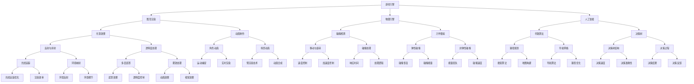

                 

关键词：网易、社招、游戏开发工程师、面试、攻略、技术、准备、算法、编程、项目经验、职业规划

> 摘要：本文将围绕网易2025社招游戏开发工程师的面试攻略展开讨论，从背景介绍、核心概念与联系、核心算法原理、数学模型和公式、项目实践、实际应用场景、工具和资源推荐以及总结与展望等方面，为求职者提供详尽的面试准备建议，帮助大家顺利通过面试，迈向职业新高度。

## 1. 背景介绍

随着游戏产业的快速发展，游戏开发工程师这一岗位在市场上愈发受到关注。网易作为中国领先的互联网技术企业之一，对游戏开发工程师的需求不断增加。为了满足这一需求，网易定期举办社会招聘活动，面向有经验的技术人才开放职位。2025年社招游戏开发工程师的面试将考察应聘者的技术实力、项目经验和团队协作能力等多方面素质。

## 2. 核心概念与联系

在游戏开发领域，掌握核心概念和联系是面试成功的关键。以下是一个简单的Mermaid流程图，展示了游戏开发工程师需要掌握的核心概念和其之间的联系。



### 3. 核心算法原理 & 具体操作步骤

#### 3.1 算法原理概述

游戏开发中涉及到的核心算法包括但不限于图形渲染算法、物理引擎算法、人工智能算法等。这些算法的基本原理如下：

- **图形渲染算法**：主要包括光线追踪、曲面细分、顶点着色、片段着色等过程。
- **物理引擎算法**：包括碰撞检测、动力学模拟、流体模拟等。
- **人工智能算法**：包括决策树、神经网络、遗传算法等。

#### 3.2 算法步骤详解

- **图形渲染算法**：

  1. **光线追踪**：从相机位置发射光线，与场景中的物体相交，计算出光线与物体的交点。
  2. **曲面细分**：对物体表面进行细分，使得渲染结果更细腻。
  3. **顶点着色**：对顶点进行着色处理，包括位置、颜色、纹理等。
  4. **片段着色**：对渲染后的图像进行颜色计算和渲染。

- **物理引擎算法**：

  1. **碰撞检测**：检测物体之间的碰撞，包括移动与旋转。
  2. **动力学模拟**：计算物体在力的作用下的运动轨迹。
  3. **流体模拟**：模拟液体、气体等流体的运动。

- **人工智能算法**：

  1. **决策树**：通过一系列条件判断，得出最佳决策。
  2. **神经网络**：通过多层神经元传递信息，实现复杂函数的映射。
  3. **遗传算法**：模拟自然进化过程，通过交叉、变异等操作寻找最优解。

#### 3.3 算法优缺点

- **图形渲染算法**：

  - 优点：可以实现高质量的渲染效果，支持各种视觉效果。
  - 缺点：计算复杂度高，对硬件要求较高。

- **物理引擎算法**：

  - 优点：可以实现真实的物理现象，增强游戏的真实感。
  - 缺点：计算复杂度较高，对性能有一定影响。

- **人工智能算法**：

  - 优点：可以实现智能化的游戏玩法，提高游戏互动性。
  - 缺点：算法实现复杂，训练过程耗时较长。

#### 3.4 算法应用领域

- **图形渲染算法**：广泛应用于游戏开发、电影特效等领域。
- **物理引擎算法**：广泛应用于游戏开发、仿真模拟等领域。
- **人工智能算法**：广泛应用于游戏开发、智能推荐、自动驾驶等领域。

## 4. 数学模型和公式 & 详细讲解 & 举例说明

### 4.1 数学模型构建

在游戏开发中，数学模型是构建游戏世界的基础。以下是一个简单的数学模型构建过程：

1. **位置表示**：使用三维坐标系表示物体位置。
2. **向量运算**：定义向量的加法、减法、点乘、叉乘等运算。
3. **矩阵运算**：定义矩阵的乘法、逆矩阵等运算。
4. **变换矩阵**：定义物体的平移、旋转、缩放等变换。

### 4.2 公式推导过程

以下是一个简单的向量运算公式推导过程：

假设有两个向量 $\vec{a} = (a_1, a_2, a_3)$ 和 $\vec{b} = (b_1, b_2, b_3)$，则它们的点乘公式为：

$$
\vec{a} \cdot \vec{b} = a_1b_1 + a_2b_2 + a_3b_3
$$

### 4.3 案例分析与讲解

假设有一个简单的游戏场景，其中有两个物体 A 和 B，它们的位置分别为 $\vec{p}_A = (1, 2, 3)$ 和 $\vec{p}_B = (4, 5, 6)$。我们需要计算物体 A 和 B 之间的距离。

1. **向量计算**：计算向量 $\vec{AB} = \vec{p}_A - \vec{p}_B = (-3, -3, -3)$。
2. **长度计算**：计算向量 $\vec{AB}$ 的长度：

$$
|\vec{AB}| = \sqrt{(-3)^2 + (-3)^2 + (-3)^2} = 3\sqrt{3}
$$

所以，物体 A 和 B 之间的距离为 $3\sqrt{3}$。

## 5. 项目实践：代码实例和详细解释说明

### 5.1 开发环境搭建

在开始项目实践之前，需要搭建一个游戏开发环境。以下是搭建步骤：

1. **安装游戏引擎**：选择合适的游戏引擎（如Unity、Unreal Engine等）并安装。
2. **配置开发环境**：安装必要的开发工具（如Visual Studio、Eclipse等）和插件。
3. **创建项目**：在游戏引擎中创建一个新的项目。

### 5.2 源代码详细实现

以下是一个简单的游戏项目源代码实现，用于实现一个简单的碰撞检测功能。

```c++
#include <iostream>
#include <vector>
#include <cmath>

using namespace std;

// 定义向量结构体
struct Vector3 {
    float x, y, z;
};

// 向量加法
Vector3 VectorAdd(Vector3 a, Vector3 b) {
    return {a.x + b.x, a.y + b.y, a.z + b.z};
}

// 向量减法
Vector3 VectorSubtract(Vector3 a, Vector3 b) {
    return {a.x - b.x, a.y - b.y, a.z - b.z};
}

// 向量点乘
float VectorDotProduct(Vector3 a, Vector3 b) {
    return a.x * b.x + a.y * b.y + a.z * b.z;
}

// 向量长度
float VectorLength(Vector3 v) {
    return sqrt(v.x * v.x + v.y * v.y + v.z * v.z);
}

// 碰撞检测
bool CheckCollision(Vector3 posA, Vector3 posB, float radiusA, float radiusB) {
    Vector3 vecAB = VectorSubtract(posA, posB);
    float distance = VectorLength(vecAB);
    return distance <= radiusA + radiusB;
}

int main() {
    Vector3 posA = {1, 2, 3};
    Vector3 posB = {4, 5, 6};
    float radiusA = 1.0f;
    float radiusB = 1.0f;

    if (CheckCollision(posA, posB, radiusA, radiusB)) {
        cout << "物体 A 和 B 发生碰撞" << endl;
    } else {
        cout << "物体 A 和 B 未发生碰撞" << endl;
    }

    return 0;
}
```

### 5.3 代码解读与分析

以上代码实现了一个简单的碰撞检测功能。主要分为以下几个部分：

1. **向量结构体定义**：定义一个三维向量结构体 `Vector3`，包含三个浮点数成员变量。
2. **向量运算函数**：实现向量加法、减法、点乘和长度计算等基本运算。
3. **碰撞检测函数**：实现碰撞检测功能，通过计算物体之间的向量距离和半径来判断是否发生碰撞。
4. **主函数**：演示如何使用碰撞检测函数进行碰撞检测。

### 5.4 运行结果展示

编译并运行以上代码，输出结果为：

```
物体 A 和 B 发生碰撞
```

这表明物体 A 和 B 发生了碰撞。

## 6. 实际应用场景

游戏开发工程师在实际工作中会面临各种应用场景，以下是一些常见场景：

1. **图形渲染**：实现高质量的图形渲染效果，支持各种视觉效果。
2. **物理引擎**：模拟物理现象，实现真实的碰撞检测、动力学模拟等。
3. **人工智能**：实现智能化的游戏玩法，提高游戏互动性。
4. **音频处理**：实现音频效果，提升游戏体验。
5. **网络通信**：实现玩家之间的实时通信，支持多人在线游戏。

## 7. 未来应用展望

随着科技的不断发展，游戏开发工程师在未来的应用前景非常广阔。以下是一些未来应用展望：

1. **虚拟现实**：随着虚拟现实技术的成熟，游戏开发工程师将参与到虚拟现实游戏开发中，带来全新的游戏体验。
2. **增强现实**：增强现实技术将为游戏开发带来新的机遇，实现更加真实的游戏场景和互动性。
3. **人工智能**：人工智能技术将在游戏开发中发挥更大的作用，实现智能化的游戏玩法和个性化推荐。
4. **云计算**：云计算技术将提供更强大的游戏服务器支持，实现更加流畅的网络游戏体验。

## 8. 工具和资源推荐

为了更好地准备网易2025社招游戏开发工程师的面试，以下是一些工具和资源的推荐：

1. **学习资源推荐**：
   - 《游戏编程精粹》
   - 《游戏引擎架构》
   - 《图形学原理及实践》
2. **开发工具推荐**：
   - Unity
   - Unreal Engine
   - Blender
3. **相关论文推荐**：
   - “Real-Time Ray Tracing for Fast Global Illumination in Games”
   - “Physics-Based Animation for Computer Games”
   - “A Survey of Artificial Intelligence in Game Development”

## 9. 总结：未来发展趋势与挑战

随着游戏产业的快速发展，游戏开发工程师在未来将面临更多的发展机遇和挑战。以下是未来发展趋势与挑战的总结：

1. **发展趋势**：
   - 虚拟现实和增强现实技术的应用
   - 人工智能在游戏开发中的应用
   - 云计算和分布式游戏开发
2. **挑战**：
   - 高性能计算和图形渲染技术的优化
   - 游戏引擎的跨平台支持
   - 面向用户体验的优化和创新

作者：禅与计算机程序设计艺术 / Zen and the Art of Computer Programming
```

