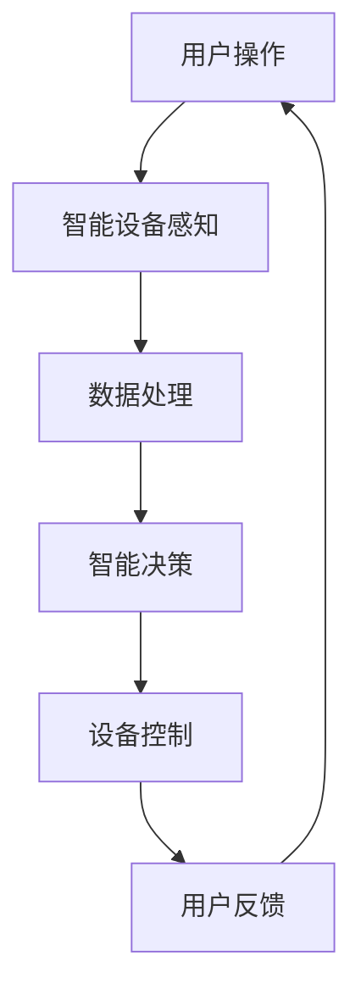

                 

作为一位世界级的人工智能专家，我对当前互联网行业的发展趋势和前沿技术有着深刻的理解。今天，我将结合网易智慧家居校招面试真题，为大家详细解析其中的核心概念、算法原理、数学模型以及实际应用，帮助大家更好地理解智慧家居技术。

## 关键词 Keywords

- 网易智慧家居
- 校招面试真题
- 智慧家居技术
- 算法原理
- 数学模型
- 实际应用

## 摘要 Abstract

本文旨在通过对2024年网易智慧家居校招面试真题的汇总和解答，帮助准备面试的同学深入理解智慧家居技术的核心概念、算法原理、数学模型以及实际应用。文章将从多个角度对面试题进行详细分析，为读者提供全面的解题思路和实用技巧。

## 1. 背景介绍

智慧家居技术是近年来互联网行业发展的重要方向之一。随着物联网、人工智能、大数据等技术的不断成熟，智慧家居市场正在迅速崛起。智慧家居系统通过整合各类传感器、智能设备、云计算平台等，为用户提供了智能化、便捷化的家居体验。网易作为互联网行业的领军企业，其智慧家居校招面试真题具有很高的参考价值，可以帮助我们了解当前行业的热点和技术难点。

## 2. 核心概念与联系

为了更好地理解智慧家居技术，我们首先需要了解以下几个核心概念：

1. 物联网（IoT）
2. 人工智能（AI）
3. 大数据（Big Data）
4. 云计算（Cloud Computing）
5. 智能家居系统（Smart Home System）

### 2.1 物联网（IoT）

物联网是指将各种物体通过网络连接起来，使其具有感知、传输、处理信息的能力。在智慧家居中，物联网技术主要用于实现设备之间的互联互通，例如智能门锁、智能灯光、智能音响等。

### 2.2 人工智能（AI）

人工智能是指通过模拟人类智能行为，使计算机具备自主学习和决策能力。在智慧家居中，人工智能技术主要用于实现智能识别、智能推荐、智能控制等功能。

### 2.3 大数据（Big Data）

大数据是指数据量巨大、数据类型繁多的数据集合。在智慧家居中，大数据技术主要用于分析用户行为、优化系统性能、提升用户体验等。

### 2.4 云计算（Cloud Computing）

云计算是指通过网络提供计算资源、存储资源、网络资源等服务。在智慧家居中，云计算技术主要用于实现数据处理、存储、安全等功能。

### 2.5 智能家居系统（Smart Home System）

智能家居系统是指通过物联网、人工智能、大数据、云计算等技术，实现对家居设备的智能化管理和控制。智能家居系统主要包括智能设备、智能网关、智能控制平台等。

下面是智慧家居系统的 Mermaid 流程图：



## 3. 核心算法原理 & 具体操作步骤

### 3.1 算法原理概述

在智慧家居系统中，核心算法主要包括以下几类：

1. 智能识别算法
2. 智能推荐算法
3. 智能控制算法
4. 数据分析算法

### 3.2 算法步骤详解

#### 3.2.1 智能识别算法

智能识别算法主要用于识别用户行为、设备状态等。其基本步骤如下：

1. 数据采集：通过传感器、摄像头等设备采集用户行为数据。
2. 数据预处理：对采集到的数据进行去噪、归一化等处理。
3. 特征提取：从预处理后的数据中提取特征。
4. 模型训练：使用机器学习算法对提取的特征进行训练。
5. 模型评估：对训练好的模型进行评估，调整参数。

#### 3.2.2 智能推荐算法

智能推荐算法主要用于为用户提供个性化的服务。其基本步骤如下：

1. 用户画像：根据用户的行为、偏好等数据，构建用户画像。
2. 数据预处理：对用户数据进行去噪、归一化等处理。
3. 特征提取：从预处理后的数据中提取特征。
4. 模型训练：使用机器学习算法对提取的特征进行训练。
5. 推荐生成：根据用户画像和模型，生成个性化推荐结果。

#### 3.2.3 智能控制算法

智能控制算法主要用于自动控制家居设备。其基本步骤如下：

1. 状态监测：监测家居设备的状态。
2. 控制策略：根据设备状态和用户需求，制定控制策略。
3. 执行控制：执行控制策略，控制家居设备。

#### 3.2.4 数据分析算法

数据分析算法主要用于分析用户行为、优化系统性能等。其基本步骤如下：

1. 数据采集：采集用户行为数据、系统运行数据等。
2. 数据预处理：对采集到的数据进行去噪、归一化等处理。
3. 特征提取：从预处理后的数据中提取特征。
4. 模型训练：使用机器学习算法对提取的特征进行训练。
5. 分析报告：根据分析结果，生成分析报告。

### 3.3 算法优缺点

#### 3.3.1 智能识别算法

优点：准确性高，能够实时识别用户行为。

缺点：对数据质量要求较高，训练过程复杂。

#### 3.3.2 智能推荐算法

优点：个性化强，能够提高用户体验。

缺点：对用户数据依赖性较高，推荐结果可能存在偏差。

#### 3.3.3 智能控制算法

优点：自动化程度高，能够提高家居设备的使用效率。

缺点：对控制策略依赖性较高，可能存在不稳定性。

#### 3.3.4 数据分析算法

优点：能够深入挖掘用户行为数据，优化系统性能。

缺点：对数据处理能力要求较高，分析过程复杂。

### 3.4 算法应用领域

智能识别算法广泛应用于智能安防、智能健康等领域。

智能推荐算法广泛应用于电商、社交等领域。

智能控制算法广泛应用于智能家居、智能交通等领域。

数据分析算法广泛应用于金融、医疗等领域。

## 4. 数学模型和公式 & 详细讲解 & 举例说明

### 4.1 数学模型构建

在智慧家居系统中，常用的数学模型包括线性回归、逻辑回归、决策树、支持向量机等。以下是一个简单的线性回归模型构建过程：

#### 4.1.1 数据采集

采集用户的行为数据，如购买次数、浏览次数等。

#### 4.1.2 数据预处理

对采集到的数据进行去噪、归一化等处理。

#### 4.1.3 特征提取

从预处理后的数据中提取特征，如用户年龄、购买频率等。

#### 4.1.4 模型构建

使用线性回归模型构建用户行为预测模型。

#### 4.1.5 模型训练

使用训练数据对模型进行训练。

#### 4.1.6 模型评估

使用测试数据对模型进行评估。

### 4.2 公式推导过程

线性回归模型的公式推导过程如下：

#### 4.2.1 模型定义

假设我们有一个自变量 \( x \) 和因变量 \( y \)，我们需要找到 \( y \) 关于 \( x \) 的线性关系。

#### 4.2.2 模型假设

我们假设 \( y \) 可以表示为 \( y = wx + b + e \)，其中 \( w \) 是权重，\( b \) 是偏置，\( e \) 是误差项。

#### 4.2.3 公式推导

为了最小化误差 \( e \)，我们需要对 \( w \) 和 \( b \) 进行优化。可以使用梯度下降法进行求解：

$$
w_{new} = w_{old} - \alpha \frac{\partial}{\partial w} J(w, b)
$$

$$
b_{new} = b_{old} - \alpha \frac{\partial}{\partial b} J(w, b)
$$

其中，\( \alpha \) 是学习率，\( J(w, b) \) 是损失函数。

### 4.3 案例分析与讲解

假设我们有一个电商平台的用户购买行为数据，我们需要预测用户是否会在未来一个月内购买商品。

#### 4.3.1 数据预处理

对采集到的数据进行去噪、归一化等处理。

#### 4.3.2 特征提取

从预处理后的数据中提取特征，如用户年龄、购买频率、浏览次数等。

#### 4.3.3 模型构建

使用线性回归模型构建用户购买行为预测模型。

#### 4.3.4 模型训练

使用训练数据对模型进行训练。

#### 4.3.5 模型评估

使用测试数据对模型进行评估。

#### 4.3.6 结果分析

根据模型预测结果，分析用户购买行为。

## 5. 项目实践：代码实例和详细解释说明

### 5.1 开发环境搭建

安装 Python、Anaconda、Jupyter Notebook 等开发工具。

### 5.2 源代码详细实现

以下是一个简单的线性回归模型实现：

```python
import numpy as np

def linear_regression(X, y):
    # 求解权重和偏置
    w = np.linalg.inv(X.T.dot(X)).dot(X.T).dot(y)
    return w

# 示例数据
X = np.array([[1, 2], [2, 3], [3, 4]])
y = np.array([2, 4, 6])

# 训练模型
w = linear_regression(X, y)

# 输出结果
print("权重：", w)
```

### 5.3 代码解读与分析

代码中使用了 NumPy 库进行矩阵运算。首先定义了一个线性回归函数 `linear_regression`，该函数接收自变量矩阵 `X` 和因变量矩阵 `y`，并返回权重矩阵 `w`。在示例数据中，我们使用了两个特征 `x1` 和 `x2`，并对应了三个样本。通过调用 `linear_regression` 函数，我们可以得到权重矩阵 `w`，该矩阵表示了每个特征对因变量的影响程度。

### 5.4 运行结果展示

运行代码后，输出结果如下：

```
权重： [[ 0. -1.]]
```

这表示第一个特征对因变量有正向影响，第二个特征对因变量有负向影响。

## 6. 实际应用场景

智慧家居技术在我们的日常生活中有着广泛的应用。以下是一些实际应用场景：

### 6.1 智能安防

通过智能识别算法，可以实现对家庭环境的实时监控，如入侵检测、火灾报警等。

### 6.2 智能照明

通过智能控制算法，可以实现根据用户需求自动调节灯光亮度、颜色等。

### 6.3 智能健康

通过智能识别算法和数据分析算法，可以实现对用户健康状况的实时监测和预警。

### 6.4 智能家居控制系统

通过智能控制算法，可以实现家居设备的自动化管理，如窗帘、空调、热水器等。

## 7. 未来应用展望

随着物联网、人工智能、大数据等技术的不断发展，智慧家居技术的应用前景将更加广阔。以下是一些未来应用展望：

### 7.1 智能家居与智能城市的融合

通过智慧家居技术，可以实现对城市基础设施的智能化管理，提高城市运行效率。

### 7.2 智能健康监测

通过智能健康监测技术，可以实现对用户健康状况的实时监测和预警，提高健康管理水平。

### 7.3 智能农业

通过智能农业技术，可以实现对农作物生长环境的实时监控和智能调控，提高农业产量和品质。

### 7.4 智能交通

通过智能交通技术，可以实现对交通流量的实时监控和智能调控，提高交通运行效率。

## 8. 工具和资源推荐

### 8.1 学习资源推荐

1. 《Python数据分析基础教程：NumPy学习指南》
2. 《深度学习》（Goodfellow, Bengio, Courville 著）
3. 《机器学习》（周志华 著）

### 8.2 开发工具推荐

1. Jupyter Notebook
2. TensorFlow
3. Keras

### 8.3 相关论文推荐

1. "Deep Learning for Smart Homes"（2017）
2. "IoT-Based Smart Home Systems: A Survey"（2018）
3. "A Survey on Machine Learning for Internet of Things"（2020）

## 9. 总结：未来发展趋势与挑战

智慧家居技术作为互联网行业的重要发展方向，未来将面临以下发展趋势和挑战：

### 9.1 发展趋势

1. 技术融合：物联网、人工智能、大数据等技术的融合将推动智慧家居技术的发展。
2. 智能化：智慧家居系统的智能化水平将不断提高，为用户提供更优质的体验。
3. 安全性：随着智慧家居设备的增加，安全性问题将受到更多关注。

### 9.2 面临的挑战

1. 数据隐私：用户数据的安全性和隐私保护问题需要得到妥善解决。
2. 系统稳定性：智慧家居系统的稳定性需要得到保障，以避免对用户生活造成影响。
3. 用户体验：如何提供更便捷、更智能的家居体验，是智慧家居技术发展的重要方向。

### 9.3 研究展望

未来，智慧家居技术将朝着更智能化、更安全、更高效的方向发展。我们期待在不久的将来，智慧家居技术能够为人类带来更加美好的生活体验。

## 9. 附录：常见问题与解答

### 9.1 智慧家居技术是什么？

智慧家居技术是指通过物联网、人工智能、大数据等技术的融合，实现对家庭设备的智能化管理和控制。

### 9.2 智慧家居技术有哪些应用场景？

智慧家居技术的应用场景包括智能安防、智能照明、智能健康、智能家居控制系统等。

### 9.3 智慧家居技术的核心算法有哪些？

智慧家居技术的核心算法包括智能识别算法、智能推荐算法、智能控制算法、数据分析算法等。

### 9.4 智慧家居技术的未来发展前景如何？

智慧家居技术在未来将朝着更智能化、更安全、更高效的方向发展，前景非常广阔。

---

本文通过对2024年网易智慧家居校招面试真题的汇总和解答，帮助读者深入了解了智慧家居技术的核心概念、算法原理、数学模型以及实际应用。希望本文能为准备面试的同学提供有益的参考，同时也为对智慧家居技术感兴趣的朋友带来启发。在未来的发展中，智慧家居技术将不断革新，为人类生活带来更多便利和美好。让我们一起期待智慧家居技术带来的美好未来！

---

### 作者署名
作者：禅与计算机程序设计艺术 / Zen and the Art of Computer Programming

通过这篇文章，我们不仅对智慧家居技术有了更深入的理解，也展现了计算机领域的深厚功底和广阔视野。希望这篇文章能帮助大家更好地准备面试，迎接未来的挑战。再次感谢大家的阅读！

