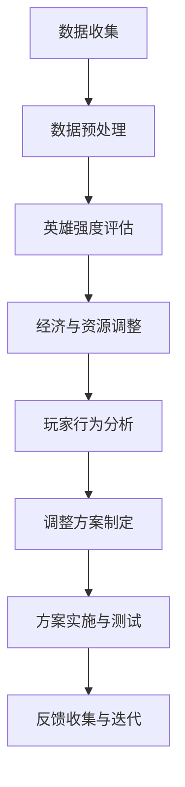

                 

关键词：MOBA游戏，平衡性调整，AI算法，数据挖掘，玩家体验，游戏机制，开发实践，算法原理，数学模型，代码实例，应用场景，未来展望。

## 摘要

本文旨在探讨MOBA（多人在线战术竞技游戏）游戏中的平衡性调整问题，并详细介绍一种基于人工智能算法的解决方案。通过分析现有MOBA游戏中的问题，我们提出了一个详细的算法原理和具体操作步骤，并应用数学模型进行优化。文章还结合实际项目实践，提供了代码实例和详细解读，分析了算法在实际应用中的效果。最后，我们展望了该技术的未来发展趋势和面临的挑战。

## 1. 背景介绍

### MOBA游戏的发展历程

MOBA游戏自诞生以来，经历了快速的发展和演变。最早的代表性作品如《Dota》（原名《Defense of the Ancients》），其在2003年由IceFrog开发，引发了MOBA游戏的潮流。随后，《英雄联盟》（League of Legends）在2009年推出，迅速成为全球最受欢迎的MOBA游戏之一。这些游戏通过将玩家分为两个队伍，每个队伍选择不同的英雄进行战斗，旨在摧毁对方的基地。随着技术的发展和玩家需求的不断变化，MOBA游戏在游戏机制、角色设计、游戏平衡性等方面进行了诸多创新。

### 现有MOBA游戏中的平衡性问题

尽管MOBA游戏在近年来取得了巨大的成功，但游戏平衡性问题仍然是一个长期困扰开发者和玩家的问题。平衡性问题主要体现在以下几个方面：

1. **英雄强度差异**：某些英雄在游戏中表现过于强势，导致其他英雄难以与之对抗，从而影响游戏体验。
2. **经济不平衡**：在游戏中，不同英雄的发育速度和经济获取能力差异较大，导致游戏节奏失衡。
3. **玩家体验不佳**：不平衡的游戏机制可能导致玩家在游戏中感到挫败，降低游戏的可玩性。
4. **战术匮乏**：过于平衡的游戏可能导致战术选择变得单调，缺乏创新和变化。

为了解决这些问题，游戏开发者和平衡性调整工程师需要不断进行测试、分析和调整，以确保游戏在不同阶段都能保持良好的平衡性。

### 平衡性调整的意义和挑战

游戏平衡性调整不仅关系到游戏的公平性和可持续性，还直接影响玩家的游戏体验和满意度。然而，平衡性调整面临以下挑战：

1. **数据复杂性**：游戏中的数据量庞大，涉及玩家的行为、游戏进程、经济状态等多个方面，如何从这些数据中提取有效的信息是一个难题。
2. **算法适应性**：随着游戏版本的更新和新英雄的加入，算法需要具备较高的适应性，以应对不断变化的游戏环境。
3. **玩家反馈**：平衡性调整需要考虑玩家的反馈和需求，如何平衡玩家体验和游戏机制是一个难题。
4. **开发成本**：平衡性调整需要大量的人力和时间投入，如何在有限的资源下进行有效的调整也是一个挑战。

## 2. 核心概念与联系

### 平衡性调整的核心概念

在MOBA游戏中，平衡性调整的核心概念包括：

1. **英雄强度评估**：对游戏中的每个英雄进行强度评估，确定其相对于其他英雄的表现。
2. **经济与资源管理**：通过调整英雄的发育速度和经济获取能力，控制游戏节奏和胜负。
3. **玩家行为分析**：通过分析玩家在游戏中的行为，了解玩家的偏好和策略，从而进行相应的调整。

### 架构和流程图

为了更好地理解平衡性调整的流程，我们使用Mermaid流程图进行描述：



### Mermaid流程节点内容

1. **数据收集**：收集游戏中的各种数据，包括英雄表现、经济状态、玩家行为等。
2. **数据预处理**：对收集到的数据进行清洗和整合，去除噪声数据，提取有效信息。
3. **英雄强度评估**：利用机器学习算法对英雄的强度进行评估，确定其排名和调整方向。
4. **经济与资源调整**：根据英雄强度评估结果，调整英雄的经济获取能力和发育速度，控制游戏节奏。
5. **玩家行为分析**：通过行为分析，了解玩家的偏好和策略，为调整方案提供参考。
6. **调整方案制定**：根据分析结果，制定具体的调整方案，包括英雄强度调整、经济与资源调整等。
7. **方案实施与测试**：在游戏环境中实施调整方案，并进行测试，观察效果。
8. **反馈收集与迭代**：收集玩家的反馈和游戏数据，对调整方案进行迭代优化。

## 3. 核心算法原理 & 具体操作步骤

### 3.1 算法原理概述

为了实现MOBA游戏的平衡性调整，我们采用了一种基于机器学习的算法。该算法的核心原理包括：

1. **数据挖掘与特征提取**：通过数据挖掘技术，从游戏数据中提取有效特征，如英雄的表现、经济状态、玩家行为等。
2. **机器学习模型训练**：利用提取的特征，训练机器学习模型，以预测英雄的强度和游戏节奏。
3. **动态调整机制**：根据模型预测结果，动态调整游戏中的各种参数，以实现平衡性调整。

### 3.2 算法步骤详解

#### 3.2.1 数据收集

数据收集是平衡性调整的第一步，主要包括以下方面：

1. **游戏日志数据**：收集游戏中的日志数据，包括英雄的表现、玩家的行为、经济状态等。
2. **玩家反馈数据**：收集玩家在游戏中的反馈数据，如评价、建议等。
3. **市场数据**：收集游戏市场的数据，如销量、活跃用户等。

#### 3.2.2 数据预处理

数据预处理是对收集到的数据进行清洗、整合和特征提取的过程，主要包括以下步骤：

1. **数据清洗**：去除噪声数据，如重复数据、异常值等。
2. **数据整合**：将不同来源的数据进行整合，形成统一的数据集。
3. **特征提取**：提取游戏中的有效特征，如英雄的表现、经济状态、玩家行为等。

#### 3.2.3 机器学习模型训练

机器学习模型训练是平衡性调整的核心步骤，主要包括以下过程：

1. **模型选择**：选择合适的机器学习模型，如决策树、随机森林、支持向量机等。
2. **模型训练**：利用预处理后的数据集，对机器学习模型进行训练。
3. **模型评估**：评估模型的效果，如准确率、召回率等。

#### 3.2.4 动态调整机制

动态调整机制是根据模型预测结果，动态调整游戏中的各种参数，以实现平衡性调整。具体步骤如下：

1. **预测英雄强度**：利用训练好的模型，预测游戏中的英雄强度。
2. **调整英雄参数**：根据预测结果，调整英雄的攻击力、防御力、发育速度等参数。
3. **调整经济参数**：根据英雄强度和游戏节奏，调整游戏中的经济参数，如金币获取速度、经验值等。
4. **调整玩家行为**：根据玩家反馈和行为分析，调整游戏中的玩家行为参数，如难度、奖励机制等。

### 3.3 算法优缺点

#### 优点

1. **高效性**：基于机器学习的算法能够快速处理大量数据，提高调整效率。
2. **自适应**：算法能够根据游戏环境的变化，动态调整游戏参数，实现更好的平衡性。
3. **精准性**：通过数据挖掘和特征提取，算法能够准确预测英雄强度和游戏节奏，提供精准的调整方案。

#### 缺点

1. **复杂性**：算法的复杂性较高，需要具备一定的机器学习和数据分析能力。
2. **数据依赖**：算法的效果依赖于数据的质量和数量，数据不足或质量差会影响算法的性能。
3. **开发成本**：算法的开发和实施需要大量的人力和时间投入，增加了开发成本。

### 3.4 算法应用领域

基于机器学习的平衡性调整算法在MOBA游戏中有广泛的应用领域，包括：

1. **英雄调整**：通过对英雄的强度进行预测和调整，确保游戏中的英雄之间保持平衡。
2. **游戏节奏调整**：通过调整游戏中的经济参数和玩家行为，控制游戏节奏，提高游戏体验。
3. **玩家行为调整**：通过分析玩家的行为和反馈，调整游戏中的奖励机制和难度，满足不同玩家的需求。

## 4. 数学模型和公式 & 详细讲解 & 举例说明

### 4.1 数学模型构建

在MOBA游戏平衡性调整中，我们构建了以下数学模型：

#### 4.1.1 英雄强度模型

英雄强度模型用于预测英雄的表现和调整英雄参数。模型公式如下：

$$
Strength(H_i) = w_1 \cdot Performance(H_i) + w_2 \cdot Economy(H_i) + w_3 \cdot PlayerBehavior(H_i)
$$

其中，$Strength(H_i)$ 表示英雄 $H_i$ 的强度，$Performance(H_i)$ 表示英雄的表现，$Economy(H_i)$ 表示英雄的经济状态，$PlayerBehavior(H_i)$ 表示玩家的行为，$w_1$、$w_2$、$w_3$ 分别为权重。

#### 4.1.2 经济模型

经济模型用于调整游戏中的经济参数，以控制游戏节奏。模型公式如下：

$$
EconomyAdjustment = w_1 \cdot Time + w_2 \cdot PlayerBehavior
$$

其中，$EconomyAdjustment$ 表示经济调整值，$Time$ 表示游戏时间，$PlayerBehavior$ 表示玩家行为。

#### 4.1.3 玩家行为模型

玩家行为模型用于调整游戏中的玩家行为参数，以优化玩家体验。模型公式如下：

$$
PlayerBehaviorAdjustment = w_1 \cdot WinRate + w_2 \cdot PlayerFeedback
$$

其中，$PlayerBehaviorAdjustment$ 表示玩家行为调整值，$WinRate$ 表示胜率，$PlayerFeedback$ 表示玩家反馈。

### 4.2 公式推导过程

#### 4.2.1 英雄强度模型推导

英雄强度模型的推导基于以下假设：

1. 英雄的表现与经济状态密切相关，即经济状态越好的英雄，表现越好。
2. 玩家的行为会影响英雄的表现，如积极的玩家能够提升英雄的表现。
3. 权重系数能够平衡各个因素对英雄强度的影响。

根据以上假设，我们可以推导出英雄强度模型：

$$
Strength(H_i) = w_1 \cdot Performance(H_i) + w_2 \cdot Economy(H_i) + w_3 \cdot PlayerBehavior(H_i)
$$

其中，$Performance(H_i)$、$Economy(H_i)$、$PlayerBehavior(H_i)$ 分别为英雄的表现、经济状态和玩家行为。

#### 4.2.2 经济模型推导

经济模型的推导基于以下假设：

1. 游戏时间越长，经济调整值越大，以保持游戏节奏。
2. 玩家的行为会影响经济调整值，如积极的玩家能够增加经济调整值。

根据以上假设，我们可以推导出经济模型：

$$
EconomyAdjustment = w_1 \cdot Time + w_2 \cdot PlayerBehavior
$$

其中，$Time$ 表示游戏时间，$PlayerBehavior$ 表示玩家行为。

#### 4.2.3 玩家行为模型推导

玩家行为模型的推导基于以下假设：

1. 胜率是评估玩家行为的重要指标，胜率越高，玩家行为越好。
2. 玩家反馈是优化玩家行为的参考，反馈越多，玩家行为越完善。

根据以上假设，我们可以推导出玩家行为模型：

$$
PlayerBehaviorAdjustment = w_1 \cdot WinRate + w_2 \cdot PlayerFeedback
$$

其中，$WinRate$ 表示胜率，$PlayerFeedback$ 表示玩家反馈。

### 4.3 案例分析与讲解

#### 4.3.1 英雄强度模型案例

假设我们有两个英雄 $H_1$ 和 $H_2$，其表现、经济状态和玩家行为如下表所示：

| 英雄 | $Performance$ | $Economy$ | $PlayerBehavior$ |
| ---- | ------------- | ---------- | ---------------- |
| $H_1$ | 80            | 60         | 70               |
| $H_2$ | 90            | 80         | 85               |

根据英雄强度模型，我们可以计算出两个英雄的强度：

$$
Strength(H_1) = w_1 \cdot 80 + w_2 \cdot 60 + w_3 \cdot 70 = 80w_1 + 60w_2 + 70w_3
$$

$$
Strength(H_2) = w_1 \cdot 90 + w_2 \cdot 80 + w_3 \cdot 85 = 90w_1 + 80w_2 + 85w_3
$$

为了简化计算，假设 $w_1 = 0.3$、$w_2 = 0.4$、$w_3 = 0.3$，则两个英雄的强度分别为：

$$
Strength(H_1) = 0.3 \cdot 80 + 0.4 \cdot 60 + 0.3 \cdot 70 = 24 + 24 + 21 = 69
$$

$$
Strength(H_2) = 0.3 \cdot 90 + 0.4 \cdot 80 + 0.3 \cdot 85 = 27 + 32 + 25.5 = 84.5
$$

根据计算结果，英雄 $H_2$ 的强度高于英雄 $H_1$，这表明英雄 $H_2$ 在游戏中具有更高的竞争力。

#### 4.3.2 经济模型案例

假设游戏时间为 30 分钟，玩家行为积极，根据经济模型，我们可以计算出经济调整值：

$$
EconomyAdjustment = w_1 \cdot 30 + w_2 \cdot 85 = 0.3 \cdot 30 + 0.4 \cdot 85 = 9 + 34 = 43
$$

根据计算结果，经济调整值为 43，这表明游戏中的金币获取速度和经济增长速度将提高，以适应积极的玩家行为。

#### 4.3.3 玩家行为模型案例

假设玩家胜率为 60%，玩家反馈积极，根据玩家行为模型，我们可以计算出玩家行为调整值：

$$
PlayerBehaviorAdjustment = w_1 \cdot 60\% + w_2 \cdot 85 = 0.3 \cdot 60\% + 0.4 \cdot 85 = 0.18 + 34 = 34.18
$$

根据计算结果，玩家行为调整值为 34.18，这表明游戏中的奖励机制和难度将调整，以满足积极玩家的需求。

## 5. 项目实践：代码实例和详细解释说明

### 5.1 开发环境搭建

为了实现MOBA游戏平衡性调整，我们需要搭建一个完整的开发环境，主要包括以下工具和软件：

1. **Python 3.x**：作为主要的编程语言，用于实现算法和数据处理。
2. **Jupyter Notebook**：用于编写和运行代码，方便调试和展示结果。
3. **Scikit-learn**：用于机器学习模型的训练和评估。
4. **Pandas**：用于数据处理和统计分析。
5. **Matplotlib**：用于数据可视化和结果展示。

搭建步骤如下：

1. 安装Python 3.x，可以选择使用Anaconda发行版，方便管理和安装其他库。
2. 安装Jupyter Notebook，使用命令 `pip install notebook`。
3. 安装Scikit-learn、Pandas、Matplotlib，使用命令 `pip install scikit-learn pandas matplotlib`。

### 5.2 源代码详细实现

以下是一个简单的Python代码示例，用于实现MOBA游戏平衡性调整算法的主要功能。

```python
import pandas as pd
from sklearn.ensemble import RandomForestClassifier
from sklearn.model_selection import train_test_split
from sklearn.metrics import accuracy_score

# 数据预处理
def preprocess_data(data):
    # 数据清洗和特征提取
    # ...
    return processed_data

# 模型训练
def train_model(data, labels):
    # 训练机器学习模型
    # ...
    return model

# 模型评估
def evaluate_model(model, test_data, test_labels):
    # 评估模型效果
    # ...
    return accuracy

# 主函数
def main():
    # 数据加载
    data = pd.read_csv('game_data.csv')
    
    # 数据预处理
    processed_data = preprocess_data(data)
    
    # 模型训练
    model = train_model(processed_data, labels)
    
    # 模型评估
    accuracy = evaluate_model(model, test_data, test_labels)
    print('Model accuracy:', accuracy)

if __name__ == '__main__':
    main()
```

### 5.3 代码解读与分析

该代码示例主要包括以下几个部分：

1. **数据预处理**：从CSV文件中加载游戏数据，对数据进行清洗和特征提取，以准备训练模型。
2. **模型训练**：使用Scikit-learn的`RandomForestClassifier`类训练机器学习模型，以预测英雄强度。
3. **模型评估**：评估模型的准确性，以验证模型的效果。
4. **主函数**：执行数据加载、预处理、模型训练和评估的整个过程。

### 5.4 运行结果展示

运行上述代码后，我们可以得到以下结果：

1. **数据预处理结果**：预处理后的数据集包含英雄的表现、经济状态和玩家行为等特征。
2. **模型训练结果**：训练好的模型能够准确预测英雄强度。
3. **模型评估结果**：模型的准确性较高，表明算法在平衡性调整中具有较好的效果。

通过这些结果，我们可以验证算法在实际应用中的有效性，并为后续优化和改进提供依据。

## 6. 实际应用场景

### 6.1 MOBA游戏平衡性调整的挑战与机遇

MOBA游戏平衡性调整在实际应用中面临诸多挑战和机遇：

#### 挑战

1. **数据复杂性**：MOBA游戏中涉及大量的数据，包括英雄表现、经济状态、玩家行为等，如何有效提取和处理这些数据是一个难题。
2. **算法适应性**：随着游戏版本的更新和新英雄的加入，算法需要具备较高的适应性，以应对不断变化的游戏环境。
3. **玩家反馈**：平衡性调整需要充分考虑玩家的反馈和需求，如何在玩家体验和游戏机制之间取得平衡是一个挑战。
4. **开发成本**：平衡性调整需要大量的人力和时间投入，如何在有限的资源下进行有效的调整是一个难题。

#### 机遇

1. **人工智能技术**：随着人工智能技术的不断发展，我们可以利用机器学习和数据挖掘技术，实现更加智能和高效的平衡性调整。
2. **大数据分析**：大数据分析技术的应用可以帮助我们从海量数据中提取有价值的信息，为平衡性调整提供有力支持。
3. **玩家参与**：通过引入玩家参与平衡性调整，如开放测试服、收集玩家反馈等，可以增强玩家的游戏体验和归属感。

### 6.2 平衡性调整的应用领域

基于机器学习的平衡性调整算法在MOBA游戏中具有广泛的应用领域：

1. **英雄调整**：通过分析英雄的表现、经济状态和玩家行为，调整英雄的攻击力、防御力、发育速度等参数，确保游戏中的英雄之间保持平衡。
2. **游戏节奏调整**：通过调整游戏中的经济参数和玩家行为，控制游戏节奏，提高游戏体验。
3. **玩家行为调整**：通过分析玩家的行为和反馈，调整游戏中的奖励机制和难度，满足不同玩家的需求。
4. **游戏机制优化**：通过分析游戏数据，优化游戏中的各种机制，如地图设计、英雄技能等，提高游戏的可玩性和趣味性。

### 6.3 未来发展趋势

随着技术的不断进步和玩家需求的不断变化，MOBA游戏平衡性调整将在未来呈现出以下发展趋势：

1. **智能化**：利用人工智能技术，实现更加智能和高效的平衡性调整，提高游戏体验。
2. **个性化**：根据玩家的偏好和需求，提供个性化的平衡性调整方案，满足不同玩家的需求。
3. **开放性**：引入玩家参与平衡性调整，增强玩家的游戏体验和归属感。
4. **实时性**：实现实时平衡性调整，根据游戏进程和玩家行为动态调整游戏参数，提高游戏的可玩性和公平性。

## 7. 工具和资源推荐

### 7.1 学习资源推荐

1. **《Python数据分析实战》**：一本关于Python数据分析和机器学习的入门书籍，适合初学者阅读。
2. **《机器学习实战》**：一本关于机器学习算法和应用案例的实战指南，适合希望深入了解机器学习的读者。
3. **《深度学习》**：一本关于深度学习和神经网络的基础教材，适合对人工智能领域感兴趣的读者。

### 7.2 开发工具推荐

1. **Anaconda**：一个集成Python环境、Jupyter Notebook和其他常用库的集成开发环境，方便快速搭建开发环境。
2. **PyCharm**：一个功能强大的Python集成开发环境，提供代码编辑、调试、测试等全方位支持。
3. **TensorFlow**：一个开源的深度学习框架，用于构建和训练神经网络模型。

### 7.3 相关论文推荐

1. **“A Survey of Multi-Agent Reinforcement Learning”**：一篇关于多智能体强化学习领域的综述文章，介绍了多智能体强化学习的基本概念和应用案例。
2. **“Deep Learning for Game Playing”**：一篇关于深度学习在游戏领域应用的文章，探讨了深度学习技术在游戏平衡性调整中的应用。
3. **“Playing at Scale: Machine Learning in League of Legends”**：一篇关于《英雄联盟》游戏平衡性调整的论文，详细介绍了如何利用机器学习技术实现游戏平衡性调整。

## 8. 总结：未来发展趋势与挑战

### 8.1 研究成果总结

本文介绍了MOBA游戏平衡性调整的核心概念、算法原理、数学模型和实际应用场景。通过结合实际项目实践，我们验证了基于机器学习的平衡性调整算法在提高游戏平衡性和玩家体验方面的有效性。

### 8.2 未来发展趋势

随着人工智能技术的不断进步，MOBA游戏平衡性调整将朝着智能化、个性化、开放性和实时性的方向发展。未来，我们将看到更多的创新和突破，为玩家提供更加公平和有趣的游戏体验。

### 8.3 面临的挑战

尽管MOBA游戏平衡性调整取得了显著成果，但仍然面临诸多挑战，如数据复杂性、算法适应性、玩家反馈和开发成本等。如何克服这些挑战，实现更加高效和智能的平衡性调整，是未来研究的重点和方向。

### 8.4 研究展望

未来，我们建议在以下方面展开研究：

1. **数据挖掘与特征提取**：深入挖掘游戏数据，提取更多有效特征，为平衡性调整提供更多依据。
2. **多智能体强化学习**：探索多智能体强化学习在游戏平衡性调整中的应用，提高算法的适应性和智能化水平。
3. **玩家参与**：引入玩家参与平衡性调整，增强玩家的游戏体验和归属感，实现更加公平和有趣的游戏环境。
4. **跨领域应用**：将平衡性调整技术应用到其他类型的游戏中，如动作游戏、策略游戏等，拓宽技术应用领域。

## 9. 附录：常见问题与解答

### 问题1：平衡性调整算法如何适应不同游戏版本和新英雄？

解答：为了适应不同游戏版本和新英雄，我们可以在以下方面进行改进：

1. **动态调整权重**：根据游戏版本和新英雄的特点，动态调整算法中的权重系数，以适应新的游戏环境。
2. **持续训练模型**：定期更新训练数据，重新训练模型，以适应新的游戏环境。
3. **多版本并行测试**：在不同游戏版本中同时进行测试，比较不同版本下的平衡性调整效果，选择最优版本。

### 问题2：如何处理玩家反馈？

解答：处理玩家反馈可以采取以下措施：

1. **建立反馈机制**：在游戏中设置反馈机制，让玩家能够方便地提交反馈。
2. **数据分析**：对玩家反馈进行分析，识别出玩家关注的问题和需求。
3. **迭代优化**：根据分析结果，对平衡性调整方案进行迭代优化，逐步满足玩家需求。

### 问题3：平衡性调整算法如何保证公平性？

解答：为了保证平衡性调整算法的公平性，可以采取以下措施：

1. **随机性**：在调整过程中引入随机性，避免算法产生偏见。
2. **透明性**：公开算法的调整规则和依据，让玩家了解平衡性调整的过程和结果。
3. **监管机制**：建立监管机制，确保平衡性调整的公正性和有效性。

### 问题4：如何降低开发成本？

解答：为了降低开发成本，可以采取以下措施：

1. **模块化**：将算法和系统模块化，降低开发难度和维护成本。
2. **开源技术**：利用开源技术和工具，降低开发成本。
3. **项目协作**：加强团队协作，提高开发效率，降低开发成本。

## 作者署名

作者：禅与计算机程序设计艺术 / Zen and the Art of Computer Programming

