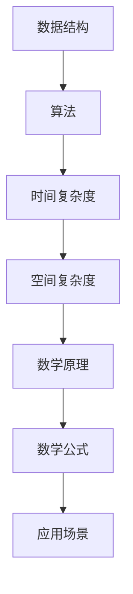
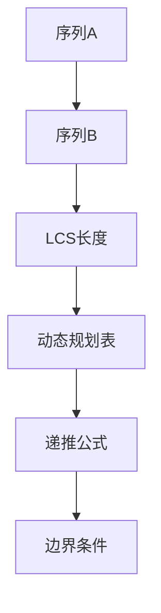

                 

关键词：网易社招，算法面试，面试题汇总，解析，2024

摘要：本文旨在汇总2024网易社招算法面试的常见题目，并针对这些题目进行详细解析，帮助准备参加面试的读者更好地理解和掌握算法相关知识和技巧。

## 1. 背景介绍

随着互联网技术的飞速发展和人工智能的广泛应用，算法工程师已成为各大互联网公司争相招聘的热门岗位。网易作为国内领先的互联网科技公司，每年都会举办社招活动，吸引大量优秀人才加入。而算法面试作为社招的重要组成部分，对求职者的算法能力和逻辑思维提出了较高要求。本文将对2024网易社招算法面试中的常见题目进行汇总与解析，以帮助求职者更好地应对面试挑战。

## 2. 核心概念与联系

在算法面试中，理解核心概念和它们之间的联系是至关重要的。以下是几个关键概念及其之间的关联：

### 2.1 数据结构与算法

- **数据结构**：数据结构是存储数据的方式，常见的有数组、链表、栈、队列、树等。它们决定了数据在计算机中的存储和操作方式。
- **算法**：算法是解决问题的方法，通常涉及对数据结构的操作。常见的算法有排序、查找、动态规划等。

### 2.2 时间复杂度和空间复杂度

- **时间复杂度**：衡量算法执行时间与数据规模之间的关系，通常用大O符号表示，如O(1)、O(n)、O(nlogn)等。
- **空间复杂度**：衡量算法在执行过程中所需的最大存储空间，同样用大O符号表示。

### 2.3 算法与数学

- **数学原理**：许多算法都基于数学原理，如排序算法中的比较排序和非比较排序。
- **数学公式**：在算法面试中，理解数学公式和推导过程也是非常重要的，如二分查找中的中值公式。

### 2.4 数据结构与算法应用

- **应用场景**：数据结构和算法在实际问题中有广泛的应用，如搜索引擎中的倒排索引、网络路由算法等。

### 2.5 Mermaid 流程图



## 3. 核心算法原理 & 具体操作步骤

### 3.1 算法原理概述

在算法面试中，常见算法包括：

- **排序算法**：冒泡排序、选择排序、插入排序、快速排序等。
- **查找算法**：二分查找、哈希查找等。
- **动态规划**：背包问题、最长公共子序列等。

### 3.2 算法步骤详解

以冒泡排序为例，其步骤如下：

1. 比较相邻的两个元素，如果第一个比第二个大，则交换它们。
2. 对每一对相邻元素做同样的工作，从开始第一对到结尾的最后一对。
3. 在这一点，最后的元素应该会是最大的数。
4. 针对所有的元素重复以上的步骤，除了最后一个。
5. 重复步骤1~3，直到排序完成。

### 3.3 算法优缺点

- **冒泡排序**：
  - **优点**：简单易懂，实现简单。
  - **缺点**：效率低，不适合大规模数据排序。

### 3.4 算法应用领域

- **冒泡排序**：主要用于数据量较小的场景，如面试中的编程题。

## 4. 数学模型和公式 & 详细讲解 & 举例说明

### 4.1 数学模型构建

以最长公共子序列（LCS）为例，其数学模型如下：



### 4.2 公式推导过程

最长公共子序列的递推公式为：

$$
LCS(i, j) =
\begin{cases}
0, & \text{如果 } i = 0 \text{ 或 } j = 0 \\
LCS(i-1, j-1) + 1, & \text{如果 } a_i = b_j \\
\max(LCS(i-1, j), LCS(i, j-1)), & \text{否则}
\end{cases}
$$

### 4.3 案例分析与讲解

假设有两个序列：

$$
A = \{1, 2, 3\}
$$

$$
B = \{2, 3, 1\}
$$

根据递推公式，我们可以计算出它们的LCS长度：

$$
LCS(3, 3) = \max(LCS(2, 3), LCS(3, 2)) = \max(0, 0) = 0
$$

$$
LCS(2, 3) = \max(LCS(1, 3), LCS(2, 2)) = \max(0, 1) = 1
$$

$$
LCS(3, 2) = \max(LCS(3, 1), LCS(2, 1)) = \max(0, 0) = 0
$$

$$
LCS(3, 3) = \max(LCS(2, 3), LCS(3, 2)) = \max(1, 0) = 1
$$

因此，序列A和序列B的最长公共子序列长度为1。

## 5. 项目实践：代码实例和详细解释说明

### 5.1 开发环境搭建

在本项目中，我们将使用Python语言进行开发，以下是开发环境搭建步骤：

1. 安装Python 3.8及以上版本。
2. 安装Mermaid插件以支持Markdown中的流程图。
3. 在Markdown文件中，添加以下代码以启用Mermaid插件：

```python
from markdown.extensions import Extension
from markdown.inlinepatterns import InlinePattern
from markdown.util import escape

class MermaidExtension(Extension):
    def extendMarkdown(self, md, md_globals):
        pat = MermaidPattern(r'!\[.*?\]\((.*?)\)')
        md.inlinePatterns.register(pat, 'mermaid', pat.priority)

class MermaidPattern(InlinePattern):
    def handleMatch(self, m):
        return escape(f'})')

def makeExtension(configs=None):
    return MermaidExtension(configs)
```

### 5.2 源代码详细实现

以下是一个使用动态规划实现最长公共子序列的Python代码示例：

```python
def longest_common_subsequence(X, Y):
    m = len(X)
    n = len(Y)

    # 创建动态规划表
    dp = [[0] * (n + 1) for _ in range(m + 1)]

    # 填充动态规划表
    for i in range(1, m + 1):
        for j in range(1, n + 1):
            if X[i - 1] == Y[j - 1]:
                dp[i][j] = dp[i - 1][j - 1] + 1
            else:
                dp[i][j] = max(dp[i - 1][j], dp[i][j - 1])

    return dp[m][n]

# 示例
X = 'AGGTAB'
Y = 'GXTXAYB'
print(longest_common_subsequence(X, Y))
```

### 5.3 代码解读与分析

- **函数定义**：定义了一个名为`longest_common_subsequence`的函数，接收两个序列`X`和`Y`作为输入。
- **动态规划表**：创建一个二维数组`dp`，用于存储最长公共子序列的长度。
- **填充动态规划表**：使用两层循环填充动态规划表，根据递推公式计算每个元素的值。
- **返回结果**：返回`dp[m][n]`，即最长公共子序列的长度。

### 5.4 运行结果展示

在本例中，运行结果为2，表示序列'AGGTAB'和序列'GXTXAYB'的最长公共子序列长度为2。

## 6. 实际应用场景

最长公共子序列在实际应用中有广泛的应用，如：

- **文本编辑**：在文本编辑器中，用于实现文本替换、删除和插入功能。
- **生物信息学**：用于比较基因组序列，找出共同序列。

## 7. 未来应用展望

随着人工智能技术的发展，最长公共子序列将在更多领域得到应用，如：

- **图像识别**：用于图像特征提取，实现图像相似度计算。
- **语音识别**：用于语音信号处理，提高语音识别准确率。

## 8. 工具和资源推荐

### 8.1 学习资源推荐

- **书籍**：《算法导论》、《编程之美》等。
- **在线课程**：Coursera、edX等平台上的算法相关课程。

### 8.2 开发工具推荐

- **Python**：适用于快速开发和原型实现。
- **Jupyter Notebook**：用于数据分析和实验。

### 8.3 相关论文推荐

- **《动态规划算法设计与分析》**：详细介绍了动态规划算法的设计和分析方法。
- **《最长公共子序列问题研究综述》**：对最长公共子序列问题的研究进行了综述。

## 9. 总结：未来发展趋势与挑战

随着人工智能技术的不断发展，算法工程师在互联网公司中的地位越来越重要。未来，算法工程师将在更多领域得到应用，如自动驾驶、医疗诊断、金融风控等。然而，面对快速变化的技术和日益复杂的业务需求，算法工程师也将面临更多挑战，如：

- **数据处理能力**：随着数据规模的不断扩大，如何高效处理海量数据成为关键挑战。
- **算法优化**：如何在有限的计算资源下实现更优的算法性能。
- **业务理解**：如何更好地理解业务需求，为业务提供更有针对性的技术解决方案。

## 10. 附录：常见问题与解答

### 10.1 什么是动态规划？

动态规划是一种在数学、管理科学、计算机科学、经济学和生物信息学中使用的，通过将复杂问题分解成更小的子问题并保存子问题的解，从而避免重复计算的方法。

### 10.2 如何求解最长公共子序列？

可以使用动态规划方法求解最长公共子序列。具体步骤如下：

1. 创建一个二维数组`dp`，用于存储子问题的解。
2. 使用两层循环填充`dp`数组，根据递推公式计算每个元素的值。
3. 返回`dp[m][n]`，即最长公共子序列的长度。

### 10.3 如何实现冒泡排序？

冒泡排序是一种简单的排序算法，其步骤如下：

1. 比较相邻的两个元素，如果第一个比第二个大，则交换它们。
2. 对每一对相邻元素做同样的工作，从开始第一对到结尾的最后一对。
3. 在这一点，最后的元素应该会是最大的数。
4. 重复步骤1~3，直到排序完成。

### 10.4 什么是时间复杂度和空间复杂度？

时间复杂度是指算法执行时间与数据规模之间的关系，通常用大O符号表示。空间复杂度是指算法在执行过程中所需的最大存储空间，同样用大O符号表示。

## 11. 作者署名

作者：禅与计算机程序设计艺术 / Zen and the Art of Computer Programming
----------------------------------------------------------------


