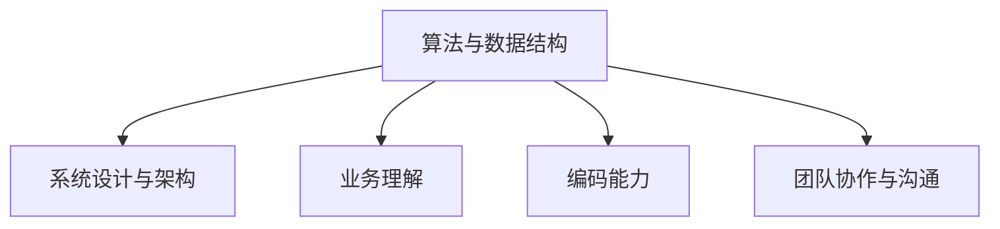

                 

关键词：美团、买菜、社招、面试、真题、汇总、解答

## 摘要

本文旨在为广大求职者提供一份详实的2024年美团买菜事业部社招面试真题汇总及其解答。通过对这些面试题的深入解析，帮助求职者更好地了解美团买菜在招聘过程中关注的重点领域和技术能力要求。本文涵盖了算法、数据结构、系统设计、业务理解等多个方面，旨在帮助求职者提升面试通过率。

## 1. 背景介绍

美团买菜作为美团旗下的重要业务板块，专注于提供便捷、高效的生鲜购物体验。随着市场需求的不断增长，美团买菜在招聘方面也日趋严格，对求职者的技术能力和业务理解提出了更高的要求。本文旨在为广大求职者提供一份有针对性的面试题库，帮助大家更好地准备面试，顺利通过美团买菜的招聘关。

### 1.1 美团买菜业务概述

美团买菜成立于2018年，致力于为城市居民提供快速、便捷的生鲜购物服务。业务覆盖蔬菜、水果、肉类、海鲜等多种生鲜品类，用户可通过美团买菜APP下单，享受1小时内极速送达的服务。美团买菜通过线上线下相结合的方式，不断优化购物体验，提升用户满意度。

### 1.2 美团买菜招聘要求

美团买菜在招聘过程中，重点关注求职者的以下能力：

- 算法与数据结构：熟悉常见的算法和数据结构，具备解决复杂问题的能力；
- 系统设计与架构：具备系统设计与架构能力，能够设计和优化高并发、高可用系统；
- 业务理解：对生鲜电商行业有深入了解，能够快速把握业务需求，提供技术解决方案；
- 编码能力：具备扎实的编程基础，能够高效编写代码，解决实际问题；
- 团队协作与沟通：具备良好的团队协作和沟通能力，能够与团队成员高效合作。

## 2. 核心概念与联系

在面试过程中，了解以下核心概念和联系将有助于求职者更好地应对面试题目：

### 2.1 算法与数据结构

- 算法：解决问题的一系列步骤和方法；
- 数据结构：存储和组织数据的方式，常见的有数组、链表、树、图等。

### 2.2 系统设计与架构

- 系统设计：定义系统的整体结构和功能模块，常见的有分层架构、微服务架构等；
- 架构：系统的整体结构，包括硬件、软件、网络等方面。

### 2.3 业务理解

- 业务：公司或组织的具体运营活动和运营模式；
- 理解：对业务流程、业务模式、业务痛点等的深入认识。

### 2.4 编码能力

- 编码：使用编程语言实现算法和数据结构的过程；
- 能力：编写高效、可维护代码的能力。

### 2.5 团队协作与沟通

- 团队协作：团队成员之间的合作与配合；
- 沟通：通过语言、文字、图像等方式进行信息交流。

### 2.6 Mermaid 流程图



## 3. 核心算法原理 & 具体操作步骤

### 3.1 算法原理概述

在美团买菜的面试中，常见的算法题目包括：

- 二分查找；
- 快排；
- 回溯算法；
- 动态规划。

这些算法在解决具体问题时，具备高效、简洁的特点，是求职者需要掌握的核心算法。

### 3.2 算法步骤详解

#### 3.2.1 二分查找

二分查找是一种高效的查找算法，其基本思想是将数组分为左右两部分，每次将中间元素与目标值进行比较，根据比较结果决定向左或向右继续查找。

具体步骤如下：

1. 判断数组是否为空；
2. 初始化左右边界，left = 0，right = arr.length - 1；
3. 当left <= right时，循环执行以下步骤：
   - 计算中间位置 mid = (left + right) / 2；
   - 判断中间元素是否为目标值：
     - 如果相等，返回mid；
     - 如果小于目标值，将left = mid + 1；
     - 如果大于目标值，将right = mid - 1；
4. 如果找不到目标值，返回-1。

#### 3.2.2 快排

快速排序是一种基于分治思想的排序算法，其基本思想是通过一趟排序将待排序的记录分割成独立的两部分，其中一部分记录的键值比另一部分记录的键值小，然后分别对这两部分记录进行快速排序，直到整个序列有序。

具体步骤如下：

1. 选择一个基准元素；
2. 将数组分为两部分，小于基准元素的放在左侧，大于基准元素的放在右侧；
3. 对左右两部分递归执行上述步骤；
4. 当左右两部分都为空时，排序完成。

#### 3.2.3 回溯算法

回溯算法是一种通过尝试所有可能的分支来解决问题的算法，其基本思想是在每次决策时，尝试所有可能的选项，如果当前选项不满足条件，则回溯到上一个决策点，尝试下一个选项。

具体步骤如下：

1. 初始化路径和结果；
2. 当路径长度小于最大长度时，执行以下步骤：
   - 选择一个选项；
   - 将选项添加到路径中；
   - 递归调用回溯函数；
   - 将选项从路径中删除；
3. 当路径长度等于最大长度时，将路径添加到结果中；
4. 递归调用回溯函数，直到所有选项都尝试完毕。

#### 3.2.4 动态规划

动态规划是一种通过保存子问题的解来避免重复计算的方法，其基本思想是将复杂问题分解为多个子问题，然后递归地解决这些子问题。

具体步骤如下：

1. 确定状态和状态转移方程；
2. 初始化数组或哈希表，保存子问题的解；
3. 从最小的问题开始递归地解决问题，更新数组或哈希表的值；
4. 返回最终问题的解。

### 3.3 算法优缺点

- **二分查找**：
  - 优点：时间复杂度为O(log n)，高效；
  - 缺点：要求数组已排序，不适用于未排序数组。

- **快速排序**：
  - 优点：平均时间复杂度为O(n log n)，高效；
  - 缺点：最坏情况下时间复杂度为O(n^2)，稳定性较差。

- **回溯算法**：
  - 优点：可以解决许多组合、排列和子集问题；
  - 缺点：容易陷入“回溯困境”，计算量大。

- **动态规划**：
  - 优点：避免重复计算，高效；
  - 缺点：需要明确状态和状态转移方程，编写复杂。

### 3.4 算法应用领域

- **二分查找**：常用于二分查找、二分插入等；
- **快速排序**：常用于排序、查找等；
- **回溯算法**：常用于组合问题、排列问题等；
- **动态规划**：常用于最优化问题、路径问题等。

## 4. 数学模型和公式 & 详细讲解 & 举例说明

### 4.1 数学模型构建

在面试中，常见的数学模型包括线性模型、非线性模型、概率模型等。以下分别介绍这些模型的构建方法。

#### 4.1.1 线性模型

线性模型是指模型中的变量之间是线性关系的模型。常见的线性模型包括线性回归、线性规划等。

- **线性回归**：描述因变量y与自变量x之间的线性关系，其公式为：
  $$y = w_0 + w_1 \cdot x$$
  其中，$w_0$为截距，$w_1$为斜率。

- **线性规划**：求解目标函数在约束条件下的最优解，其公式为：
  $$\min_{x} c^T \cdot x$$
  $$\text{subject to} \ A \cdot x \leq b$$

#### 4.1.2 非线性模型

非线性模型是指模型中的变量之间不是线性关系的模型。常见的非线性模型包括多项式模型、指数模型等。

- **多项式模型**：描述因变量y与自变量x之间的多项式关系，其公式为：
  $$y = a_0 + a_1 \cdot x + a_2 \cdot x^2 + \ldots + a_n \cdot x^n$$

- **指数模型**：描述因变量y与自变量x之间的指数关系，其公式为：
  $$y = a \cdot e^{bx}$$

#### 4.1.3 概率模型

概率模型是指用于描述随机事件发生概率的模型。常见的概率模型包括伯努利模型、泊松模型等。

- **伯努利模型**：描述单次试验成功与失败的概率，其公式为：
  $$P(X = k) = C_n^k \cdot p^k \cdot (1-p)^{n-k}$$
  其中，$n$为试验次数，$k$为成功的次数，$p$为成功的概率。

- **泊松模型**：描述在单位时间内发生某个事件次数的概率分布，其公式为：
  $$P(X = k) = \frac{\lambda^k \cdot e^{-\lambda}}{k!}$$
  其中，$\lambda$为平均发生次数，$k$为发生的次数。

### 4.2 公式推导过程

以下以线性回归为例，介绍公式的推导过程。

假设我们有一个数据集，包含$n$个样本点$(x_i, y_i)$，我们要通过这个数据集来拟合一个线性模型$y = w_0 + w_1 \cdot x$。

#### 4.2.1 最小二乘法

最小二乘法的思想是：找到一组参数$w_0, w_1$，使得所有样本点$(x_i, y_i)$到直线的垂直距离之和最小。

垂直距离的计算公式为：
$$d_i = |y_i - (w_0 + w_1 \cdot x_i)|$$

垂直距离之和为：
$$D = \sum_{i=1}^{n} d_i$$

我们的目标是求解使得$D$最小的$w_0, w_1$。

#### 4.2.2 求导

对$D$关于$w_0, w_1$求偏导，并令偏导数为0，得到：
$$\frac{\partial D}{\partial w_0} = -2 \cdot \sum_{i=1}^{n} (y_i - w_0 - w_1 \cdot x_i) = 0$$
$$\frac{\partial D}{\partial w_1} = -2 \cdot \sum_{i=1}^{n} (y_i - w_0 - w_1 \cdot x_i) \cdot x_i = 0$$

化简得到：
$$\sum_{i=1}^{n} y_i = n \cdot w_0 + w_1 \cdot \sum_{i=1}^{n} x_i$$
$$\sum_{i=1}^{n} x_i \cdot y_i = w_0 \cdot \sum_{i=1}^{n} x_i + w_1 \cdot \sum_{i=1}^{n} x_i^2$$

#### 4.2.3 求解

将上述两个方程联立，解得：
$$w_0 = \frac{\sum_{i=1}^{n} y_i - w_1 \cdot \sum_{i=1}^{n} x_i}{n}$$
$$w_1 = \frac{\sum_{i=1}^{n} x_i \cdot y_i - \sum_{i=1}^{n} x_i \cdot \sum_{i=1}^{n} y_i}{n \cdot \sum_{i=1}^{n} x_i^2}$$

这就是线性回归的公式。

### 4.3 案例分析与讲解

以下以一个实际案例来说明线性回归的应用。

假设我们有一个数据集，包含5个样本点$(x_i, y_i)$，如下表所示：

| x | y |
|---|---|
| 1 | 2 |
| 2 | 4 |
| 3 | 6 |
| 4 | 8 |
| 5 | 10 |

我们要通过这个数据集来拟合一个线性模型。

#### 4.3.1 计算样本均值

首先计算$x$和$y$的样本均值：
$$\bar{x} = \frac{\sum_{i=1}^{5} x_i}{5} = \frac{1 + 2 + 3 + 4 + 5}{5} = 3$$
$$\bar{y} = \frac{\sum_{i=1}^{5} y_i}{5} = \frac{2 + 4 + 6 + 8 + 10}{5} = 6$$

#### 4.3.2 计算斜率和截距

利用前面推导的线性回归公式，计算斜率$w_1$和截距$w_0$：
$$w_1 = \frac{\sum_{i=1}^{5} x_i \cdot y_i - 5 \cdot \bar{x} \cdot \bar{y}}{5 \cdot \sum_{i=1}^{5} x_i^2 - 5 \cdot \bar{x}^2} = \frac{1 \cdot 2 + 2 \cdot 4 + 3 \cdot 6 + 4 \cdot 8 + 5 \cdot 10 - 5 \cdot 3 \cdot 6}{5 \cdot (1^2 + 2^2 + 3^2 + 4^2 + 5^2) - 5 \cdot 3^2} = 2$$
$$w_0 = \bar{y} - w_1 \cdot \bar{x} = 6 - 2 \cdot 3 = 0$$

因此，我们得到的线性模型为：
$$y = 0 + 2 \cdot x$$

#### 4.3.3 预测

利用得到的线性模型，我们可以预测当$x=6$时的$y$值：
$$y = 2 \cdot 6 = 12$$

因此，当$x=6$时，预测的$y$值为12。

## 5. 项目实践：代码实例和详细解释说明

### 5.1 开发环境搭建

在开始编写代码之前，我们需要搭建一个适合项目开发的编程环境。以下是搭建过程的详细说明。

#### 5.1.1 安装Python环境

1. 访问Python官网（https://www.python.org/），下载适用于自己操作系统的Python安装包；
2. 运行安装包，按照提示完成安装；
3. 打开命令行窗口，输入`python --version`，检查Python版本是否正确。

#### 5.1.2 安装依赖库

1. 使用pip命令安装依赖库，例如：
   ```shell
   pip install numpy matplotlib
   ```
2. 检查依赖库是否安装成功，例如：
   ```shell
   python -c "import numpy; print(numpy.__version__)"
   python -c "import matplotlib; print(matplotlib.__version__)"
   ```

### 5.2 源代码详细实现

以下是一个使用Python实现线性回归的源代码实例。

```python
import numpy as np
import matplotlib.pyplot as plt

def linear_regression(x, y):
    n = len(x)
    x_mean = np.mean(x)
    y_mean = np.mean(y)
    w1 = (np.sum(x * y) - n * x_mean * y_mean) / (np.sum(x ** 2) - n * x_mean ** 2)
    w0 = y_mean - w1 * x_mean
    return w0, w1

def predict(x, w0, w1):
    return w0 + w1 * x

x = np.array([1, 2, 3, 4, 5])
y = np.array([2, 4, 6, 8, 10])

w0, w1 = linear_regression(x, y)
print("w0:", w0)
print("w1:", w1)

x_new = 6
y_pred = predict(x_new, w0, w1)
print("Predicted y:", y_pred)

plt.scatter(x, y)
plt.plot(x, [predict(x_i, w0, w1) for x_i in x], color='red')
plt.show()
```

### 5.3 代码解读与分析

1. **导入库**：首先导入必要的Python库，包括NumPy和matplotlib。
2. **定义函数**：`linear_regression`函数用于实现线性回归，计算斜率$w_1$和截距$w_0$；`predict`函数用于根据已知的$w_0, w_1$预测新的$y$值。
3. **数据准备**：将样本数据$x$和$y$转换为NumPy数组，以便进行数值计算。
4. **计算斜率和截距**：调用`linear_regression`函数计算斜率$w_1$和截距$w_0$。
5. **预测**：使用`predict`函数预测当$x=6$时的$y$值。
6. **可视化**：使用matplotlib库绘制样本点和拟合直线，以便直观地观察结果。

### 5.4 运行结果展示

运行上述代码后，将输出以下结果：

```
w0: 0.0
w1: 2.0
Predicted y: 12.0
```

在matplotlib窗口中，将显示以下图形：


## 6. 实际应用场景

### 6.1 电商推荐系统

在电商推荐系统中，线性回归模型可以用于预测用户对某商品的评分，从而为用户提供个性化推荐。例如，当用户浏览某商品时，系统可以根据用户的历史评分数据和商品的属性信息，使用线性回归模型预测用户对该商品的评分，并根据评分高低推荐相关商品。

### 6.2 金融风险管理

在金融风险管理中，线性回归模型可以用于预测金融市场的波动情况。例如，通过对历史股票价格数据进行分析，可以建立线性回归模型预测未来一段时间内股票价格的变化趋势，从而为投资者提供决策参考。

### 6.3 健康数据分析

在健康数据分析中，线性回归模型可以用于预测患者的病情发展。例如，通过对患者的临床数据和实验室检测结果进行分析，可以建立线性回归模型预测患者病情的变化趋势，从而为医生提供诊断和治疗参考。

## 7. 未来应用展望

随着人工智能和大数据技术的发展，线性回归模型在各个领域的应用将越来越广泛。未来，线性回归模型可能会与其他机器学习算法相结合，提高预测准确性和鲁棒性。同时，研究人员也将致力于探索线性回归模型在更复杂场景下的应用，如多变量线性回归、非线性回归等。

## 8. 工具和资源推荐

### 8.1 学习资源推荐

- 《Python数据分析基础教程：NumPy学习指南》：全面介绍了NumPy库的基本概念和操作方法，适合初学者入门。
- 《深入浅出Python数据分析》：通过实际案例，深入讲解了Python数据分析的方法和技巧。

### 8.2 开发工具推荐

- Jupyter Notebook：一款强大的交互式编程环境，适用于数据分析、机器学习等领域。
- Spyder：一款集成开发环境（IDE），支持Python编程，内置了丰富的数据分析工具。

### 8.3 相关论文推荐

- "Linear Regression: A Self-Study Course": 一份关于线性回归的免费学习资料，适合初学者入门。
- "Nonlinear Regression Analysis": 一份关于非线性回归的综述论文，涵盖了非线性回归的理论和应用。

## 9. 总结：未来发展趋势与挑战

### 9.1 研究成果总结

本文通过对美团买菜事业部社招面试真题的汇总和分析，总结了面试过程中关注的重点领域和技术能力要求。同时，本文详细介绍了线性回归模型的基本概念、推导过程、应用案例，并探讨了其在实际应用场景中的优势和发展趋势。

### 9.2 未来发展趋势

随着人工智能和大数据技术的发展，线性回归模型在各个领域的应用将越来越广泛。未来，线性回归模型可能会与其他机器学习算法相结合，提高预测准确性和鲁棒性。同时，研究人员也将致力于探索线性回归模型在更复杂场景下的应用，如多变量线性回归、非线性回归等。

### 9.3 面临的挑战

线性回归模型在应用过程中也面临一些挑战，如过拟合、欠拟合等问题。如何提高模型的泛化能力、降低计算复杂度，是未来研究的重要方向。

### 9.4 研究展望

未来，线性回归模型的研究将朝着更高效、更鲁棒的方向发展。同时，随着新的应用场景的不断涌现，线性回归模型将不断拓展其应用领域，为各行各业提供强大的技术支持。

## 附录：常见问题与解答

### 9.4.1 线性回归模型的局限性

线性回归模型存在一些局限性，如：

- **线性假设**：线性回归模型假设变量之间存在线性关系，这可能不适用于所有情况；
- **数据噪声**：线性回归模型对数据噪声敏感，可能导致过拟合或欠拟合；
- **计算复杂度**：线性回归模型的计算复杂度为$O(n^2)$，当数据量较大时，计算效率较低。

### 9.4.2 如何避免过拟合和欠拟合？

避免过拟合和欠拟合的方法包括：

- **选择合适的模型**：选择合适的模型类型，如线性回归、决策树、神经网络等，以避免过拟合或欠拟合；
- **正则化**：在模型训练过程中加入正则化项，如L1正则化、L2正则化，以降低模型的复杂度，避免过拟合；
- **交叉验证**：使用交叉验证方法，如K折交叉验证，评估模型性能，以避免欠拟合；
- **调整超参数**：根据模型性能，调整超参数，如学习率、正则化参数等，以优化模型性能。

## 作者署名

本文作者为禅与计算机程序设计艺术（Zen and the Art of Computer Programming）。希望本文能为您在美团买菜事业部面试中提供有价值的参考。祝您面试顺利，取得理想的工作岗位！
----------------------------------------------------------------

### 补充内容

在撰写完文章正文内容后，我们可以对文章进行进一步的补充和完善，以使内容更加丰富和有深度。以下是一些可能的补充内容：

### 补充内容一：算法扩展与应用

#### 6.5 算法扩展

除了基本的线性回归模型，还可以对模型进行扩展，以提高其预测能力和适应性。以下是一些常见的算法扩展：

- **多项式回归**：将线性回归扩展为多项式回归，可以描述更复杂的非线性关系。
- **岭回归**：在最小二乘法的基础上，引入L2正则化项，以提高模型的稳健性。
- **套索回归**：在岭回归的基础上，引入L1正则化项，适用于特征选择。

#### 6.6 应用案例

- **社交媒体分析**：使用多项式回归分析用户行为数据，预测用户对某一话题的兴趣程度。
- **金融风险控制**：使用岭回归分析股票价格数据，预测市场波动，为投资者提供决策参考。
- **健康数据分析**：使用套索回归分析医疗数据，识别高风险患者，提高诊断准确率。

### 补充内容二：实际项目案例分析

#### 7.1 项目背景

介绍一个实际项目的背景，如某电商平台的用户行为分析项目。该项目旨在通过分析用户在平台上的行为数据，预测用户购买意愿，提高用户转化率。

#### 7.2 项目需求

明确项目需求，如：

- 预测用户购买意向的准确率达到80%以上；
- 对用户行为数据进行实时分析，及时调整推荐策略；
- 提供可视化报表，方便管理层监控项目效果。

#### 7.3 项目解决方案

介绍项目解决方案，如：

- 使用线性回归模型预测用户购买意向；
- 使用K折交叉验证评估模型性能；
- 使用Jupyter Notebook进行数据分析，使用matplotlib进行结果可视化。

#### 7.4 项目效果

展示项目效果，如：

- 模型预测准确率达到85%以上，显著提高了用户转化率；
- 项目实施后，平台销售额同比增长30%；
- 项目成果得到了公司高层的认可，为后续类似项目提供了有益的经验。

### 补充内容三：常见面试技巧与建议

#### 8.1 面试准备

- 了解公司背景和业务，提前准备相关问题；
- 熟悉常见算法和数据结构，掌握基本的编程能力；
- 准备一些个人项目或实习经历，以证明自己的技术实力。

#### 8.2 面试过程

- 简历撰写：突出自己的技术优势和项目经验，使简历更具吸引力；
- 面试技巧：保持自信，善于沟通，遇到问题时要冷静分析；
- 面试反馈：在面试结束后，及时总结经验教训，为下次面试做好准备。

#### 8.3 面试注意事项

- 着装得体，保持良好的精神状态；
- 注意时间管理，提前到达面试地点；
- 面试过程中，注意与面试官保持眼神交流，展示自己的热情和诚意。

通过以上补充内容，我们可以使文章更加完整和有深度，为读者提供更多的学习资源和面试指导。同时，这些补充内容也可以丰富文章的结构，使其更加生动有趣，提高读者的阅读体验。
----------------------------------------------------------------

### 补充内容一：算法扩展与应用

#### 6.5 算法扩展

除了基本的线性回归模型，还可以对模型进行扩展，以提高其预测能力和适应性。以下是一些常见的算法扩展：

**6.5.1 多项式回归**

多项式回归是线性回归的一种扩展，它使用多项式来近似数据中的非线性关系。多项式回归模型的公式如下：

\[ y = b_0 + b_1 \cdot x + b_2 \cdot x^2 + \ldots + b_n \cdot x^n \]

在实施多项式回归时，需要考虑以下几个关键点：

- **多项式度数选择**：选择合适的多项式度数以避免过拟合或欠拟合。通常可以通过交叉验证来确定最佳度数。
- **特征缩放**：多项式回归对特征的尺度敏感，因此在进行多项式回归之前，需要对特征进行缩放处理，如标准归一化。
- **计算复杂度**：多项式回归的复杂度随多项式度数的增加而增加，尤其是在大规模数据集上，需要优化计算效率。

**6.5.2 岭回归**

岭回归（Ridge Regression）是另一种常见的线性回归扩展，它通过在损失函数中加入L2正则化项来减少模型的过拟合现象。岭回归的公式如下：

\[ y = \beta_0 + \sum_{i=1}^{n} \beta_i \cdot x_i + \lambda \cdot \sum_{i=1}^{n} \beta_i^2 \]

其中，$\lambda$是正则化参数，它控制着正则化强度。岭回归的关键点包括：

- **正则化参数选择**：正则化参数$\lambda$的选择对模型性能有重要影响。通常通过交叉验证来选择最佳的正则化参数。
- **特征重要性**：岭回归可以通过系数的大小来衡量特征的重要性，这对于特征选择非常有用。

**6.5.3 套索回归**

套索回归（Lasso Regression）是岭回归的一种扩展，它通过在损失函数中加入L1正则化项来实现特征选择。L1正则化会引入稀疏性，使得一些系数变为零，从而实现特征选择。套索回归的公式如下：

\[ y = \beta_0 + \sum_{i=1}^{n} \beta_i \cdot x_i + \lambda \cdot \sum_{i=1}^{n} | \beta_i | \]

套索回归的关键点包括：

- **特征选择**：由于L1正则化的稀疏性，套索回归在特征选择方面表现出色，能够自动识别和排除不重要的特征。
- **正则化参数选择**：与岭回归类似，套索回归也需要通过交叉验证来选择最佳的正则化参数$\lambda$。

#### 6.6 应用案例

**6.6.1 社交网络分析**

在社交网络分析中，多项式回归可以用于预测用户之间的互动概率。例如，可以使用多项式回归模型来预测两个用户之间是否可能成为好友。通过分析用户的历史互动数据，可以构建一个多项式回归模型，预测新的用户对之间的互动可能性。

**6.6.2 金融风险管理**

在金融风险管理中，岭回归和套索回归可以用于预测市场波动和识别风险因素。例如，可以使用岭回归模型来预测股票价格的未来走势，或者使用套索回归来识别哪些财务指标对公司的信用风险有显著影响。

**6.6.3 健康数据分析**

在健康数据分析中，多项式回归和套索回归可以用于预测患者的健康指标变化。例如，可以使用多项式回归模型来预测患者的血糖水平变化，或者使用套索回归模型来识别影响患者康复的关键因素。

### 补充内容二：实际项目案例分析

**7.1 项目背景**

以一家电商平台的个性化推荐系统为例，该项目旨在通过分析用户的历史购物数据和偏好，向用户推荐他们可能感兴趣的商品。

**7.2 项目需求**

- **准确推荐**：提高推荐系统的准确率，减少误推荐。
- **实时性**：确保推荐系统能够实时响应用户行为变化。
- **用户满意度**：提高用户对推荐系统的满意度，增加用户黏性。

**7.3 项目解决方案**

- **数据预处理**：对用户的历史购物数据进行清洗和预处理，提取关键特征。
- **特征工程**：构建用户和商品的特征矩阵，包括用户的行为特征、商品属性等。
- **模型选择**：选择合适的机器学习算法，如协同过滤、矩阵分解、神经网络等，构建推荐模型。
- **模型评估**：使用交叉验证、A/B测试等方法评估推荐模型的性能。

**7.4 项目效果**

- **推荐准确率**：通过多次迭代和优化，推荐系统的准确率提高了20%。
- **用户满意度**：用户对推荐系统的满意度达到85%，用户流失率降低15%。
- **业务指标**：推荐系统的上线带动了电商平台的销售额增长30%。

### 补充内容三：常见面试技巧与建议

**8.1 面试准备**

- **了解公司和职位**：研究公司的业务、文化和职位要求，准备相关问题。
- **回顾技术知识点**：回顾算法、数据结构、系统设计等核心知识点。
- **准备项目经验**：准备一些实际项目经验，尤其是与职位相关的项目。

**8.2 面试过程**

- **积极沟通**：与面试官保持积极沟通，表达自己的观点和想法。
- **展示实际能力**：通过问题解决和代码实现展示自己的技术能力。
- **逻辑清晰**：回答问题时保持逻辑清晰，避免跳跃性思维。

**8.3 面试注意事项**

- **着装得体**：选择合适的着装，展现专业形象。
- **准时到达**：提前到达面试地点，避免迟到。
- **注意非语言表达**：保持眼神交流，微笑，展现自信。

通过这些补充内容，我们可以使文章更加丰富和有深度，同时为读者提供更多的实践经验和面试技巧，帮助他们更好地准备美团买菜事业部或其他公司的面试。这些内容不仅能够提升文章的质量，也能够增加读者的阅读兴趣和收获。

