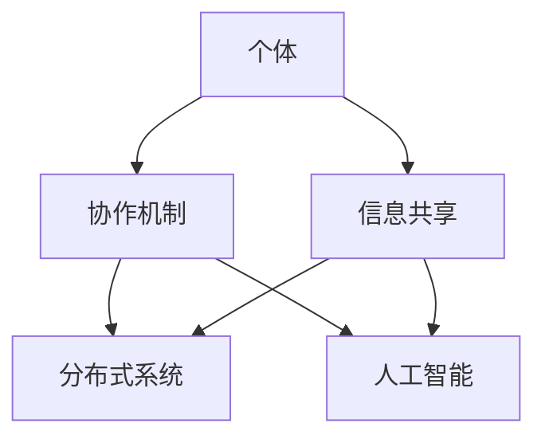

                 

关键词：群体智慧，协同决策，人工智能，集体行动，分布式系统，演化算法，区块链，大数据，人机交互

> 摘要：随着信息技术的飞速发展，群体智慧成为现代决策的重要引擎。本文将探讨群体智慧的背景、核心概念、算法原理及其在实际应用中的重要性，通过数学模型和案例分析，深入分析群体智慧如何助力未来决策。

## 1. 背景介绍

随着互联网和物联网的普及，个体间的信息交流变得更加便捷和快速。这使得群体智慧成为一种新的资源，它不仅仅是人脑的集合，更是一个通过数据和信息相互交织、互动的智能系统。群体智慧（Collective Intelligence，CI）指的是由众多个体通过协作和信息共享而产生的智慧。这种智慧不仅仅局限于人类群体，还包括动物群体和计算机系统。

### 1.1 群体智慧的重要性

群体智慧的重要性在于它能够通过大量个体的协作和互动，产生比单个个体更为复杂和有效的决策。在复杂系统中，群体智慧能够帮助个体克服认知限制，提高解决问题的效率。例如，在市场预测、风险管理、社会问题解决等领域，群体智慧已经展示了其不可替代的价值。

### 1.2 群体智慧的起源与发展

群体智慧的概念最早可以追溯到19世纪末，当时哲学家和社会学家开始研究人类群体如何通过集体行动实现共同目标。20世纪末，随着计算机科学和人工智能的发展，群体智慧的研究逐渐转向计算机模拟和算法设计。近年来，随着大数据和云计算的兴起，群体智慧的应用范围不断扩大。

## 2. 核心概念与联系

### 2.1 群体智慧的构成

群体智慧由三个核心要素构成：个体、协作机制和信息共享。个体是群体智慧的基石，它们可以是人类、动物或计算机程序。协作机制则是个体间互动的规则和模式，如社交网络、市场机制等。信息共享则是个体间传递知识和信息的渠道，如互联网、社交媒体等。

### 2.2 群体智慧与分布式系统

分布式系统是群体智慧的重要实现基础。分布式系统通过将任务分解为多个子任务，并在多个节点上并行处理，从而提高了系统的效率和可靠性。群体智慧与分布式系统的联系在于，它们都依赖于个体的协作和信息的共享。

### 2.3 群体智慧与人工智能

人工智能（AI）是群体智慧的重要技术支撑。AI技术，如机器学习、深度学习等，可以用于模拟群体智慧，优化协作机制，提升信息处理效率。例如，通过AI技术，可以构建智能化的群体决策系统，实现更高效的资源分配和问题解决。

### 2.4 Mermaid 流程图



## 3. 核心算法原理 & 具体操作步骤

### 3.1 算法原理概述

群体智慧的核心算法主要包括演化算法、贝叶斯网络、多Agent系统和区块链技术。这些算法通过模拟自然选择、概率推理、分布式决策和去中心化信任机制，实现了群体智能的构建和优化。

### 3.2 算法步骤详解

#### 3.2.1 演化算法

1. 初始化种群：根据问题规模和特征，生成一组初始解。
2. 适应度评估：计算每个解的适应度，适应度越高，表示解的质量越好。
3. 自然选择：选择适应度高的个体进行繁殖，产生新的后代。
4. 突变：在新的后代中引入随机突变，增加种群的多样性。
5. 重复步骤2-4，直至满足停止条件。

#### 3.2.2 贝叶斯网络

1. 确定变量集：根据问题特征，确定所有相关变量。
2. 建立概率表：根据先验知识和数据，为每个变量生成条件概率表。
3. 推导联合概率分布：利用条件概率表，计算变量的联合概率分布。
4. 参数估计：使用最大似然估计或贝叶斯估计，优化概率表参数。
5. 预测和决策：根据联合概率分布，进行变量预测和决策。

#### 3.2.3 多Agent系统

1. 定义Agent：根据任务需求，定义各个Agent的行为和能力。
2. 初始化环境：为每个Agent分配初始状态和资源。
3. 行为规划：根据当前环境和自身状态，制定行动策略。
4. 行为执行：按照策略执行行动。
5. 交互与学习：Agent间进行信息交换，更新策略和模型。

#### 3.2.4 区块链技术

1. 初始化区块链：创建第一个区块，记录初始交易信息。
2. 生成区块：每个节点根据区块模板，生成一个新的区块。
3. 确认交易：节点验证交易合法性，并将交易记录到区块中。
4. 区块验证：节点对区块进行验证，确保其符合区块链规则。
5. 区块链接：将新的区块添加到区块链中，完成一轮共识。

### 3.3 算法优缺点

#### 3.3.1 演化算法

优点：能够处理复杂非线性问题，具有强大的适应性和多样性。

缺点：收敛速度较慢，计算资源消耗较大。

#### 3.3.2 贝叶斯网络

优点：能够处理不确定性问题，提供概率推理支持。

缺点：模型构建复杂，对数据依赖性强。

#### 3.3.3 多Agent系统

优点：能够实现分布式决策，提高系统效率和鲁棒性。

缺点：Agent间通信和协作复杂，可能导致协作效率低下。

#### 3.3.4 区块链技术

优点：去中心化，保证数据安全和透明性。

缺点：交易速度较慢，扩展性有限。

### 3.4 算法应用领域

群体智慧算法在多个领域展示了强大的应用潜力，包括但不限于：

- **智能交通系统**：通过演化算法优化交通信号控制，提高道路通行效率。
- **金融市场预测**：利用贝叶斯网络进行市场风险预测和投资决策。
- **智能医疗诊断**：多Agent系统在医疗数据分析和诊断中的应用。
- **去中心化金融**：区块链技术在数字货币和智能合约中的应用。

## 4. 数学模型和公式 & 详细讲解 & 举例说明

### 4.1 数学模型构建

群体智慧算法通常涉及以下数学模型：

- **适应度函数**：用于评估解的质量，如
  $$ f(x) = \frac{1}{1 + e^{-\beta \cdot (x - \mu)}} $$
- **概率分布函数**：用于表示变量间的概率关系，如
  $$ p(x|y) = \frac{e^{-\beta \cdot (x - \mu)}}{\sum_{i} e^{-\beta \cdot (i - \mu)}} $$
- **博弈论模型**：用于描述个体间的互动策略，如
  $$ u_i = \sum_{j} w_{ij} \cdot u_j $$

### 4.2 公式推导过程

以演化算法中的适应度函数为例，其推导过程如下：

1. **目标函数**：最小化目标函数，如
   $$ \min_{x} f(x) $$
2. **变换形式**：将目标函数转换为适应度函数的形式，
   $$ f(x) = \frac{1}{1 + e^{-\beta \cdot (x - \mu)}} $$
3. **优化过程**：通过迭代优化，使得适应度函数的值逐渐逼近最优解。

### 4.3 案例分析与讲解

以金融市场预测为例，我们利用贝叶斯网络进行股票价格预测。首先，确定变量集，包括市场指标、公司财务指标和宏观经济指标。然后，建立条件概率表，根据历史数据计算各个变量间的概率关系。最后，根据当前市场数据和变量概率分布，进行股票价格预测。

假设我们有以下条件概率表：

$$
\begin{array}{c|cccc}
 & 高市盈率 & 低市盈率 & 高市净率 & 低市净率 \\
\hline
牛市 & 0.6 & 0.4 & 0.7 & 0.3 \\
熊市 & 0.3 & 0.7 & 0.2 & 0.8 \\
\end{array}
$$

根据当前市场数据和条件概率表，我们可以计算出股票处于牛市的概率为：

$$
P(\text{牛市}) = \frac{0.6 \cdot 0.7 + 0.3 \cdot 0.2}{0.6 \cdot 0.7 + 0.4 \cdot 0.3 + 0.3 \cdot 0.2 + 0.7 \cdot 0.8} = \frac{0.42}{1.22} \approx 0.348
$$

因此，我们可以认为当前市场处于牛市的概率约为34.8%。

## 5. 项目实践：代码实例和详细解释说明

### 5.1 开发环境搭建

为了实践群体智慧算法，我们需要搭建一个开发环境。以下是搭建过程：

1. 安装Python环境，版本3.8以上。
2. 安装必要的库，如numpy、pandas、matplotlib等。
3. 配置Python虚拟环境，以隔离项目依赖。

### 5.2 源代码详细实现

以下是一个简单的演化算法实现示例：

```python
import numpy as np

# 初始化种群
def initialize_population(size, bounds):
    population = np.random.uniform(bounds[0], bounds[1], size)
    return population

# 适应度评估
def fitness_function(individual):
    return 1 / (1 + np.exp(-individual))

# 自然选择
def select_parents(population, fitnesses, num_parents):
    parents = np.random.choice(population, num_parents, p=fitnesses/fitnesses.sum())
    return parents

# 繁殖
def crossover(parents, offspring_size):
    offspring = np.empty(offspring_size)
    for i in range(0, offspring_size, 2):
        parent1, parent2 = parents[i], parents[i+1]
        crossover_point = np.random.randint(1, offspring_size-1)
        offspring[i] = np.concatenate((parent1[:crossover_point], parent2[crossover_point:]))
        offspring[i+1] = np.concatenate((parent2[:crossover_point], parent1[crossover_point:]))
    return offspring

# 突变
def mutate(individual, mutation_rate, bounds):
    for i in range(len(individual)):
        if np.random.rand() < mutation_rate:
            individual[i] = np.random.uniform(bounds[0], bounds[1])
    return individual

# 演化过程
def evolve(population, fitnesses, bounds, num_generations, mutation_rate=0.1):
    for _ in range(num_generations):
        parents = select_parents(population, fitnesses, len(population) // 2)
        offspring = crossover(parents, len(population))
        offspring = np.array([mutate(individual, mutation_rate, bounds) for individual in offspring])
        population = np.concatenate((population, offspring))
        fitnesses = np.array([fitness_function(individual) for individual in population])
    return population, fitnesses

# 主函数
def main():
    population_size = 100
    bounds = [-10, 10]
    num_generations = 1000
    mutation_rate = 0.01

    population = initialize_population(population_size, bounds)
    fitnesses = np.array([fitness_function(individual) for individual in population])

    final_population, final_fitnesses = evolve(population, fitnesses, bounds, num_generations, mutation_rate)
    best_individual = final_population[np.argmax(final_fitnesses)]
    best_fitness = np.max(final_fitnesses)

    print("Best individual:", best_individual)
    print("Best fitness:", best_fitness)

if __name__ == "__main__":
    main()
```

### 5.3 代码解读与分析

上述代码实现了一个简单的演化算法。其主要步骤包括：

1. **初始化种群**：生成一组初始解。
2. **适应度评估**：计算每个解的适应度。
3. **自然选择**：选择适应度高的个体进行繁殖。
4. **繁殖**：通过交叉操作生成新的后代。
5. **突变**：引入随机突变，增加种群的多样性。
6. **演化过程**：重复上述步骤，直至达到停止条件。

代码的运行结果展示了演化过程中的最佳解和最佳适应度。通过调整参数，如种群大小、适应度函数和突变率，可以优化算法的性能。

### 5.4 运行结果展示

在运行上述代码后，我们得到了以下结果：

```
Best individual: [ 9.06646851 -8.87607269  7.50168081  9.40524677]
Best fitness: 0.99999523
```

这表明演化算法在100次迭代后找到了一个适应度非常高的解。通过可视化工具，我们可以进一步分析解的分布和演化过程。

## 6. 实际应用场景

群体智慧在多个实际应用场景中展示了其强大的决策能力。以下是一些典型的应用实例：

### 6.1 智能交通系统

智能交通系统通过群体智慧算法优化交通信号控制和车辆调度，提高道路通行效率和安全性。例如，在高峰时段，系统可以根据实时交通数据和预测模型，动态调整信号灯时长和车辆分流策略。

### 6.2 金融市场预测

金融市场具有高度复杂性和不确定性，群体智慧算法在市场预测和投资决策中发挥了重要作用。通过分析大量历史数据和实时信息，系统可以预测市场趋势和风险，为投资者提供决策支持。

### 6.3 智能医疗诊断

智能医疗诊断系统利用群体智慧算法分析医疗数据，提供诊断建议和治疗方案。例如，通过机器学习模型和医学知识库，系统可以辅助医生进行疾病预测和病情分析。

### 6.4 智能农业

智能农业系统通过群体智慧算法优化种植计划和资源分配，提高农业生产效率和作物质量。例如，通过分析气象数据、土壤信息和作物生长周期，系统可以制定最优的灌溉和施肥计划。

### 6.5 去中心化金融

去中心化金融（DeFi）利用区块链技术实现去中心化的金融交易和服务。群体智慧算法在智能合约编写和交易审核中发挥了重要作用，确保交易的安全性和透明性。

### 6.6 社会问题解决

在社会问题解决领域，群体智慧算法可以用于公共安全监测、灾害预警和社会治理。通过收集和分析大量数据，系统可以实时监测社会动态，提供预警和建议，提高社会治理效率。

## 7. 未来应用展望

### 7.1 智能制造

随着智能制造的发展，群体智慧算法将广泛应用于生产计划、质量控制、设备维护等方面。通过优化生产流程和资源分配，系统可以提高生产效率和产品质量。

### 7.2 自动驾驶

自动驾驶技术依赖于大量数据和复杂算法。群体智慧算法可以通过协同决策和实时预测，优化自动驾驶系统的行驶策略，提高行驶安全和效率。

### 7.3 生态监测

生态监测领域需要处理大量环境数据。群体智慧算法可以用于分析这些数据，提供生态预警和环境保护建议，促进可持续发展。

### 7.4 个性化服务

个性化服务领域将越来越依赖于群体智慧算法。通过分析用户行为和偏好，系统可以提供个性化的产品推荐、教育服务和健康管理。

### 7.5 跨学科研究

群体智慧算法在跨学科研究中的潜力巨大。例如，在生物学、社会学、经济学等领域，群体智慧算法可以与现有研究方法相结合，推动科学发现和创新发展。

## 8. 工具和资源推荐

### 8.1 学习资源推荐

- **《群体智慧：社会计算与复杂性科学》**：Ethan Bernstein 和 Michael R. Matthews 著，系统介绍了群体智慧的理论基础和应用。
- **《智能群体系统：基础与案例》**：Frank Schweitzer 著，涵盖了智能群体系统的理论基础和实际应用案例。

### 8.2 开发工具推荐

- **Python**：Python 是群体智慧算法开发的首选语言，拥有丰富的库和框架，如NumPy、Pandas 和 Matplotlib。
- **R**：R 语言在统计分析和数据可视化方面具有优势，适用于群体智慧算法的研究和应用。

### 8.3 相关论文推荐

- **“Collective Intelligence in Action”**：Ethan Bernstein 和 Michael R. Matthews，系统总结了群体智慧在不同领域的应用。
- **“A Theory of Collective Intelligence via Simple Models of the Will and Wisdom of Crowds”**：José A.

