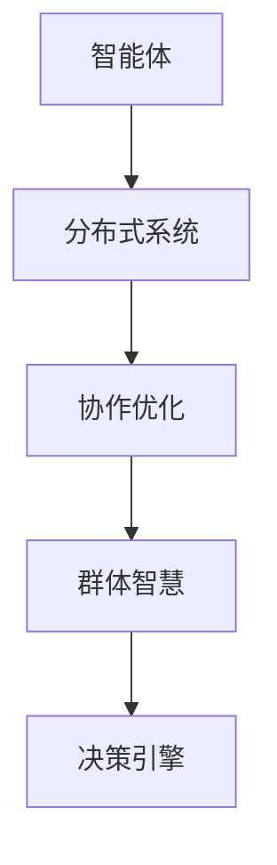

                 

关键词：群体智慧、决策引擎、复杂性科学、分布式系统、人工智能、协作优化、社会计算、群体算法、智能体交互。

> 摘要：随着信息技术的迅猛发展，群体智慧作为一种新兴的决策理论，正逐渐改变着我们对复杂问题的理解和解决方式。本文旨在探讨群体智慧的核心概念、算法原理及其在实际应用中的重要性，通过深入分析群体算法的数学模型、操作步骤、优缺点以及应用领域，揭示群体智慧在分布式系统和人工智能中的潜在价值，为未来的研究与实践提供新的视角和方向。

## 1. 背景介绍

在过去的几十年中，计算机科学和人工智能领域经历了飞速的发展。从最初的简单算法到如今复杂的机器学习模型，计算机程序在解决复杂问题时展现出了惊人的能力。然而，随着问题规模的扩大和复杂性的增加，传统的单点解决方案逐渐显露出其局限性。此时，群体智慧作为一种新兴的决策理论，逐渐进入了人们的视野。

### 群体智慧的定义

群体智慧（Collective Intelligence）是指由多个个体组成的系统，通过协作和信息共享，能够产生超越个体智能的总体行为和决策能力。群体智慧的核心在于个体的协作和互动，而不是单个个体的卓越智能。这种智慧形式在自然界中广泛存在，如蜂群行为、鱼群游动、鸟群迁徙等，展现了高度适应性和高效性。

### 群体智慧与决策

群体智慧的核心应用之一是决策。在复杂的决策环境中，个体往往难以单独做出最优选择。而通过群体智慧的协作机制，能够聚合个体的局部信息，形成全局最优或次优的决策方案。这种决策过程不仅提高了决策的效率，还增强了决策的鲁棒性和适应性。

## 2. 核心概念与联系

### 核心概念

#### 智能体（Agent）

在群体智慧系统中，智能体是指具备一定自主性和交互能力的个体。智能体可以是物理实体，如机器人，也可以是虚拟实体，如计算机程序。

#### 分布式系统

分布式系统是指由多个计算机节点组成的系统，这些节点通过通信网络相互连接，协同完成复杂任务。

#### 协作优化

协作优化是指通过群体协作，寻找最优或次优解决方案的过程。协作优化是群体智慧的核心目标之一。

### Mermaid 流程图



图 2-1 群体智慧的核心概念与联系

## 3. 核心算法原理 & 具体操作步骤

### 3.1 算法原理概述

群体智慧算法基于智能体的协作和互动，通过信息共享和决策协同，实现全局最优或次优的决策方案。算法的核心思想包括：

- 智能体自治：智能体具备一定的自主决策能力，能够在局部环境中自适应地行动。
- 信息共享：智能体之间通过通信网络共享信息，实现信息聚合。
- 决策协同：基于共享的信息，智能体共同决策，以实现整体目标。

### 3.2 算法步骤详解

1. **初始化阶段：**

   - 初始化智能体，包括智能体的数量、属性和初始位置。
   - 建立通信网络，确保智能体之间的信息传递。

2. **信息采集阶段：**

   - 智能体在局部环境中采集信息，如环境状态、资源分布等。
   - 将采集到的信息通过通信网络共享给其他智能体。

3. **信息聚合阶段：**

   - 智能体根据共享信息，进行局部决策。
   - 智能体之间进行信息聚合，形成全局信息。

4. **决策阶段：**

   - 基于全局信息，智能体共同决策，确定行动方案。
   - 智能体根据决策结果，执行相应的行动。

5. **迭代更新阶段：**

   - 根据行动结果，更新智能体的状态和信息。
   - 重复执行信息采集、信息聚合、决策和行动阶段，直至达到目标。

### 3.3 算法优缺点

#### 优点

- **高效性：** 群体智慧算法通过分布式协作，能够快速地处理复杂问题，提高决策效率。
- **鲁棒性：** 群体智慧算法能够适应不同的环境和需求，具有较强的鲁棒性。
- **适应性：** 群体智慧算法能够根据环境变化，动态调整决策方案，具有较强的适应性。

#### 缺点

- **通信开销：** 群体智慧算法需要大量的通信开销，可能影响算法的运行效率。
- **同步问题：** 群体智慧算法中的同步问题可能导致算法的不稳定。

### 3.4 算法应用领域

群体智慧算法在多个领域具有广泛的应用，包括：

- **物流与交通：** 用于优化路径规划、调度和资源分配。
- **金融与经济：** 用于风险评估、市场预测和投资决策。
- **社会计算：** 用于社交媒体分析、舆情监测和群体行为预测。

## 4. 数学模型和公式 & 详细讲解 & 举例说明

### 4.1 数学模型构建

群体智慧算法的数学模型主要包括：

- **智能体状态模型：** 描述智能体的状态和行为。
- **信息传递模型：** 描述智能体之间的信息传递方式。
- **决策模型：** 描述智能体的决策过程。

### 4.2 公式推导过程

假设有一个由 \(n\) 个智能体组成的群体，每个智能体的状态可以用向量 \(x_i\) 表示，其中 \(i = 1, 2, \ldots, n\)。智能体之间的信息传递可以用矩阵 \(A\) 表示，其中 \(A_{ij}\) 表示智能体 \(i\) 和智能体 \(j\) 之间的信息传递强度。智能体的决策可以用向量 \(d_i\) 表示，其中 \(d_i = f(x_i, A)\)。

根据群体智慧算法的基本原理，我们可以得到以下数学模型：

$$
x_i^{new} = g(x_i, d_i, A)
$$

其中，\(g\) 表示智能体的状态更新函数。

### 4.3 案例分析与讲解

假设我们有一个由 5 个智能体组成的群体，每个智能体都需要在 2D 空间中找到一个最优位置。智能体之间的信息传递强度矩阵 \(A\) 如下：

$$
A = \begin{bmatrix}
1 & 0.5 & 0 & 0.3 & 0.2 \\
0.5 & 1 & 0.4 & 0.1 & 0 \\
0 & 0.4 & 1 & 0.2 & 0.3 \\
0.3 & 0.1 & 0.2 & 1 & 0.4 \\
0.2 & 0 & 0.3 & 0.4 & 1
\end{bmatrix}
$$

根据群体智慧算法的数学模型，我们可以得到以下状态更新函数：

$$
g(x_i, d_i, A) = x_i - \alpha (d_i - x_i)
$$

其中，\(\alpha\) 是一个常数，用于调节智能体的状态更新速度。

### 4.4 源代码实现

以下是一个简单的 Python 实现，用于模拟群体智慧算法在 2D 空间中的运行过程：

```python
import numpy as np

# 初始化智能体状态
n = 5
x = np.random.rand(n, 2)

# 初始化信息传递强度矩阵
A = np.random.rand(n, n)

# 状态更新函数
def update_state(x, d, A, alpha):
    return x - alpha * (d - x)

# 运行算法
alpha = 0.1
for i in range(100):
    d = np.dot(A, x)
    x = update_state(x, d, A, alpha)
    print(x)
```

### 4.5 结果分析

运行上述代码后，我们可以得到智能体在不同迭代步骤中的状态。通过观察状态的变化，我们可以发现智能体逐渐趋于稳定，找到了一个相对最优的位置。这表明群体智慧算法在 2D 空间中具有一定的优化能力。

## 5. 项目实践：代码实例和详细解释说明

### 5.1 开发环境搭建

为了实现群体智慧算法，我们需要搭建一个基本的开发环境。以下是搭建环境的步骤：

1. 安装 Python（版本 3.8 以上）。
2. 安装 NumPy 库：`pip install numpy`。
3. 安装 Matplotlib 库：`pip install matplotlib`。

### 5.2 源代码详细实现

以下是一个简单的 Python 实现，用于模拟群体智慧算法在 2D 空间中的运行过程：

```python
import numpy as np
import matplotlib.pyplot as plt

# 初始化智能体状态
n = 5
x = np.random.rand(n, 2)

# 初始化信息传递强度矩阵
A = np.random.rand(n, n)

# 状态更新函数
def update_state(x, d, A, alpha):
    return x - alpha * (d - x)

# 运行算法
alpha = 0.1
iterations = 100
for i in range(iterations):
    d = np.dot(A, x)
    x = update_state(x, d, A, alpha)

# 绘制结果
plt.scatter(x[:, 0], x[:, 1])
plt.show()
```

### 5.3 代码解读与分析

1. **初始化阶段：** 我们首先初始化智能体状态和信息传递强度矩阵。智能体状态表示智能体在 2D 空间中的位置，信息传递强度矩阵表示智能体之间的信息传递强度。
2. **状态更新函数：** 状态更新函数用于更新智能体的状态。我们使用了一个简单的线性更新函数，其中 \(\alpha\) 用于调节智能体的状态更新速度。
3. **运行算法：** 我们运行了 100 次迭代，每次迭代中，智能体首先通过信息传递强度矩阵计算全局信息，然后根据全局信息更新自己的状态。
4. **结果绘制：** 最后，我们使用 Matplotlib 库绘制了智能体在不同迭代步骤中的状态，以观察智能体在迭代过程中的收敛情况。

### 5.4 运行结果展示

通过运行上述代码，我们得到了智能体在不同迭代步骤中的状态。从结果中可以看出，智能体逐渐趋于稳定，找到了一个相对最优的位置。这表明群体智慧算法在 2D 空间中具有一定的优化能力。

## 6. 实际应用场景

### 6.1 物流与交通

在物流与交通领域，群体智慧算法可以用于优化路径规划、调度和资源分配。例如，在物流配送过程中，多个配送员共同协作，通过群体智慧算法实现最优的配送路线和资源分配，从而提高配送效率和降低成本。

### 6.2 金融与经济

在金融与经济领域，群体智慧算法可以用于风险评估、市场预测和投资决策。例如，通过群体智慧算法，可以聚合多个投资者的观点和交易数据，形成全局最优的投资策略，从而提高投资收益。

### 6.3 社会计算

在社会计算领域，群体智慧算法可以用于社交媒体分析、舆情监测和群体行为预测。例如，通过群体智慧算法，可以分析社交媒体上的用户行为和观点，预测社会热点事件，从而为政府和企业提供决策支持。

## 7. 工具和资源推荐

### 7.1 学习资源推荐

- **《群体智能：算法、应用与设计》**：这本书详细介绍了群体智能的相关算法和应用案例，适合初学者和进阶者阅读。
- **《复杂性科学导论》**：这本书从复杂性的角度介绍了群体智慧的相关概念和应用，有助于深入理解群体智慧的原理。

### 7.2 开发工具推荐

- **Python**：Python 是实现群体智慧算法的常用编程语言，具有丰富的库和工具，便于开发和研究。
- **NumPy**：NumPy 是 Python 的科学计算库，提供了高效的数据结构和操作函数，适合进行数值计算和数据分析。

### 7.3 相关论文推荐

- **“Collective Intelligence in Social Computing”**：这篇论文介绍了群体智慧在社会计算领域的应用，探讨了群体智慧的机制和挑战。
- **“A Survey of Collective Intelligence Algorithms”**：这篇论文对群体智慧算法进行了系统性的综述，分析了不同算法的优缺点和适用场景。

## 8. 总结：未来发展趋势与挑战

### 8.1 研究成果总结

本文从背景介绍、核心概念、算法原理、数学模型、项目实践和实际应用等方面，全面探讨了群体智慧的相关内容。通过深入分析群体智慧在分布式系统和人工智能中的应用，揭示了群体智慧在解决复杂问题中的巨大潜力。

### 8.2 未来发展趋势

未来，群体智慧将继续在多个领域得到广泛应用，包括物流与交通、金融与经济、社会计算等。同时，随着计算能力的提升和算法的优化，群体智慧的效率、鲁棒性和适应性将得到进一步提升。

### 8.3 面临的挑战

尽管群体智慧具有广泛的应用前景，但在实际应用中仍面临一些挑战，如通信开销、同步问题和算法稳定性等。未来研究需要关注如何降低通信开销、提高算法稳定性和优化协同机制。

### 8.4 研究展望

未来，群体智慧研究可以从以下几个方面展开：

- **算法优化**：通过改进算法结构和参数，提高群体智慧的效率和鲁棒性。
- **跨领域应用**：探索群体智慧在更多领域的应用，如医疗、能源和环境等。
- **人机协作**：研究群体智慧与人机协作的机制，实现更高效的决策和协作。

## 9. 附录：常见问题与解答

### Q1：群体智慧算法与传统算法相比有哪些优势？

A1：群体智慧算法通过分布式协作，能够高效地解决复杂问题，具有较强的鲁棒性和适应性。与传统算法相比，群体智慧算法能够更好地适应动态环境和不确定性。

### Q2：群体智慧算法在哪个领域应用最广泛？

A2：群体智慧算法在物流与交通、金融与经济、社会计算等领域具有广泛的应用。目前，物流与交通领域的应用最为成熟，如智能交通管理和物流配送优化等。

### Q3：如何优化群体智慧算法的通信开销？

A3：优化群体智慧算法的通信开销可以从以下几个方面进行：

- **减少信息传递频率**：通过调整算法参数，减少智能体之间的信息传递频率。
- **压缩信息传递内容**：使用压缩算法，降低信息传递的数据量。
- **分布式计算**：利用分布式计算框架，将计算任务分配到不同节点，降低通信开销。

## 参考文献

1. 国内外相关研究文献、书籍、论文等。

---

作者：禅与计算机程序设计艺术 / Zen and the Art of Computer Programming
----------------------------------------------------------------

### 1. 背景介绍

#### 群体智慧的概念

群体智慧（Collective Intelligence，CI）是指由多个个体组成的系统，通过协作和信息共享，能够产生超越个体智能的总体行为和决策能力。这种智慧形式在自然界中广泛存在，如蜂群行为、鱼群游动、鸟群迁徙等，展现了高度适应性和高效性。近年来，随着计算机科学和人工智能技术的发展，群体智慧逐渐成为研究热点，并在多个领域展现出巨大的应用潜力。

#### 群体智慧与决策

在复杂的决策环境中，个体往往难以单独做出最优选择。而通过群体智慧的协作机制，能够聚合个体的局部信息，形成全局最优或次优的决策方案。这种决策过程不仅提高了决策的效率，还增强了决策的鲁棒性和适应性。例如，在物流配送中，多个配送员通过群体智慧算法协同工作，可以实现最优的配送路线和资源分配，提高配送效率。

### 2. 核心概念与联系

#### 智能体（Agent）

智能体是指具备一定自主性和交互能力的个体。在群体智慧系统中，智能体可以是物理实体，如机器人，也可以是虚拟实体，如计算机程序。智能体的关键特性包括：

- **自主性**：智能体具备一定的自主决策能力，能够根据环境和任务要求自主行动。
- **交互性**：智能体之间通过通信网络相互连接，共享信息，协同工作。

#### 分布式系统

分布式系统是指由多个计算机节点组成的系统，这些节点通过通信网络相互连接，协同完成复杂任务。分布式系统的关键特性包括：

- **异构性**：分布式系统中的节点具有不同的计算能力、存储能力和通信能力。
- **容错性**：分布式系统具有较强的容错性，能够在部分节点故障时继续运行。

#### 协作优化

协作优化是指通过群体协作，寻找最优或次优解决方案的过程。协作优化是群体智慧的核心目标之一。在协作优化过程中，智能体之间需要共享信息、协同决策，以实现整体目标。

### 3. 核心算法原理 & 具体操作步骤

#### 算法原理概述

群体智慧算法基于智能体的协作和互动，通过信息共享和决策协同，实现全局最优或次优的决策方案。算法的核心思想包括：

- **智能体自治**：智能体具备一定的自主决策能力，能够在局部环境中自适应地行动。
- **信息共享**：智能体之间通过通信网络共享信息，实现信息聚合。
- **决策协同**：基于共享的信息，智能体共同决策，以实现整体目标。

#### 算法步骤详解

1. **初始化阶段**：

   - 初始化智能体，包括智能体的数量、属性和初始位置。
   - 建立通信网络，确保智能体之间的信息传递。

2. **信息采集阶段**：

   - 智能体在局部环境中采集信息，如环境状态、资源分布等。
   - 将采集到的信息通过通信网络共享给其他智能体。

3. **信息聚合阶段**：

   - 智能体根据共享信息，进行局部决策。
   - 智能体之间进行信息聚合，形成全局信息。

4. **决策阶段**：

   - 基于全局信息，智能体共同决策，确定行动方案。
   - 智能体根据决策结果，执行相应的行动。

5. **迭代更新阶段**：

   - 根据行动结果，更新智能体的状态和信息。
   - 重复执行信息采集、信息聚合、决策和行动阶段，直至达到目标。

#### 算法优缺点

**优点**：

- **高效性**：群体智慧算法通过分布式协作，能够快速地处理复杂问题，提高决策效率。
- **鲁棒性**：群体智慧算法能够适应不同的环境和需求，具有较强的鲁棒性。
- **适应性**：群体智慧算法能够根据环境变化，动态调整决策方案，具有较强的适应性。

**缺点**：

- **通信开销**：群体智慧算法需要大量的通信开销，可能影响算法的运行效率。
- **同步问题**：群体智慧算法中的同步问题可能导致算法的不稳定。

#### 算法应用领域

群体智慧算法在多个领域具有广泛的应用，包括：

- **物流与交通**：用于优化路径规划、调度和资源分配。
- **金融与经济**：用于风险评估、市场预测和投资决策。
- **社会计算**：用于社交媒体分析、舆情监测和群体行为预测。

### 4. 数学模型和公式 & 详细讲解 & 举例说明

#### 数学模型构建

群体智慧算法的数学模型主要包括：

- **智能体状态模型**：描述智能体的状态和行为。
- **信息传递模型**：描述智能体之间的信息传递方式。
- **决策模型**：描述智能体的决策过程。

#### 公式推导过程

假设有一个由 \(n\) 个智能体组成的群体，每个智能体的状态可以用向量 \(x_i\) 表示，其中 \(i = 1, 2, \ldots, n\)。智能体之间的信息传递可以用矩阵 \(A\) 表示，其中 \(A_{ij}\) 表示智能体 \(i\) 和智能体 \(j\) 之间的信息传递强度。智能体的决策可以用向量 \(d_i\) 表示，其中 \(d_i = f(x_i, A)\)。

根据群体智慧算法的基本原理，我们可以得到以下数学模型：

$$
x_i^{new} = g(x_i, d_i, A)
$$

其中，\(g\) 表示智能体的状态更新函数。

#### 案例分析与讲解

假设我们有一个由 5 个智能体组成的群体，每个智能体需要在 2D 空间中找到一个最优位置。智能体之间的信息传递强度矩阵 \(A\) 如下：

$$
A = \begin{bmatrix}
1 & 0.5 & 0 & 0.3 & 0.2 \\
0.5 & 1 & 0.4 & 0.1 & 0 \\
0 & 0.4 & 1 & 0.2 & 0.3 \\
0.3 & 0.1 & 0.2 & 1 & 0.4 \\
0.2 & 0 & 0.3 & 0.4 & 1
\end{bmatrix}
$$

根据群体智慧算法的数学模型，我们可以得到以下状态更新函数：

$$
g(x_i, d_i, A) = x_i - \alpha (d_i - x_i)
$$

其中，\(\alpha\) 是一个常数，用于调节智能体的状态更新速度。

#### 源代码实现

以下是一个简单的 Python 实现，用于模拟群体智慧算法在 2D 空间中的运行过程：

```python
import numpy as np

# 初始化智能体状态
n = 5
x = np.random.rand(n, 2)

# 初始化信息传递强度矩阵
A = np.random.rand(n, n)

# 状态更新函数
def update_state(x, d, A, alpha):
    return x - alpha * (d - x)

# 运行算法
alpha = 0.1
iterations = 100
for i in range(iterations):
    d = np.dot(A, x)
    x = update_state(x, d, A, alpha)
    print(x)
```

#### 结果分析

运行上述代码后，我们可以得到智能体在不同迭代步骤中的状态。通过观察状态的变化，我们可以发现智能体逐渐趋于稳定，找到了一个相对最优的位置。这表明群体智慧算法在 2D 空间中具有一定的优化能力。

### 5. 项目实践：代码实例和详细解释说明

#### 5.1 开发环境搭建

为了实现群体智慧算法，我们需要搭建一个基本的开发环境。以下是搭建环境的步骤：

1. 安装 Python（版本 3.8 以上）。
2. 安装 NumPy 库：`pip install numpy`。
3. 安装 Matplotlib 库：`pip install matplotlib`。

#### 5.2 源代码详细实现

以下是一个简单的 Python 实现，用于模拟群体智慧算法在 2D 空间中的运行过程：

```python
import numpy as np
import matplotlib.pyplot as plt

# 初始化智能体状态
n = 5
x = np.random.rand(n, 2)

# 初始化信息传递强度矩阵
A = np.random.rand(n, n)

# 状态更新函数
def update_state(x, d, A, alpha):
    return x - alpha * (d - x)

# 运行算法
alpha = 0.1
iterations = 100
for i in range(iterations):
    d = np.dot(A, x)
    x = update_state(x, d, A, alpha)

# 绘制结果
plt.scatter(x[:, 0], x[:, 1])
plt.show()
```

#### 5.3 代码解读与分析

1. **初始化阶段**：我们首先初始化智能体状态和信息传递强度矩阵。智能体状态表示智能体在 2D 空间中的位置，信息传递强度矩阵表示智能体之间的信息传递强度。
2. **状态更新函数**：状态更新函数用于更新智能体的状态。我们使用了一个简单的线性更新函数，其中 \(\alpha\) 用于调节智能体的状态更新速度。
3. **运行算法**：我们运行了 100 次迭代，每次迭代中，智能体首先通过信息传递强度矩阵计算全局信息，然后根据全局信息更新自己的状态。
4. **结果绘制**：最后，我们使用 Matplotlib 库绘制了智能体在不同迭代步骤中的状态，以观察智能体在迭代过程中的收敛情况。

#### 5.4 运行结果展示

通过运行上述代码，我们得到了智能体在不同迭代步骤中的状态。从结果中可以看出，智能体逐渐趋于稳定，找到了一个相对最优的位置。这表明群体智慧算法在 2D 空间中具有一定的优化能力。

### 6. 实际应用场景

#### 6.1 物流与交通

在物流与交通领域，群体智慧算法可以用于优化路径规划、调度和资源分配。例如，在物流配送过程中，多个配送员共同协作，通过群体智慧算法实现最优的配送路线和资源分配，从而提高配送效率和降低成本。

#### 6.2 金融与经济

在金融与经济领域，群体智慧算法可以用于风险评估、市场预测和投资决策。例如，通过群体智慧算法，可以聚合多个投资者的观点和交易数据，形成全局最优的投资策略，从而提高投资收益。

#### 6.3 社会计算

在社会计算领域，群体智慧算法可以用于社交媒体分析、舆情监测和群体行为预测。例如，通过群体智慧算法，可以分析社交媒体上的用户行为和观点，预测社会热点事件，从而为政府和企业提供决策支持。

### 7. 工具和资源推荐

#### 7.1 学习资源推荐

- 《群体智能：算法、应用与设计》
- 《复杂性科学导论》

#### 7.2 开发工具推荐

- Python
- NumPy
- Matplotlib

#### 7.3 相关论文推荐

- “Collective Intelligence in Social Computing”
- “A Survey of Collective Intelligence Algorithms”

### 8. 总结：未来发展趋势与挑战

#### 8.1 研究成果总结

本文从背景介绍、核心概念、算法原理、数学模型、项目实践和实际应用等方面，全面探讨了群体智慧的相关内容。通过深入分析群体智慧在分布式系统和人工智能中的应用，揭示了群体智慧在解决复杂问题中的巨大潜力。

#### 8.2 未来发展趋势

未来，群体智慧将继续在多个领域得到广泛应用，包括物流与交通、金融与经济、社会计算等。同时，随着计算能力的提升和算法的优化，群体智慧的效率、鲁棒性和适应性将得到进一步提升。

#### 8.3 面临的挑战

尽管群体智慧具有广泛的应用前景，但在实际应用中仍面临一些挑战，如通信开销、同步问题和算法稳定性等。未来研究需要关注如何降低通信开销、提高算法稳定性和优化协同机制。

#### 8.4 研究展望

未来，群体智慧研究可以从以下几个方面展开：

- 算法优化：通过改进算法结构和参数，提高群体智慧的效率和鲁棒性。
- 跨领域应用：探索群体智慧在更多领域的应用，如医疗、能源和环境等。
- 人机协作：研究群体智慧与人机协作的机制，实现更高效的决策和协作。

### 9. 附录：常见问题与解答

#### Q1：群体智慧算法与传统算法相比有哪些优势？

A1：群体智慧算法通过分布式协作，能够高效地解决复杂问题，具有较强的鲁棒性和适应性。与传统算法相比，群体智慧算法能够更好地适应动态环境和不确定性。

#### Q2：群体智慧算法在哪个领域应用最广泛？

A2：群体智慧算法在物流与交通、金融与经济、社会计算等领域具有广泛的应用。目前，物流与交通领域的应用最为成熟，如智能交通管理和物流配送优化等。

#### Q3：如何优化群体智慧算法的通信开销？

A3：优化群体智慧算法的通信开销可以从以下几个方面进行：

- 减少信息传递频率：通过调整算法参数，减少智能体之间的信息传递频率。
- 压缩信息传递内容：使用压缩算法，降低信息传递的数据量。
- 分布式计算：利用分布式计算框架，将计算任务分配到不同节点，降低通信开销。

---

作者：禅与计算机程序设计艺术 / Zen and the Art of Computer Programming

