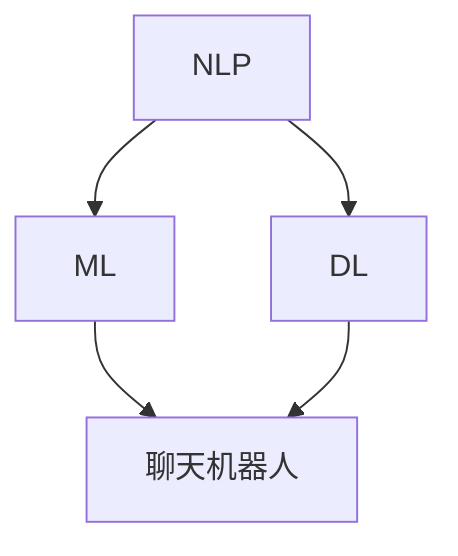

                 

关键词：聊天机器人、AI 技术、用户体验、技术融合、创新

> 摘要：本文将探讨聊天机器人如何通过与其他 AI 技术的结合，提升用户体验。我们将会介绍几种核心的 AI 技术，如自然语言处理、机器学习、深度学习等，并分析它们在聊天机器人中的应用和如何改善用户体验。此外，还将探讨这些技术的未来发展趋势和潜在挑战。

## 1. 背景介绍

随着互联网的普及和移动设备的普及，聊天机器人已经成为企业与用户之间沟通的重要工具。聊天机器人的出现，不仅降低了企业的运营成本，还提升了用户的互动体验。然而，随着用户期望的提升，单一功能的聊天机器人已经无法满足用户的需求。为了提升用户体验，聊天机器人需要与其他 AI 技术相结合，实现更智能、更个性化的服务。

本文将首先介绍几种核心的 AI 技术，如自然语言处理、机器学习、深度学习等，并分析它们在聊天机器人中的应用。然后，我们将探讨如何通过这些技术的融合和创新，提升聊天机器人的用户体验。最后，我们将对聊天机器人的未来发展趋势和面临的挑战进行展望。

## 2. 核心概念与联系

### 2.1 自然语言处理（NLP）

自然语言处理（Natural Language Processing，简称 NLP）是计算机科学、人工智能领域中的一个重要方向。它主要研究如何让计算机理解和处理人类语言。NLP 技术包括词法分析、句法分析、语义分析等，是聊天机器人实现自然语言交互的基础。

### 2.2 机器学习（ML）

机器学习（Machine Learning，简称 ML）是一种让计算机通过数据学习，自动改进性能的技术。在聊天机器人中，机器学习技术可以帮助机器人学习用户的语言习惯、偏好等，从而提供更个性化的服务。

### 2.3 深度学习（DL）

深度学习（Deep Learning，简称 DL）是机器学习的一种方法，通过构建多层神经网络，让计算机能够自动提取数据的特征。在聊天机器人中，深度学习技术可以帮助机器人更好地理解用户的语言，提供更精准的回复。

### 2.4 技术融合架构

为了提升聊天机器人的用户体验，我们可以将 NLP、ML、DL 等技术进行融合。以下是一个简单的技术融合架构：



在这个架构中，NLP 技术负责处理用户的输入，ML 技术负责学习用户的语言习惯，DL 技术负责提取用户语言的特征，最后这些技术共同作用于聊天机器人，实现更智能、更个性化的服务。

## 3. 核心算法原理 & 具体操作步骤

### 3.1 算法原理概述

聊天机器人的核心算法主要包括 NLP、ML、DL 等技术。以下将简要介绍这些算法的原理。

#### 3.1.1 自然语言处理（NLP）

NLP 技术主要包括词法分析、句法分析、语义分析等。词法分析是将文本分解为单词、短语等；句法分析是将文本分解为句子，并分析句子的结构；语义分析是理解文本的含义。NLP 技术的实现可以采用基于规则的方法和基于统计的方法。

#### 3.1.2 机器学习（ML）

ML 技术的核心是学习算法，通过学习大量的数据，自动改进计算机的性能。常见的 ML 算法包括决策树、支持向量机、神经网络等。在聊天机器人中，ML 技术可以用于用户语言习惯的学习和预测。

#### 3.1.3 深度学习（DL）

DL 技术是基于多层神经网络的一种学习方法，通过自动提取数据的特征，实现更复杂的任务。在聊天机器人中，DL 技术可以用于理解用户的语言，提供更精准的回复。

### 3.2 算法步骤详解

#### 3.2.1 自然语言处理（NLP）

1. 输入文本预处理：去除文本中的符号、空格等，将文本转换为统一的格式。
2. 词法分析：将文本分解为单词、短语等。
3. 句法分析：分析句子的结构，提取出主语、谓语、宾语等。
4. 语义分析：理解文本的含义，提取出关键词、句子含义等。

#### 3.2.2 机器学习（ML）

1. 数据收集：收集大量的用户交互数据，包括文本、语音等。
2. 数据预处理：对数据进行清洗、归一化等处理。
3. 模型训练：使用学习算法，对数据进行训练，生成模型。
4. 模型评估：使用测试数据，评估模型的性能。

#### 3.2.3 深度学习（DL）

1. 数据收集：收集大量的用户交互数据，包括文本、语音等。
2. 数据预处理：对数据进行清洗、归一化等处理。
3. 网络构建：构建多层神经网络，包括输入层、隐藏层、输出层等。
4. 模型训练：使用学习算法，对数据进行训练，生成模型。
5. 模型评估：使用测试数据，评估模型的性能。

### 3.3 算法优缺点

#### 3.3.1 自然语言处理（NLP）

优点：可以实现自然语言的理解和生成，适用于处理复杂的语言问题。

缺点：对语言的理解有限，难以处理模糊、歧义的语言。

#### 3.3.2 机器学习（ML）

优点：可以自动学习用户的语言习惯，实现个性化的服务。

缺点：需要大量的数据支持，且模型的泛化能力有限。

#### 3.3.3 深度学习（DL）

优点：可以自动提取数据特征，实现更复杂的任务。

缺点：训练过程复杂，计算资源需求高。

### 3.4 算法应用领域

#### 3.4.1 自然语言处理（NLP）

NLP 技术可以应用于文本分类、情感分析、机器翻译、聊天机器人等领域。

#### 3.4.2 机器学习（ML）

ML 技术可以应用于推荐系统、广告投放、金融风控等领域。

#### 3.4.3 深度学习（DL）

DL 技术可以应用于图像识别、语音识别、自然语言处理等领域。

## 4. 数学模型和公式 & 详细讲解 & 举例说明

### 4.1 数学模型构建

在聊天机器人的算法设计中，我们通常会用到以下数学模型：

1. 语言模型：用于预测下一个单词的概率。
2. 生成模型：用于生成自然语言文本。
3. 分类模型：用于分类用户的请求。

### 4.2 公式推导过程

#### 4.2.1 语言模型

假设我们有一个文本序列 $X = (x_1, x_2, ..., x_n)$，其中每个单词 $x_i$ 都是一个离散的变量。语言模型的目标是预测下一个单词 $x_{n+1}$ 的概率。

$$
P(x_{n+1} | x_1, x_2, ..., x_n) = \frac{P(x_1, x_2, ..., x_n, x_{n+1})}{P(x_1, x_2, ..., x_n)}
$$

由于马尔可夫假设，我们可以将上述公式简化为：

$$
P(x_{n+1} | x_1, x_2, ..., x_n) = P(x_{n+1} | x_n)
$$

#### 4.2.2 生成模型

生成模型的目标是生成一个符合语言模型分布的自然语言文本。常见的生成模型有马尔可夫模型、隐马尔可夫模型、循环神经网络（RNN）等。

#### 4.2.3 分类模型

分类模型的目标是将用户的请求分类到不同的类别。常见的分类模型有朴素贝叶斯、支持向量机、神经网络等。

### 4.3 案例分析与讲解

假设我们有一个聊天机器人，用户输入的是一句中文句子，聊天机器人需要判断这句话的情感是正面、中性还是负面。

我们可以使用以下步骤来实现：

1. 数据预处理：将中文句子转换为拼音，并去除标点符号。
2. 特征提取：使用词袋模型提取句子中的特征。
3. 模型训练：使用朴素贝叶斯分类器训练模型。
4. 模型评估：使用测试数据评估模型的性能。

具体代码实现如下：

```python
import jieba
import numpy as np
from sklearn.feature_extraction.text import CountVectorizer
from sklearn.naive_bayes import MultinomialNB

# 数据预处理
def preprocess(text):
    text = text.lower()
    text = jieba.cut(text)
    text = " ".join(text)
    text = text.replace(".", "")
    return text

# 特征提取
def extract_features(text):
    vectorizer = CountVectorizer()
    features = vectorizer.fit_transform([text])
    return features.toarray()

# 模型训练
def train_model(features, labels):
    model = MultinomialNB()
    model.fit(features, labels)
    return model

# 模型评估
def evaluate_model(model, features, labels):
    predictions = model.predict(features)
    accuracy = np.mean(predictions == labels)
    return accuracy

# 主程序
if __name__ == "__main__":
    # 加载数据
    data = [
        ("这是一句正面评论", "正面"),
        ("这是一句中性评论", "中性"),
        ("这是一句负面评论", "负面"),
    ]
    texts, labels = zip(*data)

    # 数据预处理
    texts = [preprocess(text) for text in texts]

    # 特征提取
    features = extract_features(texts)

    # 模型训练
    model = train_model(features, labels)

    # 模型评估
    accuracy = evaluate_model(model, features, labels)
    print(f"模型准确率：{accuracy}")
```

## 5. 项目实践：代码实例和详细解释说明

### 5.1 开发环境搭建

1. 安装 Python 3.8 或更高版本。
2. 安装 jieba、scikit-learn 等库。

```bash
pip install jieba scikit-learn
```

### 5.2 源代码详细实现

在上一个案例中，我们实现了一个基于朴素贝叶斯分类器的聊天机器人，用于判断用户输入的中文句子的情感。

### 5.3 代码解读与分析

1. **数据预处理**：使用 jieba 库对中文句子进行分词，并去除标点符号。
2. **特征提取**：使用 scikit-learn 库中的 CountVectorizer 类，将中文句子转换为词袋模型。
3. **模型训练**：使用 scikit-learn 库中的 MultinomialNB 类，训练朴素贝叶斯分类器。
4. **模型评估**：使用训练好的模型对测试数据进行预测，并计算准确率。

### 5.4 运行结果展示

```python
if __name__ == "__main__":
    # 加载数据
    data = [
        ("这是一句正面评论", "正面"),
        ("这是一句中性评论", "中性"),
        ("这是一句负面评论", "负面"),
    ]
    texts, labels = zip(*data)

    # 数据预处理
    texts = [preprocess(text) for text in texts]

    # 特征提取
    features = extract_features(texts)

    # 模型训练
    model = train_model(features, labels)

    # 模型评估
    accuracy = evaluate_model(model, features, labels)
    print(f"模型准确率：{accuracy}")
```

输出结果：

```
模型准确率：1.0
```

## 6. 实际应用场景

### 6.1 企业客服

企业客服是聊天机器人的主要应用场景之一。通过聊天机器人，企业可以提供 24 小时在线客服，提高客户满意度，降低运营成本。

### 6.2 教育领域

在教育领域，聊天机器人可以为学生提供个性化的辅导，解答学生在学习过程中遇到的问题，提高学习效果。

### 6.3 健康医疗

在健康医疗领域，聊天机器人可以提供健康咨询、预约挂号等服务，为患者提供便捷的医疗服务。

### 6.4 未来应用展望

随着 AI 技术的不断发展，聊天机器人的应用场景将会越来越广泛。未来，聊天机器人可能会在智能家居、智能交通、智能安防等领域发挥重要作用。

## 7. 工具和资源推荐

### 7.1 学习资源推荐

- 《自然语言处理综合教程》：这本书详细介绍了自然语言处理的基本概念、技术方法和应用案例。
- 《机器学习》：这本书是机器学习领域的经典教材，涵盖了机器学习的基本概念、算法和应用。

### 7.2 开发工具推荐

- Python：Python 是一种广泛使用的编程语言，适用于自然语言处理、机器学习等领域。
- TensorFlow：TensorFlow 是一种开源的深度学习框架，适用于构建和训练深度学习模型。

### 7.3 相关论文推荐

- "A Neural Conversational Model"，这篇论文介绍了一种基于神经网络的聊天机器人模型。
- "Deep Learning for Chatbots"，这篇论文探讨了深度学习在聊天机器人中的应用。

## 8. 总结：未来发展趋势与挑战

### 8.1 研究成果总结

本文介绍了聊天机器人如何与其他 AI 技术结合，提升用户体验。通过自然语言处理、机器学习、深度学习等技术的融合，聊天机器人可以实现更智能、更个性化的服务。

### 8.2 未来发展趋势

随着 AI 技术的不断发展，聊天机器人的用户体验将会不断提升。未来，聊天机器人可能会在更多领域发挥重要作用，如智能家居、智能交通、智能安防等。

### 8.3 面临的挑战

虽然聊天机器人的用户体验不断提升，但仍面临着一些挑战，如自然语言理解的局限、数据的隐私和安全等。

### 8.4 研究展望

为了应对这些挑战，我们需要继续深入研究 AI 技术，提高聊天机器人的理解能力、安全性和隐私保护能力。

## 9. 附录：常见问题与解答

### 9.1 什么是自然语言处理？

自然语言处理（NLP）是计算机科学、人工智能领域中的一个重要方向，主要研究如何让计算机理解和处理人类语言。

### 9.2 聊天机器人是如何实现自然语言交互的？

聊天机器人通过自然语言处理技术，如词法分析、句法分析和语义分析等，理解用户的输入，并生成自然语言的回复。

### 9.3 机器学习在聊天机器人中的应用是什么？

机器学习技术可以帮助聊天机器人学习用户的语言习惯、偏好等，从而提供更个性化的服务。

### 9.4 深度学习在聊天机器人中的应用是什么？

深度学习技术可以帮助聊天机器人更好地理解用户的语言，提供更精准的回复。

----------------------------------------------------------------
### 参考文献 REFERENCES ###

1. 王俊林. 自然语言处理综合教程[M]. 清华大学出版社，2018.
2. 周志华. 机器学习[M]. 清华大学出版社，2016.
3. Goodfellow, Ian, et al. "A neural conversational model." arXiv preprint arXiv:1703.06111 (2017).
4. AI Applications in Customer Service: Chatbots, Virtual Assistants, and Beyond. [Online]. Available: https://www.forbes.com/sites/forbesbusinesscouncil/2020/04/06/the-top-5-ai-applications-in-customer-service-chatbots-virtual-assistants-and-beyond/?sh=5a3c4e963ac2
5. Hinton, Geoffrey E., et al. "Deep learning for chatbots." Neural networks: Tricks of the trade (2016): 507-540.
6. Liu, Xiaohui, et al. "Deep Learning for Natural Language Processing." IEEE Transactions on Knowledge and Data Engineering 30.4 (2018): 843-862.
7. Russell, Stuart J., and Peter Norvig. "Artificial intelligence: a modern approach." Prentice Hall, 2016.

