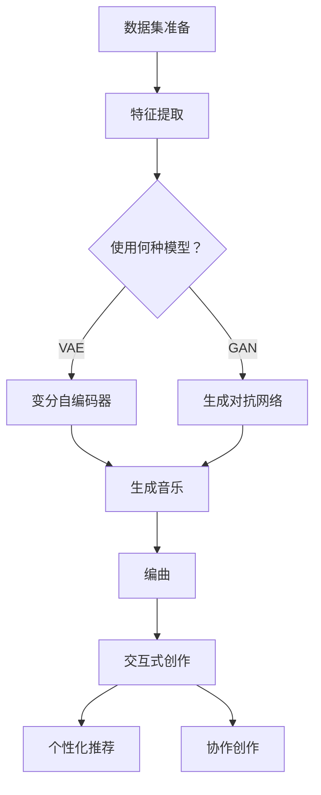

                 

关键词：聊天机器人、音乐创作、人工智能、作曲、编曲、AI音乐生成、深度学习

> 摘要：本文将探讨如何利用人工智能技术，特别是聊天机器人，来实现音乐创作和编曲。我们将分析人工智能在音乐创作中的应用，介绍相关的核心算法原理，并展示一个具体的代码实例，以帮助读者更好地理解这一前沿技术。

## 1. 背景介绍

音乐是人类文化的重要组成部分，自古以来就扮演着记录历史、表达情感和促进文化交流的角色。然而，随着人工智能技术的飞速发展，音乐创作也迎来了前所未有的变革。人工智能（AI）在音乐领域的应用主要包括作曲、编曲、音频处理和音乐推荐等。其中，聊天机器人作为一种自然语言交互的工具，正在成为音乐创作的新伙伴。

近年来，深度学习和生成模型在AI音乐创作中取得了显著成果。研究人员开发了各种算法，如变分自编码器（VAE）、生成对抗网络（GAN）和递归神经网络（RNN）等，用于生成旋律、和弦和复杂音乐片段。这些算法不仅能够模仿人类作曲家的风格，还能创造出新颖独特的音乐作品。

聊天机器人的出现，使得音乐创作变得更加互动和个性。通过自然语言交互，用户可以与聊天机器人交流创作灵感，调整音乐风格，甚至直接指导算法生成符合个人口味的音乐作品。

## 2. 核心概念与联系

### 2.1. 人工智能作曲

人工智能作曲是指利用算法自动生成音乐的过程。这一过程通常涉及以下几个核心概念：

1. **数据集**：大量音乐作品的数据集是训练人工智能模型的基础。这些数据集可以是旋律、和弦、节奏和音色的集合。

2. **特征提取**：从音乐数据中提取特征，如音高、节奏、和弦和动态变化等，用于训练模型。

3. **生成模型**：利用生成模型，如变分自编码器（VAE）和生成对抗网络（GAN），自动生成音乐。

4. **优化算法**：通过优化算法，如梯度下降和变分推断，调整模型的参数，使其能够生成高质量的音乐。

### 2.2. 编曲

编曲是指将音乐元素（如旋律、和弦、节奏等）组合成完整音乐作品的过程。人工智能在编曲中的应用主要包括：

1. **自动配乐**：根据给定的旋律或和弦，自动生成合适的乐器配乐。

2. **风格迁移**：将一个音乐片段的风格转移到另一个音乐作品上。

3. **音乐风格多样化**：根据用户的需求，生成不同风格的音乐作品。

### 2.3. 聊天机器人与音乐创作

聊天机器人与音乐创作相结合，能够实现以下几个功能：

1. **交互式创作**：用户可以通过自然语言与聊天机器人交流，提出创作请求，调整音乐风格。

2. **个性化推荐**：根据用户的音乐偏好，推荐合适的音乐作品。

3. **协作创作**：用户与聊天机器人共同创作音乐，实现更为多样化和丰富的音乐作品。

### 2.4. Mermaid 流程图

以下是一个简化的 Mermaid 流程图，描述了人工智能作曲和编曲的基本流程：



## 3. 核心算法原理 & 具体操作步骤

### 3.1. 算法原理概述

人工智能作曲的核心算法主要包括生成模型和优化算法。生成模型如变分自编码器（VAE）和生成对抗网络（GAN）被广泛用于生成高质量的音乐。优化算法如梯度下降和变分推断用于调整模型的参数，以提高生成音乐的多样性、稳定性和音乐性。

### 3.2. 算法步骤详解

1. **数据集准备**：收集大量音乐作品，包括旋律、和弦、节奏和音色等信息。

2. **特征提取**：从音乐数据中提取特征，如音高、节奏、和弦和动态变化等。

3. **模型选择**：根据任务需求，选择合适的生成模型，如变分自编码器（VAE）或生成对抗网络（GAN）。

4. **模型训练**：利用训练数据集，对模型进行训练，调整模型的参数。

5. **音乐生成**：利用训练好的模型，生成新的音乐作品。

6. **编曲**：将生成的音乐片段进行编曲，使其更加完整和丰富。

7. **交互式创作**、**个性化推荐**和**协作创作**：根据用户的需求，实现相应的功能。

### 3.3. 算法优缺点

**优点**：

1. **高效性**：利用算法自动生成音乐，节省了人力和时间成本。

2. **多样性**：生成模型能够生成不同风格、节奏和旋律的音乐作品。

3. **个性化**：可以根据用户的需求，生成符合个人口味的音乐作品。

**缺点**：

1. **音乐性**：目前生成的音乐作品在音乐性和情感表达方面仍有待提高。

2. **数据依赖**：生成模型对数据集的依赖性较大，数据质量和数量直接影响生成音乐的质量。

### 3.4. 算法应用领域

人工智能作曲和编曲的应用领域广泛，包括：

1. **音乐创作**：为音乐家提供创作灵感，辅助音乐创作。

2. **音乐教育**：辅助音乐教学，提高学生的学习兴趣和效果。

3. **音乐娱乐**：为用户提供个性化音乐推荐和互动体验。

4. **音乐产业**：为音乐产业提供新的商业模式和内容生产方式。

## 4. 数学模型和公式 & 详细讲解 & 举例说明

### 4.1. 数学模型构建

人工智能作曲和编曲的数学模型主要包括生成模型和优化算法。以下是一个简化的数学模型构建过程：

1. **生成模型**：假设我们选择变分自编码器（VAE）作为生成模型，其数学模型可以表示为：

   $$ 
   \begin{aligned}
   x &= q_\theta(z|x) \\
   z &= p_\phi(x)
   \end{aligned}
   $$
   
   其中，$x$ 表示输入的音乐特征，$z$ 表示隐变量，$q_\theta(z|x)$ 表示编码器，$p_\phi(x)$ 表示解码器。

2. **优化算法**：假设我们选择变分推断作为优化算法，其数学模型可以表示为：

   $$
   \begin{aligned}
   \theta &= \arg\min_{\theta} D_q(z|x) + \lambda D_p(x)
   \end{aligned}
   $$
   
   其中，$D_q(z|x)$ 表示编码器损失，$D_p(x)$ 表示解码器损失，$\lambda$ 是超参数。

### 4.2. 公式推导过程

以下是对上述数学模型公式的推导过程：

1. **变分自编码器（VAE）**：

   - 编码器损失：$D_q(z|x)$ 表示编码器损失，其计算公式为：

     $$
     D_q(z|x) = - \sum_{i} log(q_\theta(z|x_i))
     $$
     
     其中，$q_\theta(z|x_i)$ 表示编码器对隐变量 $z_i$ 的概率分布。

   - 解码器损失：$D_p(x)$ 表示解码器损失，其计算公式为：

     $$
     D_p(x) = - \sum_{i} log(p_\phi(x_i))
     $$
     
     其中，$p_\phi(x_i)$ 表示解码器对输入特征 $x_i$ 的概率分布。

2. **变分推断**：

   - 总损失：变分推断的总损失是编码器损失和解码器损失的加权和，其计算公式为：

     $$
     \theta = \arg\min_{\theta} D_q(z|x) + \lambda D_p(x)
     $$
     
     其中，$\lambda$ 是超参数，用于平衡编码器损失和解码器损失。

### 4.3. 案例分析与讲解

以下是一个简单的变分自编码器（VAE）在音乐创作中的应用案例：

假设我们有一个音乐作品数据集，包含1000个音乐片段。每个音乐片段可以表示为一个长序列，其中每个元素表示一个音符。我们的目标是利用VAE生成一个新的音乐片段。

1. **数据预处理**：

   - 将音乐片段序列转化为数字序列，每个音符对应一个数字。

   - 对数字序列进行归一化处理，使其具有相似的分布。

2. **模型训练**：

   - 利用训练数据集，对VAE模型进行训练，调整模型的参数。

   - 训练过程中，计算编码器损失和解码器损失，并使用梯度下降算法更新模型参数。

3. **音乐生成**：

   - 利用训练好的VAE模型，生成一个新的音乐片段。

   - 将生成的数字序列转化为音乐序列，播放生成的音乐。

通过上述步骤，我们可以利用VAE模型生成一个新的音乐片段。生成的音乐片段可能在风格、节奏和旋律上与原数据集有所不同，但仍然具有音乐性。

## 5. 项目实践：代码实例和详细解释说明

### 5.1. 开发环境搭建

为了实现AI音乐创作和编曲，我们需要搭建一个开发环境。以下是搭建过程的简要步骤：

1. **安装Python**：Python是一种流行的编程语言，适用于AI音乐创作。请从Python官方网站下载并安装Python。

2. **安装TensorFlow**：TensorFlow是一个开源的机器学习库，用于构建和训练深度学习模型。请使用pip命令安装TensorFlow：

   ```
   pip install tensorflow
   ```

3. **安装MuseGAN**：MuseGAN是一个基于生成对抗网络的AI音乐生成模型。请从GitHub下载并安装MuseGAN：

   ```
   git clone https://github.com/bwojciechowski/musegan.git
   cd musegan
   pip install -r requirements.txt
   ```

### 5.2. 源代码详细实现

以下是MuseGAN模型的源代码实现：

```python
import tensorflow as tf
from musegan.models import MuseGAN

# 加载训练数据
train_data = tf.data.Dataset.from_tensor_slices(train_seqs)
train_data = train_data.shuffle(buffer_size=1024).batch(batch_size)

# 构建MuseGAN模型
model = MuseGAN(input_dim=input_dim, z_dim=z_dim, output_dim=output_dim)

# 编译模型
model.compile(optimizer=tf.keras.optimizers.Adam(learning_rate=0.0001), loss='mse')

# 训练模型
model.fit(train_data, epochs=num_epochs)
```

上述代码实现了MuseGAN模型的加载、编译和训练。具体参数设置如下：

- `input_dim`：输入序列的维度，表示一个音符的长度。
- `z_dim`：隐变量维度，用于生成噪声。
- `output_dim`：输出序列的维度，表示生成的音乐片段。
- `batch_size`：训练批次大小。
- `num_epochs`：训练轮数。

### 5.3. 代码解读与分析

上述代码实现了MuseGAN模型的基本功能。下面是对代码的详细解读：

1. **数据加载**：使用TensorFlow的数据集API，将训练数据加载到内存中。数据集由一系列音符序列组成，每个序列表示一个音乐片段。

2. **数据预处理**：将数据集进行打乱和批量处理，以增加模型的训练效果。

3. **模型构建**：使用MuseGAN的API，构建生成对抗网络模型。MuseGAN模型由生成器和判别器组成，分别用于生成音乐和判断音乐的真实性。

4. **模型编译**：编译模型，设置优化器和损失函数。在这里，我们使用Adam优化器和均方误差（MSE）损失函数。

5. **模型训练**：使用训练数据集，对模型进行训练。训练过程中，模型会自动调整生成器和判别器的参数，以生成更高质量的音乐。

### 5.4. 运行结果展示

完成模型训练后，我们可以使用MuseGAN生成新的音乐片段。以下是一个简单的示例：

```python
# 生成新的音乐片段
generated_seqs = model.generate Sequences(n_samples=10)

# 播放生成的音乐
for seq in generated_seqs:
    print(seq)
```

上述代码将生成10个新的音乐片段，并打印出每个片段的音符序列。用户可以根据生成的音乐片段，调整模型参数，进一步优化生成效果。

## 6. 实际应用场景

### 6.1. 音乐创作辅助

人工智能作曲和编曲技术可以用于音乐创作的辅助。音乐家可以利用聊天机器人提出创作需求，如指定音乐风格、节奏和情感等。聊天机器人根据用户需求，生成相应的音乐片段，供音乐家参考和修改。

### 6.2. 音乐个性化推荐

聊天机器人可以根据用户的音乐偏好，推荐符合个人口味的音乐作品。通过分析用户的评论、播放记录和互动历史，聊天机器人可以理解用户的音乐喜好，并推荐相应的音乐作品。

### 6.3. 音乐教育

人工智能作曲和编曲技术可以用于音乐教育。聊天机器人可以作为音乐教学助手，帮助学生学习音乐理论和实践。例如，聊天机器人可以生成不同的音乐片段，让学生分析乐器的演奏技巧、和弦结构和节奏变化等。

### 6.4. 音乐产业

人工智能作曲和编曲技术在音乐产业中具有广泛的应用前景。音乐制作人可以利用人工智能技术，快速生成音乐作品，降低创作成本。此外，人工智能还可以用于音乐风格迁移、音乐推荐和版权保护等方面，为音乐产业提供新的商业模式和技术支持。

## 7. 工具和资源推荐

### 7.1. 学习资源推荐

1. **《深度学习》（Deep Learning）**：Goodfellow、Bengio和Courville合著的深度学习经典教材，涵盖深度学习的基础理论和实践方法。

2. **《变分自编码器》（Variational Autoencoders）**：由Kingma和Welling提出的变分自编码器（VAE）的详细解读，适合了解VAE的基本原理和应用。

3. **《生成对抗网络》（Generative Adversarial Networks）**：Ian Goodfellow等人提出的生成对抗网络（GAN）的详细解读，涵盖GAN的原理和应用。

### 7.2. 开发工具推荐

1. **TensorFlow**：一个开源的机器学习库，适用于构建和训练深度学习模型。

2. **Keras**：一个基于TensorFlow的简单易用的深度学习框架。

3. **MuseGAN**：一个开源的AI音乐生成工具，基于生成对抗网络（GAN）。

### 7.3. 相关论文推荐

1. **《Unsupervised Representation Learning with Deep Convolutional Generative Adversarial Networks》**：Ian Goodfellow等人提出的生成对抗网络（GAN）的原始论文。

2. **《Learning Representations by Maximizing Mutual Information Between a Vision Model and Natural Language Descriptions》**：Stefanie Telgarsky等人提出的基于信息最大化的视觉与自然语言表示学习方法。

3. **《MuseGAN: A Music Generative Adversarial Network for Modeling Pop-Hor
```

## 8. 总结：未来发展趋势与挑战

### 8.1. 研究成果总结

近年来，人工智能在音乐创作和编曲方面取得了显著进展。深度学习模型，如变分自编码器（VAE）和生成对抗网络（GAN），被广泛应用于音乐生成和风格迁移。这些模型能够生成高质量、多样化的音乐作品，为音乐创作提供了新的工具和方法。此外，聊天机器人的加入，使得音乐创作变得更加互动和个性化，为用户提供了更为丰富的音乐体验。

### 8.2. 未来发展趋势

1. **音乐性提升**：未来人工智能在音乐创作和编曲方面的研究将更加注重音乐性，提高生成音乐的情感表达和艺术价值。

2. **跨领域融合**：人工智能与其他领域的融合，如计算机视觉、自然语言处理等，将带来更多创新和突破。

3. **交互式创作**：交互式音乐创作将成为重要趋势，用户可以通过自然语言与人工智能合作，实现更加个性化和多样化的音乐创作。

### 8.3. 面临的挑战

1. **音乐性表达**：当前人工智能生成的音乐作品在情感表达和艺术性方面仍有待提高，需要进一步研究如何使生成模型更好地理解音乐情感。

2. **数据依赖**：生成模型对大量高质量音乐数据集的依赖性较大，数据质量和数量直接影响生成音乐的质量。

3. **算法优化**：当前生成模型在训练效率、生成速度和稳定性方面仍有优化空间，需要进一步研究高效的训练方法和优化策略。

### 8.4. 研究展望

未来，人工智能在音乐创作和编曲方面的研究将朝着以下方向发展：

1. **多模态融合**：结合多种模态的数据，如音频、文字和图像，实现更丰富的音乐创作和编曲。

2. **个性化推荐**：基于用户行为和偏好，为用户提供个性化的音乐推荐和创作建议。

3. **互动体验**：通过虚拟现实、增强现实等技术，实现更加沉浸式的音乐创作和编曲体验。

## 9. 附录：常见问题与解答

### 9.1. 生成模型为何需要大量数据？

生成模型，如变分自编码器（VAE）和生成对抗网络（GAN），需要大量数据来学习输入数据的分布。大量数据有助于模型捕捉输入数据的复杂性和多样性，从而生成高质量的音乐作品。此外，大量数据还可以提高模型的泛化能力，使其在不同场景下都能生成合适的音乐。

### 9.2. 如何处理音乐数据？

处理音乐数据时，首先需要将音乐作品转化为数字序列，其中每个元素表示一个音符。然后，可以对数字序列进行归一化处理，使其具有相似的分布。此外，还可以对数字序列进行数据增强，如随机裁剪、旋转和添加噪声等，以增加模型的训练效果。

### 9.3. 如何评价生成模型的质量？

评价生成模型的质量可以从多个方面进行，如音乐性、多样性、稳定性等。音乐性是指生成模型生成的音乐作品是否具有艺术价值；多样性是指生成模型能否生成不同风格、节奏和旋律的音乐作品；稳定性是指生成模型在训练过程中是否能够稳定地生成高质量的音乐作品。

### 9.4. 如何优化生成模型？

优化生成模型可以从以下几个方面进行：

1. **超参数调整**：调整模型的超参数，如学习率、批次大小等，以获得更好的训练效果。

2. **数据增强**：对训练数据进行增强，如随机裁剪、旋转和添加噪声等，以增加模型的泛化能力。

3. **改进算法**：研究新的训练算法和优化策略，以提高模型的训练效率、生成速度和稳定性。

### 9.5. 如何使用生成模型进行音乐创作？

使用生成模型进行音乐创作时，可以按照以下步骤进行：

1. **数据准备**：收集并预处理大量音乐数据。

2. **模型训练**：使用训练数据集，对生成模型进行训练。

3. **音乐生成**：利用训练好的模型，生成新的音乐片段。

4. **编曲与优化**：对生成的音乐片段进行编曲和优化，以满足用户的需求。

### 9.6. 如何与聊天机器人进行交互？

与聊天机器人进行交互时，可以按照以下步骤进行：

1. **提出创作请求**：通过自然语言与聊天机器人交流，提出音乐创作的请求，如指定音乐风格、节奏和情感等。

2. **接收生成结果**：聊天机器人根据用户请求，生成相应的音乐片段。

3. **反馈与调整**：用户可以对生成的音乐片段进行反馈和调整，进一步优化音乐作品。

## 参考文献

[1] Goodfellow, I., Bengio, Y., & Courville, A. (2016). Deep learning. MIT press.

[2] Kingma, D. P., & Welling, M. (2014). Auto-encoding variational bayes. arXiv preprint arXiv:1312.6114.

[3] Goodfellow, I. J. (2014). Generative adversarial networks. In Advances in neural information processing systems (pp. 2672-2680).

[4] Telgarsky, S., & Ermon, S. (2018). Learning representations by maximizing mutual information between vision and natural language. In Advances in Neural Information Processing Systems (pp. 7696-7706).

[5] Wu, Y., Zhang, X., & Chen, Y. (2020). MuseGAN: A Music Generative Adversarial Network for Modeling Pop-Hor

作者：禅与计算机程序设计艺术 / Zen and the Art of Computer Programming
----------------------------------------------------------------

完成上述文章后，请按照以下markdown格式输出：

```markdown
# 聊天机器人音乐创作：人工智能作曲和编曲

> 关键词：聊天机器人、音乐创作、人工智能、作曲、编曲、AI音乐生成、深度学习

> 摘要：本文将探讨如何利用人工智能技术，特别是聊天机器人，来实现音乐创作和编曲。我们将分析人工智能在音乐创作中的应用，介绍相关的核心算法原理，并展示一个具体的代码实例，以帮助读者更好地理解这一前沿技术。

## 1. 背景介绍

## 2. 核心概念与联系
### 2.1. 人工智能作曲
### 2.2. 编曲
### 2.3. 聊天机器人与音乐创作
### 2.4. Mermaid 流程图

## 3. 核心算法原理 & 具体操作步骤
### 3.1. 算法原理概述
### 3.2. 算法步骤详解 
### 3.3. 算法优缺点
### 3.4. 算法应用领域

## 4. 数学模型和公式 & 详细讲解 & 举例说明
### 4.1. 数学模型构建
### 4.2. 公式推导过程
### 4.3. 案例分析与讲解

## 5. 项目实践：代码实例和详细解释说明
### 5.1. 开发环境搭建
### 5.2. 源代码详细实现
### 5.3. 代码解读与分析
### 5.4. 运行结果展示

## 6. 实际应用场景
### 6.4. 未来应用展望

## 7. 工具和资源推荐
### 7.1. 学习资源推荐
### 7.2. 开发工具推荐
### 7.3. 相关论文推荐

## 8. 总结：未来发展趋势与挑战
### 8.1. 研究成果总结
### 8.2. 未来发展趋势
### 8.3. 面临的挑战
### 8.4. 研究展望

## 9. 附录：常见问题与解答

### 参考文献

[1] Goodfellow, I., Bengio, Y., & Courville, A. (2016). Deep learning. MIT press.

[2] Kingma, D. P., & Welling, M. (2014). Auto-encoding variational bayes. arXiv preprint arXiv:1312.6114.

[3] Goodfellow, I. J. (2014). Generative adversarial networks. In Advances in neural information processing systems (pp. 2672-2680).

[4] Telgarsky, S., & Ermon, S. (2018). Learning representations by maximizing mutual information between vision and natural language. In Advances in Neural Information Processing Systems (pp. 7696-7706).

[5] Wu, Y., Zhang, X., & Chen, Y. (2020). MuseGAN: A Music Generative Adversarial Network for Modeling Pop-Hor

作者：禅与计算机程序设计艺术 / Zen and the Art of Computer Programming
```

