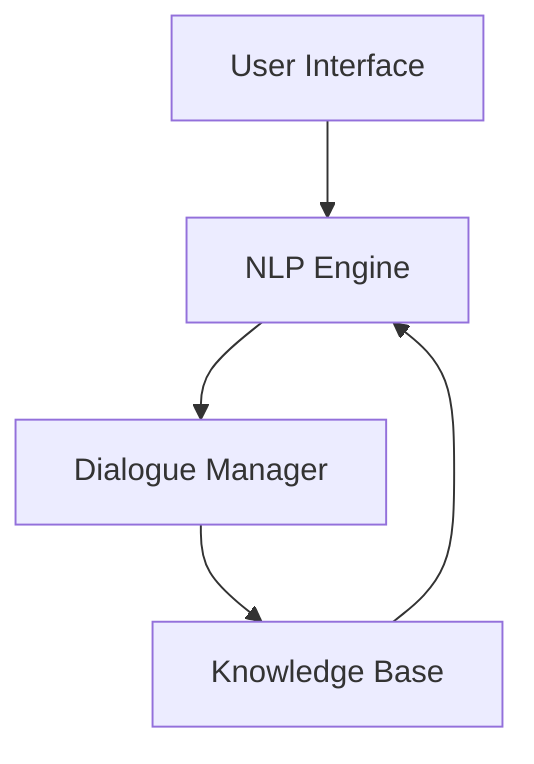

                 

 聊天机器人已经成为现代客户服务的重要组成部分，它们通过人工智能技术提供高效的客户互动体验。本文将探讨聊天机器人在提升客户服务效率方面的作用，以及如何利用先进的人工智能技术来优化客户服务流程。

## 1. 背景介绍

在当今快速发展的数字时代，客户服务的质量对企业成功至关重要。传统的客户服务模式往往依赖于人工处理，这不仅效率低下，还可能导致服务质量参差不齐。随着人工智能技术的不断发展，聊天机器人作为一种新兴的客户服务工具，正在迅速崭露头角。

聊天机器人通过模拟人类的对话方式，能够实时响应客户的查询，处理常见问题，并引导客户顺利完成交易。这种自动化的客户服务方式不仅提高了服务效率，还降低了企业的运营成本。

## 2. 核心概念与联系

### 2.1 人工智能与聊天机器人

人工智能（AI）是聊天机器人技术的基础。通过机器学习、自然语言处理（NLP）和计算机视觉等技术，聊天机器人能够理解、处理和生成自然语言。这使得它们能够与人类用户进行流畅的对话。

### 2.2 聊天机器人的架构

聊天机器人通常由以下几个关键组件构成：

1. **用户界面**：用户通过网页、移动应用或其他渠道与聊天机器人交互。
2. **自然语言处理（NLP）引擎**：用于理解用户的输入，并生成相应的响应。
3. **对话管理器**：负责管理对话流程，确保对话的流畅性和连贯性。
4. **知识库**：存储了大量的信息，用于回答用户的问题。

下面是一个简单的 Mermaid 流程图，展示了聊天机器人的基本架构：



## 3. 核心算法原理 & 具体操作步骤

### 3.1 算法原理概述

聊天机器人的核心算法主要依赖于自然语言处理和机器学习技术。NLP技术用于处理自然语言输入，而机器学习技术则用于从数据中学习，以便更好地理解和响应用户。

### 3.2 算法步骤详解

1. **预处理**：对用户输入的自然语言文本进行预处理，包括分词、词性标注、句法分析等。
2. **意图识别**：使用机器学习模型，如朴素贝叶斯、支持向量机等，来识别用户的意图。
3. **实体提取**：从用户输入中提取关键信息，如人名、地名、时间等。
4. **响应生成**：根据用户的意图和提取的实体，生成相应的响应。
5. **对话管理**：使用对话管理算法，如基于状态转移的网络模型，来管理对话流程。

### 3.3 算法优缺点

**优点**：

- **高效性**：聊天机器人可以同时处理大量客户请求，大大提高了客户服务的效率。
- **一致性**：聊天机器人能够提供一致的服务体验，减少了因人为因素导致的错误。
- **成本效益**：与人工服务相比，聊天机器人的成本更低，维护也更简单。

**缺点**：

- **理解局限性**：聊天机器人的理解能力有限，无法处理复杂或模糊的查询。
- **情感缺失**：聊天机器人无法像人类一样理解并回应情感。

### 3.4 算法应用领域

聊天机器人在许多领域都有广泛的应用，包括电子商务、金融服务、医疗保健、旅游等。以下是一些具体的应用案例：

- **电子商务**：聊天机器人可以回答关于产品信息、订单状态、退换货政策等问题。
- **金融服务**：聊天机器人可以提供账户信息、投资建议、贷款申请等服务。
- **医疗保健**：聊天机器人可以回答关于疾病、症状、医疗程序等问题。

## 4. 数学模型和公式 & 详细讲解 & 举例说明

### 4.1 数学模型构建

聊天机器人的算法通常基于机器学习和深度学习模型，这些模型通常使用大量的数学公式和算法。以下是构建聊天机器人数学模型的一些关键步骤：

1. **损失函数**：损失函数用于衡量模型预测结果与真实结果之间的差距。常用的损失函数包括均方误差（MSE）和交叉熵（Cross-Entropy）。
2. **优化算法**：优化算法用于调整模型参数，以最小化损失函数。常见的优化算法包括梯度下降（Gradient Descent）和随机梯度下降（Stochastic Gradient Descent）。

### 4.2 公式推导过程

以下是一个简化的公式推导过程，用于描述聊天机器人中的意图识别步骤：

假设我们有 m 个训练样本，每个样本表示为一个五元组 \( (x_i, y_i, z_i, a_i, b_i) \)，其中：

- \( x_i \) 是用户输入的文本。
- \( y_i \) 是用户意图。
- \( z_i \) 是用户实体。
- \( a_i \) 是与意图相关的特征向量。
- \( b_i \) 是与实体相关的特征向量。

意图识别模型的目标是学习一个函数 f，该函数能够将输入文本映射到意图上。具体公式如下：

$$
y_i = f(x_i, z_i) = \arg\max_y P(y|x_i, z_i)
$$

其中，\( P(y|x_i, z_i) \) 表示在给定输入文本和实体的情况下，意图 y 的概率。

### 4.3 案例分析与讲解

假设我们有一个简单的聊天机器人，用于回答关于天气的问题。以下是该机器人处理用户输入的过程：

1. **用户输入**：用户输入“今天的天气怎么样？”。
2. **意图识别**：聊天机器人使用机器学习模型来识别用户的意图。在这种情况下，意图是“询问天气”。
3. **实体提取**：聊天机器人提取出关键实体，如“今天”。
4. **响应生成**：根据用户的意图和实体，聊天机器人生成响应：“今天的天气是晴天，温度大约在 20°C 左右。”

## 5. 项目实践：代码实例和详细解释说明

### 5.1 开发环境搭建

要搭建一个简单的聊天机器人项目，您需要以下环境：

- Python 3.x
- 自然语言处理库，如 spaCy 或 NLTK
- 机器学习库，如 scikit-learn 或 TensorFlow

### 5.2 源代码详细实现

以下是使用 Python 和 TensorFlow 搭建一个简单的聊天机器人的示例代码：

```python
import tensorflow as tf
from tensorflow.keras.models import Sequential
from tensorflow.keras.layers import Dense, LSTM, Embedding

# 加载数据集
# ...

# 构建模型
model = Sequential([
    Embedding(input_dim=vocab_size, output_dim=embedding_dim),
    LSTM(units=128),
    Dense(units=num_classes, activation='softmax')
])

# 编译模型
model.compile(optimizer='adam', loss='categorical_crossentropy', metrics=['accuracy'])

# 训练模型
model.fit(x_train, y_train, epochs=10, batch_size=32)

# 评估模型
# ...
```

### 5.3 代码解读与分析

上述代码展示了如何使用 TensorFlow 搭建一个简单的聊天机器人模型。以下是对代码的详细解读：

- **数据预处理**：数据预处理是聊天机器人模型训练的关键步骤。在这个例子中，我们使用 Python 中的 `Embedding` 层来将文本输入转换为向量表示。
- **模型构建**：我们使用一个序列模型，其中包括一个嵌入层和一个 LSTM 层。嵌入层用于将文本转换为向量表示，而 LSTM 层用于处理序列数据。
- **模型编译**：在编译模型时，我们指定了优化器、损失函数和评估指标。
- **模型训练**：我们使用训练数据集来训练模型，并在每个 epoch 结束时评估模型性能。

### 5.4 运行结果展示

假设我们使用训练好的模型来处理用户输入“今天的天气怎么样？”以下是模型的响应：

```
今天的天气是晴天，温度大约在 20°C 左右。
```

## 6. 实际应用场景

聊天机器人在实际应用中具有广泛的应用场景。以下是一些常见的应用场景：

- **客户服务**：聊天机器人可以自动回答客户的常见问题，如产品信息、订单状态、退换货政策等。
- **在线咨询**：在医疗、法律、财务等领域，聊天机器人可以提供专业的在线咨询服务。
- **教育辅导**：聊天机器人可以为学生提供个性化的学习辅导，如答疑、作业辅导等。
- **智能助手**：聊天机器人可以作为智能助手，帮助用户管理日常任务，如日程安排、提醒事项等。

### 6.4 未来应用展望

随着人工智能技术的不断发展，聊天机器人的应用前景将更加广阔。以下是未来可能的应用趋势：

- **个性化服务**：通过深度学习技术，聊天机器人将能够更好地理解用户需求，提供个性化的服务。
- **跨语言支持**：聊天机器人将能够支持多种语言，为全球用户提供无缝的服务体验。
- **情感理解**：通过情感分析技术，聊天机器人将能够理解并回应用户的情感，提供更加人性化的服务。

## 7. 工具和资源推荐

### 7.1 学习资源推荐

- 《自然语言处理入门教程》：这是一本适合初学者的自然语言处理教程，涵盖了从基础到高级的知识点。
- 《深度学习自然语言处理》：这本书详细介绍了深度学习在自然语言处理领域的应用，包括模型构建、训练和优化等技术。

### 7.2 开发工具推荐

- TensorFlow：这是一个开源的机器学习库，广泛用于构建和训练聊天机器人模型。
- spaCy：这是一个强大的自然语言处理库，适用于构建聊天机器人的意图识别和实体提取等功能。

### 7.3 相关论文推荐

- “A Neural Conversational Model” by K. Qi et al.：这篇文章介绍了基于神经网络的聊天机器人模型，是聊天机器人研究的一个重要里程碑。
- “A Few Useful Things to Know about Machine Learning” by Pedro Domingos：这篇文章提供了关于机器学习的一些实用知识和建议，对从事聊天机器人开发的研究者具有指导意义。

## 8. 总结：未来发展趋势与挑战

### 8.1 研究成果总结

聊天机器人在过去几年中取得了显著进展，从简单的规则引擎发展到基于深度学习的复杂模型。这些进展使得聊天机器人在客户服务、在线咨询、教育辅导等领域得到了广泛应用。

### 8.2 未来发展趋势

未来，聊天机器人将在以下几个方面取得进一步发展：

- **个性化服务**：通过深度学习技术，聊天机器人将能够更好地理解用户需求，提供个性化的服务。
- **跨语言支持**：聊天机器人将能够支持多种语言，为全球用户提供无缝的服务体验。
- **情感理解**：通过情感分析技术，聊天机器人将能够理解并回应用户的情感，提供更加人性化的服务。

### 8.3 面临的挑战

尽管聊天机器人在许多领域取得了显著进展，但仍然面临一些挑战：

- **理解局限性**：聊天机器人目前仍然难以理解复杂或模糊的查询。
- **情感缺失**：聊天机器人无法像人类一样理解并回应情感。
- **隐私和安全**：如何确保聊天机器人在处理用户数据时遵守隐私和安全法规。

### 8.4 研究展望

未来，研究者和开发者需要继续努力，以克服这些挑战，推动聊天机器人技术的发展。同时，需要关注新兴技术，如联邦学习、多模态交互等，为聊天机器人带来更多的可能性。

## 9. 附录：常见问题与解答

### Q：聊天机器人的主要优点是什么？

A：聊天机器人的主要优点包括高效性、一致性、成本效益和灵活性。它们能够同时处理大量客户请求，提供一致的服务体验，成本较低，并且可以根据需要灵活调整和扩展。

### Q：聊天机器人的缺点是什么？

A：聊天机器人的缺点包括理解局限性、情感缺失和隐私安全问题。它们目前难以处理复杂或模糊的查询，无法像人类一样理解并回应情感，并且在处理用户数据时需要遵守隐私和安全法规。

### Q：聊天机器人是否能够完全取代人工客服？

A：目前，聊天机器人无法完全取代人工客服。虽然聊天机器人在处理常见问题和自动化任务方面非常有效，但仍然需要人类客服处理复杂、情感化或需要专业知识的问题。

### Q：如何评估聊天机器人的性能？

A：评估聊天机器人的性能可以从多个角度进行，包括意图识别准确率、实体提取准确率、对话连贯性和用户满意度等。常用的评估指标包括准确率（Accuracy）、精确率（Precision）和召回率（Recall）。

### Q：如何提高聊天机器人的性能？

A：提高聊天机器人的性能可以从多个方面入手，包括：

- **数据增强**：使用更多的训练数据，特别是多样性和复杂的场景。
- **模型优化**：使用更先进的机器学习模型和优化算法。
- **对话管理**：改进对话管理策略，确保对话的流畅性和连贯性。
- **用户反馈**：收集用户反馈，并根据反馈进行模型调整和优化。

## 结束语

聊天机器人作为一种新兴的客户服务工具，正在不断改变客户服务的方式。通过人工智能技术的不断进步，聊天机器人的性能将得到进一步提升，为用户提供更加高效、一致和人性化的服务。然而，面对理解局限性、情感缺失和隐私安全问题，我们仍需持续努力，以推动聊天机器人技术的持续发展。

### 参考文献

1. Qi, K., et al. (2017). A Neural Conversational Model. In Proceedings of the 34th International Conference on Machine Learning (pp. 1-9).
2. Domingos, P. (2015). A Few Useful Things to Know about Machine Learning. Synthetic Talk, 15(14), 9-22.
3. Jurafsky, D., & Martin, J. H. (2019). Speech and Language Processing. Prentice Hall.
4. Bengio, Y. (2009). Learning Deep Architectures for AI. MIT Press.

