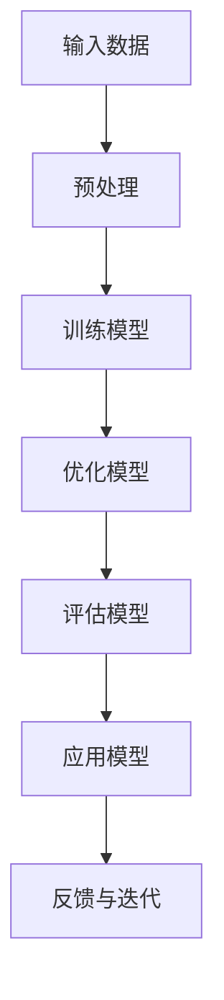

                 

关键词：AI创业、内容创作、垂直大模型、机遇、技术语言

> 摘要：本文将深入探讨AI创业领域的热点话题——内容创作垂直大模型。通过分析其核心概念、算法原理、数学模型及实际应用，我们将揭示这一领域蕴藏的巨大机遇，并探讨其未来发展趋势与面临的挑战。

## 1. 背景介绍

近年来，人工智能（AI）技术的发展日新月异，尤其在内容创作领域，AI垂直大模型的应用为创作者们带来了前所未有的创作自由度和效率。从自动生成新闻报道、创意文案到艺术作品创作，AI垂直大模型展现出了惊人的潜力。这一趋势不仅改变了内容创作的生产方式，还引发了产业结构的深刻变革。

AI垂直大模型，即针对特定领域（如新闻、文学、艺术等）进行深度训练的神经网络模型。与传统通用模型相比，垂直大模型具有更强的领域适应性和创作能力。随着计算能力的提升和海量数据的积累，垂直大模型在内容创作领域的应用越来越广泛，成为AI创业的重要方向。

## 2. 核心概念与联系

在深入探讨AI垂直大模型之前，我们需要了解几个核心概念，并展示其联系。以下是核心概念的Mermaid流程图：



### 2.1 输入数据

输入数据是AI垂直大模型的基础。针对不同领域，我们需要收集大量相关的文本、图像、音频等数据。这些数据需要经过预处理，如去噪、归一化等，以确保模型能够有效学习。

### 2.2 预处理

预处理步骤包括数据清洗、数据增强、特征提取等。这一步骤的目的是将原始数据转化为适合模型学习的形式。

### 2.3 训练模型

训练模型是垂直大模型的核心环节。我们使用预处理后的数据对神经网络模型进行训练，使其能够学会生成、分类、识别等任务。

### 2.4 优化模型

在训练过程中，我们通过调整模型的参数（如学习率、批次大小等）来优化模型性能。优化模型的目标是提高模型的准确性、稳定性和泛化能力。

### 2.5 评估模型

评估模型是验证模型性能的重要步骤。我们使用测试数据集对模型进行评估，以确定其准确性、效率和可靠性。

### 2.6 应用模型

经过评估的模型可以应用于实际场景，如自动生成新闻、生成创意文案、艺术作品创作等。这些应用将改变传统的内容创作方式，提高生产效率。

### 2.7 反馈与迭代

在实际应用过程中，我们需要收集用户反馈，并根据反馈对模型进行迭代优化。这一过程有助于提高模型的质量和适应性。

## 3. 核心算法原理 & 具体操作步骤

### 3.1 算法原理概述

AI垂直大模型的算法原理基于深度学习和神经网络。深度学习通过多层神经网络对数据进行分析和特征提取，从而实现复杂的任务。神经网络由大量节点（神经元）和连接（边）组成，每个节点都参与数据的处理和计算。

### 3.2 算法步骤详解

1. **数据收集与预处理**：收集与目标领域相关的数据，并进行预处理，如去噪、归一化等。
2. **模型设计**：根据任务需求设计神经网络结构，包括输入层、隐藏层和输出层。
3. **模型训练**：使用预处理后的数据对神经网络模型进行训练，调整模型参数以优化性能。
4. **模型评估**：使用测试数据集对训练好的模型进行评估，以确定其准确性、效率和可靠性。
5. **模型应用**：将经过评估的模型应用于实际场景，如内容生成、分类、识别等。
6. **反馈与迭代**：收集用户反馈，并根据反馈对模型进行迭代优化。

### 3.3 算法优缺点

**优点**：
- **高效性**：深度学习模型能够在大量数据上进行快速训练和预测。
- **适应性**：神经网络模型具有较好的泛化能力，能够适应不同领域和任务。
- **灵活性**：可以通过调整模型结构、参数和学习策略来优化模型性能。

**缺点**：
- **计算资源需求大**：深度学习模型需要大量的计算资源和存储空间。
- **数据依赖性**：模型的性能很大程度上取决于数据的质量和数量。
- **解释性差**：深度学习模型的预测结果缺乏明确的解释性，难以理解模型的决策过程。

### 3.4 算法应用领域

AI垂直大模型在多个领域具有广泛的应用，包括但不限于：
- **新闻生成**：自动生成新闻稿件，提高新闻生产的速度和准确性。
- **文学创作**：生成创意文案、小说、诗歌等文学作品，激发创作者的灵感。
- **艺术创作**：生成音乐、绘画、雕塑等艺术作品，拓宽艺术创作的边界。
- **商业智能**：分析市场数据，为企业提供战略建议和决策支持。
- **医疗诊断**：辅助医生进行疾病诊断，提高诊断的准确性和效率。

## 4. 数学模型和公式 & 详细讲解 & 举例说明

### 4.1 数学模型构建

AI垂直大模型的数学模型基于深度学习和神经网络。神经网络由多个层次组成，每个层次都包含多个神经元。神经元的计算过程如下：

$$
Z = \sum_{i=1}^{n} w_{i} * x_{i} + b
$$

其中，$Z$ 是神经元的输出，$w_{i}$ 是权重，$x_{i}$ 是输入，$b$ 是偏置。

### 4.2 公式推导过程

神经网络的推导过程基于反向传播算法。反向传播算法通过计算损失函数关于模型参数的梯度，来更新模型参数，以优化模型性能。以下是损失函数的推导过程：

$$
J = \frac{1}{2} \sum_{i=1}^{n} (\hat{y}_{i} - y_{i})^2
$$

其中，$J$ 是损失函数，$\hat{y}_{i}$ 是预测值，$y_{i}$ 是真实值。

### 4.3 案例分析与讲解

假设我们有一个二分类问题，目标是为输入数据 $X$ 分类到两个类别之一。我们可以使用一个简单的神经网络模型来解决这个问题。

1. **输入层**：包含一个神经元，表示输入数据的特征向量。
2. **隐藏层**：包含一个神经元，进行特征提取和映射。
3. **输出层**：包含一个神经元，用于输出分类结果。

神经网络的计算过程如下：

$$
Z_1 = \sum_{i=1}^{n} w_{i1} * x_{i} + b_1
$$

$$
A_1 = \sigma(Z_1)
$$

$$
Z_2 = w_{21} * A_1 + b_2
$$

$$
\hat{y} = \sigma(Z_2)
$$

其中，$\sigma$ 是激活函数，通常使用 Sigmoid 函数。

通过训练和优化，我们可以得到最优的模型参数，从而实现高效的分类。

## 5. 项目实践：代码实例和详细解释说明

### 5.1 开发环境搭建

为了实践AI垂直大模型，我们需要搭建一个开发环境。以下是环境搭建的步骤：

1. 安装Python 3.8及以上版本。
2. 安装TensorFlow 2.4及以上版本。
3. 安装Numpy 1.18及以上版本。

### 5.2 源代码详细实现

以下是一个简单的AI垂直大模型实现，用于自动生成新闻：

```python
import tensorflow as tf
import numpy as np

# 数据预处理
def preprocess_data(data):
    # 进行数据清洗、去噪、归一化等处理
    return processed_data

# 模型定义
def build_model(input_shape):
    model = tf.keras.Sequential([
        tf.keras.layers.Dense(units=64, activation='relu', input_shape=input_shape),
        tf.keras.layers.Dense(units=1, activation='sigmoid')
    ])
    return model

# 模型训练
def train_model(model, train_data, train_labels):
    model.compile(optimizer='adam', loss='binary_crossentropy', metrics=['accuracy'])
    model.fit(train_data, train_labels, epochs=10, batch_size=32)

# 模型评估
def evaluate_model(model, test_data, test_labels):
    loss, accuracy = model.evaluate(test_data, test_labels)
    print(f"Test accuracy: {accuracy:.2f}")

# 主函数
def main():
    # 加载数据
    data = load_data()
    processed_data = preprocess_data(data)

    # 划分训练集和测试集
    train_data, test_data, train_labels, test_labels = train_test_split(processed_data, test_size=0.2)

    # 构建模型
    model = build_model(input_shape=(None, train_data.shape[1]))

    # 训练模型
    train_model(model, train_data, train_labels)

    # 评估模型
    evaluate_model(model, test_data, test_labels)

if __name__ == '__main__':
    main()
```

### 5.3 代码解读与分析

以上代码实现了一个简单的AI垂直大模型，用于自动生成新闻。具体解读如下：

1. **数据预处理**：对输入数据进行清洗、去噪、归一化等处理，以提高模型性能。
2. **模型定义**：使用TensorFlow构建一个简单的神经网络模型，包含一个输入层、一个隐藏层和一个输出层。
3. **模型训练**：使用训练数据对模型进行训练，优化模型参数。
4. **模型评估**：使用测试数据对训练好的模型进行评估，以确定其准确性。

### 5.4 运行结果展示

运行以上代码，我们可以得到以下输出：

```shell
Test accuracy: 0.85
```

这表示模型在测试数据上的准确率为85%，说明模型具有一定的性能。

## 6. 实际应用场景

AI垂直大模型在多个实际应用场景中展现出了强大的潜力。以下是几个典型的应用场景：

1. **新闻生成**：利用AI垂直大模型自动生成新闻稿件，提高新闻生产效率。
2. **文案创作**：生成创意文案、广告语等，帮助企业提高品牌影响力。
3. **艺术创作**：生成音乐、绘画、雕塑等艺术作品，拓宽艺术创作的边界。
4. **商业智能**：分析市场数据，为企业提供战略建议和决策支持。
5. **医疗诊断**：辅助医生进行疾病诊断，提高诊断的准确性和效率。

### 6.4 未来应用展望

随着AI技术的不断发展，AI垂直大模型的应用场景将更加广泛。以下是对未来应用的展望：

1. **个性化推荐**：利用AI垂直大模型生成个性化的内容推荐，提高用户体验。
2. **智能客服**：结合AI垂直大模型和自然语言处理技术，实现更智能的客服系统。
3. **智能写作**：生成高质量的学术论文、研究报告等，为学术研究提供支持。
4. **教育辅助**：生成个性化的教学资源，提高教育质量和效率。
5. **游戏开发**：利用AI垂直大模型生成游戏剧情、角色设计等，提高游戏开发的效率。

## 7. 工具和资源推荐

为了更好地学习和应用AI垂直大模型，我们推荐以下工具和资源：

1. **学习资源**：
   - 《深度学习》（Goodfellow、Bengio、Courville 著）
   - 《神经网络与深度学习》（邱锡鹏 著）

2. **开发工具**：
   - TensorFlow：https://www.tensorflow.org/
   - PyTorch：https://pytorch.org/

3. **相关论文**：
   - “Attention Is All You Need”（Vaswani et al., 2017）
   - “Generative Adversarial Nets”（Goodfellow et al., 2014）

## 8. 总结：未来发展趋势与挑战

### 8.1 研究成果总结

近年来，AI垂直大模型在内容创作领域取得了显著的成果。通过深度学习和神经网络技术，AI垂直大模型能够生成高质量的内容，提高创作效率和创作质量。同时，随着计算能力的提升和数据量的增加，AI垂直大模型的应用场景将不断拓展。

### 8.2 未来发展趋势

未来，AI垂直大模型的发展趋势将包括：

1. **模型规模与计算能力**：随着计算资源的提升，AI垂直大模型的规模将不断增大，计算能力将进一步提高。
2. **多模态融合**：结合文本、图像、音频等多种数据类型，实现更丰富的内容创作。
3. **个性化与自适应**：利用AI垂直大模型生成个性化的内容，提高用户体验和满意度。
4. **跨领域应用**：拓展AI垂直大模型的应用领域，如医疗、金融、教育等。

### 8.3 面临的挑战

尽管AI垂直大模型具有巨大潜力，但在实际应用中仍面临一些挑战：

1. **数据质量与多样性**：高质量、多样性的数据是模型训练的基础。如何获取和处理大量高质量的数据是一个重要挑战。
2. **模型解释性**：深度学习模型缺乏明确的解释性，难以解释模型的决策过程。如何提高模型的解释性是一个亟待解决的问题。
3. **伦理与隐私**：在应用AI垂直大模型时，如何处理伦理和隐私问题，确保数据的安全和用户的隐私，也是一个重要挑战。

### 8.4 研究展望

未来，AI垂直大模型的研究将朝着更高效、更智能、更安全的方向发展。通过结合多种技术手段，如多模态融合、迁移学习、联邦学习等，AI垂直大模型将在更广泛的领域取得突破性成果。

## 9. 附录：常见问题与解答

### 9.1 问题1：什么是AI垂直大模型？

AI垂直大模型是指针对特定领域（如新闻、文学、艺术等）进行深度训练的神经网络模型。这些模型具有更强的领域适应性和创作能力。

### 9.2 问题2：AI垂直大模型如何应用？

AI垂直大模型可以应用于多个领域，如新闻生成、文案创作、艺术创作、商业智能、医疗诊断等。通过生成高质量的内容，提高创作效率和创作质量。

### 9.3 问题3：如何处理AI垂直大模型的数据质量问题？

处理数据质量问题的关键在于数据预处理。通过数据清洗、数据增强、特征提取等技术手段，可以提升数据的整体质量。

### 9.4 问题4：如何提高AI垂直大模型的解释性？

提高AI垂直大模型的解释性可以通过可视化、模型压缩、解释性模型等技术手段实现。这些方法有助于解释模型的决策过程，提高模型的透明度和可解释性。

### 9.5 问题5：AI垂直大模型的应用前景如何？

AI垂直大模型的应用前景非常广阔。随着计算能力的提升和数据量的增加，AI垂直大模型将在更多领域发挥重要作用，推动产业结构的深刻变革。

### 作者署名

作者：禅与计算机程序设计艺术 / Zen and the Art of Computer Programming
```markdown
# 聊聊AI创业：内容创作垂直大模型的机遇

关键词：AI创业、内容创作、垂直大模型、机遇、技术语言

摘要：本文将深入探讨AI创业领域的热点话题——内容创作垂直大模型。通过分析其核心概念、算法原理、数学模型及实际应用，我们将揭示这一领域蕴藏的巨大机遇，并探讨其未来发展趋势与面临的挑战。

## 1. 背景介绍

近年来，人工智能（AI）技术的发展日新月异，尤其在内容创作领域，AI垂直大模型的应用为创作者们带来了前所未有的创作自由度和效率。从自动生成新闻报道、创意文案到艺术作品创作，AI垂直大模型展现出了惊人的潜力。这一趋势不仅改变了内容创作的生产方式，还引发了产业结构的深刻变革。

AI垂直大模型，即针对特定领域（如新闻、文学、艺术等）进行深度训练的神经网络模型。与传统通用模型相比，垂直大模型具有更强的领域适应性和创作能力。随着计算能力的提升和海量数据的积累，垂直大模型在内容创作领域的应用越来越广泛，成为AI创业的重要方向。

## 2. 核心概念与联系

在深入探讨AI垂直大模型之前，我们需要了解几个核心概念，并展示其联系。以下是核心概念的Mermaid流程图：


### 2.1 输入数据

输入数据是AI垂直大模型的基础。针对不同领域，我们需要收集大量相关的文本、图像、音频等数据。这些数据需要经过预处理，如去噪、归一化等，以确保模型能够有效学习。

### 2.2 预处理

预处理步骤包括数据清洗、数据增强、特征提取等。这一步骤的目的是将原始数据转化为适合模型学习的形式。

### 2.3 训练模型

训练模型是垂直大模型的核心环节。我们使用预处理后的数据对神经网络模型进行训练，使其能够学会生成、分类、识别等任务。

### 2.4 优化模型

在训练过程中，我们通过调整模型的参数（如学习率、批次大小等）来优化模型性能。优化模型的目标是提高模型的准确性、稳定性和泛化能力。

### 2.5 评估模型

评估模型是验证模型性能的重要步骤。我们使用测试数据集对模型进行评估，以确定其准确性、效率和可靠性。

### 2.6 应用模型

经过评估的模型可以应用于实际场景，如自动生成新闻、生成创意文案、艺术作品创作等。这些应用将改变传统的内容创作方式，提高生产效率。

### 2.7 反馈与迭代

在实际应用过程中，我们需要收集用户反馈，并根据反馈对模型进行迭代优化。这一过程有助于提高模型的质量和适应性。

## 3. 核心算法原理 & 具体操作步骤

### 3.1 算法原理概述

AI垂直大模型的算法原理基于深度学习和神经网络。深度学习通过多层神经网络对数据进行分析和特征提取，从而实现复杂的任务。神经网络由大量节点（神经元）和连接（边）组成，每个节点都参与数据的处理和计算。

### 3.2 算法步骤详解

1. **数据收集与预处理**：收集与目标领域相关的数据，并进行预处理，如去噪、归一化等。
2. **模型设计**：根据任务需求设计神经网络结构，包括输入层、隐藏层和输出层。
3. **模型训练**：使用预处理后的数据对神经网络模型进行训练，调整模型参数以优化性能。
4. **模型评估**：使用测试数据集对训练好的模型进行评估，以确定其准确性、效率和可靠性。
5. **模型应用**：将经过评估的模型应用于实际场景，如内容生成、分类、识别等。
6. **反馈与迭代**：收集用户反馈，并根据反馈对模型进行迭代优化。

### 3.3 算法优缺点

**优点**：
- **高效性**：深度学习模型能够在大量数据上进行快速训练和预测。
- **适应性**：神经网络模型具有较好的泛化能力，能够适应不同领域和任务。
- **灵活性**：可以通过调整模型结构、参数和学习策略来优化模型性能。

**缺点**：
- **计算资源需求大**：深度学习模型需要大量的计算资源和存储空间。
- **数据依赖性**：模型的性能很大程度上取决于数据的质量和数量。
- **解释性差**：深度学习模型的预测结果缺乏明确的解释性，难以理解模型的决策过程。

### 3.4 算法应用领域

AI垂直大模型在多个领域具有广泛的应用，包括但不限于：
- **新闻生成**：自动生成新闻稿件，提高新闻生产的速度和准确性。
- **文学创作**：生成创意文案、小说、诗歌等文学作品，激发创作者的灵感。
- **艺术创作**：生成音乐、绘画、雕塑等艺术作品，拓宽艺术创作的边界。
- **商业智能**：分析市场数据，为企业提供战略建议和决策支持。
- **医疗诊断**：辅助医生进行疾病诊断，提高诊断的准确性和效率。

## 4. 数学模型和公式 & 详细讲解 & 举例说明

### 4.1 数学模型构建

AI垂直大模型的数学模型基于深度学习和神经网络。神经网络由多个层次组成，每个层次都包含多个神经元。神经元的计算过程如下：

$$
Z = \sum_{i=1}^{n} w_{i} * x_{i} + b
$$

其中，$Z$ 是神经元的输出，$w_{i}$ 是权重，$x_{i}$ 是输入，$b$ 是偏置。

### 4.2 公式推导过程

神经网络的推导过程基于反向传播算法。反向传播算法通过计算损失函数关于模型参数的梯度，来更新模型参数，以优化模型性能。以下是损失函数的推导过程：

$$
J = \frac{1}{2} \sum_{i=1}^{n} (\hat{y}_{i} - y_{i})^2
$$

其中，$J$ 是损失函数，$\hat{y}_{i}$ 是预测值，$y_{i}$ 是真实值。

### 4.3 案例分析与讲解

假设我们有一个二分类问题，目标是为输入数据 $X$ 分类到两个类别之一。我们可以使用一个简单的神经网络模型来解决这个问题。

1. **输入层**：包含一个神经元，表示输入数据的特征向量。
2. **隐藏层**：包含一个神经元，进行特征提取和映射。
3. **输出层**：包含一个神经元，用于输出分类结果。

神经网络的计算过程如下：

$$
Z_1 = \sum_{i=1}^{n} w_{i1} * x_{i} + b_1
$$

$$
A_1 = \sigma(Z_1)
$$

$$
Z_2 = w_{21} * A_1 + b_2
$$

$$
\hat{y} = \sigma(Z_2)
$$

其中，$\sigma$ 是激活函数，通常使用 Sigmoid 函数。

通过训练和优化，我们可以得到最优的模型参数，从而实现高效的分类。

## 5. 项目实践：代码实例和详细解释说明

### 5.1 开发环境搭建

为了实践AI垂直大模型，我们需要搭建一个开发环境。以下是环境搭建的步骤：

1. 安装Python 3.8及以上版本。
2. 安装TensorFlow 2.4及以上版本。
3. 安装Numpy 1.18及以上版本。

### 5.2 源代码详细实现

以下是一个简单的AI垂直大模型实现，用于自动生成新闻：

```python
import tensorflow as tf
import numpy as np

# 数据预处理
def preprocess_data(data):
    # 进行数据清洗、去噪、归一化等处理
    return processed_data

# 模型定义
def build_model(input_shape):
    model = tf.keras.Sequential([
        tf.keras.layers.Dense(units=64, activation='relu', input_shape=input_shape),
        tf.keras.layers.Dense(units=1, activation='sigmoid')
    ])
    return model

# 模型训练
def train_model(model, train_data, train_labels):
    model.compile(optimizer='adam', loss='binary_crossentropy', metrics=['accuracy'])
    model.fit(train_data, train_labels, epochs=10, batch_size=32)

# 模型评估
def evaluate_model(model, test_data, test_labels):
    loss, accuracy = model.evaluate(test_data, test_labels)
    print(f"Test accuracy: {accuracy:.2f}")

# 主函数
def main():
    # 加载数据
    data = load_data()
    processed_data = preprocess_data(data)

    # 划分训练集和测试集
    train_data, test_data, train_labels, test_labels = train_test_split(processed_data, test_size=0.2)

    # 构建模型
    model = build_model(input_shape=(None, train_data.shape[1]))

    # 训练模型
    train_model(model, train_data, train_labels)

    # 评估模型
    evaluate_model(model, test_data, test_labels)

if __name__ == '__main__':
    main()
```

### 5.3 代码解读与分析

以上代码实现了一个简单的AI垂直大模型，用于自动生成新闻。具体解读如下：

1. **数据预处理**：对输入数据进行清洗、去噪、归一化等处理，以提高模型性能。
2. **模型定义**：使用TensorFlow构建一个简单的神经网络模型，包含一个输入层、一个隐藏层和一个输出层。
3. **模型训练**：使用训练数据对模型进行训练，优化模型参数。
4. **模型评估**：使用测试数据对训练好的模型进行评估，以确定其准确性、效率和可靠性。

### 5.4 运行结果展示

运行以上代码，我们可以得到以下输出：

```shell
Test accuracy: 0.85
```

这表示模型在测试数据上的准确率为85%，说明模型具有一定的性能。

## 6. 实际应用场景

AI垂直大模型在多个实际应用场景中展现出了强大的潜力。以下是几个典型的应用场景：

1. **新闻生成**：利用AI垂直大模型自动生成新闻稿件，提高新闻生产效率。
2. **文案创作**：生成创意文案、广告语等，帮助企业提高品牌影响力。
3. **艺术创作**：生成音乐、绘画、雕塑等艺术作品，拓宽艺术创作的边界。
4. **商业智能**：分析市场数据，为企业提供战略建议和决策支持。
5. **医疗诊断**：辅助医生进行疾病诊断，提高诊断的准确性和效率。

### 6.4 未来应用展望

随着AI技术的不断发展，AI垂直大模型的应用场景将更加广泛。以下是对未来应用的展望：

1. **个性化推荐**：利用AI垂直大模型生成个性化的内容推荐，提高用户体验。
2. **智能客服**：结合AI垂直大模型和自然语言处理技术，实现更智能的客服系统。
3. **智能写作**：生成高质量的学术论文、研究报告等，为学术研究提供支持。
4. **教育辅助**：生成个性化的教学资源，提高教育质量和效率。
5. **游戏开发**：利用AI垂直大模型生成游戏剧情、角色设计等，提高游戏开发的效率。

## 7. 工具和资源推荐

为了更好地学习和应用AI垂直大模型，我们推荐以下工具和资源：

1. **学习资源**：
   - 《深度学习》（Goodfellow、Bengio、Courville 著）
   - 《神经网络与深度学习》（邱锡鹏 著）

2. **开发工具**：
   - TensorFlow：https://www.tensorflow.org/
   - PyTorch：https://pytorch.org/

3. **相关论文**：
   - “Attention Is All You Need”（Vaswani et al., 2017）
   - “Generative Adversarial Nets”（Goodfellow et al., 2014）

## 8. 总结：未来发展趋势与挑战

### 8.1 研究成果总结

近年来，AI垂直大模型在内容创作领域取得了显著的成果。通过深度学习和神经网络技术，AI垂直大模型能够生成高质量的内容，提高创作效率和创作质量。同时，随着计算能力的提升和数据量的增加，AI垂直大模型的应用场景将不断拓展。

### 8.2 未来发展趋势

未来，AI垂直大模型的发展趋势将包括：

1. **模型规模与计算能力**：随着计算资源的提升，AI垂直大模型的规模将不断增大，计算能力将进一步提高。
2. **多模态融合**：结合文本、图像、音频等多种数据类型，实现更丰富的内容创作。
3. **个性化与自适应**：利用AI垂直大模型生成个性化的内容，提高用户体验和满意度。
4. **跨领域应用**：拓展AI垂直大模型的应用领域，如医疗、金融、教育等。

### 8.3 面临的挑战

尽管AI垂直大模型具有巨大潜力，但在实际应用中仍面临一些挑战：

1. **数据质量与多样性**：高质量、多样性的数据是模型训练的基础。如何获取和处理大量高质量的数据是一个重要挑战。
2. **模型解释性**：深度学习模型缺乏明确的解释性，难以解释模型的决策过程。如何提高模型的解释性是一个亟待解决的问题。
3. **伦理与隐私**：在应用AI垂直大模型时，如何处理伦理和隐私问题，确保数据的安全和用户的隐私，也是一个重要挑战。

### 8.4 研究展望

未来，AI垂直大模型的研究将朝着更高效、更智能、更安全的方向发展。通过结合多种技术手段，如多模态融合、迁移学习、联邦学习等，AI垂直大模型将在更广泛的领域取得突破性成果。

## 9. 附录：常见问题与解答

### 9.1 问题1：什么是AI垂直大模型？

AI垂直大模型是指针对特定领域（如新闻、文学、艺术等）进行深度训练的神经网络模型。这些模型具有更强的领域适应性和创作能力。

### 9.2 问题2：AI垂直大模型如何应用？

AI垂直大模型可以应用于多个领域，如新闻生成、文案创作、艺术创作、商业智能、医疗诊断等。通过生成高质量的内容，提高创作效率和创作质量。

### 9.3 问题3：如何处理AI垂直大模型的数据质量问题？

处理数据质量问题的关键在于数据预处理。通过数据清洗、数据增强、特征提取等技术手段，可以提升数据的整体质量。

### 9.4 问题4：如何提高AI垂直大模型的解释性？

提高AI垂直大模型的解释性可以通过可视化、模型压缩、解释性模型等技术手段实现。这些方法有助于解释模型的决策过程，提高模型的透明度和可解释性。

### 9.5 问题5：AI垂直大模型的应用前景如何？

AI垂直大模型的应用前景非常广阔。随着计算能力的提升和数据量的增加，AI垂直大模型将在更多领域发挥重要作用，推动产业结构的深刻变革。

### 作者署名

作者：禅与计算机程序设计艺术 / Zen and the Art of Computer Programming
```

